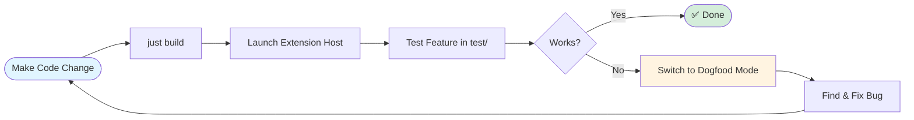
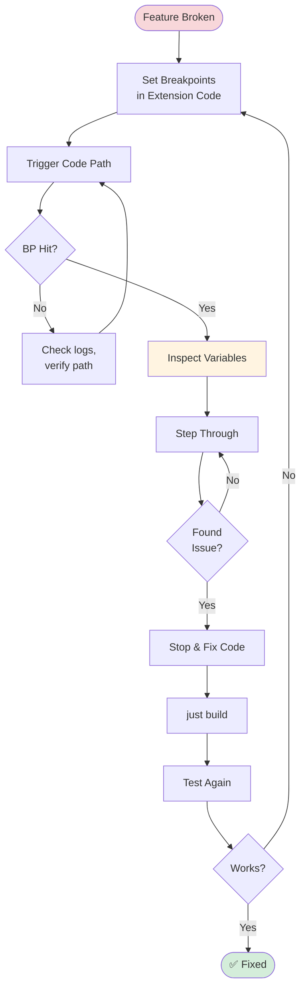

# LLM Agent Guide: Developing & Debugging VSC Bridge

**Purpose**: Complete workflow for LLM agents to develop features and debug VSC Bridge extension using only CLI commands.

**Key Insight**: Run `vscb` from **project root** to access both development and dogfooding modes.

---

## Two Modes, Same Location

Run all `vscb` commands from `vsc-bridge/` (project root):

| Mode | What You're Doing | How |
|------|-------------------|-----|
| **Development Mode** | Testing features in simulation workspace | Interact with `test/` workspace via CLI |
| **Dogfood Mode** | Debugging extension code itself | Set breakpoints in `extension/src/` |

**The difference**: What you target with your commands, not where you run them from.

---

## The Development Loop

### Overview



### Step-by-Step

#### 1. Make Your Change

Edit extension code in `extension/src/`:

```bash
# Example: Fix a bug in ScriptRegistry
# Edit: extension/src/core/registry/ScriptRegistry.ts
```

#### 2. Build

```bash
just build
```

Verify successful build (no webpack errors).

#### 3. Launch Extension Host

```bash
# From project root
vscb script run debug.start --param launch="Run Extension"
```

**What happens**:
- Extension Development Host launches
- Opens with project workspace (`vsc-bridge/`)
- Extension activates
- Ready to test!

#### 4. Test Your Feature

**Example: Testing breakpoint functionality**

```bash
# Set a breakpoint in test file
vscb script run bp.set \
  --param path="$(pwd)/test/python/test_example.py" \
  --param line=29

# Verify it was set
vscb script run bp.list
```

**Example: Testing debug session**

```bash
# Start debugging a test
vscb script run tests.debug-single \
  --param path="$(pwd)/test/python/test_example.py" \
  --param line=29

# Should pause at line 29
# Check variables
vscb script run debug.list-variables --param scope=local

# Clean up
vscb script run debug.stop
```

#### 5. Evaluate

**If it works**: ✅ You're done! Stop the Extension Host:

```bash
vscb script run debug.stop
```

**If it doesn't work**: → Switch to Dogfood Mode ↓

### Real Example: Debugging Extension Initialization

**Scenario**: You want to understand how the filesystem bridge initializes.

```bash
# 1. Build
just build

# 2. Set breakpoint in bridge initialization
vscb script run bp.set \
  --param path="$(pwd)/extension/src/core/fs-bridge/bridge.ts" \
  --param line=38

# Output:
# {
#   "ok": true,
#   "data": {
#     "breakpoint": {
#       "path": "/path/to/extension/src/core/fs-bridge/bridge.ts",
#       "line": 38,
#       "enabled": true,
#       "verified": true
#     }
#   }
# }

# 3. Launch Extension Host
vscb script run debug.start --param launch="Run Extension" --param timeoutMs=60000

# Output:
# {
#   "ok": true,
#   "data": {
#     "sessionId": "9ff29afa-32b5-482c-b430-2c74e3d31a2a",
#     "sessionName": "Run Extension",
#     "adapterType": "pwa-extensionHost",
#     ...
#   }
# }

# 4. Check status - breakpoint was hit during activation!
vscb script run debug.status

# Output shows:
# {
#   "ok": true,
#   "data": {
#     "isPaused": true,
#     "currentLocation": {
#       "source": ".../extension/src/core/fs-bridge/bridge.ts",
#       "line": 38,
#       "functionName": "initBridgeForWorkspace"
#     },
#     "stackFrames": [
#       {
#         "name": "initBridgeForWorkspace",
#         "line": 38,
#         "source": { "path": ".../bridge.ts" }
#       },
#       {
#         "name": "initBridge",
#         "line": 24,
#         "source": { "path": ".../bridge.ts" }
#       },
#       {
#         "name": "BridgeManager.initialize",
#         "line": 61,
#         "source": { "path": ".../index.ts" }
#       },
#       {
#         "name": "activate",
#         "line": 143,
#         "source": { "path": ".../extension.ts" }
#       }
#     ],
#     ...
#   }
# }

# 5. Success! We hit the breakpoint and can see the full activation call stack:
#    activate() → initializeFileSystemBridge() → BridgeManager.initialize()
#    → initBridge() → initBridgeForWorkspace()
```

**Key Observations**:
- ✅ Breakpoint set in extension source code
- ✅ Extension Host launched via CLI
- ✅ Breakpoint hit automatically during extension activation
- ✅ Full call stack visible showing initialization flow
- ⚠️ Variable inspection limited (Extension Host uses `pwa-chrome` adapter which we don't support yet)

**Note**: For Extension Host debugging, variable inspection (`debug.list-variables`, `debug.evaluate`) doesn't work yet because we need a `pwa-chrome` adapter. However, call stack viewing and stepping commands work fine!

---

## Dogfood Mode: Debugging the Extension Itself

### When to Use

- Feature doesn't work as expected
- Need to understand how code flows
- Investigating a bug in extension logic
- Want to inspect internal state

### The Dogfood Loop



### Step-by-Step Dogfooding

#### 1. Set Breakpoints in Extension Code

**Key**: Set breakpoints in `extension/src/` TypeScript files.

```bash
# Example: Debug script execution
vscb script run bp.set \
  --param path="$(pwd)/extension/src/core/registry/ScriptRegistry.ts" \
  --param line=259

# Example: Debug command processing
vscb script run bp.set \
  --param path="$(pwd)/extension/src/core/fs-bridge/processor.ts" \
  --param line=85

# Example: Debug filesystem bridge
vscb script run bp.set \
  --param path="$(pwd)/extension/src/core/fs-bridge/bridge.ts" \
  --param line=38
```

#### 2. Trigger the Code Path

**The magic**: When you run CLI commands, they trigger extension code that hits your breakpoints!

```bash
# This triggers ScriptRegistry.execute(), hitting your breakpoint
vscb script run bp.list
```

**Extension Host pauses at breakpoint** → Now you can inspect!

#### 3. Inspect State

```bash
# View call stack
vscb script run debug.stack

# List local variables
vscb script run debug.list-variables --param scope=local

# Evaluate expressions
vscb script run debug.evaluate --param expression="scriptName"
vscb script run debug.evaluate --param expression="JSON.stringify(params)"

# Check object properties
vscb script run debug.evaluate --param expression="this.scripts.size"
```

**Example output**:

```json
{
  "ok": true,
  "data": {
    "stackFrames": [
      {
        "name": "execute",
        "source": { "path": ".../ScriptRegistry.ts" },
        "line": 259
      },
      {
        "name": "processCommand",
        "source": { "path": ".../processor.ts" },
        "line": 85
      }
    ]
  }
}
```

#### 4. Step Through Code

```bash
# Step over (execute line, don't enter functions)
vscb script run debug.step-over

# Inspect again
vscb script run debug.list-variables --param scope=local

# Step into (enter function call)
vscb script run debug.step-into

# Step out (return to caller)
vscb script run debug.step-out

# Continue to next breakpoint
vscb script run debug.continue
```

#### 5. Find the Bug

**Example investigation**:

```bash
# At breakpoint in ScriptRegistry.execute()
vscb script run debug.evaluate --param expression="scriptName"
# → "bp.list"

vscb script run debug.evaluate --param expression="this.scripts.has('bp.list')"
# → true

# Step over the script loading line
vscb script run debug.step-over

vscb script run debug.evaluate --param expression="script"
# → undefined  ← FOUND THE BUG!
```

#### 6. Stop Debugging

```bash
vscb script run debug.stop
```

#### 7. Fix the Code

Edit the file based on what you discovered:

```typescript
// Before (bug)
const script = this.scripts[scriptName];

// After (fix)
const script = this.scripts.get(scriptName);
```

#### 8. Rebuild & Test

```bash
# Rebuild
just build

# Launch again
vscb script run debug.start --param launch="Run Extension"

# Test the fix (no breakpoint this time)
vscb script run bp.list
# → Should work now!

# Stop
vscb script run debug.stop
```

---

## Common Scenarios

### Scenario 1: Testing a New Script

```bash
# 1. Build
just build

# 2. Launch
vscb script run debug.start --param launch="Run Extension"

# 3. Test your new script
vscb script run my-new-script --param foo=bar

# 4. Verify output
# (Check response for expected result)

# 5. Clean up
vscb script run debug.stop
```

### Scenario 2: Debugging Script Execution Flow

```bash
# 1. Set breakpoint at script entry
vscb script run bp.set \
  --param path="$(pwd)/extension/src/core/registry/ScriptRegistry.ts" \
  --param line=259

# 2. Launch
vscb script run debug.start --param launch="Run Extension"

# 3. Trigger (will hit breakpoint)
vscb script run bp.list

# 4. Inspect
vscb script run debug.stack
vscb script run debug.list-variables --param scope=local

# 5. Step through
vscb script run debug.step-over
vscb script run debug.step-into
# ... step through execution

# 6. Continue
vscb script run debug.continue

# 7. Stop
vscb script run debug.stop
```

### Scenario 3: Debugging Filesystem Bridge

```bash
# 1. Set breakpoint in command processor
vscb script run bp.set \
  --param path="$(pwd)/extension/src/core/fs-bridge/processor.ts" \
  --param line=85

# 2. Launch
vscb script run debug.start --param launch="Run Extension"

# 3. Any command will trigger it
vscb script run bp.list

# 4. Inspect command processing
vscb script run debug.list-variables --param scope=local
vscb script run debug.evaluate --param expression="command.scriptName"

# 5. Step through
vscb script run debug.step-over

# 6. Stop
vscb script run debug.stop
```

### Scenario 4: Full Fix-Debug-Repeat Cycle

```bash
# === Iteration 1: Test ===
just build
vscb script run debug.start --param launch="Run Extension"
vscb script run bp.set --param path="$(pwd)/test/python/test_example.py" --param line=29
# → Error: Breakpoint not set

# === Iteration 2: Debug ===
vscb script run bp.set \
  --param path="$(pwd)/extension/src/vsc-scripts/breakpoint/set.js" \
  --param line=35

vscb script run bp.set --param path="$(pwd)/test/python/test_example.py" --param line=29
# → Hits breakpoint

vscb script run debug.evaluate --param expression="params.path"
# → Incorrect path format

vscb script run debug.stop

# === Iteration 3: Fix ===
# Edit extension/src/vsc-scripts/breakpoint/set.js
# Fix path handling

just build
vscb script run debug.start --param launch="Run Extension"
vscb script run bp.set --param path="$(pwd)/test/python/test_example.py" --param line=29
# → ✅ Works!

vscb script run debug.stop
```

---

## Quick Reference

### Essential Commands

```bash
# Build
just build

# Launch Extension Host
vscb script run debug.start --param launch="Run Extension"

# Stop Extension Host
vscb script run debug.stop

# Set breakpoint
vscb script run bp.set --param path=<absolute-path> --param line=<number>

# List breakpoints
vscb script run bp.list

# Clear all breakpoints
vscb script run bp.clear.project

# View call stack (when paused)
vscb script run debug.stack

# List variables (when paused)
vscb script run debug.list-variables --param scope=local

# Evaluate expression (when paused)
vscb script run debug.evaluate --param expression="<js-expression>"

# Step commands (when paused)
vscb script run debug.step-over
vscb script run debug.step-into
vscb script run debug.step-out
vscb script run debug.continue
```

### Common Breakpoint Locations

```bash
# Script execution entry point
extension/src/core/registry/ScriptRegistry.ts:259

# Command processing
extension/src/core/fs-bridge/processor.ts:85

# Bridge initialization
extension/src/core/fs-bridge/bridge.ts:38

# Extension activation
extension/src/extension.ts:17

# Specific script (example: bp.set)
extension/src/vsc-scripts/breakpoint/set.js:35
```

### Where to Run Commands

**Always from project root** (`vsc-bridge/`):

```bash
cd /path/to/vsc-bridge
vscb script run <command>
```

**Why**: The `.vsc-bridge/` directory is created in the workspace opened by Extension Host. When you launch with `--folder-uri=${workspaceFolder}` (from launch.json), it opens the project root.

---

## Troubleshooting

### Issue: Commands Timeout

**Cause**: Extension Host not running or wrong workspace.

**Solution**:
```bash
# Verify Extension Host is running
# Check for "VSC-Bridge Extension Activated" message

# If not running, launch:
vscb script run debug.start --param launch="Run Extension"
```

### Issue: Breakpoint Doesn't Hit

**Cause**: Code path not triggered or wrong file.

**Solution**:
```bash
# 1. Verify breakpoint was set
vscb script run bp.list

# 2. Add logging to confirm code execution
# Edit the file, add console.log(), rebuild

# 3. Check source maps exist
ls extension/out/**/*.js.map
```

### Issue: Can't Inspect Variables

**Cause**: Not paused at breakpoint.

**Solution**:
```bash
# Verify you're paused
vscb script run debug.stack
# Should show current stack

# If not paused, set breakpoint and trigger again
```

### Issue: Build Fails

**Cause**: TypeScript or webpack errors.

**Solution**:
```bash
# Check build output for errors
just build

# Common fixes:
# - TypeScript errors: Fix syntax/type issues
# - Missing imports: Add import statements
# - Module not found: Check paths
```

---

## Summary

**The Complete Workflow**:

1. **Make changes** to extension code
2. **Build**: `just build`
3. **Launch**: `vscb script run debug.start --param launch="Run Extension"`
4. **Test** your feature in `test/` workspace via CLI
5. **If broken**: Set breakpoints in extension code, trigger, inspect, fix
6. **Repeat** until working
7. **Stop**: `vscb script run debug.stop`

**Key Advantages**:
- ✅ Fully automated via CLI (no manual VS Code clicking)
- ✅ Can test features AND debug extension internals
- ✅ Full loop: change → build → test → debug → fix → repeat
- ✅ All from project root, all via `vscb` commands

**Remember**:
- Run from **project root** always
- Development mode = test features in `test/` workspace
- Dogfood mode = debug extension code in `extension/src/`
- Use the same `vscb` CLI for both!
