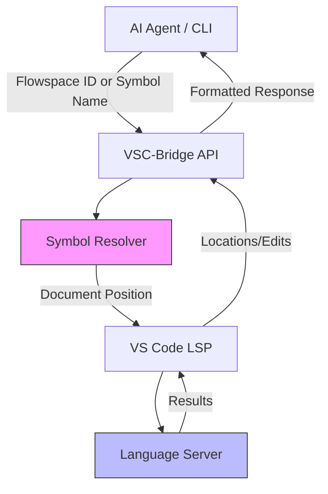

# LSP Navigation & Code Intelligence - Overview

## What is Semantic Navigation?

Semantic navigation lets you find, rename, and refactor code using **what the code means**, not where it is. Instead of specifying line 42, character 15, you use identifiers like "the add method in Calculator class" or Flowspace Node IDs like `method:src/Calculator.ts:Calculator.add`.

## Why Flowspace IDs?

**Traditional approach** (position-based):
```bash
# Fragile - breaks when code moves
find-references --file=src/Calculator.ts --line=42 --character=15
```

**VSC-Bridge approach** (semantic):
```bash
# Robust - works regardless of position
vscb script run symbol.navigate \
  --param nodeId="method:src/Calculator.ts:Calculator.add" \
  --param action="references"
```

**Benefits**:
- ✅ Works across file refactorings and edits
- ✅ No need to calculate line/character positions
- ✅ AI agents can navigate code semantically
- ✅ Position-independent automation

## Architecture



## Key Concepts

### Flowspace Node IDs

Structured identifiers for code symbols:

**Format**: `{type}:{file_path}:{symbol_path}`

**Examples**:
- `class:src/auth/service.ts:AuthService`
- `method:src/auth/service.ts:AuthService.authenticate`
- `function:src/utils/validators.ts:validateEmail`
- `file:config/settings.json`

### Symbol Names

Simple dot-notation for symbols within a file:

- `Calculator` (class)
- `Calculator.add` (method)
- `validateEmail` (function)

### LSP Providers

Language servers that power navigation:
- **TypeScript**: tsserver (built-in)
- **Python**: Pylance / pyright
- **Java**: Eclipse JDT LS
- **C#**: OmniSharp
- **Dart**: Dart Analysis Server

## The Four Tools

| Tool | Purpose | Input | Output |
|------|---------|-------|--------|
| **symbol.navigate** | Find references, implementations | Flowspace ID or symbol+path | List of locations |
| **symbol.rename** | Rename across workspace | Symbol name + new name | Applied edits count |
| **code.replace-method** | Replace method body | Method name + new code | Success/failure per file |
| **symbol.calls** | Call hierarchy | Method/function name | Incoming or outgoing calls |

## When to Use Each Tool

- **Navigate**: "Find all places this function is called"
- **Rename**: "Change this class name everywhere"
- **Replace Method**: "Update this function's implementation"
- **Calls**: "Who calls this? What does it call?"

## Next Steps

- [Quickstart Guide](./2-quickstart.md) - Try it now with examples
- [Flowspace ID Guide](./3-flowspace-ids.md) - Complete ID format reference
- [API Reference](./4-api-reference.md) - All parameters and options
- [Language Support](./5-language-support.md) - What works in each language
- [Troubleshooting](./6-troubleshooting.md) - Common errors and solutions
