# Manual Test Procedure: tests.debug-single

This document provides step-by-step manual testing procedures to verify that `tests.debug-single` works correctly across all supported test frameworks.

## Prerequisites

1. **Extension Running**: VSC-Bridge extension must be running in Extension Host debug mode
2. **Test Workspace**: Run all tests from `/test` directory
3. **Bridge Active**: Verify bridge connection with `vscb script run debug.status`

## Test Frameworks Covered

- **Python** (pytest)
- **JavaScript** (Jest)
- **C#** (xUnit)
- **Java** (JUnit 5)

## Test Procedure

For each language, follow this sequence:
1. Run `tests.debug-single` to start debugging
2. Verify the debug session paused successfully
3. Test variable inspection capabilities
4. Stop the debug session
5. Proceed to next language

### Complete Test Flow (All Languages)

```mermaid
sequenceDiagram
    participant Tester
    participant CLI as VSC-Bridge CLI
    participant Bridge as VSC-Bridge Extension
    participant Debuggers as Language Debuggers

    Note over Tester,Debuggers: TEST 1: PYTHON (pytest)
    Tester->>CLI: tests.debug-single<br/>test_example.py:29
    CLI->>Bridge: Start Python debug
    Bridge->>Debuggers: Launch pytest via debugpy
    Debuggers-->>Bridge: Paused at line 29
    Bridge-->>CLI: event=stopped, sessionType=debugpy
    CLI-->>Tester: ✅ Python session started (1-2s)

    Tester->>CLI: debug.list-variables
    CLI->>Bridge: Get local variables
    Bridge->>Debuggers: DAP scopes + variables
    Debuggers-->>Bridge: result=2 (int)
    Bridge-->>CLI: 1 variable
    CLI-->>Tester: ✅ Variable inspection works

    Tester->>CLI: debug.stop
    CLI->>Bridge: Terminate session
    Bridge->>Debuggers: Stop debugpy
    Debuggers-->>Bridge: Terminated
    Bridge-->>CLI: Session ended
    CLI-->>Tester: ✅ Python test complete

    Note over Tester,Debuggers: TEST 2: JAVASCRIPT (Jest)
    Tester->>CLI: tests.debug-single<br/>example.test.js:533
    CLI->>Bridge: Start JavaScript debug
    Bridge->>Debuggers: Launch Jest via pwa-node
    Debuggers-->>Bridge: Paused (may vary location)
    Bridge-->>CLI: event=stopped, sessionType=pwa-node
    CLI-->>Tester: ✅ JavaScript session started (1.5-3s)

    Tester->>CLI: debug.list-variables --param maxDepth=2
    CLI->>Bridge: Get local variables with depth
    Bridge->>Debuggers: DAP scopes + variables
    Debuggers-->>Bridge: calc (object), result (object)
    Bridge-->>CLI: 2 variables with references
    CLI-->>Tester: ✅ Objects have variablesReference

    Tester->>CLI: debug.get-variable<br/>variablesReference=1001
    CLI->>Bridge: Expand calc object
    Bridge->>Debuggers: DAP variables request
    Debuggers-->>Bridge: value=45, history=Array(2)
    Bridge-->>CLI: Children array
    CLI-->>Tester: ✅ Object expansion works

    Tester->>CLI: debug.stop
    CLI->>Bridge: Terminate session
    Bridge->>Debuggers: Stop pwa-node
    Debuggers-->>Bridge: Terminated
    Bridge-->>CLI: Session ended
    CLI-->>Tester: ✅ JavaScript test complete

    Note over Tester,Debuggers: TEST 3: C# (xUnit)
    Tester->>CLI: tests.debug-single<br/>CalculatorTests.cs:17
    CLI->>Bridge: Start C# debug
    Bridge->>Debuggers: Launch xUnit via coreclr
    Debuggers-->>Bridge: Paused at [External Code]
    Bridge-->>CLI: event=stopped, functionName=[External Code]
    CLI-->>Tester: ✅ C# session started (4-8s)<br/>⚠️ Paused at framework init

    Note over Tester: Manual step: Set breakpoint at line 96 in VS Code UI

    Tester->>CLI: debug.continue
    CLI->>Bridge: Continue to breakpoint
    Bridge->>Debuggers: DAP continue
    Debuggers-->>Bridge: Paused at line 96
    Bridge-->>CLI: event=stopped, line=96
    CLI-->>Tester: ✅ At test code with variables

    Tester->>CLI: debug.list-variables
    CLI->>Bridge: Get local variables
    Bridge->>Debuggers: DAP scopes + variables
    Debuggers-->>Bridge: step1=15, step2=30, step3=20
    Bridge-->>CLI: 3 variables
    CLI-->>Tester: ✅ Variable inspection works

    Tester->>CLI: debug.stop
    CLI->>Bridge: Terminate session
    Bridge->>Debuggers: Stop coreclr
    Debuggers-->>Bridge: Terminated
    Bridge-->>CLI: Session ended
    CLI-->>Tester: ✅ C# test complete

    Note over Tester,Debuggers: TEST 4: JAVA (JUnit 5)
    Tester->>CLI: tests.debug-single<br/>DebugTest.java:28
    CLI->>Bridge: Start Java debug
    Bridge->>Debuggers: Launch JUnit via java debugger
    Debuggers-->>Bridge: Paused at line 28
    Bridge-->>CLI: event=stopped, sessionType=java
    CLI-->>Tester: ✅ Java session started (3-6s)

    Tester->>CLI: debug.list-variables
    CLI->>Bridge: Get local variables
    Bridge->>Debuggers: DAP scopes + variables
    Debuggers-->>Bridge: 9 variables (i, s, list, map, p, r, pipeline, arr, this)
    Bridge-->>CLI: Variables with types
    CLI-->>Tester: ✅ All 9 variables listed

    Tester->>CLI: debug.get-variable<br/>variablesReference=<list>
    CLI->>Bridge: Expand ArrayList
    Bridge->>Debuggers: DAP variables request
    Debuggers-->>Bridge: [0]="first", [1]="second", [2]="third"
    Bridge-->>CLI: Children array
    CLI-->>Tester: ✅ Collection expansion works

    Tester->>CLI: debug.get-variable<br/>variablesReference=<person>
    CLI->>Bridge: Try expand Person object
    Bridge->>Debuggers: DAP variables request
    Debuggers--xBridge: ❌ CodeExpectedError:<br/>"Only Array type is supported"
    Bridge--xCLI: Error propagated
    CLI--xTester: ❌ E_COMMAND_FAILED<br/>(Expected - VS Code limitation)

    Tester->>CLI: debug.evaluate<br/>expression="p.name"
    CLI->>Bridge: Evaluate workaround
    Bridge->>Debuggers: DAP evaluate request
    Debuggers-->>Bridge: result="Alice"
    Bridge-->>CLI: Evaluation result
    CLI-->>Tester: ✅ Workaround verified

    Tester->>CLI: debug.stop
    CLI->>Bridge: Terminate session
    Bridge->>Debuggers: Stop java debugger
    Debuggers-->>Bridge: Terminated
    Bridge-->>CLI: Session ended
    CLI-->>Tester: ✅ Java test complete

    Note over Tester: ✅ ALL TESTS COMPLETE: 4/4 languages working
```



---

## Test 1: Python (pytest)

### Setup
- File: `<PROJECT_ROOT>/test/python/test_example.py`
- Line: `29` (inside `test_simple_subtraction` function)

### Steps

1. **Start Debug Session**:
```bash
cd <PROJECT_ROOT>/test

vscb script run tests.debug-single \
  --param path=<PROJECT_ROOT>/test/python/test_example.py \
  --param line=29
```

**Note**: Replace `<PROJECT_ROOT>` with your absolute path to the vsc-bridge repository (e.g., `/Users/yourname/github/vsc-bridge`).

2. **Expected Result**:
```json
{
  "ok": true,
  "type": "success",
  "data": {
    "event": "stopped",
    "file": "<PROJECT_ROOT>/test/python/test_example.py",
    "line": 29,
    "column": 1,
    "functionName": "test_simple_subtraction",
    "threadId": 1,
    "sessionId": "<uuid>",
    "sessionName": "Python: Debug Tests",
    "workspaceFolder": "<PROJECT_ROOT>/test",
    "editorContext": {
      "file": {
        "path": "<PROJECT_ROOT>/test/python/test_example.py",
        "languageId": "python",
        "lineCount": 50,
        "isDirty": false
      },
      "cursor": {
        "line": 29,
        "character": 0
      },
      "selection": {
        "isEmpty": true
      },
      "symbols": {
        "totalInDocument": 5,
        "containingScopes": ["test_example.py", "test_simple_subtraction"],
        "immediateScope": "test_simple_subtraction"
      }
    }
  }
}
```

3. **Verification Checklist**:
- ✅ Response shows `"ok": true`
- ✅ Event is `"stopped"` (not `"terminated"` or `"error"`)
- ✅ File path matches test file
- ✅ Line is `29` (at the test assertion)
- ✅ Session type is `debugpy` (check in debug.status if needed)
- ✅ Duration is reasonable (~1-2 seconds)
- ✅ Response includes `editorContext` with file/cursor/selection/symbols

4. **List Local Variables**:
```bash
vscb script run debug.list-variables --param scope=local
```

5. **Expected Variable List Result**:
```json
{
  "ok": true,
  "type": "success",
  "data": {
    "variables": [
      {
        "name": "result",
        "value": "2",
        "type": "int",
        "variablesReference": 0
      }
    ],
    "scope": "local",
    "count": 1,
    "editorContext": {
      "file": {
        "path": "<PROJECT_ROOT>/test/python/test_example.py",
        "languageId": "python",
        "lineCount": 50,
        "isDirty": false
      },
      "cursor": {
        "line": 29,
        "character": 0
      },
      "selection": {
        "isEmpty": true
      },
      "symbols": {
        "totalInDocument": 5,
        "containingScopes": ["test_example.py", "test_simple_subtraction"],
        "immediateScope": "test_simple_subtraction"
      }
    }
  }
}
```

6. **Verification Checklist**:
- ✅ Shows `result` variable
- ✅ Value is `2` (5 - 3)
- ✅ Type is `int`
- ✅ `variablesReference` is 0 (primitive, no children)
- ✅ **debugpy adapter is now working** - Python variable inspection fully supported
- ✅ Response includes `editorContext` with file/cursor/selection/symbols

7. **Stop Debug Session**:
```bash
vscb script run debug.stop
```

8. **Expected Stop Result**:
```json
{
  "ok": true,
  "data": {
    "success": true,
    "details": {
      "status": "terminated",
      "stoppedCount": 1
    },
    "editorContext": {
      "file": {
        "path": "<PROJECT_ROOT>/test/python/test_example.py",
        "languageId": "python",
        "lineCount": 50,
        "isDirty": false
      },
      "cursor": {
        "line": 29,
        "character": 0
      },
      "selection": {
        "isEmpty": true
      },
      "symbols": {
        "totalInDocument": 5,
        "containingScopes": ["test_example.py", "test_simple_subtraction"],
        "immediateScope": "test_simple_subtraction"
      }
    }
  }
}
```

---

## Test 2: JavaScript (Jest)

### Setup
- File: `<PROJECT_ROOT>/test/javascript/example.test.js`
- Line: `533` (inside test function)

### Steps

1. **Start Debug Session**:
```bash
vscb script run tests.debug-single \
  --param path=<PROJECT_ROOT>/test/javascript/example.test.js \
  --param line=533
```

**Note**: Replace `<PROJECT_ROOT>` with your absolute path to the vsc-bridge repository.

2. **Expected Result**:
```json
{
  "ok": true,
  "type": "success",
  "data": {
    "event": "stopped",
    "file": "<varies - may pause in node_modules>",
    "line": "<varies>",
    "column": 9,
    "functionName": "<anonymous>",
    "threadId": 1,
    "sessionId": "<uuid>",
    "sessionName": "vscode-jest-tests.v2.test",
    "workspaceFolder": "<PROJECT_ROOT>/test",
    "editorContext": {
      "file": {
        "path": "<PROJECT_ROOT>/test/javascript/example.test.js",
        "languageId": "javascript",
        "lineCount": 600,
        "isDirty": false
      },
      "cursor": {
        "line": 533,
        "character": 0
      },
      "selection": {
        "isEmpty": true
      },
      "symbols": {
        "totalInDocument": 12,
        "containingScopes": ["example.test.js", "Calculator tests", "should handle multiple operations"],
        "immediateScope": "should handle multiple operations"
      }
    }
  }
}
```

3. **Verification Checklist**:
- ✅ Response shows `"ok": true`
- ✅ Event is `"stopped"`
- ✅ Session started successfully (file path may vary)
- ✅ Session type is `pwa-node` (check in debug.status if needed)
- ✅ Duration is reasonable (~1.5-3 seconds)
- ✅ Response includes `editorContext` with file/cursor/selection/symbols

**Note**: Jest may pause in node_modules or a few lines before the specified line due to how Jest structures tests and resolves dependencies. This is expected behavior.

4. **List Local Variables with Object Expansion**:
```bash
vscb script run debug.list-variables --param scope=local --param maxDepth=2
```

5. **Expected Variable List Result**:
```json
{
  "ok": true,
  "type": "success",
  "data": {
    "variables": [
      {
        "name": "calc",
        "value": "Calculator {...}",
        "type": "object",
        "variablesReference": 1001
      },
      {
        "name": "result",
        "value": "{...}",
        "type": "object",
        "variablesReference": 1002
      }
    ],
    "scope": "local",
    "count": 2,
    "editorContext": {
      "file": {
        "path": "<PROJECT_ROOT>/test/javascript/example.test.js",
        "languageId": "javascript",
        "lineCount": 600,
        "isDirty": false
      },
      "cursor": {
        "line": 533,
        "character": 0
      },
      "selection": {
        "isEmpty": true
      },
      "symbols": {
        "totalInDocument": 12,
        "containingScopes": ["example.test.js", "Calculator tests", "should handle multiple operations"],
        "immediateScope": "should handle multiple operations"
      }
    }
  }
}
```

6. **Get Variable Children** (expand calc object):
```bash
vscb script run debug.get-variable \
  --param variablesReference=1001 \
  --param count=10
```

7. **Expected Get Variable Result**:
```json
{
  "ok": true,
  "type": "success",
  "data": {
    "children": [
      {
        "name": "value",
        "value": "45",
        "type": "number",
        "variablesReference": 0
      },
      {
        "name": "history",
        "value": "Array(2)",
        "type": "object",
        "variablesReference": 1003,
        "indexedVariables": 2
      }
    ],
    "count": 2,
    "editorContext": {
      "file": {
        "path": "<PROJECT_ROOT>/test/javascript/example.test.js",
        "languageId": "javascript",
        "lineCount": 600,
        "isDirty": false
      },
      "cursor": {
        "line": 533,
        "character": 0
      },
      "selection": {
        "isEmpty": true
      },
      "symbols": {
        "totalInDocument": 12,
        "containingScopes": ["example.test.js", "Calculator tests", "should handle multiple operations"],
        "immediateScope": "should handle multiple operations"
      }
    }
  }
}
```

8. **Verification Checklist**:
- ✅ Shows `calc` and `result` variables
- ✅ Both have `variablesReference > 0` (objects with children)
- ✅ Can expand calc to see properties (`value`, `history`)
- ✅ calc.value shows correct result (45)
- ✅ calc.history is an array with 2 items
- ✅ Response includes `editorContext` with file/cursor/selection/symbols

9. **Stop Debug Session**:
```bash
vscb script run debug.stop
```

10. **Expected Stop Result**: Same as Python test

---

## Test 3: C# (xUnit)

### Setup
- File: `<PROJECT_ROOT>/test/csharp/SampleTests/CalculatorTests.cs`
- Line: `17` (inside `TestSimpleAddition` method)

### Steps

1. **Start Debug Session**:
```bash
vscb script run tests.debug-single \
  --param path=<PROJECT_ROOT>/test/csharp/SampleTests/CalculatorTests.cs \
  --param line=17
```

**Note**: Replace `<PROJECT_ROOT>` with your absolute path to the vsc-bridge repository.

2. **Expected Result**:
```json
{
  "ok": true,
  "type": "success",
  "data": {
    "event": "stopped",
    "file": "unknown",
    "line": 0,
    "column": 0,
    "functionName": "[External Code]",
    "threadId": <number>,
    "sessionId": "<uuid>",
    "sessionName": ".NET Test Attach",
    "workspaceFolder": "<PROJECT_ROOT>/test",
    "editorContext": {
      "file": {
        "path": "<PROJECT_ROOT>/test/csharp/SampleTests/CalculatorTests.cs",
        "languageId": "csharp",
        "lineCount": 120,
        "isDirty": false
      },
      "cursor": {
        "line": 17,
        "character": 0
      },
      "selection": {
        "isEmpty": true
      },
      "symbols": {
        "totalInDocument": 8,
        "containingScopes": ["CalculatorTests.cs", "SampleTests", "CalculatorTests", "TestSimpleAddition"],
        "immediateScope": "TestSimpleAddition"
      }
    }
  }
}
```

3. **Verification Checklist**:
- ✅ Response shows `"ok": true`
- ✅ Event is `"stopped"`
- ✅ **File is `"unknown"` and line is `0`** - this is expected for C#!
- ✅ Function name is `"[External Code]"` - C# pauses at framework initialization
- ✅ Session type is `coreclr` (check in debug.status if needed)
- ✅ Duration is reasonable (~4-8 seconds - C# is slower to start)
- ✅ Response includes `editorContext` with file/cursor/selection/symbols

**Important Note**: C# debugging pauses at `[External Code]` (framework initialization) rather than directly at the test line. This is expected behavior for the coreclr debugger when using `testing.debugAtCursor`. Users can manually continue to reach the actual test breakpoint if needed.

**Note**: The C# debug session can now be stopped with `debug.stop` just like Python and JavaScript sessions. Previous workarounds using `debug.continue` are no longer necessary.

### Variable Inspection (C# Requires Additional Setup)

⚠️ **C# pauses at `[External Code]` first - need to set manual breakpoint for variable inspection**

4. **Set Manual Breakpoint** (in VS Code UI):
   - Open `<PROJECT_ROOT>/test/csharp/SampleTests/CalculatorTests.cs`
   - Set breakpoint at line `96` (in `TestComplexOperation` after `step3` calculation)
   - This ensures we pause at actual test code with variables available

5. **Continue to Test Code**:
```bash
vscb script run debug.continue
```

6. **Expected Continue Result** (pauses at line 96):
```json
{
  "ok": true,
  "type": "success",
  "data": {
    "event": "stopped",
    "file": "<PROJECT_ROOT>/test/csharp/SampleTests/CalculatorTests.cs",
    "line": 96,
    "functionName": "TestComplexOperation",
    "editorContext": {
      "file": {
        "path": "<PROJECT_ROOT>/test/csharp/SampleTests/CalculatorTests.cs",
        "languageId": "csharp",
        "lineCount": 120,
        "isDirty": false
      },
      "cursor": {
        "line": 96,
        "character": 0
      },
      "selection": {
        "isEmpty": true
      },
      "symbols": {
        "totalInDocument": 8,
        "containingScopes": ["CalculatorTests.cs", "SampleTests", "CalculatorTests", "TestComplexOperation"],
        "immediateScope": "TestComplexOperation"
      }
    }
  }
}
```

7. **List Local Variables**:
```bash
vscb script run debug.list-variables --param scope=local
```

8. **Expected Variable List Result**:
```json
{
  "ok": true,
  "type": "success",
  "data": {
    "variables": [
      {
        "name": "step1",
        "value": "15",
        "type": "int",
        "variablesReference": 0
      },
      {
        "name": "step2",
        "value": "30",
        "type": "int",
        "variablesReference": 0
      },
      {
        "name": "step3",
        "value": "20",
        "type": "int",
        "variablesReference": 0
      }
    ],
    "scope": "local",
    "count": 3,
    "editorContext": {
      "file": {
        "path": "<PROJECT_ROOT>/test/csharp/SampleTests/CalculatorTests.cs",
        "languageId": "csharp",
        "lineCount": 120,
        "isDirty": false
      },
      "cursor": {
        "line": 96,
        "character": 0
      },
      "selection": {
        "isEmpty": true
      },
      "symbols": {
        "totalInDocument": 8,
        "containingScopes": ["CalculatorTests.cs", "SampleTests", "CalculatorTests", "TestComplexOperation"],
        "immediateScope": "TestComplexOperation"
      }
    }
  }
}
```

9. **Verification Checklist**:
- ✅ Shows `step1`, `step2`, `step3` variables
- ✅ Values are `15`, `30`, `20` respectively
- ✅ Types are `int` (C# value types)
- ✅ `variablesReference` is 0 (primitives, no children)
- ✅ **vsdbg-specific**: May include `presentationHint` with Object IDs
- ✅ Response includes `editorContext` with file/cursor/selection/symbols

10. **Stop Debug Session**:

```bash
vscb script run debug.stop
```

11. **Expected Stop Result**:
```json
{
  "ok": true,
  "data": {
    "success": true,
    "details": {
      "status": "terminated",
      "stoppedCount": 1
    },
    "editorContext": {
      "file": {
        "path": "<PROJECT_ROOT>/test/csharp/SampleTests/CalculatorTests.cs",
        "languageId": "csharp",
        "lineCount": 120,
        "isDirty": false
      },
      "cursor": {
        "line": 96,
        "character": 0
      },
      "selection": {
        "isEmpty": true
      },
      "symbols": {
        "totalInDocument": 8,
        "containingScopes": ["CalculatorTests.cs", "SampleTests", "CalculatorTests", "TestComplexOperation"],
        "immediateScope": "TestComplexOperation"
      }
    }
  }
}
```

---

## Test 4: Java (JUnit 5)

### Setup
- File: `<PROJECT_ROOT>/test/java/src/test/java/com/example/DebugTest.java`
- Line: `28` (inside `inspectLocalsAndStatics` test method)

### Steps

1. **Start Debug Session**:
```bash
vscb script run tests.debug-single \
  --param path=<PROJECT_ROOT>/test/java/src/test/java/com/example/DebugTest.java \
  --param line=28
```

**Note**: Replace `<PROJECT_ROOT>` with your absolute path to the vsc-bridge repository.

2. **Expected Result**:
```json
{
  "ok": true,
  "type": "success",
  "data": {
    "event": "stopped",
    "file": "<PROJECT_ROOT>/test/java/src/test/java/com/example/DebugTest.java",
    "line": 28,
    "column": 1,
    "functionName": "inspectLocalsAndStatics",
    "threadId": <number>,
    "sessionId": "<uuid>",
    "sessionName": "Debug Test inspectLocalsAndStatics",
    "workspaceFolder": "<PROJECT_ROOT>/test",
    "editorContext": {
      "file": {
        "path": "<PROJECT_ROOT>/test/java/src/test/java/com/example/DebugTest.java",
        "languageId": "java",
        "lineCount": 150,
        "isDirty": false
      },
      "cursor": {
        "line": 28,
        "character": 0
      },
      "selection": {
        "isEmpty": true
      },
      "symbols": {
        "totalInDocument": 10,
        "containingScopes": ["DebugTest.java", "com.example", "DebugTest", "inspectLocalsAndStatics"],
        "immediateScope": "inspectLocalsAndStatics"
      }
    }
  }
}
```

3. **Verification Checklist**:
- ✅ Response shows `"ok": true`
- ✅ Event is `"stopped"` (not `"terminated"` or `"error"`)
- ✅ File path matches test file
- ✅ Line is `28` (at the test assertion line)
- ✅ Session type is `java` (check in debug.status if needed)
- ✅ Duration is reasonable (~3-6 seconds - JVM startup time)
- ✅ Response includes `editorContext` with file/cursor/selection/symbols

4. **List Local Variables**:
```bash
vscb script run debug.list-variables --param scope=local
```

5. **Expected Variable List Result**:
```json
{
  "ok": true,
  "type": "success",
  "data": {
    "variables": [
      {
        "name": "i",
        "value": "42",
        "type": "int",
        "variablesReference": 0
      },
      {
        "name": "s",
        "value": "\"Hello Java\"",
        "type": "String",
        "variablesReference": <ref>
      },
      {
        "name": "list",
        "value": "ArrayList<E>  (id=<id>)",
        "type": "ArrayList",
        "variablesReference": <ref>,
        "indexedVariables": 3
      },
      {
        "name": "map",
        "value": "HashMap<K,V>  (id=<id>)",
        "type": "HashMap",
        "variablesReference": <ref>,
        "namedVariables": 2
      },
      {
        "name": "p",
        "value": "Person  (id=<id>)",
        "type": "Person",
        "variablesReference": <ref>
      }
    ],
    "scope": "local",
    "count": 9,
    "editorContext": {
      "file": {
        "path": "<PROJECT_ROOT>/test/java/src/test/java/com/example/DebugTest.java",
        "languageId": "java",
        "lineCount": 150,
        "isDirty": false
      },
      "cursor": {
        "line": 28,
        "character": 0
      },
      "selection": {
        "isEmpty": true
      },
      "symbols": {
        "totalInDocument": 10,
        "containingScopes": ["DebugTest.java", "com.example", "DebugTest", "inspectLocalsAndStatics"],
        "immediateScope": "inspectLocalsAndStatics"
      }
    }
  }
}
```

6. **Verification Checklist**:
- ✅ Shows all local variables (i, s, list, map, p, r, pipeline, this)
- ✅ Primitive `i` has value `42` and type `int`
- ✅ Collections (`list`, `map`) show `indexedVariables`/`namedVariables` counts
- ✅ Objects (`p`, `this`) have `variablesReference > 0`
- ✅ Java adapter is working - multi-threaded detection successful
- ✅ Response includes `editorContext` with file/cursor/selection/symbols

### Variable Expansion (Arrays & Collections Only)

⚠️ **Important Limitation**: VS Code's Java debugging infrastructure only allows expanding **arrays and collections** programmatically. Regular objects, Strings, lambdas, and Streams cannot be expanded via `debug.get-variable` (this is a VS Code limitation, not a VSC-Bridge issue).

7. **Expand ArrayList** (this works ✅):
```bash
vscb script run debug.get-variable \
  --param variablesReference=<list-reference> \
  --param count=10
```

8. **Expected Get Variable Result for ArrayList**:
```json
{
  "ok": true,
  "type": "success",
  "data": {
    "children": [
      {
        "name": "[0]",
        "value": "\"first\"",
        "type": "String",
        "variablesReference": <ref>
      },
      {
        "name": "[1]",
        "value": "\"second\"",
        "type": "String",
        "variablesReference": <ref>
      },
      {
        "name": "[2]",
        "value": "\"third\"",
        "type": "String",
        "variablesReference": <ref>
      }
    ],
    "count": 3,
    "editorContext": {
      "file": {
        "path": "<PROJECT_ROOT>/test/java/src/test/java/com/example/DebugTest.java",
        "languageId": "java",
        "lineCount": 150,
        "isDirty": false
      },
      "cursor": {
        "line": 28,
        "character": 0
      },
      "selection": {
        "isEmpty": true
      },
      "symbols": {
        "totalInDocument": 10,
        "containingScopes": ["DebugTest.java", "com.example", "DebugTest", "inspectLocalsAndStatics"],
        "immediateScope": "inspectLocalsAndStatics"
      }
    }
  }
}
```

9. **Try to Expand Person Object** (this fails ❌ - expected):
```bash
vscb script run debug.get-variable \
  --param variablesReference=<person-reference> \
  --param count=10
```

10. **Expected Error for Non-Collection**:
```json
{
  "ok": false,
  "error": {
    "code": "E_COMMAND_FAILED",
    "message": "Script execution failed",
    "hint": "Check script logs for details"
  }
}
```

**Note**: This is expected behavior. VS Code's Java extension only supports programmatic expansion of arrays and collections. Use VS Code's Variables panel UI to inspect objects, or use `debug.evaluate` to access specific fields.

### Workarounds for Object Inspection

11. **Use Evaluate for Object Fields**:
```bash
vscb script run debug.evaluate --param expression="p.name"
```

12. **Expected Evaluate Result**:
```json
{
  "ok": true,
  "type": "success",
  "data": {
    "result": "\"Alice\"",
    "type": "String",
    "variablesReference": <ref>,
    "editorContext": {
      "file": {
        "path": "<PROJECT_ROOT>/test/java/src/test/java/com/example/DebugTest.java",
        "languageId": "java",
        "lineCount": 150,
        "isDirty": false
      },
      "cursor": {
        "line": 28,
        "character": 0
      },
      "selection": {
        "isEmpty": true
      },
      "symbols": {
        "totalInDocument": 10,
        "containingScopes": ["DebugTest.java", "com.example", "DebugTest", "inspectLocalsAndStatics"],
        "immediateScope": "inspectLocalsAndStatics"
      }
    }
  }
}
```

13. **Verification Checklist for Java-Specific Behavior**:
- ✅ Collections (ArrayList, HashMap) expand successfully
- ✅ Arrays expand successfully
- ✅ Regular objects fail with expected error
- ✅ `debug.evaluate` works as workaround for object fields
- ✅ Multi-threading support working (7 threads detected)
- ✅ Static scope visible in VS Code UI (may not be via debug.list-variables)
- ✅ Response includes `editorContext` with file/cursor/selection/symbols

14. **Stop Debug Session**:
```bash
vscb script run debug.stop
```

15. **Expected Stop Result**:
```json
{
  "ok": true,
  "data": {
    "success": true,
    "details": {
      "status": "terminated",
      "stoppedCount": 1
    },
    "editorContext": {
      "file": {
        "path": "<PROJECT_ROOT>/test/java/src/test/java/com/example/DebugTest.java",
        "languageId": "java",
        "lineCount": 150,
        "isDirty": false
      },
      "cursor": {
        "line": 28,
        "character": 0
      },
      "selection": {
        "isEmpty": true
      },
      "symbols": {
        "totalInDocument": 10,
        "containingScopes": ["DebugTest.java", "com.example", "DebugTest", "inspectLocalsAndStatics"],
        "immediateScope": "inspectLocalsAndStatics"
      }
    }
  }
}
```

---

## Common Issues & Troubleshooting

### Issue: "E_NO_SESSION: No debug session after 30000ms"

**Causes**:
1. Test discovery hasn't completed (tests not visible in Test Explorer)
2. Bridge connection is dead or stale
3. Test file path is incorrect
4. VS Code extension host needs restart

**Solutions**:
1. Check Test Explorer - ensure tests are discovered and visible
2. Restart the bridge: Close and reopen the test workspace in Extension Host
3. Verify file path is absolute and correct
4. For C#: Ensure .NET SDK is configured in settings (check `/test/.vscode/settings.json`)

### Issue: Command hangs/times out at HTTP level

**Causes**:
1. Extension is paused at a breakpoint (dogfooding scenario)
2. Bridge processor is stuck
3. Extension Host has crashed

**Solutions**:
1. Check main workspace for paused debug sessions
2. Check Extension Host Debug Console for errors
3. Restart Extension Host if needed

### Issue: Python tests not discovered

**Causes**:
1. Python extension not installed or activated
2. pytest not installed in environment
3. Wrong Python interpreter selected

**Solutions**:
1. Install Python extension (`ms-python.python`)
2. Install pytest: `pip install pytest`
3. Select correct interpreter via Command Palette

### Issue: C# tests not discovered

**Causes**:
1. C# Dev Kit not installed
2. Test project not in solution file
3. .NET SDK not found

**Solutions**:
1. Install C# Dev Kit (`ms-dotnettools.csdevkit`)
2. Run `dotnet sln add <test-project>.csproj`
3. Configure `dotnet.dotnetPath` in settings

### Issue: Jest tests not discovered

**Causes**:
1. Jest extension not installed
2. `package.json` missing or incomplete
3. Jest configuration issues

**Solutions**:
1. Install Jest extension (`Orta.vscode-jest`)
2. Run `npm install` in test directory
3. Check `jest.config.js` exists and is valid

### Issue: Java tests not discovered

**Causes**:
1. Java extensions not installed (Language Support, Debugger, Test Runner)
2. JDK not configured or wrong version
3. Maven project not imported
4. Test files not in standard Maven structure

**Solutions**:
1. Install required Java extensions:
   - `redhat.java` (Language Support for Java)
   - `vscjava.vscode-java-debug` (Debugger for Java)
   - `vscjava.vscode-java-test` (Test Runner for Java)
2. Configure JDK 17+ in VS Code settings
3. Ensure `pom.xml` exists and Maven imports successfully
4. Use standard Maven structure: `src/test/java/`

### Issue: Java debug.get-variable fails for objects

**Causes**:
- This is expected behavior! VS Code's Java extension only allows expanding arrays and collections programmatically

**Solutions**:
1. **For collections/arrays**: Use `debug.get-variable` normally - it works
2. **For objects**: Use one of these workarounds:
   - VS Code Variables panel UI (can expand all types)
   - `debug.evaluate --param expression="object.field"`
   - Accept the limitation for CLI automation
3. See Critical Discovery 06 in java-debug-adapter-spec.md for details

---

## Success Criteria Summary

All four test frameworks must meet these criteria:

| Framework | Expected Duration | Expected Pause Location | Session Type | Variable Inspection |
|-----------|------------------|------------------------|--------------|---------------------|
| **Python** | ~1-2s | Line 29 in test_simple_subtraction | `debugpy` | ✅ list-variables + get-variable works |
| **Jest** | ~1.5-3s | Varies (may be in node_modules) | `pwa-node` | ✅ list-variables + get-variable for objects |
| **C#** | ~4-8s | Line 0 `[External Code]`<br/>*(then manual BP line 96)* | `coreclr` | ✅ list-variables + get-variable works |
| **Java** | ~3-6s | Line 28 in inspectLocalsAndStatics | `java` | ✅ list-variables works<br/>⚠️ get-variable only for arrays/collections |

**Overall Pass Criteria**:
- ✅ All four frameworks return `"ok": true` for debug pause
- ✅ All four frameworks return `"event": "stopped"`
- ✅ **All four frameworks support list-variables command**
- ✅ **Python supports full variable inspection with debugpy adapter**
- ✅ **JavaScript supports get-variable for object expansion**
- ✅ **C# list-variables works after manual breakpoint**
- ✅ **Java supports get-variable for collections/arrays (VS Code limitation for objects)**
- ✅ No timeouts or errors
- ✅ Debug sessions stop/terminate cleanly

---

## Automation Note

This manual test procedure validates the core functionality. For regression testing, consider:
1. Creating automated integration tests
2. Adding to CI/CD pipeline
3. Testing on different platforms (macOS, Linux, Windows)

See `/test` directory for existing integration test examples.
