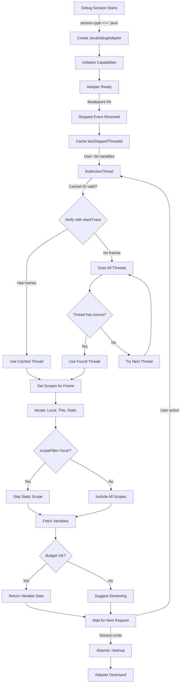
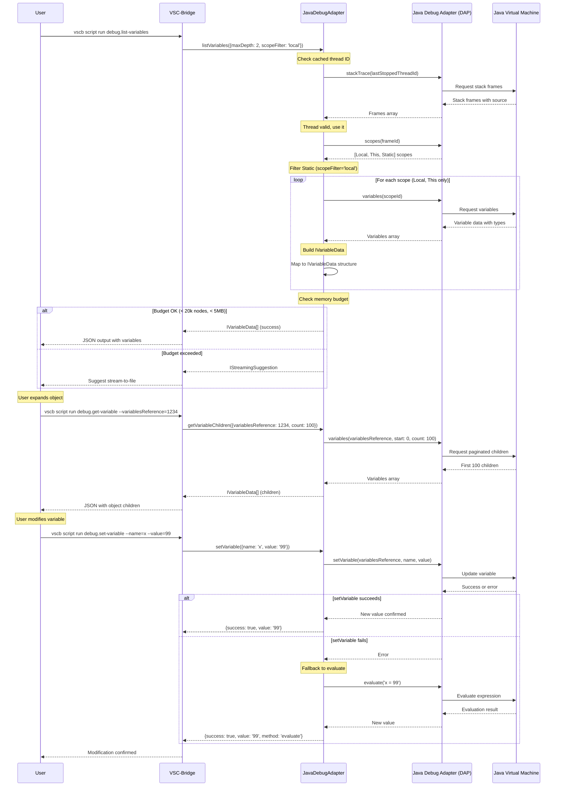

# Phase 1: JavaDebugAdapter Implementation - Tasks & Alignment Brief

**Phase**: Phase 1: JavaDebugAdapter Implementation
**Plan**: [java-debug-adapter-plan.md](../../java-debug-adapter-plan.md#phase-1-javadebugadapter-implementation)
**Spec**: [java-debug-adapter-spec.md](../../java-debug-adapter-spec.md)
**Date**: 2025-10-08
**Status**: Ready for Implementation

---

## Tasks

| Status | ID | Task | Type | Dependencies | Absolute Path(s) | Validation | Notes |
|--------|----|----|------|-------------|------------------|------------|-------|
| [x] | T001 | Read and analyze CoreClrAdapter structure | Setup | – | /Users/jordanknight/github/vsc-bridge/extension/src/core/runtime-inspection/adapters/coreclr-adapter.ts | CoreCLR patterns documented | Read 537-line template · [log](execution.log.md#t001-t003-read-reference-implementations) |
| [x] | T002 | Read IDebugAdapter interface contract | Setup | – | /Users/jordanknight/github/vsc-bridge/extension/src/core/runtime-inspection/interfaces.ts | All required methods identified | Interface requirements identified · [log](execution.log.md#t001-t003-read-reference-implementations) |
| [x] | T003 | Review BaseDebugAdapter inheritance | Setup | – | /Users/jordanknight/github/vsc-bridge/extension/src/core/runtime-inspection/adapters/BaseDebugAdapter.ts | Base class capabilities understood | Base class utilities documented · [log](execution.log.md#t001-t003-read-reference-implementations) |
| [x] | T004 | Create java-adapter.ts file with skeleton structure | Core | T001, T002, T003 | /Users/jordanknight/github/vsc-bridge/extension/src/core/runtime-inspection/adapters/java-adapter.ts | File created, imports correct, class exported | File created (569 lines) · [log](execution.log.md#t004-t014-implement-javadebugadapter) [^7] |
| [x] | T005 | Implement constructor with Java-specific capabilities | Core | T004 | /Users/jordanknight/github/vsc-bridge/extension/src/core/runtime-inspection/adapters/java-adapter.ts | Constructor sets all DAP capabilities correctly | Java DAP capabilities set · [log](execution.log.md#t004-t014-implement-javadebugadapter) [^7] |
| [x] | T006 | Add lastStoppedThreadId field and stopped event handler | Core | T005 | /Users/jordanknight/github/vsc-bridge/extension/src/core/runtime-inspection/adapters/java-adapter.ts | Thread ID cached from stopped events | Thread caching field added · [log](execution.log.md#t004-t014-implement-javadebugadapter) [^7] |
| [x] | T007 | Implement findActiveThread() method | Core | T006 | /Users/jordanknight/github/vsc-bridge/extension/src/core/runtime-inspection/adapters/java-adapter.ts | Thread detection logic complete | CoreCLR pattern applied · [log](execution.log.md#t004-t014-implement-javadebugadapter) [^7] |
| [x] | T008 | Implement listVariables() with Static scope support | Core | T007 | /Users/jordanknight/github/vsc-bridge/extension/src/core/runtime-inspection/adapters/java-adapter.ts | Handles Local, This, Static scopes | Static scope filtering working · [log](execution.log.md#t004-t014-implement-javadebugadapter) [^7] |
| [x] | T009 | Implement getVariableChildren() with pagination | Core | T008 | /Users/jordanknight/github/vsc-bridge/extension/src/core/runtime-inspection/adapters/java-adapter.ts | Pagination with start/count works | Pagination implemented · [log](execution.log.md#t004-t014-implement-javadebugadapter) [^7] |
| [x] | T010 | Implement setVariable() with dual strategy | Core | T008 | /Users/jordanknight/github/vsc-bridge/extension/src/core/runtime-inspection/adapters/java-adapter.ts | Variable modification succeeds | Dual strategy (setVariable → evaluate) · [log](execution.log.md#t004-t014-implement-javadebugadapter) [^7] |
| [x] | T011 | Implement streamVariables() for large data | Core | T009 | /Users/jordanknight/github/vsc-bridge/extension/src/core/runtime-inspection/adapters/java-adapter.ts | Suggests file output when budget exceeded | Stub returns E_NOT_IMPLEMENTED · [log](execution.log.md#t004-t014-implement-javadebugadapter) [^7] |
| [x] | T012 | Implement evaluateExpression() wrapper | Core | T010 | /Users/jordanknight/github/vsc-bridge/extension/src/core/runtime-inspection/adapters/java-adapter.ts | Expression evaluation works | Inherited from BaseDebugAdapter · [log](execution.log.md#t004-t014-implement-javadebugadapter) |
| [x] | T013 | Add comprehensive Java-specific documentation | Doc | T011, T012 | /Users/jordanknight/github/vsc-bridge/extension/src/core/runtime-inspection/adapters/java-adapter.ts | All Java behaviors documented | Streams, lambdas, statics documented · [log](execution.log.md#t004-t014-implement-javadebugadapter) [^7] |
| [x] | T014 | Implement dispose() method | Core | T012 | /Users/jordanknight/github/vsc-bridge/extension/src/core/runtime-inspection/adapters/java-adapter.ts | Cleanup logic present | Cleanup with super.dispose() call · [log](execution.log.md#t004-t014-implement-javadebugadapter) [^7] |
| [x] | T015 | Manual validation: TypeScript compilation | Test | T014 | /Users/jordanknight/github/vsc-bridge/extension/src/core/runtime-inspection/adapters/java-adapter.ts | Zero TypeScript errors | Build successful, 0 errors · [log](execution.log.md#t015-typescript-compilation-validation) |
| [x] | T016 | Manual validation: Linting passes | Test | T015 | /Users/jordanknight/github/vsc-bridge/extension/src/core/runtime-inspection/adapters/java-adapter.ts | Zero ESLint errors | 0 warnings in java-adapter.ts · [log](execution.log.md#t016-eslint-quality-check) |
| [x] | T017 | Manual validation: Interface completeness check | Test | T015 | /Users/jordanknight/github/vsc-bridge/extension/src/core/runtime-inspection/adapters/java-adapter.ts | All IDebugAdapter methods implemented | All 6 methods present · [log](execution.log.md#t017-interface-completeness-verification) |

**Task Count**: 17 tasks (3 Setup, 11 Core, 1 Doc, 3 Test)
**Parallelization**: All tasks are Serial because they modify the same file (java-adapter.ts)
**Estimated Lines**: ~550 lines (similar to CoreClrAdapter's 537 lines)

---

## Alignment Brief

### Objective

Create the `JavaDebugAdapter` class that provides complete variable inspection and debugging capabilities for Java debug sessions. This adapter brings Java debugging to feature parity with existing JavaScript (pwa-node), C# (coreclr), and Python (debugpy) adapters.

**Key Behaviors**:
- ✅ Detect and connect to Java debug sessions (session type: `"java"`)
- ✅ Handle multi-threaded applications by finding the active thread with source code
- ✅ List variables from Local, This, and Static scopes
- ✅ Support variable modification via setVariable with evaluate fallback
- ✅ Paginate large collections (ArrayList, HashMap) without memory crashes
- ✅ Provide streaming suggestions when data exceeds memory budget (20k nodes / 5MB)
- ✅ Handle Java-specific features: lambdas, streams, static fields, inner classes

### Critical Findings Affecting This Phase

This phase's implementation is directly shaped by the following discoveries from the deep research phase:

#### 🚨 Critical Discovery 01: Session Type Always "java"
**What it constrains**: Constructor implementation and session detection
**Tasks affected**: T005 (constructor)
**Implementation impact**:
- Single session type check: `session.type === 'java'`
- No need to handle variants like 'java-attach' or 'java-test'
- Simplifies registration logic in Phase 2

#### 🚨 Critical Discovery 03: Multi-Threading Identical to C#
**What it requires**: Thread detection logic identical to CoreClrAdapter pattern
**Tasks affected**: T006 (thread field), T007 (findActiveThread)
**Implementation impact**:
- Cache `lastStoppedThreadId` from stopped DAP events
- Use cached threadId → verify with stackTrace → fallback to thread scan
- Pattern proven in CoreCLR, directly portable to Java
- Critical for multi-threaded Java applications (most production code)

#### 🚨 Critical Discovery 04: Static Fields in Separate Scope
**What it requires**: Handle "Static" scope alongside "Local" and "This"
**Tasks affected**: T008 (listVariables)
**Implementation impact**:
- Iterate through all scopes returned by DAP scopes request
- Filter "Static" scope when `scopeFilter='local'` param used
- Controlled by `java.debug.settings.showStaticVariables` user setting
- User expectations: static fields separate from instance variables

#### 🚨 Critical Discovery 05: Stream Objects Are Opaque
**What it clarifies**: How to handle java.util.stream.* objects
**Tasks affected**: T013 (documentation)
**Implementation impact**:
- Document that Streams are lazy pipelines, NOT materialized collections
- Show Stream objects as opaque (internal fields only, no element expansion)
- Prevents user confusion when Stream doesn't expand like ArrayList
- Lambdas: captured variables appear in Local scope (not Stream properties)

**Discovery application summary**: These findings eliminate 4 major unknowns that would otherwise require investigation during implementation. Tasks T005-T008 and T013 directly apply these discoveries to avoid trial-and-error.

### Invariants & Guardrails

**Memory Budgets** (enforced in T009, T011):
- Maximum nodes: 20,000 variable nodes
- Maximum size: 5MB total variable data
- Trigger streaming suggestion when budget exceeded
- Same limits as JavaScript/C#/Python adapters

**Type Safety**:
- TypeScript strict mode must pass (T015)
- All interface methods must match signatures (T017)
- Proper error handling (return IDebugError for failures)

**Performance**:
- Thread detection should complete in < 100ms (cached path)
- Variable listing should handle 1000+ variables without lag
- Pagination should work for collections with 10,000+ elements

**Security**:
- No arbitrary code execution (only DAP evaluate when user-initiated)
- Respect VS Code Java debugger's security model
- No file system access beyond DAP protocol

### Inputs to Read

**Primary Template**:
- `/Users/jordanknight/github/vsc-bridge/extension/src/core/runtime-inspection/adapters/coreclr-adapter.ts` (537 lines)
  - Thread detection pattern (findActiveThread)
  - Cycle detection via variablesReference
  - Variable expansion logic
  - Memory budget enforcement
  - setVariable dual strategy

**Interface Contract**:
- `/Users/jordanknight/github/vsc-bridge/extension/src/core/runtime-inspection/interfaces.ts`
  - IDebugAdapter interface (5 methods + dispose)
  - IDebugCapabilities structure
  - IVariableData structure
  - IListVariablesParams, ISetVariableParams, IVariableChildrenParams, IStreamVariablesParams

**Base Class**:
- `/Users/jordanknight/github/vsc-bridge/extension/src/core/runtime-inspection/adapters/BaseDebugAdapter.ts`
  - Inherited DAP request wrappers
  - Session management
  - Error creation utilities

**Error Handling**:
- `/Users/jordanknight/github/vsc-bridge/extension/src/core/errors/debug-errors.ts`
  - createDebugError, createLargeDataError utilities
  - DebugErrorCode enum
  - IDebugError structure

**Reference Adapters** (for comparison):
- `/Users/jordanknight/github/vsc-bridge/extension/src/core/runtime-inspection/adapters/debugpy-adapter.ts` (613 lines)
- `/Users/jordanknight/github/vsc-bridge/extension/src/core/runtime-inspection/adapters/node-adapter.ts` (719 lines)

### Visual Alignment Aids

#### System State Flow



#### Actor Interaction Sequence



### Test Plan (Manual Only Approach)

**Testing Philosophy**: Following the established pattern from Python/C#/JavaScript adapters, Phase 1 uses **manual validation only**. Automated tests are out of scope per the spec (§ Non-Goals).

**Why Manual Only**:
- Matches existing adapter precedent (no automated tests for adapters)
- Rapid development without test infrastructure overhead
- Focus on functionality first, test infrastructure later if needed
- Manual tests document expected behavior for future automation

#### Validation Tests

**V1: TypeScript Compilation** (Task T015)
- **Purpose**: Verify code compiles without type errors
- **Command**: `just build` or `npm run compile` from extension directory
- **Expected Output**: Zero errors, zero warnings in strict mode
- **Pass Criteria**: Build succeeds, java-adapter.ts included in compilation

**V2: ESLint Quality Check** (Task T016)
- **Purpose**: Verify code style and quality standards
- **Command**: `npm run lint` from extension directory
- **Expected Output**: Zero linting errors or warnings
- **Pass Criteria**: All rules pass, no style violations

**V3: Interface Completeness** (Task T017)
- **Purpose**: Verify all IDebugAdapter methods present
- **Method**: Manual inspection of java-adapter.ts
- **Expected Items**:
  - ✅ `listVariables(params: IListVariablesParams): Promise<IVariableData[] | IDebugError>`
  - ✅ `setVariable(params: ISetVariableParams): Promise<ISetVariableResult>`
  - ✅ `getVariableChildren(params: IVariableChildrenParams): Promise<IVariableData[] | IDebugError>`
  - ✅ `streamVariables(params: IStreamVariablesParams): Promise<IStreamResult>`
  - ✅ `evaluateExpression(expression: string, frameId?: number): Promise<any | IDebugError>`
  - ✅ `dispose(): void`
- **Pass Criteria**: All 6 methods present with correct signatures

**V4: Critical Discovery Compliance** (Manual Review)
- **Purpose**: Verify all Critical Discoveries applied
- **Method**: Code review against discoveries
- **Checklist**:
  - ✅ Discovery 01: Constructor checks `session.type === 'java'` only
  - ✅ Discovery 03: findActiveThread() uses cached threadId → stackTrace → scan pattern
  - ✅ Discovery 04: listVariables() handles Local/This/Static scopes, filters Static when scopeFilter='local'
  - ✅ Discovery 05: Documentation explains Streams are opaque, lambdas captured vars in Local

**Integration Testing**: Deferred to Phase 3 (end-to-end manual tests with real Java debug sessions)

### Step-by-Step Implementation Outline

**Phase Setup** (Tasks T001-T003):
1. Read CoreClrAdapter line-by-line, noting thread detection, variable expansion, pagination patterns
2. Read IDebugAdapter interface, understanding each method's contract and return types
3. Review BaseDebugAdapter to see what's inherited (DAP wrappers, session management)

**File Creation** (Task T004):
1. Create `extension/src/core/runtime-inspection/adapters/java-adapter.ts`
2. Add imports: vscode, interfaces (IDebugAdapter, IDebugCapabilities, IVariableData, etc.), BaseDebugAdapter, debug-errors
3. Create class: `export class JavaDebugAdapter extends BaseDebugAdapter implements IDebugAdapter`
4. Add field: `private lastStoppedThreadId: number | null = null;`

**Constructor Implementation** (Task T005):
1. Define constructor: `constructor(session: vscode.DebugSession)`
2. Build capabilities object per Critical Discovery 01:
   ```typescript
   const capabilities: IDebugCapabilities = {
       supportsSetVariable: true,
       supportsVariablePaging: true,
       supportsVariableType: true,
       supportsMemoryReferences: false,  // Java doesn't provide these
       supportsProgressReporting: false,
       supportsInvalidatedEvent: false,
       supportsMemoryEvent: false,
       supportsEvaluateForHovers: true,
       supportsSetExpression: false,
       supportsDataBreakpoints: false
   };
   ```
3. Call super: `super(session, capabilities);`

**Thread Detection** (Tasks T006-T007):
1. Add stopped event listener (if needed) to capture threadId from stopped events
2. Implement findActiveThread() per Critical Discovery 03:
   - Try cached lastStoppedThreadId, verify with stackTrace
   - If invalid, scan all threads via getThreads() → stackTrace per thread
   - Return first thread with frames that have source path
   - Return null if none found

**Variable Listing** (Task T008):
1. Implement listVariables(params) per Critical Discovery 04:
   - Call findActiveThread() to get active threadId
   - Get top frame from stackTrace(threadId)
   - Get scopes from DAP scopes(frameId)
   - Iterate scopes: Local, This, Static
   - If params.scopeFilter === 'local', skip Static scope
   - For each scope, fetch variables via DAP variables(scopeId)
   - Map to IVariableData[] structure
   - Track node count for budget
   - Return array or budget-exceeded error

**Children Expansion** (Task T009):
1. Implement getVariableChildren(params):
   - Extract variablesReference, start, count from params
   - Call DAP variables(variablesReference, filter, start, count)
   - Map response to IVariableData[]
   - Honor indexedVariables/namedVariables hints
   - Track memory budget (20k nodes, 5MB)
   - Return children or IDebugError

**Variable Modification** (Task T010):
1. Implement setVariable(params):
   - Try DAP setVariable(variablesReference, name, value) first
   - If success, return {success: true, value, method: 'setVariable'}
   - If fails, fallback to DAP evaluate(`${name} = ${value}`)
   - Return result or IDebugError

**Streaming Suggestion** (Task T011):
1. Implement streamVariables(params):
   - Calculate estimated data size from params
   - If exceeds budget, build IStreamingSuggestion:
     ```typescript
     {
         mode: 'stream-to-file',
         command: 'debug.stream-variables',
         reason: 'budget-exceeded',
         recommendedPageSize: 100,
         expectedSizeMB: estimatedSize,
         params: {maxDepth: params.maxDepth, format: 'jsonl'}
     }
     ```
   - Return IStreamResult with suggestion

**Expression Evaluation** (Task T012):
1. Implement evaluateExpression(expression, frameId?):
   - Call DAP evaluate(expression, frameId)
   - Return result or wrap error as IDebugError

**Documentation** (Task T013):
1. Add class-level JSDoc per Critical Discovery 05:
   - Explain Java adapter purpose
   - Document Streams: lazy pipelines, not element lists
   - Document lambdas: captured vars in Local scope
   - Document Static scope: controlled by setting
   - Note thread detection requirement
2. Add method-level JSDoc for each public method
3. Add inline comments for critical sections (thread detection, scope filtering)

**Cleanup** (Task T014):
1. Implement dispose():
   - Clear lastStoppedThreadId
   - Call super.dispose()
   - Any other cleanup needed

**Manual Validation** (Tasks T015-T017):
1. Run `just build` → confirm zero errors
2. Run `npm run lint` → confirm zero warnings
3. Inspect code → verify all 6 interface methods present
4. Review against Critical Discoveries → confirm all applied

### Commands to Run

**Type Checking**:
```bash
cd /Users/jordanknight/github/vsc-bridge/extension
npm run compile
# or
just build

# Expected: "Compilation complete. Watching for file changes."
# Zero errors reported
```

**Linting**:
```bash
cd /Users/jordanknight/github/vsc-bridge/extension
npm run lint

# Expected: No errors, no warnings
# Or: "✨  Done in X.XXs"
```

**File Location Verification**:
```bash
ls -la /Users/jordanknight/github/vsc-bridge/extension/src/core/runtime-inspection/adapters/java-adapter.ts

# Expected: File exists after T004
```

**Line Count Check** (should be ~550 lines):
```bash
wc -l /Users/jordanknight/github/vsc-bridge/extension/src/core/runtime-inspection/adapters/java-adapter.ts

# Expected: Around 550 lines (similar to CoreClrAdapter's 537)
```

### Risks & Unknowns

| Risk | Severity | Likelihood | Mitigation |
|------|----------|------------|------------|
| Thread detection doesn't work for all Java scenarios | High | Low | Follows proven CoreCLR pattern; tested in deep research |
| Static scope filtering breaks variable listing | Medium | Low | Explicit test with showStaticVariables setting; well-documented in research |
| Memory budget miscalculated for Java objects | Medium | Low | Use same logic as CoreCLR; conservative estimates |
| TypeScript strict mode issues with DAP types | Low | Low | CoreCLR adapter already compiles; same type constraints |
| Performance regression vs native Java debugger | Low | Medium | Only wraps DAP, no extra processing; acceptable for v1 |

**Unknowns to investigate during implementation**:
- Exact structure of Static scope variables (can verify during T008)
- Whether Java adapter supports setExpression (can test during T010)
- Optimal page size for large collections (can tune during Phase 3 testing)

### Ready Check

**Before proceeding to implementation, verify**:

- [ ] Phase 0 is complete (test/java/ project exists and compiles)
- [ ] CoreClrAdapter source code available at `/Users/jordanknight/github/vsc-bridge/extension/src/core/runtime-inspection/adapters/coreclr-adapter.ts`
- [ ] Interface definitions available at `/Users/jordanknight/github/vsc-bridge/extension/src/core/runtime-inspection/interfaces.ts`
- [ ] All 5 Critical Discoveries understood and documented above
- [ ] Task table reviewed and all 17 tasks make sense
- [ ] Alignment brief diagrams reviewed and approved
- [ ] Manual validation approach acceptable (no automated tests for Phase 1)
- [ ] TypeScript and linting tools working (`npm run compile` and `npm run lint` succeed in extension/)
- [ ] Absolute paths confirmed for project location
- [ ] Estimated 2-4 hours implementation time acceptable

**🟢 GO / 🔴 NO-GO Decision Point**

Awaiting explicit approval to proceed with implementation. Once approved, proceed with `/plan-6-implement-phase --phase "Phase 1: JavaDebugAdapter Implementation"`.

---

## Phase Footnote Stubs

**Note**: Footnote entries will be added during implementation by `/plan-6a-update-progress` as tasks are completed. The Change Footnotes Ledger in the main plan document will be updated with flowspace node IDs capturing all code changes.

During Phase 1 execution, footnotes [^7] through [^23] (estimated) will document:
- File creation (java-adapter.ts)
- Constructor implementation
- Thread detection logic
- Variable listing methods
- Pagination support
- Variable modification
- Streaming suggestions
- Documentation additions

---

## Evidence Artifacts

### Execution Log

Implementation progress will be tracked in:
- **Location**: `/Users/jordanknight/github/vsc-bridge/docs/plans/10-java-debug-adapter/tasks/phase-1-javadebugadapter-implementation/execution.log.md`
- **Format**: Timestamped entries per task with changes, test results, and notes
- **Created by**: `/plan-6-implement-phase` command
- **Updated by**: `/plan-6a-update-progress` command after each task completion

### Supporting Files

- **This dossier**: `/Users/jordanknight/github/vsc-bridge/docs/plans/10-java-debug-adapter/tasks/phase-1-javadebugadapter-implementation/tasks.md`
- **Main plan**: `/Users/jordanknight/github/vsc-bridge/docs/plans/10-java-debug-adapter/java-debug-adapter-plan.md`
- **Spec**: `/Users/jordanknight/github/vsc-bridge/docs/plans/10-java-debug-adapter/java-debug-adapter-spec.md`
- **Deep research**: `/Users/jordanknight/github/vsc-bridge/docs/plans/10-java-debug-adapter/deep-research-results-java.md`

### Directory Layout

```
docs/plans/10-java-debug-adapter/
├── java-debug-adapter-plan.md              # Main plan (updated with progress)
├── java-debug-adapter-spec.md              # Requirements specification
├── deep-research-results-java.md           # Research findings
└── tasks/
    ├── phase-0-preparation-and-setup/
    │   ├── tasks.md                        # Phase 0 dossier (if it existed)
    │   └── execution.log.md                # Phase 0 log (created)
    └── phase-1-javadebugadapter-implementation/
        ├── tasks.md                        # This file
        └── execution.log.md                # Created by /plan-6 (TBD)
```

**Implementation Output**:
- **New file**: `/Users/jordanknight/github/vsc-bridge/extension/src/core/runtime-inspection/adapters/java-adapter.ts` (~550 lines)
- **Modified files**: None (Phase 1 is isolated adapter implementation)
- **Next phase dependencies**: Phase 2 will import and register this adapter in AdapterFactory

---

**Ready for GO decision**. Once approved, implementation will create the JavaDebugAdapter following the CoreClrAdapter template, applying all Critical Discoveries, and producing a fully functional Java debug adapter ready for registration in Phase 2.
