# Phase 2: Integration & Registration - Tasks & Alignment Brief

**Phase**: Phase 2: Integration & Registration
**Plan**: [java-debug-adapter-plan.md](../../java-debug-adapter-plan.md#phase-2-integration--registration)
**Spec**: [java-debug-adapter-spec.md](../../java-debug-adapter-spec.md)
**Date Created**: 2025-10-08
**Testing Approach**: Manual Only (following Python/C#/JavaScript adapter precedent)

---

## Tasks

| Status | ID | Task | Type | Dependencies | Absolute Path(s) | Validation | Notes |
|--------|----|----|------|--------------|------------------|------------|-------|
| [x] | T001 | Read AdapterFactory.ts to understand import section and registration pattern | Setup | – | /Users/jordanknight/github/vsc-bridge/extension/src/core/runtime-inspection/AdapterFactory.ts | Import section structure understood | [P] with T004, T007, T011. [📋](./execution.log.md#t001-t004-t007-t011-setup-tasks-parallel-reads) |
| [x] | T002 | Add JavaDebugAdapter import to AdapterFactory.ts (line ~24 after other adapters) | Core | T001 | /Users/jordanknight/github/vsc-bridge/extension/src/core/runtime-inspection/AdapterFactory.ts | Import statement added: `import { JavaDebugAdapter } from './adapters/java-adapter';` | Serial (same file as T003). Added inline comment `// Java` [^8] |
| [x] | T003 | Add registerAdapter('java', JavaDebugAdapter) to constructor (line ~54 after debugpy) | Core | T002 | /Users/jordanknight/github/vsc-bridge/extension/src/core/runtime-inspection/AdapterFactory.ts | Registration call added per Critical Discovery 01 | Serial (same file as T002). Per Discovery 01: use exactly 'java'. Added comment `// Java adapter` [^8] |
| [x] | T004 | Read debug-errors.ts to understand hint message structure and supported debugger list | Setup | – | /Users/jordanknight/github/vsc-bridge/extension/src/core/errors/debug-errors.ts | Message structure and getSupportedDebuggerTypes location identified | [P] with T001, T007, T011. [📋](./execution.log.md#t001-t004-t007-t011-setup-tasks-parallel-reads) |
| [x] | T005 | Update E_UNSUPPORTED_LANGUAGE hint to include 'java (Java)' in supported list (line ~117) | Core | T004 | /Users/jordanknight/github/vsc-bridge/extension/src/core/errors/debug-errors.ts | Hint message includes: `...coreclr (C#/.NET), debugpy (Python), java (Java)` | Serial (same file as T006). [^9] |
| [x] | T006 | Add 'java' to getSupportedDebuggerTypes() array (lines 307-314, after debugpy) | Core | T004 | /Users/jordanknight/github/vsc-bridge/extension/src/core/errors/debug-errors.ts | Array includes 'java' entry with comment: `// Java` | Serial (same file as T005). [^9] |
| [x] | T007 | Read debug-events.ts to understand test detection pattern for purpose flag and fallback logic | Setup | – | /Users/jordanknight/github/vsc-bridge/extension/src/core/testing/debug-events.ts | Test detection pattern understood (line 90 hasDebugTestPurpose, line 93 fallback) | [P] with T001, T004, T011. [📋](./execution.log.md#t001-t004-t007-t011-setup-tasks-parallel-reads) |
| [x] | T008 | Implement isJavaTestSession() function per Critical Discovery 02 (before waitForTestDebugSession) | Core | T007 | /Users/jordanknight/github/vsc-bridge/extension/src/core/testing/debug-events.ts | Function checks mainClass for 'RemoteTestRunner'/'junit.runner' and classPaths for junit/testng | Serial (same file as T009, T010). Discovery 02: No purpose flag for Java. [^10] |
| [x] | T009 | Integrate isJavaTestSession check into waitForTestDebugSession (line ~110 before looksLikeTest check) | Core | T008 | /Users/jordanknight/github/vsc-bridge/extension/src/core/testing/debug-events.ts | Condition added: `\|\| isJavaTestSession(session)` in if statement | Serial (same file as T008, T010). [^10] |
| [x] | T010 | Integrate isJavaTestSession into prearmImmediateTestStopDetector looksLikeTest() (line ~286) | Core | T008 | /Users/jordanknight/github/vsc-bridge/extension/src/core/testing/debug-events.ts | Condition added to looksLikeTest function inside prearm detector | Serial (same file as T008, T009). [^10] |
| [x] | T011 | Read index.ts to verify export pattern (NO language-specific adapters exported) | Setup | – | /Users/jordanknight/github/vsc-bridge/extension/src/core/runtime-inspection/index.ts | Confirmed: CoreClr, Debugpy, Node adapters NOT exported (only BaseDebugAdapter + AdapterFactory) | [P] with T001, T004, T007. [📋](./execution.log.md#t011-t012-module-exports-verification) |
| [x] | T012 | ~~Add JavaDebugAdapter export to index.ts~~ | Skip | T011 | /Users/jordanknight/github/vsc-bridge/extension/src/core/runtime-inspection/index.ts | SKIP - Not needed for consistency. No other language-specific adapters are exported | Per consistency analysis: CoreClr/Debugpy/Node are NOT exported, so Java should not be either. [📋](./execution.log.md#t011-t012-module-exports-verification) |
| [x] | T013 | Run TypeScript compilation (just build) | Integration | T003, T006, T010 | /Users/jordanknight/github/vsc-bridge/extension | Build command completes successfully | All imports must resolve. [📋](./execution.log.md#t013-t014-build-validation) |
| [x] | T014 | Verify zero TypeScript compilation errors | Integration | T013 | /Users/jordanknight/github/vsc-bridge/extension | Console output shows no errors, all types resolve correctly | Success criteria: "✅ Full build complete!" [📋](./execution.log.md#t013-t014-build-validation) |

---

## Alignment Brief

### Consistency Analysis Summary

**Status**: ✅ **VERIFIED CONSISTENT** with C#, Python, and JavaScript adapter patterns

The Phase 2 integration plan has been validated against existing CoreClr, Debugpy, and Node adapter implementations. Key findings:
- **Adapter registration**: Perfect match with existing import/register pattern
- **Error messages**: Correct format and placement identified
- **Test detection**: Appropriately uses fallback heuristics (mainClass/classPaths) consistent with existing `looksLikeTest` pattern
- **Module exports**: **T012 SKIPPED** - No language-specific adapters are exported (only BaseDebugAdapter + AdapterFactory are public API)

See subagent analysis for full consistency report.

### Objective

Register the JavaDebugAdapter (completed in Phase 1) into the VSC-Bridge runtime inspection system, enabling Java debug session support. Update test detection logic to identify Java test sessions using configuration heuristics per Critical Discovery 02.

**Acceptance Criteria** (from plan):
- [x] AdapterFactory.isSupported('java') returns true
- [x] No build errors
- [x] Test detection logic implemented per Critical Discovery 02
- [x] All exports properly configured (T012 skipped per consistency analysis)

### Critical Findings Affecting This Phase

#### 🚨 Critical Discovery 01: Session Type Always "java"
- **Constraint**: Java debugger always uses session type `'java'` - no variants for launch/attach or test frameworks
- **Task Impact**: T003 must register adapter with exactly `'java'` (not 'java-test', 'java-attach', etc.)
- **Implementation**: `this.registerAdapter('java', JavaDebugAdapter);`

#### 🚨 Critical Discovery 02: Test Detection Without purpose Flag
- **Problem**: Unlike Python/JavaScript, Java test sessions do NOT include `purpose: ["debug-test"]` flag
- **Root Cause**: VS Code Java Test Runner constructs standard launch config without purpose metadata
- **Solution**: Detect Java tests via `mainClass` containing test launcher keywords OR `classPaths` containing junit/testng
- **Task Impact**:
  - T008 implements dedicated `isJavaTestSession()` function
  - T009 integrates into `waitForTestDebugSession()`
  - T010 integrates into `prearmImmediateTestStopDetector()`
- **Validation**: Tests must be detectable without relying on `config.purpose` array

### Invariants & Guardrails

**Build Requirements**:
- Zero TypeScript errors in strict mode
- All imports resolve correctly
- No circular dependencies

**Test Detection Requirements**:
- Java tests detected via configuration analysis, not purpose flag
- Detection works for JUnit 4, JUnit 5, TestNG
- Detection logic is non-breaking (runs alongside existing purpose flag check)

**Registration Requirements**:
- Session type exactly `'java'` (per Discovery 01)
- Registration occurs in AdapterFactory constructor
- Import order maintains alphabetical grouping

### Inputs to Read

**Phase 1 Deliverable** (implemented adapter):
- `/Users/jordanknight/github/vsc-bridge/extension/src/core/runtime-inspection/adapters/java-adapter.ts` (569 lines)

**Integration Points**:
- `/Users/jordanknight/github/vsc-bridge/extension/src/core/runtime-inspection/AdapterFactory.ts` (lines 12-24 imports, lines 42-55 constructor)
- `/Users/jordanknight/github/vsc-bridge/extension/src/core/errors/debug-errors.ts` (line 117 hint, lines 307-315 supported types)
- `/Users/jordanknight/github/vsc-bridge/extension/src/core/testing/debug-events.ts` (lines 67-120 waitForTestDebugSession, lines 238-373 prearmImmediateTestStopDetector)
- `/Users/jordanknight/github/vsc-bridge/extension/src/core/runtime-inspection/index.ts` (lines 28-36 adapter exports)

**Reference Implementations**:
- Python debugpy registration (AdapterFactory.ts line 53)
- Python test detection fallback (debug-events.ts lines 93-100)

### Visual Alignment Aids

#### System State Flow


#### Actor Interaction Sequence

```mermaid
sequenceDiagram
    participant Dev as Developer
    participant VSCode as VS Code
    participant Factory as AdapterFactory
    participant Events as debug-events.ts
    participant Adapter as JavaDebugAdapter

    Note over Dev,Adapter: Phase 2: Integration & Registration

    Dev->>Factory: Import JavaDebugAdapter
    Dev->>Factory: Register 'java' → JavaDebugAdapter

    Note over Factory: Constructor registers:<br/>this.registerAdapter('java', JavaDebugAdapter)

    Dev->>Events: Implement isJavaTestSession()
    Note over Events: Check mainClass/classPaths<br/>(per Discovery 02)

    Dev->>Events: Integrate into waitForTestDebugSession()
    Dev->>Events: Integrate into prearmImmediateTestStopDetector()

    VSCode->>Events: onDidStartDebugSession(session)
    Events->>Events: Check purpose flag (Python/JS)
    Events->>Events: Check isJavaTestSession(session)
    Events-->>VSCode: Test session detected ✓

    VSCode->>Factory: createAdapter(session)
    Factory->>Factory: Detect session.type === 'java'
    Factory->>Adapter: new JavaDebugAdapter(session)
    Adapter-->>Factory: adapter instance
    Factory-->>VSCode: JavaDebugAdapter ready

    Note over Dev,Adapter: Build validates all integrations
```



### Test Plan

**Testing Approach**: Manual Only (no automated tests per spec)

**Test Categories**:

1. **Adapter Registration Test**
   - **Purpose**: Verify AdapterFactory creates JavaDebugAdapter for 'java' sessions
   - **Method**: Check AdapterFactory.isSupported('java') returns true after registration
   - **Expected**: Registration succeeds, session type recognized

2. **Error Message Test**
   - **Purpose**: Verify Java is listed in error hints
   - **Method**: Trigger E_UNSUPPORTED_LANGUAGE with unsupported session type
   - **Expected**: Hint includes "java (Java)" in supported debuggers list

3. **Test Detection Test**
   - **Purpose**: Verify isJavaTestSession detects JUnit/TestNG sessions without purpose flag
   - **Method**: Start Java test debug session, check waitForTestDebugSession resolves
   - **Expected**: Session detected via mainClass/classPaths heuristics (Discovery 02)

4. **Build Validation Test**
   - **Purpose**: Verify all TypeScript types resolve correctly
   - **Method**: Run `just build` and verify zero errors
   - **Expected**: "✅ Full build complete!" with no TypeScript errors

### Step-by-Step Implementation Outline

**Step 1: Adapter Registration** (T001-T003)
1. Read AdapterFactory.ts import section (lines 12-24)
2. Add JavaDebugAdapter import after DebugpyAdapter (line ~24)
3. Read constructor registration pattern (lines 42-55)
4. Add `this.registerAdapter('java', JavaDebugAdapter);` after debugpy (line ~54)

**Step 2: Error Message Updates** (T004-T006)
1. Read debug-errors.ts hint message template (line 117)
2. Update hint to include: `...debugpy (Python), java (Java)`
3. Read getSupportedDebuggerTypes() function (lines 307-315)
4. Add `'java', // Java` entry after debugpy (line ~312)

**Step 3: Test Detection Logic** (T007-T010)
1. Read debug-events.ts test detection pattern (lines 67-120)
2. Implement `isJavaTestSession()` function before `waitForTestDebugSession`:
   ```typescript
   function isJavaTestSession(session: vscode.DebugSession): boolean {
       if (session.type !== 'java') return false;
       const config = session.configuration;
       const mainClass = config.mainClass || '';

       return mainClass.includes('RemoteTestRunner') ||
              mainClass.includes('junit.runner') ||
              config.classPaths?.some(cp => cp.includes('junit') || cp.includes('testng'));
   }
   ```
3. Integrate into `waitForTestDebugSession` (line ~110):
   ```typescript
   if (hasDebugTestPurpose || isJavaTestSession(session) || looksLikeTest) {
   ```
4. Integrate into `prearmImmediateTestStopDetector` looksLikeTest function (line ~286):
   ```typescript
   const looksLikeTest = () => {
       const purpose = (session.configuration as any)?.purpose;
       if (Array.isArray(purpose) && purpose.includes('debug-test')) {
           return true;
       }
       // Java test detection (no purpose flag)
       if (isJavaTestSession(session)) {
           return true;
       }
       // ... existing fallback logic
   };
   ```

**Step 4: Module Exports** (T011-T012)
1. Read index.ts export pattern (lines 28-36)
2. **T012 SKIPPED**: Consistency analysis confirmed NO language-specific adapters are exported
   - CoreClrDebugAdapter: NOT exported
   - DebugpyAdapter: NOT exported
   - NodeDebugAdapter: NOT exported
   - JavaDebugAdapter should follow same pattern (NOT exported)
3. Only BaseDebugAdapter and AdapterFactory are public API

**Step 5: Build Validation** (T013-T014)
1. Run `just build` from extension directory
2. Verify zero TypeScript errors
3. Confirm all imports resolve correctly
4. Check for "✅ Full build complete!" message

### Commands to Run

```bash
# Navigate to extension directory
cd /Users/jordanknight/github/vsc-bridge/extension

# Read files to understand structure (Setup tasks T001, T004, T007, T011)
# Use Read tool for:
# - AdapterFactory.ts (imports and constructor)
# - debug-errors.ts (hint message and supported types)
# - debug-events.ts (test detection logic)
# - index.ts (export pattern)

# After code changes, run build
just build

# Verify build output shows no errors
# Expected: "✅ Full build complete!"

# Optional: Run ESLint (from project root)
cd /Users/jordanknight/github/vsc-bridge
npm run lint

# Expected: Zero new warnings in modified files
```

### Risks & Unknowns

| Risk | Severity | Likelihood | Mitigation |
|------|----------|------------|------------|
| Test detection heuristics miss edge cases | Medium | Low | Use multiple detection methods (mainClass + classPaths), test with JUnit 4/5/TestNG |
| Import resolution fails due to circular dependencies | High | Low | Follow existing adapter import pattern, JavaDebugAdapter has no exports |
| Registration conflicts with existing adapters | Low | Very Low | Use unique session type 'java', verified via Discovery 01 |
| Build errors from TypeScript strict mode | Medium | Low | JavaDebugAdapter already passed strict compilation in Phase 1 |
| Test detection breaks existing Python/JS logic | Medium | Low | Add Java check as additional condition, don't modify existing logic |

**Critical Unknowns**:
- ✅ Session type for Java: RESOLVED via Discovery 01 (always 'java')
- ✅ Test detection without purpose flag: RESOLVED via Discovery 02 (use mainClass/classPaths)
- ❓ Whether JavaDebugAdapter needs public export in index.ts (likely NOT needed - created via factory)

### Ready Check

Before starting implementation, verify:

- [ ] Phase 1 complete: JavaDebugAdapter implemented (569 lines) ✅
- [ ] JavaDebugAdapter compiles without errors ✅
- [ ] Critical Discoveries 01 and 02 understood ✅
- [ ] Integration points identified (AdapterFactory, debug-errors, debug-events) ✅
- [ ] Test detection logic design reviewed (mainClass/classPaths heuristics) ✅
- [ ] Build command ready (`just build`) ✅

**GO/NO-GO Decision Point**: All checkboxes must be ✅ before proceeding with implementation.

---

## Phase Footnote Stubs

**Footnotes Created During Implementation**:

[^8]: Phase 2 Tasks 2.1-2.2 - AdapterFactory integration
  - `file:extension/src/core/runtime-inspection/AdapterFactory.ts:24` - Added JavaDebugAdapter import with inline comment
  - `file:extension/src/core/runtime-inspection/AdapterFactory.ts:56-57` - Registered 'java' adapter in constructor

[^9]: Phase 2 Tasks 2.3-2.4 - Error message updates
  - `file:extension/src/core/errors/debug-errors.ts:117` - Updated E_UNSUPPORTED_LANGUAGE hint to include java (Java)
  - `file:extension/src/core/errors/debug-errors.ts:312` - Added 'java' to getSupportedDebuggerTypes() array

[^10]: Phase 2 Tasks 2.5-2.6 - Test detection logic
  - `function:extension/src/core/testing/debug-events.ts:isJavaTestSession` - Lines 63-76, implemented per Critical Discovery 02
  - `function:extension/src/core/testing/debug-events.ts:waitForTestDebugSession` - Lines 108, 129, integrated isJavaTestSession check
  - `function:extension/src/core/testing/debug-events.ts:prearmImmediateTestStopDetector` - Lines 302-305, added Java test detection to looksLikeTest

These footnotes have been added to the main plan's Change Footnotes Ledger.

---

## Evidence Artifacts

### Execution Log
**Location**: `/Users/jordanknight/github/vsc-bridge/docs/plans/10-java-debug-adapter/tasks/phase-2-integration-and-registration/execution.log.md`

**Contents** (to be created during implementation):
- Task-by-task execution timeline with timestamps
- Code changes with file paths and line numbers
- Build output and validation results
- Error resolution steps (if any)

### Directory Structure

```
docs/plans/10-java-debug-adapter/
├── java-debug-adapter-plan.md           # Main plan
├── java-debug-adapter-spec.md           # Specification
├── deep-research-results-java.md        # Critical Discoveries
└── tasks/
    ├── phase-0-preparation-and-setup/
    │   ├── tasks.md
    │   └── execution.log.md
    ├── phase-1-javadebugadapter-implementation/
    │   ├── tasks.md
    │   └── execution.log.md
    └── phase-2-integration-and-registration/
        ├── tasks.md                      # This file
        └── execution.log.md              # Created by /plan-6
```

---

**Phase 2 Status**: Ready for Implementation
**Next Command**: `/plan-6-implement-phase --phase "Phase 2: Integration & Registration" --plan "/Users/jordanknight/github/vsc-bridge/docs/plans/10-java-debug-adapter/java-debug-adapter-plan.md"`
