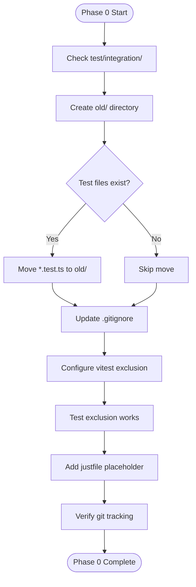
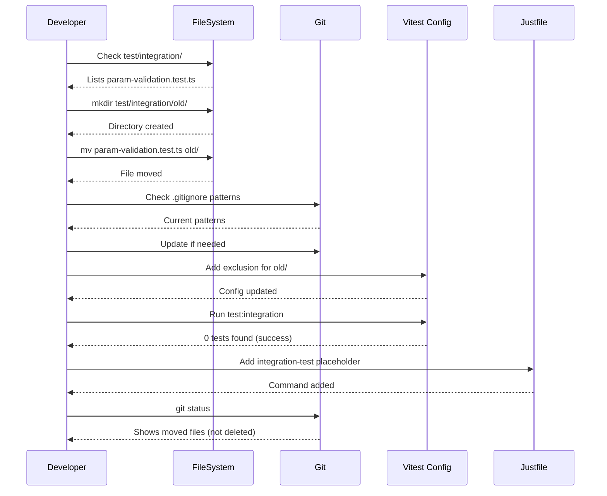

# Phase 0: Preparation and Test Deprecation - Tasks & Alignment Brief

**Phase**: Phase 0: Preparation and Test Deprecation
**Slug**: phase-0
**Plan**: [cross-language-integration-test-plan.md](../../cross-language-integration-test-plan.md)
**Spec**: [cross-language-integration-test-spec.md](../../cross-language-integration-test-spec.md)
**Date**: 2025-10-08
**Status**: READY FOR IMPLEMENTATION

## Tasks

| Status | ID | Task | Type | Dependencies | Absolute Path(s) | Validation | Notes |
|--------|-----|------|------|--------------|------------------|------------|-------|
| [ ] | T001 | Check if test/integration directory exists and list current contents | Setup | – | /Users/jak/github/vsc-bridge/test/integration | Directory exists with at least param-validation.test.ts | Baseline inventory (maps to plan task 0.1-0.2) |
| [ ] | T002 | Create test/integration/old/ directory | Core | T001 | /Users/jak/github/vsc-bridge/test/integration/old | Directory created and exists | Serial - directory creation (plan task 0.1) |
| [ ] | T003 | Check if param-validation.test.ts exists in test/integration | Setup | T001 | /Users/jak/github/vsc-bridge/test/integration/param-validation.test.ts | File exists or confirmed missing | Verify file to move (plan task 0.2) |
| [ ] | T004 | Move param-validation.test.ts to old/ subdirectory | Core | T002, T003 | /Users/jak/github/vsc-bridge/test/integration/param-validation.test.ts, /Users/jak/github/vsc-bridge/test/integration/old/param-validation.test.ts | File moved, original location empty | Applies Critical Discovery 05 (plan task 0.2) |
| [ ] | T005 | Move any other *.test.ts files to old/ subdirectory | Core | T002, T003 | /Users/jak/github/vsc-bridge/test/integration/*.test.ts, /Users/jak/github/vsc-bridge/test/integration/old/ | All test files moved to old/ | Comprehensive deprecation |
| [ ] | T006 | Check current .gitignore patterns for test/integration | Setup | – | /Users/jak/github/vsc-bridge/.gitignore | Current patterns documented | [P] eligible - different file (plan task 0.3) |
| [ ] | T007 | Update .gitignore if old/ directory needs explicit inclusion | Core | T006 | /Users/jak/github/vsc-bridge/.gitignore | old/ not accidentally ignored | Ensure old tests remain in git (plan task 0.3) |
| [ ] | T008 | Check if vitest.config.ts exists in project root | Setup | – | /Users/jak/github/vsc-bridge/vitest.config.ts | Config existence confirmed | [P] eligible - checking config (plan task 0.4) |
| [ ] | T009 | Create or update vitest.config.ts to exclude test/integration/old/ | Core | T008 | /Users/jak/github/vsc-bridge/vitest.config.ts | Exclusion pattern configured | Critical for preventing old test execution (plan task 0.4) |
| [ ] | T010 | Test that npm run test:integration skips old/ directory | Test | T004, T005, T009 | /Users/jak/github/vsc-bridge/test/integration/old/ | Command runs, 0 tests executed | Verify exclusion works (plan task 0.4) |
| [ ] | T011 | Check current justfile for existing integration-test command | Setup | – | /Users/jak/github/vsc-bridge/justfile | Current state documented | [P] eligible - different file (plan task 0.5) |
| [ ] | T012 | Add placeholder integration-test command to justfile | Core | T011 | /Users/jak/github/vsc-bridge/justfile | Command exists with "not implemented" message | Placeholder for Phase 6 (plan task 0.5) |
| [ ] | T013 | Verify git status shows moved files | Test | T004, T005 | /Users/jak/github/vsc-bridge/ | Git shows renames, not deletes | Ensure proper tracking |
| [ ] | T014 | Document deprecation in test/integration/old/README.md | Doc | T002 | /Users/jak/github/vsc-bridge/test/integration/old/README.md | README explains deprecated status | Future developer guidance |
| [ ] | T015 | Run old tests directly to verify they still work | Test | T004, T005 | /Users/jak/github/vsc-bridge/test/integration/old/param-validation.test.ts | Tests execute and pass | Ensure old tests remain functional |
| [ ] | T016 | Fix any failing tests in old/ directory | Core | T015 | /Users/jak/github/vsc-bridge/test/integration/old/*.test.ts | All old tests pass | Maintain test suite health |
| [ ] | T017 | Add script in package.json to run old tests explicitly | Core | T016 | /Users/jak/github/vsc-bridge/package.json | npm run test:integration:old works | Allow running deprecated tests when needed |

## Alignment Brief

### Objective Recap

Phase 0 prepares the repository for the new cross-language integration test by:
1. Deprecating existing integration tests to `test/integration/old/`
2. Ensuring test runner excludes deprecated tests
3. Adding placeholder justfile command for future implementation

### Behavior Checklist

From acceptance criteria in spec and plan:
- ✅ All existing integration tests moved to `test/integration/old/` directory
- ✅ Test runner configuration updated to exclude `test/integration/old/` from execution
- ✅ Old tests no longer run when executing `npm run test:integration`
- ✅ **Old tests still pass when run directly** (new requirement)
- ✅ Package.json has script to run old tests explicitly
- ✅ Justfile has `integration-test` placeholder command
- ✅ Git properly tracks moved files (not deleted)

### Critical Findings Affecting This Phase

**Critical Discovery 05: Test Deprecation Strategy** (lines 207-219 of plan)
- **Problem**: Existing integration tests must not run alongside new test
- **Root Cause**: Test runner will execute all `*.test.ts` files in `test/integration/`
- **Solution**: Move old tests to `test/integration/old/`, configure test runner to exclude
- **Impact on Phase 0**: This is the primary driver for this phase. Tasks T002-T005 directly implement this strategy. Task T009 ensures vitest configuration excludes the old/ directory.
- **Tasks addressing this**: T002, T004, T005, T009, T010

### Invariants & Guardrails

- **No data loss**: Old tests must be preserved, not deleted
- **Git tracking**: Files must show as renamed/moved in git, not deleted+added
- **Clean slate**: After phase completion, `test/integration/` should be empty (except old/)
- **Backwards compatibility**: Old tests remain accessible if needed for reference

### Inputs to Read

1. `/Users/jak/github/vsc-bridge/test/integration/` - Current test files
2. `/Users/jak/github/vsc-bridge/.gitignore` - Current ignore patterns
3. `/Users/jak/github/vsc-bridge/vitest.config.ts` - Current test configuration (may not exist)
4. `/Users/jak/github/vsc-bridge/justfile` - Current just commands
5. `/Users/jak/github/vsc-bridge/package.json` - Test scripts configuration

### Visual Alignment Aids

#### Flow Diagram: Test Deprecation Process



#### Sequence Diagram: Test Migration



### Test Plan

**Testing Approach**: Manual validation (per spec: Manual Only approach)

#### Tests to Execute

1. **T010: Exclusion Verification Test**
   - **Command**: `npm run test:integration`
   - **Expected**: 0 tests executed, no errors
   - **Rationale**: Confirms vitest properly excludes old/ directory

2. **T013: Git Tracking Test**
   - **Command**: `git status`
   - **Expected**: Shows files as renamed/moved, not deleted
   - **Rationale**: Ensures version control integrity maintained

3. **T015: Old Test Functionality**
   - **Command**: `npx vitest run test/integration/old/param-validation.test.ts`
   - **Expected**: Tests execute and pass
   - **Rationale**: Ensures deprecated tests remain functional for reference

4. **T017: Old Test Script**
   - **Command**: `npm run test:integration:old`
   - **Expected**: Old tests run and pass
   - **Rationale**: Provides explicit way to run deprecated tests

5. **Manual Validation of Justfile**
   - **Command**: `just integration-test`
   - **Expected**: "Not implemented yet" message
   - **Rationale**: Confirms placeholder exists for Phase 6

### Step-by-Step Implementation Outline

1. **Inventory Phase** (T001, T003, T006, T008, T011)
   - List current test files in test/integration/
   - Check .gitignore patterns
   - Check vitest.config.ts existence
   - Document current justfile state

2. **Directory Creation** (T002)
   - Create test/integration/old/ directory
   - Ensure proper permissions

3. **File Migration** (T004, T005)
   - Move param-validation.test.ts to old/
   - Move any other test files found
   - Verify moves completed

4. **Configuration Updates** (T007, T009)
   - Update .gitignore if needed
   - Create/update vitest.config.ts with exclusion

5. **Validation** (T010, T013, T015)
   - Test that old/ is excluded from test runs
   - Verify git properly tracks moves
   - **Verify old tests still function**

6. **Test Maintenance** (T016, T017)
   - Fix any failing tests in old/
   - Add npm script for running old tests

7. **Documentation** (T012, T014)
   - Add justfile placeholder command
   - Create README in old/ directory

### Commands to Run

```bash
# Check current state
ls -la /Users/jak/github/vsc-bridge/test/integration/

# Create old directory
mkdir -p /Users/jak/github/vsc-bridge/test/integration/old

# Move test files
mv /Users/jak/github/vsc-bridge/test/integration/*.test.ts /Users/jak/github/vsc-bridge/test/integration/old/

# Check git status
cd /Users/jak/github/vsc-bridge && git status

# Test exclusion
cd /Users/jak/github/vsc-bridge && npm run test:integration

# Run old tests directly to ensure they still work
cd /Users/jak/github/vsc-bridge && npx vitest run test/integration/old/param-validation.test.ts

# Test new npm script (after adding)
cd /Users/jak/github/vsc-bridge && npm run test:integration:old

# Test justfile command (after adding)
cd /Users/jak/github/vsc-bridge && just integration-test
```

### Risks & Unknowns

| Risk | Severity | Mitigation |
|------|----------|------------|
| Accidentally delete tests instead of move | Medium | Use `mv` not `rm`, verify with git status |
| Old tests may be broken/outdated | Medium | T015-T016 test and fix old tests |
| Dependencies for old tests missing | Medium | Check package.json, install if needed |
| Vitest config syntax error | Low | Test config after changes |
| Missing test:integration script | Low | Check package.json first |
| Other test files beyond param-validation.test.ts | Low | T005 handles all *.test.ts files |

### Ready Check

- [ ] Confirmed plan and spec reviewed
- [ ] Understood Critical Discovery 05 about test deprecation
- [ ] Ready to move existing tests without data loss
- [ ] Prepared to update vitest configuration
- [ ] Will verify git tracking after moves
- [ ] Justfile placeholder approach clear

**Awaiting GO/NO-GO decision to proceed with implementation**

## Phase Footnote Stubs

This section will be populated during `/plan-6-implement-phase` execution with specific file modifications and implementation notes. Footnote references will be added to the task Notes column at that time.

| Footnote | Task | File Modified | Change Description |
|----------|------|---------------|-------------------|
| (To be added during implementation) | | | |

## Evidence Artifacts

Implementation artifacts will be written to:
- **Execution Log**: `/Users/jak/github/vsc-bridge/docs/plans/11-cross-language-integration-test/tasks/phase-0/execution.log.md`
- **Test Output**: `/Users/jak/github/vsc-bridge/docs/plans/11-cross-language-integration-test/tasks/phase-0/test-output.txt`
- **Git Status Capture**: `/Users/jak/github/vsc-bridge/docs/plans/11-cross-language-integration-test/tasks/phase-0/git-status.txt`

## Directory Layout

```
docs/plans/11-cross-language-integration-test/
├── cross-language-integration-test-spec.md
├── cross-language-integration-test-plan.md
└── tasks/
    └── phase-0/
        ├── tasks.md                 # This file
        ├── execution.log.md          # Created by /plan-6-implement-phase
        ├── test-output.txt           # Test execution results
        └── git-status.txt            # Git tracking verification
```

---

**Status**: READY FOR IMPLEMENTATION
**Next Step**: Run `/plan-6-implement-phase --phase "Phase 0" --plan "/Users/jak/github/vsc-bridge/docs/plans/11-cross-language-integration-test/cross-language-integration-test-plan.md"`