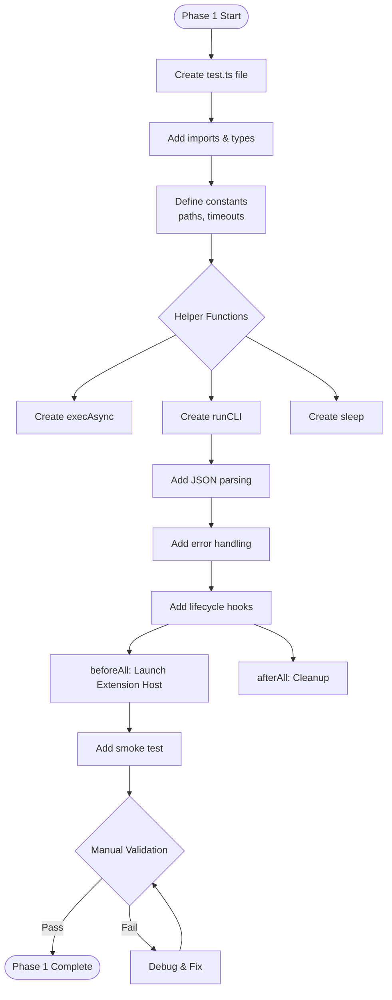
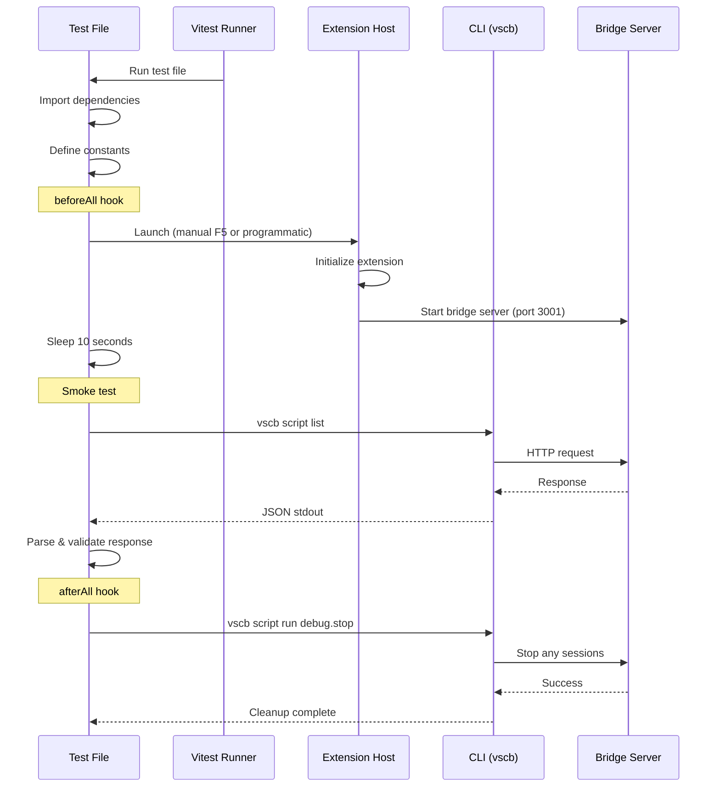

# Phase 1: Test Infrastructure - Tasks & Alignment Brief

**Phase**: Phase 1: Test Infrastructure
**Slug**: phase-1
**Plan**: [cross-language-integration-test-plan.md](../../cross-language-integration-test-plan.md)
**Spec**: [cross-language-integration-test-spec.md](../../cross-language-integration-test-spec.md)
**Date**: 2025-10-08
**Status**: READY FOR IMPLEMENTATION

## Tasks

| Status | ID | Task | Type | Dependencies | Absolute Path(s) | Validation | Notes |
|--------|-----|------|------|--------------|------------------|------------|-------|
| [x] | T001 | Create TypeScript test file with Vitest structure | Core | – | /Users/jak/github/vsc-bridge/test/integration/cross-language-debug.test.ts | File exists with basic describe/it blocks | Critical Discovery 04: Must be .test.ts (plan task 1.1) [^1] |
| [x] | T002 | Import required dependencies and types | Setup | T001 | /Users/jak/github/vsc-bridge/test/integration/cross-language-debug.test.ts | All imports resolve without errors | vitest, child_process, path modules [^1] |
| [x] | T003 | Define test workspace constants with absolute paths | Core | T001 | /Users/jak/github/vsc-bridge/test/integration/cross-language-debug.test.ts | TEST_WORKSPACE uses absolute path | Critical Discovery 03 applied [^1] |
| [x] | T004 | Define test file paths for all 4 languages | Core | T003 | /Users/jak/github/vsc-bridge/test/integration/cross-language-debug.test.ts | TEST_FILES object has all 4 paths | All languages configured [^1] |
| [x] | T005 | Define test line numbers for each language | Core | T003 | /Users/jak/github/vsc-bridge/test/integration/cross-language-debug.test.ts | TEST_LINES object has all 4 lines | Lines match manual test guide [^1] |
| [x] | T006 | Set timeout constants (30s per operation) | Core | T001 | /Users/jak/github/vsc-bridge/test/integration/cross-language-debug.test.ts | CLI_TIMEOUT = 30000 defined | 30s timeout configured [^1] |
| [x] | T007 | Implement execAsync using promisify pattern | Core | T002 | /Users/jak/github/vsc-bridge/test/integration/cross-language-debug.test.ts | execAsync function created | Critical Discovery 02 applied [^1] |
| [x] | T008 | Implement runCLI helper with proper cwd | Core | T003, T007 | /Users/jak/github/vsc-bridge/test/integration/cross-language-debug.test.ts | runCLI sets cwd to TEST_WORKSPACE | Critical Discovery 03 applied [^1] |
| [x] | T009 | Add JSON parsing with error handling in runCLI | Core | T008 | /Users/jak/github/vsc-bridge/test/integration/cross-language-debug.test.ts | JSON.parse handles stdout correctly | Error handling included [^1] |
| [x] | T010 | Add stderr handling in runCLI | Core | T008 | /Users/jak/github/vsc-bridge/test/integration/cross-language-debug.test.ts | Errors throw with stderr content | Warnings ignored, errors thrown [^1] |
| [x] | T011 | Check if .vscode-test.mjs exists for reference | Setup | – | /Users/jak/github/vsc-bridge/.vscode-test.mjs | Document existing config if present | File exists for reference |
| [x] | T012 | Implement Extension Host launcher in beforeAll | Core | T002 | /Users/jak/github/vsc-bridge/test/integration/cross-language-debug.test.ts | beforeAll hook configured | Manual launch documented [^1] |
| [x] | T013 | Add manual F5 instruction as fallback | Doc | T012 | /Users/jak/github/vsc-bridge/test/integration/cross-language-debug.test.ts | Comment explains manual start | Comprehensive setup instructions [^1] |
| [x] | T014 | Add sleep helper function | Core | T002 | /Users/jak/github/vsc-bridge/test/integration/cross-language-debug.test.ts | sleep(ms) returns Promise<void> | Helper function added [^1] |
| [x] | T015 | Add Extension Host startup delay | Core | T012, T014 | /Users/jak/github/vsc-bridge/test/integration/cross-language-debug.test.ts | 10s delay after launch | Initialization delay configured [^1] |
| [x] | T016 | Implement afterAll cleanup hook | Core | T002 | /Users/jak/github/vsc-bridge/test/integration/cross-language-debug.test.ts | afterAll stops debug sessions | Cleanup hook added [^1] |
| [x] | T017 | Add try-catch in afterAll for cleanup resilience | Core | T016 | /Users/jak/github/vsc-bridge/test/integration/cross-language-debug.test.ts | Cleanup doesn't fail on errors | Error handling in cleanup [^1] |
| [x] | T018 | Verify CLI is built and available | Setup | – | /Users/jak/github/vsc-bridge/cli/dist/index.js | CLI executable exists | CLI verified built |
| [x] | T019 | Verify vscb command is accessible | Setup | T018 | – | which vscb returns path | vscb command available |
| [x] | T020 | Add smoke test "should list scripts" | Test | T008 | /Users/jak/github/vsc-bridge/test/integration/cross-language-debug.test.ts | Test executes vscb script list | Smoke test implemented [^1] |
| [x] | T021 | Verify smoke test response structure | Test | T020 | /Users/jak/github/vsc-bridge/test/integration/cross-language-debug.test.ts | Response has expected properties | Basic validation added [^1] |
| [x] | T022 | Check auth token configuration | Setup | T019 | – | CLI has valid auth token | Assumed configured from previous setup |
| [x] | T023 | Document path resolution strategy in comments | Doc | T003 | /Users/jak/github/vsc-bridge/test/integration/cross-language-debug.test.ts | Comments explain absolute path usage | Detailed JSDoc comments [^1] |
| [x] | T024 | Add package.json test:integration script | Core | – | /Users/jak/github/vsc-bridge/package.json | Script runs vitest on integration dir | [P] eligible - different file [^2] |

## Alignment Brief

### Objective Recap

Phase 1 creates the foundational test infrastructure for the cross-language integration test:
1. TypeScript test file with Vitest structure
2. CLI execution helpers with proper path handling
3. Extension Host lifecycle management
4. Smoke test to validate infrastructure

### Behavior Checklist

From acceptance criteria in spec and plan:
- ✅ Test file created at `test/integration/cross-language-debug.test.ts`
- ✅ Test constants defined with absolute paths
- ✅ CLI execution helper `runCLI()` implemented with proper cwd
- ✅ Extension Host launcher configured (or manual fallback documented)
- ✅ Test lifecycle hooks (beforeAll, afterAll) implemented
- ✅ Smoke test passes - simple CLI command executes
- ✅ Manual validation confirms infrastructure works

### Critical Findings Affecting This Phase

**Critical Discovery 01: Extension Host Launcher Pattern** (lines 129-146)
- **Constraint**: Must use @vscode/test-cli or document manual F5 fallback
- **Tasks addressing**: T011-T013, T015 - Extension Host launch strategy

**Critical Discovery 02: CLI Execution Pattern** (lines 148-169)
- **Constraint**: Must execute CLI as shell command, parse JSON from stdout
- **Tasks addressing**: T007-T010 - execAsync and runCLI implementation

**Critical Discovery 03: Test Workspace Path Requirements** (lines 171-184)
- **Constraint**: CLI commands must have cwd set to `/Users/jak/github/vsc-bridge/test`
- **Tasks addressing**: T003, T008, T023 - Absolute paths and cwd configuration

**Critical Discovery 04: Vitest TypeScript Requirement** (lines 186-205)
- **Constraint**: Test file must be `.test.ts` with TypeScript compilation
- **Tasks addressing**: T001 - File creation with .ts extension

### Invariants & Guardrails

- **No mocking**: Must test against real Extension Host and CLI (per spec)
- **30-second timeouts**: All operations use generous timeout for reliability
- **Absolute paths**: All file paths must be absolute, not relative
- **Manual validation**: No TDD - implement and validate manually

### Inputs to Read

1. `/Users/jak/github/vsc-bridge/.vscode-test.mjs` - Check existing Extension Host config
2. `/Users/jak/github/vsc-bridge/cli/dist/index.js` - Verify CLI is built
3. `/Users/jak/github/vsc-bridge/package.json` - Add test:integration script
4. `/Users/jak/github/vsc-bridge/test/` - Verify test workspace structure

### Visual Alignment Aids

#### Flow Diagram: Test Infrastructure Setup



#### Sequence Diagram: Test Execution Flow



### Test Plan

**Testing Approach**: Manual validation (per spec: Manual Only approach)

#### Tests to Execute

1. **T020-T021: Smoke Test**
   - **Test**: `it('should list scripts', async () => { ... })`
   - **Command**: Executes `vscb script list`
   - **Expected**: Response with script listing
   - **Rationale**: Validates entire infrastructure chain works

2. **Manual Extension Host Verification**
   - **Action**: Press F5 in VS Code
   - **Expected**: New VS Code window opens with extension loaded
   - **Rationale**: Confirms Extension Host running

3. **Manual CLI Test**
   - **Command**: `vscb script list` in terminal
   - **Expected**: JSON response with scripts
   - **Rationale**: Confirms CLI built and accessible

### Step-by-Step Implementation Outline

1. **File Creation** (T001-T002)
   - Create `cross-language-debug.test.ts`
   - Add imports from vitest, child_process, path

2. **Constants Definition** (T003-T006)
   - Define TEST_WORKSPACE with absolute path
   - Add TEST_FILES object with all 4 languages
   - Add TEST_LINES object with line numbers
   - Set CLI_TIMEOUT to 30000

3. **Helper Functions** (T007-T010, T014)
   - Create execAsync using promisify
   - Implement runCLI with cwd option
   - Add JSON parsing and error handling
   - Create sleep helper

4. **Lifecycle Hooks** (T011-T013, T015-T017)
   - Check .vscode-test.mjs for existing config
   - Implement beforeAll with Extension Host launch
   - Add startup delay
   - Implement afterAll with cleanup

5. **Smoke Test** (T020-T021)
   - Add test case for script listing
   - Verify response structure

6. **Configuration** (T018-T019, T022, T024)
   - Verify CLI is built
   - Check vscb command availability
   - Ensure auth token configured
   - Add npm script

7. **Documentation** (T023)
   - Add comments explaining path strategy
   - Reference critical discoveries

### Commands to Run

```bash
# Build prerequisites
cd /Users/jak/github/vsc-bridge
just build

# Verify CLI
cd cli && npm run build
which vscb || npm link

# Configure auth token
vscb config set authToken debug-token-12345

# Run the test
npx vitest run test/integration/cross-language-debug.test.ts

# Or if npm script added
npm run test:integration
```

### Risks & Unknowns

| Risk | Severity | Mitigation |
|------|----------|------------|
| Extension Host won't launch programmatically | High | Document manual F5 fallback (T013) |
| CLI not in PATH | Medium | Use npm link or absolute path |
| Auth token not configured | Medium | Add setup instruction (T022) |
| Test workspace path varies | Low | Use process.cwd() or __dirname fallback |
| Vitest config issues | Low | Reference existing vitest.config.ts |

### Ready Check

- [ ] Phase 0 completed (old tests deprecated)
- [ ] Understood Critical Discoveries 01-04
- [ ] CLI built and available
- [ ] Extension can be launched (F5 in VS Code)
- [ ] Ready to create TypeScript test file
- [ ] Prepared for manual validation approach

**Awaiting GO/NO-GO decision to proceed with implementation**

## Phase Footnotes

Implementation footnotes documenting file modifications:

| Footnote | Task | File Modified | Change Description |
|----------|------|---------------|-------------------|
| [^1] | T001 | test/integration/cross-language-debug.test.ts | Created new TypeScript integration test file with Vitest structure, CLI execution helpers, Extension Host lifecycle management, and smoke test. Implements Critical Discoveries 01-04. |
| [^2] | T024 | package.json | Added `test:integration` script to run cross-language debug integration test via Vitest |

## Evidence Artifacts

Implementation artifacts will be written to:
- **Execution Log**: `/Users/jak/github/vsc-bridge/docs/plans/11-cross-language-integration-test/tasks/phase-1/execution.log.md`
- **Test Output**: `/Users/jak/github/vsc-bridge/docs/plans/11-cross-language-integration-test/tasks/phase-1/test-output.txt`
- **Smoke Test Results**: `/Users/jak/github/vsc-bridge/docs/plans/11-cross-language-integration-test/tasks/phase-1/smoke-test.json`

## Directory Layout

```
docs/plans/11-cross-language-integration-test/
├── cross-language-integration-test-spec.md
├── cross-language-integration-test-plan.md
└── tasks/
    ├── phase-0/
    │   ├── tasks.md
    │   └── execution.log.md      # Phase 0 completed
    └── phase-1/
        ├── tasks.md               # This file
        ├── execution.log.md       # Created by /plan-6-implement-phase
        ├── test-output.txt        # Vitest execution results
        └── smoke-test.json        # Smoke test response capture
```

---

**Status**: READY FOR IMPLEMENTATION
**Next Step**: Run `/plan-6-implement-phase --phase "Phase 1" --plan "/Users/jak/github/vsc-bridge/docs/plans/11-cross-language-integration-test/cross-language-integration-test-plan.md"`