# Subtask 001: Bake in editor.show-testing-ui Script to Enable Python Test Discovery

**Parent Plan**: [cross-language-integration-test-plan.md](../../cross-language-integration-test-plan.md)
**Parent Phase**: Phase 2: Python Test Implementation
**Created**: 2025-10-08
**Status**: READY FOR IMPLEMENTATION
**Migration Note**: Script migrated from `tests.show-testing-ui` to `editor.show-testing-ui` on 2025-10-20

---

## Subtask Metadata

| Field | Value |
|-------|-------|
| **Parent Plan** | cross-language-integration-test-plan.md |
| **Parent Phase** | Phase 2: Python Test Implementation |
| **Parent Task(s)** | All tasks (T001-T020) - This subtask resolves the blocker preventing Phase 2 completion |
| **Subtask Summary** | Bake in editor.show-testing-ui script to enable Python test discovery (originally tests.show-testing-ui) |
| **Requested By** | Human Sponsor |
| **Created** | 2025-10-08T09:40:00Z |
| **Ordinal** | 001 |

---

## Tasks

| Status | ID | Task | Type | Dependencies | Absolute Path(s) | Validation | Notes |
|--------|----|----|------|--------------|------------------|------------|-------|
| [ ] | ST001 | Create editor.show-testing-ui script implementation | Core | – | /Users/jak/github/vsc-bridge/extension/src/vsc-scripts/editor/show-testing-ui.js | Script file exists, extends ActionScript, implements execute() method | Supports Phase 2 (all tasks); Serial implementation. **Note**: Originally at tests/show-testing-ui.js, migrated to editor/ category 2025-10-20 |
| [ ] | ST002 | Create editor.show-testing-ui script metadata | Core | ST001 | /Users/jak/github/vsc-bridge/extension/src/vsc-scripts/editor/show-testing-ui.meta.yaml | Metadata file exists with correct alias, description, parameters | Serial (pairs with ST001). **Note**: Originally tests/show-testing-ui.meta.yaml with alias tests.show-testing-ui |
| [ ] | ST003 | Build extension to regenerate manifest | Test | ST002 | /Users/jak/github/vsc-bridge/extension/src/vsc-scripts/manifest.json | Run `just build`, verify 34 scripts discovered (was 33), editor.show-testing-ui appears in manifest | Manual validation step |
| [ ] | ST004 | Manually validate script works | Test | ST003 | – | Launch Extension Host, run `vscb script run editor.show-testing-ui`, verify Testing view appears | Confirms script functionality before integration. **Note**: Command updated from tests.show-testing-ui |
| [ ] | ST005 | Integrate script into test infrastructure beforeAll hook | Core | ST004 | /Users/jak/github/vsc-bridge/test/integration/cross-language-debug.test.ts | Add call to editor.show-testing-ui after 5-second delay in beforeAll, before debug.status | Supports Phase 2 by enabling Python discovery; Serial (shared file). **Note**: Call updated from tests.show-testing-ui |
| [ ] | ST006 | Add debug.stop after show-testing-ui | Core | ST005 | /Users/jak/github/vsc-bridge/test/integration/cross-language-debug.test.ts | Stop any debug session started by test discovery trigger | Ensures clean state; Serial (shared file) |
| [ ] | ST007 | Run Python test to validate discovery fix | Test | ST006 | – | Execute `npx vitest run test/integration/cross-language-debug.test.ts -t "Python"`, verify test passes (no longer times out) | Final validation - Python discovery should now work |
| [ ] | ST008 | Document fix in Phase 2 execution log | Doc | ST007 | /Users/jak/github/vsc-bridge/docs/plans/11-cross-language-integration-test/tasks/phase-2/execution.log.md | Update log with resolution: "Python discovery enabled via editor.show-testing-ui script" | Captures solution for future reference. **Note**: Updated from tests.show-testing-ui |

**Task Notes**:
- ST001-ST002 create the baked-in script (pair together, serial)
- ST003-ST004 validate the script works standalone (manual steps, serial)
- ST005-ST006 integrate into test infrastructure (modify same file, serial)
- ST007 validates the entire fix (manual validation)
- ST008 documents the solution (serial with ST007)
- All tasks are serial due to dependencies and shared file modifications
- This subtask directly addresses the Python test discovery blocker documented in Phase 2 execution.log.md

---

## Alignment Brief

### Objective Recap

**Primary Goal**: Resolve the Python test discovery blocker by baking the proven `workbench.view.testing.focus` command into a permanent script (`editor.show-testing-ui`), then integrating it into the test infrastructure to enable Python test discovery.

**Migration Note (2025-10-20)**: Script was originally created as `tests.show-testing-ui` and later migrated to `editor.show-testing-ui` to better reflect its purpose as an editor UI action rather than a test-specific command.

**Parent Phase Goal**: Implement automated integration test for Python (pytest) debugging workflow.

**Blocker This Resolves**: Phase 2 execution log documents that Python tests timeout because VS Code test explorer reports "no test discovered here". Manual experimentation proved that showing the Testing view via `workbench.view.testing.focus` triggers Python test discovery. This subtask permanentizes that solution.

**Behavior Checklist** (subtask-specific):
- [ ] `editor.show-testing-ui` script created and appears in manifest as script #34 (originally `tests.show-testing-ui`)
- [ ] Script successfully shows Testing view when executed via CLI
- [ ] Test infrastructure calls `editor.show-testing-ui` in beforeAll hook after 5-second delay
- [ ] Test infrastructure stops any debug session after showing Testing view
- [ ] Python test from Phase 2 now passes (no longer times out on test discovery)
- [ ] Solution documented in Phase 2 execution log

### Critical Findings Affecting This Subtask

**🚨 Discovery from Experimentation: workbench.view.testing.focus Enables Python Discovery**
- **What we found**: Running dynamic script with `vscode.commands.executeCommand('workbench.view.testing.focus')` successfully triggers Python test discovery
- **Impact**: This command must be baked into a permanent script and integrated into test infrastructure
- **Tasks addressing**: ST001 (implement command in script), ST005 (integrate into beforeAll)
- **Evidence**: Dynamic script `/Users/jak/github/vsc-bridge/scripts/sample/dynamic/nudge-test-discovery.js` proven to work

**🚨 Critical Discovery 02: CLI Execution Pattern** (inherited from parent)
- **What it requires**: Use `child_process.exec` with `promisify`, parse JSON from stdout
- **Impact**: ST005 will use existing `runCLI()` helper to call the new script
- **Tasks addressing**: ST005 (integration uses runCLI pattern)

**🚨 Critical Discovery 03: Test Workspace Path Requirements** (inherited from parent)
- **What it requires**: CLI commands execute from correct workspace directory
- **Impact**: Extension Host lifecycle commands run from root, test commands from test/ workspace
- **Tasks addressing**: ST005 (runCLI call uses default workspace path behavior)

**🚨 Phase 2 Blocker: Python Test Discovery Failure** (from execution.log.md)
- **Symptom**: `tests.debug-single` times out after 30 seconds with "no test discovered here"
- **Root Cause**: VS Code Python extension doesn't discover test files without "jiggling"
- **Solution**: This subtask implements the jiggling solution permanently
- **Tasks addressing**: All tasks ST001-ST008 work together to resolve this blocker

### Invariants & Guardrails

**Performance Budget**:
- Script execution must be instant (<100ms) - just shows a UI view
- Integration adds <1 second to test infrastructure setup time

**Memory Budget**:
- No significant memory impact - single UI command

**Concurrency Constraints**:
- Script execution is safe (just shows UI view)
- Must stop any debug session after showing Testing view (ST006) to maintain "only one session at a time" invariant

**Quality Standards**:
- Script must follow existing script patterns (ActionScript base class)
- Metadata must match manifest v2 format
- Integration must not break existing test infrastructure
- Solution must be documented for future maintainers

### Inputs to Read

**Proven Dynamic Script**:
- `/Users/jak/github/vsc-bridge/scripts/sample/dynamic/nudge-test-discovery.js` - Proven working implementation to adapt

**Existing Script Examples**:
- `/Users/jak/github/vsc-bridge/extension/src/vsc-scripts/tests/debug-single.js` - Pattern for tests category scripts
- `/Users/jak/github/vsc-bridge/extension/src/vsc-scripts/tests/debug-single.meta.yaml` - Metadata pattern

**Integration Target**:
- `/Users/jak/github/vsc-bridge/test/integration/cross-language-debug.test.ts` - Test file to update (lines 146-174 contain beforeAll hook)

**Phase 2 Documentation**:
- `/Users/jak/github/vsc-bridge/docs/plans/11-cross-language-integration-test/tasks/phase-2/execution.log.md` - Documents the blocker this subtask resolves

### Visual Alignment Aids

#### Script Creation and Integration Flow

```mermaid
flowchart TD
    Start[Subtask Start] --> Create[ST001-ST002: Create Script Files]
    Create --> Build[ST003: Build & Verify Manifest]
    Build --> Validate[ST004: Manual Validation]
    Validate --> Works{Script Works?}
    Works -->|Yes| Integrate[ST005-ST006: Integrate into Test Infrastructure]
    Works -->|No| Debug[Debug Script Issues]
    Debug --> Create
    Integrate --> TestPython[ST007: Run Python Test]
    TestPython --> Passes{Test Passes?}
    Passes -->|Yes| Document[ST008: Document Fix]
    Passes -->|No| Investigate[Investigate Why Discovery Still Fails]
    Investigate --> Integrate
    Document --> Complete[✅ Subtask Complete<br/>Phase 2 Unblocked]

    style Start fill:#e1f5ff
    style Complete fill:#d4edda
    style Works fill:#fff4e1
    style Passes fill:#fff4e1
    style Debug fill:#ffe1e1
    style Investigate fill:#ffe1e1
```



#### Test Infrastructure Integration Sequence


### Test Plan

**Testing Approach**: Manual Only (inherited from parent Phase 2)

**Validation Steps**:

1. **Script Creation Validation** (ST003):
   ```bash
   just build
   # Expected: "✓ Discovered script: editor.show-testing-ui (editor/show-testing-ui.js)"
   # Expected: "✅ Manifest generated successfully! Scripts: 34"
   ```

2. **Script Functionality Validation** (ST004):
   ```bash
   # Launch Extension Host
   vscb script run debug.start --param launch="Run Extension"
   sleep 5

   # Run the new script
   vscb script run editor.show-testing-ui

   # Manually verify in Extension Host window:
   # - Testing view is now visible (beaker icon in activity bar)
   # - Python tests appear in the Testing view
   ```

3. **Integration Validation** (ST007):
   ```bash
   # Run Python test (should now pass)
   npx vitest run test/integration/cross-language-debug.test.ts -t "Python"

   # Expected: Test passes, no timeout
   # Expected: Output shows Python test started and completed successfully
   ```

4. **Regression Check**:
   ```bash
   # Ensure other tests still work
   npx vitest run test/integration/cross-language-debug.test.ts -t "smoke"
   ```

### Step-by-Step Implementation Outline

**Phase 1: Create Baked-In Script** (ST001-ST002)

1. Create `/Users/jak/github/vsc-bridge/extension/src/vsc-scripts/tests/show-testing-ui.js`:
   ```javascript
   import { ActionScript } from '../../core/scripts/ActionScript.js';

   export default class ShowTestingUIScript extends ActionScript {
       async execute(bridgeContext, params) {
           await bridgeContext.vscode.commands.executeCommand('workbench.view.testing.focus');
           return this.success({ message: 'Testing view shown' });
       }
   }
   ```

2. Create `/Users/jak/github/vsc-bridge/extension/src/vsc-scripts/tests/show-testing-ui.meta.yaml`:
   ```yaml
   alias: editor.show-testing-ui
   name: Show Testing UI
   category: tests
   description: Show the Testing view to trigger test discovery
   dangerOnly: false
   parameters: []
   ```

**Phase 2: Build and Validate** (ST003-ST004)

3. Build extension: `just build`
4. Verify manifest shows 34 scripts
5. Manually test script works as expected

**Phase 3: Integrate into Test Infrastructure** (ST005-ST006)

6. Update `test/integration/cross-language-debug.test.ts` beforeAll hook:
   ```typescript
   beforeAll(async () => {
       // ... existing launch code ...
       await sleep(EXTENSION_STARTUP_DELAY);

       // NEW: Trigger test discovery
       await runCLI('script run editor.show-testing-ui');

       // NEW: Stop any debug session from discovery
       try {
           await runCLI('script run debug.stop');
       } catch (e) {
           // Ignore
       }

       // Verify bridge is active
       await runCLI('script run debug.status');
   }, 60000);
   ```

**Phase 4: Validate and Document** (ST007-ST008)

7. Run Python test, verify it passes
8. Update Phase 2 execution log with resolution

### Commands to Run

**Build Commands**:
```bash
# Build everything
just build

# Verify script appears in manifest
grep -A5 "editor.show-testing-ui" extension/src/vsc-scripts/manifest.json
```

**Manual Validation Commands**:
```bash
# Test the script standalone
vscb script run debug.start --param launch="Run Extension"
sleep 5
vscb script run editor.show-testing-ui

# Test the integration
npx vitest run test/integration/cross-language-debug.test.ts -t "Python"

# Run all tests to check for regressions
npx vitest run test/integration/cross-language-debug.test.ts
```

**Verification Commands**:
```bash
# Check manifest has 34 scripts
jq '.scripts | keys | length' extension/src/vsc-scripts/manifest.json

# Verify script metadata
cat extension/src/vsc-scripts/tests/show-testing-ui.meta.yaml
```

### Risks & Unknowns

| Risk | Severity | Likelihood | Mitigation | Tasks Affected |
|------|----------|------------|------------|----------------|
| Script doesn't trigger discovery in test context | High | Low | If fails, investigate timing or add polling logic | ST007 |
| Integration breaks existing tests | Medium | Low | Test all tests after integration; if breaks, adjust hook placement | ST007 |
| Manifest generation fails with new script | Low | Low | Follow exact pattern from existing scripts | ST003 |
| Debug session from discovery interferes | Medium | Medium | ST006 explicitly stops any session after showing view | ST006 |
| Python test still doesn't discover | High | Low | If fails, may need additional commands or configuration changes | ST007 |

**Unknowns to Validate During Implementation**:
1. Does `editor.show-testing-ui` need to run from specific directory? (Likely no - it's a UI command)
2. Is there a delay needed after showing Testing view before tests discover? (Validate in ST004)
3. Does showing Testing view start a debug session? (Check in ST004, clean up in ST006 if so)

### Ready Check

**Pre-Implementation Checklist**:
- [ ] Dynamic script proven to work (validated manually)
- [ ] Phase 2 execution log reviewed and blocker understood
- [ ] Existing script patterns reviewed (tests/debug-single.js, metadata format)
- [ ] Test infrastructure beforeAll hook location identified (lines 146-174)
- [ ] Build process understood (`just build` regenerates manifest)

**Post-Implementation Checklist** (mark during /plan-6):
- [ ] Script files created (ST001-ST002)
- [ ] Build succeeds with 34 scripts (ST003)
- [ ] Manual validation shows script works (ST004)
- [ ] Integration added to beforeAll (ST005-ST006)
- [ ] Python test passes without timeout (ST007)
- [ ] Fix documented in execution log (ST008)
- [ ] No regressions in other tests
- [ ] Code follows existing patterns

**GO / NO-GO Decision Point**:

🔴 **NO-GO** if:
- Dynamic script validation failed (prerequisite not met)
- Build system broken
- Cannot modify test infrastructure file

🟢 **GO** if:
- Dynamic script proven to work
- Understanding of blocker confirmed
- Ready to implement ST001-ST008 sequentially

---

## Phase Footnote Stubs

**Note**: Footnotes will be added during `/plan-6-implement-phase --subtask 001-subtask-bake-in-tests-show-testing-ui-script-to-enable-python-test-discovery` as implementation progresses. Each completed task will reference code changes with substrate node IDs.

**Format**:
```markdown
[^N]: Modified [file:path/to/file](path/to/file#L123) – Description of change including which subtask(s) it addresses and resolution provided.
```

---

## Evidence Artifacts

### Execution Log

**Path**: `/Users/jak/github/vsc-bridge/docs/plans/11-cross-language-integration-test/tasks/phase-2/001-subtask-bake-in-tests-show-testing-ui-script-to-enable-python-test-discovery.execution.log.md`

**Purpose**: During implementation (`/plan-6-implement-phase --subtask`), the execution log will document:
- Subtask-by-subtask progress (ST001-ST008 status)
- Build output showing script discovery
- Manual validation results (script functionality, Python test passing)
- Integration verification
- Any deviations from plan and rationale

**Structure**:
```markdown
# Subtask 001 Execution Log: Bake in editor.show-testing-ui Script

**Migration Note (2025-10-20)**: This log documents the original implementation as `tests.show-testing-ui`. The script was later migrated to `editor.show-testing-ui` in the editor category.

**Started**: YYYY-MM-DD
**Status**: IN PROGRESS | COMPLETE | BLOCKED

## Implementation Progress

### ✅ Tasks Completed
- ST001: [Description] - [Details]
- ...

### ❌ Tasks Blocked/Failed
- STXX: [Description] - [Blocker details]

## Manual Validation Results

### Script Creation (ST003)
[Build output showing 34 scripts]

### Script Functionality (ST004)
[Manual test results]

### Python Test Fix (ST007)
[Test run output showing Python test passing]

## Code Changes
[Modified files with line numbers]

## Resolution Summary
[How this subtask resolved the Phase 2 blocker]
```

### Supporting Files

**Created**:
- `/Users/jak/github/vsc-bridge/extension/src/vsc-scripts/tests/show-testing-ui.js`
- `/Users/jak/github/vsc-bridge/extension/src/vsc-scripts/tests/show-testing-ui.meta.yaml`

**Modified**:
- `/Users/jak/github/vsc-bridge/test/integration/cross-language-debug.test.ts` (beforeAll hook)
- `/Users/jak/github/vsc-bridge/extension/src/vsc-scripts/manifest.json` (auto-generated)
- `/Users/jak/github/vsc-bridge/docs/plans/11-cross-language-integration-test/tasks/phase-2/execution.log.md` (documentation update)

### Directory Layout

```
docs/plans/11-cross-language-integration-test/
├── cross-language-integration-test-plan.md
├── cross-language-integration-test-spec.md
└── tasks/
    └── phase-2/
        ├── tasks.md                                                          # Parent phase dossier
        ├── execution.log.md                                                  # Parent phase log (will update with fix)
        ├── 001-subtask-bake-in-tests-show-testing-ui-script-to-enable-python-test-discovery.md     # THIS FILE
        └── 001-subtask-bake-in-tests-show-testing-ui-script-to-enable-python-test-discovery.execution.log.md  # Created by /plan-6
```

**Created Script Files**:
```
extension/src/vsc-scripts/tests/
├── debug-single.js
├── debug-single.meta.yaml
├── show-testing-ui.js        # NEW - Created by ST001
└── show-testing-ui.meta.yaml # NEW - Created by ST002
```

**Modified Test File**:
```
test/integration/
└── cross-language-debug.test.ts  # beforeAll hook updated (ST005-ST006)
```

---

**Subtask Status**: READY FOR IMPLEMENTATION
**Parent Linkage**: Supports all Phase 2 tasks (T001-T020) by resolving Python test discovery blocker
**Next Command**: `/plan-6-implement-phase --subtask "001-subtask-bake-in-tests-show-testing-ui-script-to-enable-python-test-discovery" --plan "/Users/jak/github/vsc-bridge/docs/plans/11-cross-language-integration-test/cross-language-integration-test-plan.md"`
