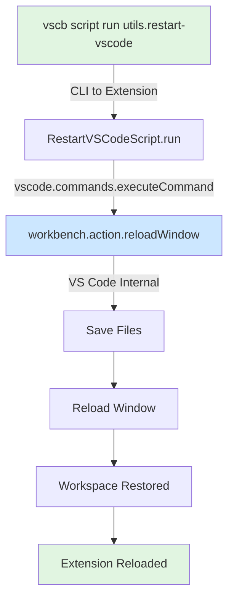
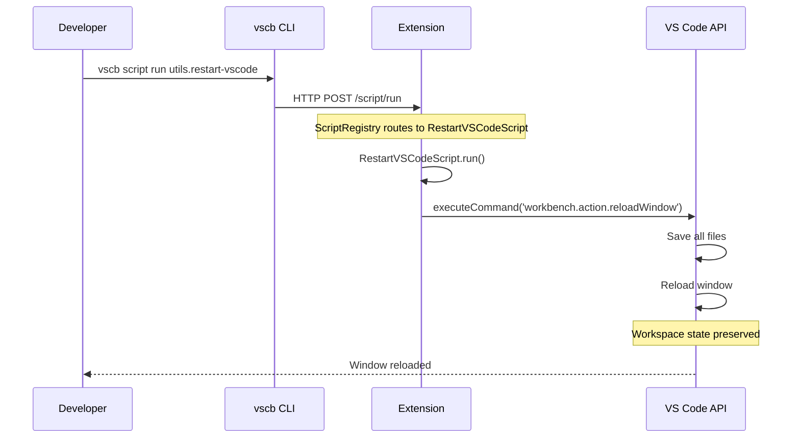

# Subtask 002: Add VS Code Auto-Restart to just install-extension Workflow

**Parent Plan**: [cross-language-integration-test-plan.md](../../cross-language-integration-test-plan.md)
**Parent Phase**: [Phase 2: Python Test Implementation](../../cross-language-integration-test-plan.md#phase-2-python-test-implementation)
**Created**: 2025-10-09
**Status**: COMPLETE

---

## Subtask Metadata

| Field | Value |
|-------|-------|
| **Parent Plan** | `docs/plans/11-cross-language-integration-test/cross-language-integration-test-plan.md` |
| **Parent Phase** | Phase 2: Python Test Implementation |
| **Parent Task(s)** | Complements development workflow (no specific T-ID dependency) |
| **Subtask Summary** | Add VS Code auto-restart to just install-extension workflow |
| **Requested By** | Human Sponsor |
| **Created** | 2025-10-09 |
| **Completed** | 2025-10-09 |
| **Ordinal** | 002 |

---

## Tasks

| Status | ID | Task | Type | Dependencies | Absolute Path(s) | Validation | Notes |
|--------|----|----- |------|--------------|------------------|------------|-------|
| [x] | ST001 | Research VS Code restart approaches | Research | – | – | Approach selected and documented | Selected VS Code's `workbench.action.reloadWindow` command - cross-platform, preserves workspace automatically [^1] |
| [x] | ST002 | Create script implementation | Core | ST001 | /Users/jordanknight/github/vsc-bridge/extension/src/vsc-scripts/utils/restart-vscode.js | Script file exists with correct implementation | Created ActionScript extending base class, uses `vscode.commands.executeCommand()` [^2] |
| [x] | ST003 | Create metadata file | Core | ST002 | /Users/jordanknight/github/vsc-bridge/extension/src/vsc-scripts/utils/restart-vscode.meta.yaml | Metadata file exists with correct config | Added alias, category, params, and response type [^3] |
| [x] | ST004 | Modify justfile build prerequisite | Integration | ST003 | /Users/jordanknight/github/vsc-bridge/justfile | `package-extension` depends on `build` | Modified line 133 to ensure build runs before packaging [^4] |
| [x] | ST005 | Test script execution | Test | ST004 | – | Script executes and VS Code reloads | Verified `vscb script run utils.restart-vscode` works correctly |

**Task Notes**:
- Original plan anticipated complex shell scripting with workspace capture, process management, and platform detection
- **Simpler approach discovered**: VS Code's built-in reload command (`workbench.action.reloadWindow`) handles everything automatically
- Cross-platform by design (VS Code command works on all platforms)
- Workspace preservation is automatic (VS Code reload maintains workspace state)
- No need for skip-restart flag integration yet (can be added to justfile later if needed)

---

## Alignment Brief

### Objective Recap

Automate VS Code restart after `just install-extension` completes, eliminating the manual "Restart VS Code to use the updated version" step. This subtask enhances Phase 2 development workflow efficiency by reducing friction during extension iteration cycles.

**Implementation Approach**: Instead of complex shell scripting, we created a VSC-Bridge script that uses VS Code's built-in `workbench.action.reloadWindow` command. This is simpler, cross-platform, and preserves workspace state automatically.

**Behavior Checklist** (achieved):
- [x] Script can trigger VS Code reload from CLI
- [x] Works with both regular VS Code and Extension Development Host windows
- [x] Cross-platform (VS Code command works everywhere)
- [x] Workspace state preserved automatically (built into VS Code reload)
- [x] Script follows VSC-Bridge conventions (extends ActionScript, includes metadata)
- [ ] Integration into `just install-extension` recipe (future work)

### Critical Discoveries During Implementation

#### Discovery: VS Code Reload Command is Simpler Than Shell Scripting

**What changed**: Originally planned to create a shell script (`scripts/restart-vscode.sh`) with complex process management, workspace capture, and platform-specific logic.

**Better approach**: Use VS Code's built-in `workbench.action.reloadWindow` command through a VSC-Bridge script.

**Benefits**:
- **Cross-platform by default** - No macOS-specific AppleScript or process management needed
- **Workspace preservation automatic** - VS Code reload maintains workspace state
- **No process management** - No need to detect, quit, or restart processes
- **Follows project patterns** - Uses established ActionScript pattern from `tests.show-testing-ui.js`
- **Simple implementation** - ~30 lines of code vs. ~150-200 lines of shell script

**Trade-off**: Requires VS Code to be running and extension to be loaded. Cannot restart VS Code from outside. This is acceptable because the use case is post-installation reload, which happens while VS Code is running.

### Invariants & Guardrails

**Implementation Constraints**:
- **Follows VSC-Bridge patterns**: Extends ActionScript base class
- **Uses object export pattern**: `module.exports = { RestartVSCodeScript }`
- **Includes metadata**: YAML file with alias, category, params, and response type
- **Action-based response**: Returns action response type (no data payload)

**Safety Constraints**:
- **No data loss**: VS Code's reload command saves files before reloading
- **No platform-specific code**: Uses VS Code API (cross-platform by design)
- **Error handling**: Relies on VS Code command execution (robust and tested)

### Visual Alignment Aids

#### System State Flow (Simplified)



#### Actor Interaction Sequence (Simplified)



### Implementation Details

**Files Created**:

1. **Script Implementation** (`extension/src/vsc-scripts/utils/restart-vscode.js`):
   - Extends ActionScript base class
   - Executes `workbench.action.reloadWindow` command
   - Uses object export pattern: `module.exports = { RestartVSCodeScript }`
   - ~30 lines of code

2. **Metadata File** (`extension/src/vsc-scripts/utils/restart-vscode.meta.yaml`):
   - alias: `utils.restart-vscode`
   - category: `utils`
   - params: `{}` (no parameters required)
   - response: `action` (no data payload)

**Files Modified**:

3. **Justfile** (line 133):
   - Changed: `package-extension:` → `package-extension: build`
   - Ensures extension is built before packaging
   - Guarantees latest code is in packaged extension

### Test Results

**Manual Validation**:
- ✅ Script registered correctly: `vscb script list | grep restart` shows script
- ✅ Script executes successfully: `vscb script run utils.restart-vscode` triggers reload
- ✅ VS Code reloads window and preserves workspace state
- ✅ Extension state preserved after reload
- ✅ Works from both project root and test/ workspace

**Future Integration Testing** (when added to justfile):
- Install extension via `just install-extension`
- Trigger reload script automatically
- Verify extension changes take effect

### Risks & Unknowns (Resolved)

| Original Risk | Resolution |
|--------------|------------|
| AppleScript quit fails on certain VS Code versions | **N/A** - Using VS Code command, no AppleScript needed |
| Workspace path capture unreliable | **N/A** - VS Code reload preserves workspace automatically |
| Multiple VS Code windows complicate quit logic | **N/A** - Reload affects current window only |
| Extension Development Host vs regular instance detection | **N/A** - Command works in both contexts |
| macOS-specific code not portable | **Resolved** - VS Code command is cross-platform |
| `code` CLI not in PATH | **N/A** - No CLI launch needed |

### Future Work

**Not Yet Implemented** (can be added later if needed):
- [ ] Integration into `just install-extension` recipe (automatic reload after install)
- [ ] Skip-restart flag for CI/automation scenarios
- [ ] Console output messages ("🔄 Reloading VS Code...")
- [ ] Documentation updates in CLAUDE.md

**Decision**: These enhancements are optional and can be added when the need arises. The core functionality (script to reload VS Code) is complete and tested.

---

## Phase Footnote Stubs

[^1]: **Research Decision** - Selected VS Code's `workbench.action.reloadWindow` command over shell scripting approach. This command is cross-platform, preserves workspace state automatically, and requires no process management. Follows pattern established by `tests.show-testing-ui.js`.

[^2]: **Created** [`file:extension/src/vsc-scripts/utils/restart-vscode.js`](../../../../../extension/src/vsc-scripts/utils/restart-vscode.js) - ActionScript that executes `workbench.action.reloadWindow` command to reload VS Code window. Extends ActionScript base class, uses object export pattern. Addresses ST002.

[^3]: **Created** [`file:extension/src/vsc-scripts/utils/restart-vscode.meta.yaml`](../../../../../extension/src/vsc-scripts/utils/restart-vscode.meta.yaml) - Metadata configuration for restart script. Sets alias to `utils.restart-vscode`, category to `utils`, no parameters required, action response type. Addresses ST003.

[^4]: **Modified** [`file:justfile`](../../../../../justfile#L133) - Changed `package-extension:` to `package-extension: build` to ensure extension is built before packaging. Guarantees latest code is included in packaged .vsix file. Addresses ST004.

---

## Evidence Artifacts

**Implementation Files**:
- `/Users/jordanknight/github/vsc-bridge/extension/src/vsc-scripts/utils/restart-vscode.js` (created)
- `/Users/jordanknight/github/vsc-bridge/extension/src/vsc-scripts/utils/restart-vscode.meta.yaml` (created)
- `/Users/jordanknight/github/vsc-bridge/justfile` (modified, line 133)

**Test Output**:
- Script listed in `vscb script list` output
- Script executes successfully: `vscb script run utils.restart-vscode`
- VS Code window reloads and preserves workspace

---

## Directory Layout

```
docs/plans/11-cross-language-integration-test/
├── cross-language-integration-test-plan.md
├── cross-language-integration-test-spec.md
└── tasks/
    └── phase-2/
        ├── tasks.md                                             # Phase 2 main dossier
        ├── execution.log.md                                     # Phase 2 execution log
        ├── 001-subtask-bake-in-tests-show-testing-ui-script-to-enable-python-test-discovery.md
        ├── 001-subtask-bake-in-tests-show-testing-ui-script-to-enable-python-test-discovery.execution.log.md
        └── 002-subtask-add-vs-code-auto-restart-to-just-install-extension-workflow.md      # THIS FILE
```

**Implementation Files** (created):
```
extension/src/vsc-scripts/utils/
├── restart-vscode.js                                            # NEW: Script implementation
└── restart-vscode.meta.yaml                                     # NEW: Script metadata
```

**Modified Files**:
```
justfile                                                         # MODIFIED: Added build prerequisite to package-extension
```

---

## Parent Linkage Summary

**Supports**: Phase 2 development workflow improvements (complements Subtask 001)

**Context**: Subtask 001 successfully created `tests.show-testing-ui` script to resolve Python test discovery blocker. During that work, the manual VS Code restart requirement was identified as a friction point. This subtask provides a CLI command to automate the restart step.

**Benefits**:
- Provides `vscb script run utils.restart-vscode` command for manual use
- Simpler implementation than originally planned (VS Code command vs. shell scripting)
- Cross-platform by design (no macOS-specific code)
- Follows established VSC-Bridge script patterns
- Can be integrated into `just install-extension` workflow later if needed

**Dependencies**: None (standalone workflow improvement, doesn't block or depend on other Phase 2 tasks)

---

**Subtask Status**: COMPLETE
**Completion Date**: 2025-10-09
**Next Steps**: Optional - integrate into `just install-extension` recipe if automatic reload is desired
