# Phase 3: JavaScript Test Implementation - Tasks Dossier

**Phase**: Phase 3: JavaScript Test Implementation
**Plan**: [cross-language-integration-test-plan.md](../../cross-language-integration-test-plan.md)
**Spec**: [cross-language-integration-test-spec.md](../../cross-language-integration-test-spec.md)
**Created**: 2025-10-08
**Status**: COMPLETE ✅ (All 26 tasks implemented and validated)

---

## Tasks

| Status | ID | Task | Type | Dependencies | Absolute Path(s) | Validation | Notes |
|--------|----|----|------|--------------|------------------|------------|-------|
| [x] | T001 | Review existing test infrastructure in cross-language-debug.test.ts | Setup | – | /Users/jak/github/vsc-bridge/test/integration/cross-language-debug.test.ts | Understand runCLI helper, test constants, Extension Host lifecycle | Implementation follows Phase 1 patterns [^10] |
| [x] | T002 | Review Phase 2 cleanup pattern implementation (Python test) | Setup | T001 | /Users/jak/github/vsc-bridge/test/integration/cross-language-debug.test.ts, /Users/jak/github/vsc-bridge/docs/plans/11-cross-language-integration-test/tasks/phase-2/execution.log.md | Understand cleanup pattern: try-catch stop at start, asserted stop at end | Cleanup pattern replicated exactly [^10] |
| [x] | T003 | Review Jest/pwa-node debugger behavior from manual test guide | Setup | – | /Users/jak/github/vsc-bridge/docs/manual-test/debug-single.md | Understand line 533 pause location, Jest test structure quirks | Documented pause at line 530 vs 533 [^10] |
| [x] | T004 | Add cleanup: `debug.stop` in try-catch at start of JavaScript test | Core | T002 | /Users/jak/github/vsc-bridge/test/integration/cross-language-debug.test.ts | Cleanup stop called, errors ignored gracefully | Lines 320-327 implement try-catch cleanup [^10] |
| [x] | T005 | Implement `tests.debug-single` call with JavaScript file path and line 533 | Core | T004 | /Users/jak/github/vsc-bridge/test/integration/cross-language-debug.test.ts | CLI call executes with correct parameters | Lines 334-336 use TEST_FILES.javascript [^10] |
| [x] | T006 | Add assertions for debug start response (ok, event, line) | Core | T005 | /Users/jak/github/vsc-bridge/test/integration/cross-language-debug.test.ts | Asserts response.ok === true, event === 'stopped', line is defined | Lines 339-342 assert all fields [^10] |
| [x] | T007 | Add sessionType check (pwa-node) with graceful handling if field missing | Core | T006 | /Users/jak/github/vsc-bridge/test/integration/cross-language-debug.test.ts | Checks sessionType if present, logs info if missing | Lines 349-355 implement graceful check [^10] |
| [x] | T008 | Implement `debug.list-variables` call with scope=local parameter | Core | T007 | /Users/jak/github/vsc-bridge/test/integration/cross-language-debug.test.ts | CLI call executes successfully | Line 359 executes with scope=local [^10] |
| [x] | T009 | Add assertions for variables response structure | Core | T008 | /Users/jak/github/vsc-bridge/test/integration/cross-language-debug.test.ts | Asserts response.ok, variables array defined, length > 0 | Lines 362-365 assert structure [^10] |
| [x] | T010 | Find variable with `variablesReference > 0` for object expansion | Core | T009 | /Users/jak/github/vsc-bridge/test/integration/cross-language-debug.test.ts | At least one object variable found | Lines 367-372 find and log object [^10] |
| [x] | T011 | Implement `debug.get-variable` call with variablesReference from T010 | Core | T010 | /Users/jak/github/vsc-bridge/test/integration/cross-language-debug.test.ts | CLI call executes with correct variablesReference parameter | Lines 376-378 execute expansion [^10] |
| [x] | T012 | Add assertions for object expansion response (children array) | Core | T011 | /Users/jak/github/vsc-bridge/test/integration/cross-language-debug.test.ts | Asserts response.ok, children defined, children.length > 0 | Lines 381-384 assert children exist [^10] |
| [x] | T013 | Verify children have expected structure (name, value, type properties) | Core | T012 | /Users/jak/github/vsc-bridge/test/integration/cross-language-debug.test.ts | First child has name, value, type properties | Lines 387-391 check properties [^10] |
| [x] | T014 | Implement `debug.stop` at end of test (REQUIRED cleanup) | Core | T013 | /Users/jak/github/vsc-bridge/test/integration/cross-language-debug.test.ts | Stop command executes successfully | Lines 394-395 execute stop [^10] |
| [x] | T015 | Add assertion for stop response | Core | T014 | /Users/jak/github/vsc-bridge/test/integration/cross-language-debug.test.ts | Asserts stopResponse.ok === true | Line 396 asserts success [^10] |
| [x] | T016 | Add console logging for test progress (start, variables, expansion, stop) | Core | T004, T008, T011, T014 | /Users/jak/github/vsc-bridge/test/integration/cross-language-debug.test.ts | Each major step logs progress with emoji indicators | Lines 318, 321, 333, 342, 358, 365, 375, 384, 394, 397, 399 [^10] |
| [x] | T017 | Create `describe('JavaScript (Jest)', () => { ... })` block | Integration | T016 | /Users/jak/github/vsc-bridge/test/integration/cross-language-debug.test.ts | Test block created with descriptive name | Line 316 creates describe block [^10] |
| [x] | T018 | Add test case: 'should complete full JavaScript debug workflow with object expansion' | Integration | T017 | /Users/jak/github/vsc-bridge/test/integration/cross-language-debug.test.ts | Test case defined with CLI_TIMEOUT (30 seconds) | Lines 317-400 define test [^10] |
| [x] | T019 | Integrate all steps (T004-T016) into test case with proper async/await | Integration | T018 | /Users/jak/github/vsc-bridge/test/integration/cross-language-debug.test.ts | All operations execute sequentially with proper error handling | Complete workflow lines 317-400 [^10] |
| [x] | T020 | Build extension and CLI with `just build` | Test | T019 | /Users/jak/github/vsc-bridge/extension, /Users/jak/github/vsc-bridge/cli | Build completes without errors | Build succeeded prior to testing [^10] |
| [x] | T021 | Run test with `npx vitest run test/integration/cross-language-debug.test.ts -t "JavaScript"` | Test | T020 | /Users/jak/github/vsc-bridge/test/integration/cross-language-debug.test.ts | Test executes without crashing | Test executed successfully [^10] |
| [x] | T022 | Verify test completes successfully with all assertions passing | Test | T021 | N/A | Test output shows ✅ success indicators | All assertions passed [^10] |
| [x] | T023 | Verify timing is under 30 seconds | Test | T021 | N/A | Test completes in < 30s | Test completed in ~5 seconds [^10] |
| [x] | T024 | Verify all assertions pass (start, variables, expansion, stop) | Test | T022 | N/A | No assertion failures in test output | All checkpoints passed [^10] |
| [x] | T025 | Document any Jest-specific quirks observed during testing | Doc | T024 | /Users/jak/github/vsc-bridge/docs/plans/11-cross-language-integration-test/tasks/phase-3/execution.log.md | Notes added to execution log | Pauses at line 530 vs 533, documented in code [^10] |
| [x] | T026 | After successful JavaScript test, re-run Python test from Phase 2 | Test | T024 | /Users/jak/github/vsc-bridge/test/integration/cross-language-debug.test.ts | Python test discovers properly and passes | Full test suite passed (3/3 tests) [^10] |

**Task Notes**:
- **CRITICAL**: Only one debug session can be active at a time in the Extension Host (learned from Phase 2)
- **Test Cleanup Pattern**: Each test MUST:
  1. Stop any existing debug session at start (T004) - try-catch to ignore errors
  2. Do its work (start debug, inspect variables, expand object)
  3. Stop debug session at end (T014) - asserted to ensure success
  4. This ensures next test can run without conflicts
- **Jest Pause Location**: Jest may pause in node_modules or at different line than 533 - this is acceptable per spec
- **Python Discovery Mitigation**: T026 validates that running JavaScript test first enables Python test discovery (the "jiggling" fix)
- **All tasks Serial**: All tasks modify the same file (cross-language-debug.test.ts), so they must execute sequentially

---

## Alignment Brief

### Objective Recap

**Primary Goal**: Implement automated test for JavaScript (Jest/pwa-node) debugging workflow including object expansion. This test will also enable Python test discovery by "jiggling" VS Code's test explorer (known limitation documented in Phase 2 blocker analysis).

**Behavior Checklist** (ties to plan acceptance criteria from § Phase 3):
- [ ] JavaScript test starts debug session successfully at example.test.js:533 (or accepts different pause location)
- [ ] JavaScript test lists variables with object references (`variablesReference > 0`)
- [ ] JavaScript test expands at least one object successfully
- [ ] Expanded object has children with expected structure (name, value, type properties)
- [ ] Test stops debug session cleanly to allow next test to run
- [ ] Test verifies sessionType is 'pwa-node' (if field present in response)
- [ ] Test completes in under 30 seconds
- [ ] After JavaScript test passes, Python test from Phase 2 discovers properly and executes

### Critical Findings Affecting This Phase

**🚨 Critical Discovery 02: CLI Execution Pattern from Existing Test** (plan § 3)
- **What it constrains**: Must use `child_process.exec` with `promisify`, parse JSON from stdout
- **Why it matters**: CLI commands are the bridge between test and Extension Host - incorrect execution will fail silently
- **Tasks addressing it**: T001 (review runCLI helper), T005, T008, T011 (all CLI calls use runCLI pattern)
- **Implementation note**: The runCLI() helper already exists from Phase 1, handles oclif compilation issues with `NODE_ENV=production` and `OCLIF_TS_NODE=0`

**🚨 Critical Discovery 03: Test Workspace Path Requirements** (plan § 3)
- **What it constrains**: CLI commands must execute from test workspace directory (`/Users/jak/github/vsc-bridge/test`)
- **Why it matters**: Extension Host opens workspace at test/, CLI needs matching cwd for proper file resolution
- **Tasks addressing it**: T001 (verify runCLI sets correct cwd), all CLI calls (T005, T008, T011, T014)
- **Implementation note**: runCLI helper already sets `cwd: TEST_WORKSPACE` correctly from Phase 1

**🚨 Phase 2 Learning: Cleanup Pattern** (from execution.log.md)
- **What it constrains**: Only ONE debug session can be active at a time in Extension Host
- **Why it matters**: If previous test fails to stop debugger, subsequent tests will hang/timeout
- **Tasks addressing it**: T002 (review pattern), T004 (initial cleanup), T014-T015 (final cleanup)
- **Implementation note**: Use try-catch for initial stop (T004), assert on final stop (T014-T015)

**🚨 Phase 2 Learning: Removed debug.status Verification**
- **What it constrains**: Do NOT call `debug.status` after cleanup stop - it requires active debug session
- **Why it matters**: status call will timeout or error if no session active
- **Tasks addressing it**: T002 (review this decision), T004 (only stop, no status)
- **Implementation note**: The cleanup stop is sufficient to ensure fresh start

**🚨 Phase 2 Blocker: Python Test Discovery Issue**
- **What it constrains**: Python tests don't discover without "jiggling" from Node test first
- **Why it matters**: This is the PRIMARY REASON we're implementing Phase 3 before completing Phase 2
- **Tasks addressing it**: T026 (re-run Python test after JavaScript test passes)
- **Implementation note**: User feedback confirmed: "for some reason the test explorer doesnt find python tests properly without jiggling so let's... re-order them so node then python and that should force python to be ready"

### Invariants & Guardrails

**Performance Budget**:
- Test must complete in < 30 seconds total (T023 validates)
- JavaScript debugger typically faster than C#/Java, expect ~5-10 seconds

**Memory Budget**:
- No specific constraints - test runs in Extension Host context with normal VS Code memory limits

**Security Budget**:
- No security impact - test executes in local development environment only
- No sensitive data handling, no external network calls

**Concurrency Constraints**:
- **CRITICAL**: Only ONE debug session active at a time
- Tests must run sequentially, not in parallel
- Each test MUST clean up (stop debugger) before next test runs

### Inputs to Read

**Required Reading** (in order):
1. `/Users/jak/github/vsc-bridge/test/integration/cross-language-debug.test.ts` - Existing test infrastructure from Phase 1
2. `/Users/jak/github/vsc-bridge/docs/plans/11-cross-language-integration-test/tasks/phase-2/execution.log.md` - Phase 2 cleanup pattern learnings
3. `/Users/jak/github/vsc-bridge/docs/manual-test/debug-single.md` - Jest/JavaScript debugging behavior (line 533, pause quirks)
4. `/Users/jak/github/vsc-bridge/extension/src/vsc-scripts/generated/schemas.ts` - Script parameter schemas for validation

**Test File Paths** (already defined in test constants):
- JavaScript test file: `/Users/jak/github/vsc-bridge/test/javascript/example.test.js`
- Line number: 533 (may pause elsewhere)

### Visual Alignment Aids

#### System State Flow Diagram

```mermaid
flowchart TD
    Start[Test Start: JavaScript Test] --> Cleanup1[Cleanup: Try-Catch Stop]
    Cleanup1 --> Fresh{Session<br/>Stopped?}
    Fresh -->|Yes| DebugStart[Start Debug Session<br/>tests.debug-single]
    Fresh -->|No Session| DebugStart

    DebugStart --> Stopped{Event =<br/>'stopped'?}
    Stopped -->|Yes| ListVars[List Variables<br/>debug.list-variables]
    Stopped -->|No| Fail1[❌ Start Failed]

    ListVars --> HasVars{Variables<br/>Found?}
    HasVars -->|Yes| FindObj[Find Object<br/>variablesReference > 0]
    HasVars -->|No| Fail2[❌ No Variables]

    FindObj --> ObjFound{Object<br/>Found?}
    ObjFound -->|Yes| Expand[Expand Object<br/>debug.get-variable]
    ObjFound -->|No| Fail3[❌ No Objects]

    Expand --> HasChildren{Children<br/>Exist?}
    HasChildren -->|Yes| Cleanup2[Cleanup: Asserted Stop<br/>debug.stop]
    HasChildren -->|No| Fail4[❌ No Children]

    Cleanup2 --> Stopped2{Stop<br/>Success?}
    Stopped2 -->|Yes| Success[✅ Test Passed<br/>Python Discovery Enabled]
    Stopped2 -->|No| Fail5[❌ Stop Failed]

    Fail1 --> End[Test Failed]
    Fail2 --> End
    Fail3 --> End
    Fail4 --> End
    Fail5 --> End
    Success --> NextTest[Next: Re-run Python Test]

    style Start fill:#e1f5ff
    style Success fill:#d4edda
    style Fail1 fill:#f8d7da
    style Fail2 fill:#f8d7da
    style Fail3 fill:#f8d7da
    style Fail4 fill:#f8d7da
    style Fail5 fill:#f8d7da
    style Cleanup1 fill:#fff3cd
    style Cleanup2 fill:#fff3cd
    style NextTest fill:#cfe2ff
```



#### Interaction Sequence Diagram


### Test Plan

**Testing Approach**: Manual Only (per plan § 4)

**Rationale**: This is an integration test that validates the bridge infrastructure. We validate it works through manual execution during implementation, not by writing tests for the test.

#### Manual Validation Tests

**Test 1: Build Succeeds**
- **Command**: `just build`
- **Expected**: Extension and CLI compile without errors, all 33 scripts discovered in manifest
- **Fixtures**: None
- **Rationale**: Ensure code compiles before running tests

**Test 2: JavaScript Test Executes**
- **Command**: `npx vitest run test/integration/cross-language-debug.test.ts -t "JavaScript"`
- **Expected**: Test runs without crashing, reaches all checkpoints (start, variables, expansion, stop)
- **Fixtures**: Extension Host running, test workspace open
- **Rationale**: Validate basic test execution flow

**Test 3: JavaScript Debug Session Starts**
- **Expected Output**:
  ```
  🧪 Testing JavaScript debugging...
  🧹 Cleaning up any existing debug session...
  🎯 Starting debug session at .../example.test.js:533...
  ✅ Debug session started at line XXX
  ```
- **Fixtures**: Jest test file at `/Users/jak/github/vsc-bridge/test/javascript/example.test.js`
- **Rationale**: Verify pwa-node debugger launches and pauses (may be different line)

**Test 4: Variables Listed with Objects**
- **Expected Output**:
  ```
  📋 Listing variables...
  ✅ Found X variables
  ✅ Found object with variablesReference: Y
  ```
- **Fixtures**: Debug session paused from Test 3
- **Rationale**: Verify variable inspection works and finds expandable objects

**Test 5: Object Expansion Works**
- **Expected Output**:
  ```
  🔍 Expanding object...
  ✅ Object expanded with Z children
  ✅ Child structure verified: {"name":"...","value":"...","type":"..."}
  ```
- **Fixtures**: Object variable from Test 4
- **Rationale**: Verify JavaScript object expansion works (unlike Java limitation)

**Test 6: Session Stops Cleanly**
- **Expected Output**:
  ```
  🛑 Stopping debug session...
  ✅ Debug session stopped cleanly
  ✅ JavaScript debugging test passed ✓
  ```
- **Fixtures**: Debug session from Test 3
- **Rationale**: Verify cleanup allows next test to run

**Test 7: Python Discovery Enabled (Jiggling Validation)**
- **Command**: `npx vitest run test/integration/cross-language-debug.test.ts -t "Python"`
- **Expected**: Python test NOW discovers and executes (previously timed out)
- **Fixtures**: JavaScript test completed successfully
- **Rationale**: Validate that running JavaScript test first enables Python test discovery

### Step-by-Step Implementation Outline

**Mapped 1:1 to tasks**:

1. **Setup Phase** (T001-T003):
   - Read existing test file to understand infrastructure
   - Review Phase 2 cleanup pattern from execution log
   - Review Jest debugger behavior from manual test guide

2. **Cleanup Implementation** (T004):
   - Add try-catch block at start of test
   - Call `await runCLI('script run debug.stop')`
   - Catch and log any errors (ignore failures)

3. **Debug Start Implementation** (T005-T007):
   - Call `tests.debug-single` with TEST_FILES.javascript and TEST_LINES.javascript
   - Assert response.ok === true
   - Assert response.data.event === 'stopped'
   - Assert response.data.line is defined (may not be 533)
   - Check sessionType === 'pwa-node' if field present

4. **Variable Listing Implementation** (T008-T010):
   - Call `debug.list-variables --param scope=local`
   - Assert response.ok === true
   - Assert response.data.variables is array with length > 0
   - Find variable with variablesReference > 0
   - Save reference for object expansion

5. **Object Expansion Implementation** (T011-T013):
   - Call `debug.get-variable --param variablesReference=X --param count=10`
   - Assert response.ok === true
   - Assert response.data.children is array with length > 0
   - Verify first child has name, value, type properties

6. **Cleanup Implementation** (T014-T015):
   - Call `await runCLI('script run debug.stop')`
   - Assert stopResponse.ok === true
   - This is REQUIRED - do not skip

7. **Test Wiring** (T016-T019):
   - Add console.log statements for each phase
   - Create describe block: `describe('JavaScript (Jest)', () => { ... })`
   - Create test case with 30-second timeout
   - Wire all steps together with proper async/await

8. **Manual Validation** (T020-T026):
   - Build: `just build`
   - Run test: `npx vitest run ... -t "JavaScript"`
   - Verify all assertions pass
   - Verify timing < 30 seconds
   - Document any Jest quirks
   - Re-run Python test to validate jiggling fix

### Commands to Run

**Development Environment Setup**:
```bash
# Ensure Extension Host is running (from Phase 1 beforeAll hook)
# Extension Host should already be launched programmatically via debug.start

# Verify bridge is active
cd /Users/jak/github/vsc-bridge/test
vscb script run debug.status
```

**Build Commands**:
```bash
# Build extension and CLI
cd /Users/jak/github/vsc-bridge
just build

# Expected output: Extension compiled, CLI built, 33 scripts discovered
```

**Test Execution**:
```bash
# Run JavaScript test only
npx vitest run test/integration/cross-language-debug.test.ts -t "JavaScript"

# Expected output:
# ✓ Cross-Language Debug Integration > JavaScript (Jest) (5-10s)
```

**Validation Commands**:
```bash
# After JavaScript test passes, re-run Python test
npx vitest run test/integration/cross-language-debug.test.ts -t "Python"

# Expected: Python test should NOW discover and pass (previously timed out)
```

**Type Checking** (if applicable):
```bash
# TypeScript compilation check
cd /Users/jak/github/vsc-bridge
npx tsc --noEmit

# Expected: No type errors
```

### Risks & Unknowns

| Risk | Severity | Likelihood | Mitigation | Tasks Affected |
|------|----------|------------|------------|----------------|
| Jest pauses in node_modules instead of test file | Medium | High | Accept any pause location, document in code | T006, T025 |
| vscode-jest extension not installed | High | Medium | Document prerequisite in test comments | T003, T020 |
| Object expansion returns unexpected structure | Medium | Low | Use loose assertions, log actual structure | T012-T013, T025 |
| JavaScript test still doesn't enable Python discovery | High | Low | If fails, document limitation and skip Python test | T026 |
| sessionType field missing in response | Low | Medium | Already have graceful handling from Phase 2 pattern | T007 |
| variablesReference not present on any variables | Medium | Low | Conditional test: if found, expand; else log and skip | T010-T013 |

**Unknown: Actual pause location for Jest**
- **Impact**: May not pause at line 533, could be in node_modules
- **Discovery Plan**: Run test and observe actual pause location in T021
- **Mitigation**: Document actual behavior in T025, update manual test guide if needed

**Unknown: JavaScript test enabling Python discovery**
- **Impact**: If jiggling doesn't work, Python test remains blocked
- **Discovery Plan**: Run T026 to validate
- **Mitigation**: If fails, document as known limitation and proceed with C# test (Phase 4)

### Ready Check

**Pre-Implementation Checklist** (mark complete before proceeding):

- [ ] Phase 1 complete and smoke test passing (Extension Host launcher works)
- [ ] Phase 2 implementation reviewed and cleanup pattern understood
- [ ] Manual test guide reviewed (docs/manual-test/debug-single.md § JavaScript section)
- [ ] Extension Host is running with test workspace open
- [ ] vscode-jest extension installed in Extension Host
- [ ] Jest dependencies installed (`cd test/javascript && npm install`)
- [ ] Build succeeds (`just build`)
- [ ] Understand why we're doing Phase 3 before completing Phase 2 (Python discovery blocker)

**GO / NO-GO Decision**:

- [ ] All pre-implementation items checked
- [ ] No blocking questions or ambiguities remain
- [ ] Human sponsor approves proceeding to implementation
- [ ] Ready to execute tasks T001-T026 sequentially

**If NO-GO**: Document blockers and resolve before proceeding to `/plan-6-implement-phase`.

---

## Phase Footnote Stubs

**Purpose**: This section will be populated during `/plan-6-implement-phase` execution. Footnotes capture implementation changes with clickable substrate node IDs linking to actual code.

**Format**: Each footnote follows this pattern:
```markdown
[^N]: Modified [file:path/to/file](path/to/file#L123) – Description of changes made, rationale, and any deviations from plan.
```

**Instructions for plan-6**:
- Add footnote tags `[^N]` to plan task table Notes column as tasks complete
- Create corresponding footnote entries here with substrate node IDs
- Use sequential numbering continuing from plan's existing footnotes (last was [^5])
- Link to specific line numbers or ranges where code was added/modified

**Footnotes**:

[^10]: Modified [file:test/integration/cross-language-debug.test.ts](../../test/integration/cross-language-debug.test.ts#L316-L401) – Added complete JavaScript (Jest) test implementation with full debug workflow: (1) Initial cleanup via `debug.stop` in try-catch, (2) Debug session start with `tests.debug-single` at line 533 (actually pauses at 530 due to Jest structure - expected behavior), (3) Variable listing with `scope=local` to find object with `variablesReference > 0`, (4) Object expansion via `debug.get-variable` with verification of children structure (name/value/type properties), (5) Final cleanup via asserted `debug.stop`. **Implementation 100% complete** and **test passes consistently** in ~5 seconds. sessionType field not present in response (gracefully handled per Phase 2 pattern). Test also enables Python discovery via "jiggling" effect as designed. All 26 tasks (T001-T026) complete. See [execution log](execution.log.md) for full details.

---

## Evidence Artifacts

### Execution Log

**Path**: `/Users/jak/github/vsc-bridge/docs/plans/11-cross-language-integration-test/tasks/phase-3/execution.log.md`

**Purpose**: During implementation (`/plan-6-implement-phase`), the execution log will document:
- Task-by-task progress (T001-T026 status)
- Build output and errors encountered
- Test execution results (pass/fail, timing, output)
- Jest-specific quirks observed (actual pause location, variable structure)
- Python discovery validation results (T026)
- Code changes with line numbers
- Deviations from plan and rationale

**Structure**:
```markdown
# Phase 3: JavaScript Test Implementation - Execution Log

**Started**: YYYY-MM-DD
**Status**: IN PROGRESS | COMPLETE | BLOCKED

## Implementation Progress

### ✅ Tasks Completed
- T001: [Description] - [Details]
- ...

### ❌ Tasks Blocked/Failed
- TXX: [Description] - [Blocker details]

## Manual Validation Results

### Build Output
[Build command output]

### Test Execution
[Test run output with timing]

### Python Discovery Validation
[T026 results - did jiggling work?]

## Code Changes
[Modified files with line numbers]

## Observations
[Jest quirks, actual pause location, variable structure notes]

## Acceptance Criteria Status
[Checklist from plan § Phase 3]
```

### Supporting Files

**None expected** - All changes go into existing test file, no new supporting files needed.

### Directory Layout

```
docs/plans/11-cross-language-integration-test/
├── cross-language-integration-test-plan.md
├── cross-language-integration-test-spec.md
└── tasks/
    ├── phase-1/
    │   ├── tasks.md
    │   └── execution.log.md  # Phase 1 complete
    ├── phase-2/
    │   ├── tasks.md
    │   └── execution.log.md  # Phase 2 BLOCKED - pending Phase 3 completion
    └── phase-3/
        ├── tasks.md          # THIS FILE - tasks dossier for Phase 3
        └── execution.log.md  # Will be created by /plan-6-implement-phase
```

---

**Dossier Status**: READY FOR IMPLEMENTATION
**Next Step**: Await human **GO** decision, then run `/plan-6-implement-phase --phase "Phase 3: JavaScript Test Implementation" --plan "/Users/jak/github/vsc-bridge/docs/plans/11-cross-language-integration-test/cross-language-integration-test-plan.md"`
