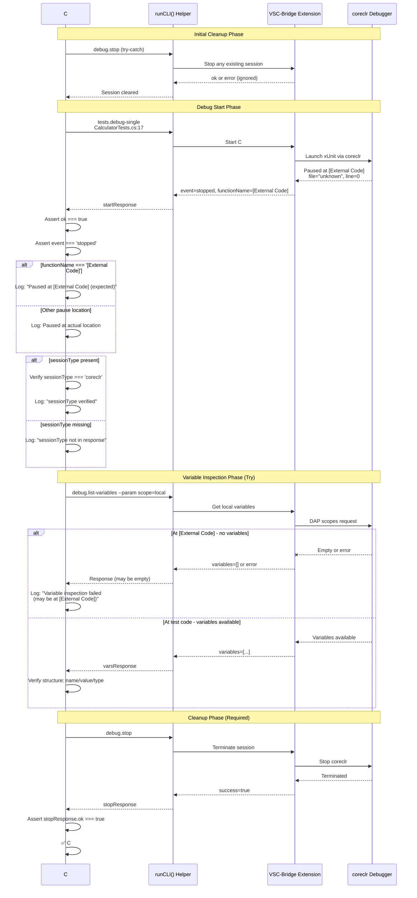

# Phase 4: C# Test Implementation - Tasks + Alignment Brief

**Phase**: Phase 4: C# Test Implementation
**Phase Slug**: phase-4
**Plan**: [cross-language-integration-test-plan.md](../../cross-language-integration-test-plan.md)
**Spec**: [cross-language-integration-test-spec.md](../../cross-language-integration-test-spec.md)
**Created**: 2025-10-09
**Status**: READY FOR IMPLEMENTATION

---

## Tasks

| Status | ID | Task | Type | Dependencies | Absolute Path(s) | Validation | Notes |
|--------|----|----|------|--------------|------------------|------------|-------|
| [ ] | T001 | Review existing Python/JavaScript test implementations | Setup | – | /Users/jordanknight/github/vsc-bridge/test/integration/cross-language-debug.test.ts | Understanding of established patterns for cleanup, CLI calls, and assertions | Serial - prerequisite for understanding pattern |
| [ ] | T002 | Review C# test file and understand [External Code] pause behavior | Setup | T001 | /Users/jordanknight/github/vsc-bridge/test/csharp/SampleTests/CalculatorTests.cs, /Users/jordanknight/github/vsc-bridge/docs/manual-test/debug-single.md | Understanding of C# quirk: pauses at line 0, functionName=[External Code] | Serial - informs test design decisions |
| [ ] | T003 | Add C# test describe block after JavaScript test | Core | T001, T002 | /Users/jordanknight/github/vsc-bridge/test/integration/cross-language-debug.test.ts | New describe block exists with title 'C# (xUnit)' | Serial (shared file with T004-T012) |
| [ ] | T004 | Implement initial cleanup in C# test (debug.stop in try-catch) | Core | T003 | /Users/jordanknight/github/vsc-bridge/test/integration/cross-language-debug.test.ts | Cleanup code matches Python/JavaScript pattern per Critical Discovery 02 | Serial (shared file) |
| [ ] | T005 | Implement C# debug session start using tests.debug-single | Core | T004 | /Users/jordanknight/github/vsc-bridge/test/integration/cross-language-debug.test.ts | Calls runCLI with correct path (CalculatorTests.cs:17), handles CLI_TIMEOUT per Critical Discovery 02 | Serial (shared file) |
| [ ] | T006 | Add assertions for successful debug start (ok=true, event=stopped) | Core | T005 | /Users/jordanknight/github/vsc-bridge/test/integration/cross-language-debug.test.ts | Verifies startResponse.ok === true and startResponse.data.event === 'stopped' | Serial (shared file) |
| [ ] | T007 | Add conditional logging for [External Code] pause location | Core | T006 | /Users/jordanknight/github/vsc-bridge/test/integration/cross-language-debug.test.ts | Logs when functionName === '[External Code]' or file === 'unknown', doesn't fail test | Serial (shared file) - documents known behavior |
| [ ] | T008 | Add sessionType verification (coreclr) with graceful handling | Core | T007 | /Users/jordanknight/github/vsc-bridge/test/integration/cross-language-debug.test.ts | Checks sessionType if present in response, logs if missing (matches Python/JS pattern) | Serial (shared file) |
| [ ] | T009 | Implement variable listing attempt with try-catch wrapper | Core | T008 | /Users/jordanknight/github/vsc-bridge/test/integration/cross-language-debug.test.ts | Attempts debug.list-variables with scope=local, uses try-catch for graceful failure at [External Code] | Serial (shared file) - spec says "check during implementation if this works" |
| [ ] | T010 | Add conditional variable structure verification | Core | T009 | /Users/jordanknight/github/vsc-bridge/test/integration/cross-language-debug.test.ts | If variables returned, verifies first var has name/value/type properties; if not, logs graceful message | Serial (shared file) |
| [ ] | T011 | Implement final cleanup (debug.stop with assertion) | Core | T010 | /Users/jordanknight/github/vsc-bridge/test/integration/cross-language-debug.test.ts | Calls debug.stop and asserts stopResponse.ok === true (must work from any pause state) | Serial (shared file) |
| [ ] | T012 | Add comprehensive comments documenting [External Code] behavior | Doc | T011 | /Users/jordanknight/github/vsc-bridge/test/integration/cross-language-debug.test.ts | Comments explain C# pauses at framework init, not test line; this is expected coreclr behavior | Serial (shared file) |
| [ ] | T013 | Set test timeout to CLI_TIMEOUT (30 seconds) | Core | T003 | /Users/jordanknight/github/vsc-bridge/test/integration/cross-language-debug.test.ts | Test uses { timeout: CLI_TIMEOUT } option like Python/JS tests | Serial (shared file) |
| [ ] | T014 | Add console logging for test progress (matches Python/JS pattern) | Core | T003 | /Users/jordanknight/github/vsc-bridge/test/integration/cross-language-debug.test.ts | Logs: start message, debug start, variable attempt, stop, completion message | Serial (shared file) |
| [ ] | T015 | Manual validation: Build extension and run test | Integration | T001-T014 | /Users/jordanknight/github/vsc-bridge | Runs `just build && npm run test:integration -t "C#"` and verifies test passes | Validation step - confirms implementation works |
| [ ] | T016 | Manual validation: Verify test completes in under 30 seconds | Integration | T015 | /Users/jordanknight/github/vsc-bridge | Test duration logged in output, confirms C# startup time (4-8s) + overhead < 30s | Validation step |
| [ ] | T017 | Manual validation: Verify test handles [External Code] gracefully | Integration | T015 | /Users/jordanknight/github/vsc-bridge | Console output shows "[External Code]" logging, test doesn't fail on this condition | Validation step - confirms graceful handling |
| [ ] | T018 | Manual validation: Run test 3 times to verify consistency | Integration | T015 | /Users/jordanknight/github/vsc-bridge | Test passes 3/3 times without flakiness | Validation step - ensures reliability |
| [ ] | T019 | Update plan.md Phase 4 task statuses to [x] | Doc | T015-T018 | /Users/jordanknight/github/vsc-bridge/docs/plans/11-cross-language-integration-test/cross-language-integration-test-plan.md | All task rows in Phase 4 marked complete in plan | Documentation update |
| [ ] | T020 | Update plan.md progress tracking section | Doc | T019 | /Users/jordanknight/github/vsc-bridge/docs/plans/11-cross-language-integration-test/cross-language-integration-test-plan.md | Phase 4 marked complete, progress updated to 71% (5/7 phases) | Documentation update |

**Parallelization Notes:**
- All tasks T003-T014 operate on the same file → **must run serially**
- Tasks T015-T018 are validation steps → **run serially after implementation**
- Tasks T019-T020 are documentation updates → **run serially after validation**

---

## Alignment Brief

### Objective Recap

Implement automated integration test for C# (xUnit) debugging workflow that validates VSC-Bridge can:
1. Start a C# debug session using `tests.debug-single`
2. Handle the known [External Code] pause behavior gracefully
3. Attempt variable inspection (with graceful failure if at [External Code])
4. Stop the debug session cleanly from any pause state

This phase follows the established pattern from Python (Phase 2) and JavaScript (Phase 3) tests, ensuring consistency in test structure, error handling, and cleanup procedures.

### Behavior Checklist

Tie to plan acceptance criteria (Phase 4):

- [ ] C# test starts debug session successfully
- [ ] Test handles `[External Code]` pause gracefully (logs but continues)
- [ ] Test attempts variable inspection (graceful failure if at External Code)
- [ ] Test stops debug session cleanly from any pause state
- [ ] Test verifies sessionType is 'coreclr' (if present)
- [ ] Test documents [External Code] behavior in comments
- [ ] Test completes in under 30 seconds
- [ ] Manual validation confirms C# workflow works

### Critical Findings Affecting This Phase

**From Plan § 3 - Critical Research Findings:**

1. **🚨 Critical Discovery 02: CLI Execution Pattern** (Tasks T004-T011)
   - **Constraint**: Must use `child_process.exec` with `promisify`, parse JSON from stdout
   - **Impact**: All CLI commands (`tests.debug-single`, `debug.list-variables`, `debug.stop`) must use `runCLI()` helper
   - **Tasks Affected**: T005 (debug start), T009 (list variables), T011 (debug stop)

2. **🚨 Critical Discovery 03: Test Workspace Path Requirements** (Tasks T005, T009, T011)
   - **Constraint**: CLI commands execute from test workspace directory via `cwd` option
   - **Impact**: All debug commands run with `cwd: TEST_WORKSPACE` (already handled in runCLI helper)
   - **Tasks Affected**: All CLI execution tasks inherit this from runCLI implementation

3. **C#-Specific [External Code] Behavior** (NEW - Tasks T007, T009, T012)
   - **Discovery**: C# debugging pauses at `[External Code]` (framework init) instead of test line 17
   - **Response fields**: `file: "unknown"`, `line: 0`, `functionName: "[External Code]"`
   - **Constraint**: Variable inspection may fail at [External Code] - must handle gracefully
   - **Impact**:
     - Task T007: Add conditional logging (don't fail on [External Code])
     - Task T009: Wrap variable listing in try-catch
     - Task T012: Document behavior in comments
   - **Per spec**: "Check during implementation if this works" - we attempt and handle failure

### Invariants & Guardrails

**Performance Budgets:**
- Test must complete in < 30 seconds (CLI_TIMEOUT)
- C# startup typically takes 4-8 seconds (within budget)

**Memory Constraints:**
- Use `maxBuffer: 10MB` in execAsync (inherited from runCLI helper)
- Avoid global scope variable listing (use `scope=local`)

**Security Considerations:**
- No security impact - test runs in controlled environment
- Uses existing CLI token mechanism

**Error Handling:**
- Fail fast on critical errors (debug start failure)
- Graceful failure on known quirks ([External Code] variable inspection)
- Always cleanup (debug.stop) even on failure

### Inputs to Read

**Primary Test File** (modify):
- `/Users/jordanknight/github/vsc-bridge/test/integration/cross-language-debug.test.ts`
  - Lines 299-401: JavaScript test block (reference for pattern)
  - Add C# test block after line 401

**C# Test Target** (read-only):
- `/Users/jordanknight/github/vsc-bridge/test/csharp/SampleTests/CalculatorTests.cs`
  - Line 17: Target breakpoint location
  - Understand test structure for context

**Reference Documentation** (read-only):
- `/Users/jordanknight/github/vsc-bridge/docs/manual-test/debug-single.md`
  - Lines 390-529: C# test procedure
  - Expected responses and verification checklist

**Plan Document** (update after implementation):
- `/Users/jordanknight/github/vsc-bridge/docs/plans/11-cross-language-integration-test/cross-language-integration-test-plan.md`
  - Lines 671-780: Phase 4 task table
  - Lines 1099-1118: Progress tracking section

### Visual Alignment Aids

#### Flow Diagram: C# Test State Machine

```mermaid
flowchart TD
    Start([C# Test Start]) --> Cleanup1[Initial Cleanup: debug.stop try-catch]
    Cleanup1 --> StartDebug[Start Debug: tests.debug-single<br/>CalculatorTests.cs:17]
    StartDebug --> CheckStart{ok === true?}
    CheckStart -->|No| Fail1[❌ Test Fails]
    CheckStart -->|Yes| CheckEvent{event === 'stopped'?}
    CheckEvent -->|No| Fail2[❌ Test Fails]
    CheckEvent -->|Yes| CheckPauseLocation{functionName?}

    CheckPauseLocation -->|[External Code]| LogExternal[📋 Log: Paused at [External Code]<br/>expected behavior]
    CheckPauseLocation -->|Other| LogNormal[📋 Log: Paused at specified location]

    LogExternal --> CheckSessionType[Check sessionType if present]
    LogNormal --> CheckSessionType

    CheckSessionType -->|coreclr present| LogSession[📋 Log: sessionType verified]
    CheckSessionType -->|missing| LogNoSession[📋 Log: sessionType not in response]

    LogSession --> TryVariables[Try: debug.list-variables<br/>scope=local]
    LogNoSession --> TryVariables

    TryVariables --> CheckVars{Variables<br/>returned?}
    CheckVars -->|Yes| VerifyStructure[✅ Verify var structure<br/>name/value/type]
    CheckVars -->|No/Error| LogVarFail[📋 Log: Variable inspection failed<br/>may be at [External Code]]

    VerifyStructure --> Cleanup2[Final Cleanup: debug.stop<br/>ASSERT ok === true]
    LogVarFail --> Cleanup2

    Cleanup2 --> CheckStop{stop ok === true?}
    CheckStop -->|No| Fail3[❌ Test Fails:<br/>Cannot stop session]
    CheckStop -->|Yes| Success[✅ C# Test Complete]

    style Start fill:#e1f5e1
    style Success fill:#e1f5e1
    style Fail1 fill:#ffe1e1
    style Fail2 fill:#ffe1e1
    style Fail3 fill:#ffe1e1
    style LogExternal fill:#fff4e1
    style LogVarFail fill:#fff4e1
```

#### Sequence Diagram: C# Test Execution Flow



### Test Plan

**Testing Approach**: Manual Only (per spec § Testing Philosophy)

**Rationale**: This phase creates an integration test that automates manual testing procedures. The test itself validates through manual execution during implementation.

**Manual Validation Strategy**:

1. **Development Validation**: Run test after each major task group (T003-T014)
2. **Manual Execution**: Execute `npm run test:integration -t "C#"` after implementation
3. **Visual Inspection**: Review test output for correct behavior and [External Code] handling
4. **Consistency Check**: Run test 3 times to ensure no flakiness

**Named Tests** (single test case in this phase):

**Test: `should complete C# debug workflow (may pause at External Code)`**
- **Location**: `test/integration/cross-language-debug.test.ts`, new describe block `C# (xUnit)`
- **Rationale**: Validates full C# debugging lifecycle with graceful handling of [External Code] quirk
- **Fixtures**:
  - Test file: `/Users/jordanknight/github/vsc-bridge/test/csharp/SampleTests/CalculatorTests.cs:17`
  - Constants: `TEST_FILES.csharp`, `TEST_LINES.csharp`, `CLI_TIMEOUT`
- **Expected Output**:
  ```
  🧪 Testing C# debugging...
  🧹 Cleaning up any existing debug session...
  🎯 Starting debug session at ...CalculatorTests.cs:17...
  ✅ Debug session started at line 0
  ℹ️  C# paused at [External Code] (expected behavior)
  ℹ️  sessionType not in response (may be in different field)
  📋 Attempting variable listing...
  ℹ️  Variable inspection failed (may be at [External Code])
  🛑 Stopping debug session...
  ✅ Debug session stopped cleanly
  ✅ C# debugging test passed ✓
  ```

**Mock Usage**: None - test executes against real Extension Host, real CLI, real debugger (per spec mock policy)

### Step-by-Step Implementation Outline

Mapped 1:1 to tasks:

**Setup Phase** (T001-T002):
1. Review Python/JavaScript test implementations for pattern consistency
2. Study C# test file and [External Code] behavior documentation
3. Understand graceful failure requirements

**Core Implementation** (T003-T014):
1. Add C# test describe block after JavaScript test
2. Implement initial cleanup (debug.stop in try-catch)
3. Implement debug session start with tests.debug-single
4. Add assertions for ok=true and event=stopped
5. Add conditional logging for [External Code] pause
6. Add sessionType verification with graceful handling
7. Implement variable listing with try-catch wrapper
8. Add conditional variable structure verification
9. Implement final cleanup with assertion
10. Add comprehensive comments documenting behavior
11. Set test timeout to CLI_TIMEOUT
12. Add console logging for test progress

**Validation Phase** (T015-T018):
1. Build extension: `just build`
2. Run C# test: `npm run test:integration -t "C#"`
3. Verify test passes and handles [External Code] gracefully
4. Verify completion time < 30 seconds
5. Run test 3 times to verify consistency

**Documentation Phase** (T019-T020):
1. Update Phase 4 task statuses in plan.md
2. Update progress tracking section

### Commands to Run

**Environment Setup**:
```bash
# Ensure .NET SDK installed (C# requirement)
dotnet --version  # Should be 9.0 or compatible

# Build C# test project
cd /Users/jordanknight/github/vsc-bridge/test/csharp
dotnet build

# Verify C# Dev Kit extension installed in VS Code
# ms-dotnettools.csdevkit
```

**Build Extension**:
```bash
cd /Users/jordanknight/github/vsc-bridge
just build
```

**Run Integration Test**:
```bash
# Run all integration tests
npm run test:integration

# Run C# test only
npm run test:integration -t "C#"

# Run with verbose output
npm run test:integration -t "C#" -- --reporter=verbose
```

**Validation Commands**:
```bash
# Run test 3 times for consistency check
for i in {1..3}; do
  echo "=== Run $i ==="
  npm run test:integration -t "C#"
done

# Check test duration
npm run test:integration -t "C#" 2>&1 | grep -E "(Duration|C#.*s)"
```

**Linters/Type Checks** (optional):
```bash
# TypeScript type checking
cd /Users/jordanknight/github/vsc-bridge
npx tsc --noEmit

# Vitest type checking
npm run test:integration -- --typecheck
```

### Risks/Unknowns

| Risk | Severity | Likelihood | Mitigation |
|------|----------|------------|------------|
| Variable inspection fails at [External Code] | **Low** | High (expected) | Use try-catch wrapper, log gracefully, don't fail test |
| C# startup exceeds 30 second timeout | **Medium** | Low | Generous timeout accounts for slow coreclr startup (4-8s typical) |
| Test flakiness due to [External Code] variability | **Medium** | Medium | Run 3 times during validation (T018), ensure graceful handling |
| sessionType field missing from response | **Low** | Medium | Graceful handling already implemented (per Python/JS pattern) |
| Debug.stop fails from [External Code] state | **High** | Low | Per manual test docs, stop works from any state; validate in T015 |
| .NET SDK not configured in test environment | **Medium** | Low | Document prerequisite, validate during setup |

**Severity Levels**:
- **Low**: Test logs warning but continues
- **Medium**: Test may fail but is recoverable
- **High**: Test fails and blocks phase completion

### Ready Check

Before starting implementation (`/plan-6-implement-phase`), verify:

- [ ] Plan document reviewed and Phase 4 tasks understood
- [ ] Critical Discoveries 02-03 understood and will be applied
- [ ] C# [External Code] behavior documented and understood
- [ ] Python/JavaScript test patterns reviewed for consistency
- [ ] C# test file location confirmed: `test/csharp/SampleTests/CalculatorTests.cs:17`
- [ ] .NET SDK installed and C# test project builds successfully
- [ ] Test workspace structure understood (per Critical Discovery 03)
- [ ] Manual validation strategy understood (3 test runs minimum)
- [ ] Graceful failure pattern understood for variable inspection
- [ ] All 20 tasks (T001-T020) reviewed and appear actionable

**Status**: ⏸️ AWAITING GO/NO-GO FROM USER

---

## Phase Footnote Stubs

**Note**: Footnotes will be added during implementation (plan-6) to document specific code changes. This section provides the structure for the Change Footnotes Ledger.

### Footnote Format

```markdown
[^N]: Modified [file:path/to/file](path/to/file#LX) – Description of change with context
```

### Placeholder Table

| Footnote | Task | Type | Description |
|----------|------|------|-------------|
| [^TBD] | T003-T014 | Code | C# test implementation details |
| [^TBD] | T019-T020 | Doc | Plan document updates |

**Actual footnotes will be created during plan-6 execution and added to the main plan document's Change Footnotes Ledger.**

---

## Evidence Artifacts

### Execution Log

**Location**: `/Users/jordanknight/github/vsc-bridge/docs/plans/11-cross-language-integration-test/tasks/phase-4/execution.log.md`

**Purpose**: Real-time log of implementation progress, decisions, and validation results

**Structure**:
```markdown
# Phase 4 Implementation Log

## Task T001: Review existing implementations
- [timestamp] Started review of Python test
- [timestamp] Identified pattern: cleanup → start → vars → stop
- [timestamp] ✅ Complete

## Task T002: Review C# behavior
...

## Validation Results
- Run 1: PASS (duration: Xs)
- Run 2: PASS (duration: Xs)
- Run 3: PASS (duration: Xs)
```

### Supporting Files

None required for this phase. All implementation in existing test file.

---

## Directory Layout

```
docs/plans/11-cross-language-integration-test/
├── cross-language-integration-test-plan.md
├── cross-language-integration-test-spec.md
└── tasks/
    ├── phase-1/
    │   ├── tasks.md
    │   └── execution.log.md
    ├── phase-2/
    │   ├── tasks.md
    │   ├── execution.log.md
    │   └── 001-subtask-bake-in-tests-show-testing-ui-script-to-enable-python-test-discovery.execution.log.md
    ├── phase-3/
    │   ├── tasks.md
    │   └── execution.log.md
    └── phase-4/  # ← THIS PHASE
        ├── tasks.md  # ← This file
        └── execution.log.md  # ← Created by /plan-6
```

---

## Next Steps

**When ready to implement:**

```bash
/plan-6-implement-phase --phase "Phase 4: C# Test Implementation" --plan "/Users/jordanknight/github/vsc-bridge/docs/plans/11-cross-language-integration-test/cross-language-integration-test-plan.md"
```

This will execute tasks T001-T020 sequentially, creating the execution log and updating the main plan document with footnotes.

---

**End of Tasks + Alignment Brief Dossier**
