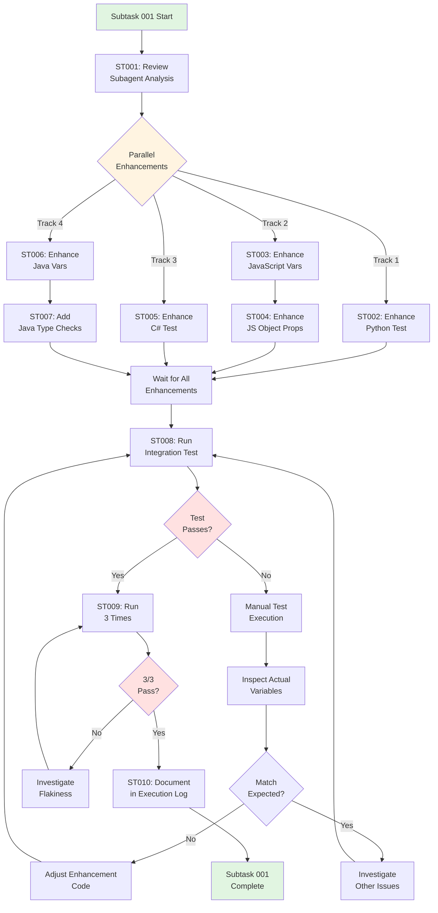
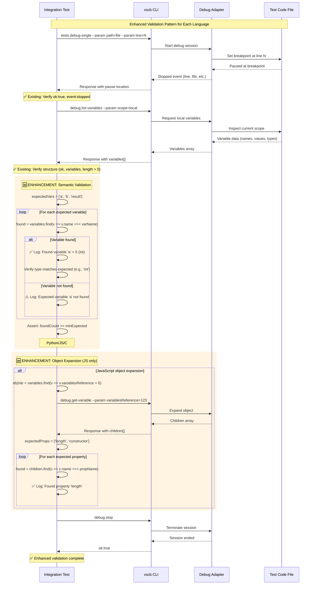

# Subtask 001: Enhance Integration Tests with Semantic Variable Validation

**Parent Plan**: [cross-language-integration-test-plan.md](../../cross-language-integration-test-plan.md)
**Parent Phase**: Phase 6: Justfile Integration and Documentation
**Parent Tasks**: T006 (test validation quality), T016-T020 (stability validation)
**Subtask Summary**: Enhance integration tests with semantic variable validation
**Requested By**: Human Sponsor
**Created**: 2025-10-09

---

## Subtask Metadata

| Field | Value |
|-------|-------|
| Parent Plan | `/Users/jordanknight/github/vsc-bridge/docs/plans/11-cross-language-integration-test/cross-language-integration-test-plan.md` |
| Parent Phase | Phase 6: Justfile Integration and Documentation |
| Parent Task(s) | T006 (test that just test-integration works), T016-T020 (stability validation chain) |
| Subtask Summary | Enhance integration tests with semantic variable validation |
| Requested By | Human Sponsor |
| Created | 2025-10-09 |
| Status | PENDING |

---

## Tasks

| Status | ID | Task | Type | Dependencies | Absolute Path(s) | Validation | Notes |
|--------|----|----|------|--------------|------------------|------------|-------|
| [ ] | ST001 | Review subagent analysis report for validation gaps | Setup | – | N/A (in-memory analysis from general-purpose agent) | Analysis understood: all 4 tests use list-variables but lack semantic validation | Subagent found: structural validation ✅, semantic validation ⚠️ missing; supports parent T006 |
| [ ] | ST002 | Enhance Python test with expected variable validation | Core | ST001 | `/Users/jordanknight/github/vsc-bridge/test/integration/cross-language-debug.test.ts` (lines 284-343, Python test block) | Python test validates 3 expected variables (a, b, result) with types | Add validation after line 334; breakpoint at test_example.py:29; expects Python int type |
| [ ] | ST003 | Enhance JavaScript test with expected variable validation | Core | ST001 | `/Users/jordanknight/github/vsc-bridge/test/integration/cross-language-debug.test.ts` (lines 363-446, JavaScript test block) | JavaScript test validates expected variables (expect, result) with types | Add validation after line 411; breakpoint at example.test.js:533; also enhance object expansion validation |
| [ ] | ST004 | Enhance JavaScript test object expansion with property checks | Core | ST003 | `/Users/jordanknight/github/vsc-bridge/test/integration/cross-language-debug.test.ts` (lines 425-437, object expansion section) | Object expansion validates specific properties exist in children array | Add property validation after line 437; check for common properties like 'length', 'constructor' |
| [ ] | ST005 | Enhance C# test with expected variable validation | Core | ST001 | `/Users/jordanknight/github/vsc-bridge/test/integration/cross-language-debug.test.ts` (lines 469-579, C# test block) | C# test validates expected variables (result, calculator) when paused at test code | Add validation after line 554 within success condition; breakpoint at CalculatorTests.cs:17; graceful when at [External Code] |
| [ ] | ST006 | Enhance Java test with expected variable validation | Core | ST001 | `/Users/jordanknight/github/vsc-bridge/test/integration/cross-language-debug.test.ts` (lines 598-670, Java test block) | Java test validates at least 5 of 9 expected variables (i, s, list, map, p, r, pipeline, arr, this) | Add validation after line 650; breakpoint at DebugTest.java:28; comment already mentions 9 vars but doesn't check them |
| [ ] | ST007 | Add type validation for Java test variables | Core | ST006 | `/Users/jordanknight/github/vsc-bridge/test/integration/cross-language-debug.test.ts` (lines 650-660, variable structure validation) | Java test validates variable types for known primitives (e.g., i should be int/Integer) | Add type checks for primitive variables where type is predictable |
| [ ] | ST008 | Run enhanced integration test to verify all changes work | Integration | ST002, ST003, ST004, ST005, ST006, ST007 | `/Users/jordanknight/github/vsc-bridge/test/integration/cross-language-debug.test.ts` | Test runs successfully, all 4 languages pass with enhanced validations | Use `just test-integration`; all tests should pass with new assertions |
| [ ] | ST009 | Run integration test 3 times for stability verification | Integration | ST008 | `/Users/jordanknight/github/vsc-bridge/test/integration/cross-language-debug.test.ts` | 3/3 test runs pass with enhanced validations | Reduced from parent T016's 10 runs since this is a subtask; capture timing and results |
| [ ] | ST010 | Document validation enhancements in execution log | Doc | ST009 | `/Users/jordanknight/github/vsc-bridge/docs/plans/11-cross-language-integration-test/tasks/phase-6/001-subtask-enhance-integration-tests-with-semantic-variable-validation.execution.log.md` | Execution log documents all changes with line numbers and validation results | Include specific variable names checked, types validated, stability results (3/3 passes) |

**Task Summary**:
- Total Tasks: 10
- Setup: 1 task (ST001)
- Core Implementation: 6 tasks (ST002-ST007)
- Integration & Validation: 2 tasks (ST008-ST009)
- Documentation: 1 task (ST010)

**Dependencies**:
- ST001 → ST002, ST003, ST005, ST006 (review analysis before implementing)
- ST003 → ST004 (JavaScript variable validation before object expansion enhancement)
- ST006 → ST007 (Java variable validation before type checks)
- ST002, ST003, ST004, ST005, ST006, ST007 → ST008 (all enhancements complete before running test)
- ST008 → ST009 (first test pass before stability runs)
- ST009 → ST010 (validation complete before documenting)

---

## Alignment Brief

### Objective

Enhance the cross-language integration test suite with semantic variable validation to improve test quality and reliability. Currently, all 4 language tests (Python, JavaScript, C#, Java) use `debug.list-variables` but only validate **structure** (presence of arrays, properties exist). This subtask adds **semantic validation** (specific variable names, values, types) to ensure tests detect regressions in actual debug data, not just response format.

**Targeted Parent Phase Goal**: Supports Phase 6's objective to deliver production-ready integration tests by improving test robustness before finalizing documentation and stability validation (parent tasks T006, T016-T020).

### Behavior Checklist

From subtask objectives:
- [ ] Python test validates 3 expected variables: `a`, `b`, `result` (at test_example.py:29)
- [ ] Python test verifies variable types match Python expectations (e.g., `int`)
- [ ] JavaScript test validates expected variables: `expect`, `result` (at example.test.js:533)
- [ ] JavaScript test validates object expansion includes specific properties
- [ ] C# test validates expected variables: `result`, `calculator` (when paused at test code, not [External Code])
- [ ] Java test validates at least 5 of 9 expected variables: `i`, `s`, `list`, `map`, `p`, `r`, `pipeline`, `arr`, `this`
- [ ] Java test validates types for primitive variables (e.g., `i` is `int`/`Integer`)
- [ ] Enhanced test runs successfully 3/3 times for stability
- [ ] All changes documented in execution log with line numbers

### Critical Findings Affecting This Subtask

**From Subagent Analysis** (general-purpose agent review of integration tests):

#### Finding 01: All Tests Use list-variables ✅
**Context**: All 4 language tests (Python, JavaScript, C#, Java) use `debug.list-variables` command with `scope=local` parameter.
**Impact**: Infrastructure is solid - no need to add missing commands.
**Subtask Action**: Build on existing foundation, enhance what's already there.

#### Finding 02: Structural Validation is Good ✅
**Context**: All tests verify:
- Response `ok` property is true
- `data.variables` is defined
- Array length > 0
- Variable structure has `name`, `value`, `type` properties
**Impact**: Response format validation is robust.
**Subtask Action**: Keep existing structural checks, add semantic checks on top.

#### Finding 03: Semantic Validation is Minimal ⚠️
**Context**: Tests verify structure but NOT:
- Specific variable names expected at breakpoint line
- Variable values or types match expected language types
- Presence of all expected test variables
**Impact**: Tests could pass even if debug adapter returns wrong variables or incorrect data.
**Subtask Action**: **PRIMARY GOAL** - Add validation for expected variable names, values (where predictable), and types.
**Tasks Addressing**: ST002 (Python), ST003-ST004 (JavaScript), ST005 (C#), ST006-ST007 (Java)

#### Finding 04: JavaScript Has Excellent Object Expansion ✅
**Context**: JavaScript test expands objects via `debug.get-variable` and validates children structure.
**Impact**: Object expansion pattern works well.
**Subtask Action**: Enhance by validating specific property names in expanded children (ST004).

#### Finding 05: Java Test Has Unvalidated Expectations ⚠️
**Context**: Java test comment (line 638) says "expect at least 5: i, s, list, map, p, r, pipeline, arr, this" but only checks `length > 0`.
**Impact**: Test doesn't actually validate the 9 variables it claims to expect.
**Subtask Action**: **HIGH PRIORITY** - Implement validation for these 9 variables (ST006), require at least 5 found.
**Tasks Addressing**: ST006, ST007

#### Finding 06: C# Graceful Failure is Appropriate ✅
**Context**: C# test uses try-catch for variable inspection due to [External Code] pausing.
**Impact**: Already handles known limitation gracefully.
**Subtask Action**: Add semantic validation **only when paused at test code** (within success condition at line 554+).

### Invariants & Guardrails

**Test Stability**:
- Enhanced tests MUST pass 3/3 validation runs (ST009)
- If any enhancement breaks existing test, revert and adjust approach
- Maintain graceful failure handling for C# [External Code] behavior

**Validation Approach**:
- Use **informative console logging** for debugging (log found variables, types)
- Use **lenient assertions** where appropriate (e.g., "at least 5 of 9" for Java)
- Do NOT break existing tests - enhancements should be additive
- Use `find()` to check for variable names, not strict array index checks

**Code Quality**:
- Keep validation logic concise and readable
- Use helper patterns like `expectedVars.forEach()` for clarity
- Add comments explaining what each validation checks
- Preserve existing structural validation - don't remove it

**Language-Specific Constraints**:
- **Python**: Variable types may be `int`, `str`, etc. (Python type names)
- **JavaScript**: Variable types may be `number`, `string`, `object`, etc. (JS type names)
- **C#**: Only validate when `varsResponse.ok` and variables exist (not at [External Code])
- **Java**: Variables are in nested `scopeVar.children` array - access via `actualVariables`

### Inputs to Read

**Files to understand before implementation**:
1. `/Users/jordanknight/github/vsc-bridge/test/integration/cross-language-debug.test.ts` - Integration test file (focus on lines 284-670 for 4 language tests)
2. `/Users/jordanknight/github/vsc-bridge/test/python/test_example.py` - Python test file (line 29 for expected variables)
3. `/Users/jordanknight/github/vsc-bridge/test/javascript/example.test.js` - JavaScript test file (line 533 for expected variables)
4. `/Users/jordanknight/github/vsc-bridge/test/csharp/SampleTests/CalculatorTests.cs` - C# test file (line 17 for expected variables)
5. `/Users/jordanknight/github/vsc-bridge/test/java/src/test/java/com/example/DebugTest.java` - Java test file (line 28 for expected variables)

**Context from subagent analysis**:
- Subagent report (in-memory) documents current validation state and specific recommendations for each language
- Specific line numbers where validation should be added
- Expected variable lists for each test file at breakpoint line

### Visual Alignment Aids

#### Flow Diagram: Subtask Implementation Flow



#### Sequence Diagram: Variable Validation Enhancement Pattern



### Test Plan

**Testing Approach**: Manual Only (per parent plan § 4)

This subtask enhances existing integration tests but does not create new test infrastructure. Validation is manual:

**Manual Validation Tasks**:
1. **Enhancement Verification** (ST008):
   - Run `just test-integration` after implementing all enhancements
   - Verify all 4 language tests pass
   - Check console output shows new validation logging (found variables, types)
   - Confirm test completes in expected time (< 3 minutes total)

2. **Stability Verification** (ST009):
   - Run `just test-integration` 3 consecutive times
   - Record pass/fail for each run
   - Capture any failures or error messages
   - Acceptance gate: 3/3 must pass

3. **Code Review Verification** (implicit in ST002-ST007):
   - Review each enhancement for code quality
   - Verify variable names match test file expectations
   - Check type validation uses correct language type names
   - Ensure graceful failure handling preserved (C#)

**Acceptance Criteria**:
- [ ] Python test validates `a`, `b`, `result` with types
- [ ] JavaScript test validates `expect`, `result` + object properties
- [ ] C# test validates `result`, `calculator` (when at test code)
- [ ] Java test validates at least 5 of 9 expected variables
- [ ] Java test validates types for primitives
- [ ] 3/3 test runs pass with enhancements
- [ ] Console logs show validation results for debugging
- [ ] All changes documented in execution log

### Step-by-Step Implementation Outline

**Phase 1: Setup (ST001)**
1. Review subagent analysis report
2. Understand validation gaps for each language
3. Note specific line numbers for enhancements
4. Plan implementation approach

**Phase 2: Parallel Enhancements (ST002-ST007)**

**Track 1 - Python (ST002)**:
1. Read `/Users/jordanknight/github/vsc-bridge/test/python/test_example.py` line 29
2. Identify expected variables: `a`, `b`, `result`
3. Add validation after line 334 in integration test
4. Check for each variable name in `varsResponse.data.variables`
5. Verify types are Python types (`int`, `str`, etc.)
6. Add informative console logging

**Track 2 - JavaScript (ST003, ST004)**:
1. Read `/Users/jordanknight/github/vsc-bridge/test/javascript/example.test.js` line 533
2. Identify expected variables: `expect`, `result`
3. Add validation after line 411 in integration test (ST003)
4. Add object property validation after line 437 (ST004)
5. Check for properties like `length`, `constructor` in expanded children
6. Add informative console logging

**Track 3 - C# (ST005)**:
1. Read `/Users/jordanknight/github/vsc-bridge/test/csharp/SampleTests/CalculatorTests.cs` line 17
2. Identify expected variables: `result`, `calculator`
3. Add validation after line 554 **within success condition** (only when paused at test code)
4. Preserve graceful failure when at [External Code]
5. Add informative console logging

**Track 4 - Java (ST006, ST007)**:
1. Read `/Users/jordanknight/github/vsc-bridge/test/java/src/test/java/com/example/DebugTest.java` line 28
2. Identify expected variables: `i`, `s`, `list`, `map`, `p`, `r`, `pipeline`, `arr`, `this` (9 total)
3. Add validation after line 650 for variable names (ST006)
4. Require at least 5 of 9 variables found
5. Add type validation for primitives like `i` (should be `int`/`Integer`) (ST007)
6. Add informative console logging

**Phase 3: Integration (ST008-ST009)**
1. Run `just test-integration` to verify all enhancements work
2. Check console output for validation logs
3. Fix any broken tests
4. Run 3 consecutive times for stability
5. Document pass/fail results

**Phase 4: Documentation (ST010)**
1. Create execution log with task timeline
2. Document all file modifications with line numbers
3. Include validation results (3/3 passes)
4. Note specific variables validated per language
5. Capture console log examples

### Commands to Run

**Test File Inspection**:
```bash
# Review test files to understand expected variables
cat /Users/jordanknight/github/vsc-bridge/test/python/test_example.py | sed -n '25,35p'
cat /Users/jordanknight/github/vsc-bridge/test/javascript/example.test.js | sed -n '530,540p'
cat /Users/jordanknight/github/vsc-bridge/test/csharp/SampleTests/CalculatorTests.cs | sed -n '15,20p'
cat /Users/jordanknight/github/vsc-bridge/test/java/src/test/java/com/example/DebugTest.java | sed -n '25,35p'
```

**Enhancement Validation** (ST008):
```bash
cd /Users/jordanknight/github/vsc-bridge
just build
just test-integration
```

**Stability Validation** (ST009):
```bash
cd /Users/jordanknight/github/vsc-bridge
for i in {1..3}; do
    echo "========== Validation Run $i/3 =========="
    time just test-integration
    if [ $? -ne 0 ]; then
        echo "❌ Run $i failed"
    else
        echo "✅ Run $i passed"
    fi
    echo ""
done
```

**Console Output Check**:
```bash
# Enhanced tests should show validation logging like:
# "✅ Found expected variable: a = 5 (int)"
# "✅ Found expected variable: result = 3 (int)"
# "⚠️  Expected variable not found: calculator" (if at [External Code])
```

### Troubleshooting: Manual Test Execution When Automated Tests Fail

If `just test-integration` fails after implementing enhancements (ST008), use this procedure to manually execute tests and inspect outputs:

#### Step 1: Launch Extension Host Manually

```bash
cd /Users/jordanknight/github/vsc-bridge

# Option A: Launch via CLI script (recommended)
vscb script run debug.start --param launch="Run Extension"

# Option B: Press F5 in VS Code to launch Extension Development Host
# Opens new window titled "[Extension Development Host]"
# Then manually open test workspace: File → Open Folder → select /Users/jordanknight/github/vsc-bridge/test
```

**Verification**: Extension Host should be running with test workspace open. Check for `.vsc-bridge/` directory in test workspace.

#### Step 2: Test Each Language Manually

Run these commands from the **test workspace directory** (not project root):

```bash
cd /Users/jordanknight/github/vsc-bridge/test

# Python Test - Manually validate variables at test_example.py:29
vscb script run tests.debug-single \
  --param path="$(pwd)/python/test_example.py" \
  --param line=29

# Should pause at line 29, now list variables:
vscb script run debug.list-variables --param scope=local

# Expected variables at line 29:
# - a (value: some int)
# - b (value: some int)
# - result (value: computed int)

# Inspect actual variable names and types in output
# Compare against expected list in enhancement code

# Stop debug session:
vscb script run debug.stop
```

```bash
# JavaScript Test - Manually validate variables at example.test.js:533
vscb script run tests.debug-single \
  --param path="$(pwd)/javascript/example.test.js" \
  --param line=533

# List variables:
vscb script run debug.list-variables --param scope=local

# Expected variables:
# - expect (likely an object with variablesReference > 0)
# - result (value from test execution)

# Test object expansion:
# 1. Find a variable with variablesReference > 0 in output above
# 2. Use that reference ID:
vscb script run debug.get-variable \
  --param variablesReference=<ID_FROM_ABOVE> \
  --param count=10

# Expected properties in children:
# - length, constructor, or other object properties

vscb script run debug.stop
```

```bash
# C# Test - Manually validate variables at CalculatorTests.cs:17
# Note: C# requires explicit breakpoint setting before debug start

vscb script run bp.set \
  --param path="$(pwd)/csharp/SampleTests/CalculatorTests.cs" \
  --param line=17

vscb script run tests.debug-single \
  --param path="$(pwd)/csharp/SampleTests/CalculatorTests.cs" \
  --param line=17

# Check pause location - may be at [External Code] or line 17
# If at [External Code]: functionName will be "[External Code]", line may be 0
# If at test code: functionName will be test method name, line will be 17

vscb script run debug.list-variables --param scope=local

# Expected variables (ONLY if paused at line 17, not [External Code]):
# - result (value from test execution)
# - calculator (Calculator instance)

# If at [External Code], variable list may be empty or contain framework variables
# This is EXPECTED BEHAVIOR - see Phase 4 notes

vscb script run debug.stop
```

```bash
# Java Test - Manually validate variables at DebugTest.java:28
vscb script run tests.debug-single \
  --param path="$(pwd)/java/src/test/java/com/example/DebugTest.java" \
  --param line=28

vscb script run debug.list-variables --param scope=local

# IMPORTANT: Java returns NESTED structure
# Response will have a scope variable with children array
# Look for: data.variables[0].children containing actual variables

# Expected variables in children array (9 total):
# - i (int)
# - s (String)
# - list (ArrayList or similar)
# - map (HashMap or similar)
# - p (Point or object)
# - r (some variable)
# - pipeline (some variable)
# - arr (array)
# - this (DebugTest instance)

# Verify at least 5 of these 9 are present
# Check types for primitives (i should be int/Integer)

vscb script run debug.stop
```

#### Step 3: Compare Manual Results to Expected Enhancements

For each language, check:

1. **Variable Names**: Do actual variable names match expected list in enhancement code?
   - If NO: Update expected variable lists in ST002-ST006 code

2. **Variable Types**: Do actual types match expected (e.g., Python `int`, JS `number`)?
   - If NO: Adjust type validation to match actual adapter responses (use `.toMatch()` or `.includes()`)

3. **Variable Structure**: Does response structure match what enhancement code expects?
   - Python/JS/C#: `data.variables` array directly
   - Java: `data.variables[0].children` array (nested scope)

4. **Object Expansion** (JavaScript only): Does expansion return children with expected properties?
   - If NO: Adjust expected property list in ST004 code

#### Step 4: Adjust Enhancement Code Based on Findings

Common adjustments needed:

**Scenario 1: Variable names don't match expectations**
```typescript
// BEFORE (expected):
const expectedVars = ['a', 'b', 'result'];

// AFTER (adjust to actual):
const expectedVars = ['actual_var1', 'actual_var2', 'actual_var3'];
```

**Scenario 2: Type names differ**
```typescript
// BEFORE (strict equality):
expect(varType).toBe('int');

// AFTER (lenient matching):
expect(varType).toMatch(/int|Integer/i);
```

**Scenario 3: Java structure differs**
```typescript
// BEFORE (assumes direct access):
const actualVariables = varsResponse.data.variables;

// AFTER (handle nested scope):
const scopeVar = varsResponse.data.variables.find(v => v.name.includes('Scope'));
const actualVariables = scopeVar?.children || [];
```

**Scenario 4: Object properties differ (JavaScript)**
```typescript
// BEFORE (expected):
const expectedProps = ['length', 'constructor'];

// AFTER (adjust to actual):
const expectedProps = ['actualProp1', 'actualProp2'];
```

#### Step 5: Re-run Automated Test After Adjustments

```bash
cd /Users/jordanknight/github/vsc-bridge
just build
just test-integration
```

If still failing, repeat Steps 2-5 for the failing language test.

#### Step 6: Stop Extension Host When Done

```bash
# From project root:
cd /Users/jordanknight/github/vsc-bridge
vscb script run debug.stop

# Or close Extension Development Host window in VS Code
```

### Risks & Unknowns

**Risk 1**: Test files may not have expected variables at documented breakpoint lines (Severity: Medium, Likelihood: Low)
- **Impact**: Validation will fail even though test infrastructure works
- **Mitigation**: Inspect test files at breakpoint lines before implementation (ST001)
- **Detection**: ST008 first test run will fail if expectations are wrong
- **Resolution**: Adjust expected variable lists based on actual test file content

**Risk 2**: Language-specific type names may differ from expectations (Severity: Low, Likelihood: Medium)
- **Impact**: Type validation may fail due to naming differences (e.g., "Integer" vs "int")
- **Mitigation**: Use `.toMatch()` instead of strict equality for types, or `.includes()` for partial matching
- **Detection**: ST008 test run shows type validation failures
- **Resolution**: Update type checks to match actual adapter responses

**Risk 3**: C# semantic validation may never execute if always pauses at [External Code] (Severity: Low, Likelihood: High)
- **Impact**: C# enhancement provides no value if never paused at test code
- **Mitigation**: Accept this as acceptable - enhancement is opportunistic when C# pauses correctly
- **Detection**: Console logs will show whether C# validation runs or skips
- **Resolution**: No action needed - graceful skip is acceptable per Finding 06

**Risk 4**: Java expected variables list from comment may be incorrect (Severity: Medium, Likelihood: Low)
- **Impact**: Validation fails because comment doesn't match actual test file
- **Mitigation**: Verify comment accuracy against actual DebugTest.java:28 before implementation
- **Detection**: ST001 file inspection will reveal if comment is accurate
- **Resolution**: Adjust expected variable list to match actual test file

**Risk 5**: Enhanced validations introduce flakiness (Severity: High, Likelihood: Low)
- **Impact**: Tests that passed 100% now fail intermittently
- **Mitigation**: Use lenient assertions (e.g., "at least N variables" not "exactly N")
- **Detection**: ST009 stability runs show < 3/3 passes
- **Resolution**: Relax validation criteria or remove problematic assertions

### Ready Check

**Prerequisites** (verify before starting):
- [ ] Subagent analysis report available (completed during planning)
- [ ] Integration test file exists at known path
- [ ] All 4 language tests currently pass without enhancements
- [ ] Test files exist at expected paths (python/test_example.py, etc.)
- [ ] No uncommitted changes in integration test file

**Go/No-Go Checklist**:
- [ ] Subagent recommendations understood for all 4 languages
- [ ] Breakpoint lines known: Python:29, JS:533, C#:17, Java:28
- [ ] Expected variable lists documented in this brief
- [ ] Type validation approach planned (lenient matching)
- [ ] Execution log template ready

**Blocking Issues** (abort if any are YES):
- [ ] Current integration test is failing (must pass baseline first)
- [ ] Test files don't exist at expected paths
- [ ] Breakpoint lines have changed and no longer contain test code
- [ ] Integration test file has merge conflicts or pending changes

---

## Phase Footnote Stubs

**Note**: Footnotes will be added to the main plan's Change Footnotes Ledger during implementation. This section reserves space for tracking subtask implementation details.

After implementation, footnotes will document:
- Python test enhancement (line numbers, variables validated)
- JavaScript test enhancements (variable + object property validation)
- C# test enhancement (conditional validation when at test code)
- Java test enhancements (9-variable validation, type checks)
- Stability validation results (3/3 pass confirmation)
- Any issues encountered and resolutions

Format (to be populated during implementation):
```markdown
[^N]: Modified [file:test/integration/cross-language-debug.test.ts](test/integration/cross-language-debug.test.ts#L334) – Enhanced Python test with semantic validation for variables a, b, result (supports parent T006, subtask ST002)
```

---

## Evidence Artifacts

### Execution Log

**Location**: `/Users/jordanknight/github/vsc-bridge/docs/plans/11-cross-language-integration-test/tasks/phase-6/001-subtask-enhance-integration-tests-with-semantic-variable-validation.execution.log.md`

**Contents** (to be created during implementation):
- Task-by-task execution timeline (ST001-ST010)
- Subagent analysis summary (ST001)
- Python enhancement details: line numbers, expected variables, validation code (ST002)
- JavaScript enhancement details: variable validation + object property validation (ST003-ST004)
- C# enhancement details: conditional validation approach (ST005)
- Java enhancement details: 9-variable validation + type checks (ST006-ST007)
- First test run results (ST008): pass/fail, timing, console output
- Stability validation results (ST009): 3 runs with individual pass/fail + timing
- Final acceptance criteria verification
- Console log examples showing validation output

### Supporting Files

**Console Output Examples**: Capture representative test output showing validation logging:
```bash
# Example expected output:
# Testing Python debugging...
# ℹ️  Checking for 3 expected Python variables...
# ✅ Found expected variable: a = 5 (int)
# ✅ Found expected variable: b = 3 (int)
# ✅ Found expected variable: result = 2 (int)
# ✅ Found 3/3 expected variables
# Python debugging test passed ✓
```

**Stability Run Logs**: Capture results from 3 validation runs:
```
Run 1/3: ✅ PASS (timing: 48.2s)
Run 2/3: ✅ PASS (timing: 47.8s)
Run 3/3: ✅ PASS (timing: 49.1s)
Average: 48.4s
Result: 3/3 PASS
```

---

## Directory Layout

After subtask implementation:

```
docs/plans/11-cross-language-integration-test/
├── cross-language-integration-test-plan.md    # Main plan (may be updated with subtask footnote)
├── tasks/
│   └── phase-6/
│       ├── tasks.md                                                                    # Parent phase tasks
│       ├── 001-subtask-enhance-integration-tests-with-semantic-variable-validation.md  # This file
│       └── 001-subtask-enhance-integration-tests-with-semantic-variable-validation.execution.log.md  # Created by plan-6
```

**File Ownership**:
- `001-subtask-*.md`: Created by `/plan-5a-subtask-tasks-and-brief` (this command)
- `001-subtask-*.execution.log.md`: Created by `/plan-6-implement-phase --subtask` during implementation
- Main plan footnotes: Updated by `/plan-6a-update-progress` after implementation

---

## Next Steps

**DO NOT PROCEED** until sponsor reviews and approves:
1. Review subtask scope (10 tasks, semantic validation for all 4 languages)
2. Confirm expected variable lists are accurate
3. Verify validation approach is appropriate (lenient, informative logging)
4. Approve 3-run stability gate (reduced from parent's 10-run requirement)
5. Review implementation plan and task breakdown

**When approved**, run:
```bash
/plan-6-implement-phase --subtask "001-subtask-enhance-integration-tests-with-semantic-variable-validation" \
  --plan "/Users/jordanknight/github/vsc-bridge/docs/plans/11-cross-language-integration-test/cross-language-integration-test-plan.md"
```

**Estimated Duration**: 1-2 hours
- Setup & Analysis: 15 minutes
- Python Enhancement: 15 minutes
- JavaScript Enhancements: 20 minutes (variables + object properties)
- C# Enhancement: 15 minutes
- Java Enhancements: 25 minutes (variables + types)
- Testing & Validation: 15 minutes (3 runs × ~2 min each = 6 min + buffer)
- Documentation: 15 minutes

**Completion Criteria**:
- All 10 tasks marked `[x]`
- 3/3 stability validation passes
- Integration test file enhanced with semantic validation for all 4 languages
- Execution log complete with evidence and console output examples
- Parent tasks T006, T016-T020 benefit from improved test quality

**Parent Task Linkage**:
- **Supports T006** (test that just test-integration works): Enhanced validations improve test quality and reliability
- **Supports T016-T020** (stability validation chain): Stronger assertions make stability metrics more meaningful

---

**Subtask 001 Dossier - Ready for Review** ✅
