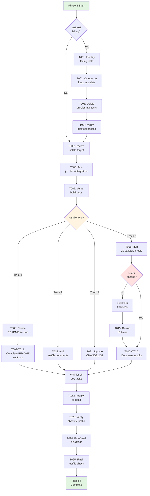
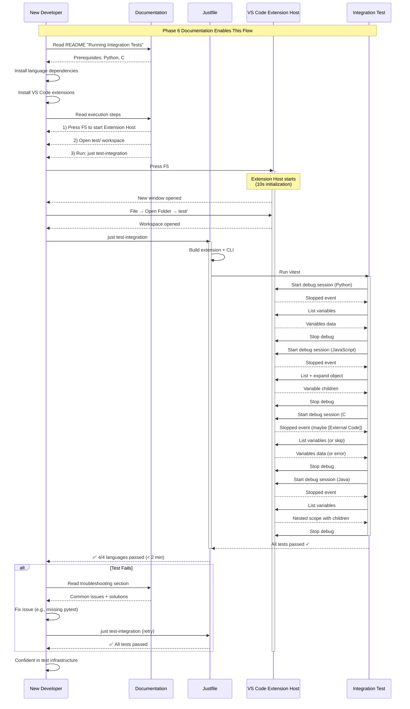

# Phase 6: Justfile Integration and Documentation - Tasks Dossier

**Phase**: Phase 6: Justfile Integration and Documentation
**Slug**: `phase-6`
**Spec**: [cross-language-integration-test-spec.md](../../cross-language-integration-test-spec.md)
**Plan**: [cross-language-integration-test-plan.md](../../cross-language-integration-test-plan.md)
**Created**: 2025-10-09
**Status**: PENDING

---

## Tasks

| Status | ID | Task | Type | Dependencies | Absolute Path(s) | Validation | Notes |
|--------|----|----|------|--------------|------------------|------------|-------|
| [ ] | T001 | Run `just test` to identify failing tests | Setup | – | `/Users/jordanknight/github/vsc-bridge/justfile` (line 66), `/Users/jordanknight/github/vsc-bridge/test/`, `/Users/jordanknight/github/vsc-bridge/extension/test/` | Output captured showing which tests fail and why | Use this to categorize what to keep vs delete per user preference; [P] eligible (diagnostic task) |
| [ ] | T002 | Review failing test files and categorize as keep vs delete | Setup | T001 | Files identified in T001 output | List of tests to keep vs delete documented in execution log | User stated: "not precious about older tests - can delete ones being annoying"; Serial (depends on T001 results) |
| [ ] | T003 | Delete or move problematic old tests per user preference | Setup | T002 | Test files identified in T002 for deletion | Problematic test files removed or moved to `old/` subdirectory | Pragmatic approach per user feedback; Serial (depends on T002 decisions) |
| [ ] | T004 | Verify `just test` passes cleanly after cleanup | Setup | T003 | `/Users/jordanknight/github/vsc-bridge/justfile` | `just test` runs without errors, all remaining tests pass | Critical gate before proceeding to documentation phase; Serial (depends on T003 cleanup) |
| [ ] | T005 | Review existing `test-integration` target in justfile | Setup | T004 | `/Users/jordanknight/github/vsc-bridge/justfile` (lines 68-71) | Target structure understood: depends on `build`, runs `npm run test:integration` | Target already exists at line 69, just needs verification; [P] eligible (different concern from test cleanup) |
| [ ] | T006 | Test that `just test-integration` works correctly | Setup | T005 | `/Users/jordanknight/github/vsc-bridge/justfile`, `/Users/jordanknight/github/vsc-bridge/test/integration/cross-language-debug.test.ts` | Test runs successfully, all 4 languages (Python, JS, C#, Java) pass, completes in < 3 minutes | Validates existing infrastructure works end-to-end; Serial (depends on T005 understanding) |
| [ ] | T007 | Verify justfile target includes all necessary build dependencies | Setup | T006 | `/Users/jordanknight/github/vsc-bridge/justfile` (lines 18-19 for build target, 68-71 for test-integration) | Build step includes extension + CLI + manifest compilation | Already has `build` dependency - verify it's sufficient for full integration test; Serial (depends on T006 validation) |
| [ ] | T008 | Create "Running Integration Tests" section in README | Doc | T007 | `/Users/jordanknight/github/vsc-bridge/README.md` | New section exists with clear heading and subsections | Follow example structure from plan Phase 6 acceptance criteria; [P] eligible (new README section, independent from justfile work) |
| [ ] | T009 | Document language prerequisites in README | Doc | T008 | `/Users/jordanknight/github/vsc-bridge/README.md` | Lists Python 3.x, Node.js, .NET SDK, Java JDK 17+ with installation commands | Include pip, npm, dotnet, mvn dependency installation; Serial (same README file) |
| [ ] | T010 | Document VS Code extension prerequisites in README | Doc | T009 | `/Users/jordanknight/github/vsc-bridge/README.md` | Lists required VS Code extensions: ms-python.python, ms-dotnettools.csdevkit, redhat.java, vscjava.vscode-java-debug, vscjava.vscode-java-test, Orta.vscode-jest | Include extension IDs for easy installation; Serial (same README file) |
| [ ] | T011 | Document test execution steps in README | Doc | T010 | `/Users/jordanknight/github/vsc-bridge/README.md` | Step-by-step instructions: 1) Start Extension Host (F5), 2) Open test workspace, 3) Run `just test-integration` | Include manual Extension Host start procedure (Critical Discovery 01 context); Serial (same README file) |
| [ ] | T012 | Add expected output examples to README | Doc | T011 | `/Users/jordanknight/github/vsc-bridge/README.md` | Example output shown: test file names, language names, pass/fail indicators, timing (< 3 min total) | Show realistic timing: Python ~3.5s, JS ~5s, C# ~20s, Java ~3s; Serial (same README file) |
| [ ] | T013 | Create troubleshooting section in README | Doc | T012 | `/Users/jordanknight/github/vsc-bridge/README.md` | Common issues documented: network errors, no debug session, C# [External Code], Java object expansion limitation | Reference known behaviors from Phases 2-5 implementation; Serial (same README file) |
| [ ] | T014 | Document Extension Host CI/CD limitations in README | Doc | T013 | `/Users/jordanknight/github/vsc-bridge/README.md` | CI limitations explained: Extension Host requires GUI, tests may need to be skipped in headless CI | Note this is a known limitation, not a blocker; Serial (same README file) |
| [ ] | T015 | Add or enhance inline comments in justfile integration-test target | Doc | T007 | `/Users/jordanknight/github/vsc-bridge/justfile` (lines 68-71) | Comments explain: 1) What target does, 2) Build dependency requirement, 3) Test scope (4 languages) | Existing target has minimal comments - enhance for clarity; [P] eligible (different file from README, can work in parallel) |
| [ ] | T016 | Run integration test 10 times consecutively for stability validation | Integration | T006 | `/Users/jordanknight/github/vsc-bridge/test/integration/cross-language-debug.test.ts` | 10 test runs completed, results captured (pass count, fail count, timings) | Use loop: `for i in {1..10}; do echo "Run $i:"; just test-integration; done`; [P] eligible (validation task, independent from docs) |
| [ ] | T017 | Document results of 10 stability test runs in execution log | Integration | T016 | `/Users/jordanknight/github/vsc-bridge/docs/plans/11-cross-language-integration-test/tasks/phase-6/execution.log.md` | Pass/fail counts, average timing, any errors/flakiness recorded in execution log | Include per-language timing breakdown; Serial (depends on T016 completion) |
| [ ] | T018 | Investigate and fix any flakiness if detected during validation | Core | T017 | Files identified during investigation (TBD based on findings) | Flaky behavior understood, root cause identified, fix implemented | Skip if 10/10 passes; only execute if flakiness detected in T017; Serial (depends on T017 analysis) |
| [ ] | T019 | Re-run integration test 10 times after flakiness fixes | Integration | T018 | `/Users/jordanknight/github/vsc-bridge/test/integration/cross-language-debug.test.ts` | 10/10 passes achieved, documented in execution log | Only if T018 was executed; Serial (depends on T018 fixes) |
| [ ] | T020 | Document final stability metrics in execution log | Doc | T017 | `/Users/jordanknight/github/vsc-bridge/docs/plans/11-cross-language-integration-test/tasks/phase-6/execution.log.md` | Final pass rate (target: 10/10), average timing (target: < 3 min), consistency verified | Acceptance criteria: Test passes consistently 10/10 times; Serial (after all validation complete, whether T018/T019 needed or not) |
| [ ] | T021 | Add entry to CHANGELOG.md for integration test feature | Doc | T007 | `/Users/jordanknight/github/vsc-bridge/CHANGELOG.md` | Entry describes: cross-language integration test added, 4 languages supported (Python/JS/C#/Java), automated debug workflow validation | Follow conventional changelog format (Added/Changed/Fixed); [P] eligible (different file from README, can work in parallel after setup) |
| [ ] | T022 | Review all documentation for accuracy and completeness | Doc | T014, T015, T021 | `/Users/jordanknight/github/vsc-bridge/README.md`, `/Users/jordanknight/github/vsc-bridge/CHANGELOG.md`, `/Users/jordanknight/github/vsc-bridge/justfile` | All paths verified correct, commands tested, examples accurate, no broken references | Check: absolute paths, version numbers, command syntax, file references; Serial (comprehensive review after all doc tasks) |
| [ ] | T023 | Verify all absolute paths in documentation are correct | Doc | T022 | `/Users/jordanknight/github/vsc-bridge/README.md` | All file paths reference correct locations, no outdated paths from previous phases | Cross-check with actual file structure in repository; Serial (depends on T022 initial review) |
| [ ] | T024 | Final proofreading of README changes for clarity and correctness | Doc | T023 | `/Users/jordanknight/github/vsc-bridge/README.md` | No typos, grammar correct, formatting consistent, instructions clear to new developers | Read through as end user would - can they follow the steps?; Serial (depends on T023 verification) |
| [ ] | T025 | Final verification that justfile comments are clear and helpful | Doc | T015, T022 | `/Users/jordanknight/github/vsc-bridge/justfile` | Comments explain target purpose, usage, and requirements clearly | Last polish on inline documentation; Serial (final check after all other doc work) |

**Task Summary**:
- Total Tasks: 25
- Setup & Cleanup: 7 tasks (T001-T007)
- Documentation: 14 tasks (T008-T015, T021-T025)
- Validation & Stability: 4 tasks (T016-T020)

**Parallelization Opportunities**:
- After T007 complete: T008 (README), T015 (justfile), T016 (validation), T021 (CHANGELOG) can run in parallel
- T008-T014 are serial (same README file)
- T016-T020 are serial (validation chain)
- T015 is independent from README work
- T021 is independent from README work
- T022-T025 must wait for all doc tasks to complete

---

## Alignment Brief

### Objective

Integrate the cross-language integration test into the build system (`just test-integration`) and provide comprehensive, production-ready documentation that enables any developer to run the test suite successfully. This phase delivers the "last mile" of the integration test feature: making it discoverable, executable, and maintainable.

### Behavior Checklist

From plan acceptance criteria (Phase 6):
- [ ] `just test-integration` command builds extension, CLI, and runs test
- [ ] Test passes consistently (10/10 runs - acceptance gate)
- [ ] README updated with integration test instructions
- [ ] CHANGELOG.md documents new integration test feature
- [ ] Documentation includes prerequisites and troubleshooting
- [ ] Test completes in under 3 minutes total
- [ ] Manual validation confirms anyone can run test following docs
- [ ] Old failing tests cleaned up per user preference

### Critical Findings Affecting This Phase

**None directly affect implementation** (Phase 6 is documentation-focused), but all findings from plan § 3 inform what must be documented:

- **Critical Discovery 01** (Extension Host Launcher Pattern): Document that Extension Host must be manually started before running tests (F5 in VS Code) - this is a key prerequisite
- **Critical Discovery 02** (CLI Execution Pattern): Context for understanding test architecture - may be referenced in troubleshooting
- **Critical Discovery 03** (Test Workspace Path Requirements): Explain why Extension Host must open test workspace specifically
- **Critical Discovery 04** (Vitest TypeScript Requirement): Context for understanding test file structure
- **Critical Discovery 05** (Test Deprecation Strategy): Already handled in Phase 0 - validate old tests are properly excluded or deleted per user preference

**Tasks addressing Critical Findings**:
- T001-T004: Handle any remaining old test issues (relates to Discovery 05)
- T008-T014: Document prerequisites and setup (addresses Discoveries 01, 03)
- T013: Troubleshooting section (may reference Discoveries 02, 03)

### Invariants & Guardrails

**Performance**:
- Integration test MUST complete in < 3 minutes total (acceptance criteria)
- Current validated timings: Python ~3.5s, JS ~5s, C# ~20s, Java ~3s ≈ 31.5s + overhead
- Documentation should set user expectation: "completes in under 2 minutes typically"

**Stability**:
- 10/10 test runs MUST pass (acceptance gate before marking phase complete)
- Zero tolerance for flakiness - investigate and fix any issues found
- If flakiness detected, must implement fix and re-validate

**Documentation Quality**:
- README must be clear enough for new developer to succeed on first try
- All commands must be copy-pasteable (no placeholders unless explicitly noted)
- Troubleshooting section must address known issues from Phases 2-5

### Inputs to Read

**Files to understand before implementation**:
1. `/Users/jordanknight/github/vsc-bridge/justfile` (lines 66-71) - Current test targets
2. `/Users/jordanknight/github/vsc-bridge/README.md` - Current structure to integrate with
3. `/Users/jordanknight/github/vsc-bridge/CHANGELOG.md` - Current format to match
4. `/Users/jordanknight/github/vsc-bridge/test/integration/cross-language-debug.test.ts` - Test implementation to reference
5. `/Users/jordanknight/github/vsc-bridge/docs/plans/11-cross-language-integration-test/cross-language-integration-test-plan.md` - Phase 6 section for README example content

**Context from previous phases**:
- Phase 2: Python test discovery via Testing UI (document as prerequisite)
- Phase 3: JavaScript object expansion pattern (reference in examples)
- Phase 4: C# [External Code] behavior (document in troubleshooting)
- Phase 5: Java nested variable structure (reference if explaining test internals)

### Visual Alignment Aids

#### Flow Diagram: Phase 6 Implementation Flow



#### Sequence Diagram: Developer Experience Flow



### Test Plan

**Testing Approach**: Manual Only (per plan § 4)

This phase does not implement new test code - it integrates and documents existing tests. Validation is purely manual:

**Manual Validation Tasks**:
1. **Test Cleanup Validation** (T001-T004):
   - Run `just test` before and after cleanup
   - Verify problematic tests are removed
   - Confirm remaining tests pass

2. **Justfile Integration Validation** (T005-T007):
   - Run `just test-integration` multiple times
   - Verify build step executes correctly
   - Confirm all 4 language tests pass

3. **Documentation Validation** (T008-T015, T021-T025):
   - Read through README as new developer
   - Test all copy-paste commands work
   - Verify absolute paths are correct
   - Check CHANGELOG entry follows format

4. **Stability Validation** (T016-T020):
   - Run integration test 10 consecutive times
   - Record pass/fail for each run
   - Calculate average timing
   - Acceptance gate: 10/10 must pass

**Acceptance Criteria**:
- [ ] 10/10 test runs pass (critical gate)
- [ ] Test completes in < 3 minutes
- [ ] README is clear and accurate
- [ ] CHANGELOG documents feature
- [ ] Justfile comments are helpful
- [ ] All commands copy-paste successfully

### Step-by-Step Implementation Outline

**Phase 1: Setup & Cleanup (T001-T007)**
1. Run `just test` to identify failures
2. Review and categorize failing tests
3. Delete problematic tests per user preference
4. Verify `just test` passes after cleanup
5. Review existing `test-integration` target
6. Test that `just test-integration` works
7. Verify build dependencies are complete

**Phase 2: README Documentation (T008-T014)**
8. Create "Running Integration Tests" section
9. Document language prerequisites
10. Document VS Code extension prerequisites
11. Document step-by-step execution
12. Add expected output examples
13. Create troubleshooting section
14. Document CI/CD limitations

**Phase 3: Parallel Work (T015, T016, T021)**
15. Enhance justfile comments (parallel)
16. Run 10 validation tests (parallel)
21. Update CHANGELOG.md (parallel)

**Phase 4: Validation Chain (T017-T020)**
17. Document 10-run results
18. Fix any flakiness (if needed)
19. Re-run 10 times (if fixes made)
20. Document final stability metrics

**Phase 5: Final Review (T022-T025)**
22. Review all documentation
23. Verify absolute paths
24. Proofread README
25. Final justfile check

### Commands to Run

**Setup & Diagnostics**:
```bash
# Identify failing tests
cd /Users/jordanknight/github/vsc-bridge
just test

# Test justfile integration target
just test-integration

# Verify build includes all dependencies
just build
```

**Stability Validation**:
```bash
# Run 10 consecutive tests (T016)
cd /Users/jordanknight/github/vsc-bridge
for i in {1..10}; do
    echo "========== Run $i/10 =========="
    just test-integration
    if [ $? -ne 0 ]; then
        echo "❌ Run $i failed"
    else
        echo "✅ Run $i passed"
    fi
    echo ""
done
```

**Documentation Testing**:
```bash
# Verify README commands work (copy-paste test)
# Prerequisites
pip install pytest
cd /Users/jordanknight/github/vsc-bridge/test/javascript && npm install
cd /Users/jordanknight/github/vsc-bridge/test/csharp && dotnet restore
cd /Users/jordanknight/github/vsc-bridge/test/java && mvn clean compile test-compile

# Main test command
cd /Users/jordanknight/github/vsc-bridge
just test-integration
```

**File Verification**:
```bash
# Check files exist at documented paths
ls -la /Users/jordanknight/github/vsc-bridge/test/integration/cross-language-debug.test.ts
ls -la /Users/jordanknight/github/vsc-bridge/test/python/test_example.py
ls -la /Users/jordanknight/github/vsc-bridge/test/javascript/example.test.js
ls -la /Users/jordanknight/github/vsc-bridge/test/csharp/SampleTests/CalculatorTests.cs
ls -la /Users/jordanknight/github/vsc-bridge/test/java/src/test/java/com/example/DebugTest.java
```

### Risks & Unknowns

**Risk 1**: Unknown old tests causing failures (Severity: Medium, Likelihood: High)
- **Impact**: May need to delete multiple old tests to get clean build
- **Mitigation**: User explicitly stated "not precious about older tests" - pragmatic deletion is acceptable
- **Detection**: T001 identifies all failing tests immediately
- **Resolution**: T002-T003 handle categorization and removal

**Risk 2**: Integration test shows flakiness over 10 runs (Severity: High, Likelihood: Low)
- **Impact**: Blocks phase completion (10/10 pass is acceptance gate)
- **Mitigation**: Phases 2-5 already validated individually (Python: 3/3, JS: validated, C#: 3/3, Java: 3/3)
- **Detection**: T016-T017 run 10 times and capture results
- **Resolution**: T018-T019 investigate and fix if needed

**Risk 3**: README instructions unclear to new developers (Severity: Medium, Likelihood: Low)
- **Impact**: Developers can't run tests successfully
- **Mitigation**: Comprehensive troubleshooting section, copy-paste commands, expected output examples
- **Detection**: T022-T024 review process catches unclear instructions
- **Resolution**: Revise based on review findings

**Risk 4**: Documentation paths become outdated (Severity: Low, Likelihood: Low)
- **Impact**: Commands fail when developers follow README
- **Mitigation**: T023 explicitly verifies all absolute paths
- **Detection**: Manual testing of copy-paste commands
- **Resolution**: Update paths to match actual file locations

**Risk 5**: Justfile build dependencies incomplete (Severity: Medium, Likelihood: Low)
- **Impact**: Integration test fails due to missing build artifacts
- **Mitigation**: T007 verifies build target includes extension + CLI + manifest
- **Detection**: T006 tests `just test-integration` end-to-end
- **Resolution**: Add missing dependencies to build chain

### Ready Check

**Prerequisites** (verify before starting):
- [ ] Phases 0-5 are complete (all acceptance criteria met)
- [ ] Java test passes consistently (Phase 5 validated 3/3)
- [ ] C# test handles [External Code] gracefully (Phase 4 validated)
- [ ] Python, JavaScript tests pass reliably (Phases 2-3 validated)
- [ ] No uncommitted changes in test files

**Go/No-Go Checklist**:
- [ ] User has confirmed old tests can be deleted if problematic
- [ ] Current `just test-integration` target exists (line 69 in justfile)
- [ ] README.md is editable and no pending PRs conflict
- [ ] CHANGELOG.md format understood (conventional changelog)
- [ ] Execution log template is ready to use

**Blocking Issues** (abort if any are YES):
- [ ] Integration test fundamentally broken (T006 fails repeatedly)
- [ ] Build system cannot compile extension or CLI
- [ ] Documentation cannot be updated (file permissions, etc.)

---

## Phase Footnote Stubs

**Note**: Footnotes will be added to the main plan's Change Footnotes Ledger during `/plan-6-implement-phase` execution. This section reserves space for tracking implementation details.

After implementation, footnotes will document:
- Old tests that were deleted and rationale
- Justfile modifications (if any beyond existing target)
- README sections added with line numbers
- CHANGELOG entry details
- Stability validation results (10/10 pass confirmation)
- Any issues encountered and resolutions

Format (to be populated during plan-6):
```markdown
[^N]: Modified [file:path](path#L123) – Description of change and rationale
```

---

## Evidence Artifacts

### Execution Log

**Location**: `/Users/jordanknight/github/vsc-bridge/docs/plans/11-cross-language-integration-test/tasks/phase-6/execution.log.md`

**Contents** (to be created during implementation):
- Task-by-task execution timeline
- Old tests identified and deleted (T001-T003)
- Justfile verification results (T005-T007)
- README documentation changes (T008-T014)
- Stability validation results (T016-T020):
  - Run-by-run pass/fail status
  - Timing for each run
  - Average timing across runs
  - Any flakiness observed and fixes applied
- CHANGELOG entry content
- Review findings and corrections (T022-T025)
- Final acceptance criteria verification

### Supporting Files

**Stability Validation Output**: Capture raw output from 10-run validation loop:
```bash
# Redirect to file during T016
just test-integration 2>&1 | tee -a phase-6/stability-run-01.log
# (repeat for runs 02-10)
```

**Screenshot Evidence** (optional but recommended):
- Screenshot of successful `just test-integration` output
- Screenshot of README integration test section
- Screenshot of 10/10 pass results

---

## Directory Layout

After Phase 6 implementation, the tasks directory will contain:

```
docs/plans/11-cross-language-integration-test/
├── cross-language-integration-test-plan.md    # Main plan (updated with [^N] footnotes)
├── cross-language-integration-test-spec.md    # Original spec
├── tasks/
│   ├── phase-0/                               # (from earlier phases)
│   ├── phase-1/                               # (from earlier phases)
│   ├── phase-2/                               # (from earlier phases)
│   ├── phase-3/                               # (from earlier phases)
│   ├── phase-4/                               # (from earlier phases)
│   ├── phase-5/                               # (from earlier phases)
│   └── phase-6/                               # THIS PHASE
│       ├── tasks.md                           # This file
│       ├── execution.log.md                   # Created by /plan-6-implement-phase
│       └── stability-run-*.log                # Optional: raw test output logs
```

**File Ownership**:
- `tasks.md`: Created by `/plan-5-phase-tasks-and-brief` (this command)
- `execution.log.md`: Created by `/plan-6-implement-phase` during implementation
- `stability-run-*.log`: Optional evidence files created during T016-T020

---

## Next Steps

**DO NOT PROCEED** until sponsor reviews and approves:
1. Review task breakdown (25 tasks, 4 phases)
2. Confirm parallelization strategy is acceptable
3. Verify 10/10 pass acceptance gate is appropriate
4. Approve old test deletion approach
5. Review README structure and content plan

**When approved**, run:
```bash
/plan-6-implement-phase --phase "Phase 6: Justfile Integration and Documentation" \
  --plan "/Users/jordanknight/github/vsc-bridge/docs/plans/11-cross-language-integration-test/cross-language-integration-test-plan.md"
```

**Estimated Duration**: 2-3 hours
- Setup & Cleanup: 30 minutes
- README Documentation: 60 minutes
- Stability Validation: 30 minutes (10 runs × ~2 min each = 20 min + buffer)
- CHANGELOG & Review: 30 minutes

**Completion Criteria**:
- All 25 tasks marked `[x]`
- 10/10 stability validation passes
- README includes integration test documentation
- CHANGELOG documents feature
- Execution log complete with evidence

---

**Phase 6 Tasks Dossier - Ready for Review** ✅
