# Phase 0: Preparation and Research - Tasks & Alignment Brief

**Phase**: Phase 0: Preparation and Research
**Phase Slug**: `phase-0`
**Plan**: [pwa-chrome-adapter-plan.md](../../pwa-chrome-adapter-plan.md)
**Spec**: [pwa-chrome-adapter-spec.md](../../pwa-chrome-adapter-spec.md)
**Date**: 2025-10-08

---

## Table of Contents

1. [Tasks](#tasks)
2. [Alignment Brief](#alignment-brief)
   - [Objective](#objective)
   - [Critical Findings Affecting This Phase](#critical-findings-affecting-this-phase)
   - [Invariants & Guardrails](#invariants--guardrails)
   - [Inputs to Read](#inputs-to-read)
   - [Visual Alignment Aids](#visual-alignment-aids)
   - [Test Plan](#test-plan)
   - [Implementation Steps](#implementation-steps)
   - [Commands to Run](#commands-to-run)
   - [Risks & Unknowns](#risks--unknowns)
   - [Ready Check](#ready-check)
3. [Phase Footnote Stubs](#phase-footnote-stubs)
4. [Evidence Artifacts](#evidence-artifacts)
5. [Directory Layout](#directory-layout)

---

## Tasks

| Status | ID | Task | Type | Dependencies | Absolute Path(s) | Validation | Notes |
|--------|----|----|------|--------------|------------------|------------|-------|
| [x] | T001 | Verify access to all source files and documentation | Setup | – | /Users/jak/github/vsc-bridge/extension/src/core/runtime-inspection/adapters/node-adapter.ts, /Users/jak/github/vsc-bridge/extension/src/core/runtime-inspection/adapters/BaseDebugAdapter.ts, /Users/jak/github/vsc-bridge/docs/plans/12-pwa-chrome-adapter/pwa-chrome-deep-research.md | All files exist and are readable | Complete: Read all source files |
| [x] | T002 | Review Critical Research Findings from plan document | Setup | T001 | /Users/jak/github/vsc-bridge/docs/plans/12-pwa-chrome-adapter/pwa-chrome-adapter-plan.md | All 5 Critical Discoveries understood (session type, scope differences, setVariable restrictions, capabilities, cycle detection) | Complete: All discoveries understood |
| [x] | T003 | Read NodeDebugAdapter file header and class structure | Core | T002 | /Users/jak/github/vsc-bridge/extension/src/core/runtime-inspection/adapters/node-adapter.ts | Understand class declaration, imports, constructor, capabilities object | Complete: Plan task 0.1 - part 1 |
| [x] | T004 | Read BaseDebugAdapter to understand abstract contract | Core | T003 | /Users/jak/github/vsc-bridge/extension/src/core/runtime-inspection/adapters/BaseDebugAdapter.ts | Understand abstract methods: listVariables, setVariable, getVariableChildren, streamVariables | Complete: Abstract contract understood |
| [x] | T005 | Document listVariables method implementation | Core | T004 | /Users/jak/github/vsc-bridge/extension/src/core/runtime-inspection/adapters/node-adapter.ts | Method analyzed (lines 107-374), key logic identified: DAP requests, scope filtering, pagination, cycle detection | Complete: Plan task 0.1 - part 2 [^1] |
| [x] | T006 | Document setVariable method implementation | Core | T004 | /Users/jak/github/vsc-bridge/extension/src/core/runtime-inspection/adapters/node-adapter.ts | Method analyzed (lines 381-482), dual strategy identified: DAP setVariable → evaluate fallback | Complete: Plan task 0.1 - part 3 [^1] |
| [x] | T007 | Document getVariableChildren and streamVariables methods | Core | T004 | /Users/jak/github/vsc-bridge/extension/src/core/runtime-inspection/adapters/node-adapter.ts | Both methods analyzed, understand recursive variable expansion | Complete: Plan task 0.1 - part 4 [^1] |
| [x] | T008 | Identify variable retrieval logic in listVariables | Core | T005 | /Users/jak/github/vsc-bridge/extension/src/core/runtime-inspection/adapters/node-adapter.ts | Extract logic documented: DAP scopes/variables requests, scope iteration, variable assembly | Complete: Plan task 0.2 - part 1 [^1] |
| [x] | T009 | Identify cycle detection logic (dual strategy) | Core | T008 | /Users/jak/github/vsc-bridge/extension/src/core/runtime-inspection/adapters/node-adapter.ts | Extract both strategies: (1) variablesReference tracking Set, (2) Object.is() evaluation | Complete: Per Discovery 05 [^1] |
| [x] | T010 | Identify scope filtering and mapping logic | Core | T005 | /Users/jak/github/vsc-bridge/extension/src/core/runtime-inspection/adapters/node-adapter.ts | Extract scope filtering: expensive scope handling, scope type mapping, scope name customization | Complete: Per Discovery 02 [^1] |
| [x] | T011 | Identify pagination logic (start, count parameters) | Core | T005 | /Users/jak/github/vsc-bridge/extension/src/core/runtime-inspection/adapters/node-adapter.ts | Extract pagination: DAP variables request with start/count, child variable slicing | Complete: Plan task 0.2 - part 4 [^1] |
| [x] | T012 | Identify setVariable dual strategy implementation | Core | T006 | /Users/jak/github/vsc-bridge/extension/src/core/runtime-inspection/adapters/node-adapter.ts | Extract dual strategy: (1) Try DAP setVariable, (2) Fallback to evaluate-based assignment, (3) Error handling for read-only scopes | Complete: Per Discovery 03 [^1] |
| [x] | T013 | Identify memory budget tracking logic | Core | T005 | /Users/jak/github/vsc-bridge/extension/src/core/runtime-inspection/adapters/node-adapter.ts | Extract memory estimation: estimateVariableSize method (lines 583-622), budget enforcement | Complete: Plan task 0.2 - part 6 [^1] |
| [x] | T014 | Identify expression evaluation logic | Core | T005 | /Users/jak/github/vsc-bridge/extension/src/core/runtime-inspection/adapters/node-adapter.ts | Extract evaluation logic: DAP evaluate request, context handling (hover/repl/watch), error handling | Complete: Plan task 0.2 - part 7 [^1] |
| [x] | T015 | Document all shared CDP/V8 logic with line ranges | Doc | T008, T009, T010, T011, T012, T013, T014 | /Users/jak/github/vsc-bridge/docs/plans/12-pwa-chrome-adapter/tasks/phase-0/extraction-candidates.md | Complete list created: methods, line ranges, dependencies, complexity notes | Complete: extraction-candidates.md [^1] |
| [x] | T016 | Identify thread/target detection methods | Core | T007 | /Users/jak/github/vsc-bridge/extension/src/core/runtime-inspection/adapters/node-adapter.ts | Extract thread detection: getMostRecentlyStoppedThread method (lines 553-577), DAP threads request | Complete: Plan task 0.3 - part 1 [^1] |
| [x] | T017 | Identify Node-specific scope handling (Script scopes) | Core | T010 | /Users/jak/github/vsc-bridge/extension/src/core/runtime-inspection/adapters/node-adapter.ts | Extract Node-specific scope customization: Script/Module scope naming, CommonJS/ESM handling | Complete: Per Discovery 02 [^1] |
| [x] | T018 | Identify Node-specific capabilities declarations | Core | T003 | /Users/jak/github/vsc-bridge/extension/src/core/runtime-inspection/adapters/node-adapter.ts | Extract capabilities object from constructor, compare with Critical Discovery 04 (identical to Chrome) | Complete: Per Discovery 04 [^1] |
| [x] | T019 | Document Node-specific logic with stay/override rationale | Doc | T016, T017, T018 | /Users/jak/github/vsc-bridge/docs/plans/12-pwa-chrome-adapter/tasks/phase-0/node-specific-logic.md | List created: what stays in NodeDebugAdapter after refactor, why it's Node-specific | Complete: node-specific-logic.md [^1] |
| [x] | T020 | Document scope type differences from research | Core | T002 | /Users/jak/github/vsc-bridge/docs/plans/12-pwa-chrome-adapter/pwa-chrome-deep-research.md | Scope differences documented: Node (Local/Closure/Script/Global) vs Chrome (Local/Block/Closure/Global) | Complete: Per Discovery 02 [^1] |
| [x] | T021 | Document target model differences from research | Core | T002 | /Users/jak/github/vsc-bridge/docs/plans/12-pwa-chrome-adapter/pwa-chrome-deep-research.md | Target model differences documented: Node (processes/workers) vs Chrome (pages/iframes/workers/service workers) | Complete: Plan task 0.4 - part 2 [^1] |
| [x] | T022 | Document setVariable CDP restrictions from research | Core | T002 | /Users/jak/github/vsc-bridge/docs/plans/12-pwa-chrome-adapter/pwa-chrome-deep-research.md | CDP restriction documented: only local/closure/catch scopes writable, global/block/module/script read-only | Complete: Per Discovery 03 [^1] |
| [x] | T023 | Create scope type mapping table design | Doc | T020, T022 | /Users/jak/github/vsc-bridge/docs/plans/12-pwa-chrome-adapter/tasks/phase-0/scope-type-mapping-design.md | SCOPE_TYPE_MAP design created: CDP types → {name, expensive, writable}, unknown type handling | Complete: scope-type-mapping-design.md [^1] |
| [x] | T024 | Create extraction plan document outline | Doc | T015, T019, T023 | /Users/jak/github/vsc-bridge/docs/plans/12-pwa-chrome-adapter/tasks/phase-0/extraction-plan.md | Document created with sections: Executive Summary, What Moves to CDPCommon, What Stays in Node, What Chrome Overrides, Risks | Complete: Plan task 0.5 - part 1 [^1] |
| [x] | T025 | Document what moves to CDPCommonAdapter | Doc | T024 | /Users/jak/github/vsc-bridge/docs/plans/12-pwa-chrome-adapter/tasks/phase-0/extraction-plan.md | List with line ranges: listVariables (107-374), setVariable (381-482), cycle detection, scope filtering, pagination, memory budgets, expression evaluation | Complete: Plan task 0.5 - part 2 [^1] |
| [x] | T026 | Document what stays in NodeDebugAdapter | Doc | T024 | /Users/jak/github/vsc-bridge/docs/plans/12-pwa-chrome-adapter/tasks/phase-0/extraction-plan.md | List with rationale: thread detection (simple model), Script scope handling (CommonJS), capabilities (shared but declared in constructor) | Complete: Plan task 0.5 - part 3 [^1] |
| [x] | T027 | Document what ChromeDebugAdapter will override | Doc | T024 | /Users/jak/github/vsc-bridge/docs/plans/12-pwa-chrome-adapter/tasks/phase-0/extraction-plan.md | List with rationale: thread detection (multi-target), Block/With scope handling, browser-only capabilities (future), extensibility comments locations | Complete: Phase 0 finished [^1] |

---

## Alignment Brief

### Objective

**Phase Goal**: Analyze the existing NodeDebugAdapter implementation to create a comprehensive extraction plan for building the CDPCommonAdapter base class.

**Behavioral Checklist** (maps to plan acceptance criteria):
- [x] Clear list of methods to extract to CDPCommonAdapter (with line numbers)
- [x] Clear list of Node-specific methods that stay in NodeDebugAdapter (with rationale)
- [x] Clear list of Chrome-specific overrides needed in ChromeDebugAdapter
- [x] Extraction plan reviewed and makes logical sense for Phase 1 implementation
- [x] All Critical Research Findings considered and referenced in the plan
- [x] Edge cases and potential breaking points identified and documented
- [x] Mitigation strategy documented for each identified risk

**Quality Deliverables**:
1. **extraction-candidates.md** - Complete inventory of shared CDP/V8 logic to move to CDPCommonAdapter
2. **node-specific-logic.md** - Inventory of logic that remains Node-specific
3. **scope-type-mapping-design.md** - Design for SCOPE_TYPE_MAP constant
4. **extraction-plan.md** - Comprehensive refactoring plan for Phase 1-2

---

### Critical Findings Affecting This Phase

Phase 0 must incorporate insights from all 5 Critical Discoveries to ensure accurate extraction planning:

#### 🚨 Critical Discovery 01: Extension Host Session Type is pwa-chrome
- **What it means**: We're implementing the right adapter type (pwa-chrome, not pwa-extensionHost)
- **Impact on Phase 0**: Validates our approach; no additional analysis needed
- **Tasks affected**: T002 (awareness), background context

#### 🚨 Critical Discovery 02: Scope Type Differences Between pwa-node and pwa-chrome
- **What it constrains**: Scope filtering logic must handle different CDP scope types
  - Node typically: Local → Closure → Script → Global
  - Chrome typically: Local → Block → Closure → Global (plus With, Module, Eval)
- **Impact on Phase 0**: Must design SCOPE_TYPE_MAP to cover both adapter types
- **Tasks affected**:
  - T010 (identify scope filtering logic)
  - T017 (identify Node-specific Script scope handling)
  - T020 (document Chrome Block/With scopes)
  - T023 (create scope type mapping table design)
- **Example from plan**:
  ```typescript
  const SCOPE_TYPE_MAP: Record<string, { name: string; expensive: boolean; writable: boolean }> = {
    'local':   { name: 'Local',   expensive: false, writable: true },
    'closure': { name: 'Closure', expensive: false, writable: true },
    'catch':   { name: 'Catch',   expensive: false, writable: true },
    'block':   { name: 'Block',   expensive: false, writable: false },  // Chrome-typical
    'with':    { name: 'With',    expensive: false, writable: false },
    'script':  { name: 'Script',  expensive: true,  writable: false },  // Node-typical
    'module':  { name: 'Module',  expensive: true,  writable: false },
    'global':  { name: 'Global',  expensive: true,  writable: false },
    'eval':    { name: 'Eval',    expensive: false, writable: false }
  };
  ```

#### 🚨 Critical Discovery 03: setVariable Only Works on local/closure/catch Scopes
- **What it constrains**: setVariable implementation must check scope writability before attempting modification
- **Impact on Phase 0**: Must identify how node-adapter currently handles setVariable and ensure extraction preserves writability checking
- **Tasks affected**:
  - T006 (document setVariable method)
  - T012 (identify setVariable dual strategy)
  - T022 (document CDP restrictions)
  - T023 (add writable field to scope mapping)
- **Example from plan**:
  ```typescript
  // ✅ CORRECT - Check scope writability first
  if (!scopeInfo.writable) {
    return {
      ok: false,
      error: {
        code: 'E_READ_ONLY_SCOPE',
        message: `Cannot modify variable in ${scopeInfo.name} scope (read-only)`
      }
    };
  }
  ```

#### 🚨 Critical Discovery 04: DAP Capabilities are Identical Between pwa-node and pwa-chrome
- **What it means**: Both adapters can use same capabilities object
- **Impact on Phase 0**: Simplifies extraction - capabilities constant can be shared in CDPCommonAdapter
- **Tasks affected**:
  - T018 (identify Node-specific capabilities - actually not specific!)
  - T025 (capabilities might move to CDPCommon)

#### 🚨 Critical Discovery 05: Object.is() Cycle Detection Strategy
- **What it requires**: Must preserve dual-strategy cycle detection in extracted code
  1. **variablesReference tracking** (fast, works in all languages)
  2. **Object.is() evaluation** (accurate for JavaScript, catches identity-based cycles)
- **Impact on Phase 0**: Must identify both strategies in node-adapter code
- **Tasks affected**:
  - T005 (document listVariables - contains cycle detection)
  - T009 (identify both cycle detection strategies)
  - T014 (identify Object.is() evaluation logic)
- **Example from plan**:
  ```typescript
  // Strategy 1: Track variablesReference IDs in Set
  const visited = new Set<number>();
  if (visited.has(variable.variablesReference)) {
    return { ...variable, isCycle: true };
  }
  visited.add(variable.variablesReference);

  // Strategy 2: Evaluate Object.is(current, ancestor)
  const isIdentical = await this.evaluateExpression(
    `Object.is(${variable.evaluateName}, ${ancestor.evaluateName})`,
    frameId,
    'hover' // side-effect free
  );
  if (isIdentical.result === true) {
    return { ...variable, isCycle: true };
  }
  ```

**Traceability Requirement**: Each Critical Discovery must be referenced in relevant task Notes or in extraction plan documents. This ensures we don't lose critical insights during implementation.

---

### Invariants & Guardrails

**Code Analysis Constraints**:
- DO read entire files (do not infer or guess implementation details)
- DO use absolute paths in all documentation
- DO NOT modify code during Phase 0 (research only)
- DO NOT run builds or tests (no executable validation in Phase 0)

**Documentation Quality Standards**:
- All line range references must be exact (verified by reading the file)
- All method names must be exact (no assumptions about naming)
- All extraction candidates must include dependencies (what calls what)
- All rationale must reference specific code patterns or Critical Discoveries

**Scope Boundaries**:
- Phase 0 scope: Analysis and planning only
- NOT in scope: Writing CDPCommonAdapter code (Phase 1)
- NOT in scope: Refactoring NodeDebugAdapter (Phase 2)
- NOT in scope: Manual validation testing (Phases 3, 6)

**Risk Budget**:
- **Acceptable**: Spending extra time on thorough analysis to reduce Phase 1-2 risk
- **NOT acceptable**: Rushing analysis and missing extraction candidates
- **NOT acceptable**: Skipping Critical Discovery references in documentation

---

### Inputs to Read

**Primary Source Code** (MUST READ in full):
- `/Users/jak/github/vsc-bridge/extension/src/core/runtime-inspection/adapters/node-adapter.ts` (720 lines)
  - Focus: listVariables (lines 107-374), setVariable (lines 381-482), helper methods
- `/Users/jak/github/vsc-bridge/extension/src/core/runtime-inspection/adapters/BaseDebugAdapter.ts` (466 lines)
  - Focus: Abstract methods, memory budgets, caching, lifecycle management

**Research Documents** (MUST READ relevant sections):
- `/Users/jak/github/vsc-bridge/docs/plans/12-pwa-chrome-adapter/pwa-chrome-adapter-plan.md`
  - Section: Critical Research Findings (lines 105-262)
  - Section: Testing Philosophy (lines 264-318)
- `/Users/jak/github/vsc-bridge/docs/plans/12-pwa-chrome-adapter/pwa-chrome-deep-research.md`
  - Section: Scope & variables differences
  - Section: Target model differences
  - Section: CDP restrictions

**Specification** (Reference):
- `/Users/jak/github/vsc-bridge/docs/plans/12-pwa-chrome-adapter/pwa-chrome-adapter-spec.md`
  - Section: Implementation Architecture (lines 64-90)
  - Section: Scope Type Handling (lines 92-106)

**Related Adapters** (Optional reference for patterns):
- `/Users/jak/github/vsc-bridge/extension/src/core/runtime-inspection/adapters/coreclr-adapter.ts`
- `/Users/jak/github/vsc-bridge/extension/src/core/runtime-inspection/adapters/debugpy-adapter.ts`
- `/Users/jak/github/vsc-bridge/extension/src/core/runtime-inspection/adapters/java-adapter.ts`

---

### Visual Alignment Aids

#### Flow Diagram: Phase 0 Research Process


#### Sequence Diagram: Research and Analysis Flow

```mermaid
sequenceDiagram
    participant R as Researcher
    participant NA as node-adapter.ts
    participant BA as BaseDebugAdapter.ts
    participant RF as Research Findings
    participant EP as Extraction Plan

    Note over R: Phase Start: T001-T002
    R->>NA: Open and verify file exists
    NA-->>R: 720 lines, file accessible
    R->>RF: Read Critical Discoveries 01-05
    RF-->>R: 5 discoveries understood

    Note over R: Read Phase: T003-T007
    R->>NA: Read class declaration and imports
    NA-->>R: Extends BaseDebugAdapter, capabilities object
    R->>BA: Read abstract method contracts
    BA-->>R: listVariables, setVariable, getVariableChildren, streamVariables
    R->>NA: Read listVariables (lines 107-374)
    NA-->>R: Complex logic: scopes, variables, cycles, pagination
    R->>NA: Read setVariable (lines 381-482)
    NA-->>R: Dual strategy: DAP setVariable → evaluate fallback
    R->>NA: Read getVariableChildren, streamVariables
    NA-->>R: Recursive expansion logic

    Note over R: Identify Shared Logic: T008-T015
    R->>NA: Analyze listVariables for variable retrieval
    NA-->>R: DAP scopes/variables requests, filtering
    R->>RF: Check Critical Discovery 05 (cycle detection)
    RF-->>R: Dual strategy: variablesReference + Object.is()
    R->>NA: Locate cycle detection code
    NA-->>R: Both strategies found in listVariables
    R->>NA: Analyze scope filtering logic
    NA-->>R: Scope iteration, filtering, expense marking
    R->>RF: Check Critical Discovery 02 (scope types)
    RF-->>R: Node: Script/Global, Chrome: Block/With
    R->>NA: Analyze pagination (start, count)
    NA-->>R: DAP variables request with pagination params
    R->>NA: Analyze setVariable dual strategy
    NA-->>R: Try DAP, fallback to evaluate
    R->>RF: Check Critical Discovery 03 (writable scopes)
    RF-->>R: Only local/closure/catch writable
    R->>NA: Analyze memory budgets
    NA-->>R: estimateVariableSize method found
    R->>NA: Analyze expression evaluation
    NA-->>R: DAP evaluate with context handling
    R->>EP: Document all shared logic with line ranges
    EP-->>R: extraction-candidates.md created (T015)

    Note over R: Identify Node-Specific: T016-T019
    R->>NA: Analyze thread detection
    NA-->>R: getMostRecentlyStoppedThread (lines 553-577)
    R->>NA: Check for Script scope handling
    NA-->>R: Script scope appears in node sessions
    R->>RF: Check Critical Discovery 04 (capabilities)
    RF-->>R: Capabilities identical (can share!)
    R->>NA: Review capabilities object
    NA-->>R: Same as Chrome will use
    R->>EP: Document Node-specific logic with rationale
    EP-->>R: node-specific-logic.md created (T019)

    Note over R: Document Chrome Differences: T020-T023
    R->>RF: Extract scope type differences
    RF-->>R: Chrome adds Block/With, lacks Script
    R->>RF: Extract target model differences
    RF-->>R: Chrome: multi-target (pages/workers/iframes)
    R->>RF: Extract setVariable restrictions
    RF-->>R: CDP: only local/closure/catch writable
    R->>EP: Design SCOPE_TYPE_MAP
    EP-->>R: scope-type-mapping-design.md created (T023)

    Note over R: Create Extraction Plan: T024-T027
    R->>EP: Create extraction plan outline
    EP-->>R: Document structure ready
    R->>EP: Document what moves to CDPCommon
    EP-->>R: List with line ranges (T025)
    R->>EP: Document what stays in Node
    EP-->>R: List with rationale (T026)
    R->>EP: Document Chrome overrides
    EP-->>R: List with extensibility notes (T027)
    R->>EP: Review complete extraction plan
    EP-->>R: Plan validated, ready for Phase 1

    Note over R: Phase 0 Complete
```



---

### Test Plan

**N/A for Phase 0**: This is a research and analysis phase with no executable code changes.

**Phase 0 Validation Strategy**: Manual review and checklist completion

The validation for Phase 0 is qualitative and occurs in the acceptance criteria:
- Extraction plan is comprehensive and references specific line numbers
- All Critical Discoveries are referenced in relevant documentation
- Edge cases and risks are identified
- Plan is logically sound and ready for Phase 1 implementation

**No automated tests, builds, or runtime validation** in Phase 0.

---

### Canary Breakpoint Testing Strategy (For Future Phases)

Phase 0 establishes the testing strategy that will be used in later phases. This section documents the canary breakpoint approach for reference during extraction plan creation.

#### Canary Breakpoint Location

**File**: `/Users/jordanknight/github/vsc-bridge/extension/src/core/registry/ScriptRegistry.ts`
**Line**: `97` (inside the `discover()` method)

**Why This Location**:
- **Guaranteed hit** on every extension activation
- **Rich variable context** for comprehensive testing:
  - `manifest`: Object (ScriptManifest with scripts array)
  - `previousCount`: Number (count of previously loaded scripts)
  - `this.scripts`: Map<string, any> (script registry)
  - `manifestPath`: String (absolute path to manifest.json)
- **Early in boot sequence** - runs after OutputChannel creation, before filesystem bridge
- **Stable code** - core initialization, unlikely to be refactored
- **Perfect for pwa-chrome testing** - objects, strings, numbers, and collections all present

#### Test Commands (Future Phases)

```bash
# Set canary breakpoint
vscb script run bp.set \
  --param path="$(pwd)/extension/src/core/registry/ScriptRegistry.ts" \
  --param line=97

# Launch Extension Host and wait for breakpoint hit
vscb script run debug.start \
  --param launch="Run Extension" \
  --param timeoutMs=60000 \
  --param wait=true

# Test variable inspection (Phase 6 validation)
vscb script run debug.list-variables

# Test expression evaluation
vscb script run debug.evaluate --param expression="previousCount"
vscb script run debug.evaluate --param expression="typeof manifest"
vscb script run debug.evaluate --param expression="manifestPath"

# Test setVariable
vscb script run debug.set-variable --param name="previousCount" --param value="999"
vscb script run debug.evaluate --param expression="previousCount"
```

**Expected Variables at Canary**:
- `manifest`: Object with `scripts` array
- `previousCount`: Number (0 on first run, >0 on subsequent)
- `manifestPath`: String (path ending in `/out/vsc-scripts/manifest.json`)
- `this.scripts`: Map (size matches manifest.scripts.length after discovery)

**Usage Across Phases**:
- **Phase 1-2**: No runtime testing (compilation only)
- **Phase 3**: Validate NodeDebugAdapter still works (verify no regressions)
- **Phase 4-5**: ChromeDebugAdapter compilation and registration
- **Phase 6**: **Critical validation** - pwa-chrome variable inspection must work at this canary

**Reference**: See main plan Testing Philosophy section for complete canary documentation.

---

### Implementation Steps

Phase 0 is purely analytical. Follow this sequence for coherent research:

#### Step 1: Setup and Context (Tasks T001-T002)
1. **T001**: Verify file access
   - Use Read tool to check all source files exist
   - Verify no permission issues
   - **Output**: Confirmation all files readable

2. **T002**: Review Critical Research Findings
   - Read plan § 3 Critical Research Findings
   - Take notes on each discovery
   - Understand how each affects extraction plan
   - **Output**: Summary notes of 5 Critical Discoveries

#### Step 2: Read NodeDebugAdapter Structure (Tasks T003-T007)
3. **T003**: Read class structure
   - Read node-adapter.ts file header (lines 1-100)
   - Identify imports, class declaration, constructor
   - Document capabilities object
   - **Output**: Class structure notes

4. **T004**: Read BaseDebugAdapter contract
   - Read BaseDebugAdapter.ts abstract methods
   - Understand what methods must be implemented
   - Note lifecycle methods
   - **Output**: Abstract contract notes

5. **T005**: Document listVariables method
   - Read lines 107-374 in detail
   - Trace logic flow: scopes → variables → filtering → cycles
   - Note dependencies on helper methods
   - **Output**: listVariables analysis with line ranges

6. **T006**: Document setVariable method
   - Read lines 381-482 in detail
   - Identify dual strategy logic
   - Note error handling
   - **Output**: setVariable analysis with line ranges

7. **T007**: Document remaining methods
   - Read getVariableChildren, streamVariables
   - Understand recursive expansion
   - Note helper method calls
   - **Output**: Remaining methods analysis

#### Step 3: Identify Shared CDP/V8 Logic (Tasks T008-T015)
8-14. **T008-T014**: Identify specific extraction candidates
   - For each candidate (variable retrieval, cycle detection, scopes, pagination, setVariable, memory, evaluation):
     - Locate code in node-adapter.ts
     - Note line ranges
     - Document dependencies
     - Reference applicable Critical Discoveries
   - **Output**: Individual extraction notes per candidate

15. **T015**: Consolidate shared logic documentation
   - Create extraction-candidates.md
   - List all methods to extract with line ranges
   - Note dependencies between methods
   - Estimate extraction complexity
   - **Output**: extraction-candidates.md (complete inventory)

#### Step 4: Identify Node-Specific Logic (Tasks T016-T019)
16-18. **T016-T018**: Identify Node-specific implementations
   - Thread detection (simple vs multi-target)
   - Script scope handling (Node-typical)
   - Capabilities (check if truly Node-specific per Discovery 04)
   - **Output**: Individual Node-specific notes

19. **T019**: Consolidate Node-specific documentation
   - Create node-specific-logic.md
   - List what stays in NodeDebugAdapter
   - Provide rationale for each item
   - **Output**: node-specific-logic.md (stay list)

#### Step 5: Document Chrome Differences (Tasks T020-T023)
20-22. **T020-T022**: Extract Chrome differences from research
   - Scope types (Block/With vs Script)
   - Target model (multi-target browser debugging)
   - setVariable restrictions (CDP writable scopes)
   - **Output**: Chrome differences notes per category

23. **T023**: Design SCOPE_TYPE_MAP
   - Create scope-type-mapping-design.md
   - Define mapping structure: `{ name, expensive, writable }`
   - Include all 9 known CDP scope types
   - Add unknown type handling strategy
   - **Output**: scope-type-mapping-design.md (table design)

#### Step 6: Create Extraction Plan (Tasks T024-T027)
24. **T024**: Create extraction plan outline
   - Create extraction-plan.md with sections
   - Executive summary, what moves/stays/overrides, risks
   - **Output**: Document outline

25. **T025**: Document what moves to CDPCommonAdapter
   - List methods with line ranges from T015
   - Organize by category (variable handling, scopes, evaluation, etc.)
   - **Output**: CDPCommon extraction section

26. **T026**: Document what stays in NodeDebugAdapter
   - List methods from T019
   - Add rationale from research
   - **Output**: NodeDebugAdapter retention section

27. **T027**: Document what ChromeDebugAdapter will override
   - List overrides from T020-T023
   - Add extensibility comments locations
   - Add future browser support notes
   - **Output**: ChromeDebugAdapter override section
   - **Phase 0 Complete**: extraction-plan.md is complete and validated

---

### Commands to Run

Phase 0 is analysis-only. **DO NOT** run any build or test commands.

**File Reading** (Read tool):
```bash
# Example reads (use Read tool in Claude Code)
Read /Users/jak/github/vsc-bridge/extension/src/core/runtime-inspection/adapters/node-adapter.ts
Read /Users/jak/github/vsc-bridge/extension/src/core/runtime-inspection/adapters/BaseDebugAdapter.ts
Read /Users/jak/github/vsc-bridge/docs/plans/12-pwa-chrome-adapter/pwa-chrome-adapter-plan.md
Read /Users/jak/github/vsc-bridge/docs/plans/12-pwa-chrome-adapter/pwa-chrome-deep-research.md
```

**Documentation Creation** (Write tool):
```bash
# Create extraction candidates document
Write /Users/jak/github/vsc-bridge/docs/plans/12-pwa-chrome-adapter/tasks/phase-0/extraction-candidates.md

# Create node-specific logic document
Write /Users/jak/github/vsc-bridge/docs/plans/12-pwa-chrome-adapter/tasks/phase-0/node-specific-logic.md

# Create scope mapping design document
Write /Users/jak/github/vsc-bridge/docs/plans/12-pwa-chrome-adapter/tasks/phase-0/scope-type-mapping-design.md

# Create extraction plan document
Write /Users/jak/github/vsc-bridge/docs/plans/12-pwa-chrome-adapter/tasks/phase-0/extraction-plan.md
```

**Validation Commands**:
```bash
# None - Phase 0 is research only
# Validation is qualitative (acceptance criteria checklist)
```

---

### Risks & Unknowns

#### Risk 1: Missing Shared Logic During Extraction
- **Severity**: HIGH
- **Likelihood**: MEDIUM
- **Impact**: If we miss extraction candidates, Phase 1 will have incomplete CDPCommonAdapter, requiring rework
- **Mitigation**:
  - Read entire files (not excerpts)
  - Cross-reference helper methods
  - Compare against coreclr/debugpy patterns
  - Use Critical Discoveries as checklist (all 5 must be addressed)
- **Affected Tasks**: T008-T015 (extraction identification)

#### Risk 2: Incorrect Node-Specific Classification
- **Severity**: MEDIUM
- **Likelihood**: MEDIUM
- **Impact**: If we incorrectly classify logic as Node-specific, it won't be available in ChromeDebugAdapter
- **Example**: Capabilities object per Critical Discovery 04 (actually identical, not Node-specific)
- **Mitigation**:
  - Reference Critical Discovery 04 when evaluating capabilities
  - Default to "shared" unless clear Node-specific rationale
  - Document rationale for all "Node-specific" classifications
- **Affected Tasks**: T016-T019 (Node-specific identification)

#### Risk 3: Overlooking Chrome-Specific Requirements
- **Severity**: MEDIUM
- **Likelihood**: LOW
- **Impact**: If we miss Chrome-specific behaviors, ChromeDebugAdapter may not work correctly
- **Example**: Block/With scopes not handled (per Critical Discovery 02)
- **Mitigation**:
  - Thoroughly read pwa-chrome-deep-research.md
  - Reference all Critical Discoveries in scope mapping design
  - Add extensibility comments for browser support
- **Affected Tasks**: T020-T023 (Chrome differences)

#### Risk 4: Incomplete Extraction Plan
- **Severity**: HIGH
- **Likelihood**: LOW
- **Impact**: If extraction plan is incomplete, Phase 1-2 will require replanning
- **Mitigation**:
  - Use acceptance criteria as validation checklist
  - Review extraction plan against all Critical Discoveries
  - Ensure line ranges are exact
  - Document dependencies between extracted methods
- **Affected Tasks**: T024-T027 (extraction plan creation)

#### Risk 5: Scope Type Mapping Incompleteness
- **Severity**: MEDIUM
- **Likelihood**: LOW
- **Impact**: Unknown scope types may appear during runtime, causing errors or warnings
- **Mitigation**:
  - Include all 9 documented CDP scope types in SCOPE_TYPE_MAP
  - Design unknown type handling (warning + read-only assumption)
  - Reference Critical Discovery 02 for scope types
  - Reference Critical Discovery 03 for writability
- **Affected Tasks**: T023 (scope mapping design)

---

### Ready Check

Before proceeding to Phase 1, verify all acceptance criteria are met:

#### Code Understanding
- [x] NodeDebugAdapter fully read and understood (all 720 lines)
- [x] BaseDebugAdapter abstract contract understood
- [x] All helper methods identified and documented
- [x] Dependencies between methods mapped

#### Extraction Candidates
- [x] Variable retrieval logic identified (with line ranges)
- [x] Cycle detection logic identified (dual strategy per Discovery 05)
- [x] Scope filtering logic identified (with scope type awareness per Discovery 02)
- [x] Pagination logic identified
- [x] setVariable dual strategy identified (with writable scope checks per Discovery 03)
- [x] Memory budget tracking identified
- [x] Expression evaluation identified

#### Node-Specific Logic
- [x] Thread detection classified (Node-specific: simple model)
- [x] Script scope handling classified (Node-typical, may override in Chrome)
- [x] Capabilities evaluated (per Discovery 04: likely shared, not Node-specific)

#### Chrome Differences
- [x] Scope type differences documented (Block/With vs Script per Discovery 02)
- [x] Target model differences documented (multi-target browser)
- [x] setVariable CDP restrictions documented (writable scopes per Discovery 03)
- [x] SCOPE_TYPE_MAP design created (9 types + unknown handling)

#### Extraction Plan
- [x] extraction-plan.md created and complete
- [x] What moves to CDPCommonAdapter documented (with line ranges)
- [x] What stays in NodeDebugAdapter documented (with rationale)
- [x] What ChromeDebugAdapter will override documented
- [x] Extensibility comments planned for browser support
- [x] Risks identified and mitigations documented

#### Critical Discoveries Coverage
- [x] Discovery 01 referenced (session type validation)
- [x] Discovery 02 referenced (scope type mapping design)
- [x] Discovery 03 referenced (setVariable restrictions)
- [x] Discovery 04 referenced (capabilities evaluation)
- [x] Discovery 05 referenced (cycle detection strategies)

#### Quality Checks
- [x] All file paths are absolute paths
- [x] All line ranges are exact (verified by reading files)
- [x] All method names are exact (no assumptions)
- [x] All rationale references specific code or Critical Discoveries
- [x] No code modifications made (research only)
- [x] No builds or tests run (not applicable to Phase 0)

#### GO/NO-GO Decision

**GO to Phase 1** if:
- ✅ All Ready Check items above are complete
- ✅ Extraction plan makes logical sense
- ✅ All Critical Discoveries are addressed
- ✅ No major unknowns remain

**NO-GO** if:
- ❌ Any Ready Check item incomplete
- ❌ Extraction plan has gaps or inconsistencies
- ❌ Critical Discoveries not fully addressed
- ❌ Major unknowns or risks unmitigated

**Awaiting explicit GO from human sponsor before proceeding to Phase 1.**

---

## Phase Footnote Stubs

**NOTE**: This section will be populated during Phase 6 (implementation) by plan-6, not during planning.

Footnote entries will reference code changes using the format:
```
[^N]: Modified [method:path/to/file:methodName](path/to/file#LNN) – Description of change.
```

Phase 0 is research-only (no code changes), so no footnotes will be generated.

---

## Evidence Artifacts

### Execution Log

**Location**: `/Users/jak/github/vsc-bridge/docs/plans/12-pwa-chrome-adapter/tasks/phase-0/execution.log.md`

**Created by**: plan-6 during implementation (if Phase 0 is implemented via plan-6)

**Contents**: For Phase 0 (research phase), the execution log would contain:
- Timestamp of each task completion
- Notes from reading source files
- Observations during analysis
- Any unexpected findings or edge cases discovered

### Supporting Artifacts

**extraction-candidates.md**:
- Created by: T015
- Purpose: Complete inventory of shared CDP/V8 logic to extract to CDPCommonAdapter
- Contains: Methods, line ranges, dependencies, complexity notes

**node-specific-logic.md**:
- Created by: T019
- Purpose: Inventory of logic that remains in NodeDebugAdapter
- Contains: Methods, rationale, Node-specific patterns

**scope-type-mapping-design.md**:
- Created by: T023
- Purpose: Design for SCOPE_TYPE_MAP constant
- Contains: CDP type → { name, expensive, writable } mapping, unknown type handling

**extraction-plan.md**:
- Created by: T024-T027
- Purpose: Comprehensive refactoring plan for Phase 1-2
- Contains: Executive summary, what moves/stays/overrides, line ranges, dependencies, risks

All artifacts will be created in:
`/Users/jak/github/vsc-bridge/docs/plans/12-pwa-chrome-adapter/tasks/phase-0/`

---

## Directory Layout

```
/Users/jak/github/vsc-bridge/docs/plans/12-pwa-chrome-adapter/
├── pwa-chrome-adapter-spec.md           # Feature specification
├── pwa-chrome-adapter-plan.md           # 8-phase implementation plan
├── pwa-chrome-deep-research.md          # Deep research findings
└── tasks/
    └── phase-0/                         # THIS PHASE
        ├── tasks.md                     # This file (tasks + alignment brief)
        ├── execution.log.md             # Created by plan-6 (if implemented)
        ├── extraction-candidates.md     # Created by T015
        ├── node-specific-logic.md       # Created by T019
        ├── scope-type-mapping-design.md # Created by T023
        └── extraction-plan.md           # Created by T024-T027
```

**Future Phases** (will be created by subsequent plan-5 invocations):
```
tasks/
├── phase-0/  # (this phase)
├── phase-1/  # Extract CDPCommonAdapter
├── phase-2/  # Refactor NodeDebugAdapter
├── phase-3/  # Validate NodeDebugAdapter
├── phase-4/  # Implement ChromeDebugAdapter
├── phase-5/  # Register and Integrate
├── phase-6/  # Validate ChromeDebugAdapter
└── phase-7/  # Documentation
```

---

**END OF PHASE 0 TASKS & ALIGNMENT BRIEF**

✅ Phase 0 dossier complete and ready for review.

**Next step**: Human GO/NO-GO decision based on Ready Check.

**After GO**: Proceed with implementation following task sequence T001-T027.

**After Phase 0 complete**: Run `/plan-5-phase-tasks-and-brief --phase 1` to generate Phase 1 dossier.
