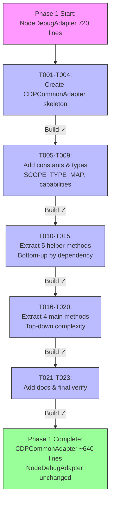
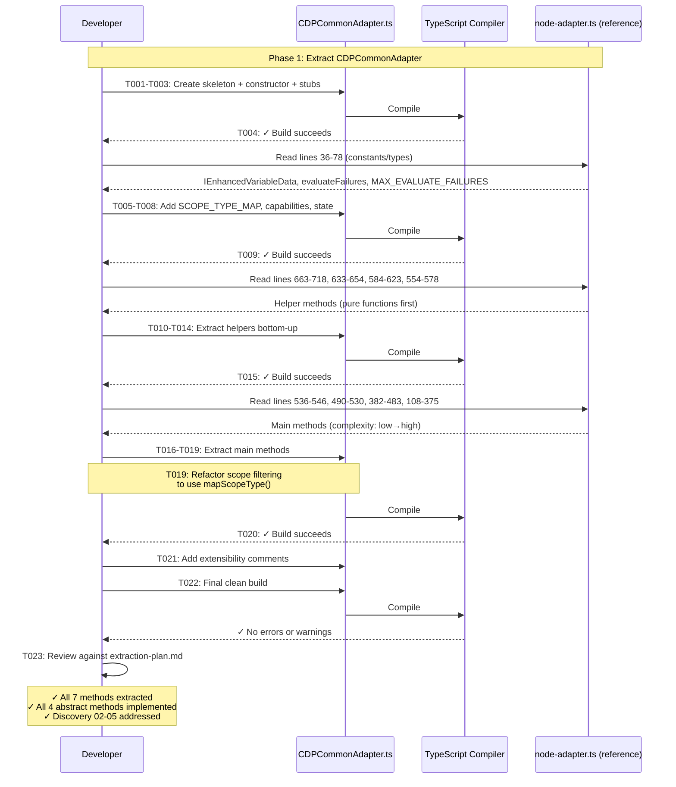

# Phase 1: Extract CDPCommonAdapter - Tasks and Alignment Brief

**Plan**: [pwa-chrome-adapter-plan.md](../../pwa-chrome-adapter-plan.md)
**Spec**: [pwa-chrome-adapter-spec.md](../../pwa-chrome-adapter-spec.md)
**Phase Slug**: `phase-1`
**Created**: 2025-10-10

---

## Tasks

**Objective**: Create CDPCommonAdapter base class with all shared CDP/V8 logic extracted from NodeDebugAdapter. This is a **compilation-only phase** with no runtime testing - validation is TypeScript build success after each extraction step.

**Extraction Source**: `/Users/jordanknight/github/vsc-bridge/extension/src/core/runtime-inspection/adapters/node-adapter.ts` (720 lines)

**Extraction Target**: `/Users/jordanknight/github/vsc-bridge/extension/src/core/runtime-inspection/adapters/CDPCommonAdapter.ts` (NEW file, ~640 lines)

**Critical Discoveries Applied**:
- **Discovery 02**: SCOPE_TYPE_MAP design for Chrome scope types (Block, With, etc.)
- **Discovery 03**: Memory budget enforcement and setVariable writable scope restrictions
- **Discovery 04**: Identical capabilities for pwa-node and pwa-chrome
- **Discovery 05**: Preserve dual-strategy cycle detection (variablesReference + Object.is())

| Status | ID | Task | Type | Dependencies | Absolute Path(s) | Validation | Notes |
|--------|----|----|------|--------------|------------------|------------|-------|
| [x] | T001 | Create CDPCommonAdapter.ts skeleton with imports and class declaration | Setup | – | /Users/jordanknight/github/vsc-bridge/extension/src/core/runtime-inspection/adapters/CDPCommonAdapter.ts | File exists, extends BaseDebugAdapter, TypeScript parses | ✅ Complete - CDPCommonAdapter.ts created |
| [x] | T002 | Add constructor accepting session and capabilities, call super() | Core | T001 | /Users/jordanknight/github/vsc-bridge/extension/src/core/runtime-inspection/adapters/CDPCommonAdapter.ts | Constructor signature matches BaseDebugAdapter pattern | ✅ Complete |
| [x] | T003 | Add abstract method stubs for all 4 required methods (listVariables, setVariable, getVariableChildren, streamVariables) | Core | T002 | /Users/jordanknight/github/vsc-bridge/extension/src/core/runtime-inspection/adapters/CDPCommonAdapter.ts | Abstract class cannot be instantiated but compiles | ✅ Complete |
| [x] | T004 | Build verification checkpoint after skeleton | Test | T003 | /Users/jordanknight/github/vsc-bridge/extension/src/core/runtime-inspection/adapters/CDPCommonAdapter.ts | `just build` succeeds, no errors | ✅ Build verified |
| [x] | T005 | Add SCOPE_TYPE_MAP constant with all 9 CDP scope types (local, closure, catch, block, with, script, module, global, eval) per Discovery 02 | Core | T004 | /Users/jordanknight/github/vsc-bridge/extension/src/core/runtime-inspection/adapters/CDPCommonAdapter.ts | Constant defined with all required fields: name, expensive, writable | ✅ Complete - SCOPE_TYPE_MAP with 9 types |
| [x] | T006 | Add CDP_COMMON_CAPABILITIES constant with identical capabilities from node-adapter.ts constructor per Discovery 04 | Core | T005 | /Users/jordanknight/github/vsc-bridge/extension/src/core/runtime-inspection/adapters/CDPCommonAdapter.ts | Static readonly constant matches NodeDebugAdapter capabilities exactly | ✅ Complete |
| [x] | T007 | Add evaluateFailures Map and MAX_EVALUATE_FAILURES constant for Object.is() throttling per Discovery 05 | Core | T006 | /Users/jordanknight/github/vsc-bridge/extension/src/core/runtime-inspection/adapters/CDPCommonAdapter.ts | Protected members defined: evaluateFailures: Map<string, number>, MAX_EVALUATE_FAILURES = 2 | ✅ Complete |
| [x] | T008 | Extract IEnhancedVariableData interface from node-adapter.ts lines 36-61 | Core | T007 | /Users/jordanknight/github/vsc-bridge/extension/src/core/runtime-inspection/adapters/CDPCommonAdapter.ts | Interface defined with all fields: cycle, cycleVia, truncated, depth, error | ✅ Complete |
| [x] | T009 | Build verification checkpoint after constants and types | Test | T008 | /Users/jordanknight/github/vsc-bridge/extension/src/core/runtime-inspection/adapters/CDPCommonAdapter.ts | `just build` succeeds, no errors | ✅ Build verified |
| [x] | T010 | Extract encodeValueForEvaluate() method from node-adapter.ts lines 663-718 unchanged | Core | T009 | /Users/jordanknight/github/vsc-bridge/extension/src/core/runtime-inspection/adapters/CDPCommonAdapter.ts | Method signature matches original, handles NaN/Infinity/BigInt/null/undefined/numbers/strings | ✅ Complete |
| [x] | T011 | Extract buildSafeAssignment() method from node-adapter.ts lines 633-654 unchanged | Core | T010 | /Users/jordanknight/github/vsc-bridge/extension/src/core/runtime-inspection/adapters/CDPCommonAdapter.ts | Method validates paths with regex, calls encodeValueForEvaluate() | ✅ Complete |
| [x] | T012 | Extract estimateVariableSize() method from node-adapter.ts lines 584-623 unchanged per Discovery 03 | Core | T009 | /Users/jordanknight/github/vsc-bridge/extension/src/core/runtime-inspection/adapters/CDPCommonAdapter.ts | Method estimates bytes for base (100) + strings (length*2) + arrays/maps/buffers | ✅ Complete |
| [x] | T013 | Add mapScopeType() method per scope-type-mapping-design.md with unknown type graceful handling | Core | T005 | /Users/jordanknight/github/vsc-bridge/extension/src/core/runtime-inspection/adapters/CDPCommonAdapter.ts | Method looks up SCOPE_TYPE_MAP, logs warning for unknown types, returns {name, expensive, writable} | ✅ Complete |
| [x] | T014 | Extract getMostRecentlyStoppedThread() method from node-adapter.ts lines 554-578 unchanged | Core | T009 | /Users/jordanknight/github/vsc-bridge/extension/src/core/runtime-inspection/adapters/CDPCommonAdapter.ts | Method iterates threads, checks for stack frames, returns first stopped thread or fallback | ✅ Complete |
| [x] | T015 | Build verification checkpoint after helper methods | Test | T010,T011,T012,T013,T014 | /Users/jordanknight/github/vsc-bridge/extension/src/core/runtime-inspection/adapters/CDPCommonAdapter.ts | `just build` succeeds, no errors | ✅ Build verified |
| [x] | T016 | Extract streamVariables() placeholder method from node-adapter.ts lines 536-546 unchanged | Core | T015 | /Users/jordanknight/github/vsc-bridge/extension/src/core/runtime-inspection/adapters/CDPCommonAdapter.ts | Method returns not-implemented error with suggestion | ✅ Complete |
| [x] | T017 | Extract getVariableChildren() method from node-adapter.ts lines 490-530 unchanged | Core | T015 | /Users/jordanknight/github/vsc-bridge/extension/src/core/runtime-inspection/adapters/CDPCommonAdapter.ts | Method wraps with withOperationLock, handles pagination params (start/count/filter) | ✅ Complete |
| [x] | T018 | Extract setVariable() method from node-adapter.ts lines 382-483 with scope writability check enhancement per Discovery 03 | Core | T011,T014,T015 | /Users/jordanknight/github/vsc-bridge/extension/src/core/runtime-inspection/adapters/CDPCommonAdapter.ts | Method implements dual strategy (DAP setVariable→evaluate fallback), checks scope.writable before modification | ✅ Complete + setExpression fallback added |
| [x] | T019 | Extract listVariables() method from node-adapter.ts lines 108-375 with scope filtering refactored to use mapScopeType() per Discovery 02, 05 | Core | T012,T013,T014,T015 | /Users/jordanknight/github/vsc-bridge/extension/src/core/runtime-inspection/adapters/CDPCommonAdapter.ts | Method implements recursive expansion, dual cycle detection (variablesReference Set + Object.is()), memory budget checks, scope filtering via mapScopeType() | ✅ Complete + throttle logging added |
| [x] | T020 | Build verification checkpoint after main methods | Test | T016,T017,T018,T019 | /Users/jordanknight/github/vsc-bridge/extension/src/core/runtime-inspection/adapters/CDPCommonAdapter.ts | `just build` succeeds, no errors | ✅ Build verified |
| [x] | T021 | Add extensibility comments at key locations documenting browser support extension points | Doc | T020 | /Users/jordanknight/github/vsc-bridge/extension/src/core/runtime-inspection/adapters/CDPCommonAdapter.ts | Comments added: class-level (multi-target handling), getMostRecentlyStoppedThread (multiple threads), constructor (browser capabilities) | ✅ Complete |
| [x] | T022 | Final full build verification with clean state | Test | T021 | /Users/jordanknight/github/vsc-bridge/extension/src/core/runtime-inspection/adapters/CDPCommonAdapter.ts | Clean build: `just build` succeeds with no errors or warnings | ✅ Build verified |
| [x] | T023 | Review extracted code for completeness against extraction-plan.md checklist | Integration | T022 | /Users/jordanknight/github/vsc-bridge/extension/src/core/runtime-inspection/adapters/CDPCommonAdapter.ts, /Users/jordanknight/github/vsc-bridge/docs/plans/12-pwa-chrome-adapter/tasks/phase-0/extraction-plan.md | All 7 methods extracted, all constants added, all helper methods present, Discovery 02-05 addressed | ✅ Complete |

---

## Alignment Brief

### Objective Recap

Create CDPCommonAdapter.ts base class by extracting shared CDP/V8 logic from NodeDebugAdapter. This phase establishes the foundation for both pwa-node (refactored in Phase 2) and pwa-chrome (new in Phase 4) adapters to share ~97% of their implementation.

**Key architectural shift**: NodeDebugAdapter currently extends BaseDebugAdapter directly with 720 lines of implementation. After Phase 1+2, it will extend CDPCommonAdapter with only ~20 lines (constructor only), with all shared logic in CDPCommonAdapter.

### Behavior Checklist

Maps to Phase 1 acceptance criteria from plan:

- [ ] CDPCommonAdapter.ts file exists and exports CDPCommonAdapter class
- [ ] Class extends BaseDebugAdapter correctly
- [ ] All 4 abstract methods implemented (listVariables, setVariable, getVariableChildren, streamVariables)
- [ ] All 7 helper methods extracted (encodeValueForEvaluate, buildSafeAssignment, estimateVariableSize, mapScopeType, getMostRecentlyStoppedThread, plus internal cycle detection logic)
- [ ] SCOPE_TYPE_MAP constant defined with all 9 CDP scope types
- [ ] CDP_COMMON_CAPABILITIES constant defined with identical capabilities from NodeDebugAdapter
- [ ] Dual-strategy cycle detection preserved (variablesReference Set tracking + Object.is() evaluation)
- [ ] Memory budget enforcement preserved (estimateVariableSize + memoryBudget.addNode calls)
- [ ] Scope filtering refactored to use mapScopeType() lookup instead of hardcoded name matching
- [ ] setVariable includes scope writability check (or prepared for it in Phase 2)
- [ ] Extensibility comments added for browser support
- [ ] TypeScript builds successfully: `just build` with no errors or warnings
- [ ] No runtime testing (compilation-only phase)

### Critical Findings Affecting This Phase

**Discovery 02: Scope Type Differences Between pwa-node and pwa-chrome**

**What it constrains**: Cannot use hardcoded scope name matching (e.g., `scopeName.includes('local')`). Chrome reports different scope types (Block, With) than Node (Script, Module).

**Tasks that address it**:
- T005: Add SCOPE_TYPE_MAP constant with all 9 CDP scope types
- T013: Add mapScopeType() method with unknown type fallback
- T019: Refactor listVariables() scope filtering to use mapScopeType()

**Implementation requirement**: Replace hardcoded scope name checks in listVariables (node-adapter.ts lines 133-154) with:
```typescript
const scopeInfo = this.mapScopeType(scope.type || scope.name.toLowerCase());
if (scopeInfo.expensive && !includeExpensive) {
    return false;
}
```

---

**Discovery 03: setVariable Only Works on local/closure/catch Scopes + Memory Budgets**

**What it constrains**:
1. Cannot assume setVariable works on all scopes (Block/Global/Script/Module are read-only)
2. Must enforce memory budgets to prevent crashes from large variable graphs

**Tasks that address it**:
- T005: SCOPE_TYPE_MAP includes `writable` flag for each scope type
- T012: Extract estimateVariableSize() for memory budget tracking
- T018: Extract setVariable() with scope writability check enhancement

**Implementation requirement**:
1. setVariable should check `scopeInfo.writable` before attempting modification
2. listVariables must call `memoryBudget.addNode(estimatedBytes)` before expanding children

---

**Discovery 04: DAP Capabilities Are Identical Between pwa-node and pwa-chrome**

**What it constrains**: Both adapters must use same capabilities object. No adapter-specific capability customization needed.

**Tasks that address it**:
- T006: Add CDP_COMMON_CAPABILITIES static constant
- T002: Constructor accepts capabilities but can default to CDP_COMMON_CAPABILITIES

**Implementation requirement**: Define shared constant in CDPCommonAdapter:
```typescript
protected static readonly CDP_COMMON_CAPABILITIES: IDebugCapabilities = {
    supportsSetVariable: true,
    supportsVariablePaging: true,
    // ... (identical to NodeDebugAdapter constructor)
};
```

---

**Discovery 05: Object.is() Cycle Detection Strategy**

**What it constrains**: Must preserve both cycle detection strategies exactly as implemented:
1. **variablesReference Set tracking** (fast, universal)
2. **Object.is() evaluation** (accurate for JavaScript identity)

**Tasks that address it**:
- T007: Add evaluateFailures Map and MAX_EVALUATE_FAILURES for throttling
- T019: Extract listVariables() with both cycle detection strategies intact

**Implementation requirement**: Copy entire cycle detection block (node-adapter.ts lines 188-255) unchanged. Do not simplify or optimize - both strategies serve different purposes.

---

### Invariants & Guardrails

**Type Safety**:
- All methods must match BaseDebugAdapter abstract signatures exactly
- IEnhancedVariableData interface must match node-adapter.ts definition exactly (lines 36-61)
- No `any` types except where node-adapter.ts already uses them

**Code Preservation**:
- Extract methods **unchanged** except for scope filtering refactoring in listVariables
- Preserve all comments, especially those explaining cycle detection logic
- Preserve exact indentation and formatting where possible (aids review)

**Incremental Build Safety**:
- Run `just build` after each major addition (after skeleton, after constants, after helpers, after main methods)
- Fix compilation errors immediately before proceeding to next task
- Never commit to next task group with failing build

**Memory Budget Enforcement** (Discovery 03):
- 5MB max total bytes
- 20k max nodes
- Every variable expansion must check budget before adding children

**Performance**:
- No additional async operations beyond what node-adapter.ts already does
- Maintain O(1) cycle detection via Set lookup for variablesReference
- Limit Object.is() calls via throttling (MAX_EVALUATE_FAILURES = 2)

---

### Inputs to Read

**Primary source file** (extraction source):
- `/Users/jordanknight/github/vsc-bridge/extension/src/core/runtime-inspection/adapters/node-adapter.ts` (720 lines)
  - Lines 36-61: IEnhancedVariableData interface
  - Lines 77-78: evaluateFailures Map, MAX_EVALUATE_FAILURES
  - Lines 86-97: Capabilities object (constructor)
  - Lines 108-375: listVariables method
  - Lines 382-483: setVariable method
  - Lines 490-530: getVariableChildren method
  - Lines 536-546: streamVariables method
  - Lines 554-578: getMostRecentlyStoppedThread method
  - Lines 584-623: estimateVariableSize method
  - Lines 633-654: buildSafeAssignment method
  - Lines 663-718: encodeValueForEvaluate method

**Reference files**:
- `/Users/jordanknight/github/vsc-bridge/extension/src/core/runtime-inspection/adapters/BaseDebugAdapter.ts` (extends this)
- `/Users/jordanknight/github/vsc-bridge/extension/src/core/runtime-inspection/interfaces.ts` (type imports)

**Phase 0 deliverables** (extraction guides):
- `/Users/jordanknight/github/vsc-bridge/docs/plans/12-pwa-chrome-adapter/tasks/phase-0/extraction-candidates.md` (what to extract)
- `/Users/jordanknight/github/vsc-bridge/docs/plans/12-pwa-chrome-adapter/tasks/phase-0/scope-type-mapping-design.md` (SCOPE_TYPE_MAP design)
- `/Users/jordanknight/github/vsc-bridge/docs/plans/12-pwa-chrome-adapter/tasks/phase-0/extraction-plan.md` (implementation order)

---

### Visual Alignment Aids

#### System State Flow Diagram



**State transitions**:
1. **Start**: NodeDebugAdapter is 720-line monolith extending BaseDebugAdapter
2. **After Skeleton**: CDPCommonAdapter file exists, compiles as abstract class
3. **After Constants**: SCOPE_TYPE_MAP, capabilities, state variables defined
4. **After Helpers**: All 5 helper methods extracted (bottom-up dependency order)
5. **After Main Methods**: All 4 abstract methods implemented (listVariables last - most complex)
6. **End**: CDPCommonAdapter complete, ready for Phase 2 NodeDebugAdapter refactor

#### Implementation Sequence Diagram



**Key interaction points**:
1. **After each major group** (skeleton, constants, helpers, main methods): Build checkpoint
2. **Reference to node-adapter.ts**: Read-only - never modify source during Phase 1
3. **Critical refactoring** (T019): Scope filtering in listVariables - only code change vs exact copy
4. **Final verification** (T023): Cross-check against extraction-plan.md deliverables

---

### Test Plan

**TDD Note**: Phase 1 is **compilation-only**. No runtime tests. No manual validation. Success = TypeScript builds without errors.

**Test Strategy**: Build verification checkpoints after each major addition.

**Test 1: Skeleton Compiles** (T004)
- **Trigger**: After T001-T003 complete
- **Command**: `just build`
- **Expected**: Build succeeds, CDPCommonAdapter.ts compiles as abstract class
- **Failure**: Compilation errors → fix imports, class declaration, method stubs

**Test 2: Constants Compile** (T009)
- **Trigger**: After T005-T008 complete
- **Command**: `just build`
- **Expected**: Build succeeds, SCOPE_TYPE_MAP/capabilities/state variables defined
- **Failure**: Type errors → fix constant definitions, interface imports

**Test 3: Helpers Compile** (T015)
- **Trigger**: After T010-T014 complete
- **Command**: `just build`
- **Expected**: Build succeeds, all 5 helper methods compile with correct signatures
- **Failure**: Method signature mismatches → fix parameter types, return types

**Test 4: Main Methods Compile** (T020)
- **Trigger**: After T016-T019 complete
- **Command**: `just build`
- **Expected**: Build succeeds, all 4 abstract methods implemented, no compilation errors
- **Failure**: Complex method errors → review listVariables refactoring, check all dependencies

**Test 5: Final Clean Build** (T022)
- **Trigger**: After T021 complete
- **Command**: `just build` (clean state)
- **Expected**: Build succeeds with no errors OR warnings
- **Failure**: Warnings → address linting issues, unused imports, etc.

**Test 6: Completeness Review** (T023)
- **Trigger**: After T022 succeeds
- **Checklist**: Cross-check against extraction-plan.md
  - [ ] All 7 methods from extraction-candidates.md extracted
  - [ ] SCOPE_TYPE_MAP has 9 scope types (local, closure, catch, block, with, script, module, global, eval)
  - [ ] Capabilities object matches NodeDebugAdapter exactly
  - [ ] Dual cycle detection preserved (Set + Object.is())
  - [ ] Memory budget tracking preserved (estimateVariableSize calls)
  - [ ] Scope filtering uses mapScopeType() (not hardcoded names)
  - [ ] Discovery 02, 03, 04, 05 all addressed

**No runtime testing in Phase 1**. Phase 3 validates NodeDebugAdapter still works after refactoring.

---

### Step-by-Step Implementation

**Group 1: File Skeleton (T001-T004)** - ~15 minutes

1. Create `/Users/jordanknight/github/vsc-bridge/extension/src/core/runtime-inspection/adapters/CDPCommonAdapter.ts`
2. Add imports (vscode, BaseDebugAdapter, interfaces from node-adapter.ts)
3. Add class declaration: `export abstract class CDPCommonAdapter extends BaseDebugAdapter`
4. Add constructor accepting `session: vscode.DebugSession, capabilities: IDebugCapabilities`
5. Add abstract method stubs (throw "Not implemented" placeholders):
   - `abstract listVariables(params: IListVariablesParams): Promise<IVariableData[] | IDebugError>`
   - `abstract setVariable(params: ISetVariableParams): Promise<ISetVariableResult>`
   - `abstract getVariableChildren(params: IVariableChildrenParams): Promise<IVariableData[] | IDebugError>`
   - `abstract streamVariables(params: IStreamVariablesParams): Promise<IStreamResult>`
6. Run `just build` → fix any import errors → verify skeleton compiles

**Group 2: Constants and Types (T005-T009)** - ~20 minutes

1. Copy IEnhancedVariableData interface from node-adapter.ts lines 36-61 → place before class
2. Add SCOPE_TYPE_MAP constant before class (9 entries: local, closure, catch, block, with, script, module, global, eval)
3. Add CDP_COMMON_CAPABILITIES static constant (copy from NodeDebugAdapter constructor lines 86-97)
4. Add protected state in class: `protected evaluateFailures: Map<string, number> = new Map();`
5. Add protected constant in class: `protected readonly MAX_EVALUATE_FAILURES = 2;`
6. Run `just build` → fix any type errors → verify constants compile

**Group 3: Helper Methods (T010-T015)** - ~45 minutes

**Bottom-up extraction order** (dependencies):

1. **T010**: encodeValueForEvaluate() - no deps, pure function
   - Copy lines 663-718 from node-adapter.ts
   - Change visibility: `private` → `protected`
   - Run `just build`

2. **T011**: buildSafeAssignment() - depends on T010
   - Copy lines 633-654 from node-adapter.ts
   - Change visibility: `private` → `protected`
   - Verify calls to `this.encodeValueForEvaluate()` work
   - Run `just build`

3. **T012**: estimateVariableSize() - no deps, pure function
   - Copy lines 584-623 from node-adapter.ts
   - Change visibility: `private` → `protected`
   - Run `just build`

4. **T013**: mapScopeType() - depends on T005 SCOPE_TYPE_MAP
   - Implement new method per scope-type-mapping-design.md
   - Signature: `protected mapScopeType(cdpScopeType: string): { name: string; expensive: boolean; writable: boolean }`
   - Lookup SCOPE_TYPE_MAP, return fallback for unknown types with logger warning
   - Run `just build`

5. **T014**: getMostRecentlyStoppedThread() - no deps (calls BaseDebugAdapter methods)
   - Copy lines 554-578 from node-adapter.ts
   - Change visibility: `private async` → `protected async`
   - Run `just build`

6. **T015**: Build verification after all helpers

**Group 4: Main Methods (T016-T020)** - ~60 minutes

**Low-to-high complexity order**:

1. **T016**: streamVariables() - placeholder, no logic
   - Copy lines 536-546 from node-adapter.ts unchanged
   - Run `just build`

2. **T017**: getVariableChildren() - simple, wraps DAP call
   - Copy lines 490-530 from node-adapter.ts unchanged
   - Verify `this.withOperationLock()` (from BaseDebugAdapter) accessible
   - Run `just build`

3. **T018**: setVariable() - dual strategy logic
   - Copy lines 382-483 from node-adapter.ts
   - **Enhancement**: Add scope writability check (optional in Phase 1, required in Phase 2)
   - Verify calls to `this.buildSafeAssignment()`, `this.getMostRecentlyStoppedThread()` work
   - Run `just build`

4. **T019**: listVariables() - most complex, recursive expansion
   - Copy lines 108-375 from node-adapter.ts
   - **Refactor**: Replace scope filtering (lines 133-154) with `mapScopeType()` calls
   - Verify calls to `this.estimateVariableSize()`, `this.getMostRecentlyStoppedThread()` work
   - Preserve cycle detection logic (lines 188-255) unchanged
   - Preserve memory budget checks unchanged
   - Run `just build`

5. **T020**: Build verification after all main methods

**Group 5: Finalization (T021-T023)** - ~15 minutes

1. **T021**: Add extensibility comments
   - Class-level comment: "NOTE: Browser support would add multi-target handling..."
   - getMostRecentlyStoppedThread comment: "NOTE: Extension Host single thread, browser needs multiple..."
   - Constructor comment: "NOTE: Browser capabilities would add instrumentation breakpoints..."

2. **T022**: Final clean build
   - `just build` with clean state
   - Fix any warnings (unused imports, etc.)

3. **T023**: Review against extraction-plan.md
   - Check extraction-candidates.md: All 7 methods present?
   - Check scope-type-mapping-design.md: SCOPE_TYPE_MAP complete?
   - Check extraction-plan.md summary table: All items extracted?

**Total estimated time**: ~2.5 hours (skeleton + constants + helpers + main methods + finalization)

---

### Commands to Run

**Build command** (use after each major group):
```bash
# From project root
just build
```

**Expected output** (success):
```
Building extension...
[TypeScript] Compiling...
✓ No errors
✓ No warnings
Build complete
```

**Expected output** (failure):
```
Building extension...
[TypeScript] Compiling...
❌ Error TS2345: Argument of type 'X' is not assignable to parameter of type 'Y'
    at /Users/.../CDPCommonAdapter.ts:123:45
```

**Fix strategy**:
1. Read error message carefully
2. Check signature against node-adapter.ts original
3. Check imports are correct
4. Fix type mismatch
5. Retry `just build`

**No other commands needed** - Phase 1 is compilation-only, no runtime validation.

---

### Risks/Unknowns

| Risk | Severity | Likelihood | Mitigation |
|------|----------|------------|------------|
| **Scope filtering refactoring breaks logic** | HIGH | LOW | Keep refactoring minimal - only replace hardcoded scope name checks with mapScopeType() calls. Test exact behavior in Phase 3 with pwa-node sessions. |
| **Missed helper method dependency** | MEDIUM | LOW | Follow bottom-up extraction order strictly (T010→T011, T005→T013). Build after each method to catch missing dependencies immediately. |
| **Type mismatches between node-adapter and interfaces** | MEDIUM | MEDIUM | Copy exact signatures from node-adapter.ts. Do not "improve" types. Preserve `any` where node-adapter uses `any`. |
| **Cycle detection logic too complex to extract safely** | HIGH | LOW | Copy lines 188-255 from node-adapter.ts **unchanged**. Do not simplify. Preserve exact logic including throttling (MAX_EVALUATE_FAILURES). Validate in Phase 3. |
| **setVariable scope writability check breaks existing logic** | MEDIUM | LOW | Make writability check optional/no-op in Phase 1 if needed. Full implementation can come in Phase 2 when refactoring NodeDebugAdapter. |
| **SCOPE_TYPE_MAP missing scope types** | LOW | VERY LOW | Phase 0 research identified all 9 common CDP scope types. Unknown types handled gracefully with warning log + conservative fallback (read-only, non-expensive). |
| **Build time increases significantly** | LOW | VERY LOW | CDPCommonAdapter adds ~640 lines but is only one file. Build time impact negligible. Monitor after T022. |
| **Forgotten to preserve comments explaining complex logic** | MEDIUM | MEDIUM | When copying methods, copy ALL comments including block comments and inline comments. Comments are code documentation. |

**Unknown scope type handling** (Discovery 02):
- If CDP reports unknown scope type (e.g., `wasm_expression_stack`), mapScopeType() logs warning and returns conservative fallback
- Fallback: `{ name: cdpScopeType, expensive: false, writable: false }`
- This prevents crashes while making unknown types visible for future investigation

**Severity definitions**:
- **HIGH**: Could block phase completion or cause subtle bugs
- **MEDIUM**: Causes rework but fixable within phase
- **LOW**: Minor inconvenience, easy fix

---

### Ready Check

**Prerequisites** (must be true before starting implementation):

- [ ] Phase 0 complete (extraction-plan.md, extraction-candidates.md, scope-type-mapping-design.md, node-specific-logic.md all exist)
- [ ] Read all 4 Phase 0 deliverables thoroughly
- [ ] Understand extraction order: skeleton → constants → helpers → main methods
- [ ] Understand build checkpoint strategy (build after each group)
- [ ] `just build` command works in current environment
- [ ] Have node-adapter.ts open in editor for reference during extraction
- [ ] Understand this is **compilation-only phase** - no runtime testing

**Code Understanding** (must understand before T001):

- [ ] Understand BaseDebugAdapter abstract contract (4 methods to implement)
- [ ] Understand difference between protected (CDPCommon subclasses) vs private (internal only)
- [ ] Understand IEnhancedVariableData purpose (cycle detection, depth tracking)
- [ ] Understand SCOPE_TYPE_MAP structure (9 entries, 3 fields each)
- [ ] Understand dual cycle detection strategy (variablesReference Set + Object.is() evaluation)

**Discovery Understanding** (must know how each affects this phase):

- [ ] Discovery 02: SCOPE_TYPE_MAP addresses Chrome scope types (Block/With vs Node Script/Module)
- [ ] Discovery 03: Memory budgets prevent crashes, writable flag prevents setVariable failures
- [ ] Discovery 04: Capabilities identical between pwa-node and pwa-chrome
- [ ] Discovery 05: Dual cycle detection must be preserved exactly (no simplification)

**Extraction Plan Understanding** (T001-T023 execution clarity):

- [ ] Understand bottom-up helper extraction (pure functions first, then dependent methods)
- [ ] Understand top-down main method extraction (simple placeholder first, complex listVariables last)
- [ ] Understand why listVariables requires scope filtering refactoring (Discovery 02)
- [ ] Understand why setVariable may need scope writability check (Discovery 03)

**Environment Readiness**:

- [ ] Project builds successfully before any changes: `just build`
- [ ] No uncommitted changes that could interfere with extraction
- [ ] Have extraction-plan.md open in browser/editor for reference during implementation
- [ ] Understand that NodeDebugAdapter is **read-only** in Phase 1 (no modifications until Phase 2)

**Quality Gates** (will verify during T023 review):

- [ ] All 7 methods from extraction-candidates.md extracted (see table in extraction-candidates.md)
- [ ] All constants added (SCOPE_TYPE_MAP, CDP_COMMON_CAPABILITIES, evaluateFailures, MAX_EVALUATE_FAILURES)
- [ ] IEnhancedVariableData interface defined
- [ ] Extensibility comments added (browser support notes)
- [ ] TypeScript builds with no errors OR warnings
- [ ] Code review against extraction-plan.md passes

**Human GO/NO-GO Decision**:

- [ ] **GO**: All Ready Check items above are checked, proceed to T001
- [ ] **NO-GO**: Missing prerequisites, read Phase 0 deliverables first or clarify extraction strategy

---

## Phase Footnote Stubs

**Note**: Footnotes will be added during implementation by `/plan-6-implement-phase`. This section provides the structure for tracking implementation changes.

During Phase 1 implementation, each task completion will add entries here with:
- File paths modified (with flowspace node IDs if applicable)
- Method names extracted with line ranges
- Any deviations from extraction plan with rationale

**Example format** (populated during plan-6):
```markdown
[^1]: T001-T004 Skeleton creation
  - `file:extension/src/core/runtime-inspection/adapters/CDPCommonAdapter.ts` - Created new file, class declaration, constructor, abstract method stubs
  - Compilation verified: `just build` succeeded

[^2]: T005-T009 Constants and types
  - `file:extension/src/core/runtime-inspection/adapters/CDPCommonAdapter.ts` - Added SCOPE_TYPE_MAP (9 entries), CDP_COMMON_CAPABILITIES, IEnhancedVariableData, state variables
  - Compilation verified: `just build` succeeded
```

---

## Evidence Artifacts

**Execution Log**: `/Users/jordanknight/github/vsc-bridge/docs/plans/12-pwa-chrome-adapter/tasks/phase-1/execution.log.md`

This file will be created by `/plan-6-implement-phase` and will contain:
- Timestamp for each task (T001-T023) completion
- Build command outputs (success/failure)
- Any compilation errors encountered and how they were resolved
- Final verification checklist results (T023)

**Supporting Files**:
- No additional supporting files needed for Phase 1 (compilation-only)
- Phase 3 will create test execution logs for runtime validation

**Directory Layout** (after plan-6 execution):
```
docs/plans/12-pwa-chrome-adapter/
├── pwa-chrome-adapter-plan.md
├── pwa-chrome-adapter-spec.md
├── pwa-chrome-deep-research.md
└── tasks/
    ├── phase-0/
    │   ├── tasks.md
    │   ├── extraction-candidates.md
    │   ├── node-specific-logic.md
    │   ├── scope-type-mapping-design.md
    │   └── extraction-plan.md
    └── phase-1/
        ├── tasks.md (this file)
        └── execution.log.md  # Created by plan-6 during implementation
```

---

**Phase 1 Tasks Complete**. Ready for `/plan-6-implement-phase --phase "Phase 1: Extract CDPCommonAdapter"` when user approves.
