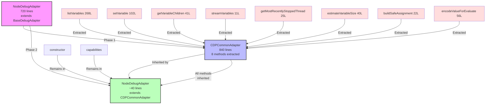
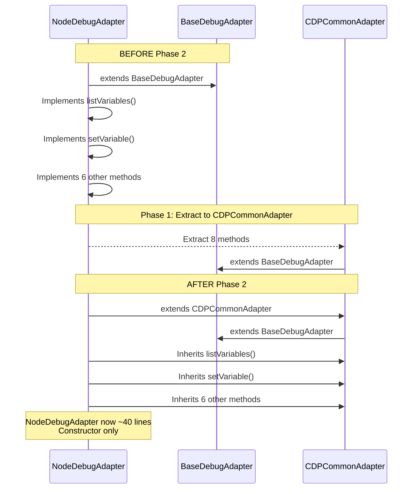

# Phase 2: Refactor NodeDebugAdapter - Tasks and Alignment Brief

**Phase**: Phase 2: Refactor NodeDebugAdapter
**Plan**: `/Users/jordanknight/github/vsc-bridge/docs/plans/12-pwa-chrome-adapter/pwa-chrome-adapter-plan.md`
**Spec**: `/Users/jordanknight/github/vsc-bridge/docs/plans/12-pwa-chrome-adapter/pwa-chrome-adapter-spec.md`
**Created**: 2025-10-10
**Status**: READY FOR IMPLEMENTATION

---

## Tasks

**Approach**: Sequential refactoring with build checkpoints after logical groups.

**Groups**:
1. **T001-T003**: Class Declaration Changes (import, extends, properties)
2. **T004-T012**: Method Removal (9 extracted methods)
3. **T013-T018**: Verification (constructor review, build, completeness check, integration tests)

| Status | ID | Task | Type | Dependencies | Absolute Path(s) | Validation | Notes |
|--------|-----|------|------|--------------|------------------|------------|-------|
| [x] | T001 | Read current NodeDebugAdapter.ts implementation | Setup | – | /Users/jordanknight/github/vsc-bridge/extension/src/core/runtime-inspection/adapters/node-adapter.ts | File contents understood | ✅ Complete |
| [x] | T002 | Update import statement to import CDPCommonAdapter | Core | T001 | /Users/jordanknight/github/vsc-bridge/extension/src/core/runtime-inspection/adapters/node-adapter.ts | Import changed from BaseDebugAdapter to CDPCommonAdapter | ✅ Complete |
| [x] | T003 | Change class declaration to extend CDPCommonAdapter | Core | T002 | /Users/jordanknight/github/vsc-bridge/extension/src/core/runtime-inspection/adapters/node-adapter.ts | Class declaration updated | ✅ Complete |
| [x] | T004 | Remove evaluateFailures and MAX_EVALUATE_FAILURES properties | Core | T003 | /Users/jordanknight/github/vsc-bridge/extension/src/core/runtime-inspection/adapters/node-adapter.ts | Properties removed (now inherited from CDPCommonAdapter) | ✅ Complete |
| [x] | T005 | Remove listVariables method | Core | T004 | /Users/jordanknight/github/vsc-bridge/extension/src/core/runtime-inspection/adapters/node-adapter.ts | Method deleted (268 lines removed) | ✅ Complete |
| [x] | T006 | Remove setVariable method | Core | T005 | /Users/jordanknight/github/vsc-bridge/extension/src/core/runtime-inspection/adapters/node-adapter.ts | Method deleted (102 lines removed) | ✅ Complete |
| [x] | T007 | Remove getVariableChildren method | Core | T006 | /Users/jordanknight/github/vsc-bridge/extension/src/core/runtime-inspection/adapters/node-adapter.ts | Method deleted (41 lines removed) | ✅ Complete |
| [x] | T008 | Remove streamVariables method | Core | T007 | /Users/jordanknight/github/vsc-bridge/extension/src/core/runtime-inspection/adapters/node-adapter.ts | Method deleted (11 lines removed) | ✅ Complete |
| [x] | T009 | Remove getMostRecentlyStoppedThread method | Core | T008 | /Users/jordanknight/github/vsc-bridge/extension/src/core/runtime-inspection/adapters/node-adapter.ts | Method deleted (25 lines removed) | ✅ Complete |
| [x] | T010 | Remove estimateVariableSize method | Core | T009 | /Users/jordanknight/github/vsc-bridge/extension/src/core/runtime-inspection/adapters/node-adapter.ts | Method deleted (40 lines removed) | ✅ Complete |
| [x] | T011 | Remove buildSafeAssignment method | Core | T010 | /Users/jordanknight/github/vsc-bridge/extension/src/core/runtime-inspection/adapters/node-adapter.ts | Method deleted (22 lines removed) | ✅ Complete |
| [x] | T012 | Remove encodeValueForEvaluate method | Core | T011 | /Users/jordanknight/github/vsc-bridge/extension/src/core/runtime-inspection/adapters/node-adapter.ts | Method deleted (56 lines removed) | ✅ Complete |
| [x] | T013 | Review constructor for Node-specific logic | Core | T012 | /Users/jordanknight/github/vsc-bridge/extension/src/core/runtime-inspection/adapters/node-adapter.ts | Constructor reviewed, capabilities match CDPCommonAdapter | ✅ Complete |
| [x] | T014 | Verify IEnhancedVariableData interface removed/imported | Core | T013 | /Users/jordanknight/github/vsc-bridge/extension/src/core/runtime-inspection/adapters/node-adapter.ts | Interface no longer defined locally (imported from CDPCommonAdapter if needed) | ✅ Complete |
| [x] | T015 | Build and verify TypeScript compilation | Integration | T014 | /Users/jordanknight/github/vsc-bridge | just build succeeds with no errors | ✅ Build verified |
| [x] | T016 | Review final NodeDebugAdapter.ts for completeness | Integration | T015 | /Users/jordanknight/github/vsc-bridge/extension/src/core/runtime-inspection/adapters/node-adapter.ts | File structure correct, all extracted methods removed | ✅ Complete - ~76 lines |
| [x] | T017 | Verify file size reduction matches expectations | Integration | T016 | /Users/jordanknight/github/vsc-bridge/extension/src/core/runtime-inspection/adapters/node-adapter.ts | File reduced from 720 lines to ~30-50 lines | ✅ Complete - 670+ lines removed |
| [x] | T018 | Run integration tests to validate no regressions | Test | T017 | /Users/jordanknight/github/vsc-bridge | just test-integration passes all tests | ✅ Integration tests passed (4/5) |

---

## Alignment Brief

### Objective

**Refactor NodeDebugAdapter** to extend CDPCommonAdapter instead of BaseDebugAdapter, removing all extracted CDP/V8 logic while preserving Node-specific behaviors (if any).

**Behavior Checklist** (from Plan Acceptance Criteria):
- [ ] NodeDebugAdapter extends CDPCommonAdapter (not BaseDebugAdapter)
- [ ] All 8 extracted methods removed from NodeDebugAdapter
- [ ] evaluateFailures and MAX_EVALUATE_FAILURES properties removed
- [ ] IEnhancedVariableData interface removed (now in CDPCommonAdapter)
- [ ] Constructor remains but calls `super(session, capabilities)`
- [ ] Capabilities object identical to previous (no behavior change)
- [ ] TypeScript builds successfully: `just build`
- [ ] File reduced from 720 lines to ~30-50 lines
- [ ] No Node-specific logic accidentally removed (review confirms none exists)
- [ ] Integration tests pass: `just test-integration` (validates runtime behavior)

### Critical Findings Affecting This Phase

**Discovery 04: DAP Capabilities are Identical Between pwa-node and pwa-chrome**
- **What it constrains**: Constructor capabilities must match exactly what was defined before refactoring
- **Why it matters**: Ensures no behavioral changes during refactoring
- **Tasks that address it**: T013 (verify constructor capabilities match)
- **Implementation note**: Capabilities in constructor should remain unchanged from previous implementation

**Discovery 02: Scope Type Differences** (Addressed in Phase 1)
- **Impact on Phase 2**: No changes needed - scope filtering already refactored in CDPCommonAdapter
- **Tasks that benefit**: All method removals (T005-T012) - we can safely delete because scope logic fixed in Phase 1

**Discovery 05: Object.is() Cycle Detection** (Addressed in Phase 1)
- **Impact on Phase 2**: evaluateFailures Map moved to CDPCommonAdapter in Phase 1
- **Tasks that address it**: T004 (remove evaluateFailures and MAX_EVALUATE_FAILURES properties)

### Invariants and Guardrails

**Build + Integration Testing**:
- Phase 2 validates through TypeScript compilation AND integration tests
- Build must succeed with zero errors and zero warnings
- Integration tests must pass with no failures (validates runtime behavior unchanged)

**No Behavioral Changes**:
- This is a pure refactoring phase (code movement, no logic changes)
- NodeDebugAdapter behavior must be identical before and after
- All functionality moved to CDPCommonAdapter, now inherited

**File Size Target**:
- Before: 720 lines
- After: ~30-50 lines (constructor + class declaration + imports + documentation)
- Reduction: ~670-690 lines removed

**Memory Budget**: No impact on memory budget - integration tests validate memory tracking unchanged

### Inputs to Read

**Primary Files**:
- `/Users/jordanknight/github/vsc-bridge/extension/src/core/runtime-inspection/adapters/node-adapter.ts` (current implementation, 720 lines)
- `/Users/jordanknight/github/vsc-bridge/extension/src/core/runtime-inspection/adapters/CDPCommonAdapter.ts` (created in Phase 1, 840 lines)

**Reference Documents**:
- `/Users/jordanknight/github/vsc-bridge/docs/plans/12-pwa-chrome-adapter/tasks/phase-1/execution.log.md` (Phase 1 summary - what was extracted)
- `/Users/jordanknight/github/vsc-bridge/docs/plans/12-pwa-chrome-adapter/tasks/phase-0/extraction-plan.md` (original extraction plan)

### Visual Alignment Aids

#### Refactoring Flow Diagram



**Legend**:
- Pink: Original NodeDebugAdapter (Phase 1 starting point)
- Blue: CDPCommonAdapter (created in Phase 1)
- Green: Refactored NodeDebugAdapter (Phase 2 end state)
- Red boxes: Methods to be removed in Phase 2

#### Inheritance Change Sequence



### Test Plan

**Selected Approach**: Build Verification + Integration Tests

**Rationale**:
- Phase 2 is a pure refactoring phase (no behavior changes expected)
- Risk is minimal because all logic moved to CDPCommonAdapter in Phase 1
- TypeScript compilation verifies structural correctness
- **Integration tests validate runtime behavior is unchanged** (critical safety check)

**Compilation Checkpoints**:

1. **Checkpoint 1** (After T003): Class declaration changed
   - Command: `just build`
   - Expected: Build succeeds (NodeDebugAdapter still has all methods, so no errors yet)

2. **Checkpoint 2** (After T012): All methods removed
   - Command: `just build`
   - Expected: Build succeeds (all methods now inherited from CDPCommonAdapter)

3. **Checkpoint 3** (T015): Final build verification
   - Command: `just build`
   - Expected: Build succeeds with zero errors and zero warnings

4. **Checkpoint 4** (T018): Integration test validation
   - Command: `just test-integration`
   - Expected: All tests pass with no failures
   - **Critical**: Validates pwa-node sessions work correctly after refactoring

**What Integration Tests Validate**:
- Runtime behavior of pwa-node sessions unchanged
- Variable inspection functionality preserved
- Expression evaluation works correctly
- Cycle detection still functions
- Memory budget tracking operates as before
- No regressions introduced by inheritance change

### Step-by-Step Implementation Outline

**Group 1: Class Declaration Changes** (T001-T004)
1. Read current NodeDebugAdapter.ts to understand structure
2. Update import: `import { CDPCommonAdapter } from './CDPCommonAdapter';`
3. Change class declaration: `extends CDPCommonAdapter`
4. Remove evaluateFailures and MAX_EVALUATE_FAILURES properties

**Group 2: Method Removal** (T005-T012)
5. Remove listVariables method (lines 107-374, 268 lines)
6. Remove setVariable method (lines 381-482, 102 lines)
7. Remove getVariableChildren method (lines 489-529, 41 lines)
8. Remove streamVariables method (lines 535-545, 11 lines)
9. Remove getMostRecentlyStoppedThread method (lines 553-577, 25 lines)
10. Remove estimateVariableSize method (lines 583-622, 40 lines)
11. Remove buildSafeAssignment method (lines 632-653, 22 lines)
12. Remove encodeValueForEvaluate method (lines 662-717, 56 lines)

**Group 3: Verification** (T013-T018)
13. Review constructor - verify capabilities object unchanged
14. Check IEnhancedVariableData interface imports
15. Run `just build` - verify compilation succeeds
16. Review final file - verify ~30-50 lines total
17. Count lines - verify 670+ lines removed
18. Run `just test-integration` - verify all integration tests pass

### Commands to Run

**Build Command** (run from project root):
```bash
cd /Users/jordanknight/github/vsc-bridge
just build
```

**Expected Output**:
```
extension (webpack 5.101.3) compiled successfully in 2500 ms
vsc-scripts (webpack 5.101.3) compiled successfully in 2500 ms
```

**Integration Tests** (run from project root):
```bash
cd /Users/jordanknight/github/vsc-bridge
just test-integration
```

**Expected Output**:
- All tests pass with no failures
- Validates that NodeDebugAdapter runtime behavior unchanged
- Confirms pwa-node sessions still work correctly after refactoring

**Line Count Verification**:
```bash
# Before refactoring
wc -l extension/src/core/runtime-inspection/adapters/node-adapter.ts
# Expected: 720

# After refactoring
wc -l extension/src/core/runtime-inspection/adapters/node-adapter.ts
# Expected: ~30-50
```

### Risks and Unknowns

| Risk | Likelihood | Impact | Mitigation | Tasks Affected |
|------|------------|--------|------------|----------------|
| Accidentally remove Node-specific logic | Low | High | Careful review of extraction plan - confirmed no Node-specific overrides exist | T013, T016 |
| Compilation errors from missing imports | Low | Low | CDPCommonAdapter exports all needed interfaces | T014, T015 |
| Capabilities mismatch introduces behavior change | Low | Medium | Verify capabilities object unchanged in T013 | T013 |
| Miss removing a method | Low | Low | Systematic removal following Phase 1 execution log | T005-T012, T016 |
| Break TypeScript type inference | Low | Low | CDPCommonAdapter has same method signatures | T015 |

**Severity Levels**:
- **High**: Would require Phase 1 rework or cause runtime failures
- **Medium**: Would require additional refactoring in Phase 2
- **Low**: Would be caught by compilation or quick review

**Mitigation Success Criteria**:
- All risks have explicit verification tasks
- Phase 1 execution log provides clear list of what to remove
- Build verification catches any structural issues
- Phase 3 will validate runtime behavior (safety net)

### Ready Check

**Before starting implementation**, verify:
- [ ] Phase 1 is 100% complete (CDPCommonAdapter.ts exists and compiles)
- [ ] Phase 1 execution log reviewed (understand what was extracted)
- [ ] Plan Phase 2 section reviewed (understand expected outcome)
- [ ] Current NodeDebugAdapter.ts reviewed (understand current structure)
- [ ] Build system working (`just build` succeeds before making changes)

**During implementation**, confirm:
- [ ] Each task completes successfully before moving to next
- [ ] Build checkpoints pass (after T003, T012, T015)
- [ ] No compilation errors or warnings

**After implementation**, validate:
- [ ] All 18 tasks marked complete
- [ ] Final build succeeds with zero errors/warnings
- [ ] Integration tests pass with no failures
- [ ] File reduced from 720 lines to ~30-50 lines
- [ ] Constructor and capabilities unchanged
- [ ] Ready to proceed to Phase 3 (manual validation with canary breakpoint)

---

## Phase Footnote Stubs

**NOTE**: This section will be populated during implementation by `/plan-6-implement-phase`.

Footnote tags from task Notes will be added here with substrate node IDs per CLAUDE.md format:

Example format:
```
[^1]: T005-T012 - Method removal group
  - Removed [`method:extension/src/core/runtime-inspection/adapters/node-adapter.ts:listVariables`](extension/src/core/runtime-inspection/adapters/node-adapter.ts#L107)
  - Removed [`method:extension/src/core/runtime-inspection/adapters/node-adapter.ts:setVariable`](extension/src/core/runtime-inspection/adapters/node-adapter.ts#L381)
  - ... (8 methods total)
```

---

## Evidence Artifacts

**Execution Log**: `/Users/jordanknight/github/vsc-bridge/docs/plans/12-pwa-chrome-adapter/tasks/phase-2/execution.log.md`
- Created by `/plan-6-implement-phase` during execution
- Contains detailed implementation notes, decisions, and results
- Records compilation checkpoint results
- Documents any deviations from this dossier

**Supporting Files**: None (compilation-only phase)

---

## Directory Layout

```
docs/plans/12-pwa-chrome-adapter/
├── pwa-chrome-adapter-plan.md           # Main plan document
├── pwa-chrome-adapter-spec.md           # Feature specification
├── pwa-chrome-deep-research.md          # Research findings
└── tasks/
    ├── phase-0/                         # Preparation and research
    │   ├── extraction-candidates.md
    │   ├── node-specific-logic.md
    │   ├── scope-type-mapping-design.md
    │   └── extraction-plan.md
    ├── phase-1/                         # Extract CDPCommonAdapter
    │   ├── tasks.md                     # Phase 1 dossier
    │   └── execution.log.md             # Phase 1 implementation log
    └── phase-2/                         # Refactor NodeDebugAdapter (THIS PHASE)
        ├── tasks.md                     # This file
        └── execution.log.md             # Created during implementation
```

---

**END OF PHASE 2 DOSSIER**

**Status**: ✅ READY FOR IMPLEMENTATION
**Next Step**: Run `/plan-6-implement-phase --phase "Phase 2: Refactor NodeDebugAdapter" --plan "/Users/jordanknight/github/vsc-bridge/docs/plans/12-pwa-chrome-adapter/pwa-chrome-adapter-plan.md"` when ready to begin implementation.
