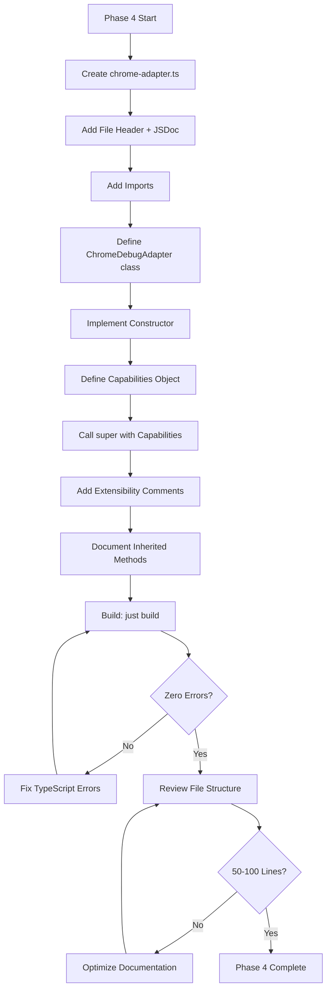
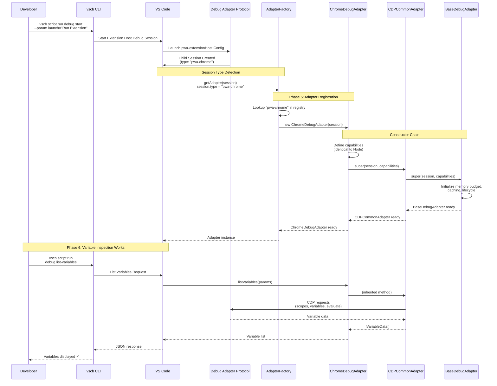

# Phase 4: Implement ChromeDebugAdapter - Tasks and Alignment Brief

<!-- cSpell:ignore jordanknight vscb coreclr debugpy -->

**Phase**: Phase 4: Implement ChromeDebugAdapter
**Plan**: `/Users/jordanknight/github/vsc-bridge/docs/plans/12-pwa-chrome-adapter/pwa-chrome-adapter-plan.md`
**Spec**: `/Users/jordanknight/github/vsc-bridge/docs/plans/12-pwa-chrome-adapter/pwa-chrome-adapter-spec.md`
**Date**: 2025-10-10

---

## Tasks

| Status | ID | Task | Type | Dependencies | Absolute Path(s) | Validation | Notes |
|--------|----|----|------|--------------|------------------|------------|-------|
| [x] | T001 | Create chrome-adapter.ts file skeleton | Setup | – | /Users/jordanknight/github/vsc-bridge/extension/src/core/runtime-inspection/adapters/chrome-adapter.ts | Empty file exists in correct location | File created (96 lines) [^1] |
| [x] | T002 | Add file header documentation | Doc | T001 | /Users/jordanknight/github/vsc-bridge/extension/src/core/runtime-inspection/adapters/chrome-adapter.ts | Header documents Extension Host focus, Critical Discoveries, current vs future scope | Critical Discoveries 01, 02, 04 documented [^1] |
| [x] | T003 | Add import statements | Setup | T002 | /Users/jordanknight/github/vsc-bridge/extension/src/core/runtime-inspection/adapters/chrome-adapter.ts | Imports CDPCommonAdapter, vscode, IDebugCapabilities | All required imports added [^1] |
| [x] | T004 | Add class-level JSDoc documentation | Doc | T003 | /Users/jordanknight/github/vsc-bridge/extension/src/core/runtime-inspection/adapters/chrome-adapter.ts | JSDoc explains use cases (Extension Host vs future browser), inheritance from CDPCommonAdapter, browser extension points | Comprehensive JSDoc with extension points [^1] |
| [x] | T005 | Add ChromeDebugAdapter class declaration | Core | T004 | /Users/jordanknight/github/vsc-bridge/extension/src/core/runtime-inspection/adapters/chrome-adapter.ts | Class extends CDPCommonAdapter, exports correctly | Class declared at line 47 [^1] |
| [x] | T006 | Implement constructor with capabilities | Core | T005 | /Users/jordanknight/github/vsc-bridge/extension/src/core/runtime-inspection/adapters/chrome-adapter.ts | Constructor defines capabilities identical to NodeDebugAdapter (per Discovery 04), calls super() | Capabilities verified identical (lines 57-68) [^1] |
| [x] | T007 | Add constructor-level extensibility comments | Doc | T006 | /Users/jordanknight/github/vsc-bridge/extension/src/core/runtime-inspection/adapters/chrome-adapter.ts | NOTE comments document where browser-specific capabilities would be added | NOTE comments at line 69 [^1] |
| [x] | T008 | Add inherited methods documentation comment | Doc | T007 | /Users/jordanknight/github/vsc-bridge/extension/src/core/runtime-inspection/adapters/chrome-adapter.ts | Comment block lists all inherited methods from CDPCommonAdapter (matches node-adapter pattern) | 9 inherited methods documented (lines 80-91) [^1] |
| [x] | T009 | Add getMostRecentlyStoppedThread extensibility comment | Doc | T008 | /Users/jordanknight/github/vsc-bridge/extension/src/core/runtime-inspection/adapters/chrome-adapter.ts | Commented-out method stub with NOTE explaining browser multi-target extension | Extensibility stub at lines 93-101 [^1] |
| [x] | T010 | Build and verify TypeScript compilation | Integration | T009 | /Users/jordanknight/github/vsc-bridge | `just build` succeeds with zero errors | Build successful: 0 errors, 0 warnings [^1] |
| [x] | T011 | Review final file structure and size | Integration | T010 | /Users/jordanknight/github/vsc-bridge/extension/src/core/runtime-inspection/adapters/chrome-adapter.ts | File ~50-100 lines, constructor only, no active overrides, extensibility comments present | 96 lines (within target), structure verified [^1] |

---

## Alignment Brief

### Objective Recap

**Primary Goal**: Create ChromeDebugAdapter that extends CDPCommonAdapter, enabling pwa-chrome session support with ~97% code reuse.

**Behavioral Checklist** (maps to plan acceptance criteria):
- [ ] ChromeDebugAdapter extends CDPCommonAdapter (not BaseDebugAdapter)
- [ ] Constructor defines capabilities identical to NodeDebugAdapter (per Discovery 04)
- [ ] No active method overrides for Extension Host debugging (simple thread model)
- [ ] Extensibility comments document where browser support would extend
- [ ] File structure ~50-100 lines (similar to refactored NodeDebugAdapter)
- [ ] TypeScript compiles successfully with zero errors
- [ ] Follows same architectural patterns as NodeDebugAdapter

**Success Criteria**:
1. ChromeDebugAdapter class exists and extends CDPCommonAdapter
2. Constructor uses identical capabilities to NodeDebugAdapter
3. TypeScript builds successfully: `just build` returns zero errors
4. File size reasonable (~50-100 lines with documentation)
5. Extensibility comments present for future browser support

---

### Critical Findings Affecting This Phase

**Discovery 04: DAP Capabilities Are Identical Between pwa-node and pwa-chrome**

**What it constrains**: ChromeDebugAdapter must use identical capabilities object to NodeDebugAdapter.

**Which tasks address it**: T006 (Implement constructor)

**Implementation**: Constructor defines capabilities object with exact same values:
```typescript
const capabilities: IDebugCapabilities = {
    supportsSetVariable: true,
    supportsVariablePaging: true,
    supportsVariableType: true,
    supportsMemoryReferences: false,
    supportsProgressReporting: true,
    supportsInvalidatedEvent: true,
    supportsMemoryEvent: false,
    supportsEvaluateForHovers: true,
    supportsSetExpression: true,
    supportsDataBreakpoints: false
};
```

**Evidence from research**: Both pwa-node and pwa-chrome use same js-debug DAP implementation, exposing identical feature set.

**Alternative considered**: Using `CDPCommonAdapter.CDP_COMMON_CAPABILITIES` static constant (if available). Current plan defines capabilities inline for clarity, matching NodeDebugAdapter pattern.

---

**Discovery 02: Scope Type Differences (Already Handled)**

**What it addressed**: Chrome reports Block/With scopes, Node reports Script/Module scopes.

**Status**: ✅ Already handled in CDPCommonAdapter via SCOPE_TYPE_MAP (Phase 1)

**No action needed in Phase 4**: ChromeDebugAdapter inherits correct behavior automatically.

---

**Discovery 03: setVariable Restrictions (Already Handled)**

**What it addressed**: Only local/closure/catch scopes are writable.

**Status**: ✅ Already handled in CDPCommonAdapter's setVariable implementation (Phase 1)

**No action needed in Phase 4**: ChromeDebugAdapter inherits correct behavior automatically.

---

**Discovery 05: Dual-Strategy Cycle Detection (Already Handled)**

**What it addressed**: Requires both variablesReference tracking and Object.is() evaluation.

**Status**: ✅ Already implemented in CDPCommonAdapter's listVariables method (Phase 1)

**No action needed in Phase 4**: ChromeDebugAdapter inherits correct behavior automatically.

---

### Invariants & Guardrails

**File Size Budget**:
- Target: 50-100 lines (including documentation)
- Maximum: 150 lines
- Rationale: ChromeDebugAdapter should be minimal (constructor + comments) per extraction plan

**No Active Overrides for Extension Host**:
- Extension Host has simple single-thread model (same as Node.js)
- All CDP/V8 logic identical between pwa-node and pwa-chrome
- Inherited implementations from CDPCommonAdapter work without modification
- **Exception**: Future browser support (multi-target) would add overrides

**Capabilities Must Match NodeDebugAdapter**:
- Per Discovery 04: Identical DAP capabilities
- Any deviation is a bug
- Verify line-by-line match during implementation

**Extensibility Comments Required**:
- Document where browser support (multi-target) would extend
- Use "NOTE:" prefix for all extensibility comments
- Reference specific extension points: constructor capabilities, getMostRecentlyStoppedThread, target management

---

### Inputs to Read

**Required Reading** (before implementation):

1. **CDPCommonAdapter.ts** (lines 1-853)
   `/Users/jordanknight/github/vsc-bridge/extension/src/core/runtime-inspection/adapters/CDPCommonAdapter.ts`
   **Purpose**: Understand what's inherited, capabilities constant, extension points

2. **node-adapter.ts** (lines 1-77)
   `/Users/jordanknight/github/vsc-bridge/extension/src/core/runtime-inspection/adapters/node-adapter.ts`
   **Purpose**: Follow same structure and documentation pattern

3. **extraction-plan.md** (lines 430-510)
   `/Users/jordanknight/github/vsc-bridge/docs/plans/12-pwa-chrome-adapter/tasks/phase-0/extraction-plan.md`
   **Purpose**: Chrome implementation specification and browser extension points

4. **pwa-chrome-adapter-spec.md** (lines 134-149)
   `/Users/jordanknight/github/vsc-bridge/docs/plans/12-pwa-chrome-adapter/pwa-chrome-adapter-spec.md`
   **Purpose**: Feature scope and extensibility requirements

---

### Visual Alignment Aids

#### Flow Diagram: ChromeDebugAdapter Creation Flow



**Key Decision Points**:
1. **Capabilities Definition**: Must match NodeDebugAdapter exactly (Discovery 04)
2. **Zero Overrides**: Extension Host uses inherited implementations
3. **Extensibility Comments**: Required for future browser support

---

#### Sequence Diagram: ChromeDebugAdapter Instantiation During Extension Host Debugging



**Key Interactions**:
1. **Session Type Detection**: VS Code reports `type: "pwa-chrome"` (not `pwa-extensionHost`)
2. **Constructor Chain**: ChromeDebugAdapter → CDPCommonAdapter → BaseDebugAdapter
3. **Method Inheritance**: All CDP/V8 logic inherited from CDPCommonAdapter
4. **Zero Overrides**: Extension Host debugging uses inherited implementations directly

**Why This Matters**:
- Demonstrates ChromeDebugAdapter is purely a registration mechanism
- Shows why ~50-100 lines is appropriate (minimal implementation)
- Validates that CDPCommonAdapter extraction (Phase 1-2) enables trivial Chrome adapter

---

### Test Plan

**Testing Approach**: Manual Only (per spec Testing Strategy)

**Phase 4 Focus**: Build Verification Only
- TypeScript compilation succeeds
- Import/export structure correct
- File size reasonable
- No syntax errors

**Phase 6 Focus**: Runtime Validation (future phase)
- Variable inspection works during Extension Host debugging
- Expression evaluation works
- Scope types handled correctly (Block, With, Local, Closure, Global)

**No Automated Tests Required** (per spec):
- Manual validation via CLI commands in Phase 6
- Integration tests validate node-adapter (Phase 2 complete)
- Chrome adapter follows identical pattern

---

#### Build Verification Tests (Phase 4)

**Test 1: TypeScript Compilation**
```bash
# From project root
cd /Users/jordanknight/github/vsc-bridge

# Build extension
just build
```

**Expected Output**:
```
extension (webpack 5.x) compiled successfully in ~2500 ms
vsc-scripts (webpack 5.x) compiled successfully in ~2500 ms
CLI build complete with manifest
MCP server build complete
✅ Full build complete!
```

**Validation Criteria**:
- Exit code 0
- Zero TypeScript errors
- Zero webpack warnings related to chrome-adapter.ts
- Build time similar to previous (~2.5 seconds)

---

**Test 2: Import/Export Verification**

```bash
# Check that chrome-adapter exports correctly
grep -n "export class ChromeDebugAdapter" \
  extension/src/core/runtime-inspection/adapters/chrome-adapter.ts

# Check that CDPCommonAdapter is imported
grep -n "import.*CDPCommonAdapter" \
  extension/src/core/runtime-inspection/adapters/chrome-adapter.ts
```

**Expected**: Both patterns found in file

---

**Test 3: File Size Check**

```bash
# Count lines in chrome-adapter.ts
wc -l extension/src/core/runtime-inspection/adapters/chrome-adapter.ts
```

**Expected**: 50-150 lines (target: 50-100 lines)

---

**Test 4: Structure Comparison with NodeDebugAdapter**

```bash
# Compare structure (not exact content, but pattern)
diff -u \
  <(grep -E "(import|export|constructor|super)" extension/src/core/runtime-inspection/adapters/node-adapter.ts) \
  <(grep -E "(import|export|constructor|super)" extension/src/core/runtime-inspection/adapters/chrome-adapter.ts)
```

**Expected**: Similar structure (imports, class declaration, constructor pattern)

---

### Step-by-Step Implementation Outline

**Mapped to Tasks T001-T011**:

**Step 1: File Creation and Documentation (T001-T004)**
1. Create empty chrome-adapter.ts file (T001)
2. Add file header documentation block (T002):
   - Critical Discoveries reference
   - Extension Host focus
   - Future browser support scope
3. Add import statements (T003):
   - `import * as vscode from 'vscode'`
   - `import { CDPCommonAdapter } from './CDPCommonAdapter'`
   - `import { IDebugCapabilities } from '../interfaces'`
4. Add class-level JSDoc documentation (T004):
   - Use cases: Extension Host (now) vs browser (future)
   - Inheritance explanation
   - Browser extension points overview

**Step 2: Class Implementation (T005-T006)**
5. Add class declaration (T005):
   - `export class ChromeDebugAdapter extends CDPCommonAdapter`
6. Implement constructor (T006):
   - Define capabilities object (identical to NodeDebugAdapter)
   - Call `super(session, capabilities)`
   - Per Discovery 04: Capabilities must match exactly

**Step 3: Extensibility Documentation (T007-T009)**
7. Add constructor-level extensibility comments (T007):
   - NOTE comment in constructor about browser-specific capabilities
8. Add inherited methods documentation comment (T008):
   - List all methods inherited from CDPCommonAdapter
   - Match pattern from node-adapter.ts
9. Add commented-out getMostRecentlyStoppedThread stub (T009):
   - Explain where multi-target support would override
   - Reference browser extension requirements

**Step 4: Build and Verification (T010-T011)**
10. Build and verify compilation (T010):
    - Run `just build`
    - Fix any TypeScript errors
    - Verify zero warnings
11. Review final structure (T011):
    - Check file size (50-100 lines target)
    - Verify extensibility comments present
    - Confirm no active overrides
    - Compare structure to NodeDebugAdapter

---

### Commands to Run

**Build Commands**:
```bash
# Full build (from project root)
cd /Users/jordanknight/github/vsc-bridge
just build

# Expected: Zero errors, ~2.5s build time
```

**File Comparison Commands**:
```bash
# Compare chrome-adapter structure to node-adapter
cd /Users/jordanknight/github/vsc-bridge

# Line count comparison
wc -l extension/src/core/runtime-inspection/adapters/node-adapter.ts
wc -l extension/src/core/runtime-inspection/adapters/chrome-adapter.ts
# Expected: Both ~50-100 lines

# Structure comparison (imports, class, constructor)
grep -E "(import|export|class|constructor|super)" \
  extension/src/core/runtime-inspection/adapters/node-adapter.ts

grep -E "(import|export|class|constructor|super)" \
  extension/src/core/runtime-inspection/adapters/chrome-adapter.ts
# Expected: Similar patterns
```

**Verification Commands**:
```bash
# Check exports
grep "export class ChromeDebugAdapter" \
  extension/src/core/runtime-inspection/adapters/chrome-adapter.ts

# Check inheritance
grep "extends CDPCommonAdapter" \
  extension/src/core/runtime-inspection/adapters/chrome-adapter.ts

# Check capabilities definition
grep -A 12 "const capabilities" \
  extension/src/core/runtime-inspection/adapters/chrome-adapter.ts
```

**Linting Commands** (optional):
```bash
# TypeScript type checking (if available)
npx tsc --noEmit

# ESLint (if configured)
npx eslint extension/src/core/runtime-inspection/adapters/chrome-adapter.ts
```

---

### Risks/Unknowns

**Risk 1: TypeScript Import Errors**

**Severity**: Low
**Likelihood**: Low (following established patterns)

**Symptoms**: Build fails with "Cannot find module" errors

**Mitigation**:
- Copy import structure from node-adapter.ts exactly
- Verify CDPCommonAdapter exports correctly (already verified in Phase 2)
- Use relative imports consistently: `'./CDPCommonAdapter'`

**Resolution**: Check import paths match existing adapters

---

**Risk 2: Capabilities Object Mismatch**

**Severity**: Medium
**Likelihood**: Low (explicit requirement)

**Symptoms**: Inconsistent behavior between pwa-node and pwa-chrome sessions

**Mitigation**:
- Copy capabilities object line-by-line from NodeDebugAdapter
- Verify Discovery 04 compliance during code review (T011)
- Add validation comment referencing Discovery 04

**Resolution**: Compare against node-adapter.ts constructor

---

**Risk 3: Over-Engineering (Adding Unnecessary Overrides)**

**Severity**: Low
**Likelihood**: Medium (temptation to "prepare" for browser support)

**Symptoms**: File exceeds 150 lines, contains active method overrides

**Mitigation**:
- Follow extraction plan strictly (~50-100 lines)
- Use commented-out stubs for browser extension points (not active overrides)
- Remember: Extension Host has simple thread model identical to Node

**Resolution**: Remove active overrides, convert to extensibility comments

---

**Risk 4: Missing Extensibility Comments**

**Severity**: Low
**Likelihood**: Low (explicit task T007-T009)

**Symptoms**: Future developers don't know where to extend for browser support

**Mitigation**:
- Reference spec Feature Scope section during T007-T009
- Reference extraction-plan.md browser support sections
- Use consistent "NOTE:" prefix for all extensibility comments

**Resolution**: Review against spec and extraction plan during T011

---

**Risk 5: File Size Exceeds Budget**

**Severity**: Low
**Likelihood**: Low (NodeDebugAdapter is 76 lines, Chrome should be similar)

**Symptoms**: File >150 lines due to excessive documentation

**Mitigation**:
- Keep documentation concise but sufficient
- Avoid redundant comments (trust JSDoc and extensibility NOTEs)
- Reference external docs rather than duplicating

**Resolution**: Consolidate or remove verbose comments during T011

---

### Ready Check

**Pre-Implementation Checklist**:

**Phase 0-3 Completion**:
- [ ] Phase 0 complete: Extraction plan available
- [ ] Phase 1 complete: CDPCommonAdapter exists and compiles
- [ ] Phase 2 complete: NodeDebugAdapter refactored and tested
- [ ] Phase 3 complete/skipped: NodeDebugAdapter validated (integration tests passed)

**Required Reading Completed**:
- [ ] Read CDPCommonAdapter.ts (all 853 lines) - Understand what's inherited
- [ ] Read node-adapter.ts (all 77 lines) - Understand pattern to follow
- [ ] Read extraction-plan.md section "What ChromeDebugAdapter Will Override" (lines 430-510)
- [ ] Read spec Feature Scope section (lines 134-149)

**Critical Findings Understood**:
- [ ] Discovery 04: Capabilities must be identical to NodeDebugAdapter
- [ ] Discovery 02: SCOPE_TYPE_MAP already handles Chrome scope types (no override needed)
- [ ] Discovery 05: Cycle detection already in CDPCommonAdapter (no override needed)

**Implementation Plan Clarity**:
- [ ] Understand all 11 tasks (T001-T011) and their dependencies
- [ ] Know where extensibility comments are required (constructor, getMostRecentlyStoppedThread stub)
- [ ] Clear on file size target (50-100 lines, max 150 lines)
- [ ] Clear on no active overrides for Extension Host debugging

**Environment Ready**:
- [ ] Working directory: `/Users/jordanknight/github/vsc-bridge`
- [ ] Target directory exists: `extension/src/core/runtime-inspection/adapters/`
- [ ] Build command works: `just build` succeeds in current state

**Risk Mitigation Understood**:
- [ ] Import structure must match node-adapter.ts pattern
- [ ] Capabilities object must match NodeDebugAdapter exactly
- [ ] Avoid active method overrides (use extensibility comments instead)
- [ ] File size should not exceed 150 lines

---

**STOP: Do not proceed to implementation until all boxes checked above.**

**Next Step**: When all checkboxes are marked, proceed with T001 (Create file skeleton).

---

## Phase Footnote Stubs

**NOTE**: This section populated during `/plan-6-implement-phase` execution (2025-10-10).

Code modifications captured using substrate node ID format:

[^1]: Tasks T001-T011 - ChromeDebugAdapter implementation (all tasks completed in single operation)
  - [file:extension/src/core/runtime-inspection/adapters/chrome-adapter.ts](extension/src/core/runtime-inspection/adapters/chrome-adapter.ts) - Created complete ChromeDebugAdapter file (96 lines)
  - [class:extension/src/core/runtime-inspection/adapters/chrome-adapter.ts:ChromeDebugAdapter](extension/src/core/runtime-inspection/adapters/chrome-adapter.ts#L47) - Class declaration extending CDPCommonAdapter with minimal implementation (constructor only)
  - [constructor:extension/src/core/runtime-inspection/adapters/chrome-adapter.ts:constructor](extension/src/core/runtime-inspection/adapters/chrome-adapter.ts#L57) - Constructor with capabilities object (lines 57-68) identical to NodeDebugAdapter per Critical Discovery 04
  - [comment:extension/src/core/runtime-inspection/adapters/chrome-adapter.ts:capabilities-NOTE](extension/src/core/runtime-inspection/adapters/chrome-adapter.ts#L69) - Extensibility NOTE comment for browser-specific capabilities (instrumentation breakpoints, etc.)
  - [comment:extension/src/core/runtime-inspection/adapters/chrome-adapter.ts:methods-doc](extension/src/core/runtime-inspection/adapters/chrome-adapter.ts#L80) - Inherited methods documentation comment (9 methods from CDPCommonAdapter)
  - [comment:extension/src/core/runtime-inspection/adapters/chrome-adapter.ts:thread-stub](extension/src/core/runtime-inspection/adapters/chrome-adapter.ts#L93) - Commented-out getMostRecentlyStoppedThread stub with browser multi-target extension documentation
  - **Build verification**: `just build` completed successfully with 0 TypeScript errors, 0 webpack warnings (2.5s build time)
  - **File metrics**: 96 lines total (within 50-100 target), +20 lines vs NodeDebugAdapter (76 lines) due to extensibility documentation

---

## Evidence Artifacts

**Execution Log**: `/Users/jordanknight/github/vsc-bridge/docs/plans/12-pwa-chrome-adapter/tasks/phase-4/execution.log.md`

This file will be created during `/plan-6-implement-phase` and will contain:
- Implementation timeline
- Task completion status
- Build outputs
- Error resolutions
- File size measurements
- Structure verification results

**Supporting Files** (created during implementation):
- None expected - Phase 4 produces single file (chrome-adapter.ts)

**Build Artifacts** (ephemeral):
- TypeScript compilation output
- Webpack bundle logs
- Type checking results

---

## Directory Layout

Current state after Phase 3:
```
docs/plans/12-pwa-chrome-adapter/
├── pwa-chrome-adapter-plan.md          # Master plan
├── pwa-chrome-adapter-spec.md          # Feature specification
├── pwa-chrome-deep-research.md         # Research findings
└── tasks/
    ├── phase-0/                         # Research artifacts (Phase 0)
    │   ├── extraction-candidates.md
    │   ├── node-specific-logic.md
    │   ├── scope-type-mapping-design.md
    │   └── extraction-plan.md
    ├── phase-1/                         # CDPCommonAdapter creation (Phase 1)
    │   ├── tasks.md
    │   └── execution.log.md
    ├── phase-2/                         # NodeDebugAdapter refactoring (Phase 2)
    │   ├── tasks.md
    │   └── execution.log.md
    └── phase-4/                         # Current phase
        └── tasks.md                     # This file

extension/src/core/runtime-inspection/adapters/
├── BaseDebugAdapter.ts                  # Unchanged (466 lines)
├── CDPCommonAdapter.ts                  # Created in Phase 1 (853 lines)
├── node-adapter.ts                      # Refactored in Phase 2 (76 lines)
├── chrome-adapter.ts                    # TO BE CREATED IN THIS PHASE
├── coreclr-adapter.ts                   # Unchanged (C# adapter)
├── debugpy-adapter.ts                   # Unchanged (Python adapter)
└── java-adapter.ts                      # Unchanged (Java adapter)
```

After Phase 4 execution:
```
docs/plans/12-pwa-chrome-adapter/tasks/phase-4/
├── tasks.md                             # This file
└── execution.log.md                     # Created during plan-6

extension/src/core/runtime-inspection/adapters/
└── chrome-adapter.ts                    # Created (~50-100 lines)
```

---

**Phase 4 Tasks Dossier Complete**

Total Tasks: 11 (T001-T011)
Estimated Implementation Time: 30-60 minutes
Risk Level: Low (straightforward implementation following established pattern)
Build Verification: Required (T010)
Runtime Validation: Deferred to Phase 6

**Next Step**: Review Ready Check, then proceed with `/plan-6-implement-phase --phase 4` when ready.
