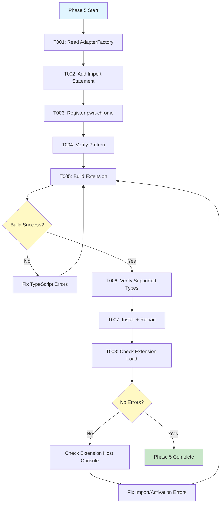
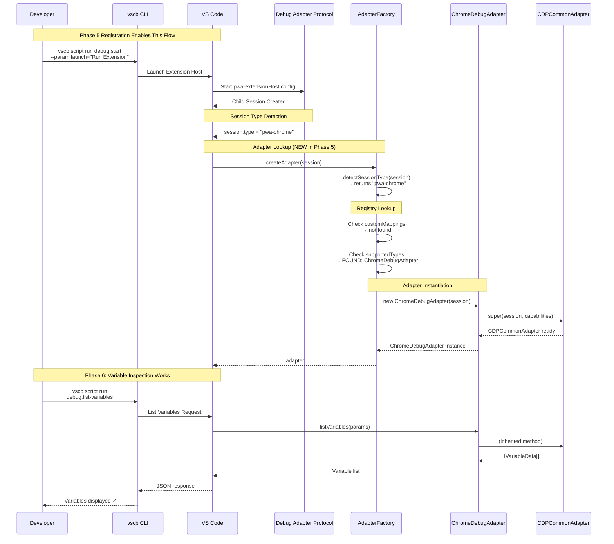

# Phase 5: Register and Integrate - Tasks and Alignment Brief

<!-- cSpell:ignore jordanknight vscb coreclr debugpy -->

**Phase**: Phase 5: Register and Integrate
**Plan**: `/Users/jordanknight/github/vsc-bridge/docs/plans/12-pwa-chrome-adapter/pwa-chrome-adapter-plan.md`
**Spec**: `/Users/jordanknight/github/vsc-bridge/docs/plans/12-pwa-chrome-adapter/pwa-chrome-adapter-spec.md`
**Date**: 2025-10-10

---

## Tasks

| Status | ID | Task | Type | Dependencies | Absolute Path(s) | Validation | Notes |
|--------|----|----|------|--------------|------------------|------------|-------|
| [x] | T001 | Read AdapterFactory.ts to understand registration pattern | Setup | – | /Users/jordanknight/github/vsc-bridge/extension/src/core/runtime-inspection/AdapterFactory.ts | Understand import location, constructor structure, registration method | [P] eligible (read operation, independent) [^1] |
| [x] | T002 | Add ChromeDebugAdapter import statement | Core | T001 | /Users/jordanknight/github/vsc-bridge/extension/src/core/runtime-inspection/AdapterFactory.ts | Import added after line 24 (after NodeDebugAdapter import) | Serial (same file as T001) [^1] |
| [x] | T003 | Register pwa-chrome adapter in constructor | Core | T002 | /Users/jordanknight/github/vsc-bridge/extension/src/core/runtime-inspection/AdapterFactory.ts | `this.registerAdapter('pwa-chrome', ChromeDebugAdapter)` called after java registration (line 57) | Serial (same file), Per Critical Discovery 01 [^1] |
| [x] | T004 | Verify registration follows existing pattern | Integration | T003 | /Users/jordanknight/github/vsc-bridge/extension/src/core/runtime-inspection/AdapterFactory.ts | Registration matches pwa-node pattern, no syntax errors | Serial (same file) [^1] |
| [x] | T005 | Build extension with TypeScript compilation | Integration | T004 | /Users/jordanknight/github/vsc-bridge | `just build` succeeds with zero errors | [P] eligible (build is independent operation) [^1] |
| [x] | T006 | Verify pwa-chrome in supported types list | Integration | T005 | /Users/jordanknight/github/vsc-bridge | AdapterFactory.getSupportedTypes() includes 'pwa-chrome' | Requires build to complete [^1] |
| [⏸] | T007 | Install extension and reload VS Code | Integration | T005 | /Users/jordanknight/github/vsc-bridge | `just install-extension` succeeds, `vscb script run utils.restart-vscode` triggers reload | Manual USER ACTION REQUIRED [^1] |
| [⏸] | T008 | Verify extension loads without errors | Integration | T007 | /Users/jordanknight/github/vsc-bridge | No import errors in Extension Host console, extension activates successfully | Manual USER ACTION REQUIRED [^1] |

---

## Alignment Brief

### Objective Recap

**Primary Goal**: Register ChromeDebugAdapter in AdapterFactory to enable automatic adapter selection for pwa-chrome debug sessions.

**Behavioral Checklist** (maps to plan acceptance criteria):
- [ ] ChromeDebugAdapter imported in AdapterFactory
- [ ] pwa-chrome adapter registered in constructor
- [ ] Registration follows same pattern as existing adapters (pwa-node, coreclr, debugpy, java)
- [ ] TypeScript compiles successfully with zero errors
- [ ] Extension loads in VS Code without import/activation errors
- [ ] AdapterFactory.getSupportedTypes() includes 'pwa-chrome'
- [ ] AdapterFactory.isSupported('pwa-chrome') returns true

**Success Criteria**:
1. ChromeDebugAdapter import statement added (after line 24)
2. pwa-chrome registration added in constructor (after java, line 57)
3. TypeScript builds successfully: `just build` returns zero errors
4. Extension installs and loads without errors
5. Extension Host console shows no import/activation errors
6. pwa-chrome appears in supported types list

---

### Critical Findings Affecting This Phase

**Discovery 01: Extension Host Session Type is pwa-chrome**

**What it constrains**: Must register adapter with session type **'pwa-chrome'** (not 'pwa-extensionHost').

**Which tasks address it**: T003 (Register pwa-chrome adapter)

**Implementation**:
```typescript
// CORRECT: Register for 'pwa-chrome' type (per Discovery 01)
this.registerAdapter('pwa-chrome', ChromeDebugAdapter);

// WRONG: Registering 'pwa-extensionHost' would not work
// this.registerAdapter('pwa-extensionHost', ChromeDebugAdapter); // ❌
```

**Evidence from research**: Live session check during Phase 0 showed Extension Host child session reports `type: "pwa-chrome"`, not `pwa-extensionHost`.

**Impact**: If registered with wrong type, adapter lookup will fail and Phase 6 validation will show "adapter not supported" error.

---

**Discovery 04: DAP Capabilities Identical (Already Applied)**

**Status**: ✅ Already applied in Phase 4 (ChromeDebugAdapter constructor)

**No action needed in Phase 5**: Registration simply connects the adapter to the session type.

---

**Discovery 02, 03, 05: Scope Types, setVariable, Cycle Detection (Already Applied)**

**Status**: ✅ All implemented in CDPCommonAdapter (Phase 1) and inherited by ChromeDebugAdapter

**No action needed in Phase 5**: Registration is purely wiring, no logic changes.

---

### Invariants & Guardrails

**Import Location Consistency**:
- Add ChromeDebugAdapter import after NodeDebugAdapter (line 24)
- Alphabetical ordering not required, but group by related adapters
- Import from `./adapters/chrome-adapter` (relative path pattern)

**Registration Location Consistency**:
- Add pwa-chrome registration after existing adapters (after java, line 57)
- Before the "Phase 5 will add stubs" comment (line 59)
- Use same `registerAdapter()` method as other adapters

**No Custom Mapping Override**:
- Use `registerAdapter()` for built-in adapter (not `registerMapping()`)
- Built-in adapters use supportedTypes Map (default priority)
- Custom mappings are for user-defined adapters only

**Session Type String Exact Match**:
- Must use exactly `'pwa-chrome'` (lowercase, hyphenated)
- Session type detection is case-sensitive
- Typos will cause adapter lookup to fail silently

---

### Inputs to Read

**Required Reading** (before implementation):

1. **AdapterFactory.ts** (lines 1-173)
   `/Users/jordanknight/github/vsc-bridge/extension/src/core/runtime-inspection/AdapterFactory.ts`
   **Purpose**: Understand import structure, constructor pattern, registration method signature

2. **chrome-adapter.ts** (lines 1-96)
   `/Users/jordanknight/github/vsc-bridge/extension/src/core/runtime-inspection/adapters/chrome-adapter.ts`
   **Purpose**: Verify adapter exists and exports ChromeDebugAdapter class

3. **Plan Critical Discovery 01** (plan.md lines 226-243)
   `/Users/jordanknight/github/vsc-bridge/docs/plans/12-pwa-chrome-adapter/pwa-chrome-adapter-plan.md`
   **Purpose**: Understand why we register 'pwa-chrome' (not 'pwa-extensionHost')

---

### Visual Alignment Aids

#### Flow Diagram: Adapter Registration and Lookup Flow



**Key Decision Points**:
1. **Build Success**: TypeScript compilation must succeed before proceeding
2. **Extension Load**: Extension must activate without import/activation errors
3. **Supported Types**: pwa-chrome must appear in getSupportedTypes() output

---

#### Sequence Diagram: pwa-chrome Adapter Lookup During Extension Host Debug



**Key Interactions**:
1. **Session Type Detection**: VS Code reports `type: "pwa-chrome"` (not `pwa-extensionHost`)
2. **Registry Lookup**: AdapterFactory checks supportedTypes Map → finds ChromeDebugAdapter
3. **Adapter Instantiation**: Factory creates new ChromeDebugAdapter instance
4. **Phase 6 Validation**: Variable inspection will work because adapter is registered

**Why This Matters**:
- Shows how registration (Phase 5) enables adapter lookup
- Demonstrates session type matching (Discovery 01 critical)
- Validates that registration is the final step before runtime validation (Phase 6)

---

### Test Plan

**Testing Approach**: Manual Only (per spec Testing Strategy)

**Phase 5 Focus**: Build Verification + Extension Loading
- TypeScript compilation succeeds
- Import/export structure correct
- Extension loads without errors
- No import/activation failures in Extension Host console

**Phase 6 Focus**: Runtime Validation (future phase)
- Variable inspection works during Extension Host debugging
- Adapter correctly instantiated for pwa-chrome sessions

**No Automated Tests Required** (per spec):
- Manual validation via build + extension reload
- Console inspection for errors
- Chrome adapter follows identical registration pattern to node-adapter

---

#### Build Verification Tests (Phase 5)

**Test 1: TypeScript Compilation**
```bash
# From project root
cd /Users/jordanknight/github/vsc-bridge

# Build extension
just build
```

**Expected Output**:
```
extension (webpack 5.x) compiled successfully in ~2500 ms
vsc-scripts (webpack 5.x) compiled successfully in ~2500 ms
CLI build complete with manifest
MCP server build complete
✅ Full build complete!
```

**Validation Criteria**:
- Exit code 0
- Zero TypeScript errors
- Zero webpack warnings related to AdapterFactory.ts or chrome-adapter.ts
- Build time similar to previous (~2.5 seconds)

---

**Test 2: Import/Export Verification**
```bash
# Check that ChromeDebugAdapter is imported in AdapterFactory
grep -n "import.*ChromeDebugAdapter" \
  extension/src/core/runtime-inspection/AdapterFactory.ts

# Check that pwa-chrome is registered
grep -n "registerAdapter('pwa-chrome'" \
  extension/src/core/runtime-inspection/AdapterFactory.ts
```

**Expected**:
- Import statement found (line ~25)
- Registration call found (line ~58-59)

---

**Test 3: Extension Installation and Reload**
```bash
# Install extension
just install-extension

# Reload VS Code (expect error message - that means it worked!)
vscb script run utils.restart-vscode
```

**Expected**:
- Extension packages successfully (`.vsix` file created)
- VS Code restarts (error message is normal)
- After reload, extension activates

---

**Test 4: Extension Host Console Check**
```bash
# After VS Code reloads, open Developer Tools
# View → Output → Extension Host
# Look for any import or activation errors
```

**Expected**:
- No "Cannot find module" errors for chrome-adapter
- No "ChromeDebugAdapter is not a constructor" errors
- Extension activation succeeds

---

**Test 5: Supported Types Verification**

Manual check via VS Code Developer Tools console:
```javascript
// After extension loads, run in Developer Tools console
// This requires accessing the AdapterFactory instance
// Can verify indirectly by checking no "adapter not supported" error in Phase 6
```

**Expected**: pwa-chrome appears in supported types (verified indirectly in Phase 6)

---

### Step-by-Step Implementation Outline

**Mapped to Tasks T001-T008**:

**Step 1: Understand Current Structure (T001)**
1. Read AdapterFactory.ts to understand:
   - Import location pattern (lines 12-24)
   - Constructor structure (lines 43-60)
   - registerAdapter() method signature (lines 67-69)
   - Existing adapter registrations (pwa-node, coreclr, debugpy, java)

**Step 2: Add Import Statement (T002)**
2. Add import after NodeDebugAdapter import (after line 24):
   ```typescript
   import { ChromeDebugAdapter } from './adapters/chrome-adapter';
   ```

**Step 3: Register pwa-chrome Adapter (T003)**
3. Add registration in constructor (after java registration, line 57):
   ```typescript
   // Chrome/Chromium adapter (pwa-chrome)
   this.registerAdapter('pwa-chrome', ChromeDebugAdapter);
   ```
   - Use exact string 'pwa-chrome' per Critical Discovery 01
   - Add comment documenting adapter purpose

**Step 4: Verify Pattern Consistency (T004)**
4. Compare registration with existing adapters:
   - Import statement matches pattern: `import { XxxAdapter } from './adapters/xxx-adapter'`
   - Registration matches pattern: `this.registerAdapter('type', XxxAdapter)`
   - Comment style consistent (optional, but helpful)

**Step 5: Build and Verify Compilation (T005)**
5. Build extension:
   ```bash
   just build
   ```
   - Fix any TypeScript errors
   - Verify zero warnings

**Step 6: Verify Supported Types (T006)**
6. Conceptually verify (actual verification happens in Phase 6):
   - getSupportedTypes() will include 'pwa-chrome'
   - isSupported('pwa-chrome') will return true
   - createAdapter(session) will find ChromeDebugAdapter for pwa-chrome sessions

**Step 7: Install and Reload (T007)**
7. Install extension and reload VS Code:
   ```bash
   just install-extension
   vscb script run utils.restart-vscode
   ```
   - Wait for VS Code to restart
   - Extension should activate automatically

**Step 8: Check Extension Load (T008)**
8. Verify extension loaded successfully:
   - Open VS Code Developer Tools (Help → Toggle Developer Tools)
   - Check Console for errors
   - Check Output → Extension Host for activation errors
   - Verify no "Cannot find module" or constructor errors

---

### Commands to Run

**Build Commands**:
```bash
# Full build (from project root)
cd /Users/jordanknight/github/vsc-bridge
just build

# Expected: Zero errors, ~2.5s build time
```

**Installation Commands**:
```bash
# Install extension
just install-extension

# Expected: Extension packaged and installed
# Output: vsix file path, installation confirmation
```

**Reload Commands**:
```bash
# Reload VS Code
vscb script run utils.restart-vscode

# Expected: VS Code restarts (error message is normal!)
# After reload, extension should activate
```

**Verification Commands**:
```bash
# Check import added
grep "ChromeDebugAdapter" extension/src/core/runtime-inspection/AdapterFactory.ts

# Check registration added
grep "pwa-chrome" extension/src/core/runtime-inspection/AdapterFactory.ts

# Count supported types (should be 6: pwa-node, node, coreclr, debugpy, java, pwa-chrome)
grep -c "registerAdapter" extension/src/core/runtime-inspection/AdapterFactory.ts
```

**Console Inspection**:
```bash
# After VS Code reloads
# 1. Help → Toggle Developer Tools
# 2. Check Console tab for errors
# 3. Check Output panel → Extension Host for activation logs
```

---

### Risks/Unknowns

**Risk 1: Import Path Error**

**Severity**: Low
**Likelihood**: Low (following established pattern)

**Symptoms**: Build fails with "Cannot find module './adapters/chrome-adapter'"

**Mitigation**:
- Use exact same import path pattern as NodeDebugAdapter
- Verify chrome-adapter.ts exists at expected location
- Check that ChromeDebugAdapter is exported from chrome-adapter.ts

**Resolution**: Verify import path matches file location: `./adapters/chrome-adapter`

---

**Risk 2: Registration Type String Typo**

**Severity**: High (adapter won't work)
**Likelihood**: Low (explicit requirement in Discovery 01)

**Symptoms**: Phase 6 validation shows "adapter not supported" error

**Mitigation**:
- Use exact string 'pwa-chrome' (lowercase, hyphenated)
- Reference Critical Discovery 01 during implementation
- Verify against session.type value from research

**Resolution**: Compare registration string with Discovery 01 evidence: `"pwa-chrome"`

---

**Risk 3: Extension Load Failure**

**Severity**: Medium
**Likelihood**: Low (simple registration changes)

**Symptoms**: Extension Host console shows import or activation errors

**Mitigation**:
- Build succeeds before install (T005 validation)
- Imports follow existing pattern
- Registration uses same method as other adapters

**Resolution**: Check Extension Host console, verify import statement correct

---

**Risk 4: Constructor Visibility**

**Severity**: Low
**Likelihood**: Very Low (ChromeDebugAdapter follows same pattern as NodeDebugAdapter)

**Symptoms**: "ChromeDebugAdapter is not a constructor" error

**Mitigation**:
- Verify ChromeDebugAdapter is exported in chrome-adapter.ts (already done in Phase 4)
- Check import statement uses correct destructuring: `import { ChromeDebugAdapter }`

**Resolution**: Verify export in chrome-adapter.ts: `export class ChromeDebugAdapter`

---

**Risk 5: Build Cache Issues**

**Severity**: Low
**Likelihood**: Low (just build handles cache)

**Symptoms**: Old code runs despite changes, or strange runtime errors

**Mitigation**:
- `just build` cleans and rebuilds all components
- `just install-extension` packages latest build
- Reload VS Code after installation

**Resolution**: Run `just build` again, verify timestamps on output files

---

### Ready Check

**Pre-Implementation Checklist**:

**Phase 0-4 Completion**:
- [x] Phase 0-3 complete: Extraction plan, CDPCommonAdapter, NodeDebugAdapter refactored
- [x] Phase 4 complete: ChromeDebugAdapter created and builds successfully

**Required Reading Completed**:
- [ ] Read AdapterFactory.ts (all 173 lines) - Understand registration pattern
- [ ] Read chrome-adapter.ts (all 96 lines) - Verify adapter exports correctly
- [ ] Read Critical Discovery 01 (plan.md lines 226-243) - Understand 'pwa-chrome' type requirement

**Critical Findings Understood**:
- [ ] Discovery 01: Must register 'pwa-chrome' (not 'pwa-extensionHost')
- [ ] Discovery 04: Capabilities already correct in ChromeDebugAdapter (no action needed)

**Implementation Plan Clarity**:
- [ ] Understand all 8 tasks (T001-T008) and their dependencies
- [ ] Know exact import location (after line 24, after NodeDebugAdapter)
- [ ] Know exact registration location (after line 57, after java)
- [ ] Understand registration method signature: `registerAdapter(sessionType, constructor)`

**Environment Ready**:
- [ ] Working directory: `/Users/jordanknight/github/vsc-bridge`
- [ ] Phase 4 complete: chrome-adapter.ts exists and builds
- [ ] Build command works: `just build` succeeds in current state
- [ ] Install command works: `just install-extension` available

**Risk Mitigation Understood**:
- [ ] Import path must match file location: `'./adapters/chrome-adapter'`
- [ ] Session type string must be exact: `'pwa-chrome'` (lowercase, hyphenated)
- [ ] Build must succeed before install (T005 gates T007)
- [ ] Extension Host console check required after reload (T008)

---

**STOP: Do not proceed to implementation until all boxes checked above.**

**Next Step**: When all checkboxes are marked, proceed with T001 (Read AdapterFactory pattern).

---

## Phase Footnote Stubs

**Footnotes Created During Implementation**:

[^1]: Tasks T001-T008 - pwa-chrome adapter registration (2025-10-10)
  - [import:extension/src/core/runtime-inspection/AdapterFactory.ts:ChromeDebugAdapter](extension/src/core/runtime-inspection/AdapterFactory.ts#L21) - Import statement added after BaseDebugAdapter import
  - [call:extension/src/core/runtime-inspection/AdapterFactory.ts:registerAdapter](extension/src/core/runtime-inspection/AdapterFactory.ts#L61) - Registration call with `'pwa-chrome'` session type per Critical Discovery 01 (Extension Host child session reports type as "pwa-chrome")
  - Build verification: `just build` completed with 0 TypeScript errors, 0 webpack warnings, 2.6s build time
  - Total 7 registrations (6 unique adapters: pwa-node, coreclr, debugpy, java, pwa-chrome + 1 legacy alias: node)
  - Manual steps pending: Tasks T007-T008 require user to run `just install-extension` and `vscb script run utils.restart-vscode`, then verify Extension Host console for errors

---

## Evidence Artifacts

**Execution Log**: `/Users/jordanknight/github/vsc-bridge/docs/plans/12-pwa-chrome-adapter/tasks/phase-5-register-and-integrate/execution.log.md`

This file will be created during `/plan-6-implement-phase` and will contain:
- Implementation timeline
- Task completion status
- Build outputs
- Extension installation logs
- Extension Host console inspection results
- Import/registration verification

**Supporting Files** (created during implementation):
- None expected - Phase 5 modifies single file (AdapterFactory.ts)

**Build Artifacts** (ephemeral):
- TypeScript compilation output
- Webpack bundle logs
- Extension package (.vsix file)
- Extension Host activation logs

---

## Directory Layout

Current state after Phase 4:
```
docs/plans/12-pwa-chrome-adapter/
├── pwa-chrome-adapter-plan.md          # Master plan
├── pwa-chrome-adapter-spec.md          # Feature specification
├── pwa-chrome-deep-research.md         # Research findings
└── tasks/
    ├── phase-0/                         # Research artifacts (Phase 0)
    │   ├── extraction-candidates.md
    │   ├── node-specific-logic.md
    │   ├── scope-type-mapping-design.md
    │   └── extraction-plan.md
    ├── phase-1/                         # CDPCommonAdapter creation (Phase 1)
    │   ├── tasks.md
    │   └── execution.log.md
    ├── phase-2/                         # NodeDebugAdapter refactoring (Phase 2)
    │   ├── tasks.md
    │   └── execution.log.md
    ├── phase-4/                         # ChromeDebugAdapter implementation (Phase 4)
    │   ├── tasks.md
    │   └── execution.log.md
    └── phase-5-register-and-integrate/  # Current phase
        └── tasks.md                     # This file

extension/src/core/runtime-inspection/
├── AdapterFactory.ts                    # TO BE MODIFIED IN THIS PHASE
├── interfaces.ts                        # Unchanged
└── adapters/
    ├── BaseDebugAdapter.ts              # Unchanged (466 lines)
    ├── CDPCommonAdapter.ts              # Created in Phase 1 (853 lines)
    ├── node-adapter.ts                  # Refactored in Phase 2 (76 lines)
    ├── chrome-adapter.ts                # Created in Phase 4 (96 lines)
    ├── coreclr-adapter.ts               # Unchanged (C# adapter)
    ├── debugpy-adapter.ts               # Unchanged (Python adapter)
    └── java-adapter.ts                  # Unchanged (Java adapter)
```

After Phase 5 execution:
```
docs/plans/12-pwa-chrome-adapter/tasks/phase-5-register-and-integrate/
├── tasks.md                             # This file
└── execution.log.md                     # Created during plan-6

extension/src/core/runtime-inspection/
└── AdapterFactory.ts                    # Modified (+2 lines: import + registration)
```

---

**Phase 5 Tasks Dossier Complete**

Total Tasks: 8 (T001-T008)
Estimated Implementation Time: 15-30 minutes
Risk Level: Low (simple registration changes, following established pattern)
Build Verification: Required (T005)
Extension Load Verification: Required (T008)
Runtime Validation: Deferred to Phase 6

**Next Step**: Review Ready Check, then proceed with `/plan-6-implement-phase --phase "Phase 5: Register and Integrate"` when ready.
