# Phase 0: Script Alias Refactoring - Tasks & Alignment Brief

**Phase**: Phase 0: Script Alias Refactoring
**Plan**: [mcp-server-implementation-plan.md](../../mcp-server-implementation-plan.md)
**Spec**: [mcp-server-implementation-spec.md](../../mcp-server-implementation-spec.md)
**Date**: 2025-10-10
**Status**: NOT STARTED

---

## Tasks

**Path Convention Note**: Per planning session 2025-10-10, using relative paths from repository root (`extension/src/...`) rather than absolute paths for portability.

| Status | ID | Task | Type | Dependencies | Relative Path(s) | Validation | Notes |
|--------|----|----|------|--------------|------------------|------------|-------|
| [ ] | T001 | Create refactoring mapping document | Doc | – | `docs/plans/13-mcp-server-implementation/tasks/phase-0/alias-mapping.md` | Document exists with complete mapping table showing old → new aliases for all 35 scripts | Reference Critical Discovery 03; establishes `<group>_<action>` naming convention |
| [ ] | T002 | Survey existing test files for alias usage | Setup | – | `test/`, `cli/test/` | List of all test files using old aliases (bp., tests., diag., utils.) documented | Preparation for T015; search patterns: `bp\.`, `tests\.`, `diag\.`, `utils\.` |
| [ ] | T003 | Update breakpoint/set.meta.yaml alias field | Core | T001 | `extension/src/vsc-scripts/breakpoint/set.meta.yaml` | `alias` field changed from `bp.set` to `breakpoint.set` | [P] eligible (different file from T004-T007) |
| [ ] | T004 | Update breakpoint/clear-file.meta.yaml alias field | Core | T001 | `extension/src/vsc-scripts/breakpoint/clear-file.meta.yaml` | `alias` field changed from `bp.clear.file` to `breakpoint.clear.file` | [P] eligible (different file) |
| [ ] | T005 | Update breakpoint/clear-project.meta.yaml alias field | Core | T001 | `extension/src/vsc-scripts/breakpoint/clear-project.meta.yaml` | `alias` field changed from `bp.clear.project` to `breakpoint.clear.project` | [P] eligible (different file) |
| [ ] | T006 | Update breakpoint/remove.meta.yaml alias field | Core | T001 | `extension/src/vsc-scripts/breakpoint/remove.meta.yaml` | `alias` field changed from `bp.remove` to `breakpoint.remove` | [P] eligible (different file) |
| [ ] | T007 | Update breakpoint/list.meta.yaml alias field | Core | T001 | `extension/src/vsc-scripts/breakpoint/list.meta.yaml` | `alias` field changed from `bp.list` to `breakpoint.list` | [P] eligible (different file) |
| [ ] | T008 | Update tests/debug-single.meta.yaml alias field | Core | T001 | `extension/src/vsc-scripts/tests/debug-single.meta.yaml` | `alias` field changed from `tests.debug-single` to `test.debug_single` | [P] eligible (different file from other test tasks) |
| [ ] | T009 | Update tests/show-testing-ui.meta.yaml alias field | Core | T001 | `extension/src/vsc-scripts/tests/show-testing-ui.meta.yaml` | `alias` field changed from `tests.show-testing-ui` to `test.show_testing_ui` | [P] eligible (different file) |
| [ ] | T010 | Update diag/collect.meta.yaml alias field | Core | T001 | `extension/src/vsc-scripts/diag/collect.meta.yaml` | `alias` field changed from `diag.collect` to `diagnostic.collect` | [P] eligible (different file) |
| [ ] | T011 | Update utils/restart-vscode.meta.yaml alias field | Core | T001 | `extension/src/vsc-scripts/utils/restart-vscode.meta.yaml` | `alias` field changed from `utils.restart-vscode` to `util.restart_vscode` | [P] eligible (different file) |
| [ ] | T012 | Rebuild manifest.json with new aliases | Core | T003, T004, T005, T006, T007, T008, T009, T010, T011 | `extension/src/vsc-scripts/manifest.json` | Generated manifest contains all new hierarchical aliases (breakpoint.*, test.*, diagnostic.*, util.*); no old abbreviated aliases remain | Run build process; verify all 35 tools present with new names |
| [ ] | T013 | Verify CLI manifest-loader compatibility | Core | T012 | `cli/src/lib/manifest-loader.ts` | Review code to confirm no hardcoded assumptions about alias format; loader correctly reads new hierarchical aliases | May not require changes; verification task |
| [ ] | T014 | Manual test: CLI with new breakpoint alias | Test | T012, T013 | N/A (manual CLI test) | Command `vscb script run breakpoint.set --param path=/tmp/test.js --param line=10` executes successfully | Manual validation; test at least one command from each category |
| [ ] | T015 | Update test files to use new aliases | Core | T002, T012 | Files identified in T002 | All test files updated to use new aliases (breakpoint.*, test.*, diagnostic.*, util.*) | Search and replace based on T002 findings; may affect multiple test files |
| [ ] | T016 | Run test-integration suite | Test | T015 | N/A (test execution) | `just test-integration` passes with new script names | CRITICAL: Must pass before Phase 0 considered complete |
| [ ] | T017 | Validate no old aliases remain in extension/src | Test | T012, T015 | `extension/src/` | Search `git grep "bp\."`, `git grep "tests\."`, `git grep "diag\."`, `git grep "utils\."` in extension/src returns no results (excluding comments/docs) | Final validation; may find documentation that needs updating |

---

## Alignment Brief

### Objective

Refactor all 35 script aliases from abbreviated prefixes (`bp.*`, `tests.*`, `diag.*`, `utils.*`) to full hierarchical naming (`breakpoint.*`, `test.*`, `diagnostic.*`, `util.*`) to enable consistent auto-generation of MCP tool names following the `<group>_<action>` pattern.

**Success Behavior Checklist** (mapped to plan acceptance criteria):
- [ ] All 35 script aliases follow hierarchical naming (breakpoint.*, test.*, diagnostic.*, util.*)
- [ ] manifest.json regenerated successfully with new aliases
- [ ] Existing CLI commands work with new names (e.g., `vscb script run breakpoint.set`)
- [ ] **CRITICAL**: `just test-integration` passes with updated alias references
- [ ] No references to old abbreviated aliases remain in codebase

### Critical Findings Affecting This Phase

**🚨 Critical Discovery 03: Auto-Generate Tool Names from Refactored Aliases**

**What it constrains/requires**:
- Script aliases MUST use hierarchical naming (`<thing>.<action>`) before MCP tool generation
- Auto-generation rule: Replace dots with underscores (e.g., `breakpoint.set` → `breakpoint_set`)
- Refactoring mapping must follow these patterns:
  - `bp.*` → `breakpoint.*`
  - `tests.*` → `test.*` (singular)
  - `diag.*` → `diagnostic.*`
  - `utils.*` → `util.*` (singular)

**Which tasks address it**:
- **T001**: Documents the complete mapping per Critical Discovery 03 patterns
- **T003-T011**: Implement the alias refactoring in all meta.yaml files
- **T012**: Regenerates manifest with new aliases that will enable auto-generation in Phase 3
- **T017**: Validates that old aliases are completely removed

**Impact on Phase 0**:
This finding is the PRIMARY DRIVER for Phase 0. Without this refactoring, the auto-generation strategy in Phase 3 would produce inconsistent tool names. The `<group>_<action>` pattern requires hierarchical aliases.

### Invariants & Guardrails

**Compatibility Requirements**:
- ✅ All CLI commands must continue working (just with new names)
- ✅ Existing tests must pass after alias updates
- ✅ No breaking changes to script functionality - only alias renaming

**File Format Constraints**:
- ✅ YAML syntax must remain valid in all meta.yaml files
- ✅ Only the `alias` field changes; all other metadata unchanged in Phase 0
- ✅ Generated manifest.json must maintain version 2 format

**Naming Convention Rules**:
- ✅ Use full words, not abbreviations (breakpoint not bp)
- ✅ Use singular for category names (test not tests, util not utils)
- ✅ Maintain dot notation for hierarchical structure (group.action.subaction)
- ✅ Use underscores in action names only when replacing existing dots (debug-single → debug_single)

### Inputs to Read

**Required Reading** (absolute paths for reference; use relative in tasks):

1. **All 35 meta.yaml files** - Current alias field values:
   - `extension/src/vsc-scripts/breakpoint/*.meta.yaml` (5 files)
   - `extension/src/vsc-scripts/debug/*.meta.yaml` (13 files: continue, evaluate, get-variable, list-variables, restart, save-variable, scopes, set-variable, stack, start, status, step-into, step-out, step-over, stop, threads, tracker, wait-for-hit)
   - `extension/src/vsc-scripts/dap/*.meta.yaml` (7 files: compare, exceptions, filter, logs, search, stats, summary, timeline)
   - `extension/src/vsc-scripts/tests/*.meta.yaml` (2 files)
   - `extension/src/vsc-scripts/diag/*.meta.yaml` (1 file)
   - `extension/src/vsc-scripts/utils/*.meta.yaml` (1 file)

2. **Build process documentation**:
   - `extension/package.json` - Look for build scripts
   - `justfile` or `Makefile` - Check for manifest generation commands

3. **CLI manifest loader**:
   - `cli/src/lib/manifest-loader.ts` - Verify no hardcoded alias assumptions

4. **Existing test files** - Identify alias usage:
   - `test/**/*.test.ts`
   - `cli/test/**/*.test.ts`

### Visual Alignment Aids

#### Flow Diagram: Phase 0 Refactoring Process


#### Sequence Diagram: Alias Refactoring Workflow

```mermaid
sequenceDiagram
    participant Dev as Developer
    participant Meta as meta.yaml files (35)
    participant Build as Build Process
    participant Manifest as manifest.json
    participant CLI as CLI Loader
    participant Tests as Integration Tests

    Dev->>Dev: T001: Create mapping document
    Note over Dev: Document bp.* → breakpoint.* etc.

    Dev->>Meta: T003-T011: Update alias fields
    Note over Meta: Change 'bp.set' → 'breakpoint.set'
    Meta-->>Dev: Confirm 35 files updated

    Dev->>Build: T012: Run build process
    Build->>Meta: Read all meta.yaml files
    Build->>Manifest: Generate manifest.json
    Note over Manifest: Contains new hierarchical aliases
    Manifest-->>Dev: Build complete

    Dev->>CLI: T013: Verify loader compatibility
    CLI->>Manifest: Read manifest
    CLI-->>Dev: No hardcoded assumptions, compatible

    Dev->>CLI: T014: Manual test with new alias
    Note over CLI: vscb script run breakpoint.set
    CLI->>Manifest: Lookup 'breakpoint.set'
    Manifest-->>CLI: Return script metadata
    CLI-->>Dev: Command executes successfully

    Dev->>Tests: T015: Update test files
    Note over Tests: Replace old aliases with new

    Dev->>Tests: T016: Run integration tests
    Tests->>CLI: Execute with new aliases
    CLI->>Manifest: Lookup scripts
    Tests-->>Dev: All tests pass

    Dev->>Meta: T017: Search for old aliases
    Meta-->>Dev: No old aliases found

    Note over Dev: Phase 0 Complete ✓
```



### Test Plan

**Testing Approach**: Manual validation during implementation (per planning session 2025-10-10)

**Manual Validation Steps**:

1. **T014: CLI Smoke Test**
   - **Rationale**: Verify CLI can execute commands with new aliases
   - **Commands**:
     ```bash
     # Test one command from each refactored category
     vscb script run breakpoint.set --param path=/tmp/test.js --param line=10
     vscb script run test.debug_single --param path=/tmp/test.py --param line=20
     vscb script run diagnostic.collect
     vscb script run util.restart_vscode
     ```
   - **Expected Output**: Each command executes successfully (or returns expected error if prerequisites missing)

2. **T016: Integration Test Suite**
   - **Rationale**: Ensure existing functionality not broken by alias changes
   - **Commands**:
     ```bash
     # CRITICAL: This must pass before Phase 0 is considered complete
     just test-integration
     ```
   - **Expected Output**: All integration tests pass (zero failures)

3. **T017: Validation Search**
   - **Rationale**: Confirm no old aliases remain in codebase
   - **Commands**:
     ```bash
     cd extension/src
     git grep "bp\." | grep -v "// " | grep -v "<!--"
     git grep "tests\." | grep -v "// " | grep -v "<!--"
     git grep "diag\." | grep -v "// " | grep -v "<!--"
     git grep "utils\." | grep -v "// " | grep -v "<!--"
     ```
   - **Expected Output**: No results (excluding comments/documentation)

**Fixtures**: None required (refactoring existing files)

**Mock Usage**: N/A for this phase

**Deferred to Phase 7**: Comprehensive integration test suite with InMemoryTransport

### Step-by-Step Implementation Outline

**Mapped 1:1 to tasks**:

**Setup Phase** (T001-T002):
1. **T001**: Create `docs/plans/13-mcp-server-implementation/tasks/phase-0/alias-mapping.md`
   - Create markdown table with columns: Old Alias | New Alias | Category | File Path
   - Include all 35 scripts
   - Reference Critical Discovery 03 naming patterns

2. **T002**: Survey test files
   - Run grep commands to find old alias usage
   - Document findings for T015

**Core Refactoring** (T003-T011):
3. **T003-T007**: Update breakpoint meta.yaml files (can run in parallel [P])
   - Open each file in `extension/src/vsc-scripts/breakpoint/`
   - Change `alias: bp.<action>` to `alias: breakpoint.<action>`
   - Verify YAML syntax remains valid

4. **T008-T009**: Update test meta.yaml files (can run in parallel [P])
   - Open each file in `extension/src/vsc-scripts/tests/`
   - Change `alias: tests.<action>` to `alias: test.<action>`
   - Note: Also change action part (e.g., `debug-single` → `debug_single`)

5. **T010**: Update diagnostic meta.yaml file
   - Change `alias: diag.collect` to `alias: diagnostic.collect`

6. **T011**: Update util meta.yaml file
   - Change `alias: utils.restart-vscode` to `alias: util.restart_vscode`

**Build and Validation** (T012-T017):
7. **T012**: Rebuild manifest
   - Run build command (determine from package.json/justfile)
   - Verify manifest.json updated with new aliases
   - Spot-check several entries

8. **T013**: Review CLI loader
   - Read `cli/src/lib/manifest-loader.ts`
   - Confirm no hardcoded alias patterns
   - If changes needed, update and test

9. **T014**: Manual CLI testing
   - Execute test commands (see Test Plan)
   - Verify each category works

10. **T015**: Update test files
    - Based on T002 findings, update test files
    - Replace old aliases with new ones
    - May use search-and-replace if patterns are consistent

11. **T016**: Run integration tests
    - Execute full test suite
    - Fix any failures related to alias changes

12. **T017**: Final validation
    - Run grep searches (see Test Plan)
    - Address any remaining old alias references

### Commands to Run

**Environment Setup**:
```bash
# Navigate to repository root
cd /Users/jak/github/vsc-bridge

# Ensure dependencies installed
npm install
```

**Build Process** (determine actual command from package.json):
```bash
# Check package.json for build scripts
cat package.json | grep -A 5 '"scripts"'

# Likely one of:
npm run build
# or
just build
# or
npm run compile
```

**Manual CLI Tests** (from T014):
```bash
# Test breakpoint category
vscb script run breakpoint.set --param path=/tmp/test.js --param line=10

# Test test category
vscb script run test.debug_single --param path=/tmp/test.py --param line=20

# Test diagnostic category
vscb script run diagnostic.collect

# Test util category
vscb script run util.restart_vscode
```

**Integration Tests** (from T016):
```bash
# CRITICAL: Must pass before Phase 0 considered complete
just test-integration
```

**Validation Searches** (from T017):
```bash
cd extension/src

# Search for old aliases (excluding comments)
git grep "bp\." | grep -v "// " | grep -v "<!--"
git grep "tests\." | grep -v "// " | grep -v "<!--"
git grep "diag\." | grep -v "// " | grep -v "<!--"
git grep "utils\." | grep -v "// " | grep -v "<!--"

# Should return no results
```

**Type Checks** (if applicable):
```bash
# Check if TypeScript compilation succeeds
npm run compile
# or
tsc --noEmit
```

### Risks & Unknowns

| Risk | Severity | Likelihood | Mitigation |
|------|----------|------------|------------|
| **Breaking existing CLI usage** | HIGH | MEDIUM | Manual testing (T014) catches issues; existing tests (T016) validate compatibility |
| **Test files reference old aliases** | MEDIUM | HIGH | T002 surveys all test files first; T015 updates them; T016 validates |
| **Documentation/comments reference old aliases** | LOW | HIGH | T017 validation may find these; update as needed |
| **Build process doesn't regenerate manifest** | MEDIUM | LOW | Verify build command in T012; check manifest.json modification timestamp |
| **Hardcoded alias assumptions in CLI loader** | MEDIUM | LOW | T013 reviews manifest-loader.ts; fix if needed |
| **Inconsistent file naming vs alias naming** | LOW | MEDIUM | Example: `debug-single.meta.yaml` but alias becomes `debug_single` - verify this is intentional |
| **Other phases/tools depend on old aliases** | LOW | LOW | This is Phase 0 (prerequisite); subsequent phases expect new aliases |

**Unknowns Requiring Investigation**:
1. ❓ **Build command**: Need to determine correct command to regenerate manifest.json (check package.json, justfile)
2. ❓ **Test file locations**: T002 will identify exact files needing updates
3. ❓ **Hyphen vs underscore in action names**: Some files use hyphens (e.g., `debug-single`) - confirm conversion to underscores in alias

### Ready Check

**Pre-Implementation Checklist**:
- [ ] All 35 meta.yaml file locations identified and accessible
- [ ] Build command determined and tested (generates manifest.json)
- [ ] Test suite can be run successfully (baseline: tests pass with old aliases)
- [ ] Git working directory clean (can easily see changes)
- [ ] Mapping document template prepared (T001)
- [ ] Understanding of `<group>_<action>` naming pattern from Critical Discovery 03
- [ ] Grep search patterns ready for T002 and T017

**Post-Task Validation**:
- [ ] T001: Mapping document complete and reviewed
- [ ] T003-T011: All 35 meta.yaml files updated with new aliases
- [ ] T012: manifest.json regenerated and spot-checked
- [ ] T013: CLI loader compatibility verified
- [ ] T014: Manual CLI tests pass (at least one per category)
- [ ] T015: Test files updated with new aliases
- [ ] T016: **CRITICAL** - `just test-integration` passes (zero failures)
- [ ] T017: Validation searches return no old alias references

**GO/NO-GO Decision Point**:
- [ ] **GO**: All pre-implementation checklist items complete
- [ ] **NO-GO**: Outstanding blockers documented below

**Blockers** (if NO-GO):
```
[Document any blockers here]
```

---

## Phase Footnote Stubs

**Note**: This section will be populated during `/plan-6-implement-phase` execution. Footnotes will be added to the plan's "Change Footnotes Ledger" section as tasks are completed.

**Footnote Format**:
```markdown
[^N]: [type:path/to/file:identifier](path#L123) – Brief description of change
```

**Stub Table** (to be populated during implementation):

| Footnote | Task | File(s) Modified | Description |
|----------|------|------------------|-------------|
| [^TBD] | T003-T011 | meta.yaml files | Alias field updates |
| [^TBD] | T012 | manifest.json | Regenerated with new aliases |
| [^TBD] | T015 | Test files | Updated alias references |

---

## Evidence Artifacts

**Execution Log**: `/Users/jak/github/vsc-bridge/docs/plans/13-mcp-server-implementation/tasks/phase-0/execution.log.md`

This file will be created during `/plan-6-implement-phase` and will contain:
- Timestamp and task ID for each task execution
- Commands run and their outputs
- Validation results
- Issues encountered and resolutions
- Links to modified files with line numbers

**Supporting Files**:
- `alias-mapping.md` - Created in T001, documents old → new alias mapping
- Screenshots or terminal output (if needed for validation)

**Expected Directory Structure After Phase 0**:
```
docs/plans/13-mcp-server-implementation/
├── mcp-server-implementation-plan.md
├── mcp-server-implementation-spec.md
└── tasks/
    └── phase-0/
        ├── tasks.md                    # This file
        ├── execution.log.md            # Created by /plan-6
        └── alias-mapping.md            # Created by T001
```

---

## Next Steps

**After GO approval**:
1. Execute: `/plan-6-implement-phase --phase "Phase 0: Script Alias Refactoring" --plan "/Users/jak/github/vsc-bridge/docs/plans/13-mcp-server-implementation/mcp-server-implementation-plan.md"`
2. Follow tasks T001-T017 in sequence (with [P] parallelization where noted)
3. Update task status checkboxes as work progresses
4. Document all changes in execution.log.md
5. Add footnotes to plan's Change Footnotes Ledger as tasks complete

**Success Milestone**: Phase 0 complete when all acceptance criteria met and validation checks pass. This enables Phase 1 (MCP SDK Setup) to proceed with clean, hierarchical script aliases ready for auto-generation.

---

**END OF PHASE 0 TASKS & ALIGNMENT BRIEF**
