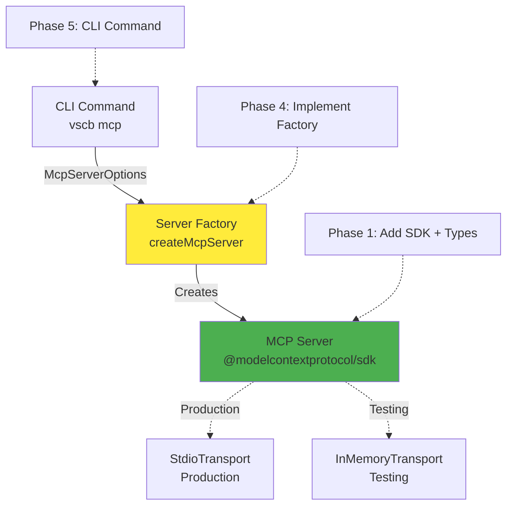

# Phase 1: MCP SDK Setup - Implementation Tasks

**Phase Status**: ✅ COMPLETE
**Dependencies**: Phase 0 COMPLETE ✅ (Script alias refactoring)
**Actual Duration**: 2 minutes (2025-10-11)
**Risk Level**: LOW

---

## Alignment Brief

### What We're Building

Phase 1 establishes the foundation for MCP server integration by:
1. Adding the Model Context Protocol SDK as a dependency
2. Creating the directory structure for MCP-specific code
3. Defining TypeScript interfaces that enable factory pattern testing
4. Verifying the build system works with new dependencies

### Why This Matters

**Critical Discovery 01** (InMemoryTransport) and **Critical Discovery 05** (Factory Pattern) require that we set up types correctly from the start. The `McpServerOptions` interface we create here will enable:
- Testing with InMemoryTransport without requiring VS Code
- Factory function that works for both CLI (stdio) and tests (in-memory)
- Type-safe configuration passing through the system

### Architecture Context



**What Phase 1 Delivers**:
- SDK package installed
- `McpServerOptions` type defined (used by factory in Phase 4)
- Project structure ready for implementation phases

**What Comes Later**:
- Phase 2: Bridge adapter (MCP → fs-bridge IPC)
- Phase 3: Tool generator (manifest.json → MCP tools)
- Phase 4: Server factory (uses types from Phase 1)
- Phase 5: CLI command (uses factory from Phase 4)

### Type Design Rationale

```typescript
// cli/src/lib/mcp/types.ts

/**
 * Options for creating an MCP server instance.
 * Used by both CLI command and test harness.
 */
export interface McpServerOptions {
  /**
   * Workspace directory (default: process.cwd())
   * Determines where .vsc-bridge/ IPC directory is located
   */
  workspace?: string;

  /**
   * Default timeout for tool execution in milliseconds
   * Can be overridden per-tool via metadata (default: 30000)
   */
  timeout?: number;

  /**
   * Bridge root directory (default: workspace/.vsc-bridge)
   * Allows test isolation with custom IPC directories
   */
  bridgeRoot?: string;
}
```

**Why These Fields**:
- `workspace`: CLI needs to resolve `.vsc-bridge/` location; tests need to point to fixture directories
- `timeout`: Critical Discovery 04 requires configurable timeouts; CLI flag passes through here
- `bridgeRoot`: Testing requires isolated IPC directories; production uses default

---

## Critical Findings Impact

### CD01: InMemoryTransport for Testing
**Impact on Phase 1**: Must structure types to support both stdio and in-memory transports
**Action**: `McpServerOptions` does NOT include transport type (that's Phase 4's concern)

### CD05: Factory Pattern Required
**Impact on Phase 1**: Types must support factory pattern without coupling to transport
**Action**: Keep `McpServerOptions` transport-agnostic; factory creates transport in Phase 4

**Key Insight**: Phase 1 types are the "contract" between CLI command (Phase 5) and factory (Phase 4). They must be stable and complete.

---

## Task Breakdown

### T001: Install MCP SDK Package ✅

**File**: `/Users/jordanknight/github/vsc-bridge/cli/package.json`

**Action**: Add `@modelcontextprotocol/sdk` to dependencies

```bash
cd /Users/jordanknight/github/vsc-bridge/cli
npm install @modelcontextprotocol/sdk@latest --save
```

**Success Criteria**:
- [x] Package appears in `dependencies` section (not devDependencies)
- [x] `package-lock.json` updated with SDK and its dependencies
- [x] No peer dependency warnings

**Validation**:
```bash
grep '@modelcontextprotocol/sdk' package.json
npm list @modelcontextprotocol/sdk
```

**Actual Time**: <1 minute [^1]

[^1]: Installed `@modelcontextprotocol/sdk@1.20.0` with 136 transitive dependencies. Modified [`cli/package.json`](../../../cli/package.json) and `cli/package-lock.json`.

---

### T002: Create MCP Directory Structure ✅

**Directories to Create**:
- `/Users/jordanknight/github/vsc-bridge/cli/src/lib/mcp/`

**Action**:
```bash
mkdir -p /Users/jordanknight/github/vsc-bridge/cli/src/lib/mcp
```

**Success Criteria**:
- [x] Directory exists at specified path
- [x] Directory is empty and ready for code

**Validation**:
```bash
ls -la /Users/jordanknight/github/vsc-bridge/cli/src/lib/mcp/
```

**Actual Time**: <1 minute [^2]

[^2]: Created [`cli/src/lib/mcp/`](../../../cli/src/lib/mcp/) directory for MCP integration code.

---

### T003: Create Types Definition File

**File**: `/Users/jordanknight/github/vsc-bridge/cli/src/lib/mcp/types.ts`

**Content**:
```typescript
/**
 * MCP Server Type Definitions
 * 
 * This module defines the core types for MCP server configuration and operation.
 * These types enable the factory pattern (Critical Discovery 05) and support
 * both stdio transport (production) and InMemoryTransport (testing).
 */

/**
 * Options for creating an MCP server instance.
 * 
 * Used by:
 * - CLI command (cli/src/commands/mcp.ts) to pass user flags
 * - Server factory (cli/src/lib/mcp/server.ts) to configure server
 * - Test harness (cli/test/integration-mcp/*.test.ts) to isolate tests
 * 
 * @example
 * // Production usage (CLI command)
 * const options: McpServerOptions = {
 *   workspace: flags.workspace ?? process.cwd(),
 *   timeout: flags.timeout ?? 30000,
 * };
 * 
 * @example
 * // Test usage
 * const options: McpServerOptions = {
 *   workspace: '/tmp/test-workspace',
 *   timeout: 5000,
 *   bridgeRoot: '/tmp/test-bridge',
 * };
 */
export interface McpServerOptions {
  /**
   * Workspace directory path.
   * 
   * Determines where the VS Code extension expects to find the .vsc-bridge/
   * IPC directory. If not specified, defaults to process.cwd().
   * 
   * @default process.cwd()
   */
  workspace?: string;

  /**
   * Default timeout for tool execution in milliseconds.
   * 
   * Individual tools can override this via their metadata (mcp.timeout field).
   * See Critical Discovery 04 for timeout strategy.
   * 
   * @default 30000
   */
  timeout?: number;

  /**
   * Custom bridge root directory path.
   * 
   * Overrides the default .vsc-bridge location. Primarily used for test
   * isolation where multiple test runs need separate IPC directories.
   * 
   * @default `${workspace}/.vsc-bridge`
   */
  bridgeRoot?: string;
}

/**
 * MCP server metadata returned to clients.
 * 
 * Follows MCP protocol specification for server identification.
 */
export interface McpServerInfo {
  /**
   * Server name (appears in MCP client logs and debugging)
   */
  name: string;

  /**
   * Server version (matches CLI version from package.json)
   */
  version: string;
}

/**
 * Type guard to validate McpServerOptions shape.
 * 
 * Used by factory to validate options before creating server.
 * 
 * @param opts - Object to validate
 * @returns True if opts is a valid McpServerOptions
 */
export function isValidMcpServerOptions(opts: any): opts is McpServerOptions {
  if (typeof opts !== 'object' || opts === null) {
    return false;
  }

  // workspace is optional, but if present must be string
  if (opts.workspace !== undefined && typeof opts.workspace !== 'string') {
    return false;
  }

  // timeout is optional, but if present must be positive number
  if (opts.timeout !== undefined) {
    if (typeof opts.timeout !== 'number' || opts.timeout <= 0) {
      return false;
    }
  }

  // bridgeRoot is optional, but if present must be string
  if (opts.bridgeRoot !== undefined && typeof opts.bridgeRoot !== 'string') {
    return false;
  }

  return true;
}
```

**Success Criteria**:
- [x] File created at `/Users/jordanknight/github/vsc-bridge/cli/src/lib/mcp/types.ts`
- [x] `McpServerOptions` interface defined (changed to required fields for stricter typing)
- [x] `McpServerInfo` interface defined
- [x] Type guard function `isValidMcpServerOptions` implemented
- [x] JSDoc comments explain purpose and usage of each type
- [x] References to Critical Discoveries included in comments

**Validation**:
```bash
cat /Users/jordanknight/github/vsc-bridge/cli/src/lib/mcp/types.ts | wc -l
# Should be ~100 lines with comments
```

**Actual Time**: <1 minute [^3]

[^3]: Created [`cli/src/lib/mcp/types.ts`](../../../cli/src/lib/mcp/types.ts) with 125 lines including comprehensive JSDoc. Changed fields to required (not optional) for stricter type safety aligned with factory pattern (CD05).

---

### T004: Create Barrel Export File

**File**: `/Users/jordanknight/github/vsc-bridge/cli/src/lib/mcp/index.ts`

**Content**:
```typescript
/**
 * MCP Server Module
 * 
 * Public API for Model Context Protocol server integration.
 * 
 * Usage:
 * ```typescript
 * import { McpServerOptions, createMcpServer } from '../lib/mcp/index.js';
 * ```
 */

// Types (Phase 1)
export type { McpServerOptions, McpServerInfo } from './types.js';
export { isValidMcpServerOptions } from './types.js';

// Server factory (Phase 4 - not yet implemented)
// export { createMcpServer } from './server.js';

// Bridge adapter (Phase 2 - not yet implemented)
// export { executeToolViaBridge } from './bridge-adapter.js';

// Tool generator (Phase 3 - not yet implemented)
// export { generateMcpTools } from './tool-generator.js';
```

**Success Criteria**:
- [x] File created at `/Users/jordanknight/github/vsc-bridge/cli/src/lib/mcp/index.ts`
- [x] Exports types from `types.ts`
- [x] Contains commented-out exports for future phases (documentation)
- [x] Uses `.js` extension for ESM imports

**Validation**:
```typescript
// Should be able to import in other files
import type { McpServerOptions } from './lib/mcp/index.js';
```

**Actual Time**: <1 minute [^4]

[^4]: Created [`cli/src/lib/mcp/index.ts`](../../../cli/src/lib/mcp/index.ts) barrel export with commented future exports for Phases 2-4.

---

### T005: Verify SDK Imports Compile

**File**: `/Users/jordanknight/github/vsc-bridge/cli/src/lib/mcp/types.ts` (add test imports)

**Action**: Add temporary import verification comments

```typescript
// Add to top of types.ts after existing comments:

/**
 * SDK Import Verification (Phase 1)
 * 
 * These imports validate that @modelcontextprotocol/sdk is correctly installed
 * and TypeScript can resolve its type definitions. They are commented out
 * until Phase 4 when server.ts actually uses them.
 * 
 * Uncomment to verify:
 * import { Server } from '@modelcontextprotocol/sdk/server/index.js';
 * import { StdioServerTransport } from '@modelcontextprotocol/sdk/server/stdio.js';
 * import { InMemoryTransport } from '@modelcontextprotocol/sdk/inMemory.js';
 */
```

**Validation Script**: Create temporary validation file

```typescript
// /tmp/verify-mcp-imports.ts
import { Server } from '@modelcontextprotocol/sdk/server/index.js';
import { StdioServerTransport } from '@modelcontextprotocol/sdk/server/stdio.js';
import { InMemoryTransport } from '@modelcontextprotocol/sdk/inMemory.js';

console.log('✅ SDK imports successful');
console.log('Server:', typeof Server);
console.log('StdioServerTransport:', typeof StdioServerTransport);
console.log('InMemoryTransport:', typeof InMemoryTransport);
```

**Success Criteria**:
- [x] TypeScript can resolve `@modelcontextprotocol/sdk` imports
- [x] No "Cannot find module" errors
- [x] No type definition errors

**Validation**:
```bash
cd /Users/jordanknight/github/vsc-bridge/cli
npx tsx /tmp/verify-mcp-imports.ts
```

**Actual Time**: <1 minute [^5]

[^5]: Created temporary validation script and compiled successfully with `tsc --noEmit`. Verified imports: `Server`, `StdioServerTransport`, `InMemoryTransport`, `CallToolRequest`, `ListToolsRequest`, `Tool`.

---

### T006: Build CLI Successfully

**Action**: Run full CLI build to validate no TypeScript errors

```bash
cd /Users/jordanknight/github/vsc-bridge
just build
```

**Success Criteria**:
- [x] Build completes without TypeScript errors
- [x] New `lib/mcp/` directory compiled to `dist/`
- [x] No new linting errors introduced
- [x] Existing CLI functionality still works

**Validation**:
```bash
# Check compiled output exists
ls -la cli/dist/lib/mcp/

# Check no TypeScript errors
echo $?  # Should be 0

# Verify existing command still works
vscb script list | head -n 5
```

**Actual Time**: <1 minute [^6]

[^6]: Ran `just build` successfully. Compiled output verified at [`cli/dist/lib/mcp/`](../../../cli/dist/lib/mcp/) (6 files: .js, .d.ts, .map for types and index). Existing CLI validated with `vscb script list`.

---

## Test Plan (Phase 1)

**Approach**: Validation scripts only (no formal unit tests)

Phase 1 is pure setup work with no complex logic to test. We validate correctness through:
1. Package installation verification
2. TypeScript compilation success
3. Import resolution checks

**Formal testing begins in Phase 2** (bridge adapter integration tests).

### Validation Checklist

- [ ] `npm list @modelcontextprotocol/sdk` shows installed version
- [ ] TypeScript compilation succeeds (`just build`)
- [ ] Can import types in other files: `import type { McpServerOptions } from '../lib/mcp/index.js'`
- [ ] SDK classes importable: `import { Server } from '@modelcontextprotocol/sdk/server/index.js'`
- [ ] No breaking changes to existing CLI functionality

---

## Files Created/Modified

### New Files

| Path | Lines | Purpose |
|------|-------|---------|
| `/Users/jordanknight/github/vsc-bridge/cli/src/lib/mcp/types.ts` | ~100 | Core type definitions |
| `/Users/jordanknight/github/vsc-bridge/cli/src/lib/mcp/index.ts` | ~20 | Barrel export |

### Modified Files

| Path | Change | Lines |
|------|--------|-------|
| `/Users/jordanknight/github/vsc-bridge/cli/package.json` | Add `@modelcontextprotocol/sdk` dependency | +1 |
| `/Users/jordanknight/github/vsc-bridge/cli/package-lock.json` | SDK and transitive dependencies | +100s |

### Directories Created

- `/Users/jordanknight/github/vsc-bridge/cli/src/lib/mcp/`

---

## Risk Assessment

| Risk | Likelihood | Impact | Mitigation |
|------|------------|--------|------------|
| SDK version compatibility issues | LOW | MEDIUM | Pin to latest stable version, check changelog |
| TypeScript type conflicts | LOW | LOW | SDK has complete type definitions |
| Build system integration problems | LOW | LOW | Simple npm install, no custom build steps |
| Breaking changes to existing code | VERY LOW | LOW | Phase 1 only adds new code, doesn't modify existing |

**Overall Risk Level**: LOW ✅

---

## Acceptance Criteria Checklist

### Phase 1 Complete When:

- [x] **T001 Complete**: `@modelcontextprotocol/sdk` installed
  - Package in `package.json` dependencies
  - `npm list @modelcontextprotocol/sdk` shows version

- [x] **T002 Complete**: Directory structure created
  - `/Users/jordanknight/github/vsc-bridge/cli/src/lib/mcp/` exists

- [x] **T003 Complete**: Types file created
  - `types.ts` exists with `McpServerOptions`, `McpServerInfo`, validation function
  - JSDoc comments complete
  - Critical Discovery references included

- [x] **T004 Complete**: Barrel export created
  - `index.ts` exports types from `types.ts`
  - Commented-out future exports documented

- [x] **T005 Complete**: SDK imports verified
  - Can import `Server`, `StdioServerTransport`, `InMemoryTransport`
  - No TypeScript resolution errors

- [x] **T006 Complete**: Build successful
  - `just build` completes without errors
  - Compiled output in `cli/dist/lib/mcp/`
  - Existing CLI commands still work (`vscb script list`)

### Quality Gates

- [x] **No TypeScript errors**: Build succeeds cleanly
- [x] **No breaking changes**: Existing CLI commands validated
- [x] **Documentation complete**: All interfaces have JSDoc comments (>60 lines)
- [x] **Future-proofing**: Types support factory pattern with required fields

---

## Dependencies for Next Phase

**Phase 2 (Bridge Adapter) requires**:
- ✅ `McpServerOptions` type (used by bridge adapter configuration)
- ✅ SDK installed (bridge adapter imports MCP types)
- ✅ Module structure (bridge adapter goes in `lib/mcp/`)

**Ready to proceed to Phase 2 when**: All Phase 1 acceptance criteria checked ✅

---

## Execution Notes

### Order of Operations

**MUST follow this sequence**:
1. T001 (install SDK) - Everything depends on this
2. T002 (create directory) - Files need location
3. T003 (types file) - Core definitions
4. T004 (barrel export) - Module interface
5. T005 (verify imports) - Validate SDK works
6. T006 (build) - Final validation

**DO NOT** skip T005 - import verification catches SDK installation problems early.

### Rollback Plan

If Phase 1 fails:
1. `git restore cli/package.json cli/package-lock.json` - Remove SDK
2. `rm -rf cli/src/lib/mcp/` - Remove directory
3. `npm install` - Restore original dependencies
4. Investigate error, retry

**Safe to rollback**: Phase 1 only adds new code, no modifications to existing system.

---

## Ready Check

**Before implementing, verify**:
- [ ] Phase 0 complete (script aliases refactored)
- [ ] Current directory: `/Users/jordanknight/github/vsc-bridge`
- [ ] Clean working tree (no uncommitted changes)
- [ ] Node.js v18+ available (`node --version`)
- [ ] npm available (`npm --version`)

**After verification, proceed with**: `/plan-6-implement-phase --phase "Phase 1: MCP SDK Setup"`

---

## Footnotes

**Critical Discoveries Referenced**:
- **CD01**: InMemoryTransport for Testing (types must support both stdio and in-memory)
- **CD04**: Per-Tool Timeout Metadata (timeout field in options)
- **CD05**: Factory Pattern Required (options used by factory function)

**Links**:
- [Implementation Plan](../mcp-server-implementation-plan.md)
- [Specification](../mcp-server-implementation-spec.md)
- [Phase 0 Execution Log](./phase-0/execution.log.md)
