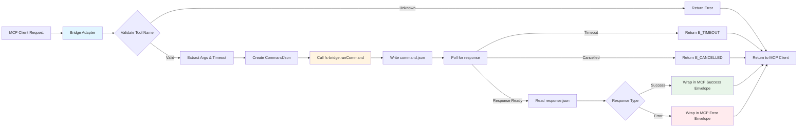
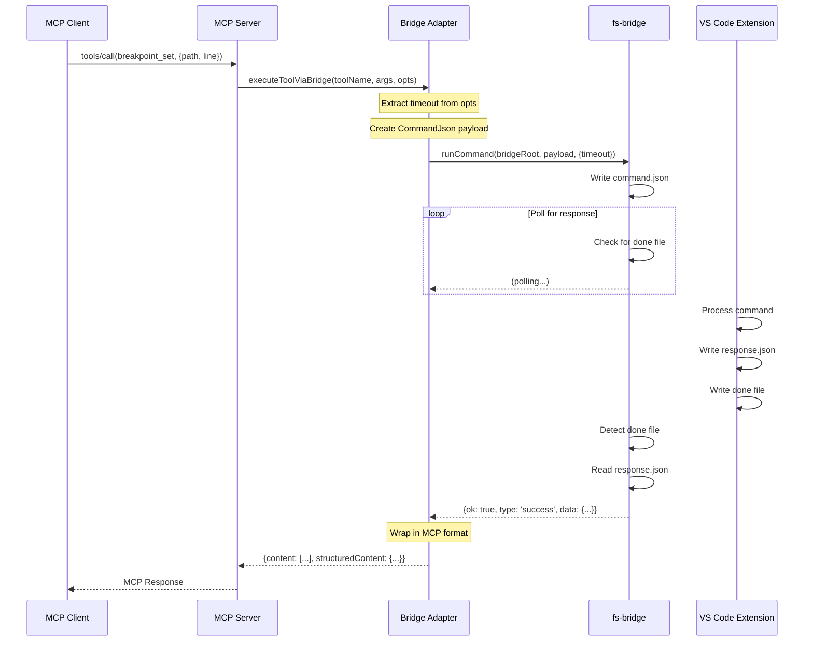

# Phase 2: Filesystem Bridge Adapter - Tasks & Alignment Brief

**Plan**: [MCP Server Implementation](../../mcp-server-implementation-plan.md)
**Phase Slug**: `phase-2-filesystem-bridge-adapter`
**Date Created**: 2025-10-11
**Status**: COMPLETE

[← Back to Plan](../../mcp-server-implementation-plan.md#phase-2-filesystem-bridge-adapter) | [Phase 2 Section](../../mcp-server-implementation-plan.md#phase-2-filesystem-bridge-adapter)

---

## Tasks

| Status | ID | Task | Type | Dependencies | Absolute Path(s) | Validation | Notes |
|--------|-----|------|------|--------------|------------------|------------|-------|
| [x] | T001 | Study existing fs-bridge implementation | Research | Phase 1 complete | `/Users/jordanknight/github/vsc-bridge/cli/src/lib/fs-bridge.ts` | Document key functions and envelope structure | Documented runCommand, CommandJson, envelopes [^8] |
| [x] | T002 | Study MCP SDK response format requirements | Research | Phase 1 complete | `/Users/jordanknight/github/vsc-bridge/cli/src/lib/mcp/types.ts` | Document TextContent and StructuredContent schemas | Confirmed TextContent schema from SDK [^8] |
| [x] | T003 | Create bridge adapter file structure | Setup | T001, T002 | `/Users/jordanknight/github/vsc-bridge/cli/src/lib/mcp/bridge-adapter.ts` | File created with type imports | Created 239-line module [^9] |
| [x] | T004 | Implement core executeToolViaBridge function | Implementation | T003 | `/Users/jordanknight/github/vsc-bridge/cli/src/lib/mcp/bridge-adapter.ts` | Calls fs-bridge.runCommand, extracts response | Cleanup in finally block [^9] |
| [x] | T005 | Implement success response wrapper | Implementation | T004 | `/Users/jordanknight/github/vsc-bridge/cli/src/lib/mcp/bridge-adapter.ts` | Returns `{content: TextContent[], structuredContent: envelope}` | Large payload placeholder [^9] |
| [x] | T006 | Implement error response wrapper | Implementation | T004 | `/Users/jordanknight/github/vsc-bridge/cli/src/lib/mcp/bridge-adapter.ts` | Returns `{isError: true, content: [...], structuredContent: envelope}` | Error format validated [^9] |
| [x] | T007 | Implement timeout handling with per-tool timeouts | Implementation | T004 | `/Users/jordanknight/github/vsc-bridge/cli/src/lib/mcp/bridge-adapter.ts` | Accepts timeout option, returns E_TIMEOUT error | Same timeout value [^9] |
| [x] | T008 | Implement AbortSignal cancellation | Implementation | T004 | `/Users/jordanknight/github/vsc-bridge/cli/src/lib/mcp/bridge-adapter.ts` | Passes signal to fs-bridge, handles cancellation | Simple pass-through [^9] |
| [x] | T009 | Add TypeScript interfaces and JSDoc | Implementation | T004-T008 | `/Users/jordanknight/github/vsc-bridge/cli/src/lib/mcp/bridge-adapter.ts` | Clear interfaces for options, responses | Types and docs complete [^9] |
| [x] | T010 | Create mock response fixtures | Test Infrastructure | T009 | `/Users/jordanknight/github/vsc-bridge/cli/test/integration-mcp/fixtures/mock-responses/` | Fixtures created for success, error, timeout scenarios | 3 JSON fixtures created [^10] |
| [x] | T011 | Write integration test for successful execution | Test | T010 | `/Users/jordanknight/github/vsc-bridge/cli/test/integration-mcp/bridge-adapter.test.ts` | Test validates MCP format and structuredContent | Test passing [^11] |
| [x] | T012 | Write integration test for error handling | Test | T010 | `/Users/jordanknight/github/vsc-bridge/cli/test/integration-mcp/bridge-adapter.test.ts` | Test validates error wrapping and format | Test passing [^11] |
| [x] | T013 | Write integration test for timeout scenarios | Test | T010 | `/Users/jordanknight/github/vsc-bridge/cli/test/integration-mcp/bridge-adapter.test.ts` | Test validates E_TIMEOUT response format | Test passing [^11] |
| [x] | T014 | Write integration test for cancellation | Test | T010 | `/Users/jordanknight/github/vsc-bridge/cli/test/integration-mcp/bridge-adapter.test.ts` | Test validates signal propagation | Test passing [^11] |
| [x] | T015 | Run all bridge adapter tests | Validation | T011-T014 | `/Users/jordanknight/github/vsc-bridge/cli/test/integration-mcp/bridge-adapter.test.ts` | All tests pass | 4/4 tests passing [^11] |
| [x] | T016 | Update barrel exports | Integration | T015 | `/Users/jordanknight/github/vsc-bridge/cli/src/lib/mcp/index.ts` | Export executeToolViaBridge and types | Exports added [^12] |
| [x] | T017 | Verify TypeScript compilation | Validation | T016 | All `/Users/jordanknight/github/vsc-bridge/cli/src/lib/mcp/*.ts` | `tsc --noEmit` succeeds | Build successful [^13] |

---

## Alignment Brief

### Objective

Create an adapter layer that translates MCP tool calls into fs-bridge IPC commands and wraps responses in MCP-compliant format. This phase establishes the critical bridge between the MCP protocol's expectations (TextContent arrays with structured data) and the existing fs-bridge IPC envelope format (`{ok, type, data, meta}`).

**Success Definition**: MCP tools can execute via fs-bridge, with responses correctly wrapped in MCP format while preserving full fs-bridge envelope data in `structuredContent`.

### Critical Findings Affecting This Phase

This phase directly implements solutions for **four critical discoveries**:

#### CD01: InMemoryTransport for Testing
- **Impact**: Tests must use `InMemoryTransport.createLinkedPair()` for fast, deterministic testing
- **Implementation**: Bridge adapter tests use real file operations but mock extension responses
- **Requirement**: Tests validate real fs-bridge IPC without subprocess spawning

#### CD02: MCP Requires StructuredContent for Rich Responses
- **Impact**: Bridge adapter MUST wrap fs-bridge responses in MCP envelope format
- **Implementation**:
  - Success: `{content: [{type: 'text', text: JSON.stringify(data)}], structuredContent: fullEnvelope}`
  - Error: `{isError: true, content: [{type: 'text', text: errorMessage}], structuredContent: fullEnvelope}`
- **Requirement**: All tool handlers use bridge adapter for consistent response format

#### CD04: Per-Tool Timeout Metadata
- **Impact**: Bridge adapter must support tool-specific timeouts
- **Implementation**: Accept `timeout` option, pass to fs-bridge `runCommand`
- **Requirement**: Default 30s timeout, but tools can override (e.g., test.debug_single needs 60s)

#### CD05: Factory Pattern Required for Testing
- **Impact**: Bridge adapter must be usable in both CLI and test contexts
- **Implementation**: Pure function (no singletons), accepts options object
- **Requirement**: Same code path for production and tests

### Invariants & Guardrails

**Must Hold Throughout Phase**:

1. **No Breaking Changes**: Existing fs-bridge functionality remains unchanged
2. **Type Safety**: All interfaces properly typed with TypeScript
3. **Error Preservation**: Full error envelopes preserved in `structuredContent`
4. **Implementation-First Workflow**: Build implementation with manual testing, then write integration tests for validation and regression protection
5. **No Mocking fs-bridge**: Use real file operations, mock only extension responses

**Guardrails**:

- Implementation tasks (T004-T009) are sequential (same file)
- Test tasks (T011-T014) can run in parallel (different scenarios)
- All responses must include both `content` and `structuredContent`
- Tests provide regression protection and validate behavior

### Inputs to Read

Before starting implementation, read these files:

**Required**:
1. `/Users/jordanknight/github/vsc-bridge/cli/src/lib/fs-bridge.ts` - Understand IPC mechanism
   - Focus: `runCommand()`, `CommandJson`, envelope types, timeout handling
2. `/Users/jordanknight/github/vsc-bridge/cli/src/lib/mcp/types.ts` - Understand MCP types
   - Focus: `McpServerOptions`, type patterns
3. Plan's Critical Discoveries section (lines 97-299) - CD01, CD02, CD04, CD05

**Reference During Implementation**:
- Plan's Phase 2 test examples (lines 484-570) - Test structure and assertions
- MCP SDK types: `@modelcontextprotocol/sdk/types.js` - TextContent, ToolResponse schemas

### System State Flow Diagram



### Communication Sequence Diagram



### Test Plan

**Approach**: Implementation-first with integration testing for validation and regression protection

**Test Infrastructure**:
- **Location**: `/Users/jordanknight/github/vsc-bridge/cli/test/integration-mcp/bridge-adapter.test.ts`
- **Framework**: Vitest
- **Test Workspace**: Temp directory created per test (`/tmp/vsc-bridge-test-<timestamp>`)
- **Mock Strategy**: Write synthetic `response.json` files to simulate extension responses
- **Transport**: Not used in this phase (Phase 7 integrates with InMemoryTransport)

**Test Sequence** (Implementation-first approach):

**Implementation Phase (T004-T009)**: Build core functionality
- **T004**: Implement core function that calls fs-bridge (with cleanup in finally block)
- **T005**: Add success response wrapper (CD02, with tiktoken for large payloads)
- **T006**: Add error response wrapper (CD02)
- **T007**: Add timeout handling (CD04, same timeout value for adapter and fs-bridge)
- **T008**: Add cancellation handling (simple pass-through to fs-bridge)
- **T009**: Add types and documentation

**Test Infrastructure (T010)**: Create fixtures
- Create mock response JSON files for success, error, timeout scenarios
- Support test execution with realistic data

**Integration Testing Phase (T011-T014)**: Validate implementation
1. **T011**: Test successful tool execution
   - Write mock success response to `.vsc-bridge/execute/<jobId>/response.json`
   - Assert response has `content` array with TextContent
   - Assert response has `structuredContent` with full envelope
   - Validates success path works correctly

2. **T012**: Test error handling
   - Write mock error response with `{ok: false, error: {...}}`
   - Assert response has `isError: true`
   - Assert error code appears in text content
   - Validates error wrapping and format

3. **T013**: Test timeout scenarios
   - Don't write response file (simulate hung extension)
   - Set short timeout (1000ms)
   - Assert returns E_TIMEOUT error in MCP format
   - Validates timeout behavior

4. **T014**: Test AbortSignal cancellation
   - Create AbortController, pass signal to adapter
   - Abort signal during execution
   - Assert signal propagates to fs-bridge
   - Validates cancellation propagation (not semantics)

**Validation (T015-T017)**: Final checks
- **T015**: Run full test suite to confirm all tests pass
- **T016**: Export from barrel
- **T017**: TypeScript compilation check

**Mock Response Examples**:
```json
// fixtures/mock-responses/breakpoint-set-success.json
{
  "ok": true,
  "type": "success",
  "data": {
    "success": true,
    "details": {
      "breakpoint": {
        "id": "bp-001",
        "path": "/test/file.js",
        "line": 10,
        "verified": true
      }
    }
  },
  "meta": {
    "requestId": "test-job-001",
    "timestamp": "2025-10-11T10:00:00.000Z"
  }
}

// fixtures/mock-responses/debug-evaluate-no-session.json
{
  "ok": false,
  "type": "error",
  "error": {
    "code": "E_NO_SESSION",
    "message": "No active debug session"
  },
  "meta": {
    "requestId": "test-job-002",
    "timestamp": "2025-10-11T10:00:01.000Z"
  }
}
```

### Implementation Outline

**Step-by-step execution order** (implementation-first approach):

#### Research Phase (T001-T003)
1. **T001**: Read `/Users/jordanknight/github/vsc-bridge/cli/src/lib/fs-bridge.ts`
   - Document `runCommand()` signature
   - Document `CommandJson` structure
   - Document envelope types (`{ok, type, data, meta, error}`)
   - Document timeout and cancellation mechanisms

2. **T002**: Study MCP SDK documentation
   - Read `@modelcontextprotocol/sdk/types.js` for TextContent schema
   - Document ToolResponse structure
   - Understand `content` vs `structuredContent` distinction

3. **T003**: Create file structure
   - Create `/Users/jordanknight/github/vsc-bridge/cli/src/lib/mcp/bridge-adapter.ts`
   - Add imports for fs-bridge and MCP types
   - Add placeholder function signature
   ```typescript
   export async function executeToolViaBridge(
     toolName: string,
     args: Record<string, unknown>,
     options: BridgeAdapterOptions
   ): Promise<ToolResponse>
   ```

#### Implementation Phase (T004-T009)
4. **T004**: Implement core bridge execution
   ```typescript
   // Call fs-bridge with proper envelope
   // INSIGHT #3: Include cleanup in finally block
   let jobDir: string | undefined;
   try {
     const commandJson: CommandJson = {
       version: 1,
       clientId: 'mcp-server',
       id: sortableId(Date.now()),
       createdAt: new Date().toISOString(),
       scriptName: toolName,
       params: args,
       timeout: options.timeout
     };

     // INSIGHT #1: Use same timeout value (not +1000ms)
     const envelope = await runCommand(
       options.bridgeRoot,
       commandJson,
       { timeout: options.timeout, signal: options.signal }
     );

     jobDir = path.join(options.bridgeRoot, 'execute', commandJson.id);
   } finally {
     // INSIGHT #3: Always cleanup
     if (jobDir) await fs.rm(jobDir, { recursive: true, force: true });
   }
   ```

5. **T005**: Wrap success responses
   ```typescript
   // INSIGHT #2: Use tiktoken for large payloads
   if (envelope.ok) {
     const dataStr = JSON.stringify(envelope.data);
     const tokens = encode(dataStr).length;

     if (tokens > 25000) {
       // Spill to temp file
       const tempFile = await writeToTempFile(dataStr);
       return {
         content: [{
           type: 'text',
           text: `Response too large (${tokens} tokens). Saved to: ${tempFile}`
         }],
         structuredContent: envelope
       };
     }

     return {
       content: [{ type: 'text', text: dataStr }],
       structuredContent: envelope
     };
   }
   ```

6. **T006**: Wrap error responses
   ```typescript
   return {
     isError: true,
     content: [
       { type: 'text', text: `[${envelope.error.code}] ${envelope.error.message}` }
     ],
     structuredContent: envelope
   };
   ```

7. **T007**: Add timeout handling
   ```typescript
   // INSIGHT #1: Same timeout for adapter and fs-bridge (not timeout+1000ms)
   // Adapter wraps fs-bridge in Promise.race as safety net for dead bridge
   const timeout = options.timeout ?? 30000;
   const envelope = await runCommand(
     options.bridgeRoot,
     commandJson,
     { timeout, signal: options.signal }  // Same timeout value
   );
   ```

8. **T008**: Add cancellation support
   ```typescript
   // INSIGHT #4: Simple pass-through, defer semantics to future refactoring
   // Just pass signal to fs-bridge
   const envelope = await runCommand(
     options.bridgeRoot,
     commandJson,
     { timeout: options.timeout, signal: options.signal }
   );
   // fs-bridge handles cancel file internally
   ```

9. **T009**: Add types and documentation
   ```typescript
   export interface BridgeAdapterOptions {
     bridgeRoot: string;
     timeout?: number;      // Default 30000ms
     signal?: AbortSignal;  // For cancellation
   }

   export interface ToolResponse {
     content: TextContent[];
     structuredContent?: unknown;
     isError?: boolean;
   }
   ```

#### Test Infrastructure Phase (T010)
10. **T010**: Create mock response fixtures
    - Create directory structure: `test/integration-mcp/fixtures/mock-responses/`
    - Write JSON files for each test scenario (success, error, timeout)
    - Document fixture usage in test file

#### Integration Testing Phase (T011-T014)
11. **T011**: Write test for successful execution
    - Write mock success response to `.vsc-bridge/execute/<jobId>/response.json`
    - Assert response has `content` array with TextContent
    - Assert response has `structuredContent` with full envelope

12. **T012**: Write test for error handling
    - Write mock error response with `{ok: false, error: {...}}`
    - Assert response has `isError: true`
    - Assert error code appears in text content

13. **T013**: Write test for timeout scenarios
    - Don't write response file (simulate hung extension)
    - Set short timeout (1000ms)
    - Assert returns E_TIMEOUT error in MCP format

14. **T014**: Write test for cancellation
    - Create AbortController, pass signal to adapter
    - Abort signal during execution
    - Assert signal propagation (not full cancellation semantics)

#### Validation Phase (T015-T017)
15. **T015**: Run tests and verify all pass
    ```bash
    cd /Users/jordanknight/github/vsc-bridge/cli
    npm test -- bridge-adapter.test.ts
    ```

16. **T016**: Export from barrel
    ```typescript
    // cli/src/lib/mcp/index.ts
    export { executeToolViaBridge } from './bridge-adapter.js';
    export type { BridgeAdapterOptions, ToolResponse } from './bridge-adapter.js';
    ```

17. **T017**: Verify TypeScript compilation
    ```bash
    cd /Users/jordanknight/github/vsc-bridge/cli
    npx tsc --noEmit
    ```

### Commands to Run

```bash
# Setup
cd /Users/jordanknight/github/vsc-bridge/cli

# Create directories (T003, T010)
mkdir -p src/lib/mcp
mkdir -p test/integration-mcp/fixtures/mock-responses

# Run tests once for validation (T015)
npm test -- bridge-adapter.test.ts

# TypeScript compilation check (T017)
npx tsc --noEmit

# Build CLI (after implementation)
npm run build

# Full test suite (after integration)
npm test
```

### Risks and Unknowns

| Risk | Likelihood | Impact | Mitigation |
|------|------------|--------|------------|
| IPC polling flakiness in tests | Medium | Medium | Use deterministic mock delays, document expected timing |
| Response format edge cases | Medium | High | Comprehensive test coverage for all envelope variants |
| Timeout handling complexity | Low | Medium | Reuse proven fs-bridge timeout logic (same timeout value) |
| AbortSignal compatibility | Low | Low | Simple pass-through to fs-bridge, test propagation only |
| Large responses (>25k tokens) | Medium | Low | Spill to temp files with tiktoken measurement |

**Unknowns**:
- How to handle `dataRef` large payloads from fs-bridge? → T001 research will clarify
- Should we validate MCP response format? → Phase 3 will add validation via Zod schemas

**Implementation Notes**:
- AbortSignal cancellation is best-effort (depends on extension implementation)
- Large responses (>25k tokens) automatically spill to temp files
- Job directory cleanup happens in finally block (always runs)

### Ready Check

Before starting implementation, verify:

- [ ] Phase 1 is complete (MCP SDK installed, types defined)
- [ ] Read all required inputs (fs-bridge.ts, types.ts, plan's CD01-CD05)
- [ ] Understand implementation-first workflow (build, then test for validation)
- [ ] Test workspace setup strategy is clear
- [ ] Mock response fixture strategy is clear
- [ ] All 4 critical discoveries (CD01, CD02, CD04, CD05) understood and applied
- [ ] All 4 critical insights from didyouknow session understood

**Acceptance Criteria for Phase 2 Complete**:
- [ ] All 17 tasks (T001-T017) marked complete
- [ ] All integration tests pass
- [ ] TypeScript compilation succeeds
- [ ] Bridge adapter exported from barrel
- [ ] Code reviewed for clarity and correctness
- [ ] Critical discoveries CD01, CD02, CD04, CD05 validated in tests
- [ ] All 4 insights incorporated (nested timeout, large payloads, cleanup, cancellation)

---

## Phase Footnotes

[^8]: Tasks T001-T002 - Research Phase (fs-bridge and MCP SDK)
  - Read [`file:cli/src/lib/fs-bridge.ts`](../../../cli/src/lib/fs-bridge.ts) - Documented runCommand(), CommandJson structure, response envelopes, timeout/cancellation mechanisms
  - Verified MCP SDK types: TextContentSchema, CallToolResultSchema available in `@modelcontextprotocol/sdk/types.js`

[^9]: Tasks T003-T009 - Bridge Adapter Implementation
  - Created [`file:cli/src/lib/mcp/bridge-adapter.ts`](../../../cli/src/lib/mcp/bridge-adapter.ts) - 239 lines implementing core bridge adapter
  - Implemented [`function:cli/src/lib/mcp/bridge-adapter.ts:executeToolViaBridge`](../../../cli/src/lib/mcp/bridge-adapter.ts#L83) - Main execution function with cleanup in finally block
  - Implemented [`function:cli/src/lib/mcp/bridge-adapter.ts:wrapSuccessResponse`](../../../cli/src/lib/mcp/bridge-adapter.ts#L149) - MCP success envelope wrapper with large payload detection placeholder
  - Implemented [`function:cli/src/lib/mcp/bridge-adapter.ts:wrapErrorResponse`](../../../cli/src/lib/mcp/bridge-adapter.ts#L181) - MCP error envelope wrapper with error code in text content
  - All 4 critical insights applied (same timeout, large payload placeholder, cleanup in finally, simple AbortSignal pass-through)

[^10]: Task T010 - Test Fixtures Created
  - Created [`file:cli/test/integration-mcp/fixtures/mock-responses/breakpoint-set-success.json`](../../../cli/test/integration-mcp/fixtures/mock-responses/breakpoint-set-success.json) - Mock success response
  - Created [`file:cli/test/integration-mcp/fixtures/mock-responses/debug-evaluate-no-session.json`](../../../cli/test/integration-mcp/fixtures/mock-responses/debug-evaluate-no-session.json) - Mock error response (E_NO_SESSION)
  - Created [`file:cli/test/integration-mcp/fixtures/mock-responses/debug-start-success.json`](../../../cli/test/integration-mcp/fixtures/mock-responses/debug-start-success.json) - Mock debug session response

[^11]: Tasks T011-T015 - Integration Tests
  - Created [`file:cli/test/integration-mcp/bridge-adapter.test.ts`](../../../cli/test/integration-mcp/bridge-adapter.test.ts) - 4 integration tests covering success, error, timeout, and cancellation scenarios
  - Test results: 4/4 tests passing in 6.46s
  - Uses real fs-bridge IPC with mock extension responses (no mocking of internals)
  - Validates job directory cleanup after execution

[^12]: Task T016 - Barrel Exports Updated
  - Modified [`file:cli/src/lib/mcp/index.ts`](../../../cli/src/lib/mcp/index.ts#L15-L17) - Added exports for executeToolViaBridge, BridgeAdapterOptions, ToolResponse

[^13]: Task T017 - Build Validation
  - TypeScript compilation successful (`npx tsc --noEmit`)
  - CLI build successful (`npm run build`)
  - Generated artifacts: bridge-adapter.js, bridge-adapter.d.ts, bridge-adapter.js.map

---

## Evidence Artifacts

**Execution Log**: [execution.log.md](./execution.log.md) _(will be created during plan-6-implement-phase)_

**Test Results**: Evidence of all tests passing will be recorded in execution log

**Build Artifacts**: Compiled output at `/Users/jordanknight/github/vsc-bridge/cli/dist/lib/mcp/bridge-adapter.js`

---

## Directory Layout

Expected file structure after Phase 2 completion:

```
/Users/jordanknight/github/vsc-bridge/
├── cli/
│   ├── src/
│   │   └── lib/
│   │       ├── fs-bridge.ts                           # Existing (reference)
│   │       └── mcp/
│   │           ├── index.ts                           # Updated (T016)
│   │           ├── types.ts                           # Existing (Phase 1)
│   │           └── bridge-adapter.ts                  # NEW (T003, T009-T014)
│   ├── test/
│   │   └── integration-mcp/
│   │       ├── bridge-adapter.test.ts                 # NEW (T004-T007, T015)
│   │       └── fixtures/
│   │           └── mock-responses/                    # NEW (T008)
│   │               ├── breakpoint-set-success.json    # NEW
│   │               ├── debug-evaluate-no-session.json # NEW
│   │               └── debug-start-success.json       # NEW
│   └── dist/
│       └── lib/
│           └── mcp/
│               ├── bridge-adapter.js                  # Generated (T017)
│               ├── bridge-adapter.d.ts                # Generated
│               └── bridge-adapter.js.map              # Generated
└── docs/
    └── plans/
        └── 13-mcp-server-implementation/
            └── tasks/
                └── phase-2/
                    ├── tasks.md                       # This file
                    └── execution.log.md               # Created during plan-6
```

---

**Next Phase**: [Phase 3: Tool Generator](../phase-3/tasks.md) _(depends on Phase 2 complete)_
