# Phase 3: Tool Generator - Tasks & Alignment Brief

**Phase**: Phase 3 - Tool Generator
**Plan**: [mcp-server-implementation-plan.md](../../mcp-server-implementation-plan.md)
**Spec**: [mcp-server-implementation-spec.md](../../mcp-server-implementation-spec.md)
**Date**: 2025-10-11
**Status**: ✅ COMPLETED

---

## Tasks

| Status | ID | Task | Type | Dependencies | Absolute Path(s) | Validation | Notes |
|--------|----|----|------|--------------|-----------------|------------|-------|
| [x] | T001 | Read manifest.json structure and understand YAML metadata format | Setup | – | `/Users/jordanknight/github/vsc-bridge/extension/src/vsc-scripts/manifest.json` | Document structure: scripts object, metadata fields (alias, params, mcp), parameter types | Completed - documented manifest V2 structure |
| [x] | T002 | Read existing manifest-loader.ts to understand loading mechanism | Setup | – | `/Users/jordanknight/github/vsc-bridge/cli/src/lib/manifest-loader.ts` | Understand how manifest is loaded, schema validation, caching | Completed - reviewed ManifestLoader class |
| [x] | T003 | Create tool-generator.ts with type definitions and exports | Setup | T001, T002 | `/Users/jordanknight/github/vsc-bridge/cli/src/lib/mcp/tool-generator.ts` | File created with MCP tool interfaces, generator function signature | Created with all interfaces [^1] |
| [x] | T004 | Implement alias → tool name mapping function | Core | T003 | `/Users/jordanknight/github/vsc-bridge/cli/src/lib/mcp/tool-generator.ts` | Function maps `breakpoint.set` → `breakpoint_set` (replace dots with underscores) per Critical Discovery 03 | Implemented aliasToToolName() [^1] |
| [x] | T005 | Implement YAML param type → JSON Schema type conversion | Core | T003 | `/Users/jordanknight/github/vsc-bridge/cli/src/lib/mcp/tool-generator.ts` | Converts string, number, boolean, enum, object, array types with constraints (min, max, values, default) | Implemented paramsToJsonSchema() [^1] |
| [x] | T006 | Implement mcp.enabled filtering logic | Core | T003 | `/Users/jordanknight/github/vsc-bridge/cli/src/lib/mcp/tool-generator.ts` | Filters out tools where `mcp.enabled === false`, defaults to true if field absent | Implemented shouldIncludeTool() [^1] |
| [x] | T007 | Extract P0 metadata fields | Core | T003, T004 | `/Users/jordanknight/github/vsc-bridge/cli/src/lib/mcp/tool-generator.ts` | Extracts: mcp.tool override (or auto-generated), description, timeout per Critical Discovery 04 | Implemented extractP0Metadata() [^1] |
| [x] | T008 | Extract P1 metadata fields from mcp.llm.* | Core | T003 | `/Users/jordanknight/github/vsc-bridge/cli/src/lib/mcp/tool-generator.ts` | Extracts when_to_use, parameter_hints with examples from mcp.llm namespace | Implemented extractP1Metadata() [^1] |
| [x] | T009 | Implement main generateMcpTools function orchestrating all conversions | Core | T004, T005, T006, T007, T008 | `/Users/jordanknight/github/vsc-bridge/cli/src/lib/mcp/tool-generator.ts` | Function loads manifest, filters enabled tools, generates complete MCP tool definitions array | Implemented main orchestration [^1] |
| [x] | T010 | Create test manifest fixture with 5-10 representative tools | Test | T001 | `/Users/jordanknight/github/vsc-bridge/cli/test/integration-mcp/fixtures/test-manifest.json` | Fixture includes variety: string/number/boolean/enum/object params, required/optional mix, mcp metadata | Created 8-tool comprehensive fixture [^2] |
| [x] | T011 | Create tool-generator.test.ts file with test structure | Test | – | `/Users/jordanknight/github/vsc-bridge/cli/test/integration-mcp/tool-generator.test.ts` | Test file created with describe blocks, imports, basic structure | Created with 23 tests [^3] |
| [x] | T012 | Write test for alias → tool name mapping | Test | T004, T010, T011 | `/Users/jordanknight/github/vsc-bridge/cli/test/integration-mcp/tool-generator.test.ts` | Test validates Critical Discovery 03: all aliases map correctly (`breakpoint.set` → `breakpoint_set`, `debug.evaluate` → `debug_evaluate`) | 3 tests validate mapping [^3] |
| [x] | T013 | Write test for YAML → JSON Schema type conversion | Test | T005, T010, T011 | `/Users/jordanknight/github/vsc-bridge/cli/test/integration-mcp/tool-generator.test.ts` | Test covers all param types: string, number (with min/max), boolean, enum (with values), object, array; validates required field | 4 tests validate all types [^3] |
| [x] | T014 | Write test for mcp.enabled filtering | Test | T006, T010, T011 | `/Users/jordanknight/github/vsc-bridge/cli/test/integration-mcp/tool-generator.test.ts` | Test verifies tools with `enabled: false` excluded, tools without field included (default true) | 3 tests validate filtering [^3] |
| [x] | T015 | Write test for P0 metadata extraction | Test | T007, T010, T011 | `/Users/jordanknight/github/vsc-bridge/cli/test/integration-mcp/tool-generator.test.ts` | Test validates: tool name (auto-generated or override), description, timeout extraction per Critical Discovery 04 | 4 tests validate P0 metadata [^3] |
| [x] | T016 | Write test for P1 metadata extraction | Test | T008, T010, T011 | `/Users/jordanknight/github/vsc-bridge/cli/test/integration-mcp/tool-generator.test.ts` | Test validates: when_to_use guidance, parameter_hints with examples present in tool annotations | 4 tests validate P1 metadata [^3] |
| [x] | T017 | Run all tests and verify 90%+ coverage | Test | T012, T013, T014, T015, T016 | N/A (command execution) | All tests pass, coverage ≥90% for tool-generator.ts | 23/23 tests passed [^3] |
| [x] | T018 | Export generateMcpTools and types from barrel | Integration | T009 | `/Users/jordanknight/github/vsc-bridge/cli/src/lib/mcp/index.ts` | Barrel exports `generateMcpTools`, `McpTool`, `ToolMetadata` types | Added Phase 3 exports [^4] |
| [x] | T019 | Verify TypeScript compilation and CLI build | Integration | T009, T018 | N/A (command execution) | `npx tsc --noEmit` passes, `npm run build` succeeds, dist files generated | Build successful, artifacts verified |

---

## Alignment Brief

### Objective

Generate MCP tool definitions programmatically from VSC-Bridge's script manifest.json, mapping YAML metadata to MCP-compliant JSON schemas with rich LLM guidance annotations. This enables zero-maintenance tool exposure—whenever new scripts are added or metadata updated, tool definitions regenerate automatically during build.

**Behavior Checklist** (from plan acceptance criteria):
- [x] Generator reads manifest.json and produces MCP tool definitions array
- [x] Tool names follow snake_case pattern auto-generated from aliases (e.g., `breakpoint.set` → `breakpoint_set`)
- [x] All YAML parameter types map correctly to JSON Schema (string, number, boolean, enum, object, array with constraints)
- [x] P0+P1 metadata included in tool annotations (description, timeout, when_to_use, parameter_hints)
- [x] Tools with `mcp.enabled: false` excluded from output
- [x] Unit tests achieve 90%+ coverage of generator logic

### Critical Findings Affecting This Phase

This phase is directly shaped by two critical discoveries from the plan's research:

**🚨 Critical Discovery 03: Auto-Generate Tool Names from Refactored Aliases**
- **What it constrains**: Tool naming must follow predictable transformation (`alias.replace('.', '_')`)
- **What it requires**: Simple string replacement, optional `mcp.tool` override support
- **Tasks addressing it**:
  - T004: Implements alias → tool name mapping function
  - T012: Test validates all aliases map correctly (breakpoint.set → breakpoint_set, test.debug_single → test_debug_single)
- **Impact**: Zero manual maintenance—tool names automatically stay in sync with script aliases

**🚨 Critical Discovery 04: Per-Tool Timeout Metadata**
- **What it constrains**: Not all tools can use default 30s timeout (test discovery may take 60s+)
- **What it requires**: Extract optional `mcp.timeout` field from metadata, pass to bridge adapter
- **Tasks addressing it**:
  - T007: Extracts timeout from `mcp.timeout` field in P0 metadata
  - T015: Test validates timeout extraction for tools with custom values
- **Impact**: Long-running tools (test.debug_single, debug.wait_for_hit) won't timeout prematurely

### Invariants & Guardrails

**Performance**:
- Tool generation happens at **build time** (not runtime), so generation speed is not critical
- Generated tool array cached in memory (loaded once per server instance)

**Memory**:
- 35 tool definitions × ~2KB metadata ≈ 70KB total (negligible)
- No runtime memory growth (static tool list)

**Security**:
- Generator is build-time only (no dynamic code execution)
- JSON Schema validation enforced by MCP SDK (parameter type safety)

**Quality**:
- 90%+ test coverage required for generator logic
- All YAML parameter types must have test coverage
- Test fixture includes edge cases (optional params, enums, nested objects)

### Inputs to Read

**Manifest Structure** (`/Users/jordanknight/github/vsc-bridge/extension/src/vsc-scripts/manifest.json`):
```json
{
  "version": 2,
  "generatedAt": "2025-10-11...",
  "scripts": {
    "breakpoint.set": {
      "metadata": {
        "alias": "breakpoint.set",
        "name": "Set Breakpoint",
        "category": "breakpoint",
        "description": "Set a breakpoint...",
        "params": {
          "path": {
            "type": "string",
            "required": true,
            "description": "File path..."
          },
          "line": {
            "type": "number",
            "required": true,
            "min": 1
          }
        },
        "response": "action",
        "errors": ["E_FILE_NOT_FOUND", "E_INVALID_LINE"],
        "mcp": {
          "tool": "add_breakpoint",  // Optional override
          "description": "Adds a breakpoint to the specified file and line"
        }
      },
      "scriptRelPath": "breakpoint/set.js"
    }
  }
}
```

**Existing Manifest Loader** (`/Users/jordanknight/github/vsc-bridge/cli/src/lib/manifest-loader.ts`):
- Understand how manifest is loaded from CLI dist directory
- Reuse loading mechanism (don't duplicate logic)

**Phase 2 Bridge Adapter** (`/Users/jordanknight/github/vsc-bridge/cli/src/lib/mcp/bridge-adapter.ts`):
- Understand ToolResponse format (content + structuredContent)
- Coordinate timeout handling (generator extracts timeout, adapter uses it)

### Visual Alignment Aids

#### Flow Diagram: Tool Generation Pipeline

```mermaid
flowchart TD
    Start([manifest.json]) --> Load[Load Manifest]
    Load --> Filter{mcp.enabled?}
    Filter -->|false| Skip[Skip Tool]
    Filter -->|true/absent| MapAlias[Map Alias → Tool Name]

    MapAlias --> ConvertParams[Convert YAML Params → JSON Schema]
    ConvertParams --> ExtractP0[Extract P0 Metadata]
    ExtractP0 --> ExtractP1[Extract P1 Metadata]

    ExtractP1 --> BuildTool[Build MCP Tool Definition]
    BuildTool --> Next{More Scripts?}
    Next -->|yes| Filter
    Next -->|no| Output([Array of MCP Tools])

    Skip --> Next

    style Start fill:#e1f5ff
    style Output fill:#d4edda
    style Filter fill:#fff3cd
    style BuildTool fill:#cfe2ff
```



#### Sequence Diagram: Tool Generation Interaction


### Test Plan

**Approach**: Unit/integration tests alongside implementation (no strict TDD)

**Focus**: Generator logic correctness over granular coverage

**Mock Usage**: Use test manifest fixture (subset of real manifest), no mocking of JSON.parse or file system

#### Test Suite Structure

**File**: `/Users/jordanknight/github/vsc-bridge/cli/test/integration-mcp/tool-generator.test.ts`

**Test 1: Alias → Tool Name Mapping** (T012)
- **Purpose**: Validates auto-generation of MCP tool names from refactored script aliases (Critical Discovery 03)
- **Fixture**: test-manifest.json with breakpoint.set, debug.evaluate, test.debug_single
- **Assertions**:
  - `expect(toolNames).toContain('breakpoint_set')` ✅
  - `expect(toolNames).toContain('debug_evaluate')` ✅
  - `expect(toolNames).toContain('test_debug_single')` ✅
  - `expect(toolNames).not.toContain('bp.set')` ✅ (old alias rejected)
- **Quality Contribution**: Ensures consistent, predictable tool naming for LLMs

**Test 2: YAML → JSON Schema Type Conversion** (T013)
- **Purpose**: Proves parameter schema mapping preserves types and constraints
- **Fixture**: Tool with varied params (string, number with min, enum with values, optional with default)
- **Assertions**:
  - `expect(schema.properties.path.type).toBe('string')`
  - `expect(schema.properties.line.type).toBe('number')`
  - `expect(schema.properties.line.minimum).toBe(1)`
  - `expect(schema.properties.context.enum).toEqual(['repl', 'watch', 'hover'])`
  - `expect(schema.required).toContain('path')` (required field)
  - `expect(schema.required).not.toContain('condition')` (optional field)
- **Quality Contribution**: Prevents parameter validation failures in MCP clients

**Test 3: mcp.enabled Filtering** (T014)
- **Purpose**: Ensures tools can be selectively excluded from MCP exposure
- **Fixture**: test-manifest.json modified to have one tool with `mcp.enabled: false`
- **Assertions**:
  - `expect(tools.find(t => t.name === 'disabled_tool')).toBeUndefined()`
  - `expect(tools.find(t => t.name === 'enabled_tool')).toBeDefined()`
  - `expect(tools.find(t => t.name === 'no_flag_tool')).toBeDefined()` (default true)
- **Quality Contribution**: Allows gradual rollout and testing isolation

**Test 4: P0 Metadata Extraction** (T015)
- **Purpose**: Validates basic tool metadata required for discovery (Critical Discovery 04 for timeout)
- **Fixture**: Tools with varied metadata (some with timeout override, some with tool name override)
- **Assertions**:
  - `expect(tool.name).toBe('breakpoint_set')` (auto-generated)
  - `expect(tool.description).toBeTruthy()` (description present)
  - `expect(tool.timeout).toBe(5000)` (custom timeout from metadata)
  - `expect(overrideTool.name).toBe('custom_name')` (mcp.tool override respected)
- **Quality Contribution**: Ensures agents receive complete tool metadata

**Test 5: P1 Metadata Extraction** (T016)
- **Purpose**: Validates LLM guidance metadata is included in tool definitions
- **Fixture**: Tool with mcp.llm.when_to_use and mcp.llm.parameter_hints
- **Assertions**:
  - `expect(tool.annotations.when_to_use).toBeTruthy()`
  - `expect(tool.annotations.parameter_hints).toHaveProperty('expression')`
  - `expect(tool.annotations.parameter_hints.expression.examples).toBeArray()`
  - `expect(tool.annotations.parameter_hints.expression.examples.length).toBeGreaterThan(0)`
- **Quality Contribution**: Improves agent tool selection and parameter usage

**Expected Outputs**:
- All 5 tests pass ✅
- Coverage ≥90% for tool-generator.ts ✅
- Test execution < 2 seconds (no file I/O, just JSON parsing) ✅

### Step-by-Step Implementation Outline

**Phase 1: Setup & Research** (T001-T003)
1. Read manifest.json, document structure (script metadata, params, mcp fields)
2. Read manifest-loader.ts, understand loading mechanism
3. Create tool-generator.ts with type definitions:
   ```typescript
   export interface McpTool {
     name: string;
     description: string;
     inputSchema: JSONSchema;
     annotations?: {
       timeout?: number;
       when_to_use?: string;
       parameter_hints?: Record<string, any>;
     };
   }

   export function generateMcpTools(manifest: Manifest): McpTool[];
   ```

**Phase 2: Core Implementation** (T004-T009)
1. Implement `aliasToToolName(alias: string): string` — Replace dots with underscores
2. Implement `paramsToJsonSchema(params: YamlParams): JSONSchema` — Map types, required, constraints
3. Implement `shouldIncludeTool(metadata: ScriptMetadata): boolean` — Check mcp.enabled (default true)
4. Implement `extractP0Metadata(metadata: ScriptMetadata): P0` — Extract tool, description, timeout
5. Implement `extractP1Metadata(metadata: ScriptMetadata): P1` — Extract when_to_use, parameter_hints
6. Implement main `generateMcpTools(manifest: Manifest): McpTool[]` — Orchestrate all above

**Phase 3: Test Infrastructure** (T010-T011)
1. Create test-manifest.json fixture with 5-10 representative tools:
   - breakpoint.set (string + number params, required fields, timeout override)
   - debug.evaluate (string + enum params, optional frameId)
   - test.debug_single (disabled tool for filtering test)
   - dap.logs (enum with multiple values, optional params with defaults)
   - debug.list_variables (object param for complex schema test)
2. Create tool-generator.test.ts with describe blocks and imports

**Phase 4: Test Implementation** (T012-T017)
1. Write test for alias mapping (validate Critical Discovery 03)
2. Write test for schema conversion (all param types)
3. Write test for enabled filtering
4. Write test for P0 metadata (validate Critical Discovery 04)
5. Write test for P1 metadata
6. Run `npm test -- tool-generator.test.ts`, verify 90%+ coverage

**Phase 5: Integration** (T018-T019)
1. Export from barrel: `export { generateMcpTools } from './tool-generator.js'`
2. Run `npx tsc --noEmit` to verify TypeScript compilation
3. Run `npm run build` to generate dist artifacts

### Commands to Run

**Setup**:
```bash
# No environment setup needed (uses existing CLI infrastructure)
cd /Users/jordanknight/github/vsc-bridge
```

**Test Execution**:
```bash
# Run generator tests only
npm test -- tool-generator.test.ts

# Run with coverage
npm test -- --coverage tool-generator.test.ts

# Watch mode during development
npm test -- --watch tool-generator.test.ts
```

**Type Checking**:
```bash
# Verify TypeScript compilation
npx tsc --noEmit -p cli/tsconfig.json
```

**Build**:
```bash
# Build CLI with new generator module
npm run build

# Verify generated artifacts
ls -la cli/dist/lib/mcp/tool-generator.*
# Expected: tool-generator.js, tool-generator.d.ts, tool-generator.js.map
```

**Linting** (if applicable):
```bash
# Run ESLint on new files
npx eslint cli/src/lib/mcp/tool-generator.ts
npx eslint cli/test/integration-mcp/tool-generator.test.ts
```

### Risks & Unknowns

| Risk | Severity | Likelihood | Mitigation |
|------|----------|------------|------------|
| **Incomplete YAML metadata** | HIGH | MEDIUM | Validation step in generator warns on missing fields; fallback to empty/default values |
| **Schema mapping edge cases** | MEDIUM | MEDIUM | Comprehensive test coverage for all param types; manual review of generated schemas |
| **Enum value extraction** | MEDIUM | LOW | Test fixture includes enum params; validate `values` array present in manifest |
| **Object/array param complexity** | MEDIUM | MEDIUM | Start with simple object type (no nested schema), defer complex nesting to Phase 6 if needed |
| **P1 metadata format inconsistency** | LOW | LOW | Define clear format in metadata template (Phase 6), generator expects specific structure |
| **Tool name collisions** | LOW | LOW | Refactored aliases already hierarchical (breakpoint.*, debug.*), collision unlikely |

**Unknowns**:
- How to represent complex object params in JSON Schema? (e.g., dap.filter's `filters` object)
  - **Resolution**: Use `type: 'object'` with freeform properties initially; Phase 6 can add detailed schema
- Should we validate that mcp.tool overrides don't conflict with auto-generated names?
  - **Resolution**: No validation initially; assume metadata authors avoid conflicts
- What happens if manifest.json has syntax errors?
  - **Resolution**: manifestLoader already validates JSON parsing; generator assumes valid input

### Ready Check

Before implementing Phase 3, verify:

- [ ] **Prerequisite phases complete**: Phase 0 (alias refactoring), Phase 1 (SDK setup), Phase 2 (bridge adapter) all marked COMPLETE
- [ ] **Manifest structure understood**: Reviewed manifest.json, documented params object structure, mcp metadata fields
- [ ] **Critical discoveries internalized**: Understand alias → tool name mapping rule (Discovery 03), timeout extraction requirement (Discovery 04)
- [ ] **Test approach agreed**: Hybrid testing (unit tests alongside implementation), 90%+ coverage target, test fixture-based approach
- [ ] **Absolute paths validated**: All file paths in tasks table are absolute, no relative paths
- [ ] **Dependencies mapped**: Task dependencies form valid DAG (no circular dependencies), T009 depends on all helper functions (T004-T008)
- [ ] **Tooling available**: Node.js, TypeScript, Vitest installed and working (`npm test` runs successfully)
- [ ] **Plan alignment**: This dossier matches plan Phase 3 objectives and acceptance criteria

**Explicit GO/NO-GO Decision Point**:

User must confirm:
1. ✅ **Approach approved**: Auto-generate tool names from aliases, extract P0+P1 metadata
2. ✅ **Scope bounded**: This phase generates tool definitions only; Phase 4 will register them with MCP server
3. ✅ **Test strategy clear**: Write tests alongside implementation, achieve 90%+ coverage before proceeding
4. ⏸️ **Ready to implement**: User types "GO" to proceed, or provides feedback to adjust plan

---

## Phase Footnote Stubs

| Footnote | Task(s) | Files Modified | Description |
|----------|---------|----------------|-------------|
| [^1] | T003-T009 | [`file:cli/src/lib/mcp/tool-generator.ts`](../../../cli/src/lib/mcp/tool-generator.ts) | Created tool generator with all core functions: `generateMcpTools()`, `aliasToToolName()`, `paramsToJsonSchema()`, `shouldIncludeTool()`, `extractP0Metadata()`, `extractP1Metadata()`. Implements Critical Discovery 03 (auto-generate tool names) and Critical Discovery 04 (per-tool timeout extraction). 240 lines with TypeScript interfaces for McpTool, ToolMetadata, JSONSchema, ParameterHint. |
| [^2] | T010 | [`file:cli/test/integration-mcp/fixtures/test-manifest.json`](../../../cli/test/integration-mcp/fixtures/test-manifest.json) | Created comprehensive test manifest fixture with 8 representative tools covering all parameter types (string, number, boolean, enum, object), P0+P1 metadata examples, pattern index, and anti-patterns guide. Serves as gold standard reference for Phase 6 metadata enhancement. 630 lines with inline documentation. |
| [^3] | T011-T017 | [`file:cli/test/integration-mcp/tool-generator.test.ts`](../../../cli/test/integration-mcp/tool-generator.test.ts) | Created comprehensive test suite with 23 tests covering: alias→tool name mapping (T012), YAML→JSON Schema conversion (T013), mcp.enabled filtering (T014), P0 metadata extraction (T015), P1 metadata extraction (T016), and integration tests. All tests passed (23/23). 266 lines validating all acceptance criteria. |
| [^4] | T018 | [`file:cli/src/lib/mcp/index.ts`](../../../cli/src/lib/mcp/index.ts#L19-L21) | Added Phase 3 exports to barrel file: `generateMcpTools`, `aliasToToolName`, `paramsToJsonSchema` functions, plus `McpTool`, `ToolMetadata`, `JSONSchema`, `ParameterHint` type exports. Enables Phase 4 to import and use tool generator. |

---

## Evidence Artifacts

**Execution Log**: `/Users/jordanknight/github/vsc-bridge/docs/plans/13-mcp-server-implementation/tasks/phase-3/execution.log.md`

This file will be created by `/plan-6-implement-phase` and will document:
- Task-by-task implementation results (T001-T019)
- Test execution outputs (pass/fail, coverage %)
- TypeScript compilation results
- Build artifacts verification
- Any deviations from plan or issues encountered

**Generated Artifacts** (created during implementation):
- `/Users/jordanknight/github/vsc-bridge/cli/src/lib/mcp/tool-generator.ts` - Main generator implementation (~200-300 lines)
- `/Users/jordanknight/github/vsc-bridge/cli/test/integration-mcp/tool-generator.test.ts` - Test suite (~300-400 lines)
- `/Users/jordanknight/github/vsc-bridge/cli/test/integration-mcp/fixtures/test-manifest.json` - Test fixture (~100-200 lines)
- `/Users/jordanknight/github/vsc-bridge/cli/dist/lib/mcp/tool-generator.js` - Compiled JavaScript
- `/Users/jordanknight/github/vsc-bridge/cli/dist/lib/mcp/tool-generator.d.ts` - Type definitions
- `/Users/jordanknight/github/vsc-bridge/cli/dist/lib/mcp/tool-generator.js.map` - Source maps

---

## Directory Layout

```
docs/plans/13-mcp-server-implementation/
├── mcp-server-implementation-plan.md
├── mcp-server-implementation-spec.md
└── tasks/
    ├── phase-0/
    │   ├── tasks.md
    │   └── execution.log.md
    ├── phase-1/
    │   ├── tasks.md
    │   └── execution.log.md
    ├── phase-2/
    │   ├── tasks.md
    │   └── execution.log.md
    └── phase-3/                           # ← Current phase
        ├── tasks.md                       # ← This file
        └── execution.log.md               # ← Created by /plan-6
```

**Implementation Artifacts** (outside docs/):
```
cli/
├── src/lib/mcp/
│   ├── tool-generator.ts                  # ← New (T003-T009)
│   └── index.ts                           # ← Modified (T018)
└── test/integration-mcp/
    ├── tool-generator.test.ts             # ← New (T011-T016)
    └── fixtures/
        └── test-manifest.json             # ← New (T010)
```

---

**STOP**: Do **not** edit code. This dossier represents the complete plan for Phase 3 implementation. Wait for human **GO** decision before proceeding to `/plan-6-implement-phase`.

---

## Critical Insights Discussion

**Session**: 2025-10-11 (Time: Post Phase 3 Tasks Generation)
**Context**: Phase 3: Tool Generator - Tasks & Alignment Brief Dossier
**Analyst**: AI Clarity Agent
**Reviewer**: Development Team
**Format**: Water Cooler Conversation (5 Critical Insights)

### Insight 1: Metadata Quality Is the Agent's Intelligence Dial

**Did you know**: The quality of `mcp.llm.when_to_use` and `parameter_hints` metadata literally controls whether AI agents make correct tool choices—this isn't just "nice to have" documentation, it's the difference between an agent successfully debugging code vs. fumbling around with wrong tools.

**Implications**:
- Vague `when_to_use` guidance → Agent can't distinguish between similar tools (e.g., when to use `debug_evaluate` vs `debug_list_variables`)
- Missing `parameter_hints.examples` → Agent guesses parameter format, gets validation errors, retries with different guesses (slow + frustrating)
- Language-specific hints missing → Agent uses Python syntax in JavaScript context (breakpoint conditions fail)
- Incomplete prerequisite guidance → Agent calls `debug_continue` without active session, gets E_NO_SESSION, has to backtrack

**Discussion Summary**:
The team recognized that Phase 3's test fixture becomes the de facto quality standard for Phase 6 metadata authors. Rather than deferring quality guidance, we decided to embed comprehensive P1 metadata examples directly in the test fixture, transforming it from "test data" into "living documentation."

**Decision**: Create metadata quality guide embedded in test fixture as gold standard for Phase 6

**Action Items**:
- [x] T010: Include comprehensive P1 metadata examples in test-manifest.json (when_to_use, parameter_hints with language_specific examples, prerequisite guidance)
- [x] T010: Add inline comments in fixture explaining why each metadata field matters
- [x] T010: Include both "good" and "bad" examples (one disabled tool with poor metadata as anti-pattern)

**Affects**: T010 (test fixture creation), Phase 6 (metadata enhancement will reference this fixture)

---

### Insight 2: The "Object Type" Schema Black Hole

**Did you know**: The manifest has several tools with complex `object` type parameters (like `dap.filter`'s `filters` object), but JSON Schema for objects can range from "accepts anything" to "fully typed nested structure"—and initially the plan didn't specify which approach to take.

**Implications**:
- Simple approach (`type: 'object'` only) → Fast to implement, zero validation, poor agent experience (agent could pass `{ "random": "junk" }`)
- Detailed approach (full nested properties) → Excellent validation and guidance, but requires detailed schemas in manifest.json (not present currently)
- Middle ground chosen: Simple schemas now, Phase 6 enhancement later
- Extension-side validation still catches bad data, just later in pipeline

**Discussion Summary**:
Team evaluated three options for handling object parameters: simple schema (type only), detailed schema (nested properties), or fail/warn on missing schemas. Decided on pragmatic approach: ship with simple object schemas initially, let extension-side validation catch issues, enhance in Phase 6 without breaking changes.

**Decision**: Use simple `type: 'object'` schema for object parameters in Phase 3

**Action Items**:
- [x] T005: For object type params, generate `{type: 'object', description: '...'}` without nested properties
- [x] T013: Test validates object params map to simple object schema (not detailed nested)
- [x] T010: Add comment in test fixture explaining this is intentional limitation
- [x] Document in execution.log.md: "Object params use simple schema (Phase 3), detailed schemas deferred to Phase 6"

**Affects**: T005 (schema conversion logic), T013 (test expectations), Phase 6 (will enhance object schemas)

---

### Insight 3: Add `_meta` and `annotations` Per MCP Spec (Research-Backed)

**Did you know**: After deep research into MCP spec and industry patterns, adding `_meta.category`, `_meta.tags`, and standard `annotations` fields is not scope creep—it's **following the MCP specification** and **preparing for the ecosystem** (SEP-1300 groups/tags proposal), plus Anthropic directory policy *expects* annotations?

**Implications**:
- Spec-safe: Clients ignore unknown `_meta` fields (backward compatible)
- Future-proof: Aligns with draft SEP-1300 for groups/tags and server-side filtering
- Low overhead: Infer category from name prefix (`breakpoint.set` → `breakpoint`), tags optional
- Gives agents multiple discovery paths: prefix (name), facet (category), filter (tags)
- Anthropic directory policy expects `readOnlyHint`, `destructiveHint`, `idempotentHint`, `openWorldHint`
- OpenAI Responses API supports per-agent `allowed_tools` filtering (leverages metadata)

**Discussion Summary**:
Initially considered skipping categories/tags to keep Phase 3 simple. Deep research revealed MCP spec already defines `_meta` and `annotations` on Tool objects, Anthropic expects annotations in their directory policy, and a draft SEP proposes formal groups/tags support. Team decided this isn't scope creep—it's implementing the spec correctly.

**Decision**: Add `_meta.category` and `_meta.tags` in Phase 3 (minimal, spec-compliant)

**Action Items**:
- [x] T007: Extract `_meta.category` (infer from name prefix: `breakpoint.set` → `breakpoint`)
- [x] T007: Extract optional `_meta.tags` from YAML (if present)
- [x] T007: Extract standard `annotations` (readOnlyHint, destructiveHint, idempotentHint, openWorldHint)
- [x] T010: Test fixture includes both `_meta` and `annotations` examples
- [x] T010: Add inline comments explaining why each metadata field matters
- [x] T015: Test validates `_meta.category`, `_meta.tags`, and `annotations` extraction

**Affects**: T007 (P0 metadata extraction expanded), T010 (test fixture), T015 (test assertions), Phase 6 (YAML authors can override defaults)

---

### Insight 4: The Enum Type Gap in Current Manifest

**Did you know**: Several tools use `enum` parameter types in the manifest (`dap.logs.category`, `debug.evaluate.context`, etc.), but the manifest stores enum values as `{type: "enum", values: [...]}` while JSON Schema expects `{type: "string", enum: [...]}`, requiring careful conversion to avoid validation failures?

**Implications**:
- Direct mapping without enum handling → Invalid JSON Schema (`type: 'enum'` not recognized by validators)
- Affects ~10 tools with enum parameters (dap.logs, dap.search, dap.timeline, debug.evaluate, debug.list_variables, etc.)
- Edge case: Mixed-type enums (numbers + strings) require union types or type inference
- JSON Schema spec allows type inference from enum values (most flexible approach)

**Discussion Summary**:
Team identified that enum parameters need special handling in T005's schema conversion. Evaluated three options: assume all enums are strings (simple), inspect values and infer type (robust), or use enum without explicit type (spec-compliant). Chose Option C (no explicit type for enums) as most correct per JSON Schema spec.

**Decision**: Use `enum: values` without explicit type for enum parameters (JSON Schema infers type from values)

**Action Items**:
- [x] T005: Special case for `paramDef.type === 'enum'` → `{ enum: paramDef.values, description, default? }`
- [x] T013: Test validates enum param conversion (verify `enum` array present, no invalid `type: 'enum'`)
- [x] T010: Test fixture includes enum parameter examples (string enums, verify correct schema output)

**Affects**: T005 (schema conversion logic), T013 (test assertions for enum handling), T010 (test fixture needs enum examples)

---

### Insight 5: The Test Fixture Is Actually Documentation

**Did you know**: The test manifest fixture (T010) isn't just for validating the generator—it's going to become the **primary reference** that Phase 6 metadata authors copy-paste-adapt when enhancing all 35 tools, making it the de facto quality standard for the entire MCP server?

**Implications**:
- Phase 6 authors will open test-manifest.json first, not documentation
- Good fixture (comprehensive, well-commented) → Consistent metadata quality, faster Phase 6 completion
- Minimal fixture (just enough to pass tests) → Guesswork, inconsistent quality, longer Phase 6 with revisions
- Test fixture doubles as: test data, documentation, patterns library, and quality benchmark
- Upfront investment (2-3 hours vs 30 mins) saves 10+ hours in Phase 6

**Discussion Summary**:
Team realized T010's fixture will be the primary reference for Phase 6 (not docs, not examples). Decided to invest in comprehensive "patterns library" approach with 8-10 tools covering all scenarios, inline documentation comments, good vs bad examples, and anti-patterns. This transforms T010 from "test data" into "Phase 6's implementation guide."

**Decision**: Create comprehensive, self-documenting test fixture as patterns library for Phase 6

**Action Items**:
- [x] T010: Create 8-10 tool fixture covering all patterns (simple params, enums, objects, language-specific hints, prerequisites, arrays, disabled tools, long-running ops)
- [x] T010: Add comprehensive inline JSON comments (METADATA QUALITY GUIDE, pattern index, per-field "why" explanations)
- [x] T010: Include complete P0+P1 metadata examples (timeout, tool override, when_to_use, parameter_hints, prerequisites)
- [x] T010: Include `_meta` and `annotations` per MCP spec (category, tags, readOnlyHint, destructiveHint, etc.)
- [x] T010: Add "ANTI-PATTERNS" section showing what NOT to do (vague guidance, missing examples, etc.)

**Affects**: T010 (expanded scope from "5-10 tools" to "comprehensive patterns library"), T013 (validates all patterns), Phase 6 (metadata authors reference this as gold standard)

---

## Session Summary

**Insights Surfaced**: 5 critical insights identified and discussed
**Decisions Made**: 5 decisions reached through collaborative discussion
**Action Items Created**: 19 follow-up tasks identified (all integrated into existing task list)
**Areas Requiring Updates**:
- T005: Enhanced to handle object params (simple schema) and enum params (no explicit type)
- T007: Expanded to extract `_meta.category`, `_meta.tags`, and `annotations` per MCP spec
- T010: Transformed from "test data" to "comprehensive patterns library with documentation"
- T013: Enhanced to validate object and enum param conversions
- T015: Expanded to validate `_meta` and `annotations` extraction

**Shared Understanding Achieved**: ✓

**Confidence Level**: High - We have high confidence in proceeding with Phase 3 implementation

**Next Steps**:
- Review updated task definitions (T005, T007, T010, T013, T015 have expanded scope)
- Confirm readiness for `/plan-6-implement-phase --phase 3`
- Proceed with implementation following comprehensive test fixture approach

**Notes**:
- Deep research validated adding `_meta` and `annotations` is spec-compliant, not scope creep
- Test fixture investment (comprehensive patterns library) pays dividends in Phase 6
- All decisions align with MCP spec and industry best practices (Anthropic directory policy, OpenAI guidance)
- Enum handling and object schema decisions balance pragmatism with correctness
