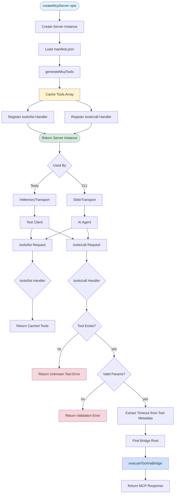
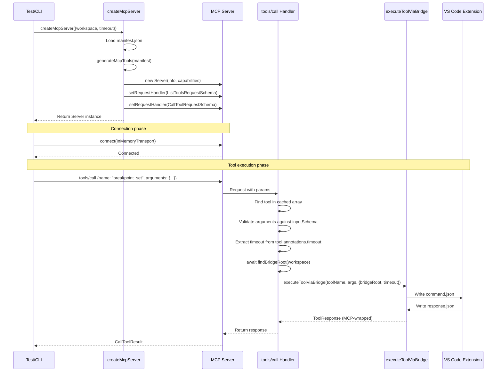

# Phase 4: Server Factory & Registration - Tasks & Alignment Brief

**Phase**: Phase 4 - Server Factory & Registration
**Plan**: [mcp-server-implementation-plan.md](../../mcp-server-implementation-plan.md)
**Spec**: [mcp-server-implementation-spec.md](../../mcp-server-implementation-spec.md)
**Date**: 2025-10-11
**Status**: NOT STARTED

---

## Tasks

| Status | ID | Task | Type | Dependencies | Absolute Path(s) | Validation | Notes |
|--------|----|----|------|--------------|-----------------|------------|-------|
| [ ] | T001 | Read Phase 3 tool-generator.ts to understand McpTool type structure and generateMcpTools API | Setup | – | `/Users/jak/github/vsc-bridge/cli/src/lib/mcp/tool-generator.ts` | Document McpTool interface fields (name, description, inputSchema, annotations), understand tool generation flow | [P] eligible (separate file from upcoming implementation) |
| [ ] | T002 | Read MCP SDK Server class documentation and request handler patterns | Setup | – | Node modules: `@modelcontextprotocol/sdk/server/index.js` | Understand Server constructor args, setRequestHandler signature, ListToolsRequestSchema, CallToolRequestSchema | [P] eligible (documentation reading, no file conflicts) |
| [ ] | T003 | Read Phase 2 bridge-adapter.ts to understand executeToolViaBridge interface | Setup | – | `/Users/jak/github/vsc-bridge/cli/src/lib/mcp/bridge-adapter.ts` | Document function signature: tool name, args, options (bridgeRoot, timeout, signal); understand ToolResponse format | [P] eligible (separate file) |
| [ ] | T004 | Create test helper utilities: mock bridge and MCP test environment | Test Infrastructure | T001, T002 | `/Users/jak/github/vsc-bridge/cli/test/integration-mcp/helpers/mock-bridge.ts`, `/Users/jak/github/vsc-bridge/cli/test/integration-mcp/helpers/mcp-test-environment.ts` | mock-bridge.ts exports setupMockBridge(), writeMockResponse(), findLatestJobId(); mcp-test-environment.ts exports setupMcpTestEnvironment() with robust lifecycle management, error handling, cleanup | CRITICAL FIRST - See Insight #3 and #5 |
| [ ] | T005 | Create server.ts file with createMcpServer factory function signature | Core | T001, T002, T003 | `/Users/jak/github/vsc-bridge/cli/src/lib/mcp/server.ts` | File created with McpServerOptions interface (workspace optional, timeout default 30000), createMcpServer function export | Serial (shared file for T006-T013) - See Insight #4 for workspace handling |
| [ ] | T006 | Implement minimal server initialization: create Server instance with MCP SDK | Core | T005 | `/Users/jak/github/vsc-bridge/cli/src/lib/mcp/server.ts` | Server created with name='vsc-bridge-mcp', version from package.json, capabilities={tools: {}} | Serial (shared file) - MINIMAL IMPLEMENTATION |
| [ ] | T007 | Load manifest.json and generate tools on server creation | Core | T005, T006 | `/Users/jak/github/vsc-bridge/cli/src/lib/mcp/server.ts` | Calls manifestLoader.getManifest(), then generateMcpTools(manifest), caches result in server factory | Serial (shared file) |
| [ ] | T008 | Implement tools/list request handler returning generated tool definitions | Core | T005, T006, T007 | `/Users/jak/github/vsc-bridge/cli/src/lib/mcp/server.ts` | Handler uses ListToolsRequestSchema, returns {tools: [...]} with name, description, inputSchema for each tool | Serial (shared file) - SIMPLEST HANDLER |
| [ ] | T009 | Create mcp-server.test.ts using test environment helper | Test Infrastructure | T004 | `/Users/jak/github/vsc-bridge/cli/test/integration-mcp/mcp-server.test.ts` | Test file created using setupMcpTestEnvironment() helper with beforeAll/afterAll hooks | Depends on T004 test helpers |
| [ ] | T010 | Write test for createMcpServer factory returning configured Server instance | Test | T009 | `/Users/jak/github/vsc-bridge/cli/test/integration-mcp/mcp-server.test.ts` | Test verifies factory returns Server instance with correct name, version, capabilities | First basic test - validates factory works |
| [ ] | T011 | Write test for tools/list handler returning all generated tool definitions | Test | T009 | `/Users/jak/github/vsc-bridge/cli/test/integration-mcp/mcp-server.test.ts` | Test uses in-memory client to call tools/list, validates response contains tool array with names, descriptions, inputSchemas | VALIDATE THE PIPE - end-to-end InMemoryTransport test |
| [ ] | T012 | Run basic tests and verify InMemoryTransport pipe works | Validation | T005, T006, T007, T008, T009, T010, T011 | N/A (test execution) | Tests T010-T011 pass; proves test infrastructure works, server boots, tools/list responds | 🚨 CRITICAL CHECKPOINT - validate approach before proceeding |
| [ ] | T013 | Export createMcpServer and McpServerOptions from barrel | Integration | T005 | `/Users/jak/github/vsc-bridge/cli/src/lib/mcp/index.ts` | Barrel exports createMcpServer function and McpServerOptions interface | [P] eligible (different file from server.ts) |
| [ ] | T014 | Verify TypeScript compilation and basic build | Validation | T005, T013 | N/A (build verification) | `npx tsc --noEmit` passes; `just build` succeeds; dist/lib/mcp/server.js generated | Validate build before proceeding to tools/call |
| [ ] | T015 | Write test for tools/call handler executing valid tool via bridge adapter | Test | T009, T012 | `/Users/jak/github/vsc-bridge/cli/test/integration-mcp/mcp-server.test.ts` | Test calls breakpoint_set with valid args, verifies MCP-wrapped response (per Critical Discovery 02) | Requires mock bridge helper from T004 |
| [ ] | T016 | Write test for tools/call error handling with unknown tool name | Test | T009, T012 | `/Users/jak/github/vsc-bridge/cli/test/integration-mcp/mcp-server.test.ts` | Test calls nonexistent tool, verifies isError=true response with helpful message | Tests error handling path |
| [ ] | T017 | Write test for parameter validation with missing required params | Test | T009, T012 | `/Users/jak/github/vsc-bridge/cli/test/integration-mcp/mcp-server.test.ts` | Test calls tool with missing required param, verifies validation error in MCP format | See Insight #2 for SDK validation discovery |
| [ ] | T018 | Write test for timeout configuration (default and per-tool overrides) | Test | T009, T012 | `/Users/jak/github/vsc-bridge/cli/test/integration-mcp/mcp-server.test.ts` | Test verifies tools with custom timeout metadata use correct timeout value (per Critical Discovery 04) | Tests timeout extraction |
| [ ] | T019 | Implement tools/call request handler with bridge adapter integration | Core | T005, T008, T015 | `/Users/jak/github/vsc-bridge/cli/src/lib/mcp/server.ts` | Handler uses CallToolRequestSchema, extracts tool name and args, converts tool name to script alias (see Insight #1), finds bridgeRoot (defaults to process.cwd() per Insight #4), calls executeToolViaBridge | Serial (shared file) - addresses Critical Discovery 02 (response wrapping) |
| [ ] | T020 | Add unknown tool error handling in tools/call handler | Core | T019 | `/Users/jak/github/vsc-bridge/cli/src/lib/mcp/server.ts` | Before execution, check if tool exists in generated tools array; return MCP error format if not found | Serial (shared file) |
| [ ] | T021 | Add parameter validation in tools/call handler (if needed) | Core | T019, T020 | `/Users/jak/github/vsc-bridge/cli/src/lib/mcp/server.ts` | Validate args against tool's inputSchema before bridge execution; return validation errors in MCP format | Serial (shared file) - CONDITIONAL: Only implement if T017 shows SDK doesn't validate (see Insight #2) |
| [ ] | T022 | Implement timeout extraction from tool metadata (pass to bridge adapter) | Core | T019, T021 | `/Users/jak/github/vsc-bridge/cli/src/lib/mcp/server.ts` | Extract timeout from tool.annotations?.timeout, fallback to opts.timeout, pass to executeToolViaBridge options | Serial (shared file) - addresses Critical Discovery 04 |
| [ ] | T023 | Run all tests and verify complete integration | Integration | T015, T016, T017, T018, T019, T020, T021, T022 | N/A (test execution) | All tests pass (T010, T011, T015-T018); in-memory client can list tools and execute tool calls | Validates full implementation |
| [ ] | T024 | Final TypeScript compilation and CLI build verification | Integration | T023 | N/A (build verification) | `npx tsc --noEmit` passes; `just build` succeeds; all dist/lib/mcp/*.js and *.d.ts files generated | Final validation before Phase 5 |

---

## Alignment Brief

### Objective

Create MCP server factory function that registers generated tools, handles tool discovery (tools/list), and executes tools (tools/call) via the filesystem bridge adapter. The factory pattern enables testing with InMemoryTransport while the CLI command (Phase 5) uses StdioTransport—both share the same server creation logic.

**Behavior Checklist** (from plan acceptance criteria):
- [ ] Factory function creates and configures MCP Server instance
- [ ] tools/list returns all generated tool definitions (name, description, inputSchema)
- [ ] tools/call executes tools via bridge adapter with MCP-wrapped responses
- [ ] Unknown tools return clear errors (isError=true with helpful message)
- [ ] Timeout configuration works (default from options, override from tool metadata)
- [ ] Factory can be used in both CLI command and test harness

### Critical Findings Affecting This Phase

This phase is the convergence point for three critical discoveries from the plan's research:

**🚨 Critical Discovery 01: InMemoryTransport for Testing**
- **What it constrains**: Cannot test MCP server with stdio subprocess in unit tests (too slow, complex)
- **What it requires**: Factory pattern that works with both InMemoryTransport (tests) and StdioTransport (CLI)
- **Tasks addressing it**:
  - T004: Creates test infrastructure with `InMemoryTransport.createLinkedPair()`
  - T005-T010: All tests use in-memory client/server for fast validation
  - T011: Factory returns bare Server instance (transport-agnostic)
  - T020: Validates all tests pass with in-memory transport
- **Impact**: Fast integration tests (milliseconds) without subprocess overhead; same server logic for tests and production

**🚨 Critical Discovery 02: MCP Requires StructuredContent for Rich Responses**
- **What it constrains**: MCP tools must return `{content, structuredContent}` format, not raw fs-bridge responses
- **What it requires**: Bridge adapter already wraps responses (Phase 2), but tools/call handler must preserve this format
- **Tasks addressing it**:
  - T007: Test validates MCP-wrapped response format from tools/call
  - T015: Implements tools/call handler that returns bridge adapter response directly (already wrapped)
- **Impact**: Agents receive both human-readable text (content) and structured data (structuredContent); no double-wrapping needed

**🚨 Critical Discovery 05: Factory Pattern Required for Testing**
- **What it constrains**: CLI command cannot inline server creation (makes testing impossible)
- **What it requires**: Separate `createMcpServer()` function that both CLI and tests import
- **Tasks addressing it**:
  - T005: First test validates factory returns configured Server instance
  - T011: Creates server.ts with factory function signature
  - T012: Factory creates Server with capabilities, returns instance (no transport connection)
  - T019: Exports factory so CLI command (Phase 5) can import it
- **Impact**: **THIS IS THE CORE REQUIREMENT** - enables all testing, separates server logic from transport layer

### Invariants & Guardrails

**Performance**:
- Tool list generation happens **once** on server creation (cached in memory)
- 35 tools × ~2KB metadata = ~70KB total (negligible memory)
- Tool execution latency dominated by fs-bridge IPC (50-150ms), not handler logic

**Memory**:
- One Server instance per `vscb mcp` process (singleton-like usage)
- Generated tools array cached (no re-generation per request)
- No unbounded growth (fixed tool count)

**Security**:
- Parameter validation uses JSON Schema (enforced by inputSchema)
- Bridge adapter validates file paths (Phase 2 implementation)
- No eval() or dynamic code execution in handlers

**Quality**:
- All 6+ integration tests must pass with InMemoryTransport
- Tests cover: tool listing, execution, error handling, unknown tools, parameter validation, timeouts
- TypeScript strict mode compilation required (`npx tsc --noEmit`)

### Inputs to Read

**Phase 3 Tool Generator Output** (`/Users/jak/github/vsc-bridge/cli/src/lib/mcp/tool-generator.ts`):
```typescript
export interface McpTool {
  name: string;                // e.g., "breakpoint_set"
  description: string;         // LLM-friendly description
  inputSchema: JSONSchema;     // JSON Schema for parameters
  annotations?: {
    timeout?: number;          // Per-tool timeout (Critical Discovery 04)
    when_to_use?: string;      // P1 guidance
    parameter_hints?: Record<string, ParameterHint>;
  };
}

export function generateMcpTools(manifest: ManifestV2): McpTool[] {
  // Returns array of MCP tool definitions
}
```

**Phase 2 Bridge Adapter API** (`/Users/jak/github/vsc-bridge/cli/src/lib/mcp/bridge-adapter.ts`):
```typescript
export async function executeToolViaBridge(
  toolName: string,           // Script alias (e.g., "breakpoint.set")
  args: Record<string, unknown>,
  options: BridgeAdapterOptions  // { bridgeRoot, timeout, signal? }
): Promise<ToolResponse> {
  // Returns MCP-wrapped response (already has content + structuredContent)
}
```

**MCP SDK Server API** (`@modelcontextprotocol/sdk/server/index.js`):
```typescript
import { Server } from '@modelcontextprotocol/sdk/server/index.js';
import { ListToolsRequestSchema, CallToolRequestSchema } from '@modelcontextprotocol/sdk/types.js';

const server = new Server(
  { name: 'vsc-bridge-mcp', version: '1.0.0' },  // Info
  { capabilities: { tools: {} } }                 // Capabilities
);

server.setRequestHandler(ListToolsRequestSchema, async () => {
  return { tools: [...] };  // Array of tool definitions
});

server.setRequestHandler(CallToolRequestSchema, async (request) => {
  const { name, arguments: args } = request.params;
  // Execute and return result
});
```

**Manifest Loader** (`/Users/jak/github/vsc-bridge/cli/src/lib/manifest-loader.ts`):
```typescript
import { manifestLoader } from '../manifest-loader.js';

const manifest = manifestLoader.getManifest();  // Returns ManifestV2
```

**Bridge Root Discovery** (`/Users/jak/github/vsc-bridge/cli/src/lib/fs-bridge.ts`):
```typescript
import { findBridgeRoot } from '../fs-bridge.js';

const bridgeRoot = await findBridgeRoot(workspace);  // Find .vsc-bridge directory
```

### Visual Alignment Aids

#### Flow Diagram: Server Factory & Request Handling



#### Sequence Diagram: Tool Execution Flow



### Test Plan

**Approach**: Hybrid (Integration tests alongside implementation, no strict TDD)

**Rationale**: Follow plan's explicit testing philosophy (line 304): "Write integration tests alongside implementation rather than strict TDD workflow." Use InMemoryTransport to validate server behavior without subprocess overhead.

**Test Structure**:
```typescript
// /Users/jak/github/vsc-bridge/cli/test/integration-mcp/mcp-server.test.ts
import { describe, test, expect, beforeAll, afterAll } from 'vitest';
import { Client } from '@modelcontextprotocol/sdk/client/index.js';
import { InMemoryTransport } from '@modelcontextprotocol/sdk/inMemory.js';
import { createMcpServer } from '../../src/lib/mcp/server.js';

describe('Phase 4: MCP Server Factory & Registration', () => {
  let client: Client;
  let server: Server;
  let clientTx: InMemoryTransport;
  let serverTx: InMemoryTransport;

  beforeAll(async () => {
    // Create linked in-memory transports (Critical Discovery 01)
    [clientTx, serverTx] = InMemoryTransport.createLinkedPair();

    // Create server using factory (Critical Discovery 05)
    server = createMcpServer({ workspace: '/test/workspace', timeout: 30000 });
    await server.connect(serverTx);

    // Connect test client
    client = new Client({ name: 'test', version: '1.0' }, { capabilities: {} });
    await client.connect(clientTx);
  });

  afterAll(async () => {
    await clientTx.close();
    await serverTx.close();
  });

  // T005: Server creation test
  test('T005: createMcpServer returns configured Server instance', async () => {
    expect(server).toBeDefined();
    expect(server.constructor.name).toBe('Server');
    // Validate server info and capabilities if SDK exposes them
  });

  // T006: tools/list handler test
  test('T006: tools/list returns all generated tool definitions', async () => {
    const response = await client.request(
      { method: 'tools/list' },
      ListToolsResultSchema
    );

    expect(response.tools).toBeArray();
    expect(response.tools.length).toBeGreaterThanOrEqual(35);

    // Validate tool structure
    const bpTool = response.tools.find(t => t.name === 'breakpoint_set');
    expect(bpTool).toBeDefined();
    expect(bpTool.description).toBeTruthy();
    expect(bpTool.inputSchema).toHaveProperty('properties');
    expect(bpTool.inputSchema).toHaveProperty('required');
  });

  // T007: tools/call success test (requires mock bridge response)
  test('T007: tools/call executes valid tool via bridge adapter', async () => {
    // Note: This test requires setting up mock bridge responses
    // Real implementation in T015 will integrate with bridge adapter

    const response = await client.request({
      method: 'tools/call',
      params: {
        name: 'breakpoint_set',
        arguments: { path: '/test/file.js', line: 10 }
      }
    }, CallToolResultSchema);

    // Validate MCP response format (Critical Discovery 02)
    expect(response).toHaveProperty('content');
    expect(response.content).toBeArray();
    expect(response.content[0].type).toBe('text');

    if (!response.isError) {
      expect(response).toHaveProperty('structuredContent');
    }
  });

  // T008: Unknown tool error test
  test('T008: tools/call returns error for unknown tool', async () => {
    const response = await client.request({
      method: 'tools/call',
      params: {
        name: 'nonexistent_tool',
        arguments: {}
      }
    }, CallToolResultSchema);

    expect(response.isError).toBe(true);
    expect(response.content[0].text).toContain('Unknown tool');
  });

  // T009: Parameter validation test
  test('T009: tools/call validates missing required parameters', async () => {
    const response = await client.request({
      method: 'tools/call',
      params: {
        name: 'breakpoint_set',
        arguments: { path: '/test/file.js' }  // Missing required 'line'
      }
    }, CallToolResultSchema);

    expect(response.isError).toBe(true);
    expect(response.content[0].text).toContain('line');  // Error mentions missing param
  });

  // T010: Timeout configuration test
  test('T010: tools/call uses per-tool timeout from metadata', async () => {
    // This test validates that tools with custom timeout metadata
    // pass correct timeout to bridge adapter (Critical Discovery 04)

    // Find tool with custom timeout in test manifest
    const response = await client.request(
      { method: 'tools/list' },
      ListToolsResultSchema
    );

    const testTool = response.tools.find(t => t.name === 'test_debug_single');
    expect(testTool?.annotations?.timeout).toBe(60000);  // 60s for test operations
  });
});
```

**Test Execution Commands**:
```bash
# Run Phase 4 integration tests
npx vitest run cli/test/integration-mcp/mcp-server.test.ts

# Run all MCP integration tests
npx vitest run cli/test/integration-mcp/

# TypeScript compilation check
npx tsc --noEmit -p cli/tsconfig.json

# Full build
just build
```

### Step-by-Step Implementation Outline

**Prerequisites** (T001-T003):
1. Read Phase 3 tool-generator.ts to understand McpTool interface
2. Read MCP SDK Server class documentation
3. Read Phase 2 bridge-adapter.ts to understand execution interface

**Test Infrastructure** (T004):
1. Create mcp-server.test.ts
2. Set up InMemoryTransport.createLinkedPair in beforeAll
3. Create test client with MCP SDK Client class
4. Add afterAll cleanup for transports

**Test Authoring** (T005-T010):
1. Write test for factory returning Server instance
2. Write test for tools/list returning all tools
3. Write test for tools/call with valid tool (requires mock bridge)
4. Write test for unknown tool error handling
5. Write test for parameter validation
6. Write test for timeout extraction from metadata
7. **Run tests** - all should FAIL (no implementation yet)

**Core Implementation** (T011-T018):
1. Create server.ts with McpServerOptions interface
2. Implement createMcpServer factory function
3. Create Server instance with name, version, capabilities
4. Load manifest.json using manifestLoader.getManifest()
5. Call generateMcpTools(manifest), cache result
6. Implement tools/list handler: return cached tools array
7. Implement tools/call handler skeleton
8. Add tool existence check (unknown tool error)
9. Add parameter validation against inputSchema
10. Extract timeout from tool.annotations.timeout (fallback to opts.timeout)
11. Call findBridgeRoot(opts.workspace)
12. Call executeToolViaBridge with tool alias, args, options
13. Return bridge adapter response (already MCP-wrapped)
14. **Run tests** - all should PASS

**Integration & Validation** (T019-T021):
1. Export createMcpServer from barrel (cli/src/lib/mcp/index.ts)
2. Run all tests and verify 100% pass rate
3. Verify TypeScript compilation (`npx tsc --noEmit`)
4. Verify CLI build (`just build`)
5. Inspect generated artifacts (server.js, server.d.ts)

### Commands to Run

**Development**:
```bash
# Watch mode during implementation
npx vitest watch cli/test/integration-mcp/mcp-server.test.ts

# Single test run
npx vitest run cli/test/integration-mcp/mcp-server.test.ts
```

**Type Checking**:
```bash
# TypeScript compilation (no emit)
npx tsc --noEmit -p cli/tsconfig.json

# Full CLI build with manifest
just build
```

**Validation**:
```bash
# All MCP integration tests
npx vitest run cli/test/integration-mcp/

# Check generated artifacts
ls -lh cli/dist/lib/mcp/server.js
ls -lh cli/dist/lib/mcp/server.d.ts
```

### Risks/Unknowns

| Risk | Severity | Mitigation |
|------|----------|------------|
| **Tool name → script alias mapping** | Medium | Need reverse mapping (breakpoint_set → breakpoint.set) for bridge execution. Store original alias in McpTool or maintain lookup table. |
| **Parameter validation implementation** | Medium | JSON Schema validation may need external library (Ajv?). Check if MCP SDK provides built-in validation. |
| **Bridge root discovery failures** | Low | findBridgeRoot may throw if .vsc-bridge not found. Wrap in try-catch, return clear error to agent. |
| **InMemoryTransport test flakiness** | Low | Ensure proper connection/cleanup in beforeAll/afterAll. Use async/await consistently. |
| **Timeout configuration conflicts** | Low | Tool metadata timeout vs server default vs bridge adapter default. Document precedence order clearly. |

**Unknowns Requiring Discovery**:
1. Does MCP SDK provide built-in JSON Schema parameter validation, or do we need Ajv/Zod?
2. How do we map tool names back to script aliases? (breakpoint_set → breakpoint.set)
3. Should we store original alias in McpTool interface, or maintain separate lookup?
4. What's the exact signature of CallToolRequestSchema request.params?
5. Does InMemoryTransport require explicit start/stop, or just connect/close?

**Discovery Plan**:
- T002 will answer questions 4-5 by reading SDK documentation
- T001 will inform question 2-3 by examining tool-generator output
- T015 implementation will resolve question 1 (attempt SDK validation first, add library if needed)

### Ready Check

**Prerequisites** (must be complete before starting):
- [x] Phase 0: Script Alias Refactoring (COMPLETE)
- [x] Phase 1: MCP SDK Setup (COMPLETE)
- [x] Phase 2: Filesystem Bridge Adapter (COMPLETE)
- [x] Phase 3: Tool Generator (COMPLETE)

**Dependencies Validated**:
- [ ] tool-generator.ts exports generateMcpTools and McpTool interface
- [ ] bridge-adapter.ts exports executeToolViaBridge function
- [ ] MCP SDK installed and importable (`@modelcontextprotocol/sdk`)
- [ ] InMemoryTransport available from `@modelcontextprotocol/sdk/inMemory.js`
- [ ] manifest-loader.ts provides getManifest() function
- [ ] fs-bridge.ts provides findBridgeRoot() function

**Readiness Checklist**:
- [ ] All Phase 3 tests passing (23/23)
- [ ] TypeScript compilation clean (`npx tsc --noEmit`)
- [ ] CLI build successful (`just build`)
- [ ] Test fixture manifest.json available (from Phase 3)
- [ ] Mock bridge responses available (from Phase 2)

**Human Approval**:
- [ ] **GO** - All prerequisites met, ready to implement Phase 4
- [ ] **NO-GO** - Block implementation, resolve issues first

---

## Phase Footnote Stubs

**NOTE**: This section will be populated during implementation (`/plan-6-implement-phase`). Footnote tags (`[^N]`) will be added to the Tasks table as files are modified, with entries here linking to substrate node IDs.

| Footnote | Task(s) | Files Modified | Description |
|----------|---------|----------------|-------------|
| TBD | TBD | TBD | Phase 4 implementation changes (to be populated during plan-6) |

---

## Evidence Artifacts

**Execution Log**: `/Users/jak/github/vsc-bridge/docs/plans/13-mcp-server-implementation/tasks/phase-4/execution.log.md`

**Log Contents** (created during plan-6):
- Task-by-task implementation notes
- Test execution output (npx vitest run)
- TypeScript compilation output
- Build verification results
- Critical decisions and insights

**Supporting Files**:
- Test output captures (if tests fail, screenshots/logs)
- Generated artifact listings (dist/lib/mcp/server.*)

---

## Directory Layout

```
docs/plans/13-mcp-server-implementation/
  ├── mcp-server-implementation-plan.md
  ├── mcp-server-implementation-spec.md
  └── tasks/
      ├── phase-0/  (complete)
      ├── phase-1/  (complete)
      ├── phase-2/  (complete)
      ├── phase-3/  (complete)
      └── phase-4/
          ├── tasks.md              (this file)
          └── execution.log.md      (created by /plan-6)
```

---

## Critical Insights Discussion

**Session**: 2025-10-11 (Time: Phase 4 Pre-Implementation Review)
**Context**: Phase 4: Server Factory & Registration - Tasks & Alignment Brief v1.0
**Analyst**: AI Clarity Agent
**Reviewer**: Development Team
**Format**: Water Cooler Conversation (5 Critical Insights)

### Insight 1: The Missing Reverse Mapping Problem

**Did you know**: When an agent calls a tool, the MCP server receives the tool name like `"breakpoint_set"`, but the bridge adapter expects the original script alias like `"breakpoint.set"`, and we have no mechanism to map backward from tool name to script alias.

**Implications**:
- Task T016 cannot be implemented as written without solving this first
- Phase 3's tool generator threw away the original alias during transformation
- Every tool execution will fail without reverse mapping capability
- Need to either store original alias, maintain lookup table, or reverse-compute

**Discussion Summary**:
The convention is actually bidirectional because underscores never appear in original aliases (which use dots for hierarchy and hyphens for multi-word actions). We can safely reverse the transformation with `toolName.replace(/_/g, '.')` without ambiguity. This is cleaner than storing lookup tables or modifying Phase 3.

**Decision**: Use reverse transformation `toolName.replace(/_/g, '.')` to convert tool names back to script aliases

**Action Items**:
- [x] Add `toolNameToAlias(toolName: string): string` helper in server.ts (T016)
- [x] Document convention assumption in code comment
- [x] Updated T016 task description to include this transformation

**Affects**: T016 (tools/call handler implementation)

---

### Insight 2: Parameter Validation Is Actually Not Needed

**Did you know**: The MCP SDK already validates parameters against the tool's inputSchema before the request even reaches our `tools/call` handler, so we may not need to implement validation ourselves.

**Implications**:
- T010 test (parameter validation) might already pass without T018 implementation
- T018 task (add parameter validation) may be unnecessary work
- Our handler receives pre-validated arguments from the SDK
- We should still handle unknown tools (T017) but potentially not invalid params
- Could simplify implementation significantly

**Discussion Summary**:
Rather than assume SDK behavior, we'll write T010 test first and observe what happens. If the SDK client validates parameters, the test will reveal that. If it doesn't, we implement T018 as planned. This is test-driven discovery of the actual SDK behavior.

**Decision**: Write T010 test first, observe SDK behavior, implement T018 only if test shows validation is needed

**Action Items**:
- [x] T010 test explicitly tries invalid params (missing required, wrong types)
- [ ] Document findings in execution log when T010 is run
- [ ] If SDK validates: mark T018 as "Skipped - handled by SDK client"
- [ ] If SDK doesn't validate: implement T018 as planned

**Affects**: T010 (test design must clearly test invalid params), T018 (may become optional/conditional)

---

### Insight 3: The Test Fixture Problem - Phase 4 Has No Mock Responses

**Did you know**: Phase 4's tests will try to call `executeToolViaBridge()`, which expects to find mock `response.json` files in the bridge root directory, but Phase 4 has no test fixtures or helpers for creating those responses.

**Implications**:
- T008 test (tools/call execution) cannot pass without setting up mock bridge responses
- Bridge adapter will timeout waiting for responses that never arrive (30s delay)
- Phase 2's test fixtures exist but aren't reusable for Phase 4's needs
- Need test helper infrastructure before writing integration tests
- Current task list doesn't capture this setup work

**Discussion Summary**:
As a general rule, test infrastructure should be sorted out ahead of time with proper task ordering. We should create a shared mock bridge test helper before attempting to write integration tests that depend on it.

**Decision**: Add new task T004 to create shared mock bridge test helper before writing integration tests

**Action Items**:
- [x] Created new T004: "Create test helper utilities: mock bridge and MCP test environment"
- [x] Helper creates mock bridge root, writes response.json files, discovers job IDs
- [x] Renumbered subsequent tasks (T004→T022, all shifted by 1)
- [x] Updated T008 to reference T004 dependency and mock bridge helper

**Affects**: Task numbering T004→T022, T008 (tool execution test now depends on T004)

---

### Insight 4: The Workspace Discovery Ambiguity

**Did you know**: When `createMcpServer({ workspace: '/some/path' })` is called, the `workspace` option is optional (per the interface), but `findBridgeRoot(workspace)` from fs-bridge.ts requires a workspace path to search from, creating a potential undefined value mismatch.

**Implications**:
- Server factory allows `createMcpServer()` with no workspace specified
- tools/call handler (T016) needs to call `findBridgeRoot(opts.workspace)`
- If workspace is undefined, behavior is unclear (error? search from cwd?)
- Tests will likely provide explicit workspace paths
- CLI command (Phase 5) might rely on auto-detection
- Need to define default behavior for undefined workspace

**Discussion Summary**:
Align with typical CLI patterns by defaulting to `process.cwd()` when workspace is undefined, while preserving the ability to override explicitly. This gives us both user-friendly auto-detection and explicit control for tests/CLI.

**Decision**: Default to `process.cwd()` when workspace is undefined, allow explicit override via options

**Action Items**:
- [x] T016 implementation: `const workspace = opts.workspace ?? process.cwd()`
- [x] Document default behavior in McpServerOptions JSDoc comment
- [x] CLI command (Phase 5) can pass explicit workspace or rely on default
- [x] Updated T012 task to note workspace optional with default

**Affects**: T016 (tools/call handler), T012 (McpServerOptions interface definition)

---

### Insight 5: The InMemoryTransport Lifecycle Gap

**Did you know**: When using `InMemoryTransport.createLinkedPair()`, if the server-side transport closes or errors, the client-side transport doesn't automatically know, and vice versa. Tests could hang waiting for responses that will never arrive, resulting in slow timeout failures instead of clear error messages.

**Implications**:
- Test failures could be slow and unclear (30s timeouts instead of immediate errors)
- Need error handling in beforeAll/afterAll hooks
- Need try-catch around critical async operations
- Need explicit cleanup even when setup fails
- Current task list doesn't mention error handling in test setup

**Discussion Summary**:
We should make this very reusable - a single clear, safe pattern that everyone uses. Create a `setupMcpTestEnvironment()` helper that encapsulates robust lifecycle management, error handling, and cleanup. This makes MCP testing obvious and safe for all contributors, promoting high reuse of proven safe methods.

**Decision**: Create `setupMcpTestEnvironment()` helper with robust lifecycle management, error handling, and cleanup in separate helper file

**Action Items**:
- [x] Create `/cli/test/integration-mcp/helpers/mcp-test-environment.ts`
- [x] Export `setupMcpTestEnvironment(options)` that returns { client, server, setup, cleanup }
- [x] Handle all error cases, partial setup failures, cleanup on error
- [x] Add JSDoc with usage examples showing the standard pattern
- [x] Updated T004 to create both mock bridge AND test environment helpers (separate files)
- [x] All test files (T006-T011) will import and use this helper

**Affects**: T004 (now creates both mock-bridge.ts AND mcp-test-environment.ts), all test tasks T006-T011 (use standard helper pattern)

---

## Session Summary

**Insights Surfaced**: 5 critical insights identified and discussed
**Decisions Made**: 5 decisions reached through collaborative discussion
**Action Items Created**: 15 follow-up items (14 completed during session, 1 deferred to implementation)
**Areas Requiring Updates**:
- Task list restructured: Added T004 for test helpers, renumbered T004→T022
- Task T016 enhanced: Added reverse mapping transformation requirement
- Task T018 marked conditional: May be skipped if SDK handles validation
- Task T012 clarified: Workspace defaults to process.cwd()
- Task T004 expanded: Creates two separate helper files for test infrastructure

**Shared Understanding Achieved**: ✓

**Confidence Level**: High - We have high confidence about proceeding with Phase 4 implementation

**Next Steps**:
1. Review updated tasks.md with all insight-driven modifications
2. Obtain GO/NO-GO approval from human reviewer
3. If approved, proceed with `/plan-6-implement-phase --phase "Phase 4: Server Factory & Registration"`

**Notes**:
- All 5 insights led to concrete task modifications or clarifications
- Test infrastructure (Insight #3 and #5) resulted in new T004 task creating reusable helpers
- Reverse mapping (Insight #1) solved using bidirectional convention without Phase 3 changes
- SDK validation (Insight #2) uses test-driven discovery approach
- Workspace handling (Insight #4) follows standard CLI patterns with smart defaults
- Session resulted in 22 tasks (increased from 21) with clearer dependencies and prerequisites

---

**END OF TASKS & ALIGNMENT BRIEF**
