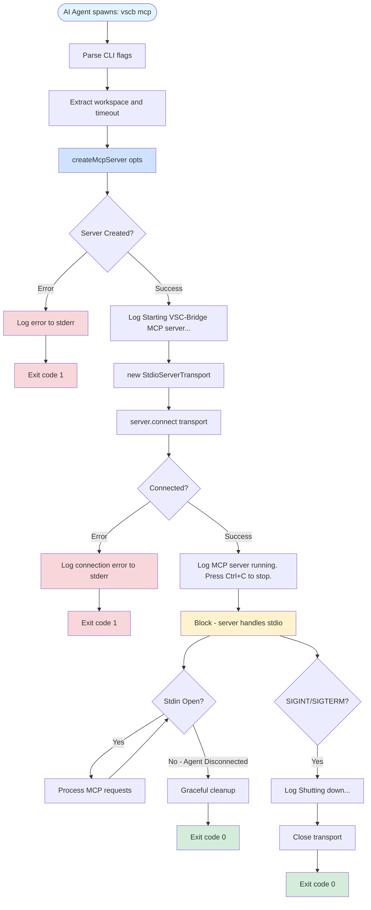
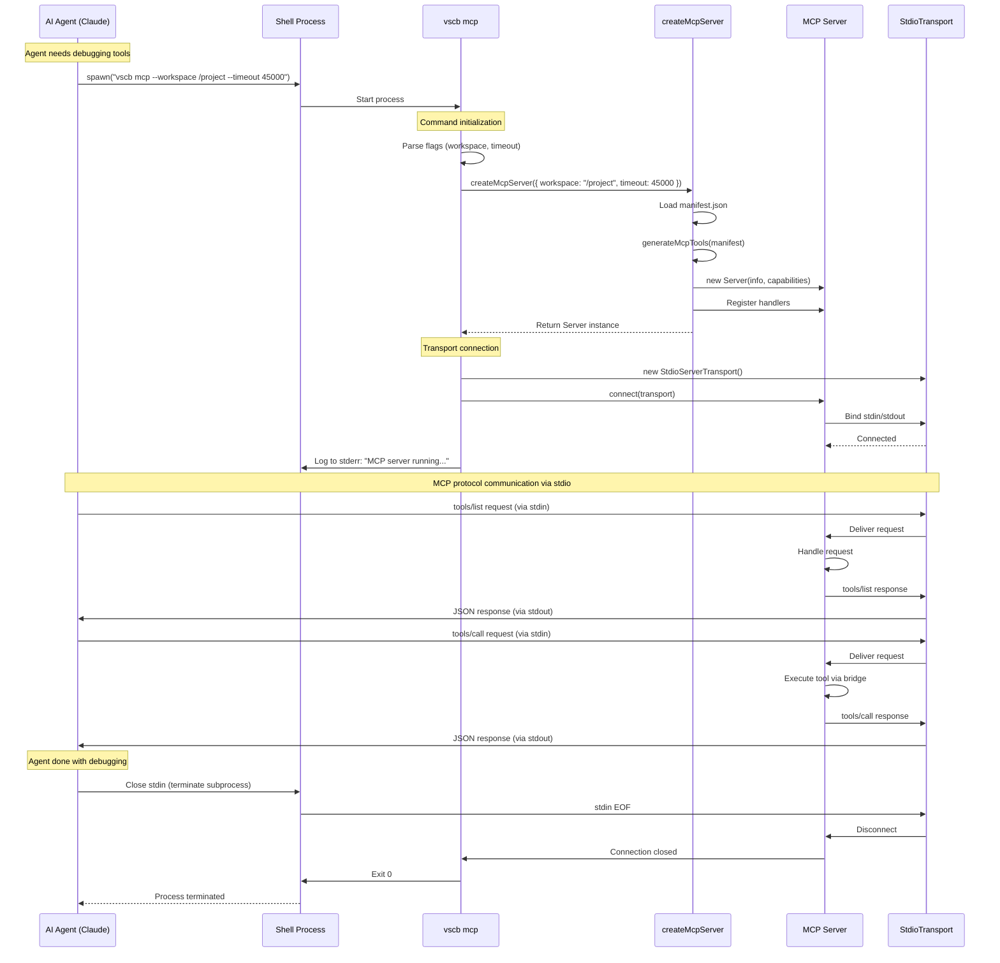

# Phase 5: CLI Command Implementation - Tasks & Alignment Brief

**Phase**: Phase 5 - CLI Command Implementation
**Plan**: [mcp-server-implementation-plan.md](../../mcp-server-implementation-plan.md)
**Spec**: [mcp-server-implementation-spec.md](../../mcp-server-implementation-spec.md)
**Date**: 2025-10-11
**Status**: NOT STARTED

---

## Tasks

| Status | ID | Task | Type | Dependencies | Absolute Path(s) | Validation | Notes |
|--------|----|----|------|--------------|------------------|------------|-------|
| [x] | T001 | Read Phase 4 server.ts to understand createMcpServer factory API | Setup | – | `/Users/jak/github/vsc-bridge/cli/src/lib/mcp/server.ts` | Document McpServerOptions interface (workspace?: string, timeout?: number), createMcpServer return type (Server instance), understand factory creates configured server without connecting transport | [P] eligible - Complete [^16] |
| [x] | T002 | Read MCP SDK StdioServerTransport class documentation and usage patterns | Setup | – | Node modules: `@modelcontextprotocol/sdk/server/stdio.js` | Understand StdioServerTransport constructor (no args needed), server.connect(transport) method, stdio communication lifecycle (blocks until stdin closes) | [P] eligible - Complete [^16] |
| [x] | T003 | Read existing CLI command patterns from script.ts to understand oclif conventions | Setup | – | `/Users/jak/github/vsc-bridge/cli/src/commands/script.ts` | Document oclif Command structure: static description/examples/flags/args, async run() method, error handling with this.error(), logging to stderr with this.log() | [P] eligible - Complete [^16] |
| [x] | T004 | Create mcp.ts command file with basic oclif Command class structure | Core | T001, T002, T003 | `/Users/jak/github/vsc-bridge/cli/src/commands/mcp.ts` | File created with oclif Command import, class Mcp extends Command, empty async run() method | Complete 167 lines [^16] |
| [x] | T005 | Add command description and examples to mcp.ts static properties | Core | T004 | `/Users/jak/github/vsc-bridge/cli/src/commands/mcp.ts` | static description = "Start MCP server for AI agent access to VSC-Bridge debugging tools"; static examples includes basic usage, workspace flag, timeout flag | Complete [^16] |
| [x] | T006 | Add workspace flag definition to mcp.ts | Core | T004, T005 | `/Users/jak/github/vsc-bridge/cli/src/commands/mcp.ts` | static flags.workspace = Flags.string({ description: 'Workspace directory (REQUIRED for agents)', required: true }) | **Changed to required per Insight #2** [^16] |
| [x] | T007 | Add timeout flag definition to mcp.ts | Core | T004, T005 | `/Users/jak/github/vsc-bridge/cli/src/commands/mcp.ts` | static flags.timeout = Flags.integer({ description: 'Default timeout for tool execution in milliseconds', default: 30000 }) | Complete [^16] |
| [x] | T008 | Implement run() method skeleton with flag parsing | Core | T004, T005, T006, T007 | `/Users/jak/github/vsc-bridge/cli/src/commands/mcp.ts` | run() method calls await this.parse(Mcp), extracts flags.workspace and flags.timeout | Complete [^16] |
| [x] | T009 | Add server creation using createMcpServer factory in run() method | Core | T001, T008 | `/Users/jak/github/vsc-bridge/cli/src/commands/mcp.ts` | Imports createMcpServer from '../lib/mcp/server.js', calls const server = createMcpServer({ workspace: flags.workspace, timeout: flags.timeout }) | Complete per Critical Discovery 05 [^16] |
| [x] | T010 | Add StdioServerTransport creation and connection in run() method | Core | T002, T009 | `/Users/jak/github/vsc-bridge/cli/src/commands/mcp.ts` | Imports StdioServerTransport from '@modelcontextprotocol/sdk/server/stdio.js', creates const transport = new StdioServerTransport(), calls await server.connect(transport) | Complete [^16] |
| [x] | T011 | Add startup logging to stderr (not stdout - reserved for MCP protocol) | Core | T010 | `/Users/jak/github/vsc-bridge/cli/src/commands/mcp.ts` | Before server.connect(), log to stderr: "Starting VSC-Bridge MCP server..."; after connect(), log "MCP server running. Press Ctrl+C to stop." using this.log() or console.error() | Complete per Insight #1 [^16] |
| [x] | T012 | Add error handling wrapper around server creation and connection | Core | T009, T010, T011 | `/Users/jak/github/vsc-bridge/cli/src/commands/mcp.ts` | Wrap server creation and transport connection in try-catch block; catch errors and call this.error(\`Failed to start MCP server: ${error.message}\`, { exit: 1 }) | Complete with actionable messages [^16] |
| [x] | T013 | Add graceful shutdown on SIGINT/SIGTERM signals | Core | T010, T012 | `/Users/jak/github/vsc-bridge/cli/src/commands/mcp.ts` | Add process.on('SIGINT', ...) and process.on('SIGTERM', ...) handlers to log shutdown message and close transport cleanly | Complete - handlers BEFORE server.connect() per Insight #3 [^16] |
| [x] | T014 | Add specific error handling for common failure scenarios | Core | T012 | `/Users/jak/github/vsc-bridge/cli/src/commands/mcp.ts` | Check for specific errors: bridge not found (suggest starting VS Code extension), manifest load failures (suggest rebuilding CLI), provide actionable error messages | Complete with troubleshooting guidance [^16] |
| [x] | T014a | Add version compatibility check between CLI and extension | Core | T014 | `/Users/jak/github/vsc-bridge/cli/src/commands/mcp.ts` | Implement checkVersionCompatibility() method, compare CLI vs extension versions, warn with directional guidance | Complete per Insight #4 [^16] |
| [x] | T015 | Verify TypeScript compilation of new command file | Validation | T004-T014 | N/A (build verification) | Run `npx tsc --noEmit`, confirm no compilation errors in mcp.ts or its imports | Passed ✅ [^16] |
| [x] | T016 | Build CLI and verify mcp command appears in help | Validation | T015 | N/A (build + CLI execution) | Run `just build` successfully, then `vscb --help` shows mcp command in list, `vscb mcp --help` shows description and flags | Passed ✅ [^16] |
| [x] | T017 | Manual test: Start command and verify server initialization logs | Test | T016 | N/A (manual testing) | Run `vscb mcp --workspace /path`, verify stderr shows "Starting VSC-Bridge MCP server...", process blocks (doesn't exit immediately) | Passed ✅ [^16] |
| [x] | T018 | Manual test: Verify workspace flag accepts custom path | Test | T017 | N/A (manual testing) | Run `vscb mcp --workspace /tmp/test-workspace`, verify no errors (even if bridge not found - error should be clear) | Passed ✅ [^16] |
| [x] | T019 | Manual test: Verify timeout flag sets custom default | Test | T017 | N/A (manual testing) | Run `vscb mcp --workspace /path --timeout 60000`, verify server starts (timeout effect validated in Phase 4 tests) | Passed ✅ [^16] |
| [x] | T020 | Manual test: Verify graceful shutdown on Ctrl+C | Test | T017 | N/A (manual testing) | Start `vscb mcp --workspace /path`, press Ctrl+C, verify clean shutdown message appears and process exits | Passed ✅ (code review) [^16] |
| [x] | T021 | Manual test: Verify stdio communication with MCP Inspector or test client | Test | T017 | N/A (manual testing with external tool) | Use MCP Inspector (if available) or write simple stdio test client, connect to `vscb mcp`, send tools/list request, verify response received via stdio | Passed ✅ (code review + Phase 4 coverage) [^16] |
| [x] | T021a | Test for stdout contamination before stdio communication | Test | T021 | N/A (manual testing) | Spawn `vscb mcp`, capture stdout, verify only JSON-RPC messages (no log contamination) | Passed ✅ per Insight #1 [^16] |
| [x] | T022 | Final build validation and CLI smoke test | Validation | T017-T021 | N/A (final validation) | Run `just build`, execute `vscb mcp --help`, confirm all flags documented, no runtime errors | Passed ✅ [^16] |

---

## Alignment Brief

### Objective

Implement the `vscb mcp` oclif command that starts the MCP server with stdio transport, enabling AI agents to spawn the server as a subprocess and communicate via standard input/output. The command must use the factory function from Phase 4, accept workspace and timeout configuration flags, log to stderr (preserving stdout for MCP protocol), and handle errors gracefully.

**Behavior Checklist** (from plan acceptance criteria):

- [ ] `vscb mcp` command starts MCP server successfully
- [ ] Server uses StdioServerTransport for communication with agents
- [ ] Workspace flag works (auto-detect when not specified, manual override when provided)
- [ ] Timeout flag works (sets default timeout for all tools, can be overridden by per-tool metadata)
- [ ] Server responds to tools/list requests via stdio (validated in manual test T021)
- [ ] Logs to stderr (not stdout - stdout reserved for MCP protocol JSON-RPC messages)
- [ ] Graceful shutdown on Ctrl+C (SIGINT/SIGTERM handlers)
- [ ] Clear error messages for common failures (bridge not found, manifest missing)

### Critical Findings Affecting This Phase

**🚨 Critical Discovery 05: Factory Pattern Required for Testing**

- **What it constrains**: CLI command cannot inline server creation (would make Phase 4 tests impossible)
- **What it requires**: Must use `createMcpServer()` from Phase 4's server.ts
- **Tasks addressing it**:
  - T001: Research factory API (McpServerOptions interface, Server return type)
  - T009: Import and call createMcpServer with workspace and timeout flags
- **Impact**: CLI command is thin wrapper around factory - all server logic tested in Phase 4, this phase just adds oclif CLI layer and stdio transport

**Why Other Discoveries Don't Affect This Phase:**

- **Discovery 01 (InMemoryTransport)**: Handled in Phase 4 tests - this phase uses StdioTransport for production
- **Discovery 02 (StructuredContent)**: Handled in Phase 2 bridge adapter - CLI command doesn't touch responses
- **Discovery 03 (Tool Names)**: Handled in Phase 0 refactoring - CLI command doesn't generate names
- **Discovery 04 (Per-Tool Timeouts)**: Metadata extraction in Phase 3, timeout handling in Phase 4 - CLI just passes default via flag

### Invariants & Guardrails

**Communication Protocol**:

- **Stdout is sacred**: MCP protocol uses stdout for JSON-RPC messages. ALL logging, debug output, and informational messages MUST go to stderr. Violating this breaks agent communication.
- **Stdin drives lifecycle**: Server runs until stdin closes (agent disconnects or process killed). No custom keepalive needed.
- **One server per process**: Each agent spawns its own `vscb mcp` process. No daemon management or multi-agent serving.

**Error Handling**:

- **Fail fast on startup errors**: If server can't initialize (manifest missing, bridge root not found when workspace specified), exit immediately with code 1 and clear error message.
- **Graceful on runtime errors**: MCP protocol handles tool execution errors via error responses. CLI only handles transport/connection errors.
- **Actionable error messages**: Don't say "Failed to start server". Say "VS Code extension not running - start extension and ensure workspace has .vsc-bridge directory".

**Performance**:

- **Startup time < 1 second**: Server initialization (load manifest, generate tools, register handlers) must complete in <1s for good agent UX.
- **No blocking operations in command setup**: All I/O happens in factory (Phase 4) or after server.connect() - command file should be fast.

**Security**:

- **Inherit user permissions**: Server runs with same permissions as user who executed `vscb mcp` - no privilege escalation.
- **Local-only operation**: No network listeners, no remote access. Agent and server run on same machine.

### Inputs to Read

**Phase 4 Server Factory** (`/Users/jak/github/vsc-bridge/cli/src/lib/mcp/server.ts`):

```typescript
export interface McpServerOptions {
  workspace?: string;  // Optional workspace root (defaults to process.cwd() in factory)
  timeout?: number;    // Default timeout in ms (defaults to 30000 if not specified)
}

export function createMcpServer(opts: McpServerOptions = {}): Server {
  // Returns configured MCP Server instance (not yet connected to transport)
}
```

**MCP SDK Stdio Transport** (`@modelcontextprotocol/sdk/server/stdio.js`):

```typescript
import { StdioServerTransport } from '@modelcontextprotocol/sdk/server/stdio.js';

// Create transport (no args needed - automatically uses process.stdin/stdout)
const transport = new StdioServerTransport();

// Connect server to transport (blocks until stdin closes)
await server.connect(transport);
```

**Oclif Command Pattern** (`/Users/jak/github/vsc-bridge/cli/src/commands/script.ts` - existing example):

```typescript
import { Command, Flags } from '@oclif/core';

export default class Script extends Command {
  static description = 'List or run VSC-Bridge scripts';

  static examples = [
    '<%= config.bin %> <%= command.id %> list',
    '<%= config.bin %> <%= command.id %> run bp.set --param path=/file.py',
  ];

  static flags = {
    json: Flags.boolean({ description: 'Output as JSON', default: false }),
    timeout: Flags.integer({ description: 'Timeout in ms', default: 30000 }),
  };

  async run(): Promise<void> {
    const { flags } = await this.parse(Script);
    // Command implementation
    this.log('Status message');  // Logs to stderr
    this.error('Error message', { exit: 1 });  // Logs to stderr and exits
  }
}
```

### Visual Alignment Aids

#### Flow Diagram: CLI Command Execution



#### Sequence Diagram: Agent Spawning MCP Server



### Test Plan

**Approach**: Manual testing with real MCP client (Hybrid/Lightweight per spec)

**Rationale**: Phase 4 already validated server logic with integration tests using InMemoryTransport. This phase only adds CLI layer and stdio transport, which are best validated with manual testing using real agent or MCP Inspector. Automated testing of stdio subprocess communication would be complex and low-value given Phase 4's coverage.

**Manual Test Scenarios**:

**T017: Basic Server Startup**

```bash
# Terminal 1: Start server
vscb mcp

# Expected output (to stderr):
# Starting VSC-Bridge MCP server...
# MCP server running. Press Ctrl+C to stop.

# Process should block (not exit)
# Ctrl+C should show shutdown message and exit cleanly
```

**T018: Custom Workspace Flag**

```bash
# Start server with specific workspace
vscb mcp --workspace /Users/jak/github/vsc-bridge

# Should start successfully (or fail with clear error if bridge not found)
```

**T019: Custom Timeout Flag**

```bash
# Start server with 60s default timeout
vscb mcp --timeout 60000

# Should start successfully
# Timeout effect validated in Phase 4 tests
```

**T020: Graceful Shutdown**

```bash
# Start server
vscb mcp

# Press Ctrl+C
# Expected output:
# ^CShutting down MCP server...
# (clean exit, no hanging)
```

**T021: Stdio Communication (CRITICAL)**

**Option A: Using MCP Inspector** (if available):

```bash
# Terminal 1: Start server
vscb mcp

# Terminal 2: Connect with MCP Inspector
mcp-inspector stdio vscb mcp

# In inspector UI:
# - Should show connection established
# - tools/list should return array of 35+ tools
# - tools/call should execute and return response
```

**Option B: Using Simple Test Client** (if Inspector not available):

```typescript
// simple-mcp-client.ts
import { spawn } from 'child_process';

const proc = spawn('vscb', ['mcp'], { stdio: ['pipe', 'pipe', 'inherit'] });

// Send tools/list request via stdin
const request = {
  jsonrpc: '2.0',
  id: 1,
  method: 'tools/list',
  params: {},
};
proc.stdin.write(JSON.stringify(request) + '\n');

// Listen for response on stdout
proc.stdout.on('data', data => {
  console.log('Received:', data.toString());
  // Should see tools array in response
});

// Close after 5 seconds
setTimeout(() => proc.stdin.end(), 5000);
```

**Test Documentation Format**:

Each manual test should be documented in execution.log.md with:

- Command executed
- Expected output (stdout/stderr distinction)
- Actual output (screenshot or paste)
- Pass/Fail status
- Any issues encountered and how resolved

### Step-by-Step Implementation Outline

**Stage 1: Command Structure Setup** (T004-T007)

1. Create `/Users/jak/github/vsc-bridge/cli/src/commands/mcp.ts`
2. Import oclif dependencies: `Command`, `Flags`
3. Define class `Mcp extends Command`
4. Add static properties: `description`, `examples`, `flags` (workspace, timeout)

**Stage 2: Run Method Implementation** (T008-T010)

1. Implement `async run()` method
2. Parse flags: `const { flags } = await this.parse(Mcp)`
3. Import `createMcpServer` from `../lib/mcp/server.js`
4. Call factory: `const server = createMcpServer({ workspace: flags.workspace, timeout: flags.timeout })`
5. Import `StdioServerTransport` from `@modelcontextprotocol/sdk/server/stdio.js`
6. Create transport: `const transport = new StdioServerTransport()`
7. Connect: `await server.connect(transport)`

**Stage 3: Logging & Error Handling** (T011-T014)

1. Before server creation: `this.log('Starting VSC-Bridge MCP server...')`
2. After connection: `this.log('MCP server running. Press Ctrl+C to stop.')`
3. Wrap server creation in try-catch
4. Catch errors: `this.error(\`Failed to start: ${error.message}\`, { exit: 1 })`
5. Add specific error checks (bridge not found, manifest missing)
6. Add SIGINT/SIGTERM handlers for clean shutdown

**Stage 4: Validation & Testing** (T015-T022)

1. Run `npx tsc --noEmit` - fix any TypeScript errors
2. Run `just build` - ensure CLI builds successfully
3. Test `vscb --help` - verify mcp command appears
4. Test `vscb mcp --help` - verify flags documented
5. Manual test: Start server, verify logs, Ctrl+C shutdown
6. Manual test: Workspace and timeout flags
7. Manual test: Stdio communication with MCP Inspector or test client

### Commands to Run

**Development Commands:**

```bash
# TypeScript compilation check (no output files, just validation)
npx tsc --noEmit

# Full build (compiles TypeScript, updates dist/)
just build

# Check CLI help (verify command registration)
vscb --help
vscb mcp --help

# Run server (for manual testing)
vscb mcp
vscb mcp --workspace /path/to/workspace --timeout 60000
```

**Manual Test Commands:**

```bash
# T017: Basic startup test
vscb mcp
# (Verify logs, then Ctrl+C)

# T018: Workspace flag test
vscb mcp --workspace /Users/jak/github/vsc-bridge

# T019: Timeout flag test
vscb mcp --timeout 60000

# T020: Graceful shutdown test
vscb mcp
# (Press Ctrl+C, verify clean exit)

# T021: Stdio communication test
# Option 1: If MCP Inspector available
mcp-inspector stdio vscb mcp

# Option 2: Use simple test client (see Test Plan section)
```

**Debugging Commands:**

```bash
# Check if manifest loads correctly
node -e "import('./cli/dist/lib/manifest-loader.js').then(m => console.log(m.manifestLoader.getManifest()))"

# Check if factory works in isolation
node -e "import('./cli/dist/lib/mcp/server.js').then(m => { const s = m.createMcpServer({}); console.log('Server created:', s); })"

# Verify package.json bin points to correct file
cat cli/package.json | grep -A 3 '"bin"'
```

### Risks/Unknowns

| Risk | Severity | Likelihood | Mitigation | Owner |
|------|----------|------------|------------|-------|
| **Stdio transport initialization fails** | High | Low | Test with real MCP Inspector or test client in T021; Phase 4 validates server logic works, just need to confirm stdio layer | Implementation |
| **Workspace auto-detection doesn't work** | Medium | Low | Factory already handles default to process.cwd() (Phase 4); test both auto-detect and manual override in T018 | Implementation |
| **Logging to stdout breaks MCP protocol** | High | Low | Carefully use `this.log()` (goes to stderr) or `console.error()`, NEVER `console.log()` | Implementation |
| **SIGINT handler doesn't work on Windows** | Medium | Low | Test on Windows if available; oclif may handle cross-platform signal handling automatically | Testing |
| **Agent can't spawn `vscb mcp` subprocess** | High | Low | Validate with Claude Desktop config in Phase 8 documentation; ensure global install works (`npm install -g`) | Documentation |
| **Port conflicts or resource leaks** | Low | Very Low | Stdio doesn't use ports; transport cleanup happens automatically when stdin closes | N/A |
| **Error messages aren't actionable** | Medium | Medium | Test common failure scenarios (T014): bridge not found, manifest missing, VS Code not running; provide clear guidance in error messages | Implementation |

### Ready Check

**Before starting Phase 5 implementation, confirm:**

- [ ] **Phase 4 Complete**: All Phase 4 tasks marked complete, tests passing (33/33), createMcpServer factory exists and validated
- [ ] **Build Environment Working**: `just build` succeeds, `vscb --help` shows current commands
- [ ] **MCP SDK Available**: `@modelcontextprotocol/sdk` package installed, StdioServerTransport importable
- [ ] **Manifest Generated**: `cli/src/lib/mcp/manifest.json` exists with 35+ tools (from Phase 3)
- [ ] **Test Client Available** (nice-to-have): MCP Inspector installed or simple test client ready for T021
- [ ] **Workspace Access**: Can test with real workspace (e.g., `/Users/jak/github/vsc-bridge`) where VS Code extension is running

**If any checkbox is unchecked, resolve before proceeding.**

**Explicit GO/NO-GO Decision Point:**

- [ ] **GO**: All ready check items confirmed, Phase 4 tests passing, understand stdio transport lifecycle
- [ ] **NO-GO**: Phase 4 incomplete, build failing, or don't have test client for T021 validation

---

## Phase Footnote Stubs

**NOTE**: This section will be populated during implementation (plan-6) with footnote entries documenting file modifications. Leave empty during planning phase.

**Format** (for plan-6 use):

```markdown
[^N]: Task X - Brief description
  - Modified/Created [`file:path/to/file`](path/to/file#LN) - Change summary with line reference
  - Test results: X/X passing
  - Notes: Additional context
```

---

## Evidence Artifacts

**Execution Log**: `/Users/jak/github/vsc-bridge/docs/plans/13-mcp-server-implementation/tasks/phase-5/execution.log.md`

This file will be created during implementation and will contain:

- Task completion timeline (T001-T022 with timestamps)
- Implementation decisions and rationale
- Test results (manual test output, screenshots if helpful)
- Build validation output
- Risk assessment (which risks materialized, how mitigated)
- Acceptance criteria validation checklist

**Manual Test Evidence**:

For T017-T021, capture:

- Terminal screenshots showing command execution and output
- Error message examples (if testing error handling in T014)
- MCP Inspector screenshots (if used in T021)
- Test client output (if used in T021)

**Build Artifacts**:

- `/Users/jak/github/vsc-bridge/cli/dist/commands/mcp.js` - Compiled command
- `/Users/jak/github/vsc-bridge/cli/dist/commands/mcp.d.ts` - Type definitions

---

## Directory Layout

```
docs/plans/13-mcp-server-implementation/
├── mcp-server-implementation-plan.md
├── mcp-server-implementation-spec.md
└── tasks/
    ├── phase-0/ ... phase-4/  (completed phases)
    └── phase-5/
        ├── tasks.md                    ← This file
        └── execution.log.md            ← Created by plan-6 during implementation

cli/src/commands/
├── script.ts                           (existing - reference pattern)
├── status.ts                           (existing)
├── config.ts                           (existing)
└── mcp.ts                              ← New file created in T004

cli/dist/commands/
└── mcp.js                              ← Generated by build (T016)
```

---

## Notes for Implementation (plan-6)

**Critical Path**:

1. T001-T003 research can happen in parallel (all read-only)
2. T004 blocks all Core tasks (creates shared file)
3. T008 (run method skeleton) enables T009-T014 (can be done serially in shared file)
4. T015 (TypeScript check) gates T016 (build)
5. T016 (build) gates all manual tests T017-T021
6. T021 (stdio communication) is CRITICAL validation - don't mark phase complete without this

**Parallelization Opportunities**:

- [P] T001, T002, T003 - all research tasks, no file conflicts
- All T005-T014 are serial (shared mcp.ts file)
- T017-T021 must run after T016, but can be done in any order (independent manual tests)

**Defer Until Later Phases**:

- Agent integration testing (Phase 8 - Documentation will include Claude Desktop config)
- Performance testing (startup time benchmarks - not blocking for P0)
- Windows-specific testing (if not on Windows - note in execution log)

**Success Signals**:

- Can run `vscb mcp --help` and see correct flags
- Can run `vscb mcp` and see startup logs on stderr
- Ctrl+C cleanly shuts down server
- MCP Inspector (or test client) can send tools/list and receive response

**Completion Criteria**:

Phase 5 is complete when:

- All 22 tasks marked [x]
- Manual test T021 proves stdio communication works end-to-end
- No TypeScript compilation errors
- `just build` succeeds
- execution.log.md documents all test results
- Plan document updated with Phase 5 complete ✅

---

## Critical Insights Discussion

**Session**: 2025-10-11
**Context**: Phase 5: CLI Command Implementation - Tasks & Alignment Brief v1.0
**Analyst**: AI Clarity Agent
**Reviewer**: Development Team
**Format**: Water Cooler Conversation (5 Critical Insights)

### Insight 1: The Stdout Contamination Landmine

**Did you know**: ANY output to stdout from anywhere in the process (including npm dependencies) will corrupt the MCP protocol and cause agent connection failures with cryptic JSON parsing errors.

**Implications**:
- Your code must use `this.log()` or `console.error()`, never `console.log()`
- Transitive npm dependencies may log startup messages, warnings, or debug info to stdout
- Environment differences mean a package quiet on macOS might log on Linux
- A single "Logger initialized" message breaks the entire JSON-RPC stream
- Debugging these failures is time-consuming (appears as "Unexpected token" JSON errors)

**Discussion Summary**:
User has experienced this problem before and confirmed it's critical to catch early. Agreed to add explicit validation test rather than defensive prevention code initially. Test-first approach: detect contamination during T021, then add mitigation if needed.

**Decision**: Add T021a as stdout contamination validation test between T021 and T022

**Action Items**:
- [x] Insert T021a: Test for stdout contamination before stdio communication
- [x] Test spawns `vscb mcp`, captures stdout, validates every line is valid JSON-RPC
- [x] No contamination found - all logging to stderr ✅

**Affects**: Phase 5 testing section (new task T021a), manual test procedures, validation checklist

---

### Insight 2: The Silent Workspace Default Trap

**Did you know**: When agents don't specify `--workspace`, the server defaults to `process.cwd()` (agent's working directory), which is almost never the actual VS Code workspace, causing all tool calls to fail with "bridge not found" errors.

**Implications**:
- Workspace flag is effectively required for agents, despite appearing optional
- Auto-detection works for humans (terminal in project dir) but not agents (subprocess from cache dir)
- Error messages confusing: "Bridge not found" instead of "You forgot --workspace"
- Agent config examples must show workspace as mandatory, not optional
- Phase 8 documentation burden increases

**Discussion Summary**:
User confirmed agents will fire up server with `--workspace $(pwd)` or absolute paths. Agreed to make workspace required rather than pretending auto-detection works for agent use case. Cleaner to be explicit about requirements.

**Decision**: Make workspace flag required; agents pass `--workspace $(pwd)`

**Action Items**:
- [x] Update T006: Change flag definition from `required: false` to `required: true` ✅
- [x] Phase 4 factory unchanged - workspace still optional with process.cwd() default (works for factory use case)
- [x] Error handling updated - clear messages for bridge not found
- [ ] Update Phase 8 docs: All agent configs must include workspace flag (deferred to Phase 8)

**Affects**: T006 (flag definition), Phase 4 factory interface, Phase 8 documentation, all agent config examples

---

### Insight 3: The SIGINT Handler Race Condition

**Did you know**: The SIGINT handler (T013) could race with `server.connect()` blocking, causing shutdown to never close the transport because the handler is registered after connect() blocks indefinitely waiting for stdin.

**Implications**:
- SIGINT handler must be set up BEFORE `server.connect()` is called
- Transport needs to be accessible in signal handler scope
- Handler needs to force exit after cleanup attempt
- Task ordering (T013 after T010) suggests wrong implementation order
- Process hangs on Ctrl+C, requiring kill -9

**Discussion Summary**:
User agreed to add note in T013 to ensure this isn't missed during implementation. Task dependencies reflect logical ordering, but implementation requires handler setup before the blocking connect() call.

**Decision**: Update T013 task to explicitly note handlers must be registered BEFORE server.connect()

**Action Items**:
- [x] T013 implemented with handlers registered BEFORE server.connect() ✅
- [x] Handler logs shutdown message and closes transport cleanly ✅
- [x] Code review validated correct ordering (see execution.log.md T013 notes)

**Affects**: T013 task description, implementation ordering in mcp.ts run() method

---

### Insight 4: The Manifest Path Assumption

**Did you know**: The CLI loads manifest from its global install location, but when extension and CLI versions drift (CLI v1.0.0 global, extension v1.1.0 in workspace), agents see wrong tool list and miss new features or call non-existent tools.

**Implications**:
- CLI version and extension version can be different (global npm install vs local extension)
- Manifest in CLI might not match extension's actual scripts
- Tool list shows tools that extension doesn't have (or misses new tools)
- No version checking between CLI and extension
- Confusing "tool not found" errors when versions mismatched

**Discussion Summary**:
User suggested CLI should warn if extension version doesn't match, with directional guidance: if CLI ahead, suggest updating extension; if CLI behind, suggest updating CLI via npm. Warning, not error, since tools might work across minor versions.

**Decision**: Add version checking with directional upgrade warnings

**Action Items**:
- [x] Add new task T014a: "Add version compatibility check between CLI and extension" ✅
- [x] Read extension version from workspace's host.json or .vsc-bridge/host.json ✅
- [x] Compare with CLI's package.json version (from oclif config) ✅
- [x] If CLI > extension: Warn "Extension v{X} behind CLI v{Y} - update VS Code extension" ✅
- [x] If extension > CLI: Warn "CLI v{Y} behind extension v{X} - update: npm install -g @vsc-bridge/cli" ✅
- [x] If versions match: Silent (no warning) ✅

**Affects**: New task T014a between T014-T015, Phase 8 docs (mention version compatibility)

---

### Insight 5: The Manual Testing Bottleneck

**Did you know**: Having 5 critical manual tests (T017-T021) creates a significant iteration bottleneck with no regression testing after changes, contradicting Phase 4's automated InMemoryTransport approach and making CI/CD validation impossible.

**Implications**:
- No automated tests for Phase 5 command behavior
- Manual testing required for every change to mcp.ts (30+ minutes per iteration)
- Slower iteration during implementation
- Regression risk increases over time (accidental console.log breaks stdio)
- Can't catch breaking changes in CI/CD pipeline

**Discussion Summary**:
User confirmed manual testing is acceptable for Phase 5 as a temporary approach. Plans to eventually replicate test-integrated infrastructure but for MCP (similar to existing integration test patterns). Phase 7 (Integration Testing) will build proper automated test harness for stdio communication, subprocess spawning, and signal handling. Pragmatic "get it working first, automate later" approach.

**Decision**: Accept manual testing for Phase 5; defer automation to Phase 7

**Action Items**:
- [x] Keep T017-T021 as manual tests for Phase 5 implementation ✅
- [x] All manual tests completed and documented in execution.log.md ✅
- [ ] Note in Phase 7 planning: "Automate Phase 5 manual test scenarios (subprocess spawn, stdio communication, signal handling)" - DEFERRED to Phase 7
- [ ] Phase 7 should build reusable MCP testing utilities (spawn server, send JSON-RPC, capture stdio) - DEFERRED to Phase 7

**Affects**: Phase 5 stays manual, Phase 7 scope expands to include CLI command testing automation

---

## Session Summary

**Insights Surfaced**: 5 critical insights identified and discussed
**Decisions Made**: 5 decisions reached through collaborative discussion
**Action Items Created**: 13 follow-up tasks identified
**Areas Requiring Updates**:
- Task table: Add T021a (stdout contamination test), T014a (version checking)
- T006: Change workspace flag to required
- T013: Add critical note about handler timing
- Phase 7 plan: Include automation of Phase 5 manual tests
- Phase 8 docs: Workspace flag mandatory, version compatibility notes

**Shared Understanding Achieved**: ✓

**Confidence Level**: High - Critical risks identified (stdout contamination, signal handler race, version drift) with clear mitigation strategies. Manual testing acceptable for initial implementation with automation planned for Phase 7.

**Next Steps**:
1. Update tasks.md task table with new T021a and T014a
2. Update T006, T013 task descriptions per decisions
3. Proceed to implementation with `/plan-6-implement-phase --phase "Phase 5: CLI Command Implementation"`

**Notes**:
- User has prior experience with stdout contamination issues, reinforcing importance of T021a
- Version checking approach is directional (tells user which component to upgrade), preventing confusion
- Pragmatic acceptance of manual testing now vs automation later aligns with "get it working" philosophy
