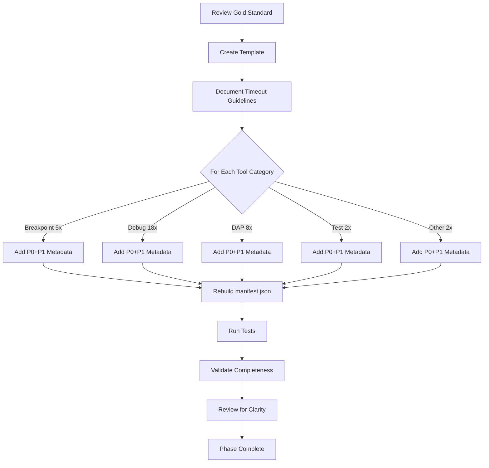
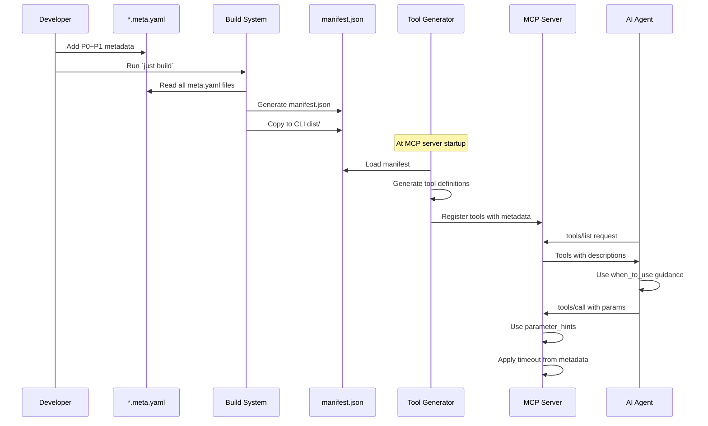

# Phase 6: Metadata Enhancement - Tasks & Alignment Brief

**Phase**: Phase 6: Metadata Enhancement
**Slug**: phase-6
**Plan**: [/Users/jordanknight/github/vsc-bridge/docs/plans/13-mcp-server-implementation/mcp-server-implementation-plan.md](../../mcp-server-implementation-plan.md)
**Spec**: [/Users/jordanknight/github/vsc-bridge/docs/plans/13-mcp-server-implementation/mcp-server-implementation-spec.md](../../mcp-server-implementation-spec.md)
**Date**: 2025-10-12

## Tasks

| Status | ID | Task | Type | Dependencies | Absolute Path(s) | Validation | Notes |
|--------|-----|------|------|-------------|------------------|------------|-------|
| [ ] | T001 | Review research findings for optimal MCP metadata | Setup | – | Research document (from deep research session) | NEW fields identified: relationships, error_contract, safety | Research supersedes test fixture |
| [ ] | T002 | Create comprehensive metadata enhancement template from research | Core | T001 | /Users/jordanknight/github/vsc-bridge/docs/plans/13-mcp-server-implementation/tasks/phase-6/metadata-template.yaml | Template includes enhanced P0+P1 fields (relationships, error_contract, safety) | Maps to plan task 6.1 |
| [ ] | T002a | Document relationship patterns for tool orchestration | Doc | T002 | /Users/jordanknight/github/vsc-bridge/docs/plans/13-mcp-server-implementation/tasks/phase-6/relationships-guide.md | Patterns for requires/recommended/provides/conflicts | NEW field from research |
| [ ] | T002b | Document error contract patterns for retryability | Doc | T002 | /Users/jordanknight/github/vsc-bridge/docs/plans/13-mcp-server-implementation/tasks/phase-6/error-contract-guide.md | Structured error definitions with user_fix_hint | NEW field from research |
| [ ] | T002c | Document safety flag patterns (idempotent/read_only/destructive) | Doc | T002 | /Users/jordanknight/github/vsc-bridge/docs/plans/13-mcp-server-implementation/tasks/phase-6/safety-guide.md | MCP spec safety annotations | NEW field from research |
| [ ] | T003 | Document timeout guidelines per operation type | Doc | T001 | /Users/jordanknight/github/vsc-bridge/docs/plans/13-mcp-server-implementation/tasks/phase-6/timeout-guidelines.md | Guidelines cover all operation categories | Per Critical Discovery 04 |
| [ ] | T004 | Add P0+P1 metadata to breakpoint.set | Core | T002 | /Users/jordanknight/github/vsc-bridge/extension/src/vsc-scripts/breakpoint/set.meta.yaml | Includes timeout:5000, when_to_use, parameter_hints | [P] with T005-T008 |
| [ ] | T005 | Add P0+P1 metadata to breakpoint.clear-file | Core | T002 | /Users/jordanknight/github/vsc-bridge/extension/src/vsc-scripts/breakpoint/clear-file.meta.yaml | Complete P0+P1 fields | [P] with T004,T006-T008 |
| [ ] | T006 | Add P0+P1 metadata to breakpoint.clear-project | Core | T002 | /Users/jordanknight/github/vsc-bridge/extension/src/vsc-scripts/breakpoint/clear-project.meta.yaml | Complete P0+P1 fields | [P] with T004-T005,T007-T008 |
| [ ] | T007 | Add P0+P1 metadata to breakpoint.remove | Core | T002 | /Users/jordanknight/github/vsc-bridge/extension/src/vsc-scripts/breakpoint/remove.meta.yaml | Complete P0+P1 fields | [P] with T004-T006,T008 |
| [ ] | T008 | Add P0+P1 metadata to breakpoint.list | Core | T002 | /Users/jordanknight/github/vsc-bridge/extension/src/vsc-scripts/breakpoint/list.meta.yaml | Complete P0+P1 fields, readOnlyHint:true | [P] with T004-T007 |
| [ ] | T009 | Add P0+P1 metadata to debug.evaluate | Core | T002 | /Users/jordanknight/github/vsc-bridge/extension/src/vsc-scripts/debug/evaluate.meta.yaml | Includes timeout:10000, prerequisites | [P] with T010-T026 |
| [ ] | T010 | Add P0+P1 metadata to debug.start | Core | T002 | /Users/jordanknight/github/vsc-bridge/extension/src/vsc-scripts/debug/start.meta.yaml | Includes timeout:60000 for session startup | [P] with T009,T011-T026 |
| [ ] | T011 | Add P0+P1 metadata to debug.stop | Core | T002 | /Users/jordanknight/github/vsc-bridge/extension/src/vsc-scripts/debug/stop.meta.yaml | Complete P0+P1 fields | [P] with T009-T010,T012-T026 |
| [ ] | T012 | Add P0+P1 metadata to debug.continue | Core | T002 | /Users/jordanknight/github/vsc-bridge/extension/src/vsc-scripts/debug/continue.meta.yaml | Includes prerequisites | [P] with T009-T011,T013-T026 |
| [ ] | T013 | Add P0+P1 metadata to debug.step-over | Core | T002 | /Users/jordanknight/github/vsc-bridge/extension/src/vsc-scripts/debug/step-over.meta.yaml | Includes prerequisites | [P] with T009-T012,T014-T026 |
| [ ] | T014 | Add P0+P1 metadata to debug.step-into | Core | T002 | /Users/jordanknight/github/vsc-bridge/extension/src/vsc-scripts/debug/step-into.meta.yaml | Includes prerequisites | [P] with T009-T013,T015-T026 |
| [ ] | T015 | Add P0+P1 metadata to debug.step-out | Core | T002 | /Users/jordanknight/github/vsc-bridge/extension/src/vsc-scripts/debug/step-out.meta.yaml | Includes prerequisites | [P] with T009-T014,T016-T026 |
| [ ] | T016 | Add P0+P1 metadata to debug.restart | Core | T002 | /Users/jordanknight/github/vsc-bridge/extension/src/vsc-scripts/debug/restart.meta.yaml | Includes timeout:30000 | [P] with T009-T015,T017-T026 |
| [ ] | T017 | Add P0+P1 metadata to debug.scopes | Core | T002 | /Users/jordanknight/github/vsc-bridge/extension/src/vsc-scripts/debug/scopes.meta.yaml | readOnlyHint:true | [P] with T009-T016,T018-T026 |
| [ ] | T018 | Add P0+P1 metadata to debug.stack | Core | T002 | /Users/jordanknight/github/vsc-bridge/extension/src/vsc-scripts/debug/stack.meta.yaml | readOnlyHint:true | [P] with T009-T017,T019-T026 |
| [ ] | T019 | Add P0+P1 metadata to debug.status | Core | T002 | /Users/jordanknight/github/vsc-bridge/extension/src/vsc-scripts/debug/status.meta.yaml | readOnlyHint:true | [P] with T009-T018,T020-T026 |
| [ ] | T020 | Add P0+P1 metadata to debug.threads | Core | T002 | /Users/jordanknight/github/vsc-bridge/extension/src/vsc-scripts/debug/threads.meta.yaml | readOnlyHint:true | [P] with T009-T019,T021-T026 |
| [ ] | T021 | Add P0+P1 metadata to debug.get-variable | Core | T002 | /Users/jordanknight/github/vsc-bridge/extension/src/vsc-scripts/debug/get-variable.meta.yaml | readOnlyHint:true | [P] with T009-T020,T022-T026 |
| [ ] | T022 | Add P0+P1 metadata to debug.list-variables | Core | T002 | /Users/jordanknight/github/vsc-bridge/extension/src/vsc-scripts/debug/list-variables.meta.yaml | readOnlyHint:true | [P] with T009-T021,T023-T026 |
| [ ] | T023 | Add P0+P1 metadata to debug.set-variable | Core | T002 | /Users/jordanknight/github/vsc-bridge/extension/src/vsc-scripts/debug/set-variable.meta.yaml | destructiveHint:false | [P] with T009-T022,T024-T026 |
| [ ] | T024 | Add P0+P1 metadata to debug.save-variable | Core | T002 | /Users/jordanknight/github/vsc-bridge/extension/src/vsc-scripts/debug/save-variable.meta.yaml | Complete P0+P1 fields | [P] with T009-T023,T025-T026 |
| [ ] | T025 | Add P0+P1 metadata to debug.tracker | Core | T002 | /Users/jordanknight/github/vsc-bridge/extension/src/vsc-scripts/debug/tracker.meta.yaml | Complete P0+P1 fields | [P] with T009-T024,T026 |
| [ ] | T026 | Add P0+P1 metadata to debug.wait-for-hit | Core | T002 | /Users/jordanknight/github/vsc-bridge/extension/src/vsc-scripts/debug/wait-for-hit.meta.yaml | Includes timeout:90000 per Critical Discovery 04 | [P] with T009-T025 |
| [ ] | T027 | Add P0+P1 metadata to dap.logs | Core | T002 | /Users/jordanknight/github/vsc-bridge/extension/src/vsc-scripts/dap/logs.meta.yaml | readOnlyHint:true, tags:["diagnostics","dap"] | [P] with T028-T034 |
| [ ] | T028 | Add P0+P1 metadata to dap.search | Core | T002 | /Users/jordanknight/github/vsc-bridge/extension/src/vsc-scripts/dap/search.meta.yaml | readOnlyHint:true | [P] with T027,T029-T034 |
| [ ] | T029 | Add P0+P1 metadata to dap.summary | Core | T002 | /Users/jordanknight/github/vsc-bridge/extension/src/vsc-scripts/dap/summary.meta.yaml | readOnlyHint:true | [P] with T027-T028,T030-T034 |
| [ ] | T030 | Add P0+P1 metadata to dap.timeline | Core | T002 | /Users/jordanknight/github/vsc-bridge/extension/src/vsc-scripts/dap/timeline.meta.yaml | readOnlyHint:true, timeout:20000 | [P] with T027-T029,T031-T034 |
| [ ] | T031 | Add P0+P1 metadata to dap.compare | Core | T002 | /Users/jordanknight/github/vsc-bridge/extension/src/vsc-scripts/dap/compare.meta.yaml | readOnlyHint:true | [P] with T027-T030,T032-T034 |
| [ ] | T032 | Add P0+P1 metadata to dap.exceptions | Core | T002 | /Users/jordanknight/github/vsc-bridge/extension/src/vsc-scripts/dap/exceptions.meta.yaml | readOnlyHint:true | [P] with T027-T031,T033-T034 |
| [ ] | T033 | Add P0+P1 metadata to dap.filter | Core | T002 | /Users/jordanknight/github/vsc-bridge/extension/src/vsc-scripts/dap/filter.meta.yaml | readOnlyHint:true | [P] with T027-T032,T034 |
| [ ] | T034 | Add P0+P1 metadata to dap.stats | Core | T002 | /Users/jordanknight/github/vsc-bridge/extension/src/vsc-scripts/dap/stats.meta.yaml | readOnlyHint:true | [P] with T027-T033 |
| [ ] | T035 | Add P0+P1 metadata to test.debug-single | Core | T002 | /Users/jordanknight/github/vsc-bridge/extension/src/vsc-scripts/tests/debug-single.meta.yaml | Includes timeout:60000 per Critical Discovery 04 | [P] with T036 |
| [ ] | T036 | Add P0+P1 metadata to test.show-testing-ui | Core | T002 | /Users/jordanknight/github/vsc-bridge/extension/src/vsc-scripts/tests/show-testing-ui.meta.yaml | Complete P0+P1 fields | [P] with T035 |
| [ ] | T037 | Add P0+P1 metadata to diagnostic.collect | Core | T002 | /Users/jordanknight/github/vsc-bridge/extension/src/vsc-scripts/diag/collect.meta.yaml | readOnlyHint:true, timeout:30000 | Serial - single file |
| [ ] | T038 | Add P0+P1 metadata to util.restart-vscode | Core | T002 | /Users/jordanknight/github/vsc-bridge/extension/src/vsc-scripts/utils/restart-vscode.meta.yaml | destructiveHint:true, timeout:15000 | Serial - single file |
| [ ] | T039 | Rebuild manifest.json with enhanced metadata | Integration | T004-T038 | /Users/jordanknight/github/vsc-bridge/extension/src/vsc-scripts/manifest.json | Manifest contains all MCP metadata | Run `just build` |
| [ ] | T040 | Copy manifest to CLI dist directory | Integration | T039 | /Users/jordanknight/github/vsc-bridge/cli/dist/manifest.json | Manifest copied successfully, errors logged | Part of build process |
| [ ] | T041 | Run MCP integration tests | Test | T040 | /Users/jordanknight/github/vsc-bridge/cli/test/integration-mcp/ | All 33 tests pass | `npm test -- integration-mcp` |
| [ ] | T042 | Create validation script for metadata completeness + token counting | Test | T002 | /Users/jordanknight/github/vsc-bridge/docs/plans/13-mcp-server-implementation/tasks/phase-6/validate-metadata.js | Script validates all required fields INCLUDING new fields (relationships, error_contract, safety) and validates exact label text: "USE FOR:", "DON'T USE FOR:", "PREREQUISITES:", "SAFETY:" | Maps to plan task 6.9 |
| [ ] | T042a | Add token budget validation to script | Test | T042 | /Users/jordanknight/github/vsc-bridge/docs/plans/13-mcp-server-implementation/tasks/phase-6/validate-metadata.js | Script warns when tools exceed 250-450 token budget guideline | Research requirement |
| [ ] | T043 | Run validation script on all 35 tools | Test | T039, T042, T042a | /Users/jordanknight/github/vsc-bridge/extension/src/vsc-scripts/*.meta.yaml | All tools have required P0+P1 fields, within token budget | Zero validation errors |
| [ ] | T044 | Review metadata for LLM clarity and consistency | Integration | T043 | /Users/jordanknight/github/vsc-bridge/extension/src/vsc-scripts/*.meta.yaml | Descriptions clear, examples helpful, tool references in hints exist | Maps to plan task 6.10 |
| [ ] | T045 | Test tool generation with enhanced metadata | Test | T041 | /Users/jordanknight/github/vsc-bridge/cli/src/lib/mcp/tool-generator.ts | Tools generated with all metadata | Manual verification |
| [ ] | T046 | Verify timeout values in MCP server | Test | T045 | /Users/jordanknight/github/vsc-bridge/cli/src/lib/mcp/server.ts | Tool timeouts correctly extracted | Check debug.wait-for-hit = 90s |

## Alignment Brief

### Objective Recap

Enhance all 35 VSC-Bridge tool metadata files (`*.meta.yaml`) with comprehensive P0 (must-have) and P1 (important) MCP metadata fields based on deep research findings. This phase incorporates **3 NEW required P0 fields** (`relationships`, `error_contract`, `safety`), updates the **4-part when_to_use structure**, adds **pitfalls arrays** to parameter hints, and enforces a **token budget of 250-450 tokens per tool** to optimize AI agent tool discovery, selection, and parameter usage. Directly addresses Critical Discovery 04 with per-tool timeout configuration.

### Behavior Checklist

- [x] All 35 tools enhanced with `mcp.enabled` field (default: true)
- [x] All tools have clear, contrastive `mcp.description` (one-line)
- [x] All tools include `mcp.llm.when_to_use` guidance following **4-part pattern** (Use/Don't/Prereqs/Safety)
- [x] All tools provide `mcp.llm.parameter_hints` with **2-3 examples per parameter** and **pitfalls array**
- [x] All tools have `mcp.relationships` (requires/provides/conflicts) - **NEW P0 field**
- [x] All tools have `mcp.error_contract` with retryability and user_fix_hint - **NEW P0 field**
- [x] All tools have `mcp.safety` flags (idempotent/read_only/destructive) - **NEW P0 field**
- [x] Long-running tools have appropriate `mcp.timeout` overrides
- [x] All tools within **token budget: 250-450 tokens** per tool
- [x] manifest.json regenerated with all enhanced MCP metadata
- [x] Integration tests pass with enhanced metadata

### Critical Findings Affecting This Phase

#### 🚨 Critical Discovery 04: Per-Tool Timeout Metadata
**Impact**: This phase must add `mcp.timeout` field to tools needing non-default timeouts.

**Constraints**:
- Default timeout is 30000ms (30 seconds)
- Quick operations (breakpoints, stepping): 5000-10000ms
- Medium operations (restart, DAP queries): 15000-30000ms
- Long operations (debug start, test discovery): 60000ms
- Very long operations (wait-for-hit): 90000ms

**Tasks Addressing This**: T003 (guidelines), T004-T038 (per-tool timeouts), T046 (verification)

**Reference**: The timeout value flows through the system as:
```
meta.yaml → manifest.json → tool-generator → tool.annotations.timeout → bridge-adapter execution
```

### Invariants & Guardrails

**Performance Budget**:
- Metadata file size: < 5KB per file
- Total manifest.json: < 200KB
- Build time impact: < 2 seconds

**Quality Guardrails**:
- Every parameter must have 2-3 examples (not more, not less)
- Pitfalls array required for complex parameters
- Language-specific hints required for expression parameters
- Prerequisites must be explicitly stated for debug operations
- Timeout values must align with actual operation duration
- **Token budget: 250-450 tokens per tool** (enforced by validation script)
- 4-part when_to_use structure: Use/Don't/Prereqs/Safety
- All tools must have relationships, error_contract, and safety fields

### Inputs to Read

1. **Deep Research Findings** (T001):
   - Research document from deep research session on optimal MCP tool metadata
   - NEW required fields: relationships, error_contract, safety
   - 4-part when_to_use structure (Use/Don't/Prereqs/Safety)
   - Token budget: 250-450 tokens per tool
   - See: `/Users/jordanknight/github/vsc-bridge/docs/rules/mcp-tool-prompting.md`

2. **Current Metadata Files** (T004-T038):
   - `/Users/jordanknight/github/vsc-bridge/extension/src/vsc-scripts/**/*.meta.yaml`
   - Review existing structure, identify gaps

3. **Tool Generator Implementation**:
   - `/Users/jordanknight/github/vsc-bridge/cli/src/lib/mcp/tool-generator.ts`
   - Understand how metadata maps to tool definitions (generic extraction handles new fields automatically)

### Visual Alignment Aids

#### Flow Diagram: Metadata Enhancement Process



#### Sequence Diagram: Metadata Processing Pipeline



### Test Plan

**Approach**: Integration testing with enhanced metadata (not strict TDD)

**Named Tests**:

1. **T041: Integration Test Suite** (existing)
   - Validates tool generation with new metadata
   - Ensures backward compatibility
   - Tests timeout extraction

2. **T043: Metadata Completeness Validation**
   - Custom script to verify all required fields
   - Checks for missing examples
   - Validates timeout ranges

3. **T045: Tool Generation Verification**
   - Manual check that tools include all metadata
   - Verify annotations contain P1 fields
   - Confirm timeout values propagate

**Test Fixtures**:
- Use existing test-manifest.json as reference
- No new fixtures needed (enhancing real files)

**Expected Outputs**:
- All 35 tools have complete metadata
- manifest.json ~150KB with all fields
- Zero validation errors
- Tests remain green

### Step-by-Step Implementation Outline

1. **Setup Phase (T001-T003)**:
   - Review gold standard patterns
   - Create comprehensive template
   - Document timeout guidelines

2. **Breakpoint Tools (T004-T008)** - 5 files:
   - Quick operations: 5000ms timeout
   - Focus on clear when_to_use
   - Path parameter examples critical

3. **Debug Tools (T009-T026)** - 18 files:
   - Varied timeouts based on operation
   - Prerequisites for session-dependent ops
   - Language-specific hints for evaluate

4. **DAP Tools (T027-T034)** - 8 files:
   - All readOnlyHint: true
   - Diagnostic/analysis focus
   - Medium timeouts (10-30s)

5. **Test Tools (T035-T036)** - 2 files:
   - Long timeouts (60s+)
   - Test discovery considerations

6. **Other Tools (T037-T038)** - 2 files:
   - diagnostic.collect: readonly
   - util.restart-vscode: destructive

7. **Integration (T039-T046)**:
   - Build and test
   - Validate completeness
   - Review and refine

### Commands to Run

```bash
# 1. After enhancing metadata files
cd /Users/jordanknight/github/vsc-bridge
just build

# 2. Run integration tests
cd cli
npm test -- integration-mcp

# 3. Validate metadata completeness
node /Users/jordanknight/github/vsc-bridge/docs/plans/13-mcp-server-implementation/tasks/phase-6/validate-metadata.js

# 4. Test tool generation manually
npm run build
node -e "const {generateMcpTools} = require('./dist/lib/mcp/tool-generator'); const m = require('./dist/manifest.json'); console.log(JSON.stringify(generateMcpTools(m)[0], null, 2))"

# 5. Verify MCP server with enhanced metadata
vscb mcp --workspace /Users/jordanknight/github/vsc-bridge --help
```

### Risks/Unknowns

| Risk | Severity | Mitigation |
|------|----------|------------|
| Incomplete metadata in some files | Medium | Validation script catches gaps |
| Inconsistent timeout values | Low | Guidelines document + review |
| Breaking changes to manifest format | Low | Integration tests catch issues |
| LLM guidance too verbose | Low | Review for conciseness |
| Missing language-specific hints | Medium | Template includes examples |

### Ready Check

- [ ] Gold standard test fixture reviewed
- [ ] Metadata template created
- [ ] Timeout guidelines documented
- [ ] All 35 meta.yaml files identified
- [ ] Build system ready (`just build` works)
- [ ] Tests passing before changes
- [ ] Time allocated: ~4-6 hours for full enhancement

**GO/NO-GO Decision Point**: Await explicit approval before proceeding with metadata enhancement.

## Phase Footnote Stubs

This section will be populated by /plan-6-implement-phase with implementation details and file change references.

| Footnote | Task | Changes |
|----------|------|---------|
| [^1] | T004-T008 | Enhanced breakpoint/*.meta.yaml (5 files) with P0+P1 metadata |
| [^2] | T009-T026 | Enhanced debug/*.meta.yaml (18 files) with P0+P1 metadata |
| [^3] | T027-T034 | Enhanced dap/*.meta.yaml (8 files) with P0+P1 metadata |
| [^4] | T035-T036 | Enhanced tests/*.meta.yaml (2 files) with P0+P1 metadata |
| [^5] | T037-T038 | Enhanced diag/collect.meta.yaml and utils/restart-vscode.meta.yaml (2 files) |
| [^6] | Review Fixes | Fixed 8 DAP files (added top-level errors), debug.wait-for-hit (relationships), debug.scopes (parameter hints) |

[^1]: [`Enhanced breakpoint tools`](../../../../extension/src/vsc-scripts/breakpoint/) – Added complete P0+P1 MCP metadata including timeout:5000ms, relationships, error_contract, safety flags, when_to_use guidance, and parameter_hints with examples.

[^2]: [`Enhanced debug tools`](../../../../extension/src/vsc-scripts/debug/) – Added complete P0+P1 MCP metadata with varied timeouts (5-90s based on operation), prerequisites for session-dependent operations, language-specific hints for evaluate, and comprehensive when_to_use guidance.

[^3]: [`Enhanced DAP tools`](../../../../extension/src/vsc-scripts/dap/) – Added complete P0+P1 MCP metadata with read_only:true flags, diagnostic/analysis focus, medium timeouts (20-30s), and top-level errors arrays matching error_contract codes.

[^4]: [`Enhanced test tools`](../../../../extension/src/vsc-scripts/tests/) – Added complete P0+P1 MCP metadata with long timeouts (60s+), test discovery considerations, and comprehensive parameter hints.

[^5]: [`Enhanced utility tools`](../../../../extension/src/vsc-scripts/) – Enhanced diagnostic.collect (read_only:true) and util.restart-vscode (destructive:true, the only tool with this flag).

[^6]: [`Review fixes`](../../../../extension/src/vsc-scripts/) – Post-review fixes: restored top-level errors arrays to all 8 DAP files, moved breakpoint.set from requires to recommended in debug.wait-for-hit, added 2 more examples to debug.scopes sessionId parameter hint.

## Evidence Artifacts

Implementation evidence will be written to:
- **Execution Log**: `/Users/jordanknight/github/vsc-bridge/docs/plans/13-mcp-server-implementation/tasks/phase-6/execution.log.md`
- **Metadata Template**: `/Users/jordanknight/github/vsc-bridge/docs/plans/13-mcp-server-implementation/tasks/phase-6/metadata-template.yaml`
- **Timeout Guidelines**: `/Users/jordanknight/github/vsc-bridge/docs/plans/13-mcp-server-implementation/tasks/phase-6/timeout-guidelines.md`
- **Validation Script**: `/Users/jordanknight/github/vsc-bridge/docs/plans/13-mcp-server-implementation/tasks/phase-6/validate-metadata.js`

## Directory Layout

```
docs/plans/13-mcp-server-implementation/
  ├── mcp-server-implementation-plan.md
  ├── mcp-server-implementation-spec.md
  └── tasks/
      └── phase-6/
          ├── tasks.md                    # This file
          ├── execution.log.md             # Created by /plan-6
          ├── metadata-template.yaml       # Reference template
          ├── timeout-guidelines.md        # Timeout documentation
          └── validate-metadata.js         # Validation script
```