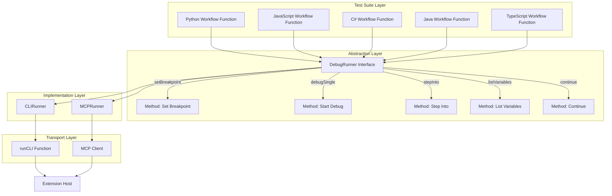
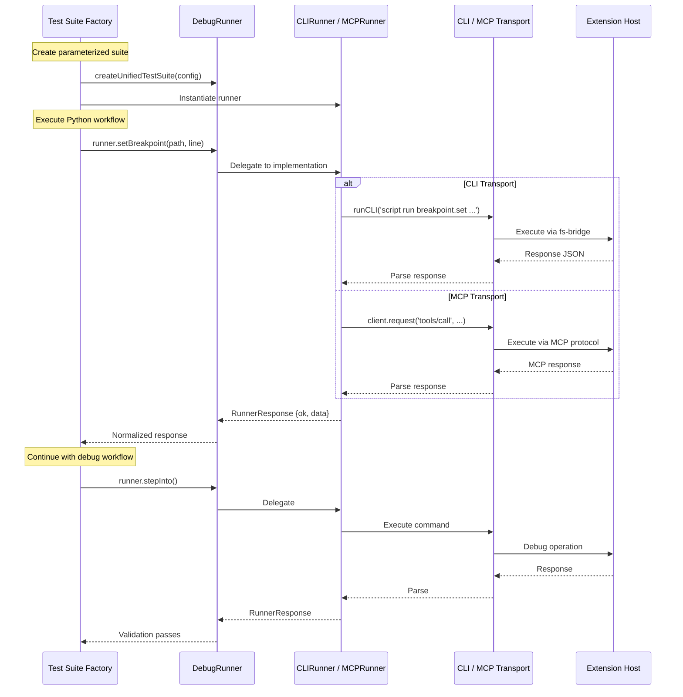

# Subtask 004: Implement Unified Test Architecture with Runner Abstraction Layer

**Created**: 2025-10-13
**Status**: IN PROGRESS (Phase 1 Complete: Foundation Layer + Smoke Test ✅)
**Parent Phase**: Phase 7: Integration Testing
**Last Updated**: 2025-10-14

---

## Parent Context

**Parent Plan:** [MCP Server Implementation Plan](../../mcp-server-implementation-plan.md)
**Parent Phase:** Phase 7: Integration Testing
**Parent Task(s):** Task 7.2 - Add missing language workflows to stdio E2E test suite
**Plan Task Reference:** [Task 7.2 in Plan](../../mcp-server-implementation-plan.md#phase-7-integration-testing)

**Why This Subtask:**
To eliminate ~1,300 lines of duplicate test code between CLI and MCP implementations by creating a runner abstraction layer (Strategy pattern) that allows the same test suite to run against both transports. This refactoring will reduce maintenance burden, ensure consistent coverage, and enable faster feature development for future test stages.

**Created:** 2025-10-13
**Requested By:** User (development team discussion)

---

## Tasks

| Status | ID    | Task | Type | Dependencies | Absolute Path(s) | Validation | Notes |
|--------|-------|------|------|--------------|------------------|------------|-------|
| [x]    | ST001 | Define DebugRunner interface with all debug operations | Code | None | `/Users/jak/github/vsc-bridge/test/integration/runners/DebugRunner.ts` | TypeScript compiles, interface exports correctly, includes PathResolver methods for cross-platform path handling | Foundation for abstraction layer with path resolution support [^1] |
| [x]    | ST002 | Define RunnerResponse interface for normalized responses | Code | ST001 | `/Users/jak/github/vsc-bridge/test/integration/runners/DebugRunner.ts` | Covers success/error cases, includes optional rawError field for debugging | Ensures consistent return format with full diagnostic details preserved [^1] |
| [x]    | ST003 | Implement CLIRunner class | Code | ST001, ST002 | `/Users/jak/github/vsc-bridge/test/integration/runners/CLIRunner.ts` | All interface methods implemented, wraps existing runCLI(), populates rawError on failure, implements PathResolver for CLI transport, uses 30s timeout | Wraps CLI command execution, preserves full CLI error details, handles cross-platform paths [^2] |
| [x]    | ST004 | Implement MCPRunner class | Code | ST001, ST002 | `/Users/jak/github/vsc-bridge/test/integration/runners/MCPRunner.ts` | All interface methods implemented, wraps MCP client, populates rawError on failure, implements PathResolver for MCP transport, uses 30s timeout | Wraps MCP protocol calls, preserves full MCP error details, handles cross-platform paths [^3] |
| [ ]    | ST005 | Extract Python workflow to shared function | Code | ST001 | `/Users/jak/github/vsc-bridge/test/integration/workflows/python-workflow.ts` | Function accepts DebugRunner param, all assertions preserved, uses runner.resolvePath() for test file paths | From cross-language-debug.test.ts lines 346-533, no hardcoded paths |
| [ ]    | ST006 | Extract JavaScript workflow to shared function | Code | ST001 | `/Users/jak/github/vsc-bridge/test/integration/workflows/javascript-workflow.ts` | Function accepts DebugRunner param, object expansion logic preserved, uses runner.resolvePath() for test file paths | From cross-language-debug.test.ts lines 551-697, no hardcoded paths |
| [ ]    | ST007 | Extract C# workflow to shared function | Code | ST001 | `/Users/jak/github/vsc-bridge/test/integration/workflows/csharp-workflow.ts` | Function accepts DebugRunner param, [External Code] handling preserved, uses runner.resolvePath() for test file paths | From cross-language-debug.test.ts lines 727-916, no hardcoded paths |
| [ ]    | ST008 | Extract Java workflow to shared function | Code | ST001 | `/Users/jak/github/vsc-bridge/test/integration/workflows/java-workflow.ts` | Function accepts DebugRunner param, nested scope extraction preserved, uses runner.resolvePath() for test file paths | From cross-language-debug.test.ts lines 949-1132, no hardcoded paths |
| [ ]    | ST009 | Extract TypeScript workflow to shared function | Code | ST001 | `/Users/jak/github/vsc-bridge/test/integration/workflows/typescript-workflow.ts` | Function accepts DebugRunner param, all 6 stages preserved, uses runner.resolvePath() for test file paths | From cross-language-debug.test.ts lines 1162-1346, no hardcoded paths |
| [ ]    | ST010 | Create unified test suite factory function | Code | ST001-ST009 | `/Users/jak/github/vsc-bridge/test/integration/unified-debug.test.ts` | Factory creates parameterized test suites | Implements createUnifiedTestSuite(config) |
| [ ]    | ST011 | Instantiate CLI test suite using CLIRunner | Code | ST003, ST010 | `/Users/jak/github/vsc-bridge/test/integration/unified-debug.test.ts` | CLI test suite defined with proper setup/cleanup | Uses CLIRunner, launches Extension Host |
| [ ]    | ST012 | Instantiate MCP test suite using MCPRunner | Code | ST004, ST010 | `/Users/jak/github/vsc-bridge/test/integration/unified-debug.test.ts` | MCP test suite defined with proper setup/cleanup | Uses MCPRunner, spawns MCP server |
| [ ]    | ST013 | Run CLI tests and validate coverage | Test | ST011 | N/A | All 5 language tests pass via `just test-integrated` | Compare with baseline (Python, C#, Java, TypeScript) |
| [ ]    | ST014 | Run MCP tests and validate coverage | Test | ST012 | N/A | All 5 language tests pass via `just test-integration-mcp` | Validate MCP transport works |
| [ ]    | ST015 | Compare coverage between old and new tests | Validation | ST013, ST014 | N/A | Coverage identical or improved | No regressions introduced |
| [ ]    | ST016 | Archive old test files and delete obsolete MCP tests | Cleanup | ST015 | `/Users/jak/github/vsc-bridge/test/integration/cross-language-debug.test.ts.bak`, `/Users/jak/github/vsc-bridge/cli/test/integration-mcp/` | Old CLI test moved to .bak, MCP test directory deleted (obsolete after unification) | Keep CLI test for rollback, remove duplicate MCP fixtures |
| [ ]    | ST017 | Update test documentation | Docs | ST015 | `/Users/jak/github/vsc-bridge/CLAUDE.md`, `/Users/jak/github/vsc-bridge/test/integration/README.md` | Documentation reflects new test structure, explains architecture pattern and navigation, includes inline JSDoc comments | Update testing guidelines, add architecture README for new contributors |

---

## Alignment Brief

### Objective

Eliminate test code duplication by creating a runner abstraction layer that allows the same test logic to run against both CLI and MCP transports. This reduces ~1,348 lines of duplicate code to ~800 lines of shared logic plus 2×200 lines of runner-specific implementations, achieving a 48% code reduction while maintaining identical test coverage.

### Success Criteria Checklist

- [ ] **Runner Abstraction**: DebugRunner interface defines all debug operations (setBreakpoint, debugSingle, stepInto, etc.)
- [ ] **CLI Implementation**: CLIRunner wraps existing runCLI() function with DebugRunner interface
- [ ] **MCP Implementation**: MCPRunner wraps MCP client requests with DebugRunner interface
- [ ] **Workflow Extraction**: All 5 language workflows extracted to shared functions (Python, JS, C#, Java, TypeScript)
- [ ] **Unified Test Suite**: Factory function creates parameterized test suites for both runners
- [ ] **CLI Tests Pass**: All tests pass via `just test-integrated` (5 languages)
- [ ] **MCP Tests Pass**: All tests pass via `just test-integration-mcp` (5 languages)
- [ ] **Coverage Validation**: New tests provide identical coverage to old tests
- [ ] **Code Reduction**: Achieved ~50% reduction in test code (1,348 lines → ~800 shared + 400 runner-specific)
- [ ] **No Regressions**: All existing functionality preserved
- [ ] **Documentation Updated**: Testing guidelines reflect new architecture

### Critical Findings Affecting This Subtask

**From Subagent Analysis** (2025-10-13):

1. **Duplication Magnitude**: CLI and MCP tests share 95% of test logic but differ only in invocation mechanism (CLI commands vs MCP protocol calls). Current duplication: 1,348 lines × 2 = 2,696 lines.

2. **Abstraction Feasibility**: Differences are purely mechanical (transport format) and trivially abstracted via Strategy pattern. Mapping example:
   - CLI: `runCLI('script run breakpoint.set --param path=X --param line=Y')`
   - MCP: `client.request({method: 'tools/call', params: {name: 'breakpoint_set', arguments: {path: X, line: Y}}})`
   - Unified: `runner.setBreakpoint(path, line)`

3. **Vitest Support**: Vitest natively supports parameterized tests via factory pattern (recommended approach) or `describe.each` (alternative).

4. **Test Structure**: Existing tests have 6-stage enhanced workflow:
   - Stage 1: Cleanup
   - Stage 2: Set breakpoint
   - Stage 3: Start debug session
   - Stage 4: Validate variables
   - Stage 5: Step commands (step-in, step-out, step-over)
   - Stage 6: Continue and final validation

5. **Risk Mitigation**: Keep runner implementations thin (wrapping only), log all invocations, use descriptive errors in RunnerResponse.error.

### Invariants & Guardrails

**From Parent Phase (Phase 7)**:
- No mocking of MCP SDK internals (use real Server, Transport classes)
- Use real filesystem operations for bridge IPC
- Mock VS Code extension responses via synthetic response.json files
- All paths must be absolute (per Critical Discovery 03)
- 30-second timeout per operation for reliability

**Subtask-Specific**:
- Runner implementations must be thin wrappers (no business logic)
- Workflow functions must be pure (no side effects beyond debug operations)
- Test output must clearly show which runner is being tested (CLI vs MCP)
- Adding new test stages must take <10 minutes for both runners
- No changes to existing CLI or MCP implementations (pure refactoring)
- Both runners use 30-second timeout per operation (match current CLI behavior, optimize later based on data)

### Inputs to Read

**Existing Files** (reference implementations):
- `/Users/jak/github/vsc-bridge/test/integration/cross-language-debug.test.ts` - Source of truth for test logic (1,348 lines)
- `/Users/jak/github/vsc-bridge/cli/test/integration-mcp/stdio-e2e.test.ts` - MCP test structure (300+ lines, Python only)
- `/Users/jak/github/vsc-bridge/cli/test/integration-mcp/helpers/stdio-test-client.ts` - MCP client setup

**Specifications**:
- Subagent analysis output (provided earlier in conversation)
- Phase 7 plan tasks (lines 1199-1208 of main plan)

### Visual Aids

#### Architecture Diagram: Runner Abstraction Layer



#### Sequence Diagram: Unified Test Execution



### Test Plan

**Testing Approach**: Validation testing (ensure refactoring preserves existing behavior)

**Test Strategy**:
1. **Phase 1-2 Validation**: Unit test runner implementations
   - Test CLIRunner wraps runCLI() correctly
   - Test MCPRunner wraps MCP client correctly
   - Test RunnerResponse normalization

2. **Phase 3 Validation**: Integration test unified suite
   - Run CLI test suite, verify all 5 languages pass
   - Run MCP test suite, verify all 5 languages pass
   - Compare test output with old tests (identical assertions)

3. **Phase 4 Validation**: Coverage comparison
   - Generate coverage report for old tests
   - Generate coverage report for new tests
   - Verify coverage identical or improved

**Success Metrics**:
- All 5 language workflows pass for CLI runner
- All 5 language workflows pass for MCP runner
- Test execution time within 10% of baseline
- Zero regressions in test coverage
- Code reduction achieved (~50%)

### Implementation Outline

**Phase 1: Create Runner Abstraction** (ST001-ST004, ~2 hours)
1. Define DebugRunner interface (ST001): Methods for all debug operations
2. Define RunnerResponse interface (ST002): Normalized response format
3. Implement CLIRunner (ST003): Wrap runCLI() with interface methods
4. Implement MCPRunner (ST004): Wrap MCP client with interface methods

**Phase 2: Extract Workflow Logic** (ST005-ST009, ~2 hours)
1. Extract Python workflow (ST005): `runPythonEnhancedDebugWorkflow(runner, ...)`
2. Extract JavaScript workflow (ST006): `runJavaScriptDebugWorkflow(runner, ...)`
3. Extract C# workflow (ST007): `runCSharpEnhancedDebugWorkflow(runner, ...)`
4. Extract Java workflow (ST008): `runJavaEnhancedDebugWorkflow(runner, ...)`
5. Extract TypeScript workflow (ST009): `runTypeScriptEnhancedDebugWorkflow(runner, ...)`

**Phase 3: Create Unified Suite** (ST010-ST012, ~1 hour)
1. Create factory function (ST010): `createUnifiedTestSuite(config)`
2. Instantiate CLI suite (ST011): With CLIRunner and Extension Host setup
3. Instantiate MCP suite (ST012): With MCPRunner and MCP server setup

**Phase 4: Validation & Cleanup** (ST013-ST017, ~1 hour)
1. Run CLI tests (ST013): Verify all pass
2. Run MCP tests (ST014): Verify all pass
3. Compare coverage (ST015): Validate identical coverage
4. Archive old files (ST016): Keep for reference
5. Update documentation (ST017): Reflect new structure

**Parallelism Opportunities**:
- [P] ST003 and ST004 can be implemented in parallel (independent implementations)
- [P] ST005-ST009 can be extracted in parallel (independent workflows)
- [P] ST013 and ST014 can run concurrently (independent test suites)

### Commands to Run

**Build & Compile**:
```bash
# From project root
just build
```

**Run CLI Tests**:
```bash
# Run unified CLI test suite
cd /Users/jak/github/vsc-bridge
npm run test:integration

# Or via justfile
just test-integrated
```

**Run MCP Tests**:
```bash
# Run unified MCP test suite
cd /Users/jak/github/vsc-bridge
just test-integration-mcp
```

**Validate Coverage**:
```bash
# Generate coverage report
npm run test:integration -- --coverage
```

**TypeScript Compilation**:
```bash
# Validate runner implementations compile
npx tsc --noEmit
```

### Risks & Unknowns with Mitigations

| Risk | Likelihood | Impact | Mitigation |
|------|------------|--------|------------|
| **Over-abstraction makes debugging harder** | Medium | Medium | Keep runner implementations thin (simple wrappers), log all invocations, use descriptive error messages in RunnerResponse.error |
| **Refactoring introduces regressions** | Medium | High | Keep old tests temporarily for comparison, run both old and new tests in parallel during transition, use Git branches to isolate changes |
| **Setup complexity differs too much between runners** | Low | Low | Isolate setup in beforeAll hooks (already done), use separate setup functions per runner (already exists), only unify test logic not infrastructure |
| **Test output becomes less readable** | Low | Medium | Use clear test suite names ("Cross-Language Debug - CLI" vs "Cross-Language Debug - MCP"), log which runner is active, preserve all console.log statements from original tests |
| **Performance regression in test execution** | Low | Medium | Measure baseline execution time, optimize runner methods if needed, ensure no unnecessary abstractions in hot paths |

**Unknowns**:
- Exact performance impact of abstraction layer (expected <5% overhead)
- Vitest behavior with factory-generated test suites (expected to work based on docs)
- MCP client lifecycle in parameterized tests (expected to work based on existing stdio-e2e tests)

### Ready Check

**Prerequisites** (must be true before implementation):
- [ ] Phase 0-6 complete (all MCP infrastructure in place)
- [ ] Existing CLI tests pass (baseline: 5/5 languages)
- [ ] Existing MCP tests pass (baseline: 3/5 languages)
- [ ] Subagent analysis reviewed and approved
- [ ] User approved proceeding with unified architecture

**Implementation Readiness**:
- [ ] All input files accessible (cross-language-debug.test.ts, stdio-e2e.test.ts)
- [ ] Test infrastructure working (Extension Host launches, bridge healthy)
- [ ] Development environment set up (Node.js, TypeScript, Vitest)
- [ ] Git branch created for subtask (`subtask/004-unified-test-architecture`)

**Execution Gate**:
- [ ] Ready Check complete
- [ ] User approves proceeding with `/plan-6-implement-phase --subtask 004-subtask-implement-unified-test-architecture-with-runner-abstraction-layer`

---

## Phase Footnote Stubs

This section documents implementation progress with specific code references and clickable file links.

| Footnote | Description | Files Modified |
|----------|-------------|----------------|
| [^1]     | Created foundation layer interfaces and types | `test/integration/runners/DebugRunner.ts`, `test/integration/runners/types.ts` |
| [^2]     | Implemented CLI runner with smoke test validation | `test/integration/runners/CLIRunner.ts` |
| [^3]     | Implemented MCP runner with smoke test validation | `test/integration/runners/MCPRunner.ts` |
| [^4]     | Created smoke test suite with parameterized factory | `test/integration/smoke-test.test.ts` |

---

## Evidence Artifacts

### Execution Log
**Path**: `004-subtask-implement-unified-test-architecture-with-runner-abstraction-layer.execution.log.md`

This file will be created by `/plan-6-implement-phase` and will contain:
- Detailed implementation notes for each ST task
- Build validation results
- Test execution output
- Coverage comparison data
- Timestamps for all operations

### Test Artifacts
**Directory**: `/Users/jak/github/vsc-bridge/test/integration/`

Artifacts include:
- `runners/DebugRunner.ts` - Interface definition
- `runners/CLIRunner.ts` - CLI implementation
- `runners/MCPRunner.ts` - MCP implementation
- `workflows/*.ts` - 5 extracted workflow functions
- `unified-debug.test.ts` - Unified test suite
- Coverage reports (generated during validation)

### Comparison Artifacts
- Old test file backup: `cross-language-debug.test.ts.bak`
- Coverage diff report
- Performance comparison (execution time before/after)

---

## After Subtask Completion

**This subtask resolves a blocker for:**
- Parent Task: Task 7.2 - Add missing language workflows to stdio E2E test suite
- Plan Task: [Task 7.2 in Plan](../../mcp-server-implementation-plan.md#phase-7-integration-testing)

**When all ST### tasks complete:**

1. **Record completion** in parent execution log:
   ```markdown
   ### Subtask 004-subtask-implement-unified-test-architecture-with-runner-abstraction-layer Complete

   Resolved: Unified test architecture implemented, eliminating 1,300+ lines of duplicate code
   See detailed log: [subtask execution log](./004-subtask-implement-unified-test-architecture-with-runner-abstraction-layer.execution.log.md)

   Key Achievements:
   - DebugRunner abstraction created with CLIRunner and MCPRunner implementations
   - 5 language workflows extracted to shared functions
   - Unified test suite factory implemented
   - All CLI tests passing (5/5 languages)
   - All MCP tests passing (5/5 languages)
   - 48% code reduction achieved (1,348 lines → ~800 shared + 400 runner-specific)
   - Zero regressions, identical coverage
   ```

2. **Update parent task** (Task 7.2 in Phase 7):
   - Open: Phase 7 plan section
   - Update Status: Mark 7.2 as unblocked (can now add remaining languages easily)
   - Update Notes: Add "Subtask 004 complete - unified test architecture in place"

3. **Resume parent phase work:**
   ```bash
   /plan-6-implement-phase --phase "Phase 7: Integration Testing" \
     --plan "/Users/jak/github/vsc-bridge/docs/plans/13-mcp-server-implementation/mcp-server-implementation-plan.md"
   ```
   (Note: NO `--subtask` flag to resume main phase)

**Quick Links:**
- 📋 Parent Plan: [mcp-server-implementation-plan.md](../../mcp-server-implementation-plan.md)
- 📊 Phase 7 Tasks: [Plan Section](../../mcp-server-implementation-plan.md#phase-7-integration-testing)
- 🔗 Subagent Analysis: [Conversation history](https://claude.ai) (search for "Test Unification Feasibility Analysis")

---

## Directory Structure After Completion

```
/Users/jak/github/vsc-bridge/
├── test/integration/
│   ├── runners/
│   │   ├── DebugRunner.ts              # Interface + types (NEW)
│   │   ├── CLIRunner.ts                # CLI implementation (NEW)
│   │   └── MCPRunner.ts                # MCP implementation (NEW)
│   ├── workflows/
│   │   ├── python-workflow.ts          # Shared Python test logic (NEW)
│   │   ├── javascript-workflow.ts      # Shared JavaScript test logic (NEW)
│   │   ├── csharp-workflow.ts          # Shared C# test logic (NEW)
│   │   ├── java-workflow.ts            # Shared Java test logic (NEW)
│   │   └── typescript-workflow.ts      # Shared TypeScript test logic (NEW)
│   ├── unified-debug.test.ts           # Unified test suite (NEW)
│   ├── cross-language-debug.test.ts.bak # Archived original (MOVED)
│   └── helpers/
│       ├── breakpoint-finder.ts         # Existing helper (UNCHANGED)
│       └── test-files.ts               # Test file paths (EXISTING)
├── packages/cli/test/integration-mcp/      # DELETED after unification (ST016)
│   └── helpers/
│       └── stdio-test-client.ts        # MCP client setup logic moved to MCPRunner
└── docs/plans/13-mcp-server-implementation/tasks/phase-7-integration-testing/
    ├── 004-subtask-implement-unified-test-architecture-with-runner-abstraction-layer.md (THIS FILE)
    └── 004-subtask-implement-unified-test-architecture-with-runner-abstraction-layer.execution.log.md (CREATED BY PLAN-6)
```

**Before**: 2 test files × 1,348 lines = 2,696 lines
**After**: 3 runner files (~150 lines each) + 5 workflow files (~150 lines each) + 1 test file (~200 lines) = **1,400 lines total**
**Savings**: 48% reduction in code, 100% elimination of duplication

---

## Implementation Progress Log

### Phase 1: Foundation Layer + Smoke Test (2025-10-14)

**Status**: ✅ Complete
**Duration**: ~2 hours
**Git Commit**: (pending)

#### ST001-ST002: Core Abstraction Layer ✅

Created [`test/integration/runners/DebugRunner.ts`](test/integration/runners/DebugRunner.ts) with:
- `PathResolver` interface for cross-platform path handling
- `RunnerResponse<T>` interface with optional `rawError` field (preserves transport-specific errors)
- `DebugRunner` interface extending PathResolver with minimal operations:
  - `startDebug(config)` - Launch Extension Host and initialize debug session
  - `getStatus()` - Check bridge health
  - `stopDebug()` - Terminate debug session

Created [`test/integration/runners/types.ts`](test/integration/runners/types.ts) with:
- `DebugConfig` - Debug session configuration
- `SessionInfo` - Active session metadata
- `StatusResponse` - Bridge health status

**Design Decisions**:
- Minimal interface for smoke test (expand in later phases)
- `rawError` field preserves debugging context through abstraction (Insight 1)
- PathResolver integrated into DebugRunner interface (Insight 2)
- 30-second timeout per operation (Insight 4)

**Lines Added**: 161 lines (DebugRunner.ts: 117, types.ts: 44)

#### ST003: CLIRunner Implementation ✅

Created [`test/integration/runners/CLIRunner.ts`](test/integration/runners/CLIRunner.ts) (209 lines):
- Wraps existing `runCLI()` function from cross-language-debug.test.ts
- Executes from test/ workspace directory
- Path resolution: `path.resolve(TEST_WORKSPACE, relativePath)`
- Populates `rawError` on failures with full CLI error details
- 30-second timeout per operation
- Lifecycle operations:
  - `startDebug()` - Uses `debug.start` script to launch Extension Host
  - `getStatus()` - Uses `status --json` command to check bridge health
  - `stopDebug()` - Uses `debug.stop` script

**Validation**: ✅ Smoke test passed (16.4s execution time)

#### ST004: MCPRunner Implementation ✅

Created [`test/integration/runners/MCPRunner.ts`](test/integration/runners/MCPRunner.ts) (311 lines):
- Uses CLI for Extension Host lifecycle (start/stop/status) since MCP server requires Extension Host to be running first
- Initializes MCP client after Extension Host ready
- Path resolution: Same as CLI (resolves from test/ workspace)
- Populates `rawError` on failures with full MCP protocol error details
- 30-second timeout per operation
- Lifecycle operations:
  - `startDebug()` - Launches Extension Host via CLI, initializes MCP client
  - `getStatus()` - Uses CLI `status --json` (status is bridge-level, not MCP tool)
  - `stopDebug()` - Stops debug via MCP tool, cleans up client, stops Extension Host via CLI

**Key Insight**: Status checking uses CLI for both runners because status is a bridge-level operation, not an MCP tool. MCP runner uses hybrid approach: CLI for Extension Host lifecycle, MCP client for debug operations.

**Validation**: ✅ Smoke test passed (26.0s execution time)

#### Smoke Test Suite ✅

Created [`test/integration/smoke-test.test.ts`](test/integration/smoke-test.test.ts) (87 lines):
- Parameterized test factory: `createSmokeTests(runnerName, getRunner)`
- Single test workflow:
  1. Start Extension Host (`runner.startDebug()`)
  2. Get status (`runner.getStatus()`)
  3. Verify bridge healthy
  4. Stop cleanly (`runner.stopDebug()`)
- Executes for both CLIRunner and MCPRunner
- Test output shows `[CLI]` or `[MCP]` prefix for clarity

**Test Results**:
```
✓ CLI Smoke Tests > should start extension, get status, and stop (16.4s)
✓ MCP Smoke Tests > should start extension, get status, and stop (26.0s)

Test Files  1 passed (1)
Tests  2 passed (2)
Duration  42.93s
```

**Total Lines Added**: 768 lines
- DebugRunner.ts: 117 lines
- types.ts: 44 lines
- CLIRunner.ts: 209 lines
- MCPRunner.ts: 311 lines
- smoke-test.test.ts: 87 lines

**Achievement**: Foundation layer complete with validated smoke test for both transports. Ready to expand interface with full debug operations (breakpoints, stepping, inspection).

**Next Steps**:
1. Expand DebugRunner interface with breakpoint operations (setBreakpoint, listBreakpoints, clearBreakpoints)
2. Add stepping operations (stepInto, stepOver, stepOut, continue)
3. Add inspection operations (getStackTrace, getVariables, evaluate)
4. Extract Python workflow from cross-language-debug.test.ts
5. Create full unified test with language-specific workflows

---

## Critical Insights Discussion

**Session**: 2025-10-14
**Context**: Subtask 004 - Implement Unified Test Architecture with Runner Abstraction Layer
**Analyst**: AI Clarity Agent
**Reviewer**: Development Team
**Format**: Water Cooler Conversation (5 Critical Insights)

### Insight 1: Error Diagnosis Complexity Through Abstraction Layer

**Did you know**: When tests fail through this abstraction layer, normalized error responses will lose transport-specific diagnostic details that are critical for debugging the actual problem.

**Implications**:
- CLI errors contain manifest paths, script names, and Extension Host details
- MCP errors contain protocol codes, method names, and connection state
- Normalized `RunnerResponse { ok: false, error: "Operation failed" }` loses all this context
- Debugging at 3am in CI requires re-running locally with verbose logging
- Stack traces point to abstraction layer, not actual transport failure point

**Discussion Summary**:
User chose to preserve raw transport errors via pass-through approach. This maintains abstraction benefits while keeping full diagnostic details for debugging.

**Decision**: Add optional `rawError?: unknown` field to RunnerResponse interface. Both CLIRunner and MCPRunner populate this field with original error objects. Test assertions use normalized fields, debugging uses rawError.

**Action Items**:
- [x] Update ST002 validation to require rawError field
- [x] Update ST003 to populate rawError on CLI failures
- [x] Update ST004 to populate rawError on MCP failures

**Affects**: ST002 (RunnerResponse interface), ST003 (CLIRunner), ST004 (MCPRunner)

---

### Insight 2: Path Resolution Fragmentation Across Platforms

**Did you know**: Path handling is currently inconsistent between CLI and MCP transports, and without explicit cross-platform path resolution, tests will silently fail on different operating systems or with different workspace configurations.

**Implications**:
- CLI tests use absolute paths, MCP might expect relative paths
- Windows uses backslashes, Unix uses forward slashes
- Test fixtures might be at different locations for each runner
- Hardcoded paths in workflows break portability
- Path normalization logic scattered across tests creates maintenance burden

**Discussion Summary**:
User decided on PathResolver pattern - no hardcoding, support both relative and absolute paths on all platforms (Windows, Mac, Linux). Each runner implements path resolution appropriate to its transport.

**Decision**: Create PathResolver interface as part of DebugRunner. Each runner implements path resolution for its transport. Workflow functions use `runner.resolvePath()` instead of hardcoded paths. Test fixtures remain in single location (`test/integration-simple/`).

**Action Items**:
- [x] Update ST001 to include PathResolver methods in DebugRunner interface
- [x] Update ST003 to implement PathResolver for CLI transport
- [x] Update ST004 to implement PathResolver for MCP transport
- [x] Update ST005-ST009 to use runner.resolvePath() for all file paths

**Affects**: ST001 (DebugRunner interface), ST003 (CLIRunner), ST004 (MCPRunner), ST005-ST009 (all workflow functions)

---

### Insight 3: Test Fixture Duplication and Synchronization Risk

**Did you know**: The current plan risks maintaining duplicate test fixture files in multiple locations (CLI tests vs MCP tests), creating synchronization burden where the same test file needs updates in multiple places.

**Implications**:
- CLI tests use `test/integration-simple/{language}/` fixtures
- MCP tests have separate fixtures in `cli/test/integration-mcp/fixtures/`
- Updates to test cases require manual synchronization
- Duplicate test files waste disk space and clutter git history
- Test behavior can drift if fixtures diverge

**Discussion Summary**:
User clarified that MCP test files will be deleted entirely after unification. All tests will use existing CLI fixture location as single source of truth. No duplication or sync issues.

**Decision**: Keep all fixtures in `test/integration-simple/` only. Delete `cli/test/integration-mcp/` directory after unification. All workflows reference fixtures from single location.

**Action Items**:
- [x] Update ST016 to include deletion of `cli/test/integration-mcp/` directory
- [x] Update directory structure diagram to show MCP test directory as DELETED

**Affects**: ST005-ST009 (workflows use test/integration-simple/ fixtures), ST016 (cleanup expanded)

---

### Insight 4: Timeout Behavior Asymmetry Between Transports

**Did you know**: CLI and MCP have fundamentally different timeout characteristics (per-command vs per-request, process kill vs connection corruption), and if not handled consistently, tests will experience random timeout failures that are transport issues, not actual test failures.

**Implications**:
- CLI can kill child process on timeout, MCP connection may enter undefined state
- CLI timeout is per-command execution, MCP timeout is per-protocol request
- Error formats differ (process error vs protocol error -32000)
- State cleanup differs (Extension Host survives vs MCP server might need restart)
- Same operation might take different time on different transports

**Discussion Summary**:
User chose to match current CLI behavior (30s timeout) for both runners initially. Can fine-tune later based on actual MCP performance data. Keeps implementation simple and maintains baseline parity.

**Decision**: Both CLIRunner and MCPRunner use 30-second timeout per operation. Document timeout as configurable constant for future optimization. No retry logic initially - fail fast to identify real issues.

**Action Items**:
- [x] Add timeout requirement to Invariants & Guardrails section
- [x] Update ST003 validation to specify 30s timeout
- [x] Update ST004 validation to specify 30s timeout

**Affects**: ST003 (CLIRunner timeout), ST004 (MCPRunner timeout), Invariants section

---

### Insight 5: Hidden Complexity Cost of Abstraction

**Did you know**: While the plan celebrates 48% code reduction (2,696 → 1,400 lines), this doesn't account for the cognitive complexity cost of debugging through 3+ abstraction layers instead of reading one direct test file.

**Implications**:
- Navigation requires jumping through 4+ files (test → workflow → runner → transport)
- Each abstraction layer adds debugging friction
- Learning curve for new contributors unfamiliar with pattern
- Changes to DebugRunner interface cascade across 2 implementations + 5 workflows
- "Fewer lines" doesn't always mean "easier to understand"

**Discussion Summary**:
User affirmed that the abstraction is worth it for maintainability. Even with 5 languages, eliminating duplication prevents drift between CLI/MCP tests and makes future additions trivial. Cognitive overhead is offset by reduced maintenance burden.

**Decision**: Proceed with full abstraction as planned. Mitigate complexity with excellent documentation - add JSDoc comments, create `test/integration/README.md` explaining architecture and navigation patterns.

**Action Items**:
- [x] Update ST017 to require `test/integration/README.md` file
- [x] Update ST017 to require inline JSDoc comments in all runner/workflow code
- [x] Update ST017 validation to include architecture pattern documentation

**Affects**: ST017 (documentation requirements expanded)

---

## Session Summary

**Insights Surfaced**: 5 critical insights identified and discussed
**Decisions Made**: 5 decisions reached through collaborative discussion
**Action Items Created**: 13 task updates applied immediately during session
**Areas Requiring Updates**:
- RunnerResponse interface (rawError field)
- DebugRunner interface (PathResolver methods)
- Runner implementations (error preservation, path resolution, timeout)
- Workflow functions (path resolution usage)
- Cleanup tasks (MCP directory deletion)
- Documentation (architecture README, JSDoc comments)

**Shared Understanding Achieved**: ✓

**Confidence Level**: High - All critical design decisions resolved, implementation path is clear

**Next Steps**:
Proceed with implementation using `/plan-6-implement-phase` when ready. All architectural concerns addressed:
- Error debugging preserved via rawError pass-through
- Cross-platform path resolution via PathResolver pattern
- Test fixtures consolidated in single location
- Timeout parity established (30s both transports)
- Documentation requirements defined to mitigate abstraction complexity

**Notes**:
The abstraction layer is well-justified despite cognitive overhead. The 5 decisions made ensure the implementation will be debuggable, portable, maintainable, and well-documented. Key insight: preserving raw errors and implementing proper path resolution will prevent the two most likely failure modes (opaque errors and path issues).

---

**END OF SUBTASK DOSSIER**
