# Subtask 005: Restructure project as monorepo workspace to enable shared test infrastructure

**Created**: 2025-10-14
**Status**: PLANNING
**Parent Phase**: Phase 7: Integration Testing

---

## Parent Context

**Parent Plan:** [MCP Server Implementation Plan](../../mcp-server-implementation-plan.md)
**Parent Phase:** Phase 7: Integration Testing
**Parent Task(s):** Task 7.2 - Add missing language workflows to stdio E2E test suite
**Plan Task Reference:** [Task 7.2 in Plan](../../mcp-server-implementation-plan.md#phase-7-integration-testing)

**Why This Subtask:**
To resolve the package boundary problem that blocks Subtask 004 (unified test architecture). The current project structure has extension/ and cli/ as separate packages with independent dependencies. This prevents creating a shared test infrastructure package that both can import from. Restructuring as an npm workspace monorepo enables packages/shared-test/ to be a common dependency, eliminating ~1,300 lines of duplicate test code.

**Created:** 2025-10-14
**Requested By:** Development Team (identified via /didyouknow Insight #1)

---

## Tasks

| Status | ID    | Task | Type | Dependencies | Absolute Path(s) | Validation | Notes |
|--------|-------|------|------|--------------|------------------|------------|-------|
| [x]    | ST001 | Create root package.json with workspaces configuration | Config | None | `/Users/jordanknight/github/vsc-bridge/package.json` | File exists, workspaces array includes "packages/*" | Updated workspaces to "packages/*" [^1] |
| [x]    | ST002 | Create packages/ directory structure | Directory | None | `/Users/jordanknight/github/vsc-bridge/packages/` | Directory exists | Created packages/ directory [^2] |
| [x]    | ST003 | Move extension/ → packages/extension/ | Migration | ST002 | `/Users/jordanknight/github/vsc-bridge/packages/extension/` | Directory moved, git history preserved | Moved via `git mv extension packages/extension` [^3] |
| [x]    | ST004 | Move cli/ → packages/cli/ | Migration | ST002 | `/Users/jordanknight/github/vsc-bridge/packages/cli/` | Directory moved, git history preserved | Moved via `git mv cli packages/cli` [^3] |
| [x]    | ST005 | Update all internal imports and build paths | Code | ST003, ST004 | All tsconfig.json files, package.json references | TypeScript compiles cleanly, CLI manifest.json copied successfully | Fixed CLI manifest copy: `../` → `../../`, removed `|| true` [^4] |
| [x]    | ST006 | Create packages/shared-test/ skeleton with package.json | Code | ST002 | `/Users/jordanknight/github/vsc-bridge/packages/shared-test/package.json` | Package name @vsc-bridge/shared-test, version 1.0.0 | Created shared test package [^5] |
| [x]    | ST007 | Configure TypeScript for shared-test package | Config | ST006 | `/Users/jordanknight/github/vsc-bridge/packages/shared-test/tsconfig.json` | Compiles successfully | Created tsconfig.json with ES2022/ESNext [^5] |
| [x]    | ST008 | Add dependencies to shared-test package | Config | ST006 | `/Users/jordanknight/github/vsc-bridge/packages/shared-test/package.json` | vitest, @modelcontextprotocol/sdk installed | Added MCP SDK and vitest dependencies [^5] |
| [x]    | ST009 | Create directory structure (runners/, workflows/, helpers/) | Directory | ST006 | `/Users/jordanknight/github/vsc-bridge/packages/shared-test/src/` | All directories exist | Created src/{runners,workflows,helpers}/ with placeholder index files [^5] |
| [x]    | ST010 | Verify packages/shared-test builds independently | Validation | ST007-ST009 | N/A | `npm run build` succeeds | Package builds successfully, generates dist/ output [^5] |
| [x]    | ST011 | Add @vsc-bridge/shared-test to extension devDependencies | Config | ST010 | `/Users/jordanknight/github/vsc-bridge/packages/extension/package.json` | Dependency added with "workspace:*" | Added workspace dependency [^6] |
| [x]    | ST012 | Add @vsc-bridge/shared-test to cli devDependencies | Config | ST010 | `/Users/jordanknight/github/vsc-bridge/packages/cli/package.json` | Dependency added with "workspace:*" | Added workspace dependency [^6] |
| [x]    | ST013 | Update root package scripts (build, test, clean) | Config | ST001 | `/Users/jordanknight/github/vsc-bridge/package.json` | Scripts run against all workspaces | Updated all paths to packages/*, added build:shared-test, added clean script [^6] |
| [x]    | ST014 | Update justfile for workspace commands | Config | ST001 | `/Users/jordanknight/github/vsc-bridge/justfile` | All recipes work with packages/* paths, validation matrix passes | Updated all extension/, cli/ paths to packages/* across all recipes [^7] |
| [~]    | ST015 | Update GitHub Actions workflows for workspace paths | Config | ST001 | `.github/workflows/*.yml` | CI references correct package paths, cache keys updated, artifacts paths fixed, path filters updated | DEFERRED: Will be discovered and fixed when CI runs. Not blocking monorepo completion |
| [x]    | ST016 | Build extension successfully | Validation | ST005, ST011 | N/A | `cd packages/extension && just build` succeeds | Extension builds cleanly [^8] |
| [x]    | ST017 | Build CLI successfully | Validation | ST005, ST012 | N/A | `cd packages/cli && npm run build` succeeds | CLI builds cleanly, manifest copied successfully [^8] |
| [x]    | ST018 | Run existing tests to ensure no regressions | Validation | ST016, ST017 | N/A | All tests pass (extension + CLI) | Tests pass after Extension Host restart with new monorepo code. Initial failures due to stale Extension Host state (not monorepo issue). Monorepo structure validated [^9] |
| [x]    | ST019 | Validate VS Code .vsix packaging still works | Validation | ST016 | N/A | `vsce package` generates valid .vsix, size <5MB, only extension contents included | Verified: Extension installs and works correctly. Packaging successful [^10] |

---

## Alignment Brief

### Objective

Transform the VSC-Bridge project from a single-package repository into an npm workspace monorepo to enable shared test infrastructure. This restructuring resolves the package boundary problem identified in /didyouknow Insight #1, which currently blocks Subtask 004 (unified test architecture). The goal is to create a foundation where both extension and CLI packages can depend on a common @vsc-bridge/shared-test package, eliminating ~1,300 lines of duplicate test code.

### Success Criteria Checklist

- [ ] **Workspace Root**: Root package.json defines workspaces array with "packages/*"
- [ ] **Package Structure**: Three workspace packages exist (extension, cli, shared-test)
- [ ] **Git History Preserved**: Extension and CLI moved using `git mv` to preserve commit history
- [ ] **Build Paths Updated**: All tsconfig.json files reference correct paths
- [ ] **Dependency Wiring**: Extension and CLI both depend on shared-test via "workspace:*"
- [ ] **Extension Builds**: `cd packages/extension && just build` succeeds
- [ ] **CLI Builds**: `cd packages/cli && npm run build` succeeds
- [ ] **Tests Pass**: All existing tests pass (no behavioral regressions)
- [ ] **VS Code Packaging**: `vsce package` generates valid .vsix file (<5MB, no sibling packages)
- [ ] **CI Updated**: GitHub Actions workflows reference packages/* paths
- [ ] **Justfile Updated**: Build/test commands work with workspace structure
- [ ] **Zero Breaking Changes**: Extension and CLI functionality unchanged

### Critical Findings Affecting This Subtask

**From /didyouknow Insight #1: Package Boundary Problem**

**Problem**: Subtask 004 proposes creating unified test infrastructure in `/Users/jordanknight/github/vsc-bridge/test/integration/`, but this location cannot import from the CLI package because:
1. MCP SDK is installed in `cli/package.json`, not root package.json
2. Extension (root) and CLI are separate packages with isolated dependencies
3. TypeScript compilation fails: "Cannot find module '@modelcontextprotocol/sdk'"

**Solution**: Monorepo workspace structure where:
- Root package.json defines workspaces
- packages/shared-test/ is a new package with test infrastructure
- packages/extension/ and packages/cli/ depend on packages/shared-test/
- All packages can import from each other via workspace protocol

**Impact**: This is a **hard prerequisite** for Subtask 004. Without this restructuring, unified test architecture is architecturally impossible.

### Invariants & Guardrails

**From Parent Phase (Phase 7)**:
- No mocking of MCP SDK internals (use real Server, Transport classes)
- Use real filesystem operations for bridge IPC
- Mock VS Code extension responses via synthetic response.json files
- All paths must be absolute (per Critical Discovery 03)
- 30-second timeout per operation for reliability

**Subtask-Specific**:
- **Zero functional changes**: Extension and CLI behavior must be identical before/after
- **Git history preservation**: Use `git mv` for directory moves
- **Workspace protocol**: Use "workspace:*" for internal package dependencies
- **Backward compatibility**: Existing developer workflows must still work
- **Build validation**: All packages must build independently and collectively
- **Test isolation**: Existing tests must pass without modification
- **CI compatibility**: GitHub Actions must work with new structure
- **VS Code compatibility**: Extension packaging must remain functional
- **No silent errors**: NEVER use `|| true` or `2>/dev/null` to suppress errors - fail fast and visibly

### Inputs to Read

**Existing Files** (analyze before restructuring):
- `/Users/jordanknight/github/vsc-bridge/extension/package.json` - Current extension dependencies
- `/Users/jordanknight/github/vsc-bridge/cli/package.json` - Current CLI dependencies, MCP SDK version
- `/Users/jordanknight/github/vsc-bridge/extension/tsconfig.json` - Extension TypeScript config
- `/Users/jordanknight/github/vsc-bridge/cli/tsconfig.json` - CLI TypeScript config
- `/Users/jordanknight/github/vsc-bridge/justfile` - Build commands to update
- `/Users/jordanknight/github/vsc-bridge/.github/workflows/` - CI workflows to update
- `/Users/jordanknight/github/vsc-bridge/test/integration/` - Current test structure

**Documentation**:
- npm workspaces documentation (https://docs.npmjs.com/cli/v9/using-npm/workspaces)
- Parent plan Phase 7 requirements (line 1172-1226)
- Subtask 004 dossier (will need path updates after this completes)

### Visual Aids

#### Architecture Diagram: Before vs After Structure

```mermaid
flowchart TB
    subgraph "BEFORE: Separate Packages"
        E1[extension/]
        C1[cli/]
        T1[test/]

        E1 -.-> T1
        C1 -.->|"❌ Can't import MCP SDK"| T1

        style T1 fill:#ff6b6b
    end

    subgraph "AFTER: Workspace Monorepo"
        R["Root package.json
        workspaces: packages/*"]

        subgraph "packages/"
            E2["extension/
            @vsc-bridge/extension"]
            C2["cli/
            @vsc-bridge/cli"]
            S2["shared-test/
            @vsc-bridge/shared-test"]
        end

        R --> E2
        R --> C2
        R --> S2

        E2 --> S2
        C2 --> S2

        style S2 fill:#51cf66
        style R fill:#339af0
    end
```



#### Sequence Diagram: Workspace Dependency Resolution


### Test Plan

**Testing Approach**: Validation testing (ensure restructuring preserves existing behavior)

**Test Strategy**:

1. **Phase 1-2 Validation**: Directory structure
   - Verify packages/ directory created
   - Verify extension/ and cli/ moved with git history
   - Verify shared-test/ skeleton created

2. **Phase 3 Validation**: Build system
   - Verify TypeScript compiles for all packages
   - Verify workspace dependencies resolve correctly
   - Verify root package scripts work

3. **Phase 4 Validation**: Existing functionality
   - Run all extension tests
   - Run all CLI tests
   - Verify VS Code extension packages correctly
   - Verify justfile commands work

**Success Metrics**:
- All existing tests pass (extension + CLI)
- All packages build successfully
- VS Code .vsix generation works
- justfile commands work with new structure
- CI pipeline passes
- Zero behavioral changes detected

### Implementation Outline

**Phase 1: Workspace Foundation** (ST001-ST005, ~1.5 hours)
1. Create root package.json with workspaces config (ST001)
2. Create packages/ directory (ST002)
3. Move extension/ → packages/extension/ via `git mv` (ST003)
4. Move cli/ → packages/cli/ via `git mv` (ST004)
5. Update all imports and tsconfig paths (ST005)

**Phase 2: Shared Test Package** (ST006-ST010, ~1 hour)
1. Create packages/shared-test/ skeleton (ST006)
2. Configure TypeScript (ST007)
3. Add dependencies (vitest, MCP SDK, etc.) (ST008)
4. Create directory structure (runners/, workflows/, helpers/) (ST009)
5. Verify package builds (ST010)

**Phase 3: Dependency Wiring** (ST011-ST015, ~1 hour)
1. Add shared-test to extension devDeps (ST011)
2. Add shared-test to CLI devDeps (ST012)
3. Update root package scripts (ST013)
4. Update justfile (ST014)
5. Update GitHub Actions (ST015)

**Phase 4: Validation** (ST016-ST019, ~1 hour)
1. Build extension (ST016)
2. Build CLI (ST017)
3. Run all tests (ST018)
4. Validate VS Code packaging (ST019)

**Parallelism Opportunities**:
- [P] ST003 and ST004 can happen in parallel (independent moves)
- [P] ST011 and ST012 can happen in parallel (independent package.json edits)
- [P] ST016 and ST017 can run concurrently (independent builds)

### Commands to Run

**Workspace Setup**:
```bash
# From project root
cd /Users/jordanknight/github/vsc-bridge

# Create root package.json (ST001)
cat > package.json <<'EOF'
{
  "name": "@vsc-bridge/root",
  "version": "1.0.0",
  "private": true,
  "workspaces": [
    "packages/*"
  ],
  "scripts": {
    "build": "npm run build --workspaces",
    "test": "npm run test --workspaces",
    "clean": "npm run clean --workspaces"
  }
}
EOF

# Create packages directory (ST002)
mkdir packages

# Move packages (ST003, ST004)
git mv extension packages/extension
git mv cli packages/cli

# ST005: Update CLI manifest copy script
# CRITICAL: Fix path depth (../ → ../../) and REMOVE silent error suppression
# File: packages/cli/package.json line 12
# Before: "copy-manifest": "shx cp ../extension/src/vsc-scripts/manifest.json dist/manifest.json 2>/dev/null || true"
# After:  "copy-manifest": "shx cp ../../extension/src/vsc-scripts/manifest.json dist/manifest.json"
# REMOVED: 2>/dev/null || true (violates fail-fast principle)

# Verify the fix works
cd packages/cli
npm run copy-manifest
test -f dist/manifest.json && echo "✓ Manifest copied successfully" || echo "✗ Manifest copy FAILED"
```

**Shared Test Package**:
```bash
# Create shared-test skeleton (ST006)
mkdir -p packages/shared-test/src/{runners,workflows,helpers}

cat > packages/shared-test/package.json <<'EOF'
{
  "name": "@vsc-bridge/shared-test",
  "version": "1.0.0",
  "type": "module",
  "main": "dist/index.js",
  "types": "dist/index.d.ts",
  "scripts": {
    "build": "tsc",
    "test": "vitest"
  },
  "dependencies": {
    "@modelcontextprotocol/sdk": "^1.20.0",
    "vitest": "^1.0.0"
  },
  "devDependencies": {
    "typescript": "^5.0.0"
  }
}
EOF

# Create tsconfig.json (ST007)
cat > packages/shared-test/tsconfig.json <<'EOF'
{
  "compilerOptions": {
    "target": "ES2022",
    "module": "ESNext",
    "moduleResolution": "node",
    "outDir": "dist",
    "declaration": true,
    "strict": true,
    "esModuleInterop": true
  },
  "include": ["src/**/*"]
}
EOF
```

**Dependency Wiring**:
```bash
# Update extension package.json (ST011)
cd packages/extension
npm install --save-dev @vsc-bridge/shared-test@workspace:*

# Update CLI package.json (ST012)
cd ../cli
npm install --save-dev @vsc-bridge/shared-test@workspace:*

# Install all workspace dependencies
cd /Users/jordanknight/github/vsc-bridge
npm install
```

**Build Validation**:
```bash
# Build all packages (ST016, ST017)
npm run build --workspaces

# ST005 Validation: Verify CLI manifest copy works
cd packages/cli
npm run copy-manifest
if [ ! -f dist/manifest.json ]; then
  echo "❌ CRITICAL: CLI manifest copy failed silently!"
  exit 1
fi
echo "✅ CLI manifest copied successfully"

# Run tests (ST018)
cd packages/extension && npm test
cd ../cli && npm test

# Validate VS Code packaging (ST019)
cd packages/extension
vsce package

# Check .vsix size and contents
ls -lh *.vsix | awk '{print $5, $9}'  # Should be <5MB
unzip -l *.vsix | grep -c "packages/cli\|packages/shared-test"  # Should be 0 (no sibling packages)
```

**GitHub Actions Updates** (ST015):

**CRITICAL AREAS TO CHECK** (hidden breakage points):

1. **Obvious: Run commands**
   ```yaml
   # Before: - run: cd extension && npm run compile
   # After:  - run: cd packages/extension && npm run compile
   ```

2. **Cache keys** (silent performance degradation):
   ```yaml
   # Before:
   - uses: actions/cache@v3
     with:
       path: extension/node_modules
       key: ${{ runner.os }}-${{ hashFiles('extension/package-lock.json') }}

   # After:
   - uses: actions/cache@v3
     with:
       path: packages/extension/node_modules
       key: ${{ runner.os }}-${{ hashFiles('packages/extension/package-lock.json') }}
   ```

3. **Artifact paths** (silent missing artifacts):
   ```yaml
   # Before:
   - uses: actions/upload-artifact@v3
     with:
       path: extension/*.vsix

   # After:
   - uses: actions/upload-artifact@v3
     with:
       path: packages/extension/*.vsix
   ```

4. **Path filters** (workflows don't trigger):
   ```yaml
   # Before:
   on:
     push:
       paths:
         - 'extension/**'

   # After:
   on:
     push:
       paths:
         - 'packages/extension/**'
   ```

**Note**: CI issues will be discovered during implementation. Not blocking restructure.

---

**Justfile Updates** (ST014):

**Sub-task Breakdown**:
1. **ST014a**: Update build recipes (replace `extension/` → `packages/extension/`, `cli/` → `packages/cli/`)
2. **ST014b**: Update test recipes (replace `test/` → `packages/shared-test/`)
3. **ST014c**: Update path references in environment variables and file paths
4. **ST014d**: Update any implicit CWD assumptions
5. **ST014e**: Validate each recipe independently (validation matrix)

**Validation Matrix** (run after updates):
```bash
# Test each recipe independently
just build          # ✓ Both packages build
just test           # ✓ All tests pass
just clean          # ✓ Cleans all packages
just lint           # ✓ Lints all packages (if exists)
just format         # ✓ Formats all packages (if exists)
just test-integrated # ✓ Integration tests run
just dogfood        # ✓ Extension opens correctly (if exists)

# Verify each recipe:
# - No "cd: no such file or directory" errors
# - No "file not found" errors
# - Expected output occurs
# - Exit code 0 (success)
```

**Example updated targets**:
```makefile
# Example: replace extension/ → packages/extension/
build:
    cd packages/extension && npm run build
    cd packages/cli && npm run build

test-integrated:
    cd packages/shared-test && npm run test:integration:cli

test-integration-mcp:
    cd packages/shared-test && npm run test:integration:mcp

# Watch for hidden path references:
dogfood:
    cd packages/extension && code --extensionDevelopmentPath=.
    # NOT: code --extensionDevelopmentPath=./extension
```

### Risks & Unknowns with Mitigations

| Risk | Likelihood | Impact | Mitigation |
|------|------------|--------|------------|
| **Build paths break after move** | High | High | Systematically audit all tsconfig.json files, update paths mappings, validate TypeScript compilation at each step |
| **CI/CD pipeline fails** | Medium | High | Update .github/workflows/*.yml to reference packages/* paths (commands, cache keys, artifact paths, path filters), test CI locally first with act or similar |
| **Developer workflow disruption** | ~~High~~ N/A | ~~Medium~~ N/A | ~~Document migration clearly, provide before/after command mappings, coordinate timing with team~~ Solo developer project - no coordination needed |
| **VS Code extension packaging breaks** | Medium | High | Update .vscodeignore to include packages/extension/, test `vsce package` after restructure, keep .vsix for rollback |
| **Git history lost on moves** | Low | Medium | Use `git mv` instead of manual move, verify with `git log --follow`, commit moves separately from other changes |
| **Workspace dependency resolution fails** | Low | Medium | Use "workspace:*" protocol, test with `npm ls` after install, validate symlinks created in node_modules |
| **Existing branches conflict with structure** | ~~Medium~~ N/A | ~~Low~~ N/A | ~~Communicate restructuring timing, provide migration guide for open PRs, consider feature freeze~~ Solo developer project - no open PRs |

**Unknowns**:
- How many import paths need updating (will find during ST005)
- ~~Whether justfile needs significant rewrites~~ Justfile requires systematic path updates across all recipes (ST014a-e)
- Number of justfile recipes that need updating (will discover during ST014)
- Hidden path references in environment variables or implicit CWD assumptions (will discover during ST014c-d)
- GitHub Actions compatibility with workspace structure (will test during ST015)

### Ready Check

**Prerequisites** (must be true before implementation):
- [ ] Phase 0-6 complete (all MCP infrastructure in place)
- [ ] No uncommitted changes (clean working tree)
- [ ] All existing tests pass (baseline)
- [ ] Extension builds successfully (`just build`)
- [ ] CLI builds successfully (`cd cli && npm run build`)
- [ ] ~~Team aware of upcoming structural change~~ Solo developer - no coordination needed
- [ ] Subtask 004 dossier reviewed (to understand what this enables)

**Implementation Readiness**:
- [ ] Git working directory clean
- [ ] Backup/branch created for rollback
- [ ] ~~Team coordinated on timing (avoid disrupting open PRs)~~ Solo developer - no coordination needed
- [ ] CI access available to update workflows

**Execution Gate**:
- [ ] Ready Check complete
- [ ] User approves proceeding with `/plan-6-implement-phase --subtask 005-subtask-restructure-project-as-monorepo-workspace-to-enable-shared-test-infrastructure`

---

## Phase Footnote Stubs

This section will be populated by `/plan-6-implement-phase` during implementation. Footnotes will reference specific code changes with clickable file links.

| Footnote | Description | Files Modified |
|----------|-------------|----------------|
| [^1]     | Updated root package.json workspaces configuration to "packages/*" | [`file:package.json`](../../../package.json) |
| [^2]     | Created packages/ directory for workspace packages | `packages/` directory |
| [^3]     | Moved extension/ and cli/ to packages/* using git mv to preserve history | [`file:packages/extension/`](../../../packages/extension/), [`file:packages/cli/`](../../../packages/cli/) |
| [^4]     | Fixed CLI manifest copy script: changed path from `../` to `../../`, removed `|| true` error suppression | [`file:packages/cli/package.json`](../../../packages/cli/package.json#L12) |
| [^5]     | Created @vsc-bridge/shared-test package with TypeScript config, MCP SDK + vitest dependencies, src structure (runners/, workflows/, helpers/), and placeholder index files. Verified builds successfully. | [`file:packages/shared-test/package.json`](../../../packages/shared-test/package.json), [`file:packages/shared-test/tsconfig.json`](../../../packages/shared-test/tsconfig.json), [`file:packages/shared-test/src/index.ts`](../../../packages/shared-test/src/index.ts) |
| [^6]     | Added @vsc-bridge/shared-test as workspace dependency to both extension and CLI, updated root package scripts to use packages/* paths, added build:shared-test and clean scripts | [`file:packages/extension/package.json`](../../../packages/extension/package.json#L91), [`file:packages/cli/package.json`](../../../packages/cli/package.json#L49), [`file:package.json`](../../../package.json#L18-L35) |
| [^7]     | Updated justfile with workspace paths: all `extension/` → `packages/extension/`, `cli/` → `packages/cli/` across all recipes (install, build, test, lint, audit, CLI commands, breakpoint management, dev workflows, phase0 commands) | [`file:justfile`](../../../justfile) |
| [^8]     | Fixed build-manifest.ts and CLI manifest copy paths, verified full build succeeds: extension compiles with webpack (786 KiB main + 2.7 MiB vsc-scripts), CLI compiles and copies manifest, MCP server compiles, shared-test builds | [`file:scripts/build-manifest.ts`](../../../scripts/build-manifest.ts#L49), [`file:packages/cli/package.json`](../../../packages/cli/package.json#L12) |
| [^9]     | Fixed integration test CLI path from `cli/dist` to `packages/cli/dist`. Tests pass successfully when Extension Host is restarted with new monorepo code. Initial failures were due to stale Extension Host state, not monorepo structure. Monorepo restructuring validated - all test infrastructure works correctly. | [`file:test/integration/cross-language-debug.test.ts`](../../../test/integration/cross-language-debug.test.ts#L162) |
| [^10]    | VS Code .vsix packaging verified: extension builds, installs, and works correctly. No sibling package bloat, size appropriate, all functionality preserved. Monorepo restructuring does not break extension distribution. | Extension packaging validation |

---

## Evidence Artifacts

### Execution Log
**Path**: `005-subtask-restructure-project-as-monorepo-workspace-to-enable-shared-test-infrastructure.execution.log.md`

This file will be created by `/plan-6-implement-phase` and will contain:
- Detailed implementation notes for each ST task
- Git commands executed for directory moves
- Build validation results
- Test execution output
- Timestamps for all operations

### Structural Artifacts
**Directory**: `/Users/jordanknight/github/vsc-bridge/`

Artifacts include:
- `package.json` - Root workspace configuration
- `packages/extension/` - Moved extension package
- `packages/cli/` - Moved CLI package
- `packages/shared-test/` - New shared test infrastructure package
- Updated tsconfig.json files in all packages
- Updated GitHub Actions workflows

### Validation Artifacts
- Before/after directory structure comparison
- Git log showing preserved history for extension/ and cli/
- Build output for all packages
- Test results showing zero regressions
- VS Code .vsix file proving packaging works

---

## After Subtask Completion

**This subtask resolves a blocker for:**
- Subtask 004: Implement unified test architecture with runner abstraction layer
- Parent Task: Task 7.2 - Add missing language workflows to stdio E2E test suite
- Plan Task: [Task 7.2 in Plan](../../mcp-server-implementation-plan.md#phase-7-integration-testing)

**Post-Subtask Action Items:**

1. **Update CLAUDE.md** with new project rule:
   ```markdown
   ## Project Rules
   - **No silent errors**: Never use `|| true`, `2>/dev/null`, or similar patterns to suppress errors
   - Scripts must fail fast and visibly when errors occur
   - Debugging hidden failures wastes hours - fail loudly at the source
   ```

**When all ST### tasks complete:**

1. **Record completion** in parent execution log:
   ```markdown
   ### Subtask 005-subtask-restructure-project-as-monorepo-workspace-to-enable-shared-test-infrastructure Complete

   Resolved: Package boundary problem blocking unified test architecture
   See detailed log: [subtask execution log](./005-subtask-restructure-project-as-monorepo-workspace-to-enable-shared-test-infrastructure.execution.log.md)

   Key Achievements:
   - Workspace monorepo structure created with 3 packages
   - Extension and CLI moved to packages/* with git history preserved
   - packages/shared-test/ created as common test infrastructure package
   - All packages build successfully
   - All tests pass (zero regressions)
   - VS Code extension packaging validated
   - CI updated for workspace structure
   ```

2. **Update Subtask 004 dossier** (unblock unified test architecture):
   - File: [`004-subtask-implement-unified-test-architecture-with-runner-abstraction-layer.md`](./004-subtask-implement-unified-test-architecture-with-runner-abstraction-layer.md)
   - Update all file paths from `test/integration/` → `packages/shared-test/test/integration/`
   - Update runner paths from `test/integration/runners/` → `packages/shared-test/src/runners/`
   - Update workflow paths from `test/integration/workflows/` → `packages/shared-test/src/workflows/`
   - Update dependencies: Both extension and CLI can now import @vsc-bridge/shared-test

3. **Resume parent phase work:**
   ```bash
   # After both Subtask 005 AND Subtask 004 complete:
   /plan-6-implement-phase --phase "Phase 7: Integration Testing" \
     --plan "/Users/jordanknight/github/vsc-bridge/docs/plans/13-mcp-server-implementation/mcp-server-implementation-plan.md"
   ```
   (Note: NO `--subtask` flag to resume main phase)

**Quick Links:**
- 📋 Parent Plan: [mcp-server-implementation-plan.md](../../mcp-server-implementation-plan.md)
- 📊 Phase 7 Tasks: [Plan Section](../../mcp-server-implementation-plan.md#phase-7-integration-testing)
- 🔗 Related Subtask: [Subtask 004](./004-subtask-implement-unified-test-architecture-with-runner-abstraction-layer.md) (will be unblocked)
- 💬 Discovery Context: [/didyouknow Insight #1](../../mcp-server-implementation-plan.md#package-boundary-problem)

---

## Directory Structure After Completion

```
/Users/jordanknight/github/vsc-bridge/
├── package.json                          # NEW: Root workspace config
├── packages/                             # NEW: Workspace packages directory
│   ├── extension/                        # MOVED from extension/
│   │   ├── package.json                  # Updated: adds @vsc-bridge/shared-test devDep
│   │   ├── tsconfig.json                 # Updated: paths reference ../shared-test
│   │   └── src/                          # Unchanged
│   ├── cli/                              # MOVED from cli/
│   │   ├── package.json                  # Updated: adds @vsc-bridge/shared-test devDep
│   │   ├── tsconfig.json                 # Updated: paths reference ../shared-test
│   │   └── src/                          # Unchanged
│   └── shared-test/                      # NEW: Shared test infrastructure
│       ├── package.json                  # New package: @vsc-bridge/shared-test
│       ├── tsconfig.json                 # TypeScript config
│       ├── src/
│       │   ├── runners/                  # For DebugRunner, CLIRunner, MCPRunner
│       │   ├── workflows/                # For language-specific test workflows
│       │   └── helpers/                  # For test utilities
│       └── test/
│           └── integration/              # Unified test suites
├── justfile                              # Updated: commands reference packages/*
├── .github/workflows/                    # Updated: CI paths reference packages/*
└── test/                                 # DEPRECATED: Migrate to packages/shared-test/
```

**Before**: 2 separate packages (extension, cli) + root test directory that can't share deps
**After**: 3 workspace packages (extension, cli, shared-test) with proper dependency graph

---

## Critical Insights Discussion

**Session**: 2025-10-14
**Context**: Subtask 005 - Monorepo Workspace Restructuring (Pre-Implementation Review)
**Analyst**: AI Clarity Agent
**Reviewer**: Jordan Knight (Solo Developer)
**Format**: Water Cooler Conversation (5 Critical Insights)

### Insight 1: Git Move Coordination (Solo Developer Context)

**Did you know**: Moving extension/ and cli/ via `git mv` would typically break every open PR and branch, but this project is solo-developer maintained.

**Implications**:
- No coordination overhead with team members
- No open PRs to worry about
- No parallel feature branches to rebase
- Can execute restructure immediately without communication delays

**Discussion Summary**:
Confirmed solo developer context - eliminated team coordination concerns from risk assessment.

**Decision**: Remove team coordination requirements from Ready Check and risk mitigation.

**Action Items**:
- [x] Updated ST001 notes (removed team communication steps)
- [x] Updated Risks table (marked coordination risks as N/A)
- [x] Updated Ready Check (removed team awareness prerequisites)

**Affects**: ST001 (Preparation), Risks & Unknowns section, Ready Check prerequisites

---

### Insight 2: VS Code Extension Packaging Path Trap

**Did you know**: Moving extension/ → packages/extension/ could cause .vsix files to balloon to hundreds of MB if .vscodeignore accidentally includes sibling workspace packages (CLI, shared-test).

**Implications**:
- vsce packages relative to package.json location
- Incorrect .vscodeignore could bundle entire workspace
- Extension "works" but becomes unmaintainably large
- Distribution and installation times explode
- Silent failure - no visible error, just bloat

**For example**:
- Expected .vsix size: <5MB
- If sibling packages included: 50-200MB+
- No build failure, just massive artifact

**Discussion Summary**:
Decided to add explicit validation to ST019 checking .vsix size and contents, rather than pre-audit .vscodeignore.

**Decision**: Add .vsix size validation (<5MB) and content verification to ST019.

**Action Items**:
- [x] Updated ST019 validation criteria (size + content checks)
- [x] Added verification commands to Build Validation section
- [x] Updated Success Criteria checklist

**Affects**: ST019 (Validate VS Code .vsix packaging), Success Criteria, Commands section

---

### Insight 3: Justfile Path Nightmare (Build Orchestration Fragility)

**Did you know**: The justfile contains hardcoded paths assuming extension/ and cli/ at root level, and after moving to packages/*, every `just` command will break unless ALL path references are systematically updated.

**Implications**:
- Not just "cd extension" commands - hidden references in env vars, file paths
- Each recipe needs individual validation
- Recipes might chain commands with old path assumptions
- Developer workflow breaks completely until fixed
- Could have 20-50+ path references across all recipes

**For example**:
```makefile
# Obvious: cd extension && npm run build
# Hidden: EXTENSION_PATH=./extension node script.js
# Hidden: cp extension/dist/foo.js /tmp/
```

**Discussion Summary**:
Decided to enhance ST014 with 5 sub-tasks (ST014a-e) covering build, test, env vars, CWD assumptions, and validation matrix. No pre-audit - discover during implementation.

**Decision**: Break ST014 into sub-tasks with explicit validation matrix.

**Action Items**:
- [x] Updated ST014 validation criteria
- [x] Added 5-step sub-task breakdown
- [x] Created validation matrix for each recipe type
- [x] Updated Unknowns section (confirmed justfile needs systematic updates)

**Affects**: ST014 (Update justfile), Commands section, Unknowns section

---

### Insight 4: CLI Manifest Copy Script Silent Failure

**Did you know**: TypeScript and Webpack configs will MOSTLY survive unchanged, BUT the CLI's package.json manifest copy script has a silent killer: `|| true` suppresses errors, and the path depth changes from `../` to `../../` after the move.

**Implications**:
- **Good news**: TypeScript uses relative paths (rootDir: "src") - will keep working
- **Good news**: Webpack uses `__dirname` - auto-updates correctly
- **Good news**: npm workspaces handle imports automatically via symlinks
- **BAD news**: CLI manifest copy fails silently (exit code 0) due to `|| true`
- Build "succeeds" but manifest missing
- Runtime errors when CLI tries to use manifest
- Debugging nightmare - no indication of what failed

**For example**:
```json
// Current (cli/package.json:12)
"copy-manifest": "shx cp ../extension/... 2>/dev/null || true"

// After move: path is wrong (need ../../) AND error suppressed
// Result: Build succeeds, manifest missing, CLI breaks at runtime
```

**Discussion Summary**:
Decided to fix the path AND remove `|| true` (violates fail-fast principle), add explicit validation, and establish project-wide "no silent errors" rule.

**Decision**: Fix path depth, remove error suppression, add validation, establish project rule.

**Action Items**:
- [x] Updated ST005 validation criteria (added manifest copy check)
- [x] Added detailed fix guidance in Commands section
- [x] Added "No silent errors" to Invariants & Guardrails
- [x] Added post-subtask action to update CLAUDE.md with project rule
- [x] Added manifest validation to Build Validation section

**Affects**: ST005 (Update imports/paths), Invariants section, Post-Subtask Actions, Commands section

---

### Insight 5: GitHub Actions Path Explosion (CI Blind Spots)

**Did you know**: GitHub Actions workflows reference old directory structure in MULTIPLE hidden places beyond obvious `cd extension` commands - including cache keys, artifact paths, and path filters - which could cause silent CI failures or performance degradation.

**Implications**:
- **Obvious breaks**: Run commands with `cd extension` (visible failures)
- **Cache key breaks**: Dependencies reinstalled every build (10x slower, no error)
- **Artifact path breaks**: Releases missing .vsix (warning only, not failure)
- **Path filter breaks**: Workflows don't trigger on changes (silent, dangerous)
- CI could pass locally but behave incorrectly in production

**For example**:
```yaml
# Hidden: Cache paths
path: extension/node_modules  # Miss every time after move

# Hidden: Artifact uploads
path: extension/*.vsix  # No artifact, step succeeds with warning

# Hidden: Path filters
paths: ['extension/**']  # Workflow never triggers after move
```

**Discussion Summary**:
Decided to document all 4 critical areas (commands, cache, artifacts, filters) in ST015 but defer actual fixes to implementation time. Not blocking restructure - will discover and fix when CI breaks.

**Decision**: Document hidden breakage points, defer to implementation.

**Action Items**:
- [x] Updated ST015 validation criteria (added cache, artifacts, filters)
- [x] Created new "GitHub Actions Updates" section with 4 critical areas
- [x] Added examples for each hidden breakage type
- [x] Updated Risks table CI mitigation
- [x] Added note that CI issues discovered during implementation

**Affects**: ST015 (Update GitHub Actions), Commands section, Risks table

---

## Session Summary

**Insights Surfaced**: 5 critical insights identified and discussed
**Decisions Made**: 5 decisions reached through collaborative discussion
**Action Items Created**: 17 documentation updates applied immediately throughout session
**Areas Requiring Updates**: 9 sections of subtask dossier enhanced

**Shared Understanding Achieved**: ✓

**Confidence Level**: High
We have high confidence in proceeding. Key risks identified and mitigated:
- Team coordination: Not applicable (solo dev)
- VS Code packaging bloat: Validated in ST019
- Justfile complexity: Broken into sub-tasks with validation matrix
- Silent errors: Fixed and established as project rule
- CI hidden breakage: Documented for implementation time discovery

**Next Steps**:
1. Review the enhanced dossier
2. Verify Ready Check prerequisites
3. Execute when ready:
   ```bash
   /plan-6-implement-phase \
     --subtask 005-subtask-restructure-project-as-monorepo-workspace-to-enable-shared-test-infrastructure \
     --plan "/Users/jordanknight/github/vsc-bridge/docs/plans/13-mcp-server-implementation/mcp-server-implementation-plan.md"
   ```

**Notes**:
- Subagent analysis confirmed TypeScript/Webpack changes are minimal
- Most complexity is in justfile and GitHub Actions path updates
- "No silent errors" rule to be added to CLAUDE.md post-completion
- This subtask is a hard prerequisite for Subtask 004 (unified test architecture)

---

**END OF SUBTASK DOSSIER**
