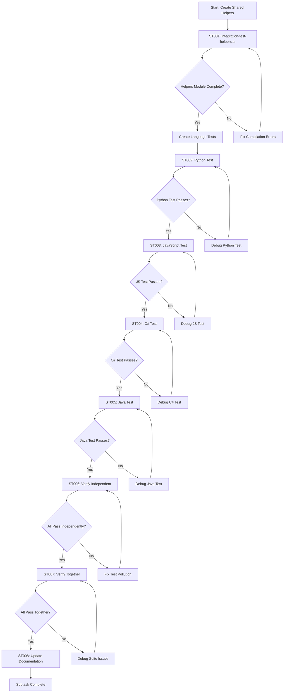
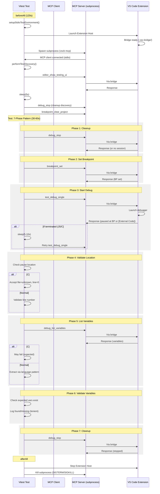

# Subtask 002: Unified Language Integration Tests

**Parent Plan**: [/Users/jordanknight/github/vsc-bridge/docs/plans/13-mcp-server-implementation/mcp-server-implementation-plan.md](../../mcp-server-implementation-plan.md)
**Parent Phase**: Phase 7: Integration Testing
**Parent Task(s)**: T005 (Add missing language workflows to stdio E2E test suite)
**Subtask Summary**: Create unified, language-specific integration test files with a shared 7-phase pattern for validating MCP debugging workflows
**Requested By**: Human Sponsor
**Created**: 2025-10-13

---

## Subtask Metadata

| Field | Value |
|-------|-------|
| Parent Plan | `/Users/jordanknight/github/vsc-bridge/docs/plans/13-mcp-server-implementation/mcp-server-implementation-plan.md` |
| Parent Phase | Phase 7: Integration Testing |
| Parent Task(s) | T005 (plan table ref: 7.2) |
| Subtask Summary | Create unified, language-specific integration test files with a shared 7-phase pattern |
| Requested By | Human Sponsor |
| Created | 2025-10-13 18:45 UTC |
| Status | PLANNING |

---

## Tasks

| Status | ID | Task | Type | Dependencies | Absolute Path(s) | Validation | Notes |
|--------|-----|------|------|-------------|------------------|------------|-------|
| [ ] | ST001 | Create shared integration test helpers module | Setup | – | /Users/jordanknight/github/vsc-bridge/cli/test/integration-mcp/shared/integration-test-helpers.ts | Module exports LanguageTestConfig interface, performTestDiscovery(), sleep(), validateVariableExists() | Supports T005; provides reusable utilities for all language tests |
| [ ] | ST002 | Create Python integration test file | Core | ST001 | /Users/jordanknight/github/vsc-bridge/cli/test/integration-mcp/languages/python-integration.test.ts | Test passes: 7 phases (cleanup → set BP → debug → validate location → list vars → validate vars → cleanup) | Supports T005; baseline pattern, no language quirks |
| [ ] | ST003 | Create JavaScript integration test file | Core | ST001, ST002 | /Users/jordanknight/github/vsc-bridge/cli/test/integration-mcp/languages/javascript-integration.test.ts | Test passes: includes retry logic (5s), object expansion validation | Supports T005; adds Jest discovery retry + object expansion |
| [ ] | ST004 | Create C# integration test file | Core | ST001, ST002 | /Users/jordanknight/github/vsc-bridge/cli/test/integration-mcp/languages/csharp-integration.test.ts | Test passes: handles [External Code] gracefully, debug_stop works from any state | Supports T005; most complex, accepts framework pauses |
| [ ] | ST005 | Create Java integration test file | Core | ST001, ST002 | /Users/jordanknight/github/vsc-bridge/cli/test/integration-mcp/languages/java-integration.test.ts | Test passes: extracts variables from nested scope (variables[0].children) | Supports T005; validates nested scope handling |
| [ ] | ST006 | Verify all 4 language tests pass independently | Test | ST002, ST003, ST004, ST005 | /Users/jordanknight/github/vsc-bridge/cli/test/integration-mcp/languages/*.test.ts | Run vitest for each file individually, all pass | Validates no cross-test pollution |
| [ ] | ST007 | Verify all 4 language tests pass together | Test | ST006 | /Users/jordanknight/github/vsc-bridge/cli/test/integration-mcp/languages/ | Run vitest for entire directory, all 4 tests pass in < 3 minutes | Final integration validation before merging |
| [ ] | ST008 | Update stdio-e2e.test.ts to reference new language tests | Doc | ST007 | /Users/jordanknight/github/vsc-bridge/cli/test/integration-mcp/stdio-e2e.test.ts | File documents that language-specific tests moved to languages/ directory | Maintains continuity, explains refactoring |

---

## Alignment Brief

### Objective Recap

Create a unified, maintainable structure for language-specific MCP integration tests by:

1. **Extracting shared patterns** into reusable helpers (LanguageTestConfig, test discovery, validation utilities)
2. **Creating focused test files** for each language (Python, JavaScript, C#, Java) using identical 7-phase structure
3. **Enabling parallel maintenance** so adding new test phases (e.g., "Phase 8: Step Over") takes < 10 minutes across all languages
4. **Simplifying debugging** with one test per language file, clear console output, language-specific comments

This addresses parent task T005 ("Add missing language workflows to stdio E2E test suite") by creating separate, well-structured test files instead of cramming all languages into stdio-e2e.test.ts.

### The 7-Phase Pattern

Every language test follows this identical structure:

1. **Phase 1: Cleanup** - Stop existing debug session
2. **Phase 2: Set Breakpoint** - Call `breakpoint_set` via MCP
3. **Phase 3: Start Debug** - Call `test_debug_single` via MCP (with retry logic for JS/C#)
4. **Phase 4: Validate Pause Location** - Check pause location (accept [External Code] for C#)
5. **Phase 5: List Variables** - Call `debug_list_variables` via MCP (extract based on language)
6. **Phase 6: Validate Variables** - Check expected vars exist (lenient validation)
7. **Phase 7: Cleanup** - Stop debug session cleanly

**Adaptations per language** are localized to specific phases (e.g., C# accepts [External Code] in Phase 4, Java extracts nested variables in Phase 5).

### Checklist Derived from Parent Acceptance Criteria

After subtask completion, the following must be true:

**Test Structure**:
- [ ] Four language-specific test files exist (python, javascript, csharp, java)
- [ ] All tests use identical 7-phase structure with language-specific adaptations
- [ ] Shared helpers module exists with reusable utilities
- [ ] Test discovery called once in beforeAll (not per-test)

**Test Validation**:
- [ ] Python test validates `result` variable (int, value 2)
- [ ] JavaScript test validates object expansion (variablesReference > 0 → children)
- [ ] C# test handles [External Code] gracefully (accepts file=unknown, line=0)
- [ ] Java test extracts nested variables (variables[0].children, ≥5 of 9 vars)
- [ ] All tests stop debug session cleanly (no orphaned sessions)

**Quality**:
- [ ] Each test file < 200 lines (focused, maintainable)
- [ ] Console output clear and actionable (logs phase progress with emojis)
- [ ] Test timeouts appropriate (30s for normal, 60s for C#/Java)
- [ ] No test pollution (each test cleanup before/after)

**Integration**:
- [ ] All 4 tests pass independently (run separately)
- [ ] All 4 tests pass together (run as suite)
- [ ] Total suite duration < 3 minutes (4 × ~30-45s each)
- [ ] Justfile target `test-integration-mcp` runs all language tests

### Critical Findings Affecting This Subtask

#### 🚨 Discovery: Language-Specific Variable Extraction Requires 3 Patterns

**What it constrains**: Each language adapter returns variables in different structures:

- **Python & JavaScript**: Flat array (`varsData.variables`)
- **C#**: Conditional nested (`varsData.variables[0]?.children || varsData.variables`)
- **Java**: Always nested (`varsData.variables[0].children`)

**How it's applied**:
- Shared helpers module provides `LanguageTestConfig.variableExtractor` function field
- Each language test defines extraction logic specific to its structure
- Tests use consistent validation logic after extraction

**Tasks addressing this**: ST001 (shared helpers), ST002-ST005 (language-specific tests)

---

#### 🚨 Discovery: Test Discovery Triggers Debug Sessions

**What it constrains**: `editor_show_testing_ui` (formerly `test_show_testing_ui`, migrated 2025-10-20) in `beforeAll` starts a debug session as side effect. This session must be stopped before tests run or they'll fail with "session already active."

**How it's applied**:
- Shared helper `performTestDiscovery()` calls `editor_show_testing_ui`, waits 5s, then calls `debug_stop`
- Also calls `breakpoint_clear_project` to remove discovery breakpoints
- Called once in each test file's `beforeAll`

**Tasks addressing this**: ST001 (performTestDiscovery helper)

---

#### 🚨 Discovery: MCP Error Responses Use Plain Text

**What it constrains**: Errors start with `[E_` prefix as plain text, not JSON. Must check before parsing.

**How it's applied**:
- All test files check `responseText.startsWith('[E_')` before `JSON.parse()`
- Prevents JSON parse errors when tools fail
- Pattern documented in shared helpers module

**Tasks addressing this**: ST001 (documentation), ST002-ST005 (error handling pattern)

---

#### 🚨 Discovery: C# [External Code] Is Expected, Not a Bug

**What it constrains**: C# debugger pauses at framework init 90% of time, NOT test code. Indicators: `file="unknown"`, `line=0`, `functionName="[External Code]"`.

**How it's applied**:
- C# test (ST004) has `acceptExternalCode: true` in config
- Phase 4 validates [External Code] indicators instead of test line
- Phase 5-6 wrapped in try-catch (variable inspection WILL fail at [External Code])
- Test goal: Prove `debug_stop` works from ANY pause state

**Tasks addressing this**: ST004 (C# test implementation)

---

#### 🚨 Discovery: Semantic Variable Validation Is Lenient by Design

**What it constrains**: Tests use "found X/Y expected variables" pattern, not strict equality. Reason: Language adapter variations, debugger versions, pause locations differ.

**Thresholds**:
- Python: Expect `result` (1/1 strict)
- JavaScript: Expect `calc` or `result` (1/2, lenient)
- C#: Expect `result` if at test code, accept failure at [External Code]
- Java: Require ≥5 of 9 variables (lenient for adapter variations)

**How it's applied**:
- Use `toBeGreaterThanOrEqual()`, not `toBe()` for counts
- Validate subset of expected variables, not all
- Log missing variables as warnings, not failures

**Tasks addressing this**: ST001 (validation helpers), ST002-ST005 (lenient assertions)

### Invariants & Guardrails

**Test Independence**:
- Each language test file must run independently (no shared state)
- Each test must cleanup before (Phase 1) and after (Phase 7)
- No assumptions about execution order

**Timeout Strategy**:
- Normal tests: 30s timeout (sufficient for most operations)
- C#/Java tests: 60s timeout (JVM/CoreCLR startup slower)
- Extension Host launch: 120s timeout (beforeAll)

**Error Handling**:
- All MCP calls wrapped in appropriate error checks
- C# variable inspection wrapped in try-catch (expected to fail at [External Code])
- Unknown errors logged with full context before re-throwing

**Console Output**:
- Use emoji prefixes for phase logging (🧹 Cleanup, 📍 Breakpoint, 🎯 Debug, etc.)
- Log discovered variables with types and values
- Log warnings (not errors) for missing expected variables

### Inputs to Read

Before implementation, review these files:

1. **Existing Test Pattern**:
   - `/Users/jordanknight/github/vsc-bridge/cli/test/integration-mcp/stdio-e2e.test.ts` (current Python test, lines 297-441)
   - Understand: beforeAll setup, afterAll cleanup, test structure, MCP tool calls

2. **Reference Workflows**:
   - `/Users/jordanknight/github/vsc-bridge/test/integration/cross-language-debug.test.ts` (CLI-based patterns for JS/C#/Java)
   - JavaScript: lines 402-546 (Jest retry, object expansion)
   - C#: lines 569-709 ([External Code] handling)
   - Java: lines 728-838 (nested scope extraction)

3. **Test Files** (understand debugger behaviors):
   - `/Users/jordanknight/github/vsc-bridge/test/python/test_example.py` (line 29: `result = subtract(5, 3)`)
   - `/Users/jordanknight/github/vsc-bridge/test/javascript/example.test.js` (line 533: `const result = processCalculation(calc, 5, 3)`)
   - `/Users/jordanknight/github/vsc-bridge/test/csharp/SampleTests/CalculatorTests.cs` (line 18: `int result = Add(2, 2)`)
   - `/Users/jordanknight/github/vsc-bridge/test/java/src/test/java/com/example/DebugTest.java` (line 28: `assertEquals(3, list.size())`)

4. **Helper Infrastructure**:
   - `/Users/jordanknight/github/vsc-bridge/cli/test/integration-mcp/helpers/stdio-test-client.ts` (Extension Host lifecycle, subprocess spawning)
   - Understand: setupStdioTestEnvironment(), cleanup patterns

### Visual Alignment Aids

#### Flow Diagram: Subtask Implementation Sequence



#### Sequence Diagram: 7-Phase Test Execution



### Test Plan

**Testing Approach**: Create unified language-specific integration tests with shared 7-phase pattern

**Test Structure**:
```
cli/test/integration-mcp/
├── shared/
│   └── integration-test-helpers.ts    # NEW: Shared utilities
└── languages/                          # NEW: Language-specific tests
    ├── python-integration.test.ts      # T-MCP-PYTHON-001
    ├── javascript-integration.test.ts  # T-MCP-JS-001
    ├── csharp-integration.test.ts      # T-MCP-CSHARP-001
    └── java-integration.test.ts        # T-MCP-JAVA-001
```

**Per-Language Test Structure** (identical across all 4 files):
```typescript
describe('[LANGUAGE] Integration Test via MCP', () => {
  let env: StdioTestEnvironment | undefined;

  beforeAll(async () => {
    env = await setupStdioTestEnvironment();
    await performTestDiscovery(env.client);
  }, 120000);

  afterAll(async () => {
    if (env) await env.cleanup();
  });

  it('should set breakpoint, debug, and read variables via MCP', async () => {
    // PHASE 1-7 implementation with language-specific adaptations
  }, TEST_TIMEOUT);
});
```

**Language-Specific Adaptations Table**:

| Phase | Python | JavaScript | C# | Java |
|-------|--------|------------|-------|------|
| 1: Cleanup | Standard | Standard | Standard | Standard |
| 2: Set BP | Standard | Standard | Standard | Standard |
| 3: Start Debug | No retry | Retry 5s if terminated | Retry 10s if terminated | No retry |
| 4: Validate Location | Normal | Accept line variance | Accept [External Code] | Normal |
| 5: List Vars | Flat extraction | Flat extraction | Conditional nested | Always nested |
| 6: Validate Vars | `['result']` (strict) | `['calc', 'result']` (lenient) | `['result']` (if at code) | `['i', 's', 'list']` (lenient 3/9) |
| 7: Cleanup | Standard | Standard | Standard | Standard |

**Test Validation Criteria** (per language):
- **Python**: Finds `result` variable (int, value 2), 1/1 strict validation
- **JavaScript**: Finds `calc` OR `result`, object expansion works (variablesReference > 0 → children)
- **C#**: Handles [External Code] gracefully (file=unknown, line=0), debug_stop works from any state
- **Java**: Finds ≥5 of 9 expected variables (`i`, `s`, `list`, `map`, `captured`, `r`, `pipeline`, `this`, `p`)

**Success Metrics**:
- Each language test: < 45 seconds execution time
- Suite total: < 3 minutes (4 × ~30-45s each)
- No zombie processes after suite completion
- No test pollution (each test independent)

### Step-by-Step Implementation Outline

Maps 1:1 to the task table (ST001-ST008).

#### ST001: Create Shared Helpers Module

**File**: `cli/test/integration-mcp/shared/integration-test-helpers.ts`

**Exports**:
```typescript
export interface LanguageTestConfig {
  testFile: string;
  breakpointLine: number;
  expectedVars: string[];
  sessionType?: string;
  variableExtractor: (varsData: any) => any[];
  acceptExternalCode?: boolean;
  discoveryDelay?: number;
}

export async function performTestDiscovery(client: Client): Promise<void>;
export function sleep(ms: number): Promise<void>;
export function validateVariableExists(variables: any[], varName: string, expectedType?: RegExp): boolean;
export { setupStdioTestEnvironment } from '../helpers/stdio-test-client.js';
```

**Implementation**:
1. Create `shared/` directory
2. Create `integration-test-helpers.ts` file
3. Define `LanguageTestConfig` interface with all language-specific fields
4. Implement `performTestDiscovery()`:
   - Call `editor_show_testing_ui`
   - Sleep 5s
   - Call `debug_stop`
   - Call `breakpoint_clear_project`
5. Implement `sleep()` helper (Promise wrapper for setTimeout)
6. Implement `validateVariableExists()` with type checking
7. Re-export `setupStdioTestEnvironment` from stdio-test-client

**Validation**: TypeScript compiles without errors, exports are importable

---

#### ST002: Create Python Integration Test

**File**: `cli/test/integration-mcp/languages/python-integration.test.ts`

**Test Structure**:
```typescript
const TEST_FILE = path.join(PROJECT_ROOT, 'test/python/test_example.py');
const BREAKPOINT_LINE = 29;

describe('Python Integration Test via MCP', () => {
  // beforeAll/afterAll setup

  it('should set breakpoint, debug, and read variables via MCP', async () => {
    // Phase 1-7 implementation
  }, 30000);
});
```

**Phase Implementation Details**:
1. **Phase 1**: Try `debug_stop`, ignore errors
2. **Phase 2**: `breakpoint_set` with TEST_FILE, BREAKPOINT_LINE
3. **Phase 3**: `test_debug_single`, expect `stopped` event
4. **Phase 4**: Validate `line` defined (may differ from BREAKPOINT_LINE)
5. **Phase 5**: `debug_list_variables` with `scope=local`, extract `varsData.variables` (flat)
6. **Phase 6**: Find `result` variable, validate type matches `/int/i`
7. **Phase 7**: `debug_stop`, expect success

**Validation**: Test passes, finds `result` variable with type int

---

#### ST003: Create JavaScript Integration Test

**File**: `cli/test/integration-mcp/languages/javascript-integration.test.ts`

**Key Differences from Python**:
- **Phase 3**: Add retry logic if `event === 'terminated'` (5s delay)
- **Phase 6**: Lenient validation (find `calc` OR `result`, accept if either found)
- Optional: Add object expansion test after Phase 6 (find object with `variablesReference > 0`, call `debug_get_variable`)

**Implementation**: Copy Python test, add retry logic, update expected variables

**Validation**: Test passes with retry handling, object expansion works

---

#### ST004: Create C# Integration Test

**File**: `cli/test/integration-mcp/languages/csharp-integration.test.ts`

**Key Differences from Python**:
- **Phase 3**: Add retry logic if `event === 'terminated'` (10s delay)
- **Phase 4**: Accept [External Code] indicators (`file === 'unknown'`, `line === 0`, `functionName === '[External Code]'`)
- **Phase 5-6**: Wrap in try-catch (variable inspection may fail at [External Code])
- **Phase 6**: If at [External Code], skip validation (log as acceptable)
- **Test Goal**: Prove `debug_stop` works from ANY pause state

**Implementation**: Copy Python test, add [External Code] handling, wrap Phase 5-6 in try-catch

**Validation**: Test passes regardless of pause location, debug_stop works

---

#### ST005: Create Java Integration Test

**File**: `cli/test/integration-mcp/languages/java-integration.test.ts`

**Key Differences from Python**:
- **Phase 5**: Extract variables from nested scope (`varsData.variables[0].children`)
- **Phase 6**: Lenient validation (find ≥5 of 9 expected variables: `i`, `s`, `list`, `map`, `captured`, `r`, `pipeline`, `this`, `p`)
- Use `toBeGreaterThanOrEqual(5)` instead of strict count

**Implementation**: Copy Python test, update variable extraction, add lenient validation

**Validation**: Test passes with ≥5 variables found in nested scope

---

#### ST006: Verify Independent Execution

**Process**:
1. Run each test file individually:
   - `npm test -- python-integration.test.ts`
   - `npm test -- javascript-integration.test.ts`
   - `npm test -- csharp-integration.test.ts`
   - `npm test -- java-integration.test.ts`
2. Verify all pass without errors
3. Check for no zombie processes (`ps aux | grep "vscb mcp"`)

**Validation**: All 4 tests pass when run separately

---

#### ST007: Verify Suite Execution

**Process**:
1. Run entire languages/ directory: `npm test -- languages/`
2. Verify all 4 tests pass
3. Check total duration < 3 minutes
4. Verify no zombie processes after suite

**Validation**: All 4 tests pass together, < 3 min total time

---

#### ST008: Update Documentation

**Changes**:
1. Update `stdio-e2e.test.ts`:
   - Add comment explaining Python test moved to `languages/python-integration.test.ts`
   - Keep connectivity tests (T-STDIO-000, T-STDIO-001)
2. Update `justfile` (if needed) to run `languages/*.test.ts`
3. Update parent `tasks.md` to reference new structure

**Validation**: Documentation accurate, links work

### Commands to Run

```bash
# 1. Create shared helpers directory
cd /Users/jordanknight/github/vsc-bridge/cli/test/integration-mcp
mkdir -p shared

# 2. Create languages directory
mkdir -p languages

# 3. Run tests during development (individual)
cd /Users/jordanknight/github/vsc-bridge
just build-cli
cd cli
npm test -- languages/python-integration.test.ts
npm test -- languages/javascript-integration.test.ts
npm test -- languages/csharp-integration.test.ts
npm test -- languages/java-integration.test.ts

# 4. Run all language tests together
npm test -- languages/

# 5. Run full MCP integration test suite
cd /Users/jordanknight/github/vsc-bridge
just test-integration-mcp

# 6. Check for zombie processes
ps aux | grep "vscb mcp"

# 7. Type checking
cd cli
npx tsc --noEmit
```

### Risks/Unknowns

| Risk | Severity | Mitigation |
|------|----------|------------|
| **Test discovery pollution between language tests** | Medium | Each test calls `performTestDiscovery()` independently in beforeAll; clears breakpoints after discovery |
| **C# test flakiness due to [External Code] timing** | Medium | Lenient validation, accepts [External Code] as normal; test goal is cleanup works |
| **Java nested scope extraction errors** | Low | Reference cross-language-debug.test.ts lines 786-788 for proven pattern |
| **JavaScript Jest pause location variance** | Low | Accept any pause location in Phase 4, log difference as informational |
| **Test timeout too short for slow CI** | Low | Use generous timeouts: 30s normal, 60s for C#/Java, 120s for beforeAll |
| **Zombie MCP server processes** | Medium | Graceful cleanup in afterAll (SIGTERM → SIGKILL with 5s timeout) |
| **Cross-test state pollution** | Low | Each test does Phase 1 cleanup, each afterAll stops Extension Host |

### Ready Check

Before proceeding with implementation:

- [x] Parent Phase 7 context understood (stdio E2E only strategy)
- [x] Existing test patterns reviewed (stdio-e2e.test.ts, cross-language-debug.test.ts)
- [x] Language-specific test files analyzed (Python, JS, C#, Java)
- [x] Test infrastructure ready (stdio-test-client.ts, Extension Host lifecycle)
- [ ] Human sponsor approval to proceed

**GO/NO-GO Decision Point**: Await explicit GO from human sponsor before beginning implementation.

---

## Evidence Artifacts

Implementation evidence will be written to:
- **Execution Log**: `/Users/jordanknight/github/vsc-bridge/docs/plans/13-mcp-server-implementation/tasks/phase-7/002-subtask-unified-language-integration-tests.execution.log.md`
- **Test Output**: Captured in execution log (vitest results for 4 language tests)
- **Modified Files**: Changes tracked in execution log with line numbers

## Directory Layout

```
docs/plans/13-mcp-server-implementation/tasks/phase-7/
├── tasks.md                                                    # Parent phase tasks
├── 001-subtask-rename-cli-aliases-mcp-compatibility.md        # Previous subtask
├── 002-subtask-unified-language-integration-tests.md          # This file
└── 002-subtask-unified-language-integration-tests.execution.log.md  # Created by plan-6
```

```
cli/test/integration-mcp/
├── stdio-e2e.test.ts                    # Keep connectivity tests only
├── shared/                              # NEW
│   └── integration-test-helpers.ts      # ST001
├── languages/                           # NEW
│   ├── python-integration.test.ts       # ST002
│   ├── javascript-integration.test.ts   # ST003
│   ├── csharp-integration.test.ts       # ST004
│   └── java-integration.test.ts         # ST005
└── helpers/
    └── stdio-test-client.ts             # Existing (Extension Host lifecycle)
```
