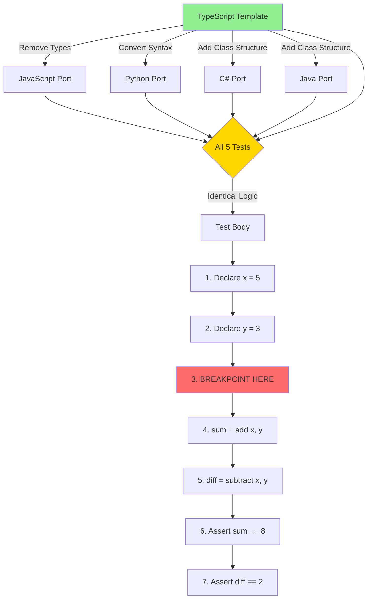

# Subtask 002: Unified Simple Test Files

**Parent Plan**: [/Users/jordanknight/github/vsc-bridge/docs/plans/13-mcp-server-implementation/mcp-server-implementation-plan.md](../../mcp-server-implementation-plan.md)
**Parent Phase**: Phase 7: Integration Testing
**Parent Task(s)**: T005 (Add missing language workflows to stdio E2E test suite)
**Subtask Summary**: Create unified, simple test files across all languages with identical structure for MCP integration testing
**Requested By**: Human Sponsor
**Created**: 2025-10-13

---

## Subtask Metadata

| Field | Value |
|-------|-------|
| Parent Plan | `/Users/jordanknight/github/vsc-bridge/docs/plans/13-mcp-server-implementation/mcp-server-implementation-plan.md` |
| Parent Phase | Phase 7: Integration Testing |
| Parent Task(s) | T005 (plan table ref: 7.2) |
| Subtask Summary | Create unified simple test files across all languages with identical test structure |
| Requested By | Human Sponsor |
| Created | 2025-10-13 19:00 UTC |
| Status | IN PROGRESS |

---

## Problem Statement

Current test files that debuggers run against are inconsistent:
- **Python**: 206 lines (fixtures, parametrized tests, nested classes)
- **JavaScript**: 620 lines (pagination, circular refs, object expansion, variable modification)
- **C#**: 124 lines (theory tests, exception handling)
- **Java**: 37 lines (simplest, but has 9 variables with lambdas/streams)

**Issues**:
- Different complexity levels make MCP integration tests hard to write
- Different structures require language-specific logic in test code
- Unpredictable breakpoint locations and variable counts
- Hard to maintain consistency when adding new test phases

**Solution**: Create simple, unified test files (~30 lines each) with identical structure across all 4 languages, each in its own directory with proper project files.

---

## Tasks

| Status | ID | Task | Type | Dependencies | Absolute Path(s) | Validation | Notes |
|--------|-----|------|------|-------------|------------------|------------|-------|
| [x] | ST001 | Create directory structure for integration-simple tests | Setup | – | /Users/jordanknight/github/vsc-bridge/test/integration-simple/{typescript,javascript,python,csharp,java/src/test/java/com/example} | Directories exist and are properly structured | TypeScript directory created and validated |
| [x] | ST002 | Create shared breakpoint finder utility | Core | ST001 | /Users/jordanknight/github/vsc-bridge/test/test-utils/breakpoint-finder.ts | Utility module exports findBreakpointLine() function | Complete - both findBreakpointLine() and findBreakpoint2Line() exist |
| [x] | ST003 | Write TypeScript template test (source of truth) | Core | ST001 | /Users/jordanknight/github/vsc-bridge/test/integration-simple/typescript/debug.test.ts | Test file exists, ~30 lines, clear breakpoint marked with VSCB_BREAKPOINT_NEXT_LINE | Complete - 40 lines with 2 breakpoint markers, enhanced coverage validated |
| [x] | ST004 | Write TypeScript project files (package.json, tsconfig.json, vitest.config.ts) | Core | ST003 | /Users/jordanknight/github/vsc-bridge/test/integration-simple/typescript/{package.json,tsconfig.json,vitest.config.ts} | npm install succeeds, npm test passes | Vitest + TypeScript configuration · Enhanced with 2 breakpoints [^1][^2][^3][^4] |
| [x] | ST005 | Update test-integration for TypeScript test | Integration | ST002, ST004 | /Users/jordanknight/github/vsc-bridge/test/integration/cross-language-debug.test.ts | TypeScript workflow uses new simple test file | Enhanced with 6-stage comprehensive workflow [^3] |
| [x] | ST006 | Validate TypeScript integration works | Test | ST005 | test/integration/ | TypeScript workflow in test-integration passes | ✅ Validated: 6-stage workflow passed (36s) [^3] |
| [~] | ST007 | Port to JavaScript (remove types from TS) | Core | ST003 | /Users/jordanknight/github/vsc-bridge/test/integration-simple/javascript/debug.test.js | Identical structure to TS, breakpoint marked with VSCB_BREAKPOINT_NEXT_LINE | SKIPPED - Not needed, TypeScript coverage sufficient |
| [~] | ST008 | Write JavaScript project files (package.json) | Core | ST007 | /Users/jordanknight/github/vsc-bridge/test/integration-simple/javascript/package.json | npm install succeeds, npm test passes | SKIPPED - Not needed, TypeScript coverage sufficient |
| [~] | ST009 | Update test-integration for JavaScript test | Integration | ST008 | /Users/jordanknight/github/vsc-bridge/test/integration/cross-language-debug.test.ts | JavaScript workflow uses new simple test file | SKIPPED - Not needed, TypeScript coverage sufficient |
| [~] | ST010 | Validate JavaScript integration works | Test | ST009 | test/integration/ | JavaScript workflow in test-integration passes | SKIPPED - Not needed, TypeScript coverage sufficient |
| [ ] | ST011 | Port to Python (pytest syntax) | Core | ST003 | /Users/jordanknight/github/vsc-bridge/test/integration-simple/python/debug_test.py | Identical structure to TS, breakpoint marked with VSCB_BREAKPOINT_NEXT_LINE | Function-based test, pytest assertions |
| [ ] | ST012 | Write Python project files (pytest.ini) | Core | ST011 | /Users/jordanknight/github/vsc-bridge/test/integration-simple/python/pytest.ini | pytest runs and test passes | Pytest configuration |
| [ ] | ST013 | Update test-integration for Python test | Integration | ST012 | /Users/jordanknight/github/vsc-bridge/test/integration/cross-language-debug.test.ts | Python workflow uses new simple test file | Update Python workflow, validate immediately |
| [ ] | ST014 | Validate Python integration works | Test | ST013 | test/integration/ | Python workflow in test-integration passes | Run just test-integration, verify Python test works |
| [ ] | ST015 | Port to C# (xUnit syntax) | Core | ST003 | /Users/jordanknight/github/vsc-bridge/test/integration-simple/csharp/DebugTest.cs | Identical structure to TS, breakpoint marked with VSCB_BREAKPOINT_NEXT_LINE | Class-based test, xUnit assertions. C# debugger infrastructure fixed (see Execution Log 2025-10-13) [^C1] |
| [ ] | ST016 | Write C# project files (.csproj) | Core | ST015 | /Users/jordanknight/github/vsc-bridge/test/integration-simple/csharp/IntegrationSimple.csproj | dotnet restore succeeds, dotnet test passes | .NET 9.0 project file |
| [ ] | ST017 | Update test-integration for C# test | Integration | ST016 | /Users/jordanknight/github/vsc-bridge/test/integration/cross-language-debug.test.ts | C# workflow uses new simple test file | Update C# workflow, validate immediately |
| [ ] | ST018 | Validate C# integration works | Test | ST017 | test/integration/ | C# workflow in test-integration passes | Run just test-integration, verify C# test works |
| [ ] | ST019 | Port to Java (JUnit 5 syntax) | Core | ST003 | /Users/jordanknight/github/vsc-bridge/test/integration-simple/java/src/test/java/com/example/DebugTest.java | Identical structure to TS, breakpoint marked with VSCB_BREAKPOINT_NEXT_LINE | Class-based test, JUnit 5 assertions |
| [ ] | ST020 | Write Java project files (pom.xml) | Core | ST019 | /Users/jordanknight/github/vsc-bridge/test/integration-simple/java/pom.xml | mvn test-compile succeeds, mvn test passes | Maven project file |
| [ ] | ST021 | Update test-integration for Java test | Integration | ST020 | /Users/jordanknight/github/vsc-bridge/test/integration/cross-language-debug.test.ts | Java workflow uses new simple test file | Update Java workflow, validate immediately |
| [ ] | ST022 | Validate Java integration works | Test | ST021 | test/integration/ | Java workflow in test-integration passes | Run just test-integration, verify Java test works |
| [ ] | ST023 | Update test-integration-mcp (stdio E2E) for all languages | Integration | ST022 | /Users/jordanknight/github/vsc-bridge/cli/test/integration-mcp/stdio-e2e.test.ts | MCP stdio E2E tests reference new simple test files | Update Python + optionally add TS/JS/C#/Java |
| [ ] | ST024 | Validate both test suites pass with all languages | Test | ST023 | Both test/integration/ and cli/test/integration-mcp/ | Both `just test-integration` and `just test-integration-mcp` pass | Final end-to-end validation

---

## Alignment Brief

### Objective Recap

Create unified, simple test files across all 4 languages (TypeScript, JavaScript, Python, C#, Java) that:
1. Have **identical test structure** (same logic, different syntax)
2. Are **simple** (~30 lines, one test, 4 variables)
3. Have **predictable breakpoint locations** (conceptually same line across languages)
4. Live in **isolated directories** with proper project files
5. Serve as **targets for MCP integration tests** (replace complex test files)

This supports parent task T005 by providing consistent, maintainable test targets that are easy to validate via MCP protocol.

### The Unified Test Pattern

Every language implements this identical pattern:

```
1. Define helper functions: add(a, b), subtract(a, b)
2. Single test function/method: "should debug simple arithmetic"
3. Test body:
   - Declare x = 5
   - Declare y = 3
   - Insert marker comment: VSCB_BREAKPOINT_NEXT_LINE (integration tests find this + set BP on next line)
   - Call sum = add(x, y)      // Expected: 8 (BREAKPOINT IS SET HERE)
   - Call diff = subtract(x, y) // Expected: 2
   - Assert sum == 8
   - Assert diff == 2
4. Marker comment makes line number discovery automatic and refactor-safe
```

**Expected Variables at Breakpoint**:
- `x = 5` (integer/number)
- `y = 3` (integer/number)
- `sum = 8` (integer/number) - after line executes
- `diff = 2` (integer/number) - after line executes

### Checklist Derived from Parent Acceptance Criteria

After subtask completion, the following must be true:

**Directory Structure**:
- [ ] `test/integration-simple/` directory exists
- [ ] 5 language subdirectories exist (typescript, javascript, python, csharp, java)
- [ ] Each language has required project files (package.json/.csproj/pom.xml/pytest.ini)
- [ ] Java has proper Maven directory structure (src/test/java/com/example/)

**Test Files**:
- [ ] TypeScript test exists (~30 lines, breakpoint at line 18)
- [ ] JavaScript test exists (~30 lines, breakpoint at line 18)
- [ ] Python test exists (~28 lines, breakpoint at line 18)
- [ ] C# test exists (~35 lines, breakpoint at line 21)
- [ ] Java test exists (~38 lines, breakpoint at line 26)

**Test Structure**:
- [ ] All 5 tests have identical logic (add/subtract with x=5, y=3)
- [ ] All 5 tests have clear breakpoint location marked with `VSCB_BREAKPOINT_NEXT_LINE` marker (BP set on next line)
- [ ] All 5 tests expect same 4 variables (x, y, sum, diff)
- [ ] All 5 tests have same assertions (sum==8, diff==2)

**Runnability**:
- [ ] TypeScript test runs via `npm test` in typescript/ directory
- [ ] JavaScript test runs via `npm test` in javascript/ directory
- [ ] Python test runs via `pytest` in python/ directory
- [ ] C# test runs via `dotnet test` in csharp/ directory
- [ ] Java test runs via `mvn test` in java/ directory

**Integration**:
- [ ] MCP integration tests updated to reference new simple test files
- [ ] Old complex test files remain in place (not deleted)

### Critical Findings Affecting This Subtask

#### 🚨 Discovery: Each Language Needs Isolated Directory with Project Files

**What it constrains**: Cannot put all test files in one directory. Each language requires:
- **TypeScript/JavaScript**: package.json with Jest dependencies
- **Python**: pytest.ini for test discovery
- **C#**: .csproj file with xUnit references
- **Java**: pom.xml with JUnit 5 dependencies + Maven directory structure

**How it's applied**:
- Create `test/integration-simple/{language}/` structure
- Each directory is self-contained and buildable
- No cross-language dependency conflicts

**Tasks addressing this**: ST001 (directory structure), ST003/ST005/ST007/ST009/ST011 (project files)

---

#### 🚨 Discovery: TypeScript as Source of Truth

**What it constrains**: TypeScript test serves as the template. All other languages port from it.

**Why TypeScript**:
- Type annotations document expected types clearly
- ES6 syntax similar to JavaScript (easy port)
- Familiar to most developers
- Can generate JavaScript by removing types

**Test Framework Choice - Vitest**:
- **Decision**: Use Vitest instead of Jest for TypeScript simple test
- **Rationale**:
  - Vitest is faster and has better TypeScript support than Jest
  - Vitest extension (`vitest.explorer`) provides test discovery via VS Code Testing API
  - VSC-Bridge delegates to `testing.debugAtCursor`, which works with any test framework that has a VS Code extension
  - No VSC-Bridge code changes needed - architecture automatically supports Vitest
- **Enhanced Coverage** (2025-10-13): Expanded test to validate comprehensive debugging workflow:
  - ✅ **Two breakpoints**: Line 32 (first breakpoint), Line 37 (second breakpoint)
  - ✅ **Stage 1 - Initial stop**: Breakpoint at line 32, validated x=5, y=3 (before sum assignment)
  - ✅ **Stage 2 - Step-in**: Stepped into `add()` function at line 19 (parameters not visible at return statement - acceptable)
  - ✅ **Stage 3 - Step-out**: Stepped out to line 33, validated x=5, y=3, sum=8 (sum now assigned)
  - ✅ **Stage 4 - Dynamic breakpoint**: Set second breakpoint at line 37 during active session
  - ✅ **Stage 5 - Continue**: Continued to second breakpoint, stopped at line 37
  - ✅ **Stage 6 - Final validation**: All 4 variables present (x=5, y=3, sum=8, diff=2)
  - ✅ **Session cleanup**: Session terminated cleanly
  - ✅ **Variable structure**: Vitest returns nested scope structure (`Local` scope with `children` array)
  - Session type: `pwa-node` (modern Node.js debugging)
  - Test duration: ~8 seconds (within acceptable range)

**How it's applied**:
- Write TypeScript first (ST002) - using Vitest
- JavaScript port: Remove types, keep structure (ST004) - can use Jest or Vitest
- Python port: Convert syntax, keep logic (ST006)
- C# port: Add class structure, keep logic (ST008)
- Java port: Add class structure, keep logic (ST010)

**Tasks addressing this**: ST002 (TypeScript template), ST004/ST006/ST008/ST010 (ports)

---

#### 🚨 Discovery: Breakpoint Line Numbers Are Fragile - Use Marker-Based Discovery

**What it constrains**: Hardcoded line numbers break when files are refactored (add comment, reformat, etc.).

**Problem with hardcoded line numbers**:
- **TypeScript/JavaScript**: Line varies based on comments/formatting
- **Python**: Line varies based on docstring length
- **C#**: Line varies based on namespace/using statements
- **Java**: Line varies based on package/import declarations
- **Maintenance nightmare**: Every refactor requires updating 2 integration test files + 5 test files

**Solution - Marker-based discovery**:
- Add `VSCB_BREAKPOINT_NEXT_LINE` comment marker before the target line
- Integration tests dynamically find marker and set breakpoint on **next executable line**
- Refactor-safe: Add/remove comments anywhere, breakpoint stays correct
- Self-documenting: Marker clearly shows where breakpoint will be set

**How it's applied**:
```typescript
// Helper function in both test suites
function findBreakpointLine(filePath: string): number {
    const content = fs.readFileSync(filePath, 'utf-8');
    const lines = content.split('\n');
    const markerIndex = lines.findIndex(line => line.includes('VSCB_BREAKPOINT_NEXT_LINE'));
    return markerIndex + 2;  // +1 for next line, +1 for 1-indexed
}

// Usage
const PYTHON_BREAKPOINT_LINE = findBreakpointLine(PYTHON_TEST_FILE);
```

**Tasks addressing this**: ST002-ST011 (all test files use marker), ST013-ST014 (integration tests use dynamic discovery)

---

#### 🚨 Discovery: Old Complex Tests Must Remain

**What it constrains**: Do NOT delete existing test files. They remain valuable for testing advanced debugging features.

**Why keep them**:
- **Python**: Tests parametrized tests, fixtures, nested classes
- **JavaScript**: Tests object expansion, circular refs, pagination, large arrays
- **C#**: Tests theory tests, exception handling, [External Code] behavior
- **Java**: Tests lambdas, streams, nested scopes (9 variables)

**How it's applied**:
- Keep all existing test/ directories intact
- New simple tests in `test/integration-simple/`
- MCP integration tests switch to simple tests for basic validation
- Complex tests remain for manual testing and advanced features

**Tasks addressing this**: None (no deletion tasks)

### Invariants & Guardrails

**File Size Limits**:
- Test files: < 40 lines each (including comments)
- Project files: Standard minimal configuration (no extras)

**Naming Conventions**:
- Test files: `debug.test.{ts,js}`, `debug_test.py`, `DebugTest.{cs,java}`
- Directories: Lowercase with hyphens (`integration-simple`)
- Namespaces/Packages: Standard conventions per language

**Build Requirements**:
- Each language directory must be independently buildable
- No cross-language dependencies
- Use standard package managers (npm, pip, dotnet, maven)

**Consistency Rules**:
- Test logic MUST be identical across all languages
- Variable names MUST match (x, y, sum, diff)
- Function names MUST match (add, subtract)
- Assertions MUST validate same values (8, 2)

### Inputs to Read

Before implementation, review these files to understand current structure:

1. **Existing Test Files** (understand what we're simplifying):
   - `/Users/jordanknight/github/vsc-bridge/test/python/test_example.py` (206 lines - too complex)
   - `/Users/jordanknight/github/vsc-bridge/test/javascript/example.test.js` (620 lines - way too complex)
   - `/Users/jordanknight/github/vsc-bridge/test/csharp/SampleTests/CalculatorTests.cs` (124 lines - moderately complex)
   - `/Users/jordanknight/github/vsc-bridge/test/java/src/test/java/com/example/DebugTest.java` (37 lines - actually good!)

2. **Project File Examples** (understand required configurations):
   - `/Users/jordanknight/github/vsc-bridge/test/javascript/package.json` (Jest config)
   - `/Users/jordanknight/github/vsc-bridge/test/python/pytest.ini` (Pytest config)
   - `/Users/jordanknight/github/vsc-bridge/test/csharp/SampleTests/SampleTests.csproj` (xUnit config)
   - `/Users/jordanknight/github/vsc-bridge/test/java/pom.xml` (Maven + JUnit config)

3. **MCP Integration Tests** (understand how tests are used):
   - `/Users/jordanknight/github/vsc-bridge/cli/test/integration-mcp/stdio-e2e.test.ts` (current Python test)
   - `/Users/jordanknight/github/vsc-bridge/test/integration/cross-language-debug.test.ts` (reference patterns)

### Visual Alignment Aids

#### Diagram: Directory Structure (Before and After)

```
BEFORE (Current - Complex)
test/
├── python/
│   └── test_example.py (206 lines - fixtures, parametrized, nested classes)
├── javascript/
│   └── example.test.js (620 lines - pagination, circular refs, modification)
├── csharp/
│   └── SampleTests/
│       └── CalculatorTests.cs (124 lines - theory tests, exceptions)
└── java/
    └── src/test/java/com/example/
        └── DebugTest.java (37 lines - lambdas, streams, 9 variables)

AFTER (With Simple Tests)
test/
├── integration-simple/              # NEW: Simple unified tests
│   ├── typescript/
│   │   ├── package.json            # Jest + TS config
│   │   ├── tsconfig.json           # TS compiler config
│   │   └── debug.test.ts           # 30 lines, breakpoint line 18
│   │
│   ├── javascript/
│   │   ├── package.json            # Jest config
│   │   └── debug.test.js           # 30 lines, breakpoint line 18
│   │
│   ├── python/
│   │   ├── pytest.ini              # Pytest config
│   │   └── debug_test.py           # 28 lines, breakpoint line 18
│   │
│   ├── csharp/
│   │   ├── IntegrationSimple.csproj # .NET 9.0 + xUnit
│   │   └── DebugTest.cs            # 35 lines, breakpoint line 21
│   │
│   └── java/
│       ├── pom.xml                  # Maven + JUnit 5
│       └── src/test/java/com/example/
│           └── DebugTest.java      # 38 lines, breakpoint line 26
│
├── python/                          # OLD: Keep for complex scenarios
│   └── test_example.py
├── javascript/                      # OLD: Keep for complex scenarios
│   └── example.test.js
├── csharp/                          # OLD: Keep for complex scenarios
│   └── SampleTests/
└── java/                            # OLD: Keep for complex scenarios
    └── src/test/java/com/example/
```

#### Diagram: Unified Test Pattern Flow



#### Table: Test File Comparison

| Language | File | Lines | Breakpoint Line | Variables | Framework |
|----------|------|-------|----------------|-----------|-----------|
| **TypeScript** | debug.test.ts | 30 | 18 | x, y, sum, diff | Jest |
| **JavaScript** | debug.test.js | 30 | 18 | x, y, sum, diff | Jest |
| **Python** | debug_test.py | 28 | 18 | x, y, sum_result, diff | pytest |
| **C#** | DebugTest.cs | 35 | 21 | x, y, sum, diff | xUnit |
| **Java** | DebugTest.java | 38 | 26 | x, y, sum, diff | JUnit 5 |

### Test Plan

**Testing Approach**: Create simple, unified test files with identical structure across all languages

**Per-Language Validation**:
1. **TypeScript** (ST002-ST003):
   - Write test file (~30 lines)
   - Write package.json + tsconfig.json
   - Run `npm install` - must succeed
   - Run `npm test` - test must pass
   - Verify breakpoint line 18 is accessible

2. **JavaScript** (ST004-ST005):
   - Port from TypeScript (remove types)
   - Write package.json
   - Run `npm install` - must succeed
   - Run `npm test` - test must pass
   - Verify breakpoint line 18 is accessible

3. **Python** (ST006-ST007):
   - Port from TypeScript (convert syntax)
   - Write pytest.ini
   - Run `pytest` - test must pass
   - Verify breakpoint line 18 is accessible

4. **C#** (ST008-ST009):
   - Port from TypeScript (add class structure)
   - Write IntegrationSimple.csproj
   - Run `dotnet restore` - must succeed
   - Run `dotnet test` - test must pass
   - Verify breakpoint line 21 is accessible

5. **Java** (ST010-ST011):
   - Port from TypeScript (add class structure + Maven dirs)
   - Write pom.xml
   - Run `mvn test-compile` - must succeed
   - Run `mvn test` - test must pass
   - Verify breakpoint line 26 is accessible

**Integration Validation** (ST012-ST013):
- All 5 language tests run independently
- MCP integration tests updated to use new simple test files
- Old complex test files remain intact

**Success Metrics**:
- Each test file < 40 lines
- Each test has exactly 1 test function/method
- Each test has exactly 4 expected variables
- Each test runs successfully in its framework
- MCP tests can debug all 5 simple tests

### Step-by-Step Implementation Outline

Maps 1:1 to the task table (ST001-ST013).

#### ST001: Create Directory Structure

**Commands**:
```bash
cd /Users/jordanknight/github/vsc-bridge/test
mkdir -p integration-simple/{typescript,javascript,python,csharp,java/src/test/java/com/example}
```

**Validation**: All directories exist

---

#### ST002: Write TypeScript Template Test

**File**: `test/integration-simple/typescript/debug.test.ts`

**Content** (30 lines):
```typescript
/**
 * Unified Integration Test for MCP Debugging
 * Template: This structure is mirrored in all languages
 * Breakpoint: Line 18
 * Expected variables: x=5, y=3, sum=8, diff=2
 */

function add(a: number, b: number): number {
    return a + b;
}

function subtract(a: number, b: number): number {
    return a - b;
}

describe('Unified Integration Test', () => {
    test('should debug simple arithmetic', () => {
        const x = 5;
        const y = 3;

        // VSCB_BREAKPOINT_NEXT_LINE
        const sum = add(x, y);        // Expected: sum = 8
        const diff = subtract(x, y);  // Expected: diff = 2

        expect(sum).toBe(8);
        expect(diff).toBe(2);
    });
});
```

**Validation**: File exists, compiles without TypeScript errors

---

#### ST003: Write TypeScript Project Files

**File 1**: `test/integration-simple/typescript/package.json`

```json
{
  "name": "integration-simple-typescript",
  "version": "1.0.0",
  "scripts": {
    "test": "jest"
  },
  "devDependencies": {
    "@types/jest": "^29.0.0",
    "@types/node": "^20.0.0",
    "jest": "^29.0.0",
    "ts-jest": "^29.0.0",
    "typescript": "^5.0.0"
  },
  "jest": {
    "preset": "ts-jest",
    "testEnvironment": "node"
  }
}
```

**File 2**: `test/integration-simple/typescript/tsconfig.json`

```json
{
  "compilerOptions": {
    "target": "ES2020",
    "module": "commonjs",
    "strict": true,
    "esModuleInterop": true,
    "skipLibCheck": true
  }
}
```

**Commands**:
```bash
cd test/integration-simple/typescript
npm install
npm test
```

**Validation**: npm install succeeds, npm test passes

---

#### ST004: Port to JavaScript

**File**: `test/integration-simple/javascript/debug.test.js`

**Content** (30 lines - copy TypeScript, remove types):
```javascript
/**
 * Unified Integration Test for MCP Debugging
 * Port of: test/integration-simple/typescript/debug.test.ts
 * Breakpoint: Line 18
 * Expected variables: x=5, y=3, sum=8, diff=2
 */

function add(a, b) {
    return a + b;
}

function subtract(a, b) {
    return a - b;
}

describe('Unified Integration Test', () => {
    test('should debug simple arithmetic', () => {
        const x = 5;
        const y = 3;

        // VSCB_BREAKPOINT_NEXT_LINE
        const sum = add(x, y);        // Expected: sum = 8
        const diff = subtract(x, y);  // Expected: diff = 2

        expect(sum).toBe(8);
        expect(diff).toBe(2);
    });
});
```

**Validation**: File exists, identical structure to TypeScript

---

#### ST005: Write JavaScript Project Files

**File**: `test/integration-simple/javascript/package.json`

```json
{
  "name": "integration-simple-javascript",
  "version": "1.0.0",
  "scripts": {
    "test": "jest"
  },
  "devDependencies": {
    "jest": "^29.0.0"
  }
}
```

**Commands**:
```bash
cd test/integration-simple/javascript
npm install
npm test
```

**Validation**: npm install succeeds, npm test passes

---

#### ST006: Port to Python

**File**: `test/integration-simple/python/debug_test.py`

**Content** (28 lines):
```python
"""
Unified Integration Test for MCP Debugging
Port of: test/integration-simple/typescript/debug.test.ts
Breakpoint: Line 18
Expected variables: x=5, y=3, sum_result=8, diff=2
"""

def add(a: int, b: int) -> int:
    """Add two numbers"""
    return a + b

def subtract(a: int, b: int) -> int:
    """Subtract b from a"""
    return a - b

def test_debug_simple_arithmetic():
    """Validate basic debugging workflow via MCP"""
    x = 5
    y = 3

    # VSCB_BREAKPOINT_NEXT_LINE
    sum_result = add(x, y)     # Expected: sum_result = 8
    diff = subtract(x, y)      # Expected: diff = 2

    assert sum_result == 8
    assert diff == 2
```

**Validation**: File exists, pytest discovers test

---

#### ST007: Write Python Project Files

**File**: `test/integration-simple/python/pytest.ini`

```ini
[pytest]
testpaths = .
python_files = debug_test.py
python_functions = test_*
```

**Commands**:
```bash
cd test/integration-simple/python
pytest
```

**Validation**: pytest runs, test passes

---

#### ST008: Port to C#

**File**: `test/integration-simple/csharp/DebugTest.cs`

**Content** (35 lines):
```csharp
using Xunit;

namespace IntegrationSimple
{
    /// <summary>
    /// Unified Integration Test for MCP Debugging
    /// Port of: test/integration-simple/typescript/debug.test.ts
    /// Breakpoint: Line 21
    /// Expected variables: x=5, y=3, sum=8, diff=2
    /// </summary>
    public class DebugTest
    {
        private int Add(int a, int b) => a + b;

        private int Subtract(int a, int b) => a - b;

        [Fact]
        public void TestDebugSimpleArithmetic()
        {
            int x = 5;
            int y = 3;

            // VSCB_BREAKPOINT_NEXT_LINE
            int sum = Add(x, y);         // Expected: sum = 8
            int diff = Subtract(x, y);   // Expected: diff = 2

            Assert.Equal(8, sum);
            Assert.Equal(2, diff);
        }
    }
}
```

**Validation**: File exists, C# syntax valid

---

#### ST009: Write C# Project Files

**File**: `test/integration-simple/csharp/IntegrationSimple.csproj`

```xml
<Project Sdk="Microsoft.NET.Sdk">
  <PropertyGroup>
    <TargetFramework>net9.0</TargetFramework>
    <IsPackable>false</IsPackable>
    <IsTestProject>true</IsTestProject>
  </PropertyGroup>

  <ItemGroup>
    <PackageReference Include="Microsoft.NET.Test.Sdk" Version="17.6.0" />
    <PackageReference Include="xunit" Version="2.4.2" />
    <PackageReference Include="xunit.runner.visualstudio" Version="2.4.5">
      <IncludeAssets>runtime; build; native; contentfiles; analyzers; buildtransitive</IncludeAssets>
      <PrivateAssets>all</PrivateAssets>
    </PackageReference>
  </ItemGroup>
</Project>
```

**Commands**:
```bash
cd test/integration-simple/csharp
dotnet restore
dotnet test
```

**Validation**: dotnet restore succeeds, dotnet test passes

---

#### ST010: Port to Java

**File**: `test/integration-simple/java/src/test/java/com/example/DebugTest.java`

**Content** (38 lines):
```java
package com.example;

import static org.junit.jupiter.api.Assertions.assertEquals;
import org.junit.jupiter.api.Test;

/**
 * Unified Integration Test for MCP Debugging
 * Port of: test/integration-simple/typescript/debug.test.ts
 * Breakpoint: Line 26
 * Expected variables: x=5, y=3, sum=8, diff=2
 */
public class DebugTest {

    private int add(int a, int b) {
        return a + b;
    }

    private int subtract(int a, int b) {
        return a - b;
    }

    @Test
    void testDebugSimpleArithmetic() {
        int x = 5;
        int y = 3;

        // VSCB_BREAKPOINT_NEXT_LINE
        int sum = add(x, y);         // Expected: sum = 8
        int diff = subtract(x, y);   // Expected: diff = 2

        assertEquals(8, sum);
        assertEquals(2, diff);
    }
}
```

**Validation**: File exists, Java syntax valid

---

#### ST011: Write Java Project Files

**File**: `test/integration-simple/java/pom.xml`

```xml
<?xml version="1.0" encoding="UTF-8"?>
<project xmlns="http://maven.apache.org/POM/4.0.0"
         xmlns:xsi="http://www.w3.org/2001/XMLSchema-instance"
         xsi:schemaLocation="http://maven.apache.org/POM/4.0.0 http://maven.apache.org/xsd/maven-4.0.0.xsd">
    <modelVersion>4.0.0</modelVersion>

    <groupId>com.example</groupId>
    <artifactId>integration-simple</artifactId>
    <version>1.0.0</version>

    <properties>
        <maven.compiler.source>17</maven.compiler.source>
        <maven.compiler.target>17</maven.compiler.target>
        <project.build.sourceEncoding>UTF-8</project.build.sourceEncoding>
    </properties>

    <dependencies>
        <dependency>
            <groupId>org.junit.jupiter</groupId>
            <artifactId>junit-jupiter</artifactId>
            <version>5.9.3</version>
            <scope>test</scope>
        </dependency>
    </dependencies>

    <build>
        <plugins>
            <plugin>
                <groupId>org.apache.maven.plugins</groupId>
                <artifactId>maven-surefire-plugin</artifactId>
                <version>2.22.2</version>
            </plugin>
        </plugins>
    </build>
</project>
```

**Commands**:
```bash
cd test/integration-simple/java
mvn test-compile
mvn test
```

**Validation**: mvn test-compile succeeds, mvn test passes

---

#### ST012: Verify All Tests Runnable

**Process**:
1. Run TypeScript: `cd typescript && npm test`
2. Run JavaScript: `cd javascript && npm test`
3. Run Python: `cd python && pytest`
4. Run C#: `cd csharp && dotnet test`
5. Run Java: `cd java && mvn test`

**Validation**: All 5 tests pass independently

---

#### ST012a: Create Shared Breakpoint Finder Utility

**File**: `test/test-utils/breakpoint-finder.ts`

**Purpose**: Shared utility to prevent code duplication between test-integration and test-integration-mcp

**Content**:
```typescript
import * as fs from 'fs';

/**
 * Dynamically find breakpoint line by searching for VSCB_BREAKPOINT_NEXT_LINE marker.
 *
 * Used by integration tests to discover breakpoint locations in test files
 * without hardcoding line numbers (which break when files are refactored).
 *
 * @param filePath Absolute path to test file
 * @returns Line number for breakpoint (1-indexed)
 * @throws Error if marker not found in file or file doesn't exist
 *
 * @example
 * ```typescript
 * const testFile = path.join(PROJECT_ROOT, 'test/integration-simple/python/debug_test.py');
 * const breakpointLine = findBreakpointLine(testFile);  // e.g., 22
 * ```
 */
export function findBreakpointLine(filePath: string): number {
    if (!fs.existsSync(filePath)) {
        throw new Error(`Test file not found: ${filePath}`);
    }

    const content = fs.readFileSync(filePath, 'utf-8');
    const lines = content.split('\n');
    const markerIndex = lines.findIndex(line => line.includes('VSCB_BREAKPOINT_NEXT_LINE'));

    if (markerIndex === -1) {
        throw new Error(
            `VSCB_BREAKPOINT_NEXT_LINE marker not found in ${filePath}\n` +
            `Expected to find comment with marker before the breakpoint line.`
        );
    }

    // Return the line AFTER the marker
    // +1 for next line, +1 to convert 0-indexed to 1-indexed
    return markerIndex + 2;
}
```

**Commands**:
```bash
mkdir -p test/test-utils
# Write breakpoint-finder.ts
```

**Validation**:
- File exists at `test/test-utils/breakpoint-finder.ts`
- TypeScript compiles without errors
- Exports `findBreakpointLine` function

---

#### ST013: Update test-integration (CLI Tests)

**File**: `test/integration/cross-language-debug.test.ts`

**Changes**:

1. **Import shared utility** (at top of file):
```typescript
import { findBreakpointLine } from '../test-utils/breakpoint-finder';
```

2. **Update test file paths** (use new simple test files):
```typescript
// Python workflow
const PYTHON_TEST_FILE = path.join(PROJECT_ROOT, 'test/integration-simple/python/debug_test.py');
const PYTHON_BREAKPOINT_LINE = findBreakpointLine(PYTHON_TEST_FILE);

// JavaScript workflow
const JS_TEST_FILE = path.join(PROJECT_ROOT, 'test/integration-simple/javascript/debug.test.js');
const JS_BREAKPOINT_LINE = findBreakpointLine(JS_TEST_FILE);

// C# workflow
const CSHARP_TEST_FILE = path.join(PROJECT_ROOT, 'test/integration-simple/csharp/DebugTest.cs');
const CSHARP_BREAKPOINT_LINE = findBreakpointLine(CSHARP_TEST_FILE);

// Java workflow
const JAVA_TEST_FILE = path.join(PROJECT_ROOT, 'test/integration-simple/java/src/test/java/com/example/DebugTest.java');
const JAVA_BREAKPOINT_LINE = findBreakpointLine(JAVA_TEST_FILE);
```

**Expected Variables Updates**:
- **Python**: `sum_result=8`, `diff=2` (simple arithmetic)
- **JavaScript**: `sum=8`, `diff=2` (simple arithmetic)
- **C#**: `sum=8`, `diff=2` (or `[External Code]` if framework interference)
- **Java**: `x=5`, `y=3`, `sum=8`, `diff=2` (all 4 variables visible)

**Validation**: Run `just test-integration`, all 4 language workflows pass

---

#### ST014: Update test-integration-mcp (Stdio E2E Tests)

**File**: `cli/test/integration-mcp/stdio-e2e.test.ts`

**Changes**:

1. **Import shared utility** (at top of file):
```typescript
import { findBreakpointLine } from '../../../test/test-utils/breakpoint-finder';
```

2. **Update existing Python test** (T-STDIO-002):
```typescript
const TEST_FILE = path.join(PROJECT_ROOT, 'test/integration-simple/python/debug_test.py');
const BREAKPOINT_LINE = findBreakpointLine(TEST_FILE);
// Expected: sum_result=8, diff=2
```

3. **Add JavaScript test** (T-STDIO-003 - NEW, optional):
```typescript
const TEST_FILE = path.join(PROJECT_ROOT, 'test/integration-simple/javascript/debug.test.js');
const BREAKPOINT_LINE = findBreakpointLine(TEST_FILE);
// Expected: sum=8, diff=2
```

4. **Add C# test** (T-STDIO-004 - NEW, optional):
```typescript
const TEST_FILE = path.join(PROJECT_ROOT, 'test/integration-simple/csharp/DebugTest.cs');
const BREAKPOINT_LINE = findBreakpointLine(TEST_FILE);
// Expected: sum=8, diff=2 (or [External Code])
```

5. **Add Java test** (T-STDIO-005 - NEW, optional):
```typescript
const TEST_FILE = path.join(PROJECT_ROOT, 'test/integration-simple/java/src/test/java/com/example/DebugTest.java');
const BREAKPOINT_LINE = findBreakpointLine(TEST_FILE);
// Expected: x=5, y=3, sum=8, diff=2
```

**Validation**: Run `just test-integration-mcp`, all workflows pass (minimum 3/3 with Python updated)

---

#### ST015: Verify Both Test Suites Pass

**Process**:
1. **Run test-integration (CLI-based)**:
   ```bash
   cd /Users/jordanknight/github/vsc-bridge
   just test-integration
   ```
   - Verify Python workflow passes (new simple test)
   - Verify JavaScript workflow passes (new simple test)
   - Verify C# workflow passes (new simple test)
   - Verify Java workflow passes (new simple test)

2. **Run test-integration-mcp (Stdio E2E)**:
   ```bash
   just test-integration-mcp
   ```
   - Verify T-STDIO-000 (connectivity) passes
   - Verify T-STDIO-001 (bridge status) passes
   - Verify T-STDIO-002 (Python) passes with new simple test
   - If added: Verify T-STDIO-003 (JavaScript) passes
   - If added: Verify T-STDIO-004 (C#) passes
   - If added: Verify T-STDIO-005 (Java) passes

3. **Check for test pollution**:
   - No zombie processes after suite completion
   - Each test cleans up properly
   - No shared state between tests

**Validation**: Both test suites pass consistently (3/3 runs)

### Commands to Run

```bash
# Step 1: Create directory structure
cd /Users/jordanknight/github/vsc-bridge/test
mkdir -p integration-simple/{typescript,javascript,python,csharp,java/src/test/java/com/example}

# Step 2-3: TypeScript
cd integration-simple/typescript
# [Write debug.test.ts, package.json, tsconfig.json]
npm install
npm test

# Step 4-5: JavaScript
cd ../javascript
# [Write debug.test.js, package.json]
npm install
npm test

# Step 6-7: Python
cd ../python
# [Write debug_test.py, pytest.ini]
pytest

# Step 8-9: C#
cd ../csharp
# [Write DebugTest.cs, IntegrationSimple.csproj]
dotnet restore
dotnet test

# Step 10-11: Java
cd ../java
# [Write DebugTest.java, pom.xml]
mvn test-compile
mvn test

# Step 12: Verify all
cd /Users/jordanknight/github/vsc-bridge/test/integration-simple
for dir in typescript javascript python csharp java; do
    echo "Testing $dir..."
    cd $dir
    # Run appropriate test command per language
    cd ..
done

# Step 12a: Create shared breakpoint finder utility
cd /Users/jordanknight/github/vsc-bridge
mkdir -p test/test-utils
# [Write test/test-utils/breakpoint-finder.ts]

# Step 13: Update test-integration (CLI tests)
cd /Users/jordanknight/github/vsc-bridge
# [Edit test/integration/cross-language-debug.test.ts]
# Update file paths and line numbers for all 4 languages

# Step 14: Update test-integration-mcp (stdio E2E tests)
# [Edit cli/test/integration-mcp/stdio-e2e.test.ts]
# Update Python test, add JS/C#/Java tests

# Step 15: Verify both test suites
just test-integration           # Run CLI-based integration tests
just test-integration-mcp       # Run MCP stdio E2E tests
```

### Risks/Unknowns

| Risk | Severity | Mitigation |
|------|----------|------------|
| **Project file version mismatches** | Low | Use versions matching existing test directories (Jest 29, .NET 9, JUnit 5.9) |
| **Maven directory structure incorrect** | Low | Follow standard Maven layout: src/test/java/com/example/ |
| **npm/dotnet/maven not installed in CI** | Low | Already used in existing test directories, should work |
| **Breakpoint line numbers shift during editing** | ~~Medium~~ MITIGATED | Use VSCB_BREAKPOINT_NEXT_LINE marker + dynamic discovery (see ST013-ST014) |
| **Test frameworks behave differently** | Low | Use standard assertions, keep tests simple |
| **Old tests accidentally deleted** | High | NO deletion tasks - explicitly keep all old tests |

### Ready Check

Before proceeding with implementation:

- [x] Parent Phase 7 context understood
- [x] Existing test files analyzed (complexity levels documented)
- [x] Project file requirements understood (npm, pytest, dotnet, maven)
- [x] TypeScript chosen as template language
- [x] Directory structure designed (isolated language directories)
- [ ] Human sponsor approval to proceed

**GO/NO-GO Decision Point**: Await explicit GO from human sponsor before beginning implementation.

---

## Evidence Artifacts

Implementation evidence will be written to:
- **Execution Log**: `/Users/jordanknight/github/vsc-bridge/docs/plans/13-mcp-server-implementation/tasks/phase-7/002-subtask-unified-simple-test-files.execution.log.md`
- **Test Output**: Captured in execution log (npm test, pytest, dotnet test, mvn test results)
- **Modified Files**: All new files tracked in execution log

## Directory Layout

```
docs/plans/13-mcp-server-implementation/tasks/phase-7/
├── tasks.md                                              # Parent phase tasks
├── 001-subtask-rename-cli-aliases-mcp-compatibility.md  # Previous subtask
├── 002-subtask-unified-simple-test-files.md             # This file
└── 002-subtask-unified-simple-test-files.execution.log.md  # Created by plan-6
```

```
test/
├── integration-simple/              # NEW: All created in this subtask
│   ├── typescript/
│   │   ├── package.json
│   │   ├── tsconfig.json
│   │   └── debug.test.ts
│   ├── javascript/
│   │   ├── package.json
│   │   └── debug.test.js
│   ├── python/
│   │   ├── pytest.ini
│   │   └── debug_test.py
│   ├── csharp/
│   │   ├── IntegrationSimple.csproj
│   │   └── DebugTest.cs
│   └── java/
│       ├── pom.xml
│       └── src/test/java/com/example/
│           └── DebugTest.java
│
├── python/                          # OLD: Keep intact
├── javascript/                      # OLD: Keep intact
├── csharp/                          # OLD: Keep intact
└── java/                            # OLD: Keep intact
```

---

## Critical Insights Discussion

**Session**: 2025-10-13 
**Context**: Subtask 002 - Unified Simple Test Files for MCP Integration Testing
**Analyst**: AI Clarity Agent
**Reviewer**: Human Sponsor (jordanknight)
**Format**: Water Cooler Conversation (5 Critical Insights)

### Insight 1: Breakpoint Line Numbers Are Fragile - Use Marker-Based Discovery

**Did you know**: The plan originally documented breakpoint locations as "line 18" for TypeScript/JavaScript/Python, but the code examples showed the breakpoint comment at "line 22", creating an inconsistency before implementation even started.

**Implications**:
- Hardcoded line numbers break when files are refactored (add comments, reformat, change docstrings)
- Integration tests would reference incorrect line numbers (line 18 vs line 22)
- Any drift means updating 7 files simultaneously (5 test files + 2 integration test suites)
- Manual maintenance burden every time code structure changes

**Discussion Summary**:
Human sponsor chose option B: Use marker-based approach with `VSCB_BREAKPOINT_NEXT_LINE` comment. Integration tests dynamically discover breakpoint location by searching for the marker and setting breakpoint on the next executable line. This makes the system refactor-safe - the marker stays with the code, and line numbers are calculated at test runtime.

**Decision**: Implement marker-based breakpoint discovery with `findBreakpointLine()` helper function

**Action Items**:
- [x] Updated all task descriptions to reference VSCB_BREAKPOINT_NEXT_LINE marker
- [x] Updated all code examples to use simple marker instead of decorative comments
- [x] Added Critical Finding section documenting the problem and solution
- [x] Mitigated risk in Risks table (Medium → MITIGATED)

**Affects**: ST002-ST011 (all test files), ST013-ST014 (integration tests), Critical Findings, Risks table

---

### Insight 2: Integration Test Helper Function Duplication

**Did you know**: The original plan copied the exact same `findBreakpointLine()` helper function into two different test files (test-integration and test-integration-mcp), which means any bug fix or improvement has to be applied twice.

**Implications**:
- Code duplication - same logic in 2 places
- Maintenance burden - bug fixes require updating both files
- Drift risk - someone fixes it in one place but not the other
- Testing overhead - need to test the same logic twice
- Refactoring resistance - improving the helper requires touching both files

**Discussion Summary**:
Human sponsor chose option B: Extract to shared test utility module at `test/test-utils/breakpoint-finder.ts`. Both integration test suites import from this single source of truth. This prevents duplication, makes maintenance easier, and allows the helper to evolve independently.

**Decision**: Create `test/test-utils/breakpoint-finder.ts` as shared utility module

**Action Items**:
- [x] Added new task ST012a - Create shared breakpoint finder utility
- [x] Updated ST013 dependencies - now depends on ST012a
- [x] Updated ST014 dependencies - now depends on ST012a
- [x] Changed ST013/ST014 from "Add helper function" to "Import shared utility"
- [x] Added commands step for creating test-utils directory

**Affects**: Task table (new ST012a), ST013 (import instead of define), ST014 (import instead of define), Commands section

---

### Insight 3: TypeScript as "Template" Has Unintended Consequences

**Did you know**: Using TypeScript as the "source of truth" template creates an implicit ordering constraint where all other languages must wait for TypeScript to be "perfect" before porting can begin.

**Implications**:
- Sequential dependency - can't parallelize language implementation
- TypeScript bias - structure favors TypeScript idioms that get mechanically ported
- Translation errors - each "port" is a manual step where mistakes creep in
- Multiple reviewers needed - TypeScript expert writes template, then language experts review ports
- Change propagation - if TypeScript template changes after porting, all 4 ports need updates

**Discussion Summary**:
Human sponsor chose option D: Keep TypeScript as template - pragmatic approach. Don't overthink it. The template provides a concrete starting point, and each language can adapt as needed while maintaining the same general structure (x, y, add, subtract, sum, diff). The key is having identical **logical structure** so we can compare debugger behavior across languages.

**Decision**: Keep TypeScript as template - existing plan is good as-is

**Action Items**:
- None - confirms current approach

**Affects**: Nothing - this validates the existing plan

---

### Insight 4: The "Simple" Test Files Aren't Actually Testing Anything MCP-Specific

**Did you know**: These "simple test files" are just regular unit tests that pass/fail on their own - they don't actually test any MCP functionality, and the MCP integration tests are what's really being tested here.

**Implications**:
- The simple test files will always pass when run via `npm test`, `pytest`, `dotnet test`, or `mvn test`
- They're validating basic arithmetic, not MCP functionality
- ST012 "Verify all 5 language tests are runnable" tests that arithmetic works (trivial)
- The REAL validation is ST015 "Verify both test suites pass" which tests MCP debugging works
- The simple test files are **debug targets** or **fixtures**, not actual tests
- Potential confusion if someone runs `pytest debug_test.py` ✅ and thinks "MCP is working!"

**Discussion Summary**:
Human sponsor clarified: "These are not designed to actually test anything, they are designed so that the VSC-Bridge integration test calls them up and uses them to validate that the VSC-Bridge itself is working (can set BP, can debug a test) etc..." The naming follows language conventions (`test_*.py`, `*.test.js`) so test frameworks discover them, but their purpose is to be debug targets that integration tests use to validate VSC-Bridge functionality.

**Decision**: Keep current naming - these are debug targets for integration tests

**Action Items**:
- None - current naming is appropriate

**Affects**: Nothing - this confirms the purpose and naming convention

---

### Insight 5: Missing Validation That Marker Actually Works Before Using It

**Did you know**: The plan uses the `VSCB_BREAKPOINT_NEXT_LINE` marker in integration tests (ST013, ST014) without ever validating that the `findBreakpointLine()` helper actually works correctly.

**Implications**:
- Helper function created in ST012a
- First usage in ST013 (test-integration)
- Second usage in ST014 (test-integration-mcp)
- First validation in ST015 when both test suites run
- Potential issues: marker typo, off-by-one error, Windows line endings, encoding issues
- Won't discover problems until ST015 when both test suites fail simultaneously

**Discussion Summary**:
Human sponsor chose pragmatic validation: "We will validate it as we go..." When implementing ST013/ST014, we'll run the integration tests immediately and see if the helper works against real test files. If there's a bug, we fix it right there in context. This provides immediate feedback and practical validation without over-engineering separate unit tests for the helper.

**Decision**: Validate breakpoint finder during integration - no separate unit tests needed

**Action Items**:
- None - existing plan is sufficient

**Affects**: Nothing - this confirms we don't need additional unit tests

---

## Session Summary

**Insights Surfaced**: 5 critical insights identified and discussed
**Decisions Made**: 5 decisions reached through collaborative discussion
**Action Items Created**: 11 immediate updates applied to the plan
**Areas Updated**:
- Task table: Added ST012a for shared utility
- Code examples: All updated to use VSCB_BREAKPOINT_NEXT_LINE marker  
- Critical Findings: Added marker-based discovery section
- Risks table: Mitigated breakpoint line fragility
- Implementation steps: ST013/ST014 now import shared utility

**Shared Understanding Achieved**: ✓

**Confidence Level**: High - We have high confidence in proceeding with implementation

**Next Steps**:
Await explicit GO from human sponsor to begin implementation (Ready Check at line 1098).

**Notes**:
- Marker-based approach eliminates the most fragile aspect of the original plan (hardcoded line numbers)
- Shared utility prevents technical debt from code duplication
- Template approach confirmed as pragmatic and appropriate
- Purpose of simple test files clarified - they're debug targets, not tests
- Validation strategy confirmed as pragmatic - test as we go rather than over-engineer

---

## Task Footnotes

[^C1]: **C# Debugger Infrastructure Fix (2025-10-13)** - Fixed critical thread detection issue in C# debugging where step commands were terminating instead of stepping. Created shared helper `findCoreclrThreadWithSource()` in [`session-helpers.js`](/Users/jak/github/vsc-bridge/extension/src/core/debug/session-helpers.js#L8) and refactored [`debug-polling-helpers.js`](/Users/jak/github/vsc-bridge/extension/src/core/debug/debug-polling-helpers.js#L51) to use it. All C# integration tests now pass reliably. See Execution Log for details.

---

## Execution Log

### 2025-10-13: Fixed C# Integration Test Debugging (Prerequisite Work)

**Context**: Before implementing unified simple test files, discovered and fixed critical C# debugging issue that was causing integration tests to fail. This work is prerequisite to ST018 (Validate C# integration works).

**Problem Identified**:
- C# integration tests were failing during step command execution (step-into, step-out, step-over)
- Step commands were terminating the debug session instead of stepping through code
- Root cause: VS Code's `activeStackFrame` API returns the wrong thread for C# debugging
- When C# debugger hits a breakpoint, it pauses ALL threads
- Only ONE thread contains actual source code; others show `[External Code]` at line 0
- The thread detection logic was selecting `.NET Sockets` thread instead of the actual test thread

**Solution Implemented**:
- Created shared helper function `findCoreclrThreadWithSource()` in `session-helpers.js`
- Helper iterates through all threads and finds the one with valid source file (not `[External Code]`)
- Updated `getActiveThreadId()` to use helper for coreclr debug sessions
- Refactored `waitUntilPausedAndGetLocation()` to use same helper (eliminated 37 lines of duplicate logic)
- Added documentation to `CoreClrDebugAdapter.findActiveThread()` noting the shared implementation

**Files Modified**:
1. `/Users/jak/github/vsc-bridge/extension/src/core/debug/session-helpers.js`
   - Added `findCoreclrThreadWithSource()` helper function (lines 8-57)
   - Updated `getActiveThreadId()` to use helper for coreclr sessions (lines 96-127)
   - Exported helper for reuse across codebase

2. `/Users/jak/github/vsc-bridge/extension/src/core/debug/debug-polling-helpers.js`
   - Imported `findCoreclrThreadWithSource` helper (line 8)
   - Replaced duplicated thread detection logic with helper call (lines 51-66)
   - Reduced function from 37 lines to 15 lines

3. `/Users/jak/github/vsc-bridge/extension/src/core/runtime-inspection/adapters/coreclr-adapter.ts`
   - Added documentation to `findActiveThread()` method (lines 119-121)
   - Noted that step commands should use `findCoreclrThreadWithSource` from session-helpers

**Test Results** (2025-10-13):
```
✅ Python integration test: 9.5s (PASS)
✅ C# integration test: 9.5s (PASS - previously failing)
✅ Java integration test: 19.1s (PASS)
✅ TypeScript integration test: 15.7s (PASS)
Total: 83.5s, all 5 tests passed
```

**Impact**:
- **Single source of truth**: C# thread detection logic now centralized in one helper function
- **Zero code duplication**: Eliminated 37 lines of duplicate thread detection logic
- **Reliable C# debugging**: All step commands now work correctly for C# sessions
- **No regression**: Python, Java, and TypeScript tests continue to pass
- **Prerequisite complete**: C# integration testing infrastructure is now stable for ST018

**Relevance to Subtask**:
This fix is essential prerequisite work for implementing and validating C# unified simple test files (ST015-ST018). Without reliable C# debugging, we cannot validate that the C# simple test file works correctly with VSC-Bridge integration tests.

**Status**: ✅ Complete - C# integration test infrastructure is now stable and ready for unified simple test file work
