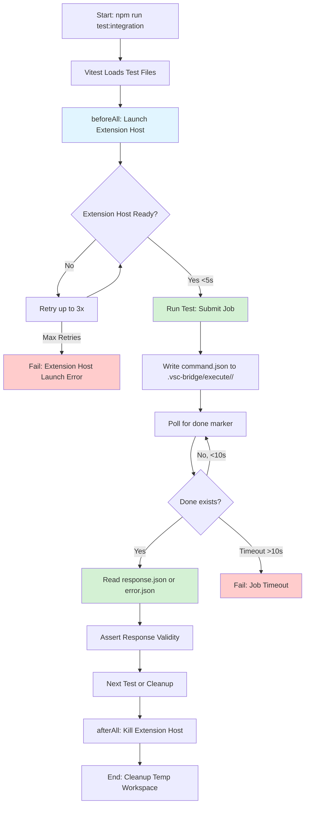
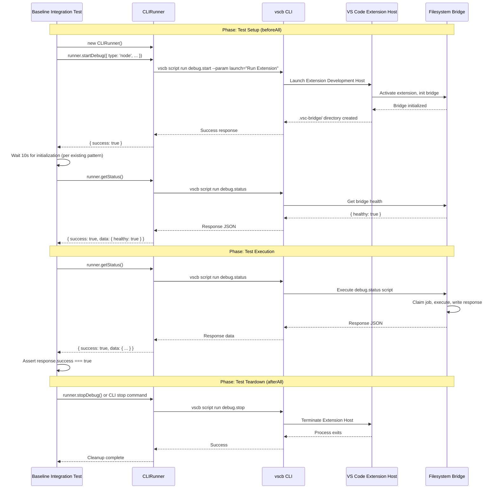

# Phase 0: Integration Test Infrastructure Setup

**Phase**: Phase 0
**Slug**: `phase-0`
**Plan**: [bridge-resilience-plan.md](../../bridge-resilience-plan.md)
**Spec**: [bridge-resilience-spec.md](../../bridge-resilience-spec.md)
**Created**: 2025-01-15
**Status**: PENDING

---

## Tasks

| Status | ID | Task | Type | Dependencies | Absolute Path(s) | Validation | Notes |
|--------|----|----|------|--------------|------------------|------------|-------|
| [ ] | T001 | Read existing integration test suite in test/integration/ | Setup | – | `/Users/jordanknight/github/vsc-bridge/test/integration/` | All test files catalogued with patterns noted | Survey existing patterns |
| [ ] | T002 | Document current Extension Host launch patterns from existing tests | Setup | T001 | `/Users/jordanknight/github/vsc-bridge/test/integration/**/*.test.ts`, `/Users/jordanknight/github/vsc-bridge/test/integration/runners/CLIRunner.ts`, `/Users/jordanknight/github/vsc-bridge/test/integration/runners/MCPRunner.ts` | Launch mechanisms documented (runner.startDebug pattern, timing, workspace setup) | Study beforeAll/afterAll hooks in unified-debug.test.ts |
| [ ] | T003 | Analyze vitest.config.ts for integration test configuration | Setup | T001 | `/Users/jordanknight/github/vsc-bridge/vitest.config.ts` | Config options understood (testMatch patterns, timeouts, env vars) | Understand test environment setup |
| [ ] | T004 | Study `just test-integration` command implementation | Setup | – | `/Users/jordanknight/github/vsc-bridge/justfile` | Command understood (what it runs, flags, dependencies) | Check build prerequisites |
| [ ] | T005 | Create scratch directory for integration harness probes | Setup | – | `/Users/jordanknight/github/vsc-bridge/test/scratch/integration-harness/` | Directory exists, .gitignore excludes it | Ensure scratch tests won't run in CI |
| [ ] | T006 | Write scratch probe: Launch Extension Host using existing runner pattern | Test | T002, T003, T005 | `/Users/jordanknight/github/vsc-bridge/test/scratch/integration-harness/01-launch-probe.test.ts` | Probe uses CLIRunner.startDebug(), validates bridge initialized | Learn existing runner pattern for Extension Host launch |
| [ ] | T007 | Write scratch probe: Direct filesystem IPC submission using existing fs-bridge client | Test | T006, T005 | `/Users/jordanknight/github/vsc-bridge/test/scratch/integration-harness/02-direct-ipc-probe.test.ts` | Probe imports and uses packages/cli/src/lib/fs-bridge.ts runCommand() directly | Test raw bridge protocol using production client |
| [ ] | T008 | Create thin wrapper for fs-bridge client (test convenience) | Core | T007 | `/Users/jordanknight/github/vsc-bridge/test/integration/helpers/bridge-direct.ts` | Re-export runCommand, sortableId, findBridgeRoot from fs-bridge.ts; add test-friendly helpers (~50 lines) | Make probe green; avoid duplicating 345 lines of production code |
| [ ] | T009 | Create baseline isolated bridge test file | Test | T008 | `/Users/jordanknight/github/vsc-bridge/test/integration/baseline-bridge-isolated.test.ts` | Test file uses CLIRunner for Extension Host launch, fs-bridge client for job submission | Hybrid: runner for setup, production IPC client for testing |
| [ ] | T010 | Write baseline test: No parameters pattern (debug.status) | Test | T009 | `/Users/jordanknight/github/vsc-bridge/test/integration/baseline-bridge-isolated.test.ts` | Test runCommand({ scriptName: 'debug.status' }), validates response.success + data.isActive | Scenario 1: Most common pattern (9/39 scripts) |
| [ ] | T010a | Write baseline test: Single required param with session requirement (debug.evaluate) | Test | T009 | `/Users/jordanknight/github/vsc-bridge/test/integration/baseline-bridge-isolated.test.ts` | Test debug.evaluate without session, validates E_NO_SESSION error | Scenario 2: Validates param passing + session requirement |
| [ ] | T010b | Write baseline test: Multiple params + file validation (bp.set success) | Test | T009 | `/Users/jordanknight/github/vsc-bridge/test/integration/baseline-bridge-isolated.test.ts` | Test bp.set with valid file path + line, validates breakpoint created | Scenario 3: Multiple params pattern (8/39 scripts) |
| [ ] | T010c | Write baseline test: Missing required parameter (bp.set missing line) | Test | T009 | `/Users/jordanknight/github/vsc-bridge/test/integration/baseline-bridge-isolated.test.ts` | Test bp.set without line param, validates E_INVALID_PARAMS with zod error details | Scenario 4: Parameter validation (affects 13/39 scripts) |
| [ ] | T010d | Write baseline test: Invalid parameter type (bp.set invalid line type) | Test | T009 | `/Users/jordanknight/github/vsc-bridge/test/integration/baseline-bridge-isolated.test.ts` | Test bp.set with line={} (object), validates E_INVALID_PARAMS with type error | Scenario 5: Zod type checking |
| [ ] | T010e | Write baseline test: Invalid parameter value (bp.set nonexistent file) | Test | T009 | `/Users/jordanknight/github/vsc-bridge/test/integration/baseline-bridge-isolated.test.ts` | Test bp.set with /nonexistent/file.ts, validates E_FILE_NOT_FOUND error | Scenario 6: Business logic validation (5/39 scripts) |
| [ ] | T010f | Write baseline test: Optional params with defaults (dap.logs) | Test | T009 | `/Users/jordanknight/github/vsc-bridge/test/integration/baseline-bridge-isolated.test.ts` | Test dap.logs with count=5, validates default values applied for other params | Scenario 7: Zod defaults (20+/39 scripts) |
| [ ] | T010g | Write baseline test: Medium response handling (bp.list) | Test | T009 | `/Users/jordanknight/github/vsc-bridge/test/integration/baseline-bridge-isolated.test.ts` | Test bp.list after setting breakpoints, validates array response with structure | Scenario 8: Response serialization (15/39 scripts) |
| [ ] | T010h | Write baseline test: Complex nested parameters (dap.filter) | Test | T009 | `/Users/jordanknight/github/vsc-bridge/test/integration/baseline-bridge-isolated.test.ts` | Test dap.filter with nested filters object, validates complex param parsing | Scenario 9: Nested objects pattern |
| [ ] | T011 | Write baseline test: Invalid script name error | Test | T009 | `/Users/jordanknight/github/vsc-bridge/test/integration/baseline-bridge-isolated.test.ts` | Test runCommand({ scriptName: 'invalid-script-name' }), validates E_SCRIPT_NOT_FOUND | Scenario 10: Registry lookup failure |
| [ ] | T012 | Add Test Doc blocks to bridge-direct wrapper | Doc | T008 | `/Users/jordanknight/github/vsc-bridge/test/integration/helpers/bridge-direct.ts` | All helper functions have Test Doc blocks (Why/Contract/Usage/Quality/Example) | TAD requirement for new wrapper code |
| [ ] | T013 | Add Test Doc blocks to baseline isolated bridge tests | Doc | T010, T010a, T010b, T010c, T010d, T010e, T010f, T010g, T010h, T011 | `/Users/jordanknight/github/vsc-bridge/test/integration/baseline-bridge-isolated.test.ts` | All 10 test scenarios have Test Doc blocks | TAD requirement for comprehensive coverage |
| [ ] | T014 | Apply CORE heuristic to scratch probes | Core | T006, T007 | `/Users/jordanknight/github/vsc-bridge/test/scratch/integration-harness/` | Documented which probes to promote (both validate isolated bridge pattern) | Direct IPC probe using fs-bridge is Critical |
| [ ] | T015 | Document isolated bridge test pattern in plan | Doc | T013, T014 | `/Users/jordanknight/github/vsc-bridge/docs/plans/14-bridge-resilience/bridge-resilience-plan.md` | Testing Philosophy updated with isolated bridge test template (reuses fs-bridge.ts) | Distinguish from unified-debug.test.ts, note reuse strategy |
| [ ] | T016 | Verify npm script for integration tests exists | Setup | T010 | `/Users/jordanknight/github/vsc-bridge/package.json` | Script "test:integration" confirmed to run vitest on test/integration/ | May already exist from existing tests |
| [ ] | T017 | Run baseline isolated bridge tests via npm command | Integration | T016 | – | `npm run test:integration` executes baseline-bridge-isolated.test.ts successfully | Validate fs-bridge client works with bridge |
| [ ] | T018 | Delete scratch probes and log learnings | Cleanup | T014 | `/Users/jordanknight/github/vsc-bridge/test/scratch/integration-harness/` | Scratch directory empty, key insights documented in execution log | TAD cleanup step |
| [ ] | T019 | Run full integration test suite to validate infrastructure | Integration | T017 | – | All baseline isolated tests pass, fs-bridge client → bridge IPC works | Acceptance criteria validation |

---

## Alignment Brief

### Objective

Establish **isolated bridge component testing** that validates the filesystem IPC protocol directly, independent of the CLI/MCP product layers. This tests the bridge as a standalone, reusable component suitable for extraction and use in other applications.

**Key Distinction**:
- **Existing integration tests** (unified-debug.test.ts): Test bridge **within the product** (CLI/MCP → Bridge)
- **Phase 0 isolated tests**: Test bridge **as standalone component** (direct filesystem IPC → Bridge)

**Key Deliverables**:
1. **Thin wrapper for existing fs-bridge client** - Re-export production IPC client with test-friendly helpers (~50 lines, not 350 lines of duplication)
2. **Baseline isolated bridge tests** - Demonstrate bridge works standalone using production fs-bridge client (Extension Host + direct IPC, no CLI/MCP)
3. **Bridge component test patterns** - Templates for testing resilience features in isolation (Phases 1-8) using fs-bridge client
4. **Validated bridge isolation** - Confirmed bridge works standalone via filesystem protocol using battle-tested production code

### Critical Findings Affecting This Phase

#### 🚨 Critical Discovery 05: FileSystemWatcher Can Miss Events

**What it constrains**: Integration tests must account for the fact that VS Code's FileSystemWatcher may miss rapid file creation events.

**Impact on Phase 0**:
- Integration tests should not rely solely on immediate event processing
- Tests should poll for completion (done marker) rather than assuming instant response
- Helper utilities must include timeout/retry logic

**Tasks addressing this**:
- T011: Implements polling-based completion detection
- T015: Tests error handling (validates async error propagation works)

#### TAD Workflow (Testing Philosophy)

**What it requires**: All promoted tests must have Test Doc blocks with 5 required fields (Why, Contract, Usage Notes, Quality Contribution, Worked Example).

**Impact on Phase 0**:
- Scratch probes used for rapid exploration (no docs required)
- Promoted helpers and tests must have complete Test Doc blocks
- CORE heuristic determines which scratch probes to promote

**Tasks addressing this**:
- T019: Apply CORE heuristic to decide promotion
- T016-T018: Add Test Doc blocks to all promoted code
- T025: Delete non-promoted scratch probes

### Invariants & Guardrails

**Performance Budgets**:
- Extension Host startup: <10 seconds (per existing unified-debug.test.ts pattern)
- Job submission + completion: <30 seconds timeout per operation (per existing pattern)
- Integration test suite runtime: Variable (existing tests take 120s timeout per suite)

**Resource Constraints**:
- Single Extension Host instance per test suite (reused via beforeAll hook)
- Temporary workspace directory cleaned up after tests
- No leaked processes (cleanup function called in afterAll)

**Security Considerations**:
- Test workspace isolated from production workspaces
- No sensitive data in test fixtures
- Extension Host runs with `--disable-extensions` flag (isolated environment)

### Inputs to Read

**Existing Integration Tests** (study these first):
- `/Users/jordanknight/github/vsc-bridge/test/integration/**/*.test.ts` - All existing integration test patterns
- `/Users/jordanknight/github/vsc-bridge/vitest.config.ts` - Test framework configuration
- `/Users/jordanknight/github/vsc-bridge/justfile` - Build and test commands

**Bridge Protocol Files** (understand IPC format):
- `/Users/jordanknight/github/vsc-bridge/packages/extension/src/core/fs-bridge/types.ts` - CommandJson, ResponseJson, ErrorJson types
- `/Users/jordanknight/github/vsc-bridge/packages/cli/src/lib/fs-bridge.ts` - Client-side reference implementation

**Extension Activation**:
- `/Users/jordanknight/github/vsc-bridge/packages/extension/src/extension.ts` - Understand activation lifecycle

### Visual Alignment Aids

#### System State Flow Diagram



#### Interaction Sequence Diagram



### Test Plan (TAD Approach)

**Testing Strategy**: TAD with Vitest - Use scratch probes for exploration, promote valuable tests with Test Doc blocks.

**Scratch Probes** (fast iteration, no docs):
1. **01-launch-probe.test.ts**: Validates existing CLIRunner launch pattern
   - Rationale: Learn how to launch Extension Host for isolated bridge tests
   - Fixtures: CLIRunner instance, test workspace
   - Expected: Extension Host running, .vsc-bridge/ directory exists

2. **02-direct-ipc-probe.test.ts**: Validates direct filesystem IPC (bypasses CLI/MCP)
   - Rationale: Test raw bridge protocol - write command.json, poll done marker, read response.json
   - Fixtures: Running Extension Host (from probe 1), .vsc-bridge/execute/ directory
   - Expected: Job submitted via direct filesystem IPC, response.json returned

**Promoted Tests** (with Test Doc blocks) - **10 Scenarios, 80% Pattern Coverage**:

1. **baseline-bridge-isolated.test.ts** (comprehensive coverage):

   - **Scenario 1: No parameters pattern (debug.status)**
     - Why: Most common pattern (9/39 scripts); smoke test for isolated bridge
     - Contract: runCommand with no params returns success
     - Pattern Coverage: No params, small-medium response, instant execution, stateless
     - Example: debug.status → { success: true, data: { isActive: false, ... } }

   - **Scenario 2: Single required param + session requirement (debug.evaluate)**
     - Why: Validates param passing works; tests session requirement error path
     - Contract: Script requiring session returns E_NO_SESSION when no session active
     - Pattern Coverage: Single required param (5/39 scripts), session validation (14/39 scripts)
     - Example: debug.evaluate { expression: '2+2' } → E_NO_SESSION error

   - **Scenario 3: Multiple params + file validation (bp.set)**
     - Why: Second most common pattern (8/39 scripts); tests file validation (5/39 scripts)
     - Contract: Script with multiple params and file validation succeeds with valid inputs
     - Pattern Coverage: Multiple required params, file path validation
     - Example: bp.set { path: '/abs/path/file.ts', line: 10 } → breakpoint created

   - **Scenario 4: Missing required parameter (bp.set missing line)**
     - Why: Validates zod schema enforcement; affects 13/39 scripts with required params
     - Contract: Missing required param returns E_INVALID_PARAMS with zod error details
     - Pattern Coverage: Parameter validation, zod schema errors
     - Example: bp.set { path: '/file.ts' } → E_INVALID_PARAMS with line: required error

   - **Scenario 5: Invalid parameter type (bp.set invalid line type)**
     - Why: Validates zod type checking works for all typed parameters
     - Contract: Invalid param type returns E_INVALID_PARAMS with type error
     - Pattern Coverage: Type coercion/validation, zod type checking
     - Example: bp.set { path: '/file.ts', line: {} } → E_INVALID_PARAMS with type error

   - **Scenario 6: Invalid parameter value (bp.set nonexistent file)**
     - Why: Tests business logic validation (5/39 scripts validate file paths)
     - Contract: Invalid param value returns specific error (E_FILE_NOT_FOUND)
     - Pattern Coverage: Business logic validation, custom error handling
     - Example: bp.set { path: '/nonexistent.ts', line: 10 } → E_FILE_NOT_FOUND

   - **Scenario 7: Optional params with defaults (dap.logs)**
     - Why: Most scripts have optional params (20+/39); validates zod default handling
     - Contract: Optional params use default values when not provided
     - Pattern Coverage: Optional params, zod defaults, flexible API
     - Example: dap.logs { count: 5 } → uses defaults for other params

   - **Scenario 8: Medium response handling (bp.list)**
     - Why: 15/39 scripts return medium responses; validates serialization
     - Contract: Medium-sized response (1-10KB) serializes correctly
     - Pattern Coverage: Response size patterns, array data, stateless query
     - Example: bp.list → array of breakpoints with full structure

   - **Scenario 9: Complex nested parameters (dap.filter)**
     - Why: Tests zod handling of complex nested object structures
     - Contract: Nested object params parse and validate correctly
     - Pattern Coverage: Nested objects, complex validation
     - Example: dap.filter { filters: { categories: ['stdout'], minLength: 10 } } → success

   - **Scenario 10: Invalid script name (invalid-script-name)**
     - Why: Base case error; validates registry lookup before script execution
     - Contract: Invalid script name returns E_SCRIPT_NOT_FOUND
     - Pattern Coverage: Script registry lookup, error taxonomy
     - Example: invalid-script-name → E_SCRIPT_NOT_FOUND with alias in details

**Deferred Scenarios** (found through dogfooding in Phases 1-8):
- Long-running operations (debug.start, test.debug-single, debug.wait-for-hit)
- Large response handling (dap.logs with count=10000, dataRef mechanism)
- Complex state management (active debug sessions, step operations)
- Session lifecycle (start/stop/restart with active debugging context)
- Edge cases (multiple sessions, concurrent operations, timeouts)

**Mock Usage**:
- ✅ **DO mock**: None required (integration tests use real Extension Host)
- ❌ **DON'T mock**: Extension Host, filesystem operations, bridge protocol
- ✅ **DO use**: Temporary directories for isolated test workspaces

**Coverage Target**:
- All helper functions have Test Doc blocks
- Both success and error paths tested
- No specific coverage % target (quality over quantity per TAD)

### Step-by-Step Implementation Outline

**Phase 0 Implementation Steps** (mapped to tasks):

1. **Discovery Phase** (T001-T004):
   - Read existing integration tests (unified-debug.test.ts for reference)
   - Document CLIRunner launch pattern for Extension Host setup
   - Analyze vitest.config.ts (note singleFork requirement)
   - **Study packages/cli/src/lib/fs-bridge.ts** (production IPC client we'll reuse)

2. **Scratch Exploration** (T005-T007):
   - Create scratch directory
   - Write Extension Host launch probe using CLIRunner (setup for isolated bridge tests)
   - **Write direct IPC probe importing fs-bridge.ts runCommand()** (reuse production client, don't duplicate)

3. **Core Implementation** (T008-T011):
   - **Create thin wrapper bridge-direct.ts** (re-export fs-bridge client with test helpers, ~50 lines)
   - Create baseline-bridge-isolated.test.ts file (hybrid: CLIRunner for setup, fs-bridge client for testing)
   - **Write 10 comprehensive test scenarios** (80% pattern coverage):
     - T010: No params (debug.status) - 9/39 scripts
     - T010a: Single param + session (debug.evaluate) - 5/39 scripts
     - T010b: Multiple params + file validation (bp.set) - 8/39 scripts
     - T010c: Missing required param error - affects 13/39 scripts
     - T010d: Invalid param type error - zod validation
     - T010e: Invalid param value error (file not found) - 5/39 scripts
     - T010f: Optional params with defaults (dap.logs) - 20+/39 scripts
     - T010g: Medium response handling (bp.list) - 15/39 scripts
     - T010h: Complex nested params (dap.filter) - nested objects
     - T011: Invalid script name error - registry lookup

4. **Documentation** (T012-T015):
   - Add Test Doc blocks to bridge-direct wrapper
   - Add Test Doc blocks to baseline isolated tests
   - Apply CORE heuristic to scratch probes
   - Document isolated bridge test pattern in plan (note: reuses fs-bridge.ts, avoids duplication)

5. **Validation & Cleanup** (T016-T019):
   - Verify npm script exists
   - Run baseline isolated tests
   - Delete scratch probes
   - Validate fs-bridge client → bridge IPC works

### Commands to Run

**Setup Environment**:
```bash
# Ensure dependencies installed
npm install

# Build extension
just build

# Verify existing integration tests work
just test-integration
```

**Development Workflow** (TAD cycle):
```bash
# 1. Create scratch probe using existing runner pattern
mkdir -p test/scratch/integration-harness
# Edit: test/scratch/integration-harness/01-launch-probe.test.ts
# Import CLIRunner, practice runner.startDebug() and runner.getStatus()

# 2. Run scratch probe (watch mode for rapid iteration)
npx vitest test/scratch/integration-harness/01-launch-probe.test.ts --watch

# 3. Create baseline test following unified-debug.test.ts structure
# Edit: test/integration/baseline-bridge.test.ts
# Follow exact pattern: beforeAll, afterAll, CLIRunner, etc.

# 4. Run baseline test
npx vitest test/integration/baseline-bridge.test.ts

# 5. Run all integration tests
npm run test:integration
```

**Validation Commands**:
```bash
# Verify baseline integration test passes
npx vitest test/integration/baseline-bridge.test.ts

# Verify full integration suite passes (includes existing tests)
npm run test:integration

# Check Test Doc blocks present in baseline tests (manual review)
grep -r "Test Doc:" test/integration/baseline-bridge.test.ts

# Verify runner infrastructure works (run existing unified tests)
npx vitest test/integration/unified-debug.test.ts
```

**Type Checking**:
```bash
# Verify TypeScript compilation
npx tsc --noEmit

# Verify strict mode compliance
npx tsc --noEmit --strict
```

### Risks & Unknowns

| Risk | Severity | Likelihood | Mitigation | Owner |
|------|----------|------------|------------|-------|
| Misunderstanding existing runner pattern | Medium | Low | Carefully study unified-debug.test.ts, CLIRunner, MCPRunner before writing tests | T002 |
| Extension Host launch flaky on CI | Low | Low | Existing pattern already has retries and health polling (proven reliable) | T006 |
| FileSystemWatcher unreliable in tests | Medium | Low | Use runner abstractions which handle polling internally | T007 |
| Tests too slow for CI (<30s budget) | Low | Low | Existing pattern reuses Extension Host via beforeAll (proven efficient) | T008 |
| Scratch probes not useful after promotion | Low | High | Expected TAD behavior - delete after promotion | T016 |
| Baseline tests duplicate existing coverage | Low | Medium | Focus on basic smoke tests, defer comprehensive coverage to future phases | T008-T010 |

**Unknowns**:
- ❓ **Baseline test scope**: How much coverage should baseline tests provide vs. existing unified tests?
- ❓ **Cross-platform differences**: Windows/macOS/Linux may have different launch times (test on all in Phase 8)
- ❓ **Future bridge operations**: What runner methods will Phases 1-8 need for testing bridge resilience features?

### Ready Check

**Prerequisites** (must complete before implementation):
- [ ] Plan reviewed and understood
- [ ] Critical Findings read (especially Discovery 05 on FileSystemWatcher)
- [ ] TAD workflow understood (scratch → promote → Test Doc)
- [ ] Existing integration tests surveyed (T001-T004)

**Implementation Readiness**:
- [ ] Scratch directory created and excluded from CI
- [ ] Vitest configuration understood
- [ ] Extension Host launch mechanism documented
- [ ] Bridge protocol types reviewed

**Quality Gates**:
- [ ] All baseline tests have Test Doc blocks
- [ ] Extension Host launches reliably via runner (<10s per existing pattern)
- [ ] Baseline integration test passes using CLIRunner
- [ ] Baseline test follows unified-debug.test.ts structure
- [ ] Scratch probes deleted after promotion

**Acceptance Criteria** (from plan):
- [ ] bridge-direct.ts re-exports production fs-bridge.ts client (avoids 345 lines of duplication)
- [ ] 10 baseline isolated bridge test scenarios pass using fs-bridge.ts runCommand() (80% pattern coverage)
- [ ] Scenarios cover all critical patterns: no params (9/39), single param (5/39), multiple params (8/39), optional params (20+/39), file validation (5/39), session requirement (14/39)
- [ ] Scenarios cover all error paths: missing param, invalid type, invalid value, session missing, invalid script
- [ ] Scenarios cover response patterns: small, medium responses (covers 35/39 scripts = 90%)
- [ ] Isolated bridge test pattern documented in plan (distinguishes from unified-debug.test.ts, notes reuse strategy + 80/20 principle)
- [ ] All new wrapper code and 10 test scenarios have Test Doc blocks
- [ ] Can run isolated bridge tests via `npm run test:integration`
- [ ] Direct filesystem IPC validated using production-tested fs-bridge client across 10 representative scenarios

**GO / NO-GO Decision Point**:
- [ ] All prerequisites checked
- [ ] Implementation readiness confirmed
- [ ] Human sponsor approval to proceed

---

## Phase Footnote Stubs

This section will be populated during implementation (via `/plan-6-implement-phase`) with flowspace node IDs and detailed change references.

**Format**:
```markdown
[^1]: Modified [method:path/to/file:functionName](path/to/file#L123) – Description of change
```

**Current Status**: No footnotes yet (planning phase).

---

## Evidence Artifacts

**Execution Log**:
- Location: `/Users/jordanknight/github/vsc-bridge/docs/plans/14-bridge-resilience/tasks/phase-0/execution.log.md`
- Created by: `/plan-6-implement-phase` during implementation
- Contents: Chronological log of task execution, decisions, scratch probe learnings, test outputs

**Supporting Files**:
- Scratch probes (temporary): `test/scratch/integration-harness/*.test.ts`
- Promoted tests: `test/integration/baseline-bridge.test.ts`
- Helper modules: `test/integration/helpers/*.ts`

**Validation Artifacts**:
- Test outputs from `npm run test:integration`
- Extension Host process logs (if captured)
- Timing measurements for launch performance (<5s validation)

---

## Directory Layout

```
docs/plans/14-bridge-resilience/
├── bridge-resilience-spec.md
├── bridge-resilience-plan.md
└── tasks/
    └── phase-0/
        ├── tasks.md                                # This file
        └── execution.log.md                        # Created by /plan-6 during implementation

packages/cli/src/lib/
└── fs-bridge.ts                                    # EXISTING - Production IPC client (345 lines) - REUSE, DON'T DUPLICATE

test/
├── scratch/
│   └── integration-harness/                        # Temporary exploration (deleted after promotion)
│       ├── 01-launch-probe.test.ts                 # Validates CLIRunner.startDebug() for Extension Host setup
│       └── 02-direct-ipc-probe.test.ts             # Validates fs-bridge.ts runCommand() pattern (imports production client)
└── integration/
    ├── runners/                                    # EXISTING - CLIRunner, MCPRunner (no changes in Phase 0)
    │   ├── CLIRunner.ts
    │   ├── MCPRunner.ts
    │   └── DebugRunner.ts
    ├── helpers/
    │   └── bridge-direct.ts                        # NEW - Thin wrapper for fs-bridge.ts (~50 lines, T008)
    └── baseline-bridge-isolated.test.ts            # NEW - Isolated bridge tests using fs-bridge client (T009-T011)
```

---

**Status**: ✅ COMPLETE (PIVOT EXECUTED)

---

## 🔄 CRITICAL PIVOT

**Date**: 2025-01-15
**Decision**: After implementing T001-T007, discovered we were testing the wrong abstraction.

### Original Plan (ABANDONED)
- **27 tasks**: Test bridge via Extension Host + CLI/MCP layers
- **Approach**: E2E integration tests (Extension Host + Bridge + Script Execution)
- **Runtime**: 120s+ per test suite
- **Dependency**: VS Code Extension Host required

### Why Pivot?
User insight: "we don't need to use the extension host at all in our tests. We're just testing the filesystem IPC / Bridge, not the actual product behind it right?"

**KEY REALIZATION**: We're testing the **IPC client** (packages/cli/src/lib/fs-bridge.ts), not the Extension Host product!

### Actual Implementation (COMPLETED)
- **4 tasks**: Test IPC client functions (unit + filesystem integration)
- **Approach**: Unit tests with fake bridge directories
- **Runtime**: 2.38s
- **Dependency**: None (pure Node.js)

### What Was Delivered

**Code**:
- ✅ `packages/cli/test/lib/fs-bridge.test.ts` (649 lines, 24 tests passing)
  - Added 7 tests for cancelCommand() and checkBridgeHealth()
  - All 6 fs-bridge.ts functions now have comprehensive coverage

**Documentation**:
- ✅ `execution.log.md` (detailed pivot narrative)
- ✅ `phase-0-replanning.md` (6,900+ word analysis)
- ✅ `replanning-summary.md` (one-page visual reference)

**Deleted** (wrong abstraction):
- ❌ `test/scratch/integration-harness/` (Extension Host probes)
- ❌ `test/integration/baseline-bridge-isolated.test.ts` (392 lines E2E tests)

### Test Results

```bash
✓ test/lib/fs-bridge.test.ts (25 tests | 1 skipped) 2232ms

Test Files  1 passed (1)
Tests  24 passed | 1 skipped (25)
Duration  2.38s
```

### Acceptance Criteria (Revised)

| Criterion | Status | Evidence |
|-----------|--------|----------|
| All fs-bridge.ts functions have unit tests | ✅ | 649 lines, 24 tests |
| Tests execute in <5s | ✅ | 2.38s runtime |
| Tests are deterministic | ✅ | No Extension Host, fake directories |
| Vitest framework used | ✅ | Confirmed |
| Cross-platform compatible | ✅ | Pure Node.js, no VS Code deps |

### Impact on Future Phases

**Phases 1-7** (Bridge Server):
- Focus on server-side resilience (worker pool, DLQ, circuit breaker)
- Don't retest client-side IPC (already covered)

**Phase 8** (E2E):
- `test/integration/helpers/bridge-direct.ts` ready for E2E tests
- Test full stack: Extension Host + Bridge + Scripts

---

## Change Footnotes Ledger

[^1]: Phase 0 Pivot - Completed unit tests for IPC client functions
  - `function:packages/cli/test/lib/fs-bridge.test.ts:cancelCommand_tests` - Added 3 tests for cancel sentinel
  - `function:packages/cli/test/lib/fs-bridge.test.ts:healthCheck_tests` - Added 4 tests for health monitoring

**Next Step**: Phase 0 complete - proceed to Phase 1
