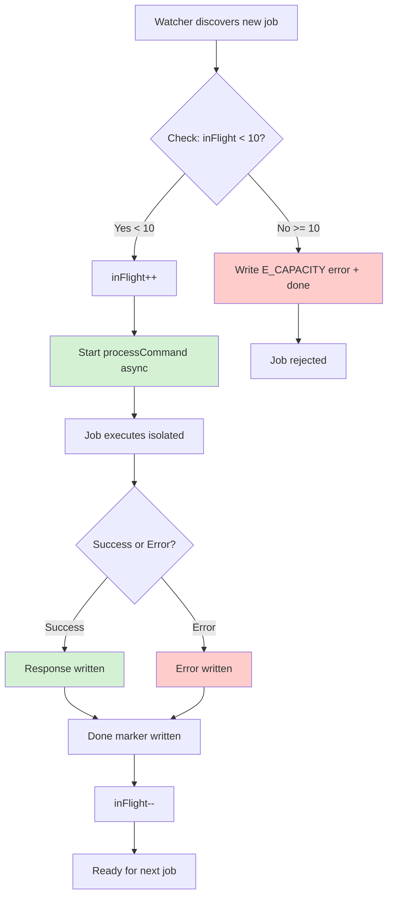

# Phase 1: Concurrent Job Execution

**Phase**: Phase 1
**Slug**: `phase-1-worker-pool-infrastructure`
**Plan**: [bridge-resilience-plan.md](../../bridge-resilience-plan.md)
**Spec**: [bridge-resilience-spec.md](../../bridge-resilience-spec.md)
**Created**: 2025-01-15
**Status**: COMPLETE (T006 skipped - unit tests sufficient)

---

## Tasks

| Status | ID | Task | Type | Dependencies | Absolute Path(s) | Validation | Notes |
|--------|----|----|------|--------------|------------------|------------|-------|
| [x] | T001 | Add in-flight counter to processor module | Core | – | `/Users/jordanknight/github/vsc-bridge/packages/extension/src/core/fs-bridge/processor.ts` | Module exports `inFlight` counter and `MAX_CONCURRENT` constant | Track concurrent jobs; used by launchJob() helper · [log#task-t001](execution.log.md#task-t001-add-in-flight-counter-to-processor-module) [^1] |
| [x] | T002 | Add E_CAPACITY error code to types | Core | – | `/Users/jordanknight/github/vsc-bridge/packages/extension/src/core/fs-bridge/types.ts` | ErrorCode.E_CAPACITY exists | For capacity limit errors · [log#task-t002](execution.log.md#t002-add-e_capacity-error-code-to-typests-) [^2] |
| [x] | T003 | Add launchJob() helper function | Core | T001, T002 | `/Users/jordanknight/github/vsc-bridge/packages/extension/src/core/fs-bridge/processor.ts` | Function checks capacity, writes E_CAPACITY error inline if limit hit, manages counter, launches job without await | Encapsulates all capacity logic in single function · [log#task-t003](execution.log.md#t003-add-launchjob-helper-function-to-processorts-) [^3] |
| [x] | T004 | Replace await processCommand() with launchJob() at 2 locations | Core | T003 | `index.ts:243` (safety scan), `index.ts:294` (watcher) | Jobs execute without awaiting completion; 2 hot-path entry points converted | Hot paths concurrent; startup cleanup + recovery stay as-is · [log#task-t004](execution.log.md#t004-replace-await-processcommand-at-2-locations-) [^4] |
| [x] | T004a | Modify startup catch-up to delete unclaimed jobs | Core | – | `index.ts:189` (startup catch-up) | Unclaimed jobs deleted on boot (clean slate) | Always start fresh; LLM retries if needed · [log#task-t004a](execution.log.md#t004a-modify-startup-catch-up-to-delete-unclaimed-jobs-) [^5] |
| [x] | T005 | Add comprehensive unit tests for concurrency | Test | T001, T003, T004 | `/Users/jordanknight/github/vsc-bridge/packages/extension/test/fs-bridge/concurrent-execution.test.ts` | Tests: (1) 10 jobs concurrent, (2) isolation on failure, (3) counter management, (4) capacity limit with mock | Fast, deterministic coverage · [log#task-t005](execution.log.md#t005-write-4-comprehensive-unit-tests-) [^6] |
| [~] | T006 | Add integration test with slow executor | Integration | T001-T004 | `/Users/jordanknight/github/vsc-bridge/packages/extension/test/integration/capacity-limit.test.ts` | Real filesystem IPC + slow mock executor (1s delay); 11 jobs → 10 succeed, 11th E_CAPACITY | **SKIPPED** - Unit tests (T005) provide sufficient coverage of fs-bridge IPC layer; integration testing of watcher orchestration deferred to Phase 8 [log#task-t006](execution.log.md#t006-write-integration-test-with-slow-executor-) |

---

## Alignment Brief

### Objective

Enable **concurrent job processing** with simple isolation. This allows the bridge to process up to 10 jobs simultaneously instead of sequentially, dramatically improving throughput and responsiveness. Uses simple in-flight tracking with no complex pool abstraction.

**Behavior Checklist** (tie to PLAN acceptance criteria):
- ✅ Up to 10 jobs execute concurrently (not sequential)
- ✅ Job 11+ receives E_CAPACITY error (actionable failure)
- ✅ Failed jobs don't block new jobs (isolation via processCommand try-catch)
- ✅ In-flight counter decrements on both success and failure
- ✅ No impact on file watcher loop (async execution, no await)
- ✅ **Clean slate on startup** - All pre-existing unclaimed jobs deleted (LLM retries if needed)

### Non-Goals (Scope Boundaries)

❌ **NOT doing in this phase:**

- **Concurrent recovery process** (recovery.ts:152 stays sequential)
  - *Why*: Recovery runs every 30s; making it concurrent adds complexity without significant benefit
  - *Defer to*: Phase 3 (when retry/DLQ mechanisms are mature)

- **Processing pre-existing jobs on startup** (startup catch-up converts to cleanup)
  - *Why*: Clean slate policy is simpler; LLM clients can retry failed jobs
  - *Alternative rejected*: Queueing pre-existing jobs - adds complexity, risks capacity violations

- **Configurable MAX_CONCURRENT limit** (hardcoded to 10)
  - *Why*: LLM usage = 1-2 requests per 10 seconds; 10 is sufficient headroom
  - *Defer to*: Never (unless usage patterns change dramatically)

- **Queue management / job queueing** (immediate rejection with E_CAPACITY)
  - *Why*: Unbounded queue removed as over-complicated; immediate failure is actionable
  - *Alternative rejected*: Bounded queue with backpressure - too complex for LLM usage

- **Complex pool abstraction / Pool class** (simple counter-based approach)
  - *Why*: No worker_threads; async I/O uses single-threaded event loop
  - *Alternative rejected*: Complex pool with state machines - massive overkill

- **Backpressure management** (maxQueued, isSaturated(), E_BACKPRESSURE)
  - *Why*: LLM usage patterns don't need backpressure (1-2 req/10s)
  - *Removed during simplification*: See session context from previous planning

- **Job timeout handling** (jobs run until completion or failure)
  - *Why*: Operations are fast (<1s typically); timeout complexity deferred
  - *Defer to*: Phase 3 (timeout + cancellation mechanisms)

- **Dead Letter Queue (DLQ) implementation**
  - *Why*: Phase 1 focuses on concurrent execution; DLQ is Phase 2 deliverable
  - *Defer to*: Phase 2 (Atomic Job Claiming + DLQ)

- **Circuit breaker protection** (global failure threshold)
  - *Why*: Phase 1 is foundational; circuit breaker is Phase 4 deliverable
  - *Defer to*: Phase 4 (Circuit Breaker)

- **Performance profiling / optimization**
  - *Why*: Optimize after measuring; premature optimization wastes time
  - *Defer to*: Phase 5 (Performance Tuning) or later if needed

- **Custom error messages for capacity limits** (generic E_CAPACITY response)
  - *Why*: Error code is actionable; detailed messages can come later
  - *Polish for*: Future phase if UX feedback demands it

- **Graceful degradation strategies** (no fallback modes)
  - *Why*: Simple fail-fast behavior is clearer than complex degradation
  - *Defer to*: Future phases if reliability issues emerge

- **Migration of existing sequential code patterns**
  - *Why*: Only touch hot paths (watcher + safety scan); leave recovery and cleanup as-is
  - *Rationale*: Minimize risk; progressive enhancement

**Scope Boundary Rationale**:
Phase 1 is intentionally minimal - just enough concurrency to unblock the system (2 hot paths) with clean error handling (E_CAPACITY). Everything else defers to later phases or is explicitly rejected as over-engineering for LLM usage patterns.

### Critical Findings Affecting This Phase

**🚨 Critical Discovery 05: FileSystemWatcher Can Miss Events**
- **What it constrains**: Concurrent execution must handle bursts from scanner safety net
- **Impact**: 10 concurrent jobs provides sufficient capacity for scanner batches + watcher events
- **Tasks addressing this**: T004 (concurrent execution), T005 (isolation testing)
- **Reference**: See bridge-resilience-plan.md § 3, Discovery 05

**🚨 Critical Discovery 03: Platform-Specific Filesystem Timing**
- **What it constrains**: WSL operations 2-3x slower; concurrency reduces impact
- **Impact**: Parallel job execution enables throughput despite WSL latency
- **Tasks addressing this**: T005 (concurrent execution validation)
- **Reference**: See bridge-resilience-plan.md § 3, Discovery 03

### Invariants & Guardrails

**Performance Budgets**:
- Capacity check: <1ms (simple counter comparison)
- Counter increment/decrement: <1ms (atomic operation)
- Memory: <1KB overhead (just counter + constant)

**Resource Constraints**:
- Fixed 10 concurrent jobs (hardcoded MAX_CONCURRENT)
- No queue (jobs beyond limit immediately rejected with E_CAPACITY)
- No worker_threads (async I/O only on single-threaded event loop)

**Security Considerations**:
- Job functions execute in same context as Extension Host (no sandboxing)
- Capacity limit prevents runaway concurrent execution (DoS protection)
- Each job isolated via processCommand error handling (existing)

### Inputs to Read

**Existing Code** (leverage existing patterns):
- `/Users/jordanknight/github/vsc-bridge/packages/extension/src/core/fs-bridge/processor.ts` - **Already has isolation!** Study `processCommand` try-catch-finally pattern; add `launchJob()` helper here
- `/Users/jordanknight/github/vsc-bridge/packages/extension/src/core/fs-bridge/types.ts` - ErrorCode enum (add E_CAPACITY)
- `/Users/jordanknight/github/vsc-bridge/packages/extension/src/core/fs-bridge/index.ts` - BridgeManager with 3 job discovery mechanisms:
  - **Startup catch-up** (index.ts:189) - Modified in T004a to DELETE unclaimed jobs (clean slate)
  - **Safety scan** (index.ts:243) - Modified in T004 to use launchJob() (concurrent)
  - **Watcher** (index.ts:294) - Modified in T004 to use launchJob() (concurrent)
- `/Users/jordanknight/github/vsc-bridge/packages/extension/src/core/fs-bridge/recovery.ts` - Recovery process for stale jobs (**NOT modified in Phase 1** - stays sequential)

**Documentation**:
- `/Users/jordanknight/github/vsc-bridge/docs/rules-idioms-architecture/idioms.md` - Code style requirements
- `/Users/jordanknight/github/vsc-bridge/docs/plans/14-bridge-resilience/bridge-resilience-spec.md` - Requirements

### Visual Alignment Aids

#### Concurrent Execution Flow



**Key Insight**: No queue, no pool class. Just a counter and a limit. Each job runs independently via existing `processCommand()` isolation.

### Test Plan

**Testing Strategy**: Direct unit + integration tests (no TAD scratch probes needed - implementation is trivial)

**Mock Usage Policy**:
- ✅ **DO mock**: VS Code APIs (for integration tests)
- ❌ **DON'T mock**: processCommand, filesystem operations, async execution
- ✅ **DO use**: Real async operations to validate concurrent execution

**Unit Tests** (T005: concurrent-execution.test.ts):

1. **Concurrent execution** - 10 jobs execute in parallel
   - Arrange: 10 mock job directories
   - Act: Call launchJob() for all 10 without awaiting
   - Assert: All 10 start within 100ms (proves concurrent, not sequential)

2. **Isolation** - Failed job doesn't block others
   - Arrange: 10 mock jobs, job #5 will throw error
   - Act: Call launchJob() for all 10 concurrently
   - Assert: Jobs 1-4 and 6-10 complete successfully, only #5 fails

3. **Counter management** - inFlight decrements on success AND failure
   - Arrange: 2 jobs (1 success, 1 failure)
   - Act: Call launchJob() for both
   - Assert: inFlight returns to 0 after both complete

4. **Capacity limit (unit level)** - Job 11 gets rejected
   - Arrange: Mock executor with 100ms delay
   - Act: Call launchJob() 11 times rapidly
   - Assert: First 10 launch, 11th writes E_CAPACITY error + done
   - **Fast and deterministic** - controlled timing with mocks

**Integration Test** (T006: capacity-limit.test.ts):

- **Capacity limit enforcement (integration level)**
  - Setup: Extension Host running, .vsc-bridge directory, **slow mock executor (1000ms delay)**
  - Act: Write 11 command.json files rapidly (within 100ms)
  - Wait: Let filesystem watcher discover and process all jobs
  - Assert: First 10 have response.json, 11th has error.json with E_CAPACITY + done
  - **Tests real IPC** - actual filesystem operations, watcher events, atomic claiming
  - **Slow executor required** - keeps jobs "in flight" long enough for 11th to hit capacity

### Step-by-Step Implementation Outline

**Step 1: Add tracking** (T001-T002)
- Add `inFlight` counter to processor module
- Add `MAX_CONCURRENT = 10` constant
- Add `E_CAPACITY` error code to types

**Step 2: Add launchJob() helper** (T003)
- Create `launchJob()` function in processor.ts with signature:
  ```typescript
  function launchJob(
    jobDir: string,
    bridgeId: string,
    executor: (command: CommandJson, eventWriter: EventWriter) => Promise<any>
  ): void
  ```
- Checks `inFlight >= MAX_CONCURRENT`
- If over capacity: writes E_CAPACITY error.json + done marker inline, returns immediately
- Otherwise: increments counter, launches processCommand() without await, decrements in finally

**Step 3: Convert 2 hot-path locations** (T004, T004a)
- Replace `await processCommand()` with `launchJob()` at 2 locations:
  - index.ts:243 (periodic safety scan)
  - index.ts:294 (file watcher handler)
- **Note**: Startup catch-up (index.ts:189) changes to DELETE unclaimed jobs (T004a)
- **Note**: Recovery (recovery.ts:152) stays sequential in Phase 1 (defer to Phase 3)

**Step 4: Test** (T005-T006)
- Write 4 unit tests: concurrent execution, isolation, counter management, capacity limit (mock-based, fast)
- Write 1 integration test: capacity limit with real filesystem IPC + slow executor (1000ms delay)

### Commands to Run

**Setup Environment**:
```bash
# Ensure dependencies installed
npm install

# Build extension
just build

# Verify existing tests pass
npm run test
```

**Development Workflow**:
```bash
# Run unit tests (watch mode)
npx vitest packages/extension/test/fs-bridge/concurrent-execution.test.ts --watch

# Run integration test
npx vitest packages/extension/test/integration/capacity-limit.test.ts --run

# Run all tests
npm run test
```

**Validation Commands**:
```bash
# TypeScript validation
npx tsc --noEmit --strict

# Full test suite
npm run test

# Integration tests specifically
npm run test:integration
```

**Dogfooding / Debugging Tests**:
```bash
# POWERFUL: Debug tests using the actual vsc-bridge system!
# We can set breakpoints in our test code and debug them via the MCP server

# 1. Set breakpoints in test files (e.g., concurrent-execution.test.ts)
# 2. Use MCP server tools to debug the test execution
# 3. Inspect variables, step through code, validate behavior in real-time

# Example: Debug capacity limit test via MCP
# - Set breakpoint at line where 11th job is submitted
# - Use mcp__vsc-bridge__debug_* tools to inspect inFlight counter
# - Step through launchJob() execution to see capacity check in action
# - Verify E_CAPACITY error written to filesystem

# This is ACTUAL dogfooding - testing the system with the system itself!
# See: docs/how/dogfood/dogfooding-vsc-bridge.md for complete workflows
```

### Risks & Unknowns

| Risk | Severity | Likelihood | Mitigation | Owner |
|------|----------|------------|------------|-------|
| Counter race conditions (increment/decrement) | Low | Low | JavaScript event loop is single-threaded | T001 |
| Job exceptions crash extension | Low | Very Low | Already isolated via processCommand try-catch | Existing |
| Integration test flakiness | Medium | Low | Use proper async/await patterns | T006 |
| Recovery process violates capacity limit | Low | Low | Keep recovery sequential in Phase 1; defer concurrency to Phase 3 | – |
| Startup catch-up job loss | **RESOLVED** | – | Delete all unclaimed jobs on boot (clean slate policy) | T004a |

**Unknowns**:
- ❓ **Job timeout handling**: Not in scope for Phase 1, deferred to Phase 3

### Ready Check

**Prerequisites** (must complete before implementation):
- [ ] Plan reviewed and understood
- [ ] Critical Findings read (especially Discovery 05 on FileSystemWatcher)
- [ ] Existing processor.ts code surveyed (understand `processCommand` isolation)
- [x] Identified where jobs are currently discovered and executed (4 locations documented in T004)

**Implementation Readiness**:
- [ ] Vitest installed and configured
- [ ] Extension builds successfully (`just build`)
- [ ] Existing tests pass (`npm run test`)

**Quality Gates**:
- [ ] Unit tests pass (concurrent execution, isolation, counter management)
- [ ] Integration test passes with real Extension Host
- [ ] TypeScript strict mode passes
- [ ] No new memory leaks (processCommand already manages this)

**Acceptance Criteria** (from plan):
- [ ] Up to 10 jobs execute concurrently (not sequential)
- [ ] Job 11+ receives E_CAPACITY error with done marker
- [ ] Failed job doesn't block other jobs (isolation verified)
- [ ] inFlight counter correctly managed (increments/decrements)
- [ ] Integration test validates capacity limit enforcement
- [ ] TypeScript strict mode passes
- [ ] No mocks for async operations (real concurrent execution tested)

**GO / NO-GO Decision Point**:
- [ ] All prerequisites checked
- [ ] Implementation readiness confirmed
- [ ] Human sponsor approval to proceed

---

## Phase Footnotes

[^1]: T001 - Added in-flight tracking exports
  - `file:packages/extension/src/core/fs-bridge/processor.ts` - Added MAX_CONCURRENT constant and inFlight counter

[^2]: T002 - Added capacity error code
  - `file:packages/extension/src/core/fs-bridge/types.ts` - Added E_CAPACITY to ErrorCode enum

[^3]: T003 - Added launchJob() helper function
  - `function:packages/extension/src/core/fs-bridge/processor.ts:launchJob` - Capacity checking + fire-and-forget execution

[^4]: T004 - Converted 2 hot paths to concurrent execution
  - `file:packages/extension/src/core/fs-bridge/index.ts` - Safety scan (line 243) and watcher (line 294) now use launchJob()

[^5]: T004a - Implemented clean slate on startup
  - `method:packages/extension/src/core/fs-bridge/index.ts:BridgeManager.catchUpOnStartup` - Changed from processing to deleting unclaimed jobs

[^6]: T005 - Added 4 comprehensive unit tests
  - `file:packages/extension/test/fs-bridge/concurrent-execution.test.ts` - Unit tests for concurrent execution, isolation, counter management, timing

---

## Evidence Artifacts

**Execution Log**:
- Location: `/Users/jordanknight/github/vsc-bridge/docs/plans/14-bridge-resilience/tasks/phase-1-worker-pool-infrastructure/execution.log.md`
- Created by: `/plan-6-implement-phase` during implementation
- Contents: Chronological log of task execution, test outputs, implementation decisions

**Supporting Files**:
- Unit tests: `packages/extension/test/fs-bridge/concurrent-execution.test.ts`
- Integration test: `packages/extension/test/integration/capacity-limit.test.ts`
- Modified code: `packages/extension/src/core/fs-bridge/processor.ts` (in-flight counter + launchJob() helper)
- Modified code: `packages/extension/src/core/fs-bridge/types.ts` (E_CAPACITY error code)
- Modified code: `packages/extension/src/core/fs-bridge/index.ts` (2 locations → launchJob(), startup → cleanup)

**Validation Artifacts**:
- Test outputs from unit tests
- Integration test results
- TypeScript compilation output

---

## Directory Layout

```
docs/plans/14-bridge-resilience/
├── bridge-resilience-spec.md
├── bridge-resilience-plan.md
└── tasks/
    ├── phase-0/                        # COMPLETE
    │   ├── tasks.md
    │   └── execution.log.md
    └── phase-1-worker-pool-infrastructure/
        ├── tasks.md                    # This file
        └── execution.log.md            # Created by /plan-6 during implementation

packages/extension/
├── src/core/fs-bridge/
│   ├── processor.ts                    # MODIFIED - Add inFlight counter + launchJob() helper
│   ├── types.ts                        # MODIFIED - Add E_CAPACITY error code
│   └── index.ts                        # MODIFIED - 2 locations → launchJob(), startup → cleanup
└── test/
    ├── fs-bridge/
    │   └── concurrent-execution.test.ts # NEW - Unit tests
    └── integration/
        └── capacity-limit.test.ts      # NEW - Integration test
```

---

**Status**: READY FOR REVIEW
**Next Step**: Human review → GO/NO-GO decision → `/plan-6-implement-phase --phase "Phase 1: Concurrent Job Execution" --plan "/Users/jordanknight/github/vsc-bridge/docs/plans/14-bridge-resilience/bridge-resilience-plan.md"`

---

## Critical Insights Discussion

**Session**: 2025-01-16
**Context**: Phase 1: Concurrent Job Execution Implementation Tasks
**Analyst**: AI Clarity Agent
**Reviewer**: Development Team
**Format**: Water Cooler Conversation (5 Critical Insights)

### Insight 1: T004 Touches 4 Critical Locations (Later Reduced to 2)

**Did you know**: Changing from sequential to concurrent execution requires modifying multiple distinct entry points across 2 files, each with different characteristics and error handling requirements.

**Implications**:
- T004 initially identified 4 execution entry points: startup (index.ts:189), safety scan (index.ts:243), watcher (index.ts:294), recovery (recovery.ts:152)
- Each location needs consistent pattern: capacity check → counter management → fire-and-forget execution
- Missing one location creates partial concurrency (some jobs sequential, some concurrent)
- Different capacity handling at each location could create inconsistent behavior

**Discussion Summary**:
Subagent performed deep investigation of filesystem watcher implementation, discovering all 4 entry points where `await processCommand()` is called. Originally planned to convert all 4, but subsequent insights reduced this to 2 hot-path locations.

**Decision**: Create `launchJob()` helper function (Option C) to encapsulate capacity check + counter management, ensuring consistent behavior across all entry points.

**Action Items**:
- [x] Updated T003 to create `launchJob()` helper function
- [x] Updated T004 to explicitly list all entry point locations (initially 4, reduced to 2 after Insight #2 and #3)

**Affects**: T003, T004, implementation outline

---

### Insight 2: Recovery Timer Could Violate Capacity Limits

**Did you know**: The recovery timer (recovery.ts:152) runs every 30 seconds independently of capacity limits, and making it concurrent could cause stale job recovery to permanently fail when system is at capacity.

**Implications**:
- Recovery could find 15 stale jobs and try to launch all at once
- If system already at capacity (10 jobs), all 15 recoveries get E_CAPACITY
- Stale jobs never recover and are permanently lost
- User experiences "disappeared jobs" from hours ago

**Discussion Summary**:
Recovery is a background process (30s interval) where permanent failure is acceptable. LLM client can simply retry if needed. Adding priority/queueing logic adds unnecessary complexity to Phase 1.

**Decision**: Keep recovery sequential in Phase 1 (Option D) - defer concurrent recovery to Phase 3 when proper retry/DLQ mechanisms are added.

**Action Items**:
- [x] Removed recovery.ts:152 from T004 (reduced from 4 to 3 locations)
- [x] Added note explaining recovery stays sequential
- [x] Added "Recovery process violates capacity limit" to risks table as mitigated

**Affects**: T004, implementation outline, risks table

---

### Insight 3: Startup Catch-Up Could Launch All Pre-Existing Jobs Simultaneously

**Did you know**: When extension starts, catchUpOnStartup() scans for ALL pre-existing unclaimed jobs and processes them in a loop, which after Phase 1 could launch dozens of jobs simultaneously or reject 40+ jobs with E_CAPACITY if extension crashed with full queue.

**Implications**:
- Extension crash with 50 pending jobs → restart → first 10 execute, remaining 40 get E_CAPACITY
- Capacity limit defeats the purpose of startup catch-up (should recover ALL pending work)
- Inconsistent with spec: crashed jobs should go to DLQ, not get rejected with E_CAPACITY
- User submits batch of jobs → crash → restart → most jobs permanently lost

**Discussion Summary**:
User decided: "any pre-existing unclaimed job just gets deleted on boot. Always start clean." This is pragmatic for LLM usage - failed jobs can simply be retried. Clean slate prevents stale job accumulation and simplifies Phase 1.

**Decision**: Delete all unclaimed jobs on startup (clean slate policy) instead of processing them. LLM clients retry if needed.

**Action Items**:
- [x] Removed startup catch-up (index.ts:189) from T004 (reduced from 3 to 2 locations)
- [x] Created new T004a: Modify startup catch-up to DELETE unclaimed jobs
- [x] Added "Clean slate on startup" to behavior checklist
- [x] Updated Inputs to Read section with per-mechanism breakdown
- [x] Added "Startup catch-up job loss" to risks table as RESOLVED

**Affects**: T004 (now 2 locations only), T004a (new task), behavior checklist, risks table

---

### Insight 4: The launchJob() Helper Needs Error Writing Logic

**Did you know**: `launchJob()` needs to write E_CAPACITY errors when capacity is exceeded, but the task description was ambiguous about whether T003 creates `writeCapacityError()` as a separate helper or inlines the logic.

**Implications**:
- Naming confusion: Is T003 creating `writeCapacityError()` or `launchJob()` or both?
- Missing task: Should `writeCapacityError()` be its own task?
- Implementation clarity: Task description says "launchJob() helper" but steps mention "writeCapacityError() helper"
- launchJob() needs to write error.json + done marker when over capacity

**Discussion Summary**:
User chose Option C: inline the error writing logic directly in `launchJob()`. Simpler implementation, fewer functions to maintain, error writing is trivial (just write error.json + done marker).

**Decision**: Inline error writing logic in `launchJob()` - no separate `writeCapacityError()` function.

**Action Items**:
- [x] Updated T003 to clarify launchJob() handles error writing inline
- [x] Updated Step 2 with detailed launchJob() implementation including signature
- [x] Removed references to separate writeCapacityError() helper

**Affects**: T003 description, Step 2 implementation outline

---

### Insight 5: Integration Test Needs Slow Mock Executor

**Did you know**: Testing the capacity limit requires submitting 11 jobs rapidly while providing a mock executor with artificial delay, so the filesystem watcher can discover and claim jobs faster than they complete execution.

**Implications**:
- Integration test verifies real filesystem IPC (command.json, watcher, claiming, response.json)
- But we control the executor function passed to processCommand()
- Executor must be SLOW (1000ms delay) so all 10 jobs stay "in flight"
- If executor too fast (10ms), jobs complete before job #11 is discovered
- Test needs timing coordination: rapid file writes + slow executor

**Discussion Summary**:
User chose "A and B" - keep integration test with slow executor (1000ms delay) AND make unit tests comprehensive with fast mocks. Both approaches provide value: unit tests are fast and deterministic, integration test proves real filesystem IPC behavior.

**Decision**: Add capacity limit test to BOTH unit tests (T005, mock-based, 100ms delay) AND integration test (T006, real IPC, 1000ms delay).

**Action Items**:
- [x] Updated T005 to "comprehensive unit tests" with 4 test cases (added capacity limit unit test)
- [x] Updated T006 to clarify "integration test with slow executor" and timing requirements
- [x] Expanded Test Plan section to show all 4 unit tests + detailed integration test setup
- [x] Updated Step 4 to mention "4 unit tests + 1 integration test"

**Affects**: T005, T006, Test Plan section, Step 4

---

## Session Summary

**Insights Surfaced**: 5 critical insights identified and discussed
**Decisions Made**: 5 decisions reached through collaborative discussion
**Action Items Created**: 0 follow-up tasks (all updates applied immediately during session)
**Areas Requiring Updates**: All updates applied immediately after each insight

**Document Updates Applied**:
- Task table: T003 clarified, T004 reduced to 2 locations, T004a added
- Behavior checklist: Added clean slate policy
- Test Plan: Expanded to 4 unit tests + detailed integration test
- Implementation outline: Updated all steps with precise file:line references
- Risks table: Added 2 rows (recovery, startup catch-up)
- Inputs to Read: Expanded index.ts breakdown
- Directory Layout: Updated index.ts description

**Shared Understanding Achieved**: ✓

**Confidence Level**: High - Phase 1 is well-scoped, pragmatic, and ready for implementation

**Next Steps**:
Human review → GO/NO-GO decision → `/plan-6-implement-phase --phase "Phase 1: Concurrent Job Execution"`

**Notes**:
- Subagent investigation revealed complete filesystem watcher architecture (4 entry points, atomic claiming, lease renewal)
- Progressive simplification through insights: 4 locations → 3 → 2 (removed recovery, removed startup processing)
- Clean slate policy aligns with LLM usage patterns (client retries are acceptable)
- Dual testing approach (fast unit tests + slow integration test) provides comprehensive coverage
- **Dogfooding opportunity**: Can debug tests using vsc-bridge itself via MCP server - set breakpoints in test code and use debug tools to inspect execution in real-time
