# Phase 3: EventWriter Robustness

**Phase**: Phase 3
**Slug**: `phase-3-eventwriter-robustness`
**Plan**: [bridge-resilience-plan.md](../../bridge-resilience-plan.md)
**Spec**: [bridge-resilience-spec.md](../../bridge-resilience-spec.md)
**Created**: 2025-10-17
**Status**: COMPLETE (100% - All tasks T001-T020 complete)

---

## Tasks

| Status | ID | Task | Type | Dependencies | Absolute Path(s) | Validation | Notes |
|--------|----|----|------|--------------|------------------|------------|-------|
| [x] | T001 | Review current EventWriter backpressure implementation | Setup | – | `/workspaces/vsc-bridge-devcontainer/packages/extension/src/core/fs-bridge/processor.ts:29-108` | Understand existing write() return value handling | Existing implementation (lines 47-52) already correct ✅ See [execution.log.md](./execution.log.md#t001-review-current-implementation) |
| [x] | T002 | Write scratch probe: Backpressure handling with 100KB+ data | Test | T001 | `/workspaces/vsc-bridge-devcontainer/packages/extension/test/scratch/event-writer/01-backpressure-probe.test.ts` | Probe validates write() false → await drain + error-during-backpressure | 3 tests created (all passing) ✅ See [execution.log.md](./execution.log.md#t002-write-scratch-probe---backpressure) |
| [x] | T003 | Enhance EventWriter.writeLine backpressure handling (per Critical Discovery 02) | Core | T002 | `/workspaces/vsc-bridge-devcontainer/packages/extension/src/core/fs-bridge/processor.ts:47-53` | Backpressure probe goes green | No changes needed (existing correct) ✅ |
| [x] | T004 | Add error event handler to EventWriter stream (handles error-during-backpressure) | Core | T003 | `/workspaces/vsc-bridge-devcontainer/packages/extension/src/core/fs-bridge/processor.ts:37-45` | Stream 'error' event captured, sets lastError, closes stream | Per-write error handlers in writeLine() [^12] |
| [x] | T005 | Write scratch probe: Stream error scenarios (ENOENT, EPERM, disk full) | Test | T004 | `/workspaces/vsc-bridge-devcontainer/packages/extension/test/scratch/event-writer/02-error-probe.test.ts` | Probe captures errors, fails subsequent writes | 6 tests created (all passing) ✅ See [execution.log.md](./execution.log.md#t005-write-scratch-probe---error-scenarios) |
| [x] | T006 | Implement error state tracking in EventWriter (lastError property) | Core | T005 | `/workspaces/vsc-bridge-devcontainer/packages/extension/src/core/fs-bridge/processor.ts:29-34` | Error probe goes green | Added lastError field + fail-fast checks [^13] |
| [x] | T007 | Enhance writeEvent to throw immediately if stream has error (before queueing) | Core | T006 | `/workspaces/vsc-bridge-devcontainer/packages/extension/src/core/fs-bridge/processor.ts:55-73` | Subsequent writes after error throw immediately | Added fail-fast check + fixed promise chaining bug [^14] |
| [x] | T008 | Write scratch probe: Graceful close with pending writes | Test | T007 | `/workspaces/vsc-bridge-devcontainer/packages/extension/test/scratch/event-writer/03-close-probe.test.ts` | Probe validates pending writes complete before close | 4 tests created (2/4 passing) - 2 issues identified ⚠️ See [execution.log.md](./execution.log.md#t008-write-scratch-probe---close-handling) |
| [x] | T009 | Enhance close() to wait for all pending writes and stream finish | Core | T008 | `/workspaces/vsc-bridge-devcontainer/packages/extension/src/core/fs-bridge/processor.ts:91-108` | Close probe goes green | Enhanced close() to await pendingWrites chain [^15] |
| [x] | T010 | Add close timeout protection (5s) that rejects promise on timeout | Core | T009 | `/workspaces/vsc-bridge-devcontainer/packages/extension/src/core/fs-bridge/processor.ts:91-108` | close() REJECTS after 5s if stream hangs (prevents data loss) | Timeout rejects (prevents data loss) [^15] |
| [x] | T010a | Wrap eventWriter.close() in try/catch in processCommand() finally block | Core | T010 | `/workspaces/vsc-bridge-devcontainer/packages/extension/src/core/fs-bridge/processor.ts:362-366` | Done marker always written even if close() fails | Added try/catch wrapper (KISS approach) [^16] |
| [x] | T011 | Review scratch probes and apply CORE heuristic for promotion | Setup | T002-T010a | `/workspaces/vsc-bridge-devcontainer/packages/extension/test/scratch/event-writer/` | Promotion decisions documented | CORE heuristic applied: 7 tests selected for promotion (exceeds 3-4 guideline - justified by component criticality) [^17] |
| [x] | T011a | Enhance close timeout test to actually test timeout | Test | T011 | `/workspaces/vsc-bridge-devcontainer/packages/extension/test/core/fs-bridge/event-writer.test.ts` | Timeout test triggers actual 5s timeout | Enhanced scratch probe 03 with real timeout simulation [^17] |
| [x] | T011b | Document scratch probe findings | Documentation | T011, T011a | `/workspaces/vsc-bridge-devcontainer/docs/plans/14-bridge-resilience/tasks/phase-3-eventwriter-robustness/scratch-probe-findings.md` | Findings documented with bugs, learnings, promotion decisions | Created comprehensive findings document [^17] |
| [x] | T012-T017 | Promote all 7 tests to Vitest with full Test Doc blocks | Test | T011 | `/workspaces/vsc-bridge-devcontainer/packages/extension/test/core/fs-bridge/event-writer.test.ts` | All 7 tests passing in Vitest framework | **PIVOT**: Discovered extension uses Vitest (not Mocha). Promoted all 7 tests at once [^18] |
| [x] | T018 | Delete scratch probes and capture learning notes | Cleanup | T012-T017 | `/workspaces/vsc-bridge-devcontainer/packages/extension/test/scratch/event-writer/` | Scratch directory deleted, notes in execution log + findings doc | Scratch probes deleted after successful promotion [^18] |
| [x] | T019 | Verify TypeScript compilation passes | Validation | T003-T010a | Project root | `npx tsc --noEmit --strict` succeeds | TypeScript compilation passing ✅ [^18] |
| [x] | T020 | Run promoted tests and verify 100% pass | Validation | T012-T017, T019 | Project root | `npx vitest run test/core/fs-bridge/event-writer.test.ts` passes | All 7/7 promoted tests passing ✅ [^18] |

---

## Alignment Brief

### Objective

**Harden EventWriter to handle backpressure, stream errors, and ensure graceful closure** without data loss or hung jobs. This phase addresses Critical Discovery 02 by implementing robust stream backpressure handling and comprehensive error surfacing.

**Behavior Checklist** (ties to PLAN/SPEC acceptance criteria):
- ✅ Write backpressure respected - await drain when write() returns false (Discovery 02)
- ✅ Stream errors captured and surfaced - no swallowed errors
- ✅ Graceful close with pending writes - all writes complete before close resolves
- ✅ Write-after-close throws error - prevents silent data loss
- ✅ Close timeout protection - prevents hung close() operations
- ✅ Error state tracking - lastError accessible for debugging
- ✅ 3-4 promoted tests with full Test Doc blocks (TAD requirement)
- ✅ API compatibility maintained - no breaking changes to EventWriter interface

### Non-Goals (Scope Boundaries)

❌ **NOT doing in this phase:**

- **Event stream compression or encryption**
  - *Why*: Not required for reliability; can be added as performance optimization later
  - *Defer to*: Future performance phase (if needed)

- **Event filtering or sampling**
  - *Why*: Out of scope for robustness; consumers handle filtering
  - *Defer to*: Consumer implementation

- **Multiple output formats (JSON, binary, etc.)**
  - *Why*: NDJSON is sufficient; format changes are out of scope
  - *Defer to*: Never (NDJSON is the protocol)

- **Event replay or persistence beyond job lifecycle**
  - *Why*: Events are ephemeral per-job; archival is not a requirement
  - *Defer to*: DLQ Phase (Phase 5) handles failed job retention

- **Stream multiplexing (multiple consumers)**
  - *Why*: Single consumer (CLI/MCP client) per job; no multi-consumer requirement
  - *Defer to*: Never (not needed for this use case)

- **Custom backpressure strategies (drop, sample, etc.)**
  - *Why*: Block-on-backpressure is the only correct approach for reliable delivery
  - *Defer to*: Never (data loss is unacceptable)

- **Performance optimization (buffering tuning)**
  - *Why*: Node.js default buffering (16KB highWaterMark) is sufficient
  - *Defer to*: Future if profiling reveals bottleneck

- **Integration with BridgeManager error handling**
  - *Why*: EventWriter is standalone; integration happens in Phase 4 (Circuit Breaker)
  - *Defer to*: Phase 4

**Scope Boundary Rationale**:
Phase 3 focuses narrowly on making EventWriter robust against stream failures and backpressure scenarios. Everything else defers to ensure this critical component works reliably before integrating with broader error handling (Circuit Breaker, DLQ).

### Critical Findings Affecting This Phase

**🚨 Critical Discovery 02: EventWriter Stream Backpressure**
- **What it constrains**: Must check `stream.write()` return value and await 'drain' event when buffer is full
- **Impact**: Current implementation has partial backpressure handling but may need enhancement; prevents memory bloat and hung streams
- **Tasks addressing this**: T001 (review current implementation), T002 (backpressure probe), T003 (enhance backpressure handling), T012 (promoted test)
- **Reference**: plan.md § 3, Discovery 02
- **Code example**:
  ```typescript
  // ✅ CORRECT - Respects backpressure
  private async writeLine(line: string): Promise<void> {
    const stream = this.ensureStream();
    if (!stream.write(line)) {
      // Buffer full, wait for drain
      await new Promise<void>(resolve => stream.once('drain', resolve));
    }
  }
  ```

**🚨 Critical Discovery 04: No Lease Renewal Needed**
- **What it constrains**: EventWriter doesn't need lease renewal or heartbeat writes
- **Impact**: Simplified implementation - just write events, no periodic renewal overhead
- **Tasks addressing this**: N/A (EventWriter doesn't do lease renewal)
- **Reference**: plan.md § 3, Discovery 04

### Invariants & Guardrails

**Performance Budgets**:
- Write latency: <5ms per event (typical), <50ms (worst case with backpressure)
- Memory overhead: Node.js default stream buffer (16KB highWaterMark)
- Close timeout: 5 seconds max (prevents hung close operations)

**Resource Constraints**:
- One WriteStream per EventWriter instance
- NDJSON format only (newline-delimited JSON)
- No event buffering beyond Node.js stream internals

**Security Considerations**:
- Event paths must be within job directory (no path traversal)
- No sensitive data in events (sanitize before writing)
- Stream errors don't leak file system internals

### Inputs to Read

**Existing Code** (understand before modifying):
- `/workspaces/vsc-bridge-devcontainer/packages/extension/src/core/fs-bridge/processor.ts` - **EventWriter class (lines 29-108)** - Current backpressure, error handling, close() implementation
- `/workspaces/vsc-bridge-devcontainer/packages/extension/src/core/fs-bridge/types.ts` - **EventJson type** - Event structure and fields

**Documentation**:
- `/workspaces/vsc-bridge-devcontainer/docs/rules-idioms-architecture/idioms.md` - TAD workflow, Test Doc block format
- `/workspaces/vsc-bridge-devcontainer/docs/plans/14-bridge-resilience/bridge-resilience-spec.md` - Acceptance criterion #10 (EventWriter robustness)
- `/workspaces/vsc-bridge-devcontainer/docs/plans/14-bridge-resilience/bridge-resilience-plan.md` - Critical Discovery 02 (backpressure)

**Node.js Stream Documentation**:
- [stream.write() return value](https://nodejs.org/api/stream.html#writablewritechunk-encoding-callback) - Understand false return and backpressure
- ['drain' event](https://nodejs.org/api/stream.html#event-drain) - When to resume writing
- ['error' event](https://nodejs.org/api/stream.html#event-error-1) - Stream error handling
- ['finish' event](https://nodejs.org/api/stream.html#event-finish) - Graceful close

### Visual Alignment Aids

#### EventWriter State Machine

```mermaid
stateDiagram-v2
    [*] --> Idle: new EventWriter()

    Idle --> Writing: writeEvent()
    Writing --> Writing: write() success (returns true)
    Writing --> Draining: write() returns false (buffer full)
    Draining --> Writing: 'drain' event fires

    Writing --> Error: Stream 'error' event
    Draining --> Error: Stream 'error' event
    Error --> Closed: close()

    Writing --> Closing: close()
    Draining --> Closing: close()
    Idle --> Closed: close()

    Closing --> Closed: 'finish' event OR timeout (5s)
    Closed --> [*]

    note right of Draining
        🚨 Critical Discovery 02:
        Must await 'drain' before
        continuing writes
    end note

    note right of Error
        lastError field tracks
        stream failure reason
    end note

    note right of Closing
        Timeout protection:
        5s max wait for finish
    end note
```



#### Backpressure Handling Sequence

```mermaid
sequenceDiagram
    participant J as Job Executor
    participant EW as EventWriter
    participant WS as WriteStream
    participant Buf as Stream Buffer

    Note over J,Buf: Normal Write (Buffer Not Full)

    J->>+EW: writeEvent('log', {text: 'msg'})
    EW->>EW: Serialize event to JSON
    EW->>+WS: stream.write(line)
    WS->>Buf: Append to buffer
    Note over Buf: Buffer < 16KB<br/>(not full)
    WS-->>-EW: return true
    EW-->>-J: Promise resolves

    Note over J,Buf: Backpressure Write (Buffer Full)

    J->>+EW: writeEvent('log', {data: 'large...'})
    EW->>EW: Serialize event to JSON
    EW->>+WS: stream.write(line)
    WS->>Buf: Attempt append
    Note over Buf: Buffer >= 16KB<br/>(FULL!)
    WS-->>EW: return false ⚠️

    Note over EW: 🚨 Discovery 02:<br/>await 'drain' event

    EW->>EW: await new Promise(resolve => stream.once('drain', resolve))

    Note over WS,Buf: OS writes buffer to disk...

    Buf->>WS: Buffer flushed
    WS->>EW: 'drain' event fires
    EW-->>-EW: Promise resolves
    EW-->>-J: writeEvent() resolves

    Note over J,Buf: Error Scenario

    J->>+EW: writeEvent('log', {text: 'msg'})
    EW->>+WS: stream.write(line)
    WS->>WS: Disk full (ENOSPC)
    WS->>EW: 'error' event (ENOSPC)
    EW->>EW: Set lastError = err
    WS-->>-EW: (stream closed)
    EW-->>-J: Promise rejects with ENOSPC
```

**Key Insight**: Critical Discovery 02 requires explicit backpressure handling to prevent memory bloat. When `write()` returns false, we MUST await the 'drain' event before continuing. Error events must be captured to prevent silent failures.

### Test Plan

**Testing Strategy**: Test-Assisted Development (TAD) - Scratch probes → Implement → Promote

**Rationale**: EventWriter is a critical component for job observability. Stream backpressure and error handling bugs can cause hung jobs, memory leaks, or silent data loss. TAD approach lets us explore edge cases (disk full, slow consumers, concurrent writes) via scratch probes, then promote high-value tests with full documentation.

**Test Coverage** (test/fs-bridge/event-writer.test.ts):

1. **Backpressure handling** (Critical path - PROMOTE) [T012]
   - Write 100+ large events (100KB each) to trigger backpressure
   - Validate write() false → await drain behavior
   - Verify all events written without memory leak
   - **Test Doc block**: Purpose, Quality Contribution, Acceptance Criteria

2. **Stream error scenarios** (Critical path - PROMOTE) [T013]
   - Simulate ENOENT (invalid path), EPERM (permissions), ENOSPC (disk full)
   - Validate errors captured in lastError
   - Verify subsequent writes throw
   - **Test Doc block**: Full TAD documentation

3. **Graceful close - normal path** (Regression-prone - PROMOTE) [T014]
   - Start 50 writes without awaiting
   - Call close() immediately
   - Verify close() waits for all pending writes
   - Verify 'finish' event fires
   - **Test Doc block**: Documents close() contract (normal path)

4. **Close timeout rejection** (Edge case - PROMOTE) [T015]
   - Simulate slow stream (5+ seconds to flush)
   - Verify close() rejects after 5s timeout
   - Verify timeout error message clear
   - **Test Doc block**: Timeout protection documentation

5. **Done marker always written** (Integration - PROMOTE) [T016]
   - Test with processCommand() integration
   - Simulate close() failure/timeout
   - Verify done marker written despite close error
   - **Test Doc block**: KISS approach documentation

6. **Write after close** (Edge case - PROMOTE) [T017]
   - Close EventWriter
   - Attempt writeEvent()
   - Verify error thrown (prevents silent data loss)
   - **Test Doc block**: Error case documentation

**Scratch Probes** (test/scratch/event-writer/):
- `01-backpressure-probe.test.ts` - Explore backpressure with varying data sizes
- `02-error-probe.test.ts` - Simulate filesystem errors (ENOENT, EPERM, ENOSPC)
- `03-close-probe.test.ts` - Test close timing with pending writes

**Promotion Criteria (CORE Heuristic)**:
- **C**ritical path: Backpressure, error handling (MUST promote)
- **O**paque behavior: Stream internals, drain event (MUST promote)
- **R**egression-prone: Graceful close, write-after-close (SHOULD promote)
- **E**dge case: Disk full, timeout scenarios (CONSIDER promoting)

**Mock Usage Policy** (per spec):
- ❌ **DON'T mock**: WriteStream (test real Node.js stream backpressure)
- ❌ **DON'T mock**: Filesystem operations (test real ENOSPC, ENOENT)
- ✅ **DO use**: Real temp files for test isolation
- ✅ **DO use**: Fake timers for timeout testing (if needed)

### Step-by-Step Implementation Outline

**TAD Cycle 1: Backpressure Handling** (T001-T003, T012)
1. Review current EventWriter.writeLine implementation (T001)
   - Note: Backpressure handling already exists (lines 47-52)
   - Verify it handles happy path correctly
   - Document assumption: error-during-backpressure handled by T004 global error handler
2. Write scratch probe: 100KB+ events to trigger backpressure (T002)
   - Probe MUST FAIL initially (validates we're testing the right thing)
   - Include error-during-backpressure scenario (write → backpressure → error → should reject)
3. Enhance writeLine backpressure handling per Discovery 02 (T003)
   - Current implementation likely sufficient (already awaits drain)
   - Verify write() return value handling is correct
   - Document reliance on T004 error handler for error-during-backpressure
4. Verify probe goes green (validates implementation)
5. Promote backpressure test with full Test Doc block (T012)

**TAD Cycle 2: Error Handling - FAIL-FAST Approach** (T004-T007, T013)
1. Add error event handler to ensureStream() (T004)
2. Write scratch probe: ENOENT, EPERM, ENOSPC scenarios (T005)
   - Probe validates error capture and immediate failure
3. Implement error state tracking (lastError field) (T006)
4. Enhance writeEvent to check error state BEFORE queueing (fail-fast) (T007)
   - Remove current `.catch(() => {})` error swallowing
   - Check `if (this.lastError) throw this.lastError` at START of writeEvent()
5. Verify probe goes green
6. Promote stream error test with full Test Doc block (T013)

**TAD Cycle 3: Graceful Close with Timeout Rejection** (T008-T010a, T014-T017)
1. Write scratch probe: Close with 50 pending writes (T008)
   - Validate close() waits for completion
   - Test timeout rejection scenario (slow stream simulation)
   - Verify done marker always written even if close() fails
2. Enhance close() to await pendingWrites chain (T009)
3. Add 5-second timeout that REJECTS promise (T010)
   - Use Promise.race([finishPromise, timeoutPromise])
   - Timeout branch rejects with Error('EventWriter close timeout')
4. Wrap close() in try/catch in processCommand() finally block (T010a)
   - Ensures done marker written even if close() fails (KISS)
   - Log error to console but continue to writeDone()
5. Verify probe goes green (both normal close and timeout rejection + done marker)
6. Promote tests (T014-T017):
   - T014: Graceful close (normal path)
   - T015: Close timeout rejection
   - T016: Done marker always written (integration test)
   - T017: Write-after-close throws error

**Cleanup & Validation** (T011, T018-T020)
1. Review scratch probes and apply CORE heuristic (T011)
   - Result: 6 tests promoted (all pass CORE: Critical/Opaque/Regression-prone/Edge case)
2. Delete scratch probes, capture learning notes (T018)
3. Run TypeScript compilation (T019)
4. Run promoted tests and verify 100% pass (T020)

### Commands to Run

**Setup Environment**:
```bash
# Ensure dependencies installed
npm install

# Build extension
just build

# Create scratch directory
mkdir -p packages/extension/test/scratch/event-writer
```

**Development Workflow**:
```bash
# Run scratch probes (during TAD cycles)
npx vitest test/scratch/event-writer/01-backpressure-probe.test.ts
npx vitest test/scratch/event-writer/02-error-probe.test.ts
npx vitest test/scratch/event-writer/03-close-probe.test.ts

# Watch mode during development
npx vitest test/scratch/event-writer/ --watch

# Run promoted tests
npx vitest test/fs-bridge/event-writer.test.ts

# Watch mode for promoted tests
npx vitest test/fs-bridge/event-writer.test.ts --watch
```

**Validation Commands**:
```bash
# TypeScript strict mode check
npx tsc --noEmit --strict

# Run all EventWriter tests
npx vitest run test/fs-bridge/event-writer.test.ts

# Run with coverage
npx vitest run test/fs-bridge/event-writer.test.ts --coverage

# Verify scratch probes deleted
ls packages/extension/test/scratch/event-writer/
# Should return: No such file or directory (or empty)
```

### Risks & Unknowns

| Risk | Severity | Likelihood | Mitigation | Owner |
|------|----------|------------|------------|-------|
| Stream deadlock from incorrect drain handling | High | Medium | TAD probes with large data; verify drain await logic | T002-T003 |
| Timeout too short (5s) for slow disks | Medium | Low | Monitor in integration tests; adjust if needed | T010 |
| Error event fires after close() called | Medium | Low | Test close-during-error scenario in probes | T005 |
| Memory leak from unhandled drain listeners | Medium | Low | Use stream.once('drain') not .on('drain') | T003 |
| Test flakiness from timing assumptions | Low | Medium | Use real streams, avoid hard-coded delays | T002-T015 |
| Breaking existing job execution | High | Low | Maintain API compatibility; comprehensive tests | T017-T018 |

**Unknowns**:
- ❓ **Platform differences in stream buffering**: Windows vs Unix may have different highWaterMark behavior
- ❓ **WSL stream performance**: May need longer timeouts for WSL filesystem
- ❓ **Concurrent write behavior**: Multiple async writeEvent calls racing - need to verify write ordering

### Ready Check

**Prerequisites** (must complete before implementation):
- [ ] Phase 1 complete (concurrent execution working)
- [ ] Phase 2 complete (atomic claiming working)
- [x] Critical Finding 02 read and understood
- [x] Current EventWriter implementation surveyed
- [x] Node.js stream documentation reviewed

**Implementation Readiness**:
- [ ] Vitest installed and configured
- [ ] Extension builds successfully (`just build`)
- [ ] Scratch directory created (`test/scratch/event-writer/`)

**Quality Gates**:
- [ ] 3-4 promoted tests with full Test Doc blocks
- [ ] Scratch directory cleaned (notes captured in execution log)
- [ ] Backpressure test with 100KB+ data passes
- [ ] Error handling covers ENOSPC, EPERM, ENOENT
- [ ] TypeScript strict mode passes
- [ ] No mocks for stream operations (real backpressure tested)

**Acceptance Criteria** (from plan):
- [ ] EventWriter respects backpressure (await drain when write() false)
- [ ] Stream errors captured and surfaced (no swallowed errors)
- [ ] Graceful close waits for pending writes
- [ ] Write-after-close throws error
- [ ] Close timeout protection (5s max)
- [ ] Error state tracking (lastError accessible)
- [ ] 6 promoted tests with Test Doc blocks pass (exceeds 3-4 guideline)
- [ ] API compatibility maintained
- [ ] Done marker always written (even on close failure)

**GO / NO-GO Decision Point**:
- [ ] All prerequisites checked
- [ ] Implementation readiness confirmed
- [ ] Human sponsor approval to proceed

---

## Phase Footnote Stubs

*(Footnotes added during Phase 3 implementation via plan-6)*

[^12]: T004 - Modified [`method:packages/extension/src/core/fs-bridge/processor.ts:EventWriter.ensureStream`](../../../packages/extension/src/core/fs-bridge/processor.ts#L38-L48) and [`method:packages/extension/src/core/fs-bridge/processor.ts:EventWriter.writeLine`](../../../packages/extension/src/core/fs-bridge/processor.ts#L50-L101) – Added per-write error event handlers that set lastError and reject promise on stream errors.

[^13]: T006 - Modified [`class:packages/extension/src/core/fs-bridge/processor.ts:EventWriter`](../../../packages/extension/src/core/fs-bridge/processor.ts#L29-L34) – Added `lastError: Error | null = null` field to track stream error state for fail-fast behavior. Modified [`method:packages/extension/src/core/fs-bridge/processor.ts:EventWriter.writeLine`](../../../packages/extension/src/core/fs-bridge/processor.ts#L50-L101) – Rewrote with comprehensive error handling including settled flag pattern and listener cleanup.

[^14]: T007 - Modified [`method:packages/extension/src/core/fs-bridge/processor.ts:EventWriter.writeEvent`](../../../packages/extension/src/core/fs-bridge/processor.ts#L103-L129) – Added fail-fast error checks at function entry (lastError and closed state). Fixed critical promise chaining bug: now correctly awaits the same promise assigned to pendingWrites (not the old promise). This prevents writes from resolving out of order.

[^15]: T009-T010 - Modified [`method:packages/extension/src/core/fs-bridge/processor.ts:EventWriter.close`](../../../packages/extension/src/core/fs-bridge/processor.ts#L144-L174) – Enhanced to await pendingWrites chain before calling stream.end(). Added 5-second timeout protection that REJECTS promise on timeout (prevents silent data loss). Added idempotency check for already-closed state.

[^16]: T010a - Modified [`function:packages/extension/src/core/fs-bridge/processor.ts:processCommand`](../../../packages/extension/src/core/fs-bridge/processor.ts#L456-L464) – Wrapped eventWriter.close() in try/catch block in finally clause to ensure done marker is always written even if close() fails (KISS approach for client unblocking).

[^17]: T011-T011b - CORE heuristic review completed. Applied criteria (Critical, Opaque, Regression-prone, Essential) to 13 scratch probe tests. Selected 7 tests for promotion (exceeds 3-4 guideline, justified by component criticality). Enhanced close timeout test in scratch probe 03 to actually trigger 5-second timeout. Documented all findings in [`file:scratch-probe-findings.md`](./scratch-probe-findings.md).

[^18]: T012-T020 - **PIVOT FROM PLAN**: Discovered extension uses Vitest (not Mocha as originally assumed). Created [`file:test/core/fs-bridge/event-writer.test.ts`](../../../packages/extension/test/core/fs-bridge/event-writer.test.ts) with all 7 promoted tests at once (not one-by-one as planned). Tests: backpressure (2), error handling (3), close (2). All 7/7 passing ✅. TypeScript compilation passing ✅. Scratch probes deleted after successful promotion. Modified [`file:packages/extension/package.json`](../../../packages/extension/package.json#L71) test script and [`file:justfile`](../../../justfile#L64) to run EventWriter tests.

---

## Evidence Artifacts

**Execution Log**:
- Location: `/workspaces/vsc-bridge-devcontainer/docs/plans/14-bridge-resilience/tasks/phase-3-eventwriter-robustness/execution.log.md`
- Created by: `/plan-6-implement-phase` during implementation
- Contents: Chronological TAD cycle progress, scratch probe learnings, promotion decisions, test outputs

**Supporting Files**:
- Scratch probes: `packages/extension/test/scratch/event-writer/*.test.ts` (deleted after promotion)
- Promoted tests: `packages/extension/test/fs-bridge/event-writer.test.ts`
- Modified code: `packages/extension/src/core/fs-bridge/processor.ts` (EventWriter class)

**Validation Artifacts**:
- Test outputs from scratch probes (captured in execution log)
- Test outputs from promoted tests
- TypeScript compilation output
- Coverage report (if generated)

---

## Directory Layout

```
docs/plans/14-bridge-resilience/
├── bridge-resilience-spec.md
├── bridge-resilience-plan.md
└── tasks/
    ├── phase-0/                                # COMPLETE
    │   ├── tasks.md
    │   └── execution.log.md
    ├── phase-1-concurrent-execution/           # COMPLETE
    │   ├── tasks.md
    │   └── execution.log.md
    ├── phase-2-atomic-job-claiming/            # COMPLETE
    │   ├── tasks.md
    │   └── execution.log.md
    └── phase-3-eventwriter-robustness/         # THIS PHASE
        ├── tasks.md                            # This file
        └── execution.log.md                    # Created by /plan-6 during implementation

packages/extension/
├── src/core/fs-bridge/
│   └── processor.ts                            # MODIFIED - EventWriter enhancements
└── test/
    ├── scratch/
    │   └── event-writer/                       # CREATED during TAD, DELETED after promotion
    │       ├── 01-backpressure-probe.test.ts   # TAD cycle 1
    │       ├── 02-error-probe.test.ts          # TAD cycle 2
    │       └── 03-close-probe.test.ts          # TAD cycle 3
    └── fs-bridge/
        └── event-writer.test.ts                # CREATED - Promoted tests with Test Doc blocks
```

---

**Status**: READY FOR REVIEW
**Next Step**: Human review → GO/NO-GO decision → `/plan-6-implement-phase --phase "Phase 3: EventWriter Robustness" --plan "/workspaces/vsc-bridge-devcontainer/docs/plans/14-bridge-resilience/bridge-resilience-plan.md"`
