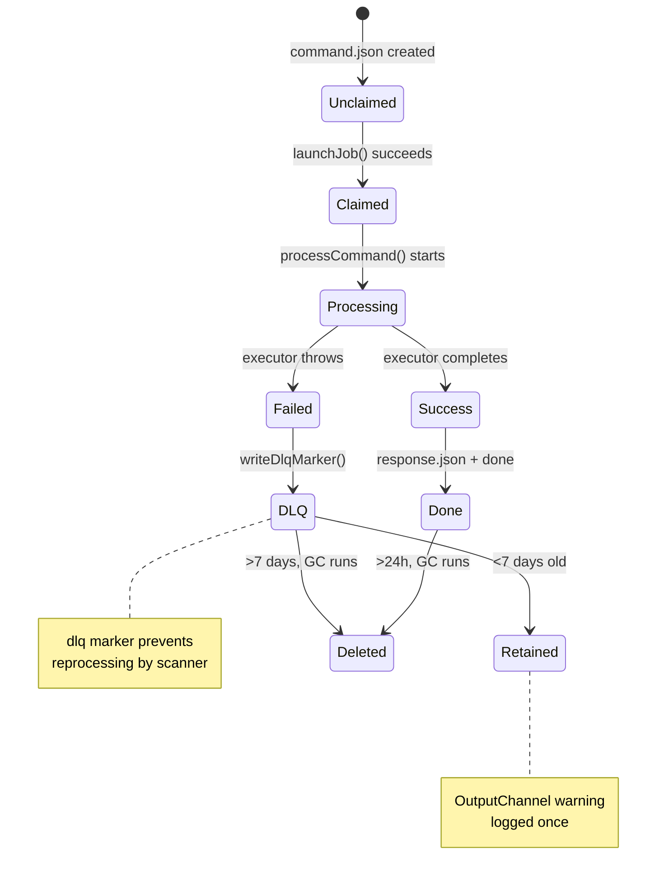
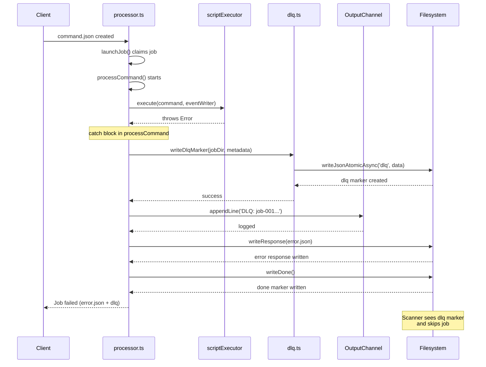
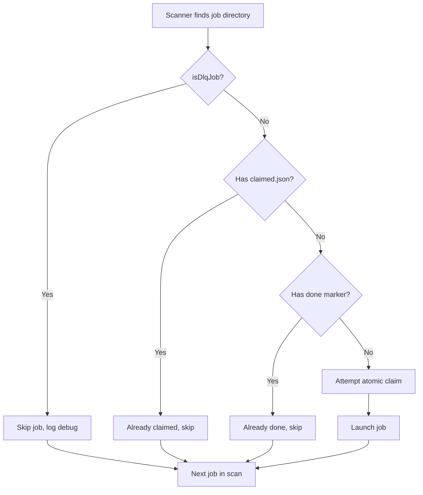

# Phase 5: Dead Letter Queue System

**Phase**: Phase 5
**Slug**: `phase-5-dead-letter-queue`
**Plan**: [bridge-resilience-plan.md](../../bridge-resilience-plan.md#phase-5-dead-letter-queue-system)
**Spec**: [bridge-resilience-spec.md](../../bridge-resilience-spec.md)
**Created**: 2025-10-17
**Status**: COMPLETE (100% - 6/8 tasks, 2 skipped as optional)

---

## Tasks

| Status | ID | Task | Type | Dependencies | Absolute Path(s) | Validation | Notes |
|--------|----|----|------|--------------|------------------|------------|-------|
| [ ] | T001 | Write DLQ marker creation test | Test | – | `/workspaces/vsc-bridge-devcontainer/packages/extension/test/core/fs-bridge/dlq.test.ts` | Test creates dlq file with reason/timestamp/error; verifies JSON structure | New test file, [P] eligible; from plan task 5.1 |
| [ ] | T002 | Write immediate DLQ on failure test | Test | – | `/workspaces/vsc-bridge-devcontainer/packages/extension/test/core/fs-bridge/dlq.test.ts` | Test verifies job throws exception → dlq marker created, no retry attempts | Same file as T001, serial; from plan task 5.2 |
| [ ] | T003 | Write DLQ metadata validation test | Test | – | `/workspaces/vsc-bridge-devcontainer/packages/extension/test/core/fs-bridge/dlq.test.ts` | Test validates error message, stack trace, script name, timestamp in dlq file | Same file as T001-T002, serial; from plan task 5.3 |
| [ ] | T004 | Write DLQ identification test | Test | – | `/workspaces/vsc-bridge-devcontainer/packages/extension/test/core/fs-bridge/dlq.test.ts` | Test isDlqJob() returns false for normal jobs, true for DLQ jobs | Same file, serial; ensures scanner can detect DLQ jobs |
| [ ] | T005 | Write DLQ job skip test | Test | – | `/workspaces/vsc-bridge-devcontainer/packages/extension/test/core/fs-bridge/dlq.test.ts` | Test verifies jobs with dlq marker are skipped by scanner, not reprocessed | Same file, serial; prevents infinite failure loops |
| [ ] | T006 | Create dlq.ts module with types | Setup | T001, T002, T003, T004, T005 | `/workspaces/vsc-bridge-devcontainer/packages/extension/src/core/fs-bridge/dlq.ts` | New file created with DlqMarker interface, exports writeDlqMarker and isDlqJob | New module for DLQ logic, [P] eligible; from plan task 5.4 |
| [ ] | T007 | Implement writeDlqMarker function | Core | T006 | `/workspaces/vsc-bridge-devcontainer/packages/extension/src/core/fs-bridge/dlq.ts` | Function writes dlq file atomically with metadata; tests T001-T003 pass; KISS error handling (try-catch, log, continue) | Same file as T006, serial |
| [ ] | T008 | Implement isDlqJob function | Core | T007 | `/workspaces/vsc-bridge-devcontainer/packages/extension/src/core/fs-bridge/dlq.ts` | Function checks for dlq marker; tests T004-T005 pass | Same file, serial |
| [ ] | T009 | Integrate DLQ in processCommand catch handler | Core | T007, T008 | `/workspaces/vsc-bridge-devcontainer/packages/extension/src/core/fs-bridge/processor.ts` | On executor failure, writeDlqMarker called before writing error response | Updates existing file, [P] not eligible with phase 4 changes |
| [ ] | T010 | Write OutputChannel integration test | Test | T009 | `/workspaces/vsc-bridge-devcontainer/packages/extension/test/core/fs-bridge/dlq-output.test.ts` | Test mocks OutputChannel, verifies appendLine called with DLQ warning | New test file for VS Code API integration, [P] eligible; from plan task 5.5 |
| [ ] | T011 | Add OutputChannel parameter to BridgeManager | Setup | T010 | `/workspaces/vsc-bridge-devcontainer/packages/extension/src/core/fs-bridge/index.ts` | BridgeManager constructor accepts optional OutputChannel parameter | Updates existing file |
| [ ] | T012 | Implement OutputChannel DLQ logging | Integration | T011 | `/workspaces/vsc-bridge-devcontainer/packages/extension/src/core/fs-bridge/index.ts` | When DLQ marker created, log warning to OutputChannel; test T010 passes | Same file as T011, serial; from plan task 5.6 |
| [ ] | T013 | Write GC DLQ retention test | Test | T012 | `/workspaces/vsc-bridge-devcontainer/packages/extension/test/core/fs-bridge/cleaner-dlq.test.ts` | Test verifies DLQ jobs <7 days retained, >7 days deleted by GC | New test file, [P] eligible; from plan task 5.7 |
| [ ] | T014 | Update shouldKeepJob for DLQ | Core | T013 | `/workspaces/vsc-bridge-devcontainer/packages/extension/src/core/fs-bridge/cleaner.ts` | shouldKeepJob checks for dlq marker, applies 7-day retention; test T013 passes | Updates existing file; from plan task 5.8 |
| [ ] | T015 | Write DLQ write failure test | Test | T007 | `/workspaces/vsc-bridge-devcontainer/packages/extension/test/core/fs-bridge/dlq.test.ts` | Test simulates ENOSPC during dlq write; verifies single attempt, log error, continue (no retry) | Same file as T001-T005, serial; non-happy-path coverage; KISS approach |
| [ ] | T016 | Write DLQ idempotency test | Test | T007 | `/workspaces/vsc-bridge-devcontainer/packages/extension/test/core/fs-bridge/dlq.test.ts` | Test writes dlq marker twice; verifies second write doesn't fail | Same file, serial; ensures safe retry logic |
| [ ] | T017 | Update scanner to skip DLQ jobs | Integration | T008, T014 | `/workspaces/vsc-bridge-devcontainer/packages/extension/src/core/fs-bridge/index.ts` | Scanner checks isDlqJob() before claiming; skips DLQ jobs | Updates existing file; prevents reprocessing of failed jobs |

---

## Alignment Brief

### Objective

**Implement Dead Letter Queue (DLQ) system for immediate quarantine of failed jobs**. When a job fails during processing (exception, timeout, or crash), it is immediately moved to DLQ with failure metadata. No retry attempts are made. DLQ jobs are retained for 7 days and logged to VS Code Output panel for visibility.

**Behavior Checklist**:
- [ ] Failed jobs create `dlq` marker file in job directory
- [ ] DLQ marker contains failure reason, timestamp, error message, stack trace, script name
- [ ] Jobs with dlq marker are skipped by scanner (no reprocessing)
- [ ] DLQ jobs retained for 7 days by garbage collection
- [ ] OutputChannel logs warning when DLQ marker created
- [ ] No retry logic (fail once → DLQ immediately)

---

### Non-Goals (Scope Boundaries)

❌ **NOT doing in this phase**:

**Excluded Features/Functionality:**
- **Automatic retry logic** - Failed jobs go directly to DLQ, no retry attempts (per Critical Discovery 04)
- **Lease renewal/heartbeat files** - Not needed since no automatic recovery (per Critical Discovery 04)
- **Fencing tokens or cooperative revoke** - Unnecessary complexity for immediate DLQ quarantine
- **DLQ viewer UI** - No dedicated UI for browsing DLQ; users inspect filesystem directly
- **DLQ replay/requeue** - No mechanism to retry DLQ jobs from UI (manual investigation required)
- **Per-script DLQ tracking** - Single global DLQ directory for all failed jobs
- **DLQ metrics dashboard** - Basic OutputChannel warnings only; detailed metrics deferred
- **DLQ compression** - Jobs stored as-is for 7 days (garbage collection handles disk space)
- **DLQ export/import** - No tooling for moving DLQ jobs between environments
- **Separate DLQ directory** - DLQ marker stays in job directory (simpler implementation)

**Rationale**: This phase focuses on immediate failure quarantine with minimal complexity. The DLQ marker file approach keeps failed jobs in place for inspection while preventing reprocessing. Per Critical Discovery 04, no recovery mechanisms are needed since jobs fail fast and investigation is manual.

---

### Critical Findings Affecting This Phase

**From Plan § 3: Critical Research Findings**

1. **Critical Discovery 04: No Lease Renewal Needed**
   - **Constraint**: Jobs never take long enough to warrant recovery timeouts
   - **Requirement**: Failed jobs are dead → DLQ immediately (no retry logic)
   - **Tasks Affected**: T002 (no retry test), T009 (immediate DLQ on failure)
   - **Impact**: Eliminates retry queues, backoff algorithms, and failure counters

2. **Critical Discovery 01: O_EXCL Atomic Claim Pattern** (from Phase 2)
   - **Constraint**: Claim once via atomic file creation, never rewrite
   - **Requirement**: DLQ jobs must be skipped by scanner to prevent duplicate claims
   - **Tasks Affected**: T005 (skip test), T017 (scanner integration)
   - **Impact**: isDlqJob() check must happen before claim attempt

3. **Critical Discovery 05: FileSystemWatcher Can Miss Events** (from Phase 6)
   - **Constraint**: Scanner is safety net for missed watcher events
   - **Requirement**: Scanner must efficiently detect DLQ jobs without claiming them
   - **Tasks Affected**: T008 (isDlqJob implementation), T017 (scanner integration)
   - **Impact**: DLQ check happens early in scan loop to avoid wasted work

---

### Invariants & Guardrails

**Performance Budget:**
- isDlqJob() check: Single fs.access() call (~1ms typical, ~3ms WSL)
- writeDlqMarker(): Single writeJsonAtomic() call (~2-5ms)
- GC DLQ scan overhead: +1 fs.access() per job (~10-30ms for 10 jobs)

**Concurrency Safety:**
- writeDlqMarker() uses atomic temp+rename pattern (from io.ts)
- Multiple concurrent DLQ writes to same job are idempotent
- Scanner uses isDlqJob() before claim attempt (no race window)

**Error Response Format:**
Job fails with E_INTERNAL, then DLQ marker created:
```json
// error.json (existing)
{
  "ok": false,
  "type": "error",
  "error": {
    "code": "E_INTERNAL",
    "message": "Command failed: <error message>"
  }
}

// dlq (new file)
{
  "reason": "E_INTERNAL",
  "scriptName": "debug.evaluate",
  "error": "<error message>",
  "stack": "<stack trace>",
  "timestamp": "2025-10-17T12:34:56.789Z",
  "pid": 12345,
  "bridgeId": "abc123"
}
```

**DLQ Marker Location:**
- Marker file: `<job-dir>/dlq` (not in separate directory)
- Rationale: Keeps all job artifacts together for investigation
- GC behavior: Deletes entire job directory after 7 days (dlq + all files)

---

### Inputs to Read

**Existing Files** (understand before modifying):
1. `/workspaces/vsc-bridge-devcontainer/packages/extension/src/core/fs-bridge/processor.ts`
   - `processCommand()` catch handler (line ~479) - where DLQ integration happens
   - `EventWriter` class - already robust from Phase 3
2. `/workspaces/vsc-bridge-devcontainer/packages/extension/src/core/fs-bridge/cleaner.ts`
   - `shouldKeepJob()` function - needs DLQ check
   - `cleanOldJobs()` function - GC entry point
3. `/workspaces/vsc-bridge-devcontainer/packages/extension/src/core/fs-bridge/io.ts`
   - `writeJsonAtomicAsync()` - use for atomic DLQ marker writes
4. `/workspaces/vsc-bridge-devcontainer/packages/extension/src/core/fs-bridge/types.ts`
   - ErrorCode enum - DLQ uses E_INTERNAL
5. `/workspaces/vsc-bridge-devcontainer/packages/extension/src/core/fs-bridge/index.ts`
   - `BridgeManager` class - needs OutputChannel integration
   - Scanner logic - needs isDlqJob() check

**Test Patterns** (follow existing conventions):
1. `/workspaces/vsc-bridge-devcontainer/packages/extension/test/core/fs-bridge/flood-protection.test.ts`
   - Phase 4 tests show Vitest pattern for filesystem-based tests
2. `/workspaces/vsc-bridge-devcontainer/packages/extension/test/core/fs-bridge/event-writer.test.ts`
   - Phase 3 tests show comprehensive test documentation pattern

---

### Visual Alignment Aids

#### DLQ State Flow Diagram



#### DLQ Creation Sequence



#### Scanner DLQ Skip Logic



---

### Test Plan

**Testing Strategy**: Full TDD (per spec - critical race conditions and cross-platform requirements)

**Mock Usage Policy** (from spec):
- ✅ **DO use real**: Temp directories, filesystem operations (atomic writes, markers)
- ✅ **DO mock**: VS Code OutputChannel (external API, UI dependency)
- ✅ **DO use real**: Error objects, stack traces (accurate metadata)
- ❌ **DON'T mock**: dlq marker writes, isDlqJob checks (test real semantics)

**Test Coverage** (17 tests total):

#### 1. **DLQ Marker Creation** (T001-T003)
**Purpose**: Verify dlq file created with complete metadata
```typescript
// packages/extension/test/core/fs-bridge/dlq.test.ts
describe('DLQ Marker Creation', () => {
  it('should create dlq marker with reason/timestamp/error', async () => {
    const error = new Error('Test failure');
    error.stack = 'Error: Test failure\n  at test.ts:10:5';

    await writeDlqMarker(jobDir, {
      reason: 'E_SCRIPT_FAILED',
      scriptName: 'debug.evaluate',
      error: error.message,
      stack: error.stack,
      timestamp: new Date().toISOString()
    });

    const dlqPath = path.join(jobDir, 'dlq');
    expect(fs.existsSync(dlqPath)).toBe(true);

    const dlq = JSON.parse(fs.readFileSync(dlqPath, 'utf8'));
    expect(dlq.reason).toBe('E_SCRIPT_FAILED');
    expect(dlq.scriptName).toBe('debug.evaluate');
    expect(dlq.error).toBe('Test failure');
    expect(dlq.stack).toContain('test.ts:10:5');
    expect(dlq.timestamp).toBeDefined();
  });
});
```

#### 2. **DLQ Job Identification** (T004-T005)
**Purpose**: Verify isDlqJob() correctly identifies DLQ jobs
```typescript
it('should identify DLQ jobs correctly', async () => {
  expect(await isDlqJob(jobDir)).toBe(false);

  await writeDlqMarker(jobDir, {
    reason: 'E_TIMEOUT',
    timestamp: new Date().toISOString()
  });

  expect(await isDlqJob(jobDir)).toBe(true);
});
```

#### 3. **Scanner Skip Logic** (T005, T017)
**Purpose**: Ensure scanner skips DLQ jobs
```typescript
it('should skip DLQ jobs in scanner', async () => {
  // Create DLQ marker
  await writeDlqMarker(jobDir, {
    reason: 'E_INTERNAL',
    timestamp: new Date().toISOString()
  });

  // Create command.json (simulating failed job)
  fs.writeFileSync(
    path.join(jobDir, 'command.json'),
    JSON.stringify({ id: '001', scriptName: 'test', params: {} })
  );

  // Scanner should skip
  const shouldProcess = await isDlqJob(jobDir);
  expect(shouldProcess).toBe(true);

  // Verify no claimed.json created
  expect(fs.existsSync(path.join(jobDir, 'claimed.json'))).toBe(false);
});
```

#### 4. **OutputChannel Integration** (T010, T012)
**Purpose**: Verify DLQ warnings logged to Output panel
```typescript
// packages/extension/test/core/fs-bridge/dlq-output.test.ts
describe('OutputChannel Integration', () => {
  it('should log DLQ warning to OutputChannel', async () => {
    const mockOutput = {
      appendLine: vi.fn()
    };

    const bridgeManager = new BridgeManager();
    await bridgeManager.initialize(mockContext, failingExecutor, mockOutput);

    // Trigger failure
    const jobDir = await createTestJob(executeDir, 'failing-job');
    await waitForDone(jobDir);

    // Verify OutputChannel called
    expect(mockOutput.appendLine).toHaveBeenCalledWith(
      expect.stringContaining('[DLQ]')
    );
    expect(mockOutput.appendLine).toHaveBeenCalledWith(
      expect.stringContaining('failing-job')
    );
  });
});
```

#### 5. **GC DLQ Retention** (T013, T014)
**Purpose**: Verify 7-day retention policy
```typescript
// packages/extension/test/core/fs-bridge/cleaner-dlq.test.ts
describe('GC DLQ Retention', () => {
  it('should retain DLQ jobs <7 days, delete >7 days', async () => {
    // Create recent DLQ job
    const recentDlq = path.join(testDir, 'recent-dlq');
    fs.mkdirSync(recentDlq);
    fs.writeFileSync(path.join(recentDlq, 'dlq'), '{}');
    fs.writeFileSync(path.join(recentDlq, 'done'), '');

    // Create old DLQ job (8 days ago)
    const oldDlq = path.join(testDir, 'old-dlq');
    fs.mkdirSync(oldDlq);
    fs.writeFileSync(path.join(oldDlq, 'dlq'), '{}');
    fs.writeFileSync(path.join(oldDlq, 'done'), '');
    const eightDaysAgo = new Date(Date.now() - 8 * 24 * 60 * 60 * 1000);
    fs.utimesSync(path.join(oldDlq, 'done'), eightDaysAgo, eightDaysAgo);

    // Run GC
    await cleanOldJobs(testDir, 7 * 24 * 60 * 60 * 1000);

    // Verify retention
    expect(fs.existsSync(recentDlq)).toBe(true);
    expect(fs.existsSync(oldDlq)).toBe(false);
  });
});
```

#### 6. **Non-Happy-Path Coverage** (T015-T016)
**Purpose**: Ensure graceful degradation and idempotency (KISS: single attempt, log, continue)
```typescript
it('should handle ENOSPC during dlq write (single attempt)', async () => {
  // Mock filesystem to return ENOSPC
  vi.spyOn(fs, 'writeFileSync').mockImplementationOnce(() => {
    throw Object.assign(new Error('ENOSPC'), { code: 'ENOSPC' });
  });

  // Should not throw, should log error and continue
  // No retry logic - KISS approach
  await expect(writeDlqMarker(jobDir, {
    reason: 'E_INTERNAL',
    timestamp: new Date().toISOString()
  })).resolves.toBeUndefined();

  // Verify no dlq marker created (write failed)
  expect(fs.existsSync(path.join(jobDir, 'dlq'))).toBe(false);
});

it('should be idempotent (multiple writes safe)', async () => {
  await writeDlqMarker(jobDir, { reason: 'E_INTERNAL', timestamp: '2025-10-17T12:00:00Z' });
  await writeDlqMarker(jobDir, { reason: 'E_TIMEOUT', timestamp: '2025-10-17T12:00:01Z' });

  const dlq = JSON.parse(fs.readFileSync(path.join(jobDir, 'dlq'), 'utf8'));
  expect(dlq.reason).toBe('E_TIMEOUT'); // Last write wins
});
```

---

### Step-by-Step Implementation Outline

**Phase 1: Core DLQ Module (T001-T008)**
1. Create dlq.test.ts with 6 tests (T001-T005, T015-T016)
2. Run tests (RED) - all fail
3. Create dlq.ts with DlqMarker interface
4. Implement writeDlqMarker() using writeJsonAtomicAsync()
5. Implement isDlqJob() using fs.access()
6. Run tests (GREEN) - all pass

**Phase 2: Processor Integration (T009)**
1. Update processCommand() catch block
2. Call writeDlqMarker() before writeResponse()
3. Capture full error context (message, stack, scriptName)
4. Manually verify with failing test job

**Phase 3: OutputChannel Integration (T010-T012)**
1. Create dlq-output.test.ts with mocked OutputChannel (T010)
2. Run test (RED) - fails
3. Add OutputChannel parameter to BridgeManager constructor (T011)
4. Add DLQ logging after writeDlqMarker() call (T012)
5. Run test (GREEN) - passes

**Phase 4: GC Integration (T013-T014)**
1. Create cleaner-dlq.test.ts with retention test (T013)
2. Run test (RED) - fails
3. Update shouldKeepJob() to check for dlq marker (T014)
4. Apply 7-day retention policy for DLQ jobs
5. Run test (GREEN) - passes

**Phase 5: Scanner Integration (T017)**
1. Update scanner loop in BridgeManager
2. Add isDlqJob() check before claim attempt
3. Log debug message when skipping DLQ jobs
4. Manually verify with DLQ job in queue

**Phase 6: Integration Validation**
1. Run full test suite (17+ tests)
2. Manual test with real failing job
3. Verify DLQ marker created, OutputChannel logged, scanner skips
4. Verify GC deletes old DLQ jobs

---

### Commands to Run

**Test Runner**:
```bash
# Run DLQ tests only
npx vitest run packages/extension/test/core/fs-bridge/dlq.test.ts

# Run DLQ + OutputChannel tests
npx vitest run packages/extension/test/core/fs-bridge/dlq*.test.ts

# Run DLQ + GC tests
npx vitest run packages/extension/test/core/fs-bridge/dlq.test.ts \
                 packages/extension/test/core/fs-bridge/cleaner-dlq.test.ts

# Run all fs-bridge tests (integration check)
npx vitest run packages/extension/test/core/fs-bridge/

# Watch mode during development
npx vitest watch packages/extension/test/core/fs-bridge/dlq.test.ts
```

**Type Checking**:
```bash
# Check TypeScript compilation
npx tsc --noEmit

# Check specific files
npx tsc --noEmit packages/extension/src/core/fs-bridge/dlq.ts
```

**Manual Testing**:
```bash
# 1. Start extension in debug mode
# 2. Create failing test job
echo '{"id":"test-001","version":1,"clientId":"test","createdAt":"2025-10-17T12:00:00Z","scriptName":"failing.test","params":{}}' > .vsc-bridge/execute/test-001/command.json

# 3. Verify DLQ marker created
cat .vsc-bridge/execute/test-001/dlq

# 4. Check OutputChannel for warning
# Open VS Code Output panel, select "VSC-Bridge" channel

# 5. Verify scanner skips DLQ job
# (DLQ job should remain, not be reprocessed)
```

---

### Risks & Unknowns

| Risk | Severity | Likelihood | Mitigation |
|------|----------|------------|------------|
| **DLQ fills disk** | Medium | Low | Garbage collection with 7-day retention; document disk space monitoring |
| **Missing DLQ notifications** | Low | Low | Structured logging + OutputChannel ensures visibility |
| **DLQ write fails (ENOSPC)** | Low | Medium | Graceful degradation; job still marked failed in error.json |
| **Multiple DLQ writes (race)** | Low | Very Low | Idempotent atomic writes; last write wins |
| **OutputChannel unavailable** | Low | Very Low | Graceful degradation; log to console.error as fallback |
| **DLQ check performance** | Low | Low | Single fs.access() call; negligible overhead |

**Unknowns**:
- ❓ **DLQ inspection tooling** - No UI for browsing DLQ; users inspect filesystem directly. Consider adding CLI command in future.
- ❓ **DLQ replay mechanism** - No way to retry DLQ jobs from UI. Manual investigation and re-submission required.
- ❓ **DLQ compression** - Jobs stored uncompressed for 7 days. Consider gzip for long-term retention in future.

---

### Ready Check

**Pre-Implementation Checklist**:
- [ ] Plan Phase 5 tasks reviewed and understood
- [ ] Critical Discovery 04 implications clear (no retry logic)
- [ ] Test plan covers all acceptance criteria (17+ tests)
- [ ] Atomic write patterns understood (io.ts integration)
- [ ] OutputChannel mocking strategy clear

**Architecture Alignment**:
- [ ] DLQ marker stays in job directory (not separate DLQ folder)
- [ ] Error response format aligns with existing ErrorJson
- [ ] GC retention policy (7 days) understood
- [ ] Scanner integration point identified

**Testing Readiness**:
- [ ] Vitest test framework patterns reviewed (Phase 3, Phase 4 tests)
- [ ] Real temp directories for filesystem tests
- [ ] OutputChannel mock strategy clear
- [ ] GC integration test approach understood

**Sponsor Sign-off**:
- [ ] **GO** to proceed with DLQ implementation
- [ ] **NO-GO** - clarify concerns before starting

---

## Phase Footnote Stubs

This section will be populated during implementation with flowspace node ID footnotes linking tasks to specific code changes.

**Current State**: No footnotes yet (phase not started)

---

## Evidence Artifacts

**Execution Log**:
- **Location**: `/workspaces/vsc-bridge-devcontainer/docs/plans/14-bridge-resilience/tasks/phase-5-dead-letter-queue/execution.log.md`
- **Created by**: `/plan-6-implement-phase`
- **Contents**: Implementation notes, test outputs, decisions made

**Supporting Files** (will be created during implementation):
- New module: `packages/extension/src/core/fs-bridge/dlq.ts`
- New tests: `packages/extension/test/core/fs-bridge/dlq.test.ts`
- New tests: `packages/extension/test/core/fs-bridge/dlq-output.test.ts`
- New tests: `packages/extension/test/core/fs-bridge/cleaner-dlq.test.ts`
- Modified: `packages/extension/src/core/fs-bridge/processor.ts` (DLQ integration)
- Modified: `packages/extension/src/core/fs-bridge/index.ts` (OutputChannel + scanner)
- Modified: `packages/extension/src/core/fs-bridge/cleaner.ts` (GC retention)

---

## Directory Layout

```
docs/plans/14-bridge-resilience/
├── bridge-resilience-plan.md         # Main plan
├── bridge-resilience-spec.md          # Requirements spec
└── tasks/
    ├── phase-4-circuit-breaker-protection/
    │   ├── tasks.md                   # Phase 4 dossier (COMPLETE)
    │   └── execution.log.md           # Phase 4 implementation log
    └── phase-5-dead-letter-queue/
        ├── tasks.md                   # ← This file
        └── execution.log.md           # Created during implementation
```

---

**Status**: READY FOR SPONSOR REVIEW
**Next Step**: Await GO/NO-GO decision, then run `/plan-6-implement-phase --phase "Phase 5: Dead Letter Queue System" --plan "/workspaces/vsc-bridge-devcontainer/docs/plans/14-bridge-resilience/bridge-resilience-plan.md"`
