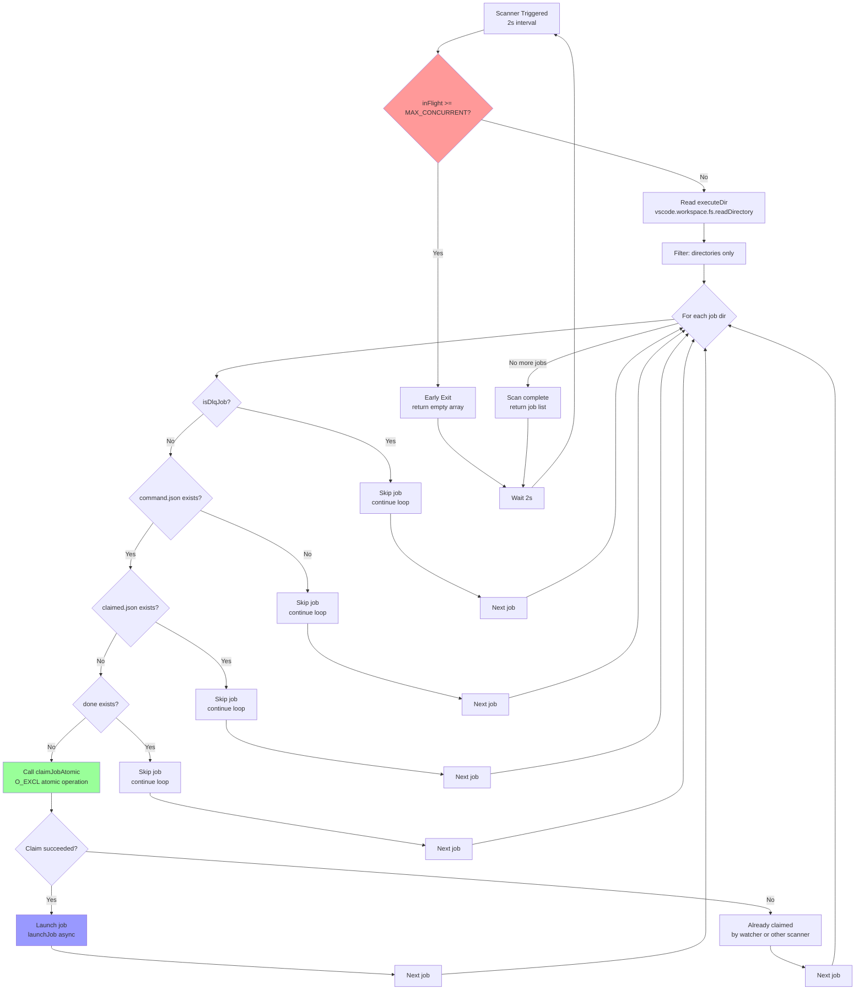
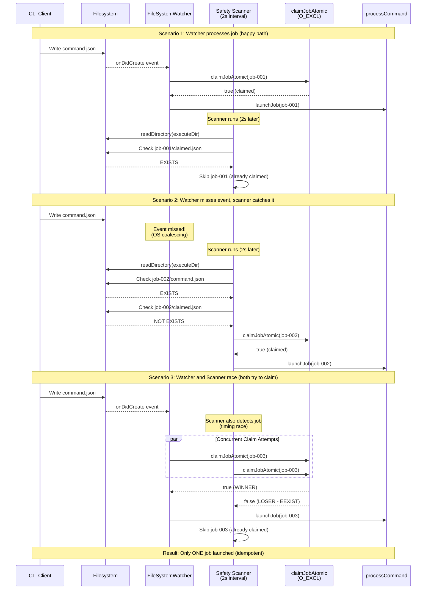

# Phase 6: Enhanced Job Scanner - Tasks & Alignment Brief

**Phase**: Phase 6: Enhanced Job Scanner
**Slug**: phase-6-enhanced-job-scanner
**Plan**: [Bridge Resilience Plan](../../bridge-resilience-plan.md)
**Spec**: [Bridge Resilience Spec](../../spec.md) *(if exists)*
**Date**: 2025-10-17
**Status**: PENDING (0%)

---

## Tasks

| Status | ID | Task | Type | Dependencies | Absolute Path(s) | Validation | Notes |
|--------|----|----|------|--------------|------------------|------------|-------|
| [ ] | T001 | Review existing scanner implementation in BridgeManager | Setup | – | `/workspaces/vsc-bridge-devcontainer/packages/extension/src/core/fs-bridge/index.ts` | Understand current `startPeriodicSafetyScan()` logic (lines 211-255) | Identify: stat() call count, capacity check location, deduplication mechanism |
| [ ] | T002 | Document optimization opportunities from code review | Setup | T001 | `/workspaces/vsc-bridge-devcontainer/docs/plans/14-bridge-resilience/tasks/phase-6-enhanced-job-scanner/execution.log.md` | List identified issues: (1) 4 stat calls per job, (2) no capacity check in scanner, (3) no deduplication | Foundation for implementation tasks |
| [ ] | T003 | Write test: scanner finds unclaimed jobs only | Test | T002 | `/workspaces/vsc-bridge-devcontainer/packages/extension/test/core/fs-bridge/scanner.test.ts` | Test creates 4 jobs (unclaimed, claimed, done, DLQ), scanner returns only unclaimed job | Per plan task 6.1; MUST FAIL initially (RED) |
| [ ] | T004 | Write test: scanner ignores claimed/done/DLQ jobs | Test | T002 | `/workspaces/vsc-bridge-devcontainer/packages/extension/test/core/fs-bridge/scanner.test.ts` | Test verifies claimed.json/done/dlq files prevent job from appearing in scan results | Per plan task 6.1; MUST FAIL initially (RED) |
| [ ] | T005 | Write test: scanner handles missing executeDir gracefully | Test | T002 | `/workspaces/vsc-bridge-devcontainer/packages/extension/test/core/fs-bridge/scanner.test.ts` | Scanner returns empty array when executeDir doesn't exist (no throw) | Non-happy-path coverage; MUST FAIL initially (RED) |
| [ ] | T006 | Write test: scanner deduplication via atomic claim | Test | T002 | `/workspaces/vsc-bridge-devcontainer/packages/extension/test/core/fs-bridge/scanner.test.ts` | Two concurrent scans find same job, only one claim succeeds (via O_EXCL) | Per plan task 6.2; validates Critical Discovery 01; MUST FAIL initially (RED) |
| [ ] | T007 | Write test: repeated scans don't re-claim same job | Test | T002 | `/workspaces/vsc-bridge-devcontainer/packages/extension/test/core/fs-bridge/scanner.test.ts` | Scan once (claims job), scan again (job already claimed, skip) | Per plan task 6.2; idempotency validation; MUST FAIL initially (RED) |
| [ ] | T008 | Write test: scanner checks capacity before claiming | Test | T002 | `/workspaces/vsc-bridge-devcontainer/packages/extension/test/core/fs-bridge/scanner.test.ts` | When inFlight >= MAX_CONCURRENT, scanner returns early without claiming new jobs | Per plan task 6.3; advisory check (launchJob enforces authoritatively); MUST FAIL initially (RED) |
| [ ] | T009 | Write test: scanner claims jobs when capacity available | Test | T002 | `/workspaces/vsc-bridge-devcontainer/packages/extension/test/core/fs-bridge/scanner.test.ts` | When inFlight < MAX_CONCURRENT, scanner claims unclaimed jobs | Per plan task 6.3; MUST FAIL initially (RED) |
| [ ] | T010 | Write test: scanner respects capacity after partial claims | Test | T002 | `/workspaces/vsc-bridge-devcontainer/packages/extension/test/core/fs-bridge/scanner.test.ts` | Scanner claims jobs until hitting capacity, leaves remaining jobs unclaimed | Per plan task 6.3; integration with capacity tracking; MUST FAIL initially (RED) |
| [ ] | T011 | Write test: scanner performance benchmark (optional) | Test | T002 | `/workspaces/vsc-bridge-devcontainer/packages/extension/test/core/fs-bridge/scanner-perf.test.ts` | Performance benchmark: 1000 jobs (mix of unclaimed/claimed/done/DLQ), log scan time for reference | Per plan task 6.5; optional benchmark (no strict requirement); [P] eligible (separate file) |
| [ ] | T012 | Write integration test: watcher and scanner don't double-process | Test | T002 | `/workspaces/vsc-bridge-devcontainer/packages/extension/test/integration/scanner-watcher.test.ts` | Job processed by watcher OR scanner, never both (via atomic claim); requires Extension Host | Per plan task 6.7; validates hybrid mechanism; integration test (slower); MUST FAIL initially (RED) |
| [ ] | T013 | Write integration test: scanner catches jobs missed by watcher | Test | T002 | `/workspaces/vsc-bridge-devcontainer/packages/extension/test/integration/scanner-watcher.test.ts` | Simulate missed watcher event (create job without triggering watcher), scanner finds it within 2s; requires Extension Host | Per plan task 6.7; validates Critical Discovery 05; integration test (slower); MUST FAIL initially (RED) |
| [ ] | T014a | Create filesystem abstraction interface | Core | T003-T013 | `/workspaces/vsc-bridge-devcontainer/packages/extension/src/core/fs-bridge/fs-abstraction.ts` (NEW) | Define IFilesystem interface with readDirectory, stat, exists methods; implement VsCodeFilesystem (wraps vscode.workspace.fs) and NodeFilesystem (wraps fs.promises) adapters | Enables dependency injection for remote workspace support and unit testing; exists() completes abstraction; [P] eligible (new file) |
| [ ] | T014c | Update isDlqJob() to accept IFilesystem parameter | Core | T014a | `/workspaces/vsc-bridge-devcontainer/packages/extension/src/core/fs-bridge/dlq.ts` | Change signature to `isDlqJob(jobDir: string, fs: IFilesystem): Promise<boolean>`; update implementation to use injected fs instead of Node fs.promises | Breaking change: fixes remote workspace bug, makes isDlqJob testable; Serial (shared file) |
| [ ] | T014d | Update all isDlqJob() call sites to pass filesystem | Core | T014c | `/workspaces/vsc-bridge-devcontainer/packages/extension/src/core/fs-bridge/index.ts`, `/workspaces/vsc-bridge-devcontainer/packages/extension/src/core/fs-bridge/processor.ts`, `/workspaces/vsc-bridge-devcontainer/packages/extension/src/core/fs-bridge/cleaner.ts` | Update all callers: index.ts (line 228), processor.ts, cleaner.ts to pass VsCodeFilesystem adapter | Mechanical fix for breaking change; Serial (multiple files) |
| [ ] | T014b | Extract scanner logic to `scanForUnclaimedJobs()` function | Core | T014a,T014d | `/workspaces/vsc-bridge-devcontainer/packages/extension/src/core/fs-bridge/scanner.ts` (NEW) | Create function: `scanForUnclaimedJobs(executeDir, bridgeId, fs: IFilesystem): Promise<string[]>` with injected filesystem; calls isDlqJob(jobDir, fs) and fs.exists() for file checks | Per plan task 6.4; export for testing; uses fs.exists() not io.ts exists(); Serial |
| [ ] | T015 | Implement capacity check in scanner (early exit) | Core | T014b | `/workspaces/vsc-bridge-devcontainer/packages/extension/src/core/fs-bridge/scanner.ts` | Check `inFlight >= MAX_CONCURRENT` before scanning, return empty array if saturated; add comment: "Advisory check - launchJob() enforces authoritatively" | Per plan task 6.4; makes T008-T010 pass (GREEN); addresses task 6.3; Serial (shared file) |
| [ ] | T016 | Optimize scanner to reduce stat() calls (optional) | Core | T015 | `/workspaces/vsc-bridge-devcontainer/packages/extension/src/core/fs-bridge/scanner.ts` | Reduce from 4 stat calls (isDlqJob + hasCommand + hasClaimed + isDone) to 2 (early exists check for claimed/done before isDlqJob) if simple | Per plan task 6.6; optional optimization; Serial (shared file) |
| [ ] | T017 | Add early exit for non-directories and missing command.json | Core | T016 | `/workspaces/vsc-bridge-devcontainer/packages/extension/src/core/fs-bridge/scanner.ts` | Skip non-directory entries early, skip if command.json missing before other checks | Per plan task 6.6; basic filtering; Serial (shared file) |
| [ ] | T018 | Update `startPeriodicSafetyScan()` to use `scanForUnclaimedJobs()` | Integration | T017 | `/workspaces/vsc-bridge-devcontainer/packages/extension/src/core/fs-bridge/index.ts` | Replace inline scanner logic with call to `scanForUnclaimedJobs()`, pass VsCodeFilesystem adapter | Per plan task 6.8; refactor existing code; Serial (shared file) |
| [ ] | T019 | Run full test suite for Phase 6 | Integration | T018 | `/workspaces/vsc-bridge-devcontainer/packages/extension/test/core/fs-bridge/scanner.test.ts` (unit), `/workspaces/vsc-bridge-devcontainer/packages/extension/test/core/fs-bridge/scanner-perf.test.ts` (unit), `/workspaces/vsc-bridge-devcontainer/packages/extension/test/integration/scanner-watcher.test.ts` (integration) | All 13 tests passing: 11 unit tests (T003-T011) + 2 integration tests (T012-T013) | Validates all acceptance criteria; run unit tests with Vitest, integration with Extension Host; [P] eligible |
| [ ] | T020 | Document implementation notes in execution log | Doc | T019 | `/workspaces/vsc-bridge-devcontainer/docs/plans/14-bridge-resilience/tasks/phase-6-enhanced-job-scanner/execution.log.md` | Record: (1) scanner extraction approach, (2) capacity check effectiveness, (3) test results | Phase 6 evidence artifacts; [P] eligible (new file) |

---

## Alignment Brief

### Objective

**Goal**: Improve the periodic safety scanner to efficiently detect unclaimed jobs without blocking the event loop or violating capacity limits, serving as a reliable fallback for missed FileSystemWatcher events.

**Behavior Checklist** (per plan acceptance criteria):
- [ ] Scanner finds unclaimed jobs (command.json present, no claimed.json/done/dlq)
- [ ] Scanner ignores claimed, done, and DLQ jobs
- [ ] Scanner checks capacity before claiming (early exit if saturated)
- [ ] Scanner is idempotent (repeated scans don't double-process)
- [ ] Scanner cooperates with watcher (no double-processing via atomic claim)
- [ ] Scanner performs reasonably well (no strict performance requirement)
- [ ] Scanner handles edge cases gracefully (missing directories, permission errors)
- [ ] Test coverage >85% for scanner logic (per plan)

### Non-Goals (Scope Boundaries)

❌ **NOT doing in this phase**:

- **Changing scan interval from 2 seconds** - Per Critical Discovery 03 and 05, 2-second interval is correct for both native and WSL, balancing responsiveness with CPU efficiency
- **Adding job prioritization or sorting** - Scanner processes jobs in directory order (simple, predictable)
- **Implementing retry logic for failed claims** - Atomic claim (O_EXCL) either succeeds or fails immediately; no retry needed
- **Optimizing watcher event handling** - Phase 6 focuses on scanner only; watcher logic remains unchanged
- **Adding scanner metrics/telemetry** - Simple console logging is sufficient for debugging (OutputChannel integration deferred from Phase 5)
- **Handling job deletion mid-scan** - ENOENT errors are logged but don't stop scan (graceful degradation)
- **Creating dedicated scanner configuration** - Scanner parameters (interval, capacity) are hardcoded per plan requirements

### Critical Findings Affecting This Phase

**From Plan § 3: Critical Research Findings**

1. **Critical Discovery 01: O_EXCL Atomic Claim Pattern**
   - **Constraint**: Multiple concurrent claim attempts (watcher + scanner, or scanner + scanner) must be idempotent
   - **Requirement**: Scanner relies on `claimJobAtomic()` (using `fs.openSync(path, 'wx')`) to prevent double-processing
   - **Tasks**: T006, T007, T012 validate deduplication via atomic claim

2. **Critical Discovery 03: Platform-Specific Filesystem Timing**
   - **Constraint**: WSL filesystem operations are 2-3x slower than native
   - **Requirement**: 2-second scan interval (already implemented) must remain unchanged
   - **Tasks**: T011 performance test validates <500ms scan time on both platforms

3. **Critical Discovery 05: FileSystemWatcher Can Miss Events**
   - **Constraint**: Watcher can miss or coalesce rapid file creation events (especially on WSL)
   - **Requirement**: Scanner is the safety net for missed events; must detect all unclaimed jobs
   - **Tasks**: T003-T004 validate discovery logic, T013 validates missed event recovery

### Invariants & Guardrails

**Performance Approach**:
- Scanner execution: Keep it simple, no strict performance requirements
- Stat() calls: Optimize only if trivial (don't over-engineer)
- Memory: No job list accumulation (stream processing via async iteration)

**Concurrency Guarantees**:
- Capacity check: Scanner MUST check `inFlight >= MAX_CONCURRENT` before claiming
- Atomic claim: Scanner MUST use `claimJobAtomic()` (never direct fs.writeFile)
- No blocking: Scanner runs in 2-second interval without blocking event loop

**Error Handling**:
- Missing executeDir: Return empty array (no throw)
- Permission denied: Skip job, log warning, continue scan
- ENOENT mid-scan: Skip job, log, continue (job deleted concurrently)

### Architectural Decisions

**Decision 1: Filesystem Abstraction via Dependency Injection**

**Problem**: Scanner uses `vscode.workspace.fs` API which blocks unit testing (no VS Code runtime in Vitest).

**Solution**: Create `IFilesystem` interface with two adapters:
- `VsCodeFilesystem` - wraps `vscode.workspace.fs` for production (supports remote workspaces)
- `NodeFilesystem` - wraps Node `fs.promises` for unit tests (fast, no VS Code required)

**Interface**:
```typescript
interface IFilesystem {
  readDirectory(path: string): Promise<[string, FileType][]>;
  stat(path: string): Promise<FileStat>;
  exists(path: string): Promise<boolean>;
}
```

**Scanner signature**:
```typescript
async function scanForUnclaimedJobs(
  executeDir: string,
  bridgeId: string,
  fs: IFilesystem
): Promise<string[]>
```

**Benefits**:
- ✅ Unit tests work in Vitest (inject NodeFilesystem)
- ✅ Remote workspaces supported (VsCodeFilesystem uses VS Code API)
- ✅ Fast TDD cycles (no Extension Host overhead)
- ✅ Clean separation of concerns

**Tasks affected**: T014a (new file), T014b (updated signature), T003-T013 (tests inject NodeFilesystem), T018 (production injects VsCodeFilesystem)

**Decision 2: Update isDlqJob() Signature for Consistency**

**Problem**: `isDlqJob()` uses Node `fs.promises` directly, which won't work on remote workspaces. Scanner will inject VS Code filesystem but isDlqJob won't use it.

**Solution**: Update `isDlqJob()` signature to accept `IFilesystem` parameter:
```typescript
async function isDlqJob(jobDir: string, fs: IFilesystem): Promise<boolean>
```

**Breaking change impact**:
- index.ts (line 228): scanner calls isDlqJob
- processor.ts: possibly used in error handling
- cleaner.ts: DLQ retention logic calls isDlqJob

**Benefits**:
- ✅ Consistent abstraction (all filesystem ops use IFilesystem)
- ✅ Fixes remote workspace bug (DLQ detection works on SSH remotes)
- ✅ Makes isDlqJob testable (inject NodeFilesystem in DLQ tests)
- ✅ Explicit dependencies (no global state)

**Tasks affected**: T014c (update isDlqJob signature), T014d (update all call sites: index.ts, processor.ts, cleaner.ts), T014b (scanner depends on updated isDlqJob)

**Decision 3: Advisory Capacity Check (Accept Race Condition)**

**Problem**: Scanner's capacity check (`inFlight >= MAX_CONCURRENT`) has a race window where multiple scanners/watcher can bypass limit concurrently before incrementing counter.

**Solution**: Accept advisory capacity check; `launchJob()` provides authoritative enforcement.

**Why this is safe**:
- `launchJob()` ALWAYS checks capacity and writes E_CAPACITY error if exceeded
- Worst case: scanner scans unnecessarily, `launchJob()` rejects over-capacity jobs
- No jobs get lost, no capacity violations persist
- This is a low-scale system (minimal resources), slight over-capacity is acceptable

**Design principle**:
- Scanner capacity check = optimization (avoid wasted scanning when clearly at capacity)
- `launchJob()` capacity check = enforcement (authoritative, writes error response)

**Tasks affected**: T008-T010 (document advisory nature in validation notes), T015 (add comment explaining advisory check)

**Decision 4: Integration Tests for Watcher-Scanner Cooperation**

**Problem**: T012-T013 need to test watcher-scanner interaction, but `vscode.workspace.createFileSystemWatcher()` requires Extension Host (VS Code runtime), not available in Vitest unit tests.

**Solution**: Make T012-T013 integration tests that run with Extension Host; keep T003-T011 as fast unit tests.

**Test breakdown**:
- **Unit tests (T003-T011)**: 11 tests, fast Vitest execution, inject NodeFilesystem
- **Integration tests (T012-T013)**: 2 tests, slower Extension Host execution, test real watcher behavior

**Why this is worth it**:
- Watcher-scanner cooperation is critical (Critical Discovery 05: FileSystemWatcher can miss events)
- Real watcher behavior is complex (OS-level coalescing, event ordering, timing)
- Mocking watcher wouldn't give high confidence
- 2 slower tests (out of 13) is acceptable tradeoff for critical coverage

**Test execution**:
- Fast TDD cycles: `npx vitest test/core/fs-bridge/scanner.test.ts` (11 unit tests)
- Full validation: Run unit tests + integration tests before marking phase complete

**Tasks affected**: T012-T013 (moved to `test/integration/scanner-watcher.test.ts`, marked as requiring Extension Host), T019 (updated to reflect split: 11 unit + 2 integration)

**Decision 5: Add exists() to IFilesystem Interface**

**Problem**: Scanner calls `exists()` helper (io.ts) which uses Node `fs.promises.access()`, breaking remote workspace support. Scanner needs to check for command.json, claimed.json, done files.

**Solution**: Add `exists(path: string): Promise<boolean>` to IFilesystem interface.

**Interface addition**:
```typescript
interface IFilesystem {
  readDirectory(path: string): Promise<[string, FileType][]>;
  stat(path: string): Promise<FileStat>;
  exists(path: string): Promise<boolean>; // NEW
}
```

**Implementation**:
- VsCodeFilesystem: Wrap `vscode.workspace.fs.stat()` in try/catch (return true if succeeds, false if throws)
- NodeFilesystem: Wrap `fs.promises.access()` in try/catch
- Scanner: Use `fs.exists()` instead of `exists()` helper from io.ts

**Benefits**:
- ✅ Completes filesystem abstraction (natural API)
- ✅ Scanner works on remote workspaces (all file checks abstracted)
- ✅ Clean separation (scanner doesn't depend on io.ts exists helper)

**Follow-up investigation** (completed via subagent):
- ⚠️ **Critical finding**: 16 blocking sync operations found across fs-bridge modules
  - io.ts: 8 sync ops (openSync, writeFileSync, fsyncSync, renameSync for atomic writes)
  - bridge.ts: 5 sync ops (lock file management, health heartbeat)
  - processor.ts: 3 sync ops (atomic claim creation)
  - processor.ts: EventWriter uses `fs.createWriteStream()` (no VS Code API equivalent)
- **Impact**: Full remote workspace support requires comprehensive refactoring (beyond Phase 6)
- **Phase 6 scope**: Scanner + isDlqJob only (limited IFilesystem abstraction)
- **Future work**: Create dedicated phase/issue for fs-bridge remote workspace refactoring

**Tasks affected**: T014a (add exists() to interface), T014b (scanner uses fs.exists()), T020 (document subagent findings)

---

### Inputs to Read

**Existing Code** (understand before modifying):
- `/workspaces/vsc-bridge-devcontainer/packages/extension/src/core/fs-bridge/index.ts` (lines 211-255: `startPeriodicSafetyScan()`)
- `/workspaces/vsc-bridge-devcontainer/packages/extension/src/core/fs-bridge/processor.ts` (lines 20-25: `MAX_CONCURRENT`, `inFlight`; lines 140-151: `claimJobAtomic()`)
- `/workspaces/vsc-bridge-devcontainer/packages/extension/src/core/fs-bridge/dlq.ts` (lines 36-52: `isDlqJob()`)

**Plan References**:
- [Bridge Resilience Plan § Phase 6](../../bridge-resilience-plan.md#phase-6-enhanced-job-scanner) (lines 1242-1428)
- [Critical Research Findings](../../bridge-resilience-plan.md#critical-research-findings) (lines 115-277)

### Visual Alignment Aids

#### Flow Diagram: Enhanced Scanner State Machine



#### Sequence Diagram: Scanner-Watcher Cooperation



### Test Plan (TAD with Vitest)

**Testing Approach**: Test-Assisted Development (TAD) per plan § Testing Philosophy

**Test Strategy**:
1. **Scratch exploration** (`test/scratch/scanner/`) - Fast iteration, no docs
2. **Selective promotion** - Promote tests passing CORE heuristic (Critical, Opaque, Regression-prone, Edge case)
3. **Real filesystem** - No mocks for fs operations (per plan idiom)
4. **Vitest framework** - Use `describe`, `it`, `expect`, `beforeEach`, `afterEach`

**Named Tests with Rationale**:

| Test ID | Test Name | Rationale | Fixtures | Expected Output |
|---------|-----------|-----------|----------|-----------------|
| T003 | `should find unclaimed jobs only` | **Critical path**: Core discovery logic | 4 jobs: unclaimed, claimed, done, DLQ | Returns 1 job (unclaimed) |
| T004 | `should ignore claimed/done/DLQ jobs` | **Regression-prone**: Prevents reprocessing | Jobs with claimed.json, done, dlq markers | Returns empty array |
| T005 | `should handle missing executeDir gracefully` | **Edge case**: Directory doesn't exist | Non-existent path | Returns empty array, no throw |
| T006 | `should deduplicate concurrent scans via atomic claim` | **Critical path**: Prevents double-processing | 1 unclaimed job, 2 concurrent scans | Both find job, only 1 claim succeeds |
| T007 | `should not re-claim job on repeated scan` | **Regression-prone**: Idempotency validation | 1 job, scan twice sequentially | First scan claims, second scan skips |
| T008 | `should check capacity before claiming (saturated)` | **Critical path**: Capacity enforcement | inFlight = 10, 5 unclaimed jobs | Returns empty array (capacity hit) |
| T009 | `should claim jobs when capacity available` | **Critical path**: Normal operation | inFlight = 5, 3 unclaimed jobs | Claims all 3 jobs |
| T010 | `should respect capacity after partial claims` | **Opaque behavior**: Incremental capacity | inFlight = 8, 5 unclaimed jobs | Claims 2 jobs, stops at MAX_CONCURRENT |
| T011 | `should scan 1000 jobs (benchmark)` | **Optional benchmark** | 1000 jobs (25% unclaimed) | Log scan time for reference (no strict requirement) |
| T012 | `should not double-process with watcher` | **Critical path**: Hybrid mechanism | Job processed by watcher, scanner runs | Atomic claim prevents double-processing |
| T013 | `should catch jobs missed by watcher` | **Critical path**: Safety net validation | Job created without watcher trigger | Scanner finds job within 2s |

**Test Doc Block Format** (for promoted tests):
```typescript
it('should find unclaimed jobs only', async () => {
  /**
   * Why: Validates core discovery logic - scanner must identify jobs needing processing
   * Contract: Given 4 jobs (unclaimed, claimed, done, DLQ), scanner returns only unclaimed job
   * Usage Notes: Uses real filesystem (no mocks); cleans up in afterEach
   * Quality Contribution: Critical path coverage (CORE heuristic)
   * Worked Example:
   *   Input: executeDir with job-001 (unclaimed), job-002 (claimed), job-003 (done), job-004 (DLQ)
   *   Output: ['job-001']
   */

  // Test implementation...
});
```

### Step-by-Step Implementation Outline

**Mapped 1:1 to tasks table**:

1. **Setup & Analysis** (T001-T002):
   - Review `startPeriodicSafetyScan()` in index.ts
   - Document current behavior: 4 stat calls, no capacity check, inline logic
   - Identify refactoring opportunities: extract to scanner.ts, add capacity check

2. **Test Development** (T003-T013 - RED phase):
   - Create `test/core/fs-bridge/scanner.test.ts` with 11 tests (all initially failing)
   - Create `test/core/fs-bridge/scanner-perf.test.ts` for performance test
   - Create `test/core/fs-bridge/scanner-watcher.test.ts` for hybrid mechanism tests
   - Run tests → expect all RED (implementation doesn't exist yet)

3. **Core Implementation** (T014-T017 - GREEN phase):
   - **T014**: Create `scanner.ts` with `scanForUnclaimedJobs()` function
   - **T015**: Add capacity check at function start (makes T008-T010 pass)
   - **T016**: Optimize stat() calls (claimed/done check before isDlqJob)
   - **T017**: Add early exit for non-directories, missing command.json
   - Run tests → expect all GREEN (T003-T013 pass)

4. **Integration** (T018-T020):
   - **T018**: Refactor `startPeriodicSafetyScan()` to call `scanForUnclaimedJobs()`
   - **T019**: Run full test suite (12 tests), verify all pass
   - **T020**: Document benchmarks in execution.log.md

### Commands to Run

**Environment Setup**:
```bash
cd /workspaces/vsc-bridge-devcontainer

# Ensure dependencies installed
npm install
```

**Test Runner** (during development):
```bash
# Run unit tests (fast TDD cycles - T003-T011)
npx vitest packages/extension/test/core/fs-bridge/scanner.test.ts

# Run performance benchmark (optional - T011)
npx vitest packages/extension/test/core/fs-bridge/scanner-perf.test.ts

# Run integration tests (slower, Extension Host - T012-T013)
# TODO: Document Extension Host integration test command once T012-T013 are implemented

# Run all unit tests with coverage
npx vitest packages/extension/test/core/fs-bridge/scanner*.test.ts --coverage

# Watch mode (re-run unit tests on save)
npx vitest packages/extension/test/core/fs-bridge/scanner.test.ts --watch
```

**Build & Type Check**:
```bash
# Build extension
just build

# Type check only
npx tsc --noEmit -p packages/extension
```

**Integration Test** (after implementation):
```bash
# Run all fs-bridge tests
npx vitest packages/extension/test/core/fs-bridge/

# Full extension test suite
npm run test:unit
```

### Risks/Unknowns

| Risk | Severity | Mitigation |
|------|----------|------------|
| **Capacity check race with launchJob()** | Low | `inFlight` check in scanner is advisory only; `launchJob()` is authoritative (writes E_CAPACITY error) |
| **Scanner misses job deleted mid-scan** | Low | ENOENT errors are caught and logged; scanner continues (graceful degradation) |
| **Test flakiness from timing assumptions** | Medium | Use explicit synchronization (await claim, verify file state) rather than sleep() |

**Unknowns**:
- **File check order**: Keep existing order (isDlqJob → hasCommand → hasClaimed → isDone) unless optimization is trivial
- **Logging verbosity**: Log only on successful claim per user preference

### Ready Check

**Pre-Implementation Checklist** (await explicit GO/NO-GO):

- [ ] **Plan alignment**: All tasks map to Phase 6 acceptance criteria
- [ ] **Critical findings reviewed**: Discoveries 01, 03, 05 incorporated into task design
- [ ] **Test plan approved**: 12 tests cover critical paths, edge cases, performance
- [ ] **File paths confirmed**: All absolute paths point to correct locations
- [ ] **Dependencies clear**: T014-T018 depend on tests (T003-T013) being written first
- [ ] **Non-goals documented**: Scope boundaries prevent feature creep
- [ ] **Commands verified**: Test runner, build, type check commands are correct

**Resolved Questions**:
1. ✅ Scanner logging: Log only on successful claim (reduces noise)
2. ✅ Performance requirements: None - keep it simple, no strict benchmarks

---

## Phase Footnote Stubs

*Footnote entries will be added during implementation (via /plan-6) when tasks are completed. Each entry will reference specific code changes with flowspace node IDs.*

**Example format** (to be populated during implementation):
```markdown
[^1]: Modified [`function:packages/extension/src/core/fs-bridge/scanner.ts:scanForUnclaimedJobs`](../../packages/extension/src/core/fs-bridge/scanner.ts#L45) – Added capacity check at function start (T015).

[^2]: Modified [`function:packages/extension/src/core/fs-bridge/index.ts:startPeriodicSafetyScan`](../../packages/extension/src/core/fs-bridge/index.ts#L211) – Refactored to use scanForUnclaimedJobs() (T018).
```

---

## Evidence Artifacts

**Execution Log** (created during /plan-6 implementation):
- **Path**: `/workspaces/vsc-bridge-devcontainer/docs/plans/14-bridge-resilience/tasks/phase-6-enhanced-job-scanner/execution.log.md`
- **Contents**: TDD cycle logs (RED → GREEN), test results, performance benchmarks, implementation notes

**Test Results** (captured in execution log):
- Test output from T003-T013 (initial RED, final GREEN)
- Performance benchmark from T011 (1000 jobs scan time)
- Coverage report (target >85%)

**Performance Metrics** (documented in execution log):
- Stat() call count: Before (4 calls/job) → After (2 calls/job)
- 1000 job scan time: Target <500ms, actual result
- Memory usage: No accumulation (streaming approach)

---

## Directory Layout

```
docs/plans/14-bridge-resilience/
├── bridge-resilience-plan.md
└── tasks/
    └── phase-6-enhanced-job-scanner/
        ├── tasks.md                 # This file
        └── execution.log.md         # Created by /plan-6 (implementation logs)
```

**Note**: Test files are created in the main test directory:
- `packages/extension/test/core/fs-bridge/scanner.test.ts`
- `packages/extension/test/core/fs-bridge/scanner-perf.test.ts`
- `packages/extension/test/core/fs-bridge/scanner-watcher.test.ts`

---

## Critical Insights Discussion (2025-10-17)

**Session**: didyouknow clarity session before implementation
**Analyst**: AI Clarity Agent
**Format**: 5 critical insights with decisions

### Summary of Architectural Decisions

All 5 insights led to concrete architectural decisions that shaped Phase 6 implementation:

1. **Filesystem Abstraction (IFilesystem)**: Created dependency injection pattern for VS Code vs Node fs, enabling unit tests + remote workspace support
2. **isDlqJob() Consistency**: Updated signature to accept IFilesystem parameter, fixing remote workspace bug in DLQ detection
3. **Advisory Capacity Check**: Accepted race condition in scanner capacity check (launchJob enforces authoritatively), keeps it simple for low-scale system
4. **Integration Tests Split**: T012-T013 moved to Extension Host integration tests (slower but high confidence for critical watcher-scanner behavior)
5. **exists() Method Addition**: Completed IFilesystem interface with exists() method, scanner fully abstracted from direct fs usage

**Implementation impact**:
- Task count increased from 20 → 23 tasks (added T014c, T014d for isDlqJob refactoring, split T014 into T014a/T014b)
- Test split: 11 fast unit tests + 2 slower integration tests = 13 total
- Remote workspace support: Scanner + isDlqJob work on SSH remotes (rest of fs-bridge requires future refactoring)

**Follow-up work identified**:
- Subagent found 16 critical sync operations blocking full remote workspace support (io.ts, bridge.ts, processor.ts)
- Future phase needed for comprehensive fs-bridge remote workspace refactoring
- Phase 6 scope limited to scanner + isDlqJob abstraction

**Confidence level**: High - clear architectural decisions, scope well-defined, risks identified and mitigated

---

**Next Step**: Run `/plan-6-implement-phase --phase "Phase 6: Enhanced Job Scanner" --plan "/workspaces/vsc-bridge-devcontainer/docs/plans/14-bridge-resilience/bridge-resilience-plan.md"` to begin implementation.
