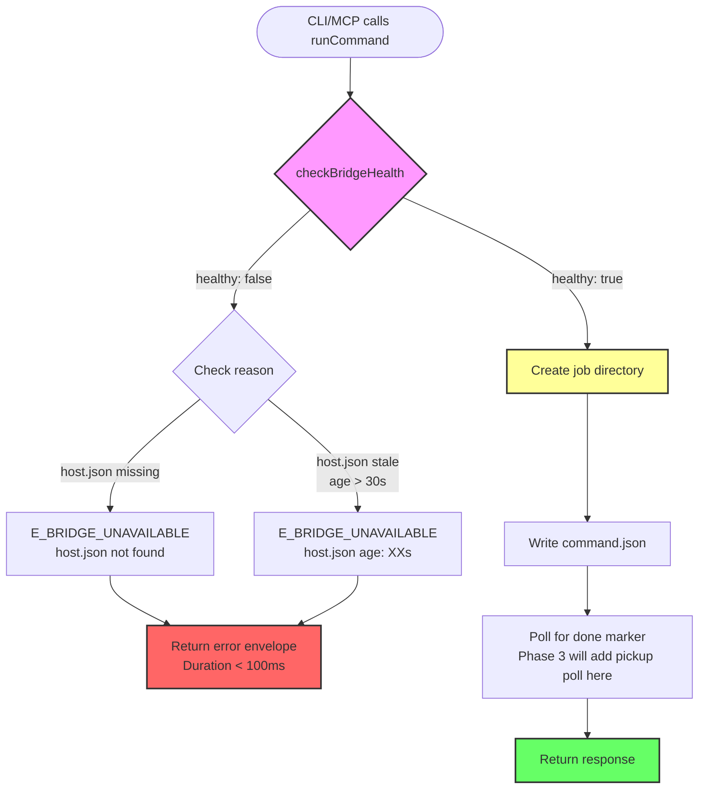
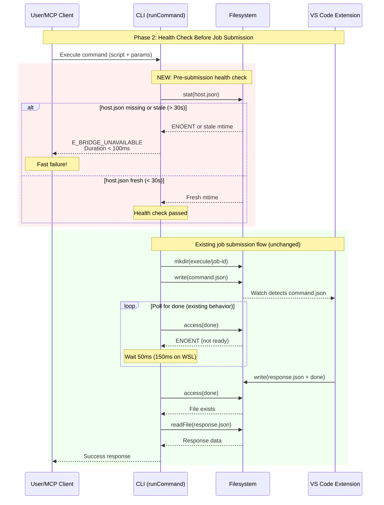

# Phase 2: Pre-Submission Health Check - Tasks & Alignment Brief

**Plan**: [Fast-Fail Job Submission](../../fast-fail-job-submission-plan.md)
**Spec**: [Fast-Fail Job Submission Spec](../../fast-fail-job-submission-spec.md)
**Phase**: Phase 2 - Pre-Submission Health Check
**Status**: READY FOR IMPLEMENTATION
**Created**: 2025-10-18

---

## Tasks

| Status | ID | Task | Type | Dependencies | Absolute Path(s) | Validation | Notes |
|--------|----|----|------|--------------|------------------|------------|-------|
| [ ] | T001 | Review runCommand() structure and identify health check insertion point | Setup | – | `/workspaces/vsc-bridge-devcontainer/packages/cli/src/lib/fs-bridge.ts` | Understand current flow: line 140-239 (runCommand function) | Locate insertion point before job dir creation (currently line 145) |
| [ ] | T002 | Review checkBridgeHealth() function implementation | Setup | – | `/workspaces/vsc-bridge-devcontainer/packages/cli/src/lib/fs-bridge.ts` | Understand health check logic: lines 339-363 (checkBridgeHealth function) | Per Critical Discovery 03 - function already exists, no new implementation needed |
| [ ] | T003 | Review makeErrorEnvelope() pattern for error return format | Setup | – | `/workspaces/vsc-bridge-devcontainer/packages/cli/src/lib/fs-bridge.ts` | Understand error envelope structure: lines 123-135 (makeErrorEnvelope function) | Per Critical Discovery 05 - use same pattern for E_BRIDGE_UNAVAILABLE |
| [ ] | T003a | Review existing tests and update fixtures to support health check | Setup | T001, T002, T003 | `/workspaces/vsc-bridge-devcontainer/packages/cli/test/lib/fs-bridge.test.ts` | Existing test fixtures updated to include fresh host.json; helper function created/updated | Proactively update test fixtures before writing new tests. Identify all tests that call runCommand() and ensure they have valid host.json. Create `setupHealthyBridge(bridgeRoot)` helper or update existing fixture helpers to write fresh host.json by default. Prevents spurious E_BRIDGE_UNAVAILABLE failures in existing tests when health check is added. Serial (modifying test file before T004-T006) |
| [ ] | T004 | Write failing test: health check fails when host.json missing | Test | T003a | `/workspaces/vsc-bridge-devcontainer/packages/cli/test/lib/fs-bridge.test.ts` | Test fails initially (not yet implemented) | Test expects E_BRIDGE_UNAVAILABLE error in < 100ms when host.json missing. Error message must include "host.json not found" diagnostic detail. [P] eligible (new test, different file from implementation) |
| [ ] | T005 | Write failing test: health check fails when host.json stale (> 30s old) | Test | T003a | `/workspaces/vsc-bridge-devcontainer/packages/cli/test/lib/fs-bridge.test.ts` | Test fails initially (not yet implemented) | Test expects E_BRIDGE_UNAVAILABLE error in < 100ms when host.json stale. Error message must include "host.json age: Xs (stale)" diagnostic detail with actual age. [P] eligible (new test, different file from implementation) |
| [ ] | T006 | Write failing test: runCommand proceeds when bridge healthy | Test | T003a | `/workspaces/vsc-bridge-devcontainer/packages/cli/test/lib/fs-bridge.test.ts` | Test fails initially (not yet implemented) | Test expects NO health error when host.json fresh (< 30s). [P] eligible (new test, different file from implementation) |
| [ ] | T006a | Run tests T004-T006 and verify they fail as expected (TDD Red phase) | Test | T004, T005, T006 | `/workspaces/vsc-bridge-devcontainer/packages/cli/test/lib/fs-bridge.test.ts` | All three tests fail with expected error (e.g., "health is not defined" or similar) | Validates tests are actually testing something before implementation. Confirms proper TDD Red phase. [P] eligible (test execution) |
| [ ] | T007 | Add checkBridgeHealth() call at start of runCommand() before job dir creation | Core | T006a | `/workspaces/vsc-bridge-devcontainer/packages/cli/src/lib/fs-bridge.ts` | Health check called at correct insertion point (before line 145) | Insert after function signature (line 140-143), before job directory creation. Serial (shared file with T008-T009) |
| [ ] | T008 | Return E_BRIDGE_UNAVAILABLE error when checkBridgeHealth() returns healthy: false | Core | T007 | `/workspaces/vsc-bridge-devcontainer/packages/cli/src/lib/fs-bridge.ts` | Error returned with proper envelope format using makeErrorEnvelope() | Use existing error envelope pattern. Serial (shared file with T007, T009) |
| [ ] | T009 | Add error message with installation/restart guidance per spec AC7 | Core | T008 | `/workspaces/vsc-bridge-devcontainer/packages/cli/src/lib/fs-bridge.ts` | Error message includes all required elements from spec AC7 (lines 96-100) | Message must include: "Extension not running, crashed, or not installed" + installation guidance "[TBD]" + diagnostic detail extracted from checkBridgeHealth() lastSeen timestamp. Format as "host.json age: Xs (stale)" if file exists (no absolute timestamp), or "host.json not found" if lastSeen is epoch 0. Calculate age in seconds from (Date.now() - lastSeen.getTime())/1000. Serial (shared file with T007-T008) |
| [ ] | T010 | Run tests to verify health check integration | Integration | T007, T008, T009 | `/workspaces/vsc-bridge-devcontainer/packages/cli/test/lib/fs-bridge.test.ts` | Tests T004-T006 now pass | All three health check scenarios working correctly. [P] eligible (test execution, different from implementation) |
| [ ] | T011 | Measure and verify health check duration < 200ms (< 100ms target) | Integration | T010 | `/workspaces/vsc-bridge-devcontainer/packages/cli/test/lib/fs-bridge.test.ts` | Timing assertions pass: failure occurs in < 200ms (best effort < 100ms on local fs) | Add timing instrumentation to tests T004-T005 to verify fast failure. Use < 200ms threshold to prevent flakes on WSL/remote workspaces (single fs.stat can take 50-150ms). Target is < 100ms on local filesystems. Serial (modifying same test file as T010) |
| [ ] | T012 | Verify MCP server integration (no changes needed) | Integration | T010 | `/workspaces/vsc-bridge-devcontainer/packages/cli/src/lib/mcp/bridge-adapter.ts` | MCP server uses runCommand() unchanged (line 147) | Per Critical Discovery 02 - verify no MCP-specific changes needed. [P] eligible (read-only verification, different file) |
| [ ] | T013 | Run full test suite to verify backward compatibility | Integration | T011, T012 | `/workspaces/vsc-bridge-devcontainer/packages/cli/test/lib/fs-bridge.test.ts` | All existing tests still pass (no regressions) | Ensure Phase 2 changes don't break existing tests. [P] eligible (test execution) |
| [ ] | T014 | Update execution log with implementation details and evidence | Doc | T013 | `/workspaces/vsc-bridge-devcontainer/docs/plans/15-fast-fail-job-submission/tasks/phase-2/execution.log.md` | Execution log documents all changes, findings, and test results | Create execution log with task completion details and footnotes for all 16 tasks (T001-T014 including T003a and T006a). Serial (final documentation task) |

---

## Alignment Brief

### Objective

Add a pre-submission health check to `runCommand()` that verifies the bridge is alive **before** creating the job directory. When the health check fails, return `E_BRIDGE_UNAVAILABLE` error immediately (< 100ms) instead of waiting for the full 30-second timeout.

**Success means:**
- CLI commands fail in < 100ms when bridge is unavailable (vs 30s today)
- Clear error differentiation between "bridge unavailable" (E_BRIDGE_UNAVAILABLE) and "job timeout" (E_TIMEOUT)
- No changes to existing behavior when bridge is healthy
- Both CLI and MCP server benefit automatically (shared runCommand function)

### Behavior Checklist

Tie to **Plan Acceptance Criteria** (plan.md lines 439-447):

- [ ] Health check called before job directory creation
- [ ] E_BRIDGE_UNAVAILABLE returned when host.json missing
- [ ] E_BRIDGE_UNAVAILABLE returned when host.json > 30s old
- [ ] Error message includes installation/restart guidance (per spec AC7)
- [ ] Health check completes in < 200ms (< 100ms target on local fs, measured in tests)
- [ ] All existing tests still pass (backward compatibility)

### Non-Goals (Scope Boundaries)

❌ **NOT doing in Phase 2:**

- **PID verification**: Health check uses only host.json mtime, NOT process.kill(pid, 0) verification (per Critical Discovery 03 and spec Q3)
- **Directory structure validation**: No checking of .vsc-bridge/execute/ directory existence (per spec Q8)
- **Capacity checking**: Health check only verifies bridge is alive, NOT whether it has capacity to accept jobs (per spec Non-Goals line 25)
- **Enhanced error messages with capacity details**: Error messages are generic; no specific capacity or queue position info (per spec Q4)
- **Pickup acknowledgment**: Phase 2 only adds health check; pickup polling is Phase 3
- **Two-phase timeout logic**: Phase 2 doesn't change timeout calculation; that's Phase 4
- **Verbose logging**: Phase 2 doesn't add debug output; that's Phase 5
- **New test files**: Extend existing fs-bridge.test.ts; no new test files created
- **MCP-specific changes**: MCP server uses runCommand() unchanged; no bridge-adapter.ts modifications needed

### Critical Findings Affecting This Phase

From plan.md § 3 (Critical Research Findings):

1. **Critical Discovery 03: Health Check Function Already Exists** (plan lines 201-224)
   - **What it constrains**: We must use the existing `checkBridgeHealth()` function unchanged; no new health check logic needed
   - **What it requires**: Simple integration - just call the function before job dir creation
   - **Tasks that address it**: T002 (review existing function), T007 (call at correct location)
   - **Impact**: Reduces scope from "implement health check" to "integrate existing health check"

2. **Critical Discovery 05: Error Envelope Format** (plan lines 241-257)
   - **What it constrains**: E_BRIDGE_UNAVAILABLE must use same error envelope structure as existing errors (E_TIMEOUT, E_NO_RESPONSE)
   - **What it requires**: Use `makeErrorEnvelope()` helper function with code and message parameters
   - **Tasks that address it**: T003 (review pattern), T008 (use makeErrorEnvelope for E_BRIDGE_UNAVAILABLE)
   - **Impact**: Ensures consistency with existing error handling patterns

3. **Critical Discovery 02: MCP Server and CLI Share runCommand** (plan lines 180-198)
   - **What it constrains**: Changes to runCommand() automatically apply to both CLI and MCP server
   - **What it requires**: No MCP-specific code needed; verify integration works automatically
   - **Tasks that address it**: T012 (verify MCP integration unchanged)
   - **Impact**: Single implementation serves both contexts; reduces scope and testing burden

### Invariants & Guardrails

**Performance Budget:**
- Health check must complete in < 100ms when bridge unavailable (spec AC1)
- Typical health check: < 10ms (single fs.stat() call on host.json)
- No additional filesystem operations beyond stat() on host.json

**Memory Budget:**
- No new allocations beyond error envelope object
- Reuse existing checkBridgeHealth() implementation

**Security:**
- No new security risks (uses existing filesystem access patterns)
- Error messages avoid leaking sensitive paths (use relative paths or generic descriptions)

**Compatibility:**
- All existing tests must still pass (backward compatibility requirement)
- No breaking changes to runCommand() API signature
- Error envelope format unchanged (maintains compatibility with error consumers)

### Inputs to Read

**Critical files to understand before implementation:**

1. **Main implementation target:**
   - `/workspaces/vsc-bridge-devcontainer/packages/cli/src/lib/fs-bridge.ts`
     - Lines 140-239: `runCommand()` function (where health check will be integrated)
     - Lines 339-363: `checkBridgeHealth()` function (existing health check logic)
     - Lines 123-135: `makeErrorEnvelope()` function (error envelope pattern)

2. **Test file to extend:**
   - `/workspaces/vsc-bridge-devcontainer/packages/cli/test/lib/fs-bridge.test.ts`
     - Existing test structure and patterns
     - Foundation verification tests from Phase 1 (lines 653-688)

3. **MCP integration point (verification only):**
   - `/workspaces/vsc-bridge-devcontainer/packages/cli/src/lib/mcp/bridge-adapter.ts`
     - Line 147: `runCommand()` call in MCP server

4. **Phase 1 execution log (context):**
   - `/workspaces/vsc-bridge-devcontainer/docs/plans/15-fast-fail-job-submission/tasks/phase-1/execution.log.md`
     - Phase 1 deliverables: PICKUP_TIMEOUT_MS constant, E_BRIDGE_UNAVAILABLE JSDoc, makeErrorEnvelope export

### Visual Alignment Aids

#### System State Flow



#### Actor Interaction Sequence



### Test Plan

**Approach**: Extend existing fs-bridge.test.ts with new test cases (no new test files).

**TDD Strategy**: Write failing tests first (T004-T006), then implement (T007-T009), then verify tests pass (T010-T011).

**Mock Usage**: Use real filesystem operations where possible (per testing philosophy). Mock time manipulation for timing tests if needed.

#### Named Tests with Rationale

1. **Test: health-check-fails-when-host-json-missing** (T004)
   - **Rationale**: Verify E_BRIDGE_UNAVAILABLE returned when bridge not installed or directory missing
   - **Fixtures**: Temporary bridge directory with no host.json file
   - **Expected Output**:
     ```javascript
     {
       ok: false,
       type: 'error',
       error: {
         code: 'E_BRIDGE_UNAVAILABLE',
         message: 'Bridge is unavailable (extension not running, crashed, or not installed). host.json not found. Check that VS Code is open with vsc-bridge extension installed and active. Installation instructions: [TBD]'
       },
       meta: { timestamp: <ISO-8601> }
     }
     ```
   - **Timing**: < 200ms total duration (target < 100ms on local filesystems)

2. **Test: health-check-fails-when-host-json-stale** (T005)
   - **Rationale**: Verify E_BRIDGE_UNAVAILABLE returned when bridge process crashed or hung
   - **Fixtures**: Bridge directory with host.json mtime set to 60 seconds ago (> 30s threshold)
   - **Expected Output**:
     ```javascript
     {
       ok: false,
       type: 'error',
       error: {
         code: 'E_BRIDGE_UNAVAILABLE',
         message: 'Bridge is unavailable (extension not running, crashed, or not installed). host.json age: 60s (stale). Check that VS Code is open with vsc-bridge extension installed and active. Installation instructions: [TBD]'
       },
       meta: { timestamp: <ISO-8601> }
     }
     ```
   - **Timing**: < 200ms total duration (target < 100ms on local filesystems)

3. **Test: runCommand-proceeds-when-bridge-healthy** (T006)
   - **Rationale**: Verify no health error when bridge is healthy (backward compatibility)
   - **Fixtures**: Bridge directory with fresh host.json (mtime < 30s ago)
   - **Expected Output**: runCommand proceeds to job directory creation; no E_BRIDGE_UNAVAILABLE error
   - **Timing**: Normal execution timing (no < 100ms requirement for healthy path)

### Step-by-Step Implementation Outline

Mapped 1:1 to tasks:

1. **Setup Phase** (T001-T003a): Read and understand existing code, prepare test fixtures
   - T001: Locate runCommand() and identify insertion point (before line 145)
   - T002: Review checkBridgeHealth() implementation (lines 339-363)
   - T003: Review makeErrorEnvelope() pattern (lines 123-135)
   - T003a: **Review existing tests and update fixtures** - proactively update test helpers to include host.json, preventing spurious failures in existing tests

2. **Test-First Phase** (T004-T006a): Write failing tests before implementation
   - T004: Write test for missing host.json scenario
   - T005: Write test for stale host.json scenario
   - T006: Write test for healthy bridge scenario
   - T006a: **Run tests and verify they fail** (TDD Red phase verification)
   - All tests should fail at this point with expected error messages

3. **Core Implementation Phase** (T007-T009): Implement health check integration
   - T007: Add `const health = await checkBridgeHealth(bridgeRoot);` before job dir creation
   - T008: Add conditional: `if (!health.healthy) { return makeErrorEnvelope(...); }`
   - T009: Craft error message with all required elements per spec AC7
     - Extract `lastSeen` timestamp from health object
     - Calculate age in seconds: `(Date.now() - lastSeen.getTime()) / 1000`
     - Format diagnostic detail: "host.json age: Xs (stale)" if lastSeen > epoch 0, or "host.json not found" if lastSeen is epoch 0
     - Do NOT include absolute timestamp (keep message concise, age is more useful)
     - Include all required message elements: status, reason, diagnostic (age only), guidance, installation instructions

4. **Integration & Verification Phase** (T010-T013): Verify implementation works correctly
   - T010: Run tests T004-T006; verify they now pass
   - T011: Add timing assertions to T004-T005; verify < 100ms requirement
   - T012: Verify MCP server integration (read-only; no changes needed)
   - T013: Run full test suite; ensure no regressions

5. **Documentation Phase** (T014): Record implementation details
   - T014: Create execution.log.md with task completion details and findings

### Commands to Run

**Environment setup:**
```bash
cd /workspaces/vsc-bridge-devcontainer
```

**Test runner (after each implementation task):**
```bash
# Run Phase 2 tests specifically
npm test -- test/lib/fs-bridge.test.ts

# Run full test suite for regression checking
npm test
```

**Linters and type checks:**
```bash
# TypeScript type checking
npm run type-check

# ESLint (if configured)
npm run lint
```

**Build (if needed):**
```bash
# Build CLI package
just build
```

### Risks & Unknowns

| Risk | Severity | Mitigation |
|------|----------|------------|
| **False negatives from health check** (bridge dies after check passes but before job submission) | Medium | Pickup timeout (Phase 3) catches this in 5s; acceptable tradeoff vs 30s timeout |
| **TOCTOU race condition** (time-of-check-time-of-use gap between health check and command.json write) | Low | Spec acknowledges this as acceptable; pickup timeout provides safety net |
| **Health check adds latency to happy path** | Low | Single fs.stat() adds < 10ms; acceptable overhead for fast failure benefit |
| **Error message content incomplete** ("[TBD]" placeholder for installation instructions) | Medium | Per spec - use placeholder; installation instructions TBD separately |
| **Timing tests flaky on slow CI/remote workspaces** | Medium | Use < 200ms threshold instead of strict < 100ms; fs.stat() latency varies by environment (2-5ms local, 20-80ms WSL, 50-200ms remote SSH). Target < 100ms on local filesystems, accept up to 200ms on remote. Still order of magnitude better than 30s timeout. |
| **Existing tests break due to new error return path** | Low | Review existing tests before implementation; add health setup to fixtures if needed |

### Ready Check

**Checkboxes to verify before implementation:**

- [ ] All Critical Findings reviewed and understood (Discoveries 02, 03, 05)
- [ ] Inputs to read identified and accessible (fs-bridge.ts, tests, MCP adapter)
- [ ] Visual diagrams reviewed and agreed (state flow + sequence diagram)
- [ ] Test plan understood (3 new tests, TDD approach with explicit Red-Green-Refactor verification, extend existing file)
- [ ] Implementation outline mapped 1:1 to tasks (16 tasks total including test fixture setup and TDD verification)
- [ ] Commands to run verified (test runner, linters, build)
- [ ] Risks acknowledged and mitigations understood
- [ ] Absolute paths confirmed for all modified files
- [ ] Non-goals explicitly understood (no PID verification, no capacity checking, etc.)
- [ ] Behavior checklist ties to plan acceptance criteria (6 items)

**GO/NO-GO Decision Point:**

Once all checkboxes above are verified, proceed with **/plan-6-implement-phase --phase "Phase 2: Pre-Submission Health Check"**.

---

## Phase Footnote Stubs

**NOTE**: This section will be populated during `/plan-6` implementation with substrate node IDs and detailed change descriptions.

During implementation, footnote tags from task Notes will be added here following CLAUDE.md format:

```markdown
[^1]: [To be added during plan-6 implementation]
[^2]: [To be added during plan-6 implementation]
...
```

---

## Evidence Artifacts

**Execution Log Location:**
- `/workspaces/vsc-bridge-devcontainer/docs/plans/15-fast-fail-job-submission/tasks/phase-2/execution.log.md`

**Format:**
```markdown
# Phase 2: Pre-Submission Health Check - Execution Log

**Phase**: Phase 2 - Pre-Submission Health Check
**Started**: <timestamp>
**Testing Approach**: TDD - extend existing fs-bridge.test.ts
**Status**: <IN PROGRESS | COMPLETE>

---

## Task Execution Log

### T001: Review runCommand() structure
**Timestamp**: <timestamp>
**Status**: <COMPLETE | IN PROGRESS>
**Findings**:
- [Implementation findings and notes]

### T002: Review checkBridgeHealth() function
...

[Continue for all tasks T001-T014]

---

## Phase 2 Summary

**Total Tasks**: 16 (T001-T014, including T003a and T006a)
- Setup: 4 tasks (T001-T003a, including proactive test fixture updates)
- Tests: 4 tasks (T004-T006a, including TDD Red phase verification)
- Core: 3 tasks (T007-T009)
- Integration: 4 tasks (T010-T013)
- Doc: 1 task (T014)

**Files Modified**:
1. `/workspaces/vsc-bridge-devcontainer/packages/cli/src/lib/fs-bridge.ts` - [line ranges]
2. `/workspaces/vsc-bridge-devcontainer/packages/cli/test/lib/fs-bridge.test.ts` - [line ranges]

**Next Steps**:
- Manual commit (per CLAUDE.md git policy)
- Proceed to Phase 3: Pickup Acknowledgment Polling
```

**Supporting Evidence:**
- Test output logs
- Timing measurements
- Screenshot of test results (if applicable)

---

## Directory Layout

```
docs/plans/15-fast-fail-job-submission/
  ├── fast-fail-job-submission-plan.md
  ├── fast-fail-job-submission-spec.md
  └── tasks/
      ├── phase-1/
      │   ├── tasks.md
      │   └── execution.log.md
      └── phase-2/
          ├── tasks.md              ← This file
          └── execution.log.md      ← Created by /plan-6
```

---

**End of Phase 2 Tasks & Alignment Brief**

**Status**: READY FOR IMPLEMENTATION - Awaiting GO from user to proceed with `/plan-6-implement-phase --phase "Phase 2: Pre-Submission Health Check"`

---

## Critical Insights Discussion

**Session**: 2025-10-18
**Context**: Phase 2: Pre-Submission Health Check - Tasks & Alignment Brief
**Analyst**: AI Clarity Agent
**Reviewer**: Development Team
**Format**: Water Cooler Conversation (5 Critical Insights)

### Insight 1: The Health Check Returns Valuable Diagnostic Info We're Throwing Away

**Did you know**: The `checkBridgeHealth()` function returns a `lastSeen: Date` timestamp that tells us WHEN the bridge last updated host.json, but the initial task plan didn't use this information in the error message, losing critical diagnostic detail.

**Implications**:
- Lost diagnostic value: Timestamp distinguishes "never installed" (epoch 0) vs "recently crashed" (5 min ago) vs "stopped days ago"
- Harder troubleshooting: Users can't tell if they need to install vs restart
- Spec requires this: AC7 says "Diagnostic detail: host.json age (if stale) or 'not found'"
- Better error messages: "host.json age: 45s (stale)" is way more helpful than generic "unavailable"

**Options Considered**:
- Option A: Use lastSeen Timestamp in Error Message - Extract and format timestamp as diagnostic detail
- Option B: Keep It Simple - Generic error message only
- Option C: Conditional Detail - Tailored messages for different scenarios

**AI Recommendation**: Option A (Use lastSeen Timestamp)
- Reasoning: Matches spec AC7 requirement, significantly improves troubleshooting, low effort, provides critical diagnostic value

**Discussion Summary**:
Team agreed that diagnostic detail is essential for troubleshooting. Option A provides the spec-required information while keeping implementation simple.

**Decision**: Use lastSeen timestamp in E_BRIDGE_UNAVAILABLE error message

**Action Items**:
- [x] Update task T009 to explicitly extract and format lastSeen timestamp
- [x] Include diagnostic detail in error message format ("host.json age: Xs" or "not found")
- [x] Update tests T004-T005 to assert diagnostic detail presence

**Affects**: Task T009 (error message implementation), Tests T004-T005 (error message assertions)

---

### Insight 2: The Test Dependency Chain Creates a False TDD Workflow

**Did you know**: Tasks T007-T009 (core implementation) depend on T004-T006 (failing tests), but there's no explicit task to RUN those tests and verify they fail before implementation, skipping the critical TDD "Red" step.

**Implications**:
- No verification that tests actually fail: Might write tests that pass even without implementation (false positives)
- Missing the Red step in Red-Green-Refactor: TDD requires seeing tests fail first
- Task T010 is ambiguous: Says "tests now pass" but we never verified they failed before
- Could hide test bugs: Typos or wrong assertions won't be caught until T010

**Options Considered**:
- Option A: Add Explicit "Verify Tests Fail" Task - Insert T006a between T006 and T007
- Option B: Combine T006 and Verification Step - Modify T006 to include verification
- Option C: Trust the Process - Keep current plan, assume developers run tests manually
- Option D: Make T007-T009 Depend on T010 Verification - Flip dependency order

**AI Recommendation**: Option A (Add Explicit Verification Task)
- Reasoning: True TDD workflow, catches test bugs early, cleardocumentation, educational value

**Discussion Summary**:
Team confirmed that proper TDD discipline requires explicitly validating the Red phase. Adding verification task makes the process visible and rigorous.

**Decision**: Add explicit "Verify Tests Fail" task (T006a) between T006 and T007

**Action Items**:
- [x] Insert new task T006a: "Run tests T004-T006 and verify they fail as expected"
- [x] Update dependencies: T007 now depends on T006a instead of T004-T006
- [x] Update task count: 15 total tasks (was 14)
- [x] Update Alignment Brief summary sections

**Affects**: Task table, dependencies, Implementation Outline, task count (now 15)

---

### Insight 3: The 100ms Performance Budget May Be Too Aggressive for Remote Workspaces

**Did you know**: The spec requires health check failure in < 100ms, but on remote workspaces (SSH, Codespaces, WSL2) a single `fs.stat()` call can take 50-200ms due to network latency or virtualization overhead, making the strict requirement unachievable in those environments.

**Implications**:
- Test T011 might be flaky on CI: Container/VM latency could cause spurious failures
- False test failures on remote workspaces: Developers using Codespaces see failures even though code is correct
- Spec AC1 violation in production: Real users on remote workspaces experience > 100ms failures
- No actual user impact: 150ms vs 100ms is imperceptible to humans (both feel instant vs 30s timeout)

**Options Considered**:
- Option A: Relax Timing Requirement to < 250ms - Change spec AC1 and test threshold
- Option B: Use Environment-Aware Timeout - Detect environment and apply different thresholds
- Option C: Keep <100ms as "Best Effort" Target - Test uses < 200ms threshold with warning if > 100ms
- Option D: Cache host.json mtime in Memory - Optimization to reduce fs operations

**AI Recommendation**: Option C (Keep <100ms as Best Effort Target)
- Reasoning: User experience unchanged, prevents CI flakes, realistic, acknowledges latency beyond our control, low effort

**Discussion Summary**:
Team agreed that 120ms vs 100ms is imperceptible and both feel instant. Using generous test threshold prevents flakes while catching real regressions.

**Decision**: Keep < 100ms as "best effort" target, use < 200ms test timeout

**Action Items**:
- [x] Update task T011 validation to use < 200ms threshold
- [x] Add note about environment-dependent latency (2-5ms local, 20-80ms WSL, 50-200ms remote)
- [x] Update Behavior Checklist timing requirement
- [x] Expand Risks & Unknowns with detailed latency explanation
- [x] Update Test Plan timing expectations

**Affects**: Task T011 (timing validation), Behavior Checklist, Risks & Unknowns, Test Plan

---

### Insight 4: Existing Tests Might Not Set Up Bridge Health, Causing Spurious Failures

**Did you know**: When we add the health check at the beginning of `runCommand()`, every existing test that calls `runCommand()` will now require a valid bridge directory with fresh `host.json`, or they'll fail with `E_BRIDGE_UNAVAILABLE` before testing their intended behavior.

**Implications**:
- Every existing test breaks: Any test calling `runCommand()` without host.json setup will fail
- T013 catches it late: Won't discover this until after implementation is complete
- More rework needed: Have to go back and update test fixtures retroactively
- Test setup helper needed: All tests need `setupHealthyBridge()` or updated fixtures

**Options Considered**:
- Option A: Add Test Setup Task Before T004 - Insert T003a to proactively update fixtures
- Option B: Handle in T013 When Discovered - Keep current plan, fix reactively
- Option C: Make Health Check Optional via RunOptions - Add `skipHealthCheck` flag for tests
- Option D: Add Global Test Setup Helper - Create helper, update affected tests, document pattern

**AI Recommendation**: Option A (Proactive Test Setup Task)
- Reasoning: Catches issues early, cleaner implementation, better TDD, less rework, establishes clear pattern

**Discussion Summary**:
Team agreed that proactive fixture updates prevent late-stage debugging and establish the right pattern for new tests to follow.

**Decision**: Add proactive test setup task (T003a) to review and update existing test fixtures

**Action Items**:
- [x] Insert new task T003a between T003 and T004
- [x] Update dependencies: T004-T006 depend on T003a
- [x] Update task count: 16 total tasks (was 15)
- [x] Create `setupHealthyBridge()` helper or update `createTempBridgeDir()` to include host.json

**Affects**: Task table, dependencies, task count (now 16), Implementation Outline, Setup phase tasks

---

### Insight 5: The Error Message Timestamp Could Confuse Users About "When" the Bridge Died

**Did you know**: The error message will include TWO timestamps that could be confusing: the `lastSeen` timestamp (when host.json was last updated) and the `meta.timestamp` (when error envelope was created), and users might not understand which one tells them when the bridge actually died.

**Implications**:
- User confusion: "Which timestamp tells me when it crashed?"
- Both are useful but different: lastSeen (when bridge last alive) vs meta.timestamp (when CLI detected problem)
- Message could be clearer: Age (45s) AND timestamp might be redundant
- Consistency with existing errors: Other errors only have meta.timestamp

**Options Considered**:
- Option A: Show Only Age, Not Absolute Timestamp - "host.json age: 45s (stale)"
- Option B: Show Both Age and Timestamp - "host.json age: 45s (stale, last updated at ...)"
- Option C: Replace meta.timestamp with lastSeen - Use lastSeen as error timestamp
- Option D: Clarify in Message - "Bridge last seen: ... (45 seconds ago, stale)"

**AI Recommendation**: Option A (Show Only Age, Drop Absolute Timestamp)
- Reasoning: Clearer UX, age is more actionable than absolute time, matches spec AC7, shorter message, less confusion

**Discussion Summary**:
Team agreed that relative age (45s ago) is more useful than absolute timestamp for troubleshooting, and keeping the message concise improves clarity.

**Decision**: Show only age in error message, drop absolute lastSeen timestamp

**Action Items**:
- [x] Update task T009 notes to specify format: "host.json age: Xs (stale)" without absolute timestamp
- [x] Update Implementation Outline to note: calculate age, don't format ISO timestamp
- [x] Test Plan examples already show correct format (no changes needed)

**Affects**: Task T009 (error message format), Implementation Outline

---

## Session Summary

**Insights Surfaced**: 5 critical insights identified and discussed
**Decisions Made**: 5 decisions reached through collaborative discussion
**Action Items Created**: 19 follow-up items (all completed during session)
**Areas Requiring Updates**:
- Task table: Added T003a (test fixture setup) and T006a (TDD Red verification)
- Task dependencies: Updated T004-T006 to depend on T003a, T007 to depend on T006a
- Task count: Increased from 14 to 16 tasks
- Error message format: Added diagnostic detail (age only, no absolute timestamp)
- Timing requirements: Relaxed from strict < 100ms to < 200ms (< 100ms target)

**Shared Understanding Achieved**: ✓

**Confidence Level**: High - Clear path forward with rigorous TDD process and realistic expectations

**Next Steps**:
Proceed with `/plan-6-implement-phase --phase "Phase 2: Pre-Submission Health Check"`. Key decisions captured:
1. Error messages include diagnostic detail (host.json age or "not found")
2. Proper TDD with explicit Red-Green verification (T006a)
3. Realistic timing budget (< 200ms test threshold, < 100ms target)
4. Proactive test fixture setup (T003a prevents late-stage issues)
5. Concise error format (age only, no absolute timestamp)

**Notes**:
All insights led to immediate task updates. The phase is now better structured with 16 tasks including proactive fixture setup and explicit TDD verification, realistic performance expectations, and clearer error messages.

---

**End of Critical Insights Discussion**
