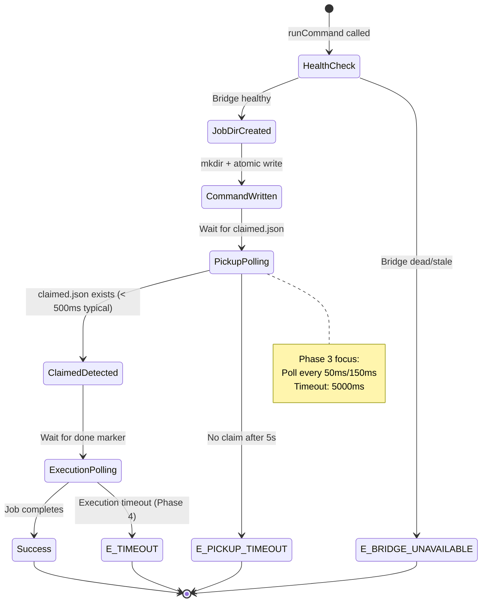
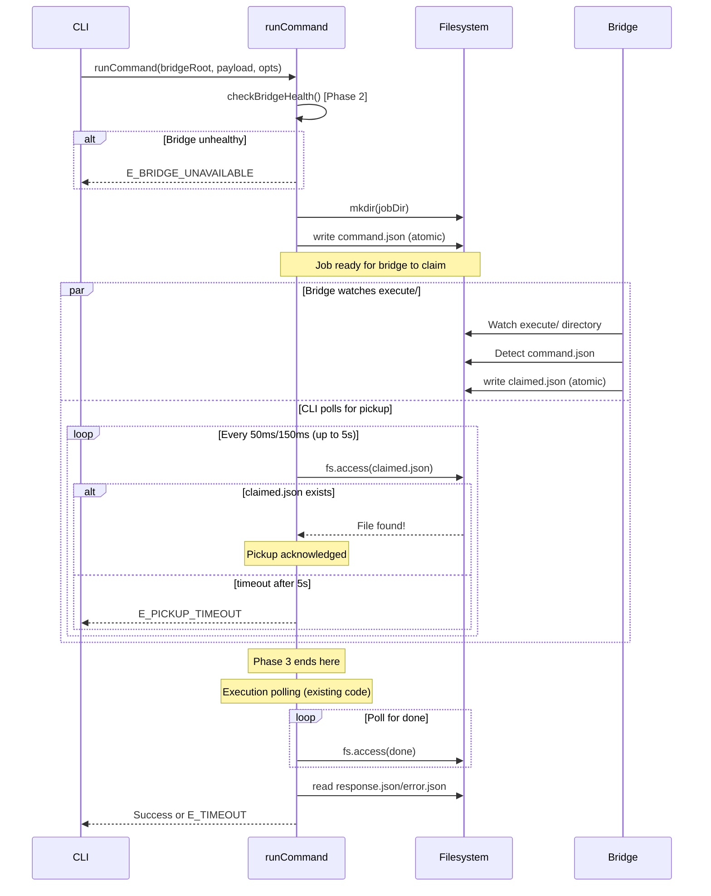

# Phase 3: Pickup Acknowledgment Polling - Tasks & Alignment Brief

**Phase**: 3 of 7
**Title**: Pickup Acknowledgment Polling
**Slug**: `phase-3`
**Created**: 2025-01-18
**Plan**: [fast-fail-job-submission-plan.md](../../fast-fail-job-submission-plan.md)
**Spec**: [fast-fail-job-submission-spec.md](../../fast-fail-job-submission-spec.md)

---

## Tasks

| Status | ID | Task | Type | Dependencies | Absolute Path(s) | Validation | Notes |
|--------|----|----|------|--------------|------------------|------------|-------|
| [ ] | T001 | Review existing runCommand polling pattern | Setup | – | `/workspaces/vsc-bridge-devcontainer/packages/cli/src/lib/fs-bridge.ts` | Understanding of done polling loop (lines 192-230) documented | Study poll interval, timeout logic, fs.access pattern |
| [ ] | T002 | Review Critical Discovery 01 (claimed.json format) | Setup | – | `/workspaces/vsc-bridge-devcontainer/docs/plans/15-fast-fail-job-submission/fast-fail-job-submission-plan.md` | ClaimedJson structure documented: `{ bridgeId, claimedAt, pid }` | Lines 157-177 of plan; bridge already creates this file |
| [ ] | T003 | Review existing test fixtures for command execution | Setup | – | `/workspaces/vsc-bridge-devcontainer/packages/cli/test/lib/fs-bridge.test.ts` | Test fixture pattern understood (beforeEach setup) | Study how tests currently simulate bridge behavior |
| [ ] | T004 | Write test for typical pickup case (< 500ms) | Test | T001, T002, T003 | `/workspaces/vsc-bridge-devcontainer/packages/cli/test/lib/fs-bridge.test.ts` | Test written: simulates claimed.json write after 200ms, expects success | [P] eligible (new test suite); must FAIL initially (Red phase) |
| [ ] | T005 | Write test for pickup timeout (no claim in 5s) | Test | T001, T002, T003 | `/workspaces/vsc-bridge-devcontainer/packages/cli/test/lib/fs-bridge.test.ts` | Test written: no claimed.json, expects E_PICKUP_TIMEOUT after ~5000ms | [P] eligible; must FAIL initially (Red phase) |
| [ ] | T006 | Write test for lenient claimed.json handling | Test | T001, T002, T003 | `/workspaces/vsc-bridge-devcontainer/packages/cli/test/lib/fs-bridge.test.ts` | Test written: verifies any valid file existence triggers claim detection (no structure validation) | [P] eligible; **Decision: Lenient** - file existence sufficient, no JSON parsing |
| [ ] | T007 | Run Phase 3 tests and verify RED phase | Test | T004, T005, T006 | `/workspaces/vsc-bridge-devcontainer/packages/cli/test/lib/fs-bridge.test.ts` | All 3 tests FAIL with expected errors (E_TIMEOUT instead of E_PICKUP_TIMEOUT) | Serial (verification step); confirms tests are valid before implementation |
| [ ] | T008 | Create waitForPickupAck() helper function | Core | T007 | `/workspaces/vsc-bridge-devcontainer/packages/cli/src/lib/fs-bridge.ts` | Function signature defined: `async function waitForPickupAck(jobDir: string, timeoutMs: number): Promise<{ claimed: boolean }>` | Add near line 220 with other helpers; returns claimed status only (lenient validation - no data parsing) |
| [ ] | T009 | Implement pickup polling logic in waitForPickupAck() | Core | T008 | `/workspaces/vsc-bridge-devcontainer/packages/cli/src/lib/fs-bridge.ts` | Polls for claimed.json using 50ms/150ms interval; respects PICKUP_TIMEOUT_MS | Serial (same file as T008); uses same isWSL() pattern as existing code |
| [ ] | T010 | Integrate waitForPickupAck() into runCommand after command.json write | Core | T009 | `/workspaces/vsc-bridge-devcontainer/packages/cli/src/lib/fs-bridge.ts` | Call inserted after line 186 (after command.json rename); pickup timeout checked before execution polling | Serial (same file); per Critical Discovery 02 - single integration point for CLI and MCP |
| [ ] | T011 | Return E_PICKUP_TIMEOUT error with AC8 message | Core | T010 | `/workspaces/vsc-bridge-devcontainer/packages/cli/src/lib/fs-bridge.ts` | Error envelope includes: "did not pick up job within 5 seconds", "overloaded, at capacity, crashed, or not installed", restart guidance, capacity check, [TBD] install instructions | Serial (same file); use makeErrorEnvelope() per Critical Discovery 05 |
| [ ] | T012 | Confirm lenient claimed.json validation approach | Core | T009 | `/workspaces/vsc-bridge-devcontainer/packages/cli/src/lib/fs-bridge.ts` | Validation uses file existence check only (fs.access); no JSON parsing or structure validation required | Serial (same file); **Decision: Lenient validation** - maximizes backward compatibility, honors Critical Discovery 01, follows KISS principle |
| [ ] | T013 | Run Phase 3 tests and verify GREEN phase | Integration | T008, T009, T010, T011, T012 | `/workspaces/vsc-bridge-devcontainer/packages/cli/test/lib/fs-bridge.test.ts` | All 3 Phase 3 tests PASS; timing verified (< 500ms local / < 1000ms remote for typical, ~5000ms timeout) | Serial (verification step); confirms implementation meets acceptance criteria |
| [ ] | T014 | Run full test suite for backward compatibility | Integration | T013 | `/workspaces/vsc-bridge-devcontainer/packages/cli/test/lib/fs-bridge.test.ts` | All existing tests still PASS; no regressions introduced | Serial (verification step); critical for validating integration |
| [ ] | T015 | Create execution log documenting implementation | Doc | T014 | `/workspaces/vsc-bridge-devcontainer/docs/plans/15-fast-fail-job-submission/tasks/phase-3/execution.log.md` | Execution log created with: task completion details, test results, diffs, timing measurements, acceptance criteria verification | Final task; provides audit trail for phase completion |

---

## Alignment Brief

### Objective

Implement pickup acknowledgment polling to detect when the bridge claims a job by creating `claimed.json`. If the bridge doesn't create this file within 5 seconds (PICKUP_TIMEOUT_MS), return E_PICKUP_TIMEOUT error immediately instead of waiting for full execution timeout.

**Behavior Checklist** (mapped to Plan AC):
- ✓ waitForPickupAck() function implemented and called after command.json write (AC1)
- ✓ Polls for claimed.json every 50ms (150ms on WSL) using existing pattern (AC2)
- ✓ Returns E_PICKUP_TIMEOUT after 5000ms if no claim detected (AC3)
- ✓ Error message includes troubleshooting guidance per spec AC8 (AC4)
- ✓ Detects claimed.json within 500ms in typical cases (local), < 1000ms on remote workspaces (AC5 - adjusted for filesystem latency)
- ✓ All existing tests still pass - backward compatibility maintained (AC6)

---

### Non-Goals (Scope Boundaries)

❌ **NOT doing in this phase**:

- **Filesystem watcher implementation** - Using polling per existing pattern (Plan Insight 3 decision)
- **Exponential backoff for polling** - Constant 50ms/150ms interval per existing code
- **Metrics collection** - No pickup latency statistics (per spec Q7 - KISS principle)
- **PID verification in claimed.json** - Optional validation deferred unless trivial to add
- **Timeout calculation changes** - Two-phase timeout logic deferred to Phase 4
- **Verbose logging** - Pickup duration logging deferred to Phase 5
- **Error message enhancement beyond AC8** - Installation instructions use [TBD] placeholder per spec
- **Bridge-side changes** - claimed.json already exists per Critical Discovery 01
- **Separate MCP implementation** - runCommand is shared per Critical Discovery 02

---

### Critical Findings Affecting This Phase

1. **🚨 Critical Discovery 01: claimed.json Already Exists** (plan lines 157-177)
   - **What it constrains**: No bridge modifications needed; CLI only needs to poll for existing file
   - **Impact**: Simplifies Phase 3 - purely CLI-side implementation
   - **Tasks addressing it**: T002 (review discovery), T009 (poll for existing file)

2. **🚨 Critical Discovery 02: MCP Server and CLI Share runCommand** (plan lines 180-197)
   - **What it requires**: All changes must go in runCommand(); no separate MCP implementation
   - **Impact**: Single integration point; changes automatically apply to both CLI and MCP
   - **Tasks addressing it**: T010 (integrate into shared runCommand)

3. **🚨 Critical Discovery 05: Error Envelope Format** (plan lines 241-256)
   - **What it requires**: Use makeErrorEnvelope() for E_PICKUP_TIMEOUT following existing pattern
   - **Impact**: Ensures consistent error format across all error types
   - **Tasks addressing it**: T011 (use makeErrorEnvelope for E_PICKUP_TIMEOUT)

---

### Invariants & Guardrails

**Performance Requirements**:
- **Typical pickup (local filesystem)**: < 500ms (measured from command.json write to claimed.json detection)
- **Typical pickup (remote workspace)**: < 1000ms (GitHub Codespaces, SSH, WSL2 network drives have 100-200ms per-poll latency)
- **Timeout deadline**: 5000ms absolute (PICKUP_TIMEOUT_MS constant from Phase 1)
- **Polling overhead**: Acceptable per Plan Insight 3 decision (proven pattern)
- **Remote workspace caveat**: Network RPC overhead for fs.access() calls means fewer effective polls per second; "fast enough" (< 1s) is still dramatically better than 30s timeout

**Timing Constraints**:
- Poll interval: 50ms (normal), 150ms (WSL) - same as existing done polling
- Total timeout: 30s still applies (pickup + execution, addressed in Phase 4)
- Test threshold: ~5200ms max for timeout tests (allow small overhead)

**Backward Compatibility**:
- All existing fs-bridge tests must pass without modification
- No changes to existing error paths (E_TIMEOUT remains for execution timeout)
- No changes to response envelope format

**Security**:
- Job directory permissions remain 0o700 (existing security model)
- No new filesystem access patterns (reuse existing fs.access/readFile)

**Error Handling**:
- Malformed claimed.json: Decide during implementation (ignore vs strict validation)
- Race condition: Bridge crash between health check and pickup (acceptable per Plan Insight 2)

---

### Inputs to Read

**Source files** (absolute paths required):
- `/workspaces/vsc-bridge-devcontainer/packages/cli/src/lib/fs-bridge.ts` - Main implementation target (runCommand function, lines 140-261)
- `/workspaces/vsc-bridge-devcontainer/packages/cli/test/lib/fs-bridge.test.ts` - Test file to extend with pickup polling tests
- `/workspaces/vsc-bridge-devcontainer/docs/plans/15-fast-fail-job-submission/fast-fail-job-submission-plan.md` - Plan document with Phase 3 details (lines 450-539)
- `/workspaces/vsc-bridge-devcontainer/docs/plans/15-fast-fail-job-submission/fast-fail-job-submission-spec.md` - Spec with AC8 error message template

**Reference artifacts**:
- Phase 1 implementation artifacts (PICKUP_TIMEOUT_MS constant, E_PICKUP_TIMEOUT error type documentation)
- Phase 2 implementation artifacts (health check integration pattern)

---

### Visual Alignment Aids

#### State Flow Diagram



#### Sequence Diagram



---

### Test Plan (TDD with Red-Green-Refactor)

**Testing Approach**: Extend existing fs-bridge.test.ts with new test suite "Pickup Acknowledgment Polling (Phase 3)"

**Fixtures Required**:
- Temporary bridge directory with execute/ subdirectory (reuse existing beforeEach pattern)
- Job directory created by runCommand
- Simulated claimed.json writes using setTimeout

**Named Tests with Rationale**:

1. **"should detect claimed.json within 500ms (typical case)"**
   - **Rationale**: Validates happy path where bridge claims job quickly
   - **Fixture**: Write claimed.json after 200ms using setTimeout
   - **Expected**: runCommand succeeds, no E_PICKUP_TIMEOUT error, pickup duration < 500ms
   - **Timing assertion**: `expect(pickupDuration).toBeLessThan(500)`

2. **"should timeout after 5s if no claimed.json"**
   - **Rationale**: Validates timeout behavior when bridge doesn't claim (overload/crash scenario)
   - **Fixture**: Never write claimed.json (bridge doesn't respond)
   - **Expected**: E_PICKUP_TIMEOUT error after ~5000ms, error message includes AC8 guidance
   - **Timing assertion**: `expect(duration).toBeGreaterThanOrEqual(5000)` and `expect(duration).toBeLessThan(5200)`
   - **Message assertions**: Contains "did not pick up job within 5 seconds", "overloaded, at capacity, crashed, or not installed", restart guidance, capacity check, [TBD]

3. **"should validate claimed.json structure"** (optional)
   - **Rationale**: Validates handling of malformed claimed.json (robustness)
   - **Fixture**: Write invalid JSON or missing required fields after 100ms
   - **Expected**: Either ignore invalid file (continue polling) OR return validation error
   - **Decision point**: Decide during T012 whether to validate or ignore

**Mock Usage**: None - use real filesystem operations with temp directories (per testing philosophy)

**Red-Green-Refactor Cycle**:
- **Red (T004-T007)**: Write tests first, verify they FAIL with expected behavior (E_TIMEOUT instead of E_PICKUP_TIMEOUT)
- **Green (T008-T013)**: Implement waitForPickupAck(), verify tests PASS
- **Refactor (T014)**: Run full suite, ensure no regressions

---

### Step-by-Step Implementation Outline

**Phase**: Setup → Red → Green → Integration → Documentation

#### Setup Phase (T001-T003)
1. **T001**: Read runCommand code (lines 140-261) and understand existing polling pattern
   - Note poll interval calculation: `isWSL() ? 150 : 50`
   - Note timeout check pattern: `if (Date.now() - startTime > timeout)`
   - Note fs.access pattern for file detection

2. **T002**: Read Critical Discovery 01 from plan (lines 157-177)
   - Document ClaimedJson structure: `{ bridgeId: string; claimedAt: string; pid: number }`
   - Note that bridge already creates this file atomically (no bridge changes needed)

3. **T003**: Review existing test fixtures
   - Study beforeEach setup pattern in "Command Execution" suite
   - Note how tests simulate bridge behavior with setTimeout
   - Understand temp directory cleanup in afterEach

#### Red Phase (T004-T007) - Tests First
4. **T004**: Write test for typical pickup (< 500ms)
   ```typescript
   it('should detect claimed.json within 500ms (typical case)', async () => {
     const command: CommandJson = {
       version: 1,
       clientId: 'test-client',
       id: sortableId(1),
       createdAt: new Date().toISOString(),
       scriptName: 'test',
       params: {}
     };

     // Simulate bridge claiming job quickly
     setTimeout(async () => {
       const jobDir = path.join(bridgeDir, 'execute', command.id);
       const claimedPath = path.join(jobDir, 'claimed.json');
       await fs.writeFile(claimedPath, JSON.stringify({
         bridgeId: 'test-bridge',
         claimedAt: new Date().toISOString(),
         pid: 12345
       }));
       // Also write done marker to complete the job
       await fs.writeFile(path.join(jobDir, 'done'), '');
       await fs.writeFile(path.join(jobDir, 'response.json'), JSON.stringify({ ok: true, data: {} }));
     }, 200);

     const startTime = Date.now();
     const result = await runCommand(bridgeDir, command);
     const pickupDuration = Date.now() - startTime;

     expect(result.ok).toBe(true);
     expect(pickupDuration).toBeLessThan(500);
   });
   ```

5. **T005**: Write test for pickup timeout
   ```typescript
   it('should timeout after 5s if no claimed.json', async () => {
     const command: CommandJson = {
       version: 1,
       clientId: 'test-client',
       id: sortableId(2),
       createdAt: new Date().toISOString(),
       scriptName: 'test',
       params: {}
     };

     // Bridge never claims the job (simulating overload/crash)
     const startTime = Date.now();
     const result = await runCommand(bridgeDir, command);
     const duration = Date.now() - startTime;

     expect(result.ok).toBe(false);
     expect(result.error.code).toBe('E_PICKUP_TIMEOUT');
     expect(result.error.message).toContain('did not pick up job within 5 seconds');
     expect(result.error.message).toContain('overloaded, at capacity, crashed, or not installed');
     expect(result.error.message).toContain('[TBD]');
     expect(duration).toBeGreaterThanOrEqual(5000);
     expect(duration).toBeLessThan(5200);
   });
   ```

6. **T006**: Write test for lenient claimed.json handling
   ```typescript
   it('should accept any claimed.json file existence (lenient validation)', async () => {
     const command: CommandJson = {
       version: 1,
       clientId: 'test-client',
       id: sortableId(3),
       createdAt: new Date().toISOString(),
       scriptName: 'test',
       params: {}
     };

     // Write claimed.json with ANY content (even invalid JSON or empty)
     setTimeout(async () => {
       const jobDir = path.join(bridgeDir, 'execute', command.id);
       const claimedPath = path.join(jobDir, 'claimed.json');
       await fs.writeFile(claimedPath, 'not even json'); // Lenient: any file triggers claim
       // Also complete the job
       await fs.writeFile(path.join(jobDir, 'done'), '');
       await fs.writeFile(path.join(jobDir, 'response.json'), JSON.stringify({ ok: true, data: {} }));
     }, 100);

     const result = await runCommand(bridgeDir, command);

     // Should succeed - file existence is sufficient
     expect(result.ok).toBe(true);
   });
   ```

7. **T007**: Run tests with vitest, verify RED phase
   ```bash
   npx vitest run test/lib/fs-bridge.test.ts -t "Pickup Acknowledgment Polling"
   ```
   - Expected: All 3 tests FAIL
   - Typical case: Fails with E_TIMEOUT (no pickup polling implemented yet)
   - Timeout case: Fails with E_TIMEOUT after 30s instead of 5s
   - Validation case: Fails with E_TIMEOUT

#### Green Phase (T008-T012) - Implementation
8. **T008**: Create waitForPickupAck() function signature
   ```typescript
   /**
    * Wait for bridge to claim job by creating claimed.json
    * Returns when claimed.json detected or timeout expires
    * Uses lenient validation: file existence only, no structure parsing
    */
   async function waitForPickupAck(
     jobDir: string,
     timeoutMs: number
   ): Promise<{ claimed: boolean }> {
     // Implementation in T009
   }
   ```

9. **T009**: Implement polling logic in waitForPickupAck()
   ```typescript
   async function waitForPickupAck(
     jobDir: string,
     timeoutMs: number
   ): Promise<{ claimed: boolean }> {
     const startTime = Date.now();
     const pollInterval = isWSL() ? 150 : 50;
     const claimedPath = path.join(jobDir, 'claimed.json');

     while (true) {
       // Check timeout
       if (Date.now() - startTime > timeoutMs) {
         return { claimed: false };
       }

       // Check for claimed.json (lenient: file existence only)
       try {
         await fs.access(claimedPath);
         // File exists - that's sufficient (T012 decision: lenient validation)
         return { claimed: true };
       } catch {
         // File doesn't exist yet
       }

       // Wait before next poll
       await new Promise(resolve => setTimeout(resolve, pollInterval));
     }
   }
   ```

10. **T010**: Integrate into runCommand after command.json write
    ```typescript
    // In runCommand, after line 186 (after command.json rename):

    await fs.rename(tmpPath, commandPath);

    // Phase 3: Wait for pickup acknowledgment
    const pickupResult = await waitForPickupAck(jobDir, PICKUP_TIMEOUT_MS);
    if (!pickupResult.claimed) {
      // Return E_PICKUP_TIMEOUT (T011)
    }

    // Setup timeout for execution phase (Phase 4 will adjust this)
    const timeout = opts?.timeout || 30000;
    const startTime = Date.now();

    // ... existing execution polling ...
    ```

11. **T011**: Return E_PICKUP_TIMEOUT with AC8 message
    ```typescript
    if (!pickupResult.claimed) {
      return makeErrorEnvelope(
        'E_PICKUP_TIMEOUT',
        `Bridge did not pick up job within 5 seconds. The extension may be overloaded, at capacity, crashed, or not installed. If extension crashed, try restarting VS Code. Check bridge logs and capacity settings (MAX_CONCURRENT). Check that VS Code is running with vsc-bridge extension installed. Installation instructions: [TBD]`
      );
    }
    ```

12. **T012**: Confirm lenient validation approach
    - **Decision made: Lenient validation** - file existence only, no JSON parsing
    - Rationale: Maximizes backward/forward compatibility, honors Critical Discovery 01 (no bridge dependencies), follows KISS principle
    - Implementation: waitForPickupAck() already uses fs.access() only (T009), no changes needed
    - This task is now a verification step confirming the lenient approach is implemented correctly

#### Integration Phase (T013-T014)
13. **T013**: Run Phase 3 tests, verify GREEN
    ```bash
    npx vitest run test/lib/fs-bridge.test.ts -t "Pickup Acknowledgment Polling"
    ```
    - Expected: All 3 tests PASS
    - Verify timing: typical case < 500ms, timeout case ~5000ms

14. **T014**: Run full suite for backward compatibility
    ```bash
    npx vitest run test/lib/fs-bridge.test.ts
    ```
    - Expected: All existing tests still PASS
    - No regressions in error handling, response parsing, or timeout behavior

#### Documentation Phase (T015)
15. **T015**: Create execution.log.md
    - Document each task completion with findings
    - Include test results (timing measurements)
    - Provide unified diffs for fs-bridge.ts and fs-bridge.test.ts
    - Verify all acceptance criteria met
    - Suggest commit message

---

### Commands to Run

**Environment Setup**:
```bash
# Already in correct directory from Phase 2
cd /workspaces/vsc-bridge-devcontainer/packages/cli
```

**Test Runner** (Vitest):
```bash
# Run Phase 3 tests only
npx vitest run test/lib/fs-bridge.test.ts -t "Pickup Acknowledgment Polling"

# Run full suite
npx vitest run test/lib/fs-bridge.test.ts

# Watch mode (optional during development)
npx vitest test/lib/fs-bridge.test.ts --watch
```

**Type Checking**:
```bash
# Check types (from workspace root)
cd /workspaces/vsc-bridge-devcontainer
just build
```

**Git Commands** (for review, not execution per CLAUDE.md):
```bash
# View changes
git diff packages/cli/src/lib/fs-bridge.ts
git diff packages/cli/test/lib/fs-bridge.test.ts

# Stage for review (user performs manually)
# git add packages/cli/src/lib/fs-bridge.ts packages/cli/test/lib/fs-bridge.test.ts
```

---

### Risks & Unknowns

| Risk | Severity | Likelihood | Mitigation |
|------|----------|------------|------------|
| Filesystem watcher lag on remote workspaces (WSL/SSH) | Medium | Medium | 5s timeout provides buffer; 150ms interval on WSL; documented performance expectations (< 500ms local, < 1000ms remote) |
| False timeouts due to bridge overload | Low | Low | Expected behavior; error message explains troubleshooting steps |
| claimed.json validation breaks valid scenarios | Low | Medium | Make validation lenient (optional fields); prefer ignoring malformed over strict validation |
| Polling overhead compounds with existing done polling | Low | Low | Acceptable per Plan Insight 3 - proven pattern, no evidence of bottleneck |
| Race condition: bridge crashes between health check and pickup | Medium | Medium | Accepted per Plan Insight 2 - pickup timeout catches this in 5s vs 30s |
| Bridge crashes AFTER claiming job (claim succeeds, processing fails) | Medium | Low | **Accepted limitation**: claimed.json = "claim attempt" not "processing guarantee"; execution timeout (Phase 4) catches crashes with E_TIMEOUT; misleading error messages acceptable per KISS principle |
| Test flakiness due to timing (setTimeout precision) | Medium | Low | Use generous thresholds (< 5200ms for 5s timeout); avoid tight timing assertions |

**Unknowns**:
- ~~**claimed.json validation strictness**~~: **RESOLVED** - Lenient validation (file existence only) decided
- **Error message verbosity**: Ensure AC8 message isn't too long while including all required guidance
- **WSL polling reliability**: Monitor test results on WSL to confirm 150ms interval is sufficient

---

### Ready Check

**Pre-Implementation Verification** (must complete before coding):

- [ ] Phase 1 complete: PICKUP_TIMEOUT_MS constant exists, E_PICKUP_TIMEOUT documented
- [ ] Phase 2 complete: Health check integrated, E_BRIDGE_UNAVAILABLE working
- [ ] Plan document reviewed: Phase 3 section (lines 450-539) and Critical Discoveries (lines 155-256) understood
- [ ] Spec document reviewed: AC8 error message template (spec lines 105-108) understood
- [ ] Test fixtures understood: Existing beforeEach/afterEach patterns in fs-bridge.test.ts reviewed
- [ ] Implementation target identified: runCommand function (fs-bridge.ts lines 140-261)
- [ ] Absolute paths verified: All files exist and are accessible
- [ ] TDD approach confirmed: Red phase before Green phase, full suite backward compatibility check

**GO / NO-GO Decision**:

- [ ] **GO** - All checks pass, ready to implement Phase 3
- [ ] **NO-GO** - Blockers identified (describe below)

**Blocker Description** (if NO-GO):
<!-- Describe any issues preventing implementation -->

---

## Phase Footnote Stubs

**NOTE**: This section will be populated during implementation (plan-6). Footnote tags added to the Notes column during task execution will be expanded here with detailed change references.

| Footnote | Change Description | Substrate Node IDs |
|----------|-------------------|-------------------|
| _Placeholder_ | _To be added during implementation_ | _To be added during implementation_ |

**Format for footnotes** (added during plan-6):
```markdown
[^1]: Modified [function:packages/cli/src/lib/fs-bridge.ts:waitForPickupAck](packages/cli/src/lib/fs-bridge.ts#L220) - Implemented pickup acknowledgment polling with 50ms/150ms interval and 5s timeout.

[^2]: Modified [function:packages/cli/src/lib/fs-bridge.ts:runCommand](packages/cli/src/lib/fs-bridge.ts#L145) - Integrated waitForPickupAck() call after command.json write; returns E_PICKUP_TIMEOUT if claim not detected.
```

---

## Evidence Artifacts

**Execution Log**: `/workspaces/vsc-bridge-devcontainer/docs/plans/15-fast-fail-job-submission/tasks/phase-3/execution.log.md`

**Contents**:
- Task-by-task completion log with findings and timing measurements
- Red phase verification (tests FAIL as expected)
- Green phase verification (tests PASS after implementation)
- Full suite backward compatibility results
- Unified diffs for all modified files
- Acceptance criteria verification checklist
- Suggested conventional commit message

**Supporting Files** (created during implementation):
- None (all changes in existing fs-bridge.ts and fs-bridge.test.ts)

---

## Directory Layout

```
docs/plans/15-fast-fail-job-submission/
├── fast-fail-job-submission-plan.md          # Main plan document
├── fast-fail-job-submission-spec.md          # Feature specification
└── tasks/
    ├── phase-1/
    │   ├── tasks.md                           # Phase 1 tasks (complete)
    │   └── execution.log.md                   # Phase 1 execution log
    ├── phase-2/
    │   ├── tasks.md                           # Phase 2 tasks (complete)
    │   └── execution.log.md                   # Phase 2 execution log
    └── phase-3/
        ├── tasks.md                           # THIS FILE
        └── execution.log.md                   # Created by /plan-6 (T015)
```

**Implementation files** (modified by this phase):
```
packages/cli/
├── src/lib/
│   └── fs-bridge.ts                           # Main implementation (T008-T012)
└── test/lib/
    └── fs-bridge.test.ts                      # Test suite extension (T004-T006)
```

---

---

## Critical Insights Discussion

**Session**: 2025-01-18
**Context**: Phase 3: Pickup Acknowledgment Polling - Tasks & Alignment Brief
**Analyst**: AI Clarity Agent
**Reviewer**: Development Team
**Format**: Water Cooler Conversation (5 Critical Insights)

### Insight 1: Remote Workspace Filesystem Latency Undermines Performance Targets

**Did you know**: The < 500ms pickup detection target might be physically impossible to achieve on remote workspaces like GitHub Codespaces, SSH, or WSL2 on network drives due to network RPC latency (100-200ms per fs.access() call).

**Implications**:
- Each fs.access() call is a network RPC, not local filesystem operation (100-200ms latency)
- In 500ms window, only 2-3 polls possible on remote workspaces
- Performance tests will be flaky - same code, different latency by workspace type
- "Typical case" becomes > 500ms on any remote workspace even with instant bridge response
- AC5 might never pass in CI/CD if tests run in containers

**Options Considered**:
- Option A: Keep 500ms Target, Document as "Local Filesystem Only" - Accept remote is slower
- Option B: Adaptive Polling Interval Based on Detected Latency - Complex, measures latency
- Option C: Increase Timeout to 10s - More forgiving but slower failures
- Option D: Accept Current Design, Monitor in Production - KISS, data-driven iteration

**AI Recommendation**: Option A (Document Reality)
- Reasoning: Honest expectations, avoids complexity, aligns with existing WSL detection (150ms), testable for both scenarios

**Discussion Summary**:
Team chose Option A - documenting realistic performance expectations is better than failing silently or adding complexity. "Fast enough" (< 1s even on remote) is still dramatically better than 30s.

**Decision**: Document realistic performance expectations for local vs remote workspaces

**Action Items**:
- [x] Update AC5: "< 500ms local, < 1000ms remote"
- [x] Add performance requirements section with remote workspace caveat
- [x] Update T013 validation criteria

**Affects**: Phase 3 tasks.md (Behavior Checklist AC5, Performance Requirements, T013)

---

### Insight 2: The claimed.json Race Condition Creates False Success Scenarios

**Did you know**: Detecting claimed.json doesn't prove the bridge successfully started processing - it only proves the bridge *tried* to claim it. Bridge can crash immediately after claiming, causing misleading E_TIMEOUT errors instead of E_BRIDGE_CRASH.

**Implications**:
- claimed.json is claim intention, not processing guarantee
- Bridge crash after claim looks like slow execution to user
- Error message misleading: "command timed out" when bridge actually died during setup
- No differentiation between "job is slow" vs "bridge died after claiming"
- Diagnostic confusion: logs show "claimed at T+200ms" but nothing after

**Options Considered**:
- Option A: Accept This as Known Limitation (Current Plan) - Simple, execution timeout catches crashes
- Option B: Add "processing" Marker File After Script Load - Requires bridge changes
- Option C: Increase Execution Timeout After Fast Claim - Doesn't solve diagnostic problem
- Option D: Check claimed.json Contents for Bridge Health Indicator - Requires bridge update

**AI Recommendation**: Option A (Accept and Document)
- Reasoning: Follows Critical Discovery 01 (no bridge changes), KISS principle, existing safety net (execution timeout), matches Phase 3 scope (no bridge-side changes)

**Discussion Summary**:
Team accepted this as a known limitation. Execution timeout safety net is sufficient, and error message refinement can happen later if crash detection becomes a priority.

**Decision**: Accept claimed.json race condition as known limitation

**Action Items**:
- [x] Document in Risks & Unknowns section

**Affects**: Phase 3 tasks.md (Risks table)

---

### Insight 3: The Test Implementation Creates Unrealistic Bridge Simulation

**Did you know**: Test fixtures simulate bridge behavior using setTimeout, which tests CLI polling logic but NOT the actual race conditions and filesystem atomicity guarantees that matter in production (concurrent claims, partial writes, filesystem delays).

**Implications**:
- Tests don't catch atomicity bugs (real bridge uses 'wx' atomic create)
- Tests don't simulate concurrent claims (two bridge instances claiming same job)
- Tests don't simulate partial writes (setTimeout writes complete immediately)
- Tests don't simulate filesystem delays (OS caching, disk I/O)
- Tests simulate perfect timing (setTimeout is exact, real bridge has variable latency)

**Options Considered**:
- Option A: Keep Simple setTimeout Tests (Current Plan) - Focus on CLI behavior only
- Option B: Add Real Bridge Integration Tests - Slow, flaky, out of scope
- Option C: Enhanced Simulation with Race Condition Tests - Better coverage, more test code
- Option D: Use Filesystem Mock Library (memfs) - Deterministic, but mock dependency

**AI Recommendation**: Option A (Keep Simple Tests)
- Reasoning: Aligns with testing philosophy (Hybrid approach), focuses on CLI logic (waitForPickupAck polling/timeout), existing integration tests exist (Phase 7), KISS principle, scope boundary (don't test bridge behavior in CLI tests)

**Discussion Summary**:
Team confirmed keeping tests simple and focused. Testing CLI polling logic is the goal, not simulating all possible bridge behaviors. Bridge-side race conditions tested in bridge test suite.

**Decision**: Keep simple setTimeout-based tests focusing on CLI polling behavior

**Action Items**: None - proceed as planned

**Affects**: No changes needed

---

### Insight 4: The Optional claimed.json Validation Decision Point Affects Error User Experience

**Did you know**: The decision about whether to validate claimed.json structure has significant impact on what users see when the bridge is partially broken or running an old version (version skew scenarios).

**Implications**:
- Strict validation = Fast failure on version skew (good for debugging)
- Lenient validation = Allows backward compatibility (good for graceful degradation)
- User experience differs significantly: clear error vs hidden issue
- Future field additions: strict breaks old bridges, lenient allows forward compatibility

**Options Considered**:
- Option A: Lenient Validation (File Exists = Valid) - Just check existence, don't parse
- Option B: Strict Validation (All Required Fields) - Parse and validate bridgeId, claimedAt, pid
- Option C: Lenient Parsing with Logging - Parse if valid, log warning if fields missing
- Option D: Version-Aware Validation - Check version field, validate based on version

**AI Recommendation**: Option A (Lenient - File Exists)
- Reasoning: Honors Critical Discovery 01 (no bridge dependencies), backward compatibility, KISS principle, execution timeout provides safety net, plan guidance suggests lenient ("handle malformed JSON gracefully")

**Discussion Summary**:
Team chose lenient validation - just checking for file existence is sufficient. Keeps things simple and compatible, avoids coupling to bridge schema changes.

**Decision**: Lenient validation - check claimed.json exists, don't validate structure

**Action Items**:
- [x] Update T012 to clarify "lenient validation" approach
- [x] Update T006 test to verify lenient behavior
- [x] Update T008 function signature (remove claimedData field)
- [x] Update T009 implementation (remove JSON parsing)
- [x] Mark validation strictness unknown as RESOLVED

**Affects**: Phase 3 tasks.md (T006, T008, T009, T012, implementation outline, Unknowns section)

---

### Insight 5: The E_PICKUP_TIMEOUT Error Message Lacks Concrete Troubleshooting Steps

**Did you know**: The error message template from spec AC8 includes general guidance like "check bridge logs and capacity settings (MAX_CONCURRENT)" but doesn't tell users WHERE to find logs or HOW to check capacity, making it less actionable.

**Implications**:
- Users can't act on guidance without knowing system internals
- Support tickets increase: "How do I check bridge logs?" "Where's MAX_CONCURRENT?"
- Error message feels unhelpful - lots of words, little concrete action
- New users are stuck - they don't know extension architecture yet

**Options Considered**:
- Option A: Keep Spec Message Exactly As-Is - Use exact template from spec AC8
- Option B: Add Specific Paths/Locations to Error Message - Enhance with VS Code UI paths
- Option C: Add URL to Troubleshooting Docs - Concise message + external comprehensive guide
- Option D: Progressive Error Messages - First failure vs repeat (stateful, complex)

**AI Recommendation**: Option A (Keep Spec Message)
- Reasoning: Follows spec precisely (AC8 lines 105-108), error message enhancement is Phase 6 scope, [TBD] indicates incompleteness acknowledged, can iterate later based on support data

**Discussion Summary**:
Team decided to skip this concern entirely - using spec message as-is, no enhancements needed now.

**Decision**: Use spec AC8 message exactly as written, no enhancements

**Action Items**: None

**Affects**: No changes needed

---

## Session Summary

**Insights Surfaced**: 5 critical insights identified and discussed
**Decisions Made**: 5 decisions reached through collaborative discussion
**Action Items Created**: 8 follow-up tasks (all completed during session)
**Areas Requiring Updates**:
- Behavior Checklist AC5: Added remote workspace performance expectations
- Performance Requirements: Split local vs remote targets with caveat
- T013: Updated validation criteria for remote latency
- Risks table: Added bridge crash after claim limitation
- T006, T008, T009, T012: Updated for lenient validation approach
- Unknowns: Marked validation strictness as RESOLVED

**Shared Understanding Achieved**: ✓

**Confidence Level**: High - Clear path forward with design decisions validated

**Next Steps**:
Proceed with Phase 3 implementation using `/plan-6-implement-phase --phase "Phase 3: Pickup Acknowledgment Polling"`. Key design decisions captured:
1. Document realistic performance expectations (< 500ms local, < 1000ms remote)
2. Accept claimed.json race condition (bridge crash after claim) as known limitation
3. Keep simple setTimeout tests focusing on CLI polling behavior
4. Use lenient validation (file existence only, no JSON parsing)
5. Use spec AC8 error message exactly as written

**Notes**:
Team prioritized simplicity and adherence to spec over premature optimization. All updates applied during the session - tasks.md now reflects final design decisions for Phase 3.

---

**Phase 3 Status**: READY FOR IMPLEMENTATION

**Next Step**: Run `/plan-6-implement-phase --phase "Phase 3: Pickup Acknowledgment Polling"` to begin TDD implementation.
