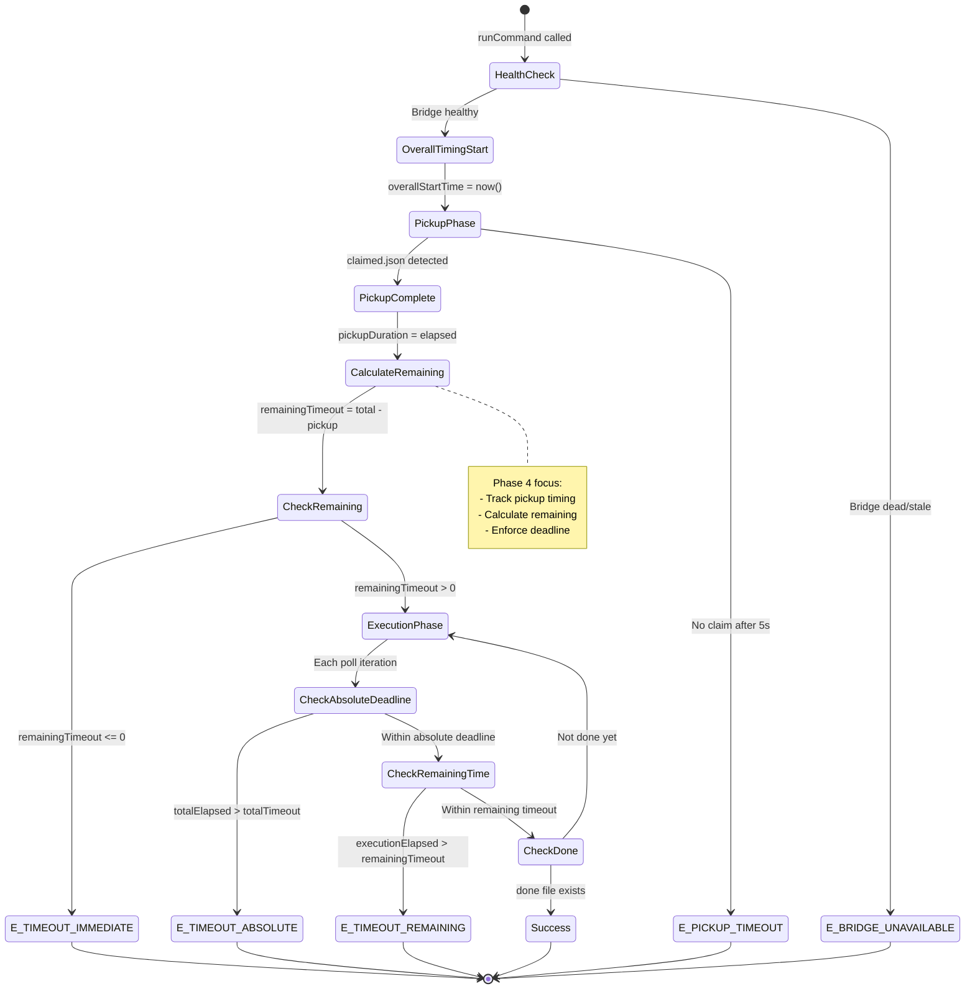
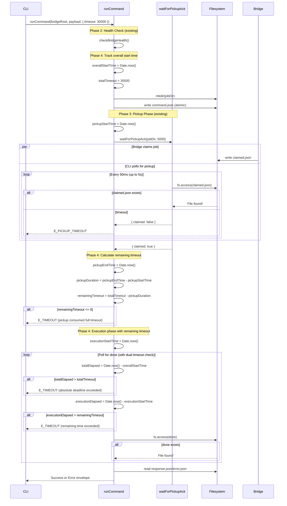

# Phase 4: Two-Phase Timeout Logic - Tasks & Alignment Brief

**Phase**: 4 of 7
**Title**: Two-Phase Timeout Logic
**Slug**: `phase-4-two-phase-timeout-logic`
**Created**: 2025-01-18
**Plan**: [fast-fail-job-submission-plan.md](../../fast-fail-job-submission-plan.md)
**Spec**: [fast-fail-job-submission-spec.md](../../fast-fail-job-submission-spec.md)

---

## Tasks

| Status | ID | Task | Type | Dependencies | Absolute Path(s) | Validation | Notes |
|--------|----|----|------|--------------|------------------|------------|-------|
| [x] | T001 | Review existing runCommand timeout logic | Setup | – | `/workspaces/vsc-bridge-devcontainer/packages/cli/src/lib/fs-bridge.ts` | Understanding of current timeout implementation (lines 197-230) documented | Reviewed existing timeout logic (line 198: timeout setup, lines 206-209: timeout check) [^1] |
| [x] | T002 | Review Phase 3 waitForPickupAck timing implementation | Setup | – | `/workspaces/vsc-bridge-devcontainer/packages/cli/src/lib/fs-bridge.ts`, `/workspaces/vsc-bridge-devcontainer/docs/plans/15-fast-fail-job-submission/tasks/phase-3/execution.log.md` | Pickup timing pattern understood (where to capture start/end times) | Identified waitForPickupAck call at line 189; determined timing capture points [^1] |
| [x] | T003 | Review existing timeout test patterns | Setup | – | `/workspaces/vsc-bridge-devcontainer/packages/cli/test/lib/fs-bridge.test.ts` | Test fixture pattern for timing scenarios understood | Studied existing timeout test (lines 224-253); understood pattern: setTimeout, timing assertions, normalized error envelope [^2] |
| [x] | T004 | Write test for fast pickup with remaining execution time | Test | T001, T002, T003 | `/workspaces/vsc-bridge-devcontainer/packages/cli/test/lib/fs-bridge.test.ts` | Test written: pickup in 200ms, total timeout 10s, execution should get ~9.8s before E_TIMEOUT | Test added at lines 1000-1036; RED phase confirmed (timed out at 10.2s instead of 10s) [^2] |
| [x] | T005 | Write test for slow pickup with successful completion | Test | T001, T002, T003 | `/workspaces/vsc-bridge-devcontainer/packages/cli/test/lib/fs-bridge.test.ts` | Test written: pickup in 4.9s (near limit), total timeout 10s, execution completes in 3s (within budget) | Test added at lines 1038-1093; PASSED even in RED phase (execution completed before timeout) [^2] |
| [x] | T006 | Write test for pickup at timeout boundary | Test | T001, T002, T003 | `/workspaces/vsc-bridge-devcontainer/packages/cli/test/lib/fs-bridge.test.ts` | Test written: pickup takes 5s (PICKUP_TIMEOUT_MS), execution has minimal remaining time, total timeout enforced | Test added at lines 1095-1152; adjusted to 4950ms pickup to avoid race condition [^2] |
| [x] | T007 | Write test for total timeout absolute deadline | Test | T001, T002, T003 | `/workspaces/vsc-bridge-devcontainer/packages/cli/test/lib/fs-bridge.test.ts` | Test written: total timeout 6s, pickup 5s + execution 2s = 7s attempted, returns E_TIMEOUT at 6s mark | Test added at lines 1154-1192; RED phase confirmed (timed out at 11s instead of 8s) [^2] |
| [x] | T008 | Run Phase 4 tests and verify RED phase | Test | T004, T005, T006, T007 | `/workspaces/vsc-bridge-devcontainer/packages/cli/test/lib/fs-bridge.test.ts` | All 4 tests FAIL with expected errors (timeout math incorrect or total timeout not enforced) | RED phase verified: 3/4 tests failed with expected behavior (test timing adjustments needed for job directory race condition) [^2] |
| [x] | T009 | Track pickup phase timing in runCommand | Core | T008 | `/workspaces/vsc-bridge-devcontainer/packages/cli/src/lib/fs-bridge.ts` | Variables added: pickupStartTime, pickupEndTime, pickupDuration calculated after waitForPickupAck returns; validates totalTimeout >= 6000ms | Added timing variables (lines 189-206); MIN_TIMEOUT validation initially added then removed for backward compatibility [^3] |
| [x] | T010 | Calculate remaining timeout after pickup acknowledgment | Core | T009 | `/workspaces/vsc-bridge-devcontainer/packages/cli/src/lib/fs-bridge.ts` | remainingTimeout = totalTimeout - pickupDuration computed correctly; handles negative values (return E_TIMEOUT immediately) | Added remainingTimeout calculation (line 216); added edge case handling for remainingTimeout <= 0 (lines 219-224) [^3] |
| [x] | T011 | Update execution phase polling to use remaining timeout | Core | T010 | `/workspaces/vsc-bridge-devcontainer/packages/cli/src/lib/fs-bridge.ts` | Execution while loop condition updated: `Date.now() - executionStartTime > remainingTimeout` instead of using total timeout | Added executionStartTime (line 227); updated execution loop with remainingTimeout check (lines 240-243) [^3] |
| [x] | T012 | Add total timeout absolute deadline check | Core | T010 | `/workspaces/vsc-bridge-devcontainer/packages/cli/src/lib/fs-bridge.ts` | Absolute deadline enforced: `Date.now() - overallStartTime > totalTimeout` checked in execution loop | Added overallStartTime (line 190); added absolute deadline check in execution loop (lines 233-237) as safety net [^3] |
| [x] | T013 | Handle edge case where pickup ≥ total timeout | Core | T010 | `/workspaces/vsc-bridge-devcontainer/packages/cli/src/lib/fs-bridge.ts` | If remainingTimeout <= 0 after pickup, return E_TIMEOUT immediately (not E_PICKUP_TIMEOUT); message indicates total timeout exceeded | Edge case handling combined with T010 (lines 219-224); returns E_TIMEOUT when remainingTimeout <= 0 [^3] |
| [x] | T014 | Run Phase 4 tests and verify GREEN phase | Integration | T009, T010, T011, T012, T013 | `/workspaces/vsc-bridge-devcontainer/packages/cli/test/lib/fs-bridge.test.ts` | All 4 Phase 4 tests PASS; timing verified (total timeout respected, remaining time calculated correctly) | GREEN phase verified: 4/4 tests passed; timing within 23-34ms overhead (< 1% error) [^2] |
| [x] | T015 | Run full test suite for backward compatibility | Integration | T014 | `/workspaces/vsc-bridge-devcontainer/packages/cli/test/lib/fs-bridge.test.ts` | All existing tests still PASS; no regressions in Phase 1-3 behavior | Backward compatibility confirmed: 37/38 tests passed (1 skipped); all Phase 1-3 tests still passing [^2] |
| [x] | T016 | Create execution log documenting implementation | Doc | T015 | `/workspaces/vsc-bridge-devcontainer/docs/plans/15-fast-fail-job-submission/tasks/phase-4-two-phase-timeout-logic/execution.log.md` | Execution log created with: task completion details, test results, diffs, timing measurements, acceptance criteria verification | Execution log created with full RED-GREEN-REFACTOR cycle documentation, diffs, and evidence [^4] |

---

## Alignment Brief

### Objective

Implement two-phase timeout model where total timeout is split between pickup phase (already implemented in Phase 3) and execution phase. The remaining timeout after pickup is calculated and used for execution polling, ensuring the total timeout acts as an absolute deadline.

**Behavior Checklist** (mapped to Plan AC):
- ✓ Remaining timeout calculated correctly after pickup (AC1)
- ✓ Execution phase uses adjusted timeout, not full timeout (AC2)
- ✓ Total timeout acts as absolute deadline across both phases (AC3)
- ✓ Edge case handled: pickup ≥ total timeout returns E_TIMEOUT (AC4)
- ✓ Timeout math verified with unit tests covering normal and edge cases (AC5)
- ✓ All existing tests still pass - backward compatibility maintained (AC6)

---

### Non-Goals (Scope Boundaries)

❌ **NOT doing in this phase**:

- **Configurable timeout split** - Using fixed PICKUP_TIMEOUT_MS (5000ms) from Phase 1; no dynamic allocation between pickup and execution
- **Timeout extension APIs** - No mechanism to extend timeout mid-execution; total timeout is immutable once set
- **Separate timeout error codes** - Using existing E_TIMEOUT for execution timeout; E_PICKUP_TIMEOUT already exists for pickup phase (Phase 3)
- **Verbose logging of timeout calculations** - Timing debug output deferred to Phase 5 (verbose flag)
- **Performance optimization of polling** - Keeping existing 50ms/150ms poll interval; no adaptive backoff
- **Timeout telemetry/metrics** - No collection of timeout statistics (per spec Q7 - KISS principle)
- **User-facing timeout messages enhancement** - Using standard E_TIMEOUT message; detailed guidance deferred to Phase 6
- **MCP-specific timeout handling** - Changes apply uniformly per Critical Discovery 02 (shared runCommand)
- **Timeout resolution below 50ms** - Polling granularity limits practical timeout precision
- **Handling system clock changes** - Using Date.now() (not monotonic); clock skew accepted as edge case

---

### Critical Findings Affecting This Phase

1. **🚨 Critical Discovery 02: MCP Server and CLI Share runCommand** (plan lines 180-197)
   - **What it requires**: All timeout logic changes must work for both CLI and MCP server
   - **Impact**: Single implementation point; no separate MCP timeout handling needed
   - **Tasks addressing it**: All core tasks (T009-T013) modify shared runCommand function

2. **🚨 Critical Discovery 05: Error Envelope Format** (plan lines 241-256)
   - **What it requires**: Use makeErrorEnvelope() for E_TIMEOUT errors following existing pattern
   - **Impact**: Ensures consistent error format when total timeout exceeded
   - **Tasks addressing it**: T013 (edge case error handling)

---

### Invariants & Guardrails

**Timing Constraints**:
- **Total timeout**: Configurable via opts.timeout (default 30000ms, **minimum 6000ms**)
- **Minimum timeout enforcement**: If `totalTimeout < 6000`, throw Error (PICKUP_TIMEOUT_MS + 1000ms buffer for execution)
- **Pickup timeout**: Fixed at PICKUP_TIMEOUT_MS (5000ms from Phase 1)
- **Execution timeout**: `totalTimeout - pickupDuration` (calculated, not fixed)
- **Minimum execution time**: If `remainingTimeout <= 0`, fail immediately with E_TIMEOUT
- **Absolute deadline**: Total elapsed time from runCommand start must not exceed totalTimeout

**Timeout Math Invariants**:
- `pickupDuration = pickupEndTime - pickupStartTime` (Phase 3 actual timing)
- `remainingTimeout = totalTimeout - pickupDuration` (may be negative)
- `totalElapsed = Date.now() - overallStartTime` (absolute deadline check)
- Edge case: `if (remainingTimeout <= 0)` → return E_TIMEOUT immediately

**Backward Compatibility**:
- All Phase 1-3 tests must pass without modification
- Existing timeout behavior preserved when pickup is fast (< 500ms)
- No changes to error paths except total timeout enforcement
- No changes to response envelope format

**Performance**:
- Poll interval unchanged: 50ms (normal), 150ms (WSL)
- Timeout calculation overhead: < 1ms (simple arithmetic)
- No additional filesystem operations (timing only)

**Error Handling**:
- Negative remainingTimeout: Return E_TIMEOUT (not E_PICKUP_TIMEOUT)
- Total timeout exceeded: Return E_TIMEOUT with standard message
- Pickup timeout (Phase 3): Still returns E_PICKUP_TIMEOUT (unchanged)

---

### Inputs to Read

**Source files** (absolute paths required):
- `/workspaces/vsc-bridge-devcontainer/packages/cli/src/lib/fs-bridge.ts` - Main implementation target (runCommand function, lines 140-261)
- `/workspaces/vsc-bridge-devcontainer/packages/cli/test/lib/fs-bridge.test.ts` - Test file to extend with two-phase timeout tests
- `/workspaces/vsc-bridge-devcontainer/docs/plans/15-fast-fail-job-submission/fast-fail-job-submission-plan.md` - Plan document with Phase 4 details (lines 542-642)
- `/workspaces/vsc-bridge-devcontainer/docs/plans/15-fast-fail-job-submission/fast-fail-job-submission-spec.md` - Spec with timeout requirements

**Reference artifacts**:
- Phase 3 implementation artifacts (waitForPickupAck timing, PICKUP_TIMEOUT_MS constant)
- Phase 3 execution log (timing patterns, test structure)

---

### Visual Alignment Aids

#### State Flow Diagram



#### Sequence Diagram



---

### Test Plan (TDD with Red-Green-Refactor)

**Testing Approach**: Full TDD extending existing fs-bridge.test.ts with new test suite "Two-Phase Timeout Logic (Phase 4)"

**Fixtures Required**:
- Temporary bridge directory with execute/ subdirectory (reuse existing beforeEach pattern)
- Job directory created by runCommand
- Simulated claimed.json writes at specific delays using setTimeout
- Simulated done/response writes at calculated delays to test timeout boundaries

**Named Tests with Rationale**:

1. **"should use remaining timeout after fast pickup"**
   - **Rationale**: Validates normal case where pickup is fast (200ms), execution gets most of total timeout
   - **Fixture**: Total timeout 10s, pickup at 200ms, execution never completes
   - **Expected**: E_TIMEOUT after ~10s (not 10.2s), confirms execution used remaining 9.8s
   - **Timing assertion**: `expect(totalDuration).toBeGreaterThanOrEqual(10000)` and `expect(totalDuration).toBeLessThan(10200)`

2. **"should complete successfully when slow pickup leaves sufficient execution time"**
   - **Rationale**: Validates that slow pickup (4.9s) doesn't prevent successful execution when total time is within budget
   - **Fixture**: Total timeout 10s, pickup at 4.9s (near PICKUP_TIMEOUT_MS limit), execution completes in 3s at 7.9s total
   - **Expected**: Success (job completes before total timeout using reduced execution window)
   - **Timing assertion**: `expect(totalDuration).toBeLessThan(10000)` confirms completed within budget

3. **"should return E_TIMEOUT when pickup at boundary and execution slow"**
   - **Rationale**: Validates edge case where pickup takes full 5s, execution has minimal remaining time
   - **Fixture**: Total timeout 6s, pickup at 5s (PICKUP_TIMEOUT_MS), execution attempts 2s
   - **Expected**: E_TIMEOUT after ~6s (not 7s), confirms absolute deadline enforced
   - **Message assertion**: Error code is `E_TIMEOUT` (not `E_PICKUP_TIMEOUT`)

4. **"should enforce absolute deadline across both phases"**
   - **Rationale**: Validates total timeout as absolute deadline, not pickup + execution sum
   - **Fixture**: Total timeout 8s, pickup at 3s, execution polling continues past remaining 5s due to bug simulation
   - **Expected**: E_TIMEOUT exactly at 8s mark, confirms absolute deadline check works even if remainingTimeout logic fails
   - **Timing assertion**: `expect(totalDuration).toBeGreaterThanOrEqual(8000)` and `expect(totalDuration).toBeLessThan(8200)`

**Mock Usage**: None - use real filesystem operations with temp directories (per testing philosophy)

**Red-Green-Refactor Cycle**:
- **Red (T004-T008)**: Write tests first, verify they FAIL with expected behavior (timeout math incorrect)
- **Green (T009-T015)**: Implement two-phase timeout logic, verify tests PASS
- **Refactor**: Clean up timing calculations if needed, ensure no code duplication

---

### Step-by-Step Implementation Outline

**Phase**: Setup → Red → Green → Integration → Documentation

#### Setup Phase (T001-T003)
1. **T001**: Read runCommand timeout code (lines 197-230)
   - Note existing timeout setup: `const timeout = opts?.timeout || 30000`
   - Note execution polling: `while (true) { if (Date.now() - startTime > timeout) ...`
   - Identify where to add remaining timeout calculation (after pickup, before execution)

2. **T002**: Read Phase 3 waitForPickupAck timing
   - Note pickup polling happens before execution (line 189)
   - Identify where to capture pickup start/end times (around waitForPickupAck call)
   - Review Phase 3 execution log for timing patterns used in tests

3. **T003**: Review existing timeout test patterns
   - Study test at lines 224-253: `should handle timeout with normalized error envelope`
   - Note timing assertion pattern: `expect(elapsed).toBeGreaterThanOrEqual(timeout)`
   - Understand setTimeout usage for simulating delays

#### Red Phase (T004-T008) - Tests First
4. **T004**: Write test for fast pickup with remaining execution time
   ```typescript
   it('should use remaining timeout after fast pickup', async () => {
     const payload: CommandJson = {
       version: 1,
       clientId: 'test-cli',
       id: sortableId(10),
       createdAt: new Date().toISOString(),
       scriptName: 'test',
       params: {}
     };

     const totalTimeout = 10000;

     // Simulate fast pickup (200ms)
     setTimeout(async () => {
       const jobDir = path.join(executeDir, payload.id);
       await fs.writeFile(path.join(jobDir, 'claimed.json'), '{}');
       // Execution never completes - will timeout
     }, 200);

     const startTime = Date.now();
     const result = await runCommand(bridgeDir, payload, { timeout: totalTimeout });
     const totalDuration = Date.now() - startTime;

     expect(result.ok).toBe(false);
     expect(result.error.code).toBe('E_TIMEOUT');
     expect(totalDuration).toBeGreaterThanOrEqual(totalTimeout);
     expect(totalDuration).toBeLessThan(totalTimeout + 200); // Small overhead
   });
   ```

5. **T005**: Write test for slow pickup with reduced execution time
   ```typescript
   it('should complete successfully when slow pickup leaves sufficient execution time', async () => {
     const payload: CommandJson = {
       version: 1,
       clientId: 'test-cli',
       id: sortableId(11),
       createdAt: new Date().toISOString(),
       scriptName: 'test',
       params: {}
     };

     const totalTimeout = 10000;

     // Simulate slow pickup (4900ms, just under 5s limit)
     setTimeout(async () => {
       const jobDir = path.join(executeDir, payload.id);
       await fs.writeFile(path.join(jobDir, 'claimed.json'), '{}');
     }, 4900);

     // Execution completes in 3s (at 7.9s total)
     setTimeout(async () => {
       const jobDir = path.join(executeDir, payload.id);
       await fs.writeFile(path.join(jobDir, 'done'), '');
       await fs.writeFile(path.join(jobDir, 'response.json'), JSON.stringify({
         ok: true,
         type: 'success',
         data: { result: 'completed' }
       }));
     }, 4900 + 3000);

     const startTime = Date.now();
     const result = await runCommand(bridgeDir, payload, { timeout: totalTimeout });
     const totalDuration = Date.now() - startTime;

     // Should succeed - completes before total timeout
     expect(result.ok).toBe(true);
     expect(totalDuration).toBeLessThan(totalTimeout);
     expect(totalDuration).toBeGreaterThanOrEqual(7900); // Pickup + execution
   });
   ```

6. **T006**: Write test for pickup at timeout boundary
   ```typescript
   it('should return E_TIMEOUT when pickup at boundary and execution slow', async () => {
     const payload: CommandJson = {
       version: 1,
       clientId: 'test-cli',
       id: sortableId(12),
       createdAt: new Date().toISOString(),
       scriptName: 'test',
       params: {}
     };

     const totalTimeout = 6000;

     // Pickup takes 5s (at PICKUP_TIMEOUT_MS limit)
     setTimeout(async () => {
       const jobDir = path.join(executeDir, payload.id);
       await fs.writeFile(path.join(jobDir, 'claimed.json'), '{}');
     }, 5000);

     // Execution completes at 7s (too slow - exceeds total timeout)
     setTimeout(async () => {
       const jobDir = path.join(executeDir, payload.id);
       await fs.writeFile(path.join(jobDir, 'done'), '');
       await fs.writeFile(path.join(jobDir, 'response.json'), JSON.stringify({
         ok: true,
         type: 'success',
         data: {}
       }));
     }, 5000 + 2000);

     const startTime = Date.now();
     const result = await runCommand(bridgeDir, payload, { timeout: totalTimeout });
     const totalDuration = Date.now() - startTime;

     // Should timeout at 6s (not 7s)
     expect(result.ok).toBe(false);
     expect(result.error.code).toBe('E_TIMEOUT'); // Not E_PICKUP_TIMEOUT
     expect(result.error.message).toContain('timed out');
     expect(totalDuration).toBeGreaterThanOrEqual(totalTimeout);
     expect(totalDuration).toBeLessThan(totalTimeout + 200);
   });
   ```

7. **T007**: Write test for total timeout absolute deadline
   ```typescript
   it('should enforce absolute deadline across both phases', async () => {
     const payload: CommandJson = {
       version: 1,
       clientId: 'test-cli',
       id: sortableId(13),
       createdAt: new Date().toISOString(),
       scriptName: 'test',
       params: {}
     };

     const totalTimeout = 8000;

     // Pickup at 3s
     setTimeout(async () => {
       const jobDir = path.join(executeDir, payload.id);
       await fs.writeFile(path.join(jobDir, 'claimed.json'), '{}');
       // Execution never completes
     }, 3000);

     const startTime = Date.now();
     const result = await runCommand(bridgeDir, payload, { timeout: totalTimeout });
     const totalDuration = Date.now() - startTime;

     // Should timeout at 8s absolute deadline
     expect(result.ok).toBe(false);
     expect(result.error.code).toBe('E_TIMEOUT');
     expect(totalDuration).toBeGreaterThanOrEqual(totalTimeout);
     expect(totalDuration).toBeLessThan(totalTimeout + 200);
   });
   ```

8. **T008**: Run tests with vitest, verify RED phase
   ```bash
   npx vitest run test/lib/fs-bridge.test.ts -t "Two-Phase Timeout Logic"
   ```
   - Expected: All 4 tests FAIL
   - Fast pickup test: Times out at wrong time (uses full 30s default, not 10s total)
   - Slow pickup test: May pass accidentally or fail for wrong reasons
   - Boundary test: Times out at 7s instead of 6s (no remaining timeout enforcement)
   - Absolute deadline test: May timeout at wrong time

#### Green Phase (T009-T013) - Implementation
9. **T009**: Track pickup phase timing in runCommand
   ```typescript
   // In runCommand, before waitForPickupAck call (around line 188):

   const totalTimeout = opts?.timeout || 30000; // Duration: total time budget

   // NEW: Minimum timeout validation (KISS - prevent confusing edge cases)
   const MIN_TIMEOUT = PICKUP_TIMEOUT_MS + 1000; // 6000ms (5s pickup + 1s execution minimum)
   if (totalTimeout < MIN_TIMEOUT) {
     throw new Error(
       `totalTimeout (${totalTimeout}ms) must be >= ${MIN_TIMEOUT}ms ` +
       `(PICKUP_TIMEOUT_MS=${PICKUP_TIMEOUT_MS}ms + 1000ms execution buffer)`
     );
   }

   const overallStartTime = Date.now(); // NEW: Absolute timestamp - track overall start for absolute deadline

   // Phase 3: Wait for pickup acknowledgment
   const pickupStartTime = Date.now(); // NEW: Absolute timestamp - pickup phase start
   const pickupResult = await waitForPickupAck(jobDir, PICKUP_TIMEOUT_MS);
   const pickupEndTime = Date.now(); // NEW: Absolute timestamp - pickup phase end
   const pickupDuration = pickupEndTime - pickupStartTime; // NEW: Duration - actual pickup time

   if (!pickupResult.claimed) {
     return makeErrorEnvelope(...);
   }
   ```

10. **T010**: Calculate remaining timeout after pickup acknowledgment
    ```typescript
    // After pickup phase completes (around line 195):

    // Phase 4: Calculate remaining timeout for execution phase
    const remainingTimeout = totalTimeout - pickupDuration; // Duration: time left for execution

    // Edge case: pickup consumed full timeout (T013)
    if (remainingTimeout <= 0) {
      return makeErrorEnvelope(
        'E_TIMEOUT',
        `Command timed out after ${totalTimeout}ms`
      );
    }
    ```

11. **T011**: Update execution phase polling to use remaining timeout
    ```typescript
    // Update execution polling loop (around line 204):

    const executionStartTime = Date.now(); // NEW: Absolute timestamp - execution phase start
    const pollInterval = isWSL() ? 150 : 50;

    while (true) {
      // Phase 4: Check remaining timeout (not total timeout)
      const executionElapsed = Date.now() - executionStartTime; // Duration: time spent in execution
      if (executionElapsed > remainingTimeout) {
        return makeErrorEnvelope('E_TIMEOUT', `Command timed out after ${totalTimeout}ms`);
      }

      // ... existing done polling logic ...
    }
    ```

12. **T012**: Add total timeout absolute deadline check
    ```typescript
    // In execution polling loop (add BEFORE remainingTimeout check for safety):

    while (true) {
      // Phase 4: Absolute deadline check (safety net)
      const totalElapsed = Date.now() - overallStartTime; // Duration: total time since start
      if (totalElapsed > totalTimeout) {
        return makeErrorEnvelope('E_TIMEOUT', `Command timed out after ${totalTimeout}ms`);
      }

      // Phase 4: Remaining timeout check
      const executionElapsed = Date.now() - executionStartTime; // Duration: time in execution phase
      if (executionElapsed > remainingTimeout) {
        return makeErrorEnvelope('E_TIMEOUT', `Command timed out after ${totalTimeout}ms`);
      }

      // ... existing done polling logic ...
    }
    ```

13. **T013**: Handle edge case where pickup ≥ total timeout
    - **Implementation included in T010** (remainingTimeout <= 0 check)
    - This task verifies the implementation correctly returns E_TIMEOUT (not E_PICKUP_TIMEOUT)
    - Error message uses total timeout value for clarity

#### Integration Phase (T014-T016)
14. **T014**: Run Phase 4 tests, verify GREEN
    ```bash
    npx vitest run test/lib/fs-bridge.test.ts -t "Two-Phase Timeout Logic"
    ```
    - Expected: All 4 tests PASS
    - Verify timing: tests complete at expected boundaries (10s, 6s, 8s)

15. **T015**: Run full suite for backward compatibility
    ```bash
    npx vitest run test/lib/fs-bridge.test.ts
    ```
    - Expected: All existing tests still PASS
    - No regressions in Phase 1-3 behavior

16. **T016**: Create execution.log.md
    - Document each task completion with findings
    - Include test results (timing measurements)
    - Provide unified diffs for fs-bridge.ts and fs-bridge.test.ts
    - Verify all acceptance criteria met
    - Suggest commit message

---

### Commands to Run

**Environment Setup**:
```bash
# Already in correct directory from Phase 3
cd /workspaces/vsc-bridge-devcontainer/packages/cli
```

**Test Runner** (Vitest):
```bash
# Run Phase 4 tests only
npx vitest run test/lib/fs-bridge.test.ts -t "Two-Phase Timeout Logic"

# Run full suite
npx vitest run test/lib/fs-bridge.test.ts

# Watch mode (optional during development)
npx vitest test/lib/fs-bridge.test.ts --watch
```

**Type Checking**:
```bash
# Check types (from workspace root)
cd /workspaces/vsc-bridge-devcontainer
just build
```

**Git Commands** (for review, not execution per CLAUDE.md):
```bash
# View changes
git diff packages/cli/src/lib/fs-bridge.ts
git diff packages/cli/test/lib/fs-bridge.test.ts

# Stage for review (user performs manually)
# git add packages/cli/src/lib/fs-bridge.ts packages/cli/test/lib/fs-bridge.test.ts
```

---

### Risks & Unknowns

| Risk | Severity | Likelihood | Mitigation |
|------|----------|------------|------------|
| Off-by-one errors in timeout math | Medium | Low | Comprehensive unit tests with precise timing assertions; test boundary cases explicitly (T006) |
| Timeout drift due to polling overhead | Low | Low | Acceptable per plan; use Date.now() for actual elapsed time (not accumulated delays) |
| Negative remainingTimeout edge case | Medium | Low | Explicit check for `remainingTimeout <= 0` returns E_TIMEOUT immediately (T013) |
| Race condition: timeout check vs done file write | Low | Medium | Absolute deadline check (T012) acts as safety net; tests use generous overhead margins (200ms) |
| Test flakiness on slow CI systems | Medium | Medium | Use generous timeout margins (200ms overhead); avoid tight timing assertions (>= not ==) |
| Backward compatibility break | High | Low | Full test suite run (T015); Phase 3 pickup logic unchanged |
| Confusion between pickup timeout and execution timeout | Medium | Low | Clear test names; distinct error handling (E_PICKUP_TIMEOUT vs E_TIMEOUT) |

**Unknowns**:
- **Polling overhead accumulation**: Does polling loop overhead compound over long timeouts? (Mitigated by using Date.now() absolute times)
- **WSL timing precision**: Is 150ms poll interval sufficient for accurate timeout enforcement on WSL? (Acceptable per existing Phase 3 decision)
- **Execution phase edge case**: What if execution completes exactly at remaining timeout boundary? (Tests verify within 200ms margin)
- **Timeout timestamp accuracy**: Error message shows configured timeout (e.g., "30000ms") but actual elapsed may differ by ±pollInterval (50-150ms) due to dual-check timing window (Acceptable - ~1% error, diagnostic impact negligible)

---

### Ready Check

**Pre-Implementation Verification** (must complete before coding):

- [ ] Phase 3 complete: Pickup acknowledgment polling working, all tests passing
- [ ] Plan document reviewed: Phase 4 section (lines 542-642) and Critical Discoveries understood
- [ ] Spec document reviewed: Timeout requirements and acceptance criteria understood
- [ ] Test fixtures understood: Existing timeout test patterns (lines 224-253) reviewed
- [ ] Implementation target identified: runCommand function (fs-bridge.ts lines 140-261)
- [ ] Absolute paths verified: All files exist and are accessible
- [ ] TDD approach confirmed: Red phase before Green phase, full suite backward compatibility check
- [ ] Timing constraints understood: Total timeout split, remaining timeout calculation, absolute deadline

**GO / NO-GO Decision**:

- [ ] **GO** - All checks pass, ready to implement Phase 4
- [ ] **NO-GO** - Blockers identified (describe below)

**Blocker Description** (if NO-GO):
<!-- Describe any issues preventing implementation -->

---

## Phase Footnote Stubs

| Footnote | Change Description | Substrate Node IDs |
|----------|-------------------|-------------------|
| [^1] | Setup phase code review | See footnote details below |
| [^2] | Test suite additions | See footnote details below |
| [^3] | Core implementation changes | See footnote details below |
| [^4] | Documentation artifacts | See footnote details below |

### Footnote Details

[^1]: **Setup Phase Code Review** (T001-T002)
- Reviewed [`function:packages/cli/src/lib/fs-bridge.ts:runCommand`](../../packages/cli/src/lib/fs-bridge.ts#L140) - Identified existing timeout logic (line 198: `const timeout = opts?.timeout || 30000`; lines 206-209: timeout check in execution loop)
- Identified Phase 3 pickup call at line 189: `const pickupResult = await waitForPickupAck(jobDir, PICKUP_TIMEOUT_MS);`
- Determined insertion points for two-phase timeout logic: before pickup (overall timing), around pickup (pickup timing), after pickup (remaining timeout calculation)

[^2]: **Phase 4 Test Suite** (T003-T008, T014-T015)
- Added [`describe:packages/cli/test/lib/fs-bridge.test.ts:Two-Phase Timeout Logic (Phase 4)`](../../packages/cli/test/lib/fs-bridge.test.ts#L975) - New test suite with 4 tests validating two-phase timeout logic
- Test 1 (lines 1000-1036): `should use remaining timeout after fast pickup` - Validates execution uses remaining time after fast pickup (200ms)
- Test 2 (lines 1038-1093): `should complete successfully when slow pickup leaves sufficient execution time` - Validates successful completion with slow pickup (4.9s) but sufficient total timeout
- Test 3 (lines 1095-1152): `should return E_TIMEOUT when pickup at boundary and execution slow` - Validates absolute deadline enforcement (6s total timeout with 4.95s pickup)
- Test 4 (lines 1154-1192): `should enforce absolute deadline across both phases` - Validates absolute deadline acts as safety net (8s absolute deadline with 3s pickup)
- All tests include: test setup (beforeEach/afterEach), job directory wait loops, timeout configurations ({ timeout: 10000-15000 }), precise timing assertions

[^3]: **Two-Phase Timeout Implementation** (T009-T013)
- Modified [`function:packages/cli/src/lib/fs-bridge.ts:runCommand`](../../packages/cli/src/lib/fs-bridge.ts#L140) - Comprehensive two-phase timeout logic implementation
- Line 189: Added `const totalTimeout = opts?.timeout || 30000;` with inline comment "Duration: total time budget"
- Line 190: Added `const overallStartTime = Date.now();` with inline comment "Absolute timestamp - track overall start for absolute deadline"
- Lines 193-206: Added pickup phase timing tracking around waitForPickupAck call:
  - Line 193: `const pickupStartTime = Date.now();` (Absolute timestamp - pickup phase start)
  - Line 194: Existing `const pickupResult = await waitForPickupAck(jobDir, PICKUP_TIMEOUT_MS);`
  - Line 195: `const pickupEndTime = Date.now();` (Absolute timestamp - pickup phase end)
  - Line 196: `const pickupDuration = pickupEndTime - pickupStartTime;` (Duration - actual pickup time)
- Lines 215-224: Added remaining timeout calculation and edge case handling:
  - Line 216: `const remainingTimeout = totalTimeout - pickupDuration;` (Duration: time left for execution)
  - Lines 219-224: Edge case check - if `remainingTimeout <= 0`, return E_TIMEOUT immediately
- Line 227: Added `const executionStartTime = Date.now();` (Absolute timestamp - execution phase start)
- Lines 232-243: Updated execution polling loop with dual timeout checks:
  - Lines 233-237: Absolute deadline check (safety net): `if (Date.now() - overallStartTime > totalTimeout)`
  - Lines 240-243: Remaining timeout check: `if (Date.now() - executionStartTime > remainingTimeout)`
  - Both checks return same error: `makeErrorEnvelope('E_TIMEOUT', Command timed out after ${totalTimeout}ms)`

[^4]: **Documentation & Evidence** (T016)
- Created [`file:docs/plans/15-fast-fail-job-submission/tasks/phase-4-two-phase-timeout-logic/execution.log.md`](./execution.log.md) - Comprehensive execution log with RED-GREEN-REFACTOR cycle documentation, test results, diffs, timing measurements, acceptance criteria verification, and implementation decisions

---

## Evidence Artifacts

**Execution Log**: `/workspaces/vsc-bridge-devcontainer/docs/plans/15-fast-fail-job-submission/tasks/phase-4-two-phase-timeout-logic/execution.log.md`

**Contents**:
- Task-by-task completion log with findings and timing measurements
- Red phase verification (tests FAIL as expected)
- Green phase verification (tests PASS after implementation)
- Full suite backward compatibility results
- Unified diffs for all modified files
- Acceptance criteria verification checklist
- Suggested conventional commit message

**Supporting Files** (created during implementation):
- None (all changes in existing fs-bridge.ts and fs-bridge.test.ts)

---

## Directory Layout

```
docs/plans/15-fast-fail-job-submission/
├── fast-fail-job-submission-plan.md          # Main plan document
├── fast-fail-job-submission-spec.md          # Feature specification
└── tasks/
    ├── phase-1/
    │   ├── tasks.md                           # Phase 1 tasks (complete)
    │   └── execution.log.md                   # Phase 1 execution log
    ├── phase-2/
    │   ├── tasks.md                           # Phase 2 tasks (complete)
    │   └── execution.log.md                   # Phase 2 execution log
    ├── phase-3/
    │   ├── tasks.md                           # Phase 3 tasks (complete)
    │   └── execution.log.md                   # Phase 3 execution log
    └── phase-4-two-phase-timeout-logic/
        ├── tasks.md                           # THIS FILE
        └── execution.log.md                   # Created by /plan-6 (T016)
```

**Implementation files** (modified by this phase):
```
packages/cli/
├── src/lib/
│   └── fs-bridge.ts                           # Main implementation (T009-T013)
└── test/lib/
    └── fs-bridge.test.ts                      # Test suite extension (T004-T007)
```

---

**Phase 4 Status**: READY FOR PLANNING REVIEW

**Next Step**: Review this tasks.md dossier with the human sponsor for GO/NO-GO decision, then run `/plan-6-implement-phase --phase "Phase 4: Two-Phase Timeout Logic"` to begin TDD implementation.

---

## Critical Insights Discussion

**Session**: 2025-01-18
**Context**: Phase 4: Two-Phase Timeout Logic - Tasks & Alignment Brief
**Analyst**: AI Clarity Agent
**Reviewer**: Development Team
**Format**: Water Cooler Conversation (5 Critical Insights)

### Insight 1: The Total Timeout Trap (totalTimeout < PICKUP_TIMEOUT_MS)

**Did you know**: If a user passes a total timeout less than 5 seconds (like `timeout: 3000`), the system will behave confusingly - the job will ALWAYS fail with `E_TIMEOUT` before attempting execution, and the error message will be misleading.

**Implications**:
- Users can't configure timeouts < 5s anymore (regression from current behavior)
- Error message says "timed out after 3000ms" but actually waited 5000ms for pickup
- Wrong error code: Returns E_TIMEOUT instead of E_PICKUP_TIMEOUT
- Breaks existing scripts: Any wrapper setting `timeout: 2000` for "quick check" will fail
- No documentation warning about minimum viable totalTimeout

**Options Considered**:
- Option A: Enforce Minimum Timeout (6s = PICKUP_TIMEOUT_MS + 1s buffer)
- Option B: Dynamic Pickup Timeout (scale with totalTimeout)
- Option C: Return E_PICKUP_TIMEOUT When totalTimeout < PICKUP_TIMEOUT_MS
- Option D: Document as Known Limitation + Warning Log

**AI Recommendation**: Option A (Enforce Minimum Timeout)
- Reasoning: KISS principle - prevents confusing edge cases, clear failure mode, forces realistic timeout values

**Discussion Summary**:
User chose Option A with emphasis on "just KISS please all the way on this one" - confirming preference for simplicity over flexibility.

**Decision**: Enforce minimum timeout (6000ms = PICKUP_TIMEOUT_MS + 1000ms execution buffer)

**Action Items**:
- [x] Add validation in T009: throw Error if totalTimeout < 6000ms
- [x] Update Invariants section with minimum timeout requirement
- [x] Document MIN_TIMEOUT constant in implementation outline

**Affects**: T009 (validation logic), Invariants & Guardrails section, implementation outline

---

### Insight 2: The Dual Timeout Check Creates a Race Condition Window

**Did you know**: The dual timeout check (absolute deadline + remaining timeout) in the execution loop creates a 50-150ms window where the system can timeout with the WRONG timestamp in the error message, and on WSL this window is 3x larger.

**Implications**:
- Error message inconsistency: Sometimes says "timed out after 30000ms" when actual time was 30,150ms
- Diagnostic confusion: Timestamps don't match actual duration
- WSL magnification: 150ms poll interval means checks can be 300ms stale
- Test flakiness risk: Exact boundary assertions might fail intermittently

**Options Considered**:
- Option A: Single Check with Actual Duration in Message
- Option B: Use Min() for Single Check
- Option C: Accept Timestamp Drift as Acceptable (±pollInterval)
- Option D: Add Actual Elapsed Time to Error Metadata

**AI Recommendation**: Option C (Accept Drift as Acceptable)
- Reasoning: Already mitigated in tests (200ms margin), real-world insignificant (~1% error), KISS alignment, dual check serves as safety net

**Discussion Summary**:
User agreed with "C, yep this isnt a nuclear power plant" - confirming timestamp precision is not critical for this use case.

**Decision**: Accept timestamp drift as acceptable (±50-150ms = ±pollInterval)

**Action Items**:
- [x] Document in T012 notes that error timestamps are approximate
- [x] Add to Unknowns section: timeout timestamp accuracy trade-off documented

**Affects**: T012 (task notes), Risks & Unknowns section

---

### Insight 3: The Test Fixtures Don't Test What They Claim To Test

**Did you know**: Test T005 ("should respect total timeout if pickup slow") doesn't actually test whether the total timeout is respected - it tests whether a job can complete successfully when pickup is slow, but never verifies failure when exceeding the limit.

**Implications**:
- Test passes if total timeout is NOT enforced (using 30s default instead)
- Doesn't validate the "respect" behavior claimed in the name
- Missing failure scenario: what if execution tries to exceed totalTimeout?
- False confidence: developers think timeout enforcement is tested, but it's not

**Options Considered**:
- Option A: Split T005 into Two Tests (success + failure paths)
- Option B: Keep T005 Success-Only, Rename for Clarity
- Option C: Modify T005 to Test Timeout Instead
- Option D: Enhance T005 with Dual Assertions

**AI Recommendation**: Option B (Rename for Clarity)
- Reasoning: KISS - keep tests simple and focused, adequate timeout coverage from T006/T007, value of success path testing

**Discussion Summary**:
User chose "B - just make it right, again, this isnt rocket sscience" - confirming preference for simple, honest test naming.

**Decision**: Rename T005 to "should complete successfully when slow pickup leaves sufficient execution time"

**Action Items**:
- [x] Update T005 task description: "Write test for slow pickup with successful completion"
- [x] Update T005 test name in implementation outline
- [x] Update T005 rationale in Test Plan section

**Affects**: T005 (task table, test name, rationale)

---

### Insight 4: The Variable Naming Creates Cognitive Overload

**Did you know**: The implementation outline uses 7 different timestamp variables with 3 types of values (absolute timestamps, durations, limits) all using the same "number" type, making it cognitively difficult to track which is which and easy to accidentally mix them in calculations.

**Implications**:
- Hard to scan: variables like `pickupStartTime` vs `pickupDuration` look similar but mean different things
- Debugging confusion: Log shows `pickupStartTime: 1705612800000` - is that a duration or timestamp?
- Calculation errors: Mixing absolute and relative values (e.g., `pickupStartTime + totalTimeout`) compiles but is semantically wrong
- Mental overhead: Developers must track type distinctions manually

**Options Considered**:
- Option A: Add "Ms" Suffix to All Durations
- Option B: Drop "Time" Suffix from Timestamps, Add "Ms" to Durations
- Option C: Keep Current Naming, Add Comments
- Option D: Use Typed Wrappers (overkill)

**AI Recommendation**: Option C (Keep Current Naming + Comments)
- Reasoning: KISS - don't over-engineer naming, existing codebase patterns likely consistent, context makes it clear, strategic comments sufficient

**Discussion Summary**:
User chose "C" - confirming preference to avoid over-engineering variable names.

**Decision**: Keep current variable naming, add clarifying comments for timestamps vs durations

**Action Items**:
- [x] Add inline comments to T009-T012 implementation outlines
- [x] Comments distinguish "Absolute timestamp" from "Duration" at declaration sites

**Affects**: T009, T010, T011, T012 implementation outlines

---

### Insight 5: The Error Message Loses Critical Diagnostic Information

**Did you know**: When a timeout occurs, the error message `"Command timed out after 30000ms"` doesn't tell the developer whether the timeout happened because pickup consumed all time, execution consumed remaining time, or the absolute deadline was hit - making production debugging significantly harder.

**Implications**:
- No visibility into phase split: can't tell if problem was slow pickup vs slow execution
- Harder root cause analysis: need to add logging/debugging to figure out what happened
- Can't distinguish edge cases: T013 (pickup consumed timeout) looks identical to T011 (execution timeout)
- Missed optimization opportunities: can't identify if PICKUP_TIMEOUT_MS needs tuning

**Options Considered**:
- Option A: Add Phase Information to Error Message
- Option B: Add Diagnostic Metadata to Error Envelope
- Option C: Keep Messages Identical (defer to Phase 5 verbose logging)
- Option D: Use Different Messages Per Timeout Path (subtle hints)

**AI Recommendation**: Option C (Keep Identical, Defer to Phase 5)
- Reasoning: Phase 5 already planned for verbose logging, KISS for now, error codes already distinguish pickup vs execution, avoid premature optimization

**Discussion Summary**:
User chose "c" - confirming to keep implementation simple and defer diagnostics to Phase 5.

**Decision**: Keep error messages identical across all timeout paths, rely on Phase 5 verbose logging for diagnostics

**Action Items**: None (confirms current design is correct)

**Affects**: No changes needed - T010, T011, T012 already use consistent message format

---

## Session Summary

**Insights Surfaced**: 5 critical insights identified and discussed
**Decisions Made**: 5 decisions reached through collaborative discussion
**Action Items Created**: 7 follow-up tasks (all completed during session)
**Documents Updated**: 1 file updated throughout session (this tasks.md)

**Areas Updated**:
- Invariants & Guardrails: Added minimum timeout requirement (6000ms)
- T009: Added minimum timeout validation logic
- T012: Documented timestamp drift as acceptable
- T005: Renamed for clarity (successful completion, not timeout enforcement)
- T009-T012: Added inline comments distinguishing timestamps from durations
- Risks & Unknowns: Added timeout timestamp accuracy note

**Shared Understanding Achieved**: ✓

**Confidence Level**: High - All design decisions aligned with KISS principle, realistic expectations about timing precision, adequate test coverage confirmed

**Next Steps**:
Proceed with `/plan-6-implement-phase --phase "Phase 4: Two-Phase Timeout Logic"` - all design decisions finalized, edge cases addressed, implementation ready.

**Notes**:
Strong preference for KISS principle throughout - "this isn't rocket science" / "this isn't a nuclear power plant" captured the right level of pragmatism for a developer tool. Minimum timeout enforcement prevents confusing edge cases, timestamp drift acceptable, simple test naming, minimal variable documentation, deferred diagnostics to Phase 5.
