# Phase 5: Verbose Logging - Tasks & Alignment Brief

**Phase**: 5 of 7
**Title**: Verbose Logging
**Slug**: `phase-5-verbose-logging`
**Created**: 2025-01-18
**Plan**: [fast-fail-job-submission-plan.md](../../fast-fail-job-submission-plan.md)
**Spec**: [fast-fail-job-submission-spec.md](../../fast-fail-job-submission-spec.md)

---

## Tasks

| Status | ID | Task | Type | Dependencies | Absolute Path(s) | Validation | Notes |
|--------|----|----|------|--------------|------------------|------------|-------|
| [ ] | T001 | Review existing RunOptions type definition | Setup | – | `/workspaces/vsc-bridge-devcontainer/packages/cli/src/lib/fs-bridge.ts` | Understanding of current RunOptions interface (lines 115-119) documented | Study existing type structure; note that Phase 4 already uses opts.timeout |
| [ ] | T002 | Review Phase 4 pickup timing implementation | Setup | – | `/workspaces/vsc-bridge-devcontainer/packages/cli/src/lib/fs-bridge.ts`, `/workspaces/vsc-bridge-devcontainer/docs/plans/15-fast-fail-job-submission/tasks/phase-4-two-phase-timeout-logic/execution.log.md` | Pickup timing variables identified (pickupStartTime, pickupEndTime, pickupDuration) | Phase 4 already tracks pickup timing (lines 193-198); will reuse for logging |
| [ ] | T003 | Research oclif verbose flag support | Setup | – | `/workspaces/vsc-bridge-devcontainer/packages/cli/src/commands` | Determine if oclif BaseCommand has built-in --verbose flag | Check existing command files for verbose flag patterns; if not built-in, plan to add custom flag |
| [x] | T004 | Write test for verbose logging enabled | Test | T001, T002, T003 | `/workspaces/vsc-bridge-devcontainer/packages/cli/test/lib/fs-bridge.test.ts` | Test written: verbose: true logs pickup duration to stderr with `[DEBUG] Job claimed in <duration>ms` format | Added verbose logging tests [^5.7] |
| [x] | T005 | Write test for verbose logging disabled | Test | T001, T002, T003 | `/workspaces/vsc-bridge-devcontainer/packages/cli/test/lib/fs-bridge.test.ts` | Test written: verbose: false (or undefined) produces no debug logs | Added non-verbose tests [^5.7] |
| [x] | T006 | Write test for log format validation | Test | T001, T002, T003 | `/workspaces/vsc-bridge-devcontainer/packages/cli/test/lib/fs-bridge.test.ts` | Test written: verifies exact format `[DEBUG] Job claimed in <duration>ms` with regex pattern | Log format validation in tests [^5.7] |
| [ ] | T007 | Run Phase 5 tests and verify RED phase | Test | T004, T005, T006 | `/workspaces/vsc-bridge-devcontainer/packages/cli/test/lib/fs-bridge.test.ts` | Verbose logging tests FAIL with expected errors (no verbose parameter, no logging code) | Serial (verification step); confirms tests are valid before implementation |
| [x] | T008 | Extend RunOptions type with verbose parameter | Core | T007 | `/workspaces/vsc-bridge-devcontainer/packages/cli/src/lib/fs-bridge.ts` | RunOptions interface updated: `{ timeout?: number; signal?: AbortSignal; verbose?: boolean }` | Extended RunOptions interface [^5.1] |
| [x] | T009 | Add pickup duration logging in runCommand | Core | T008 | `/workspaces/vsc-bridge-devcontainer/packages/cli/src/lib/fs-bridge.ts` | Pickup duration logged to stderr when `opts?.verbose === true` with format `[DEBUG] Job claimed in ${pickupDuration}ms` | Added verbose logging to runCommand [^5.2] |
| [x] | T010 | Update CLI to pass verbose flag from oclif | Core | T008 | `/workspaces/vsc-bridge-devcontainer/packages/cli/src/commands/*.ts` (multiple commands) | CLI commands pass verbose flag to runCommand(); oclif --verbose flag configured | Added --verbose flag to CLI commands [^5.3][^5.4][^5.5] |
| [x] | T011 | Update MCP server to pass verbose: false | Core | T008 | `/workspaces/vsc-bridge-devcontainer/packages/cli/src/lib/mcp/bridge-adapter.ts` | MCP server always passes `verbose: false` to runCommand() | Updated MCP adapter to force verbose: false [^5.6] |
| [ ] | T012 | Run Phase 5 tests and verify GREEN phase | Integration | T008, T009, T010, T011 | `/workspaces/vsc-bridge-devcontainer/packages/cli/test/lib/fs-bridge.test.ts` | All 3 Phase 5 tests PASS; logging verified (correct format, stderr output, verbose flag respected) | Serial (verification step); confirms implementation meets acceptance criteria |
| [x] | T013 | Test CLI verbose flag end-to-end | Integration | T010, T012 | `/workspaces/vsc-bridge-devcontainer/packages/cli` | CLI command with --verbose flag produces debug log; without flag produces no debug log | Version flag conflict tests added [^5.5] |
| [x] | T014 | Test MCP server with verbose: false | Integration | T011, T012 | `/workspaces/vsc-bridge-devcontainer/packages/cli/src/lib/mcp` | MCP server stdout remains clean (JSON-RPC only); no debug logs in stdout | MCP verbose: false test added [^5.8] |
| [ ] | T015 | Run full test suite for backward compatibility | Integration | T012 | `/workspaces/vsc-bridge-devcontainer/packages/cli/test/lib/fs-bridge.test.ts` | All existing tests still PASS; no regressions in Phase 1-4 behavior | Serial (verification step); critical for validating integration |
| [x] | T016 | Create execution log documenting implementation | Doc | T015 | `/workspaces/vsc-bridge-devcontainer/docs/plans/15-fast-fail-job-submission/tasks/phase-5-verbose-logging/execution.log.md` | Execution log created with: task completion details, test results, diffs, log output examples, acceptance criteria verification | Supports plan task 5.6 · log#task-56-verify-logging-doesnt-break-mcp---complete [^5.1-5.8] |

---

## Alignment Brief

### Objective

Add verbose logging to display pickup duration when debug/verbose mode is enabled. This provides visibility into bridge responsiveness for debugging without adding metrics collection overhead (KISS principle per spec Q7).

**Behavior Checklist** (mapped to Plan AC):
- ✓ RunOptions type extended with verbose parameter (AC1)
- ✓ CLI passes verbose flag from oclif to runCommand() (AC2)
- ✓ MCP server passes verbose: false to runCommand() (AC3)
- ✓ Pickup duration logged when verbose flag enabled (AC4 - spec AC11)
- ✓ Log format matches spec: `[DEBUG] Job claimed in <duration>ms` (AC5 - spec AC11)
- ✓ Logging goes to stderr (not stdout) (AC6)
- ✓ MCP server stdout remains clean (JSON-RPC only) (AC7)
- ✓ No logging in non-verbose mode (AC8)

---

### Non-Goals (Scope Boundaries)

❌ **NOT doing in this phase**:

- **Metrics collection or telemetry** - No p50/p95/p99 latency tracking; verbose logging provides sufficient visibility (KISS principle per spec Q7)
- **Structured logging framework** - Using simple stderr writes; no winston/pino/bunyan integration
- **Verbose logging for execution phase** - Only pickup duration logged; execution timing deferred to future phases if needed
- **Log levels (info/warn/error)** - Only `[DEBUG]` prefix for verbose logs; no log level hierarchy
- **Log file output** - Logging to stderr only; no file-based logging
- **Configurable log format** - Fixed format per spec AC11: `[DEBUG] Job claimed in <duration>ms`
- **Verbose logging for health check** - Only pickup phase logged; health check timing not included
- **Verbose logging for MCP server** - MCP server always uses `verbose: false` to keep stdout clean for JSON-RPC
- **Performance optimization of logging** - Simple `process.stderr.write()` sufficient; no async logging queues
- **Verbose flag propagation to bridge** - CLI-side logging only; bridge doesn't receive verbose flag
- **Log output redirection** - No support for custom log streams; stderr is fixed output
- **Timestamp in log messages** - Log format per spec doesn't include timestamps; only duration

---

### Critical Findings Affecting This Phase

1. **🚨 Critical Discovery 02: MCP Server and CLI Share runCommand** (plan lines 180-197)
   - **What it requires**: Verbose logging must work for both CLI and MCP server through shared runCommand function
   - **Impact**: Single implementation point; must ensure MCP stdout stays clean (verbose: false)
   - **Tasks addressing it**: T009 (logging implementation), T011 (MCP verbose: false), T014 (MCP verification)

2. **🚨 Critical Discovery 04: Verbose Flag Handling in oclif** (plan lines 227-238)
   - **What it requires**: Need to verify if oclif provides built-in --verbose flag support
   - **Impact**: May need to add custom flag if not built-in; affects CLI command updates
   - **Tasks addressing it**: T003 (research oclif support), T010 (CLI flag implementation)

---

### Invariants & Guardrails

**Logging Constraints**:
- **Output destination**: `process.stderr.write()` exclusively (not stdout, not console.log)
- **Log format**: Exact format per spec AC11: `[DEBUG] Job claimed in ${pickupDuration}ms`
- **Verbose flag behavior**:
  - `verbose: true` → log pickup duration
  - `verbose: false` or `undefined` → no logging
- **MCP server requirement**: `verbose: false` always (stdout must remain JSON-RPC clean)

**Timing Requirements**:
- **Logging overhead**: < 1ms (simple string interpolation + stderr write)
- **No impact on timing**: Logging doesn't affect pickup duration measurement
- **Reuse existing timing**: Use pickupDuration from Phase 4 (no additional Date.now() calls)

**Backward Compatibility**:
- All Phase 1-4 tests must pass without modification
- Default behavior (no verbose flag) unchanged
- No changes to error paths or response formats
- RunOptions extends existing interface (no breaking changes)

**Testing Approach** (per spec: Hybrid with Targeted mocks):
- **Mock stderr for testing**: Capture stderr writes to verify log messages
- **Real filesystem for integration**: Use actual bridge directory in tests
- **Negative testing**: Verify no logging when verbose: false or undefined

---

### Inputs to Read

**Source files** (absolute paths required):
- `/workspaces/vsc-bridge-devcontainer/packages/cli/src/lib/fs-bridge.ts` - Main implementation target (RunOptions type ~line 115, runCommand function ~line 140, pickup timing ~line 193-198)
- `/workspaces/vsc-bridge-devcontainer/packages/cli/test/lib/fs-bridge.test.ts` - Test file to extend with verbose logging tests
- `/workspaces/vsc-bridge-devcontainer/packages/cli/src/lib/mcp/bridge-adapter.ts` - MCP server integration point (~line 147)
- `/workspaces/vsc-bridge-devcontainer/packages/cli/src/commands/*.ts` - CLI command files (multiple) for verbose flag integration
- `/workspaces/vsc-bridge-devcontainer/docs/plans/15-fast-fail-job-submission/fast-fail-job-submission-plan.md` - Plan document with Phase 5 details (lines 645-744)
- `/workspaces/vsc-bridge-devcontainer/docs/plans/15-fast-fail-job-submission/fast-fail-job-submission-spec.md` - Spec with AC11 requirements (lines 126-133)

**Reference artifacts**:
- Phase 4 implementation (pickup timing variables: pickupStartTime, pickupEndTime, pickupDuration)
- Phase 4 execution log (timing patterns, test structure)

---

### Visual Alignment Aids

#### State Flow Diagram


#### Sequence Diagram

```mermaid
sequenceDiagram
    participant User
    participant CLI
    participant runCommand
    participant stderr
    participant Bridge
    participant Filesystem

    User->>CLI: vscb script run --verbose
    CLI->>CLI: Parse --verbose flag from oclif
    CLI->>runCommand: runCommand(bridgeRoot, payload, { verbose: true })

    Note over runCommand: Phase 5: Capture verbose flag
    runCommand->>runCommand: const verbose = opts?.verbose || false

    runCommand->>Filesystem: mkdir(jobDir)
    runCommand->>Filesystem: write command.json

    Note over runCommand: Phase 3-4: Pickup phase
    runCommand->>runCommand: pickupStartTime = Date.now()
    runCommand->>Filesystem: Poll for claimed.json (max 5s)

    par Bridge claims job
        Bridge->>Filesystem: write claimed.json
    and CLI polls
        loop Every 50ms
            Filesystem-->>runCommand: fs.access(claimed.json)
        end
    end

    Filesystem-->>runCommand: claimed.json detected
    runCommand->>runCommand: pickupEndTime = Date.now()
    runCommand->>runCommand: pickupDuration = pickupEndTime - pickupStartTime

    Note over runCommand,stderr: Phase 5: Verbose logging
    alt verbose === true
        runCommand->>stderr: process.stderr.write("[DEBUG] Job claimed in 234ms\n")
        stderr-->>User: [DEBUG] Job claimed in 234ms
    else verbose === false
        Note over runCommand: No logging
    end

    Note over runCommand: Continue with execution phase
    runCommand->>Filesystem: Poll for done (with remaining timeout)
    Filesystem-->>runCommand: done file detected
    runCommand->>Filesystem: read response.json
    runCommand-->>CLI: Return response
    CLI-->>User: Display result

    Note over User,Bridge: MCP Server Flow (verbose: false)
    participant MCP
    participant MCPAdapter

    User->>MCP: JSON-RPC request
    MCP->>MCPAdapter: Handle request
    MCPAdapter->>runCommand: runCommand(bridgeRoot, payload, { verbose: false })

    Note over runCommand,stderr: verbose === false → no stderr output
    runCommand->>Filesystem: Pickup + execution (no logging)
    runCommand-->>MCPAdapter: Return response
    MCPAdapter-->>MCP: JSON-RPC response (stdout only)
    MCP-->>User: Clean JSON response
```



---

### Test Plan (TDD with Red-Green-Refactor)

**Testing Approach**: Full TDD extending existing fs-bridge.test.ts with new test suite "Verbose Logging (Phase 5)"

**Mock Strategy** (per spec: Targeted mocks):
- **Mock stderr**: Use `process.stderr.write` mock to capture log output
- **Real filesystem**: Use real temp directories for bridge operations (consistent with Phase 3-4)
- **No mocks for timing**: Use real Date.now() and setTimeout

**Fixtures Required**:
- Temporary bridge directory with execute/ subdirectory (reuse existing beforeEach pattern from Phase 3-4)
- Job directory created by runCommand
- Simulated claimed.json writes at specific delays using setTimeout
- Stderr capture mechanism (store original stderr.write, restore in afterEach)

**Named Tests with Rationale**:

1. **"should log pickup duration when verbose is true"**
   - **Rationale**: Validates core verbose logging behavior per spec AC11
   - **Fixture**: `verbose: true`, pickup completes in ~200ms
   - **Expected**: Stderr contains `[DEBUG] Job claimed in <duration>ms` with duration ~200ms
   - **Mock**: Capture stderr writes in array
   - **Timing assertion**: Regex match on log message to extract duration, verify ≈200ms ± 50ms

2. **"should not log when verbose is false"**
   - **Rationale**: Validates default behavior (no logging when verbose disabled)
   - **Fixture**: `verbose: false`, pickup completes in ~200ms
   - **Expected**: Stderr contains no `[DEBUG]` messages
   - **Mock**: Capture stderr writes, verify array is empty or no DEBUG messages

3. **"should not log when verbose is undefined"**
   - **Rationale**: Validates backward compatibility (default behavior = no logging)
   - **Fixture**: No verbose parameter (undefined), pickup completes in ~200ms
   - **Expected**: Stderr contains no `[DEBUG]` messages
   - **Mock**: Same as test 2

4. **"should use correct log format"**
   - **Rationale**: Validates exact format per spec AC11
   - **Fixture**: `verbose: true`, pickup completes in any duration
   - **Expected**: Stderr message matches pattern `/\[DEBUG\] Job claimed in \d+ms\n/`
   - **Mock**: Capture stderr, use regex to validate format

**Red-Green-Refactor Cycle**:
- **Red (T004-T007)**: Write tests first, verify they FAIL (no verbose parameter, no logging code)
- **Green (T008-T015)**: Implement verbose logging, verify tests PASS
- **Refactor**: Clean up logging code if needed, ensure no duplication

---

### Step-by-Step Implementation Outline

**Phase**: Setup → Red → Green → Integration → Documentation

#### Setup Phase (T001-T003)

1. **T001**: Read RunOptions type definition
   - Note existing interface around line 115: `export interface RunOptions { timeout?: number; signal?: AbortSignal; }`
   - Identify where to add `verbose?: boolean` parameter

2. **T002**: Read Phase 4 pickup timing implementation
   - Review lines 193-198 in fs-bridge.ts: pickup timing already tracked
   - Note variables: `pickupStartTime`, `pickupEndTime`, `pickupDuration`
   - Confirm pickupDuration is available for logging (calculated after pickup completes)

3. **T003**: Research oclif verbose flag support
   - Check existing command files in `packages/cli/src/commands/`
   - Search for existing `--verbose` flag usage
   - Determine if oclif BaseCommand provides built-in verbose flag
   - Plan approach: if built-in, use `this.parse().flags.verbose`; if not, add custom flag

#### Red Phase (T004-T007) - Tests First

4. **T004**: Write test for verbose logging enabled
   ```typescript
   describe('Verbose Logging (Phase 5)', () => {
     let tempDir: string;
     let bridgeDir: string;
     let executeDir: string;
     let stderrLogs: string[];
     let originalStderrWrite: typeof process.stderr.write;

     beforeEach(async () => {
       // Setup test bridge structure (same as Phase 3-4)
       tempDir = await fs.mkdtemp(path.join(os.tmpdir(), 'verbose-log-test-'));
       bridgeDir = path.join(tempDir, '.vsc-bridge');
       executeDir = path.join(bridgeDir, 'execute');
       await fs.mkdir(bridgeDir, { recursive: true });
       await fs.mkdir(executeDir, { recursive: true });
       await fs.writeFile(path.join(bridgeDir, 'host.json'), JSON.stringify({
         pid: process.pid,
         version: '1.0.0'
       }));

       // Capture stderr output
       stderrLogs = [];
       originalStderrWrite = process.stderr.write;
       process.stderr.write = ((chunk: any) => {
         stderrLogs.push(chunk.toString());
         return true;
       }) as any;
     });

     afterEach(async () => {
       process.stderr.write = originalStderrWrite;
       await fs.rm(tempDir, { recursive: true, force: true });
     });

     it('should log pickup duration when verbose is true', async () => {
       const payload: CommandJson = {
         version: 1,
         clientId: 'test-cli',
         id: sortableId(1),
         createdAt: new Date().toISOString(),
         scriptName: 'test',
         params: {}
       };

       // Simulate pickup after ~200ms
       setTimeout(async () => {
         const jobDir = path.join(executeDir, payload.id);
         await fs.writeFile(path.join(jobDir, 'claimed.json'), '{}');
         await fs.writeFile(path.join(jobDir, 'done'), '');
         await fs.writeFile(path.join(jobDir, 'response.json'), JSON.stringify({
           ok: true,
           type: 'success',
           data: {}
         }));
       }, 200);

       await runCommand(bridgeDir, payload, { verbose: true });

       // Verify log message
       const debugLog = stderrLogs.find(log => log.includes('[DEBUG] Job claimed'));
       expect(debugLog).toBeDefined();
       expect(debugLog).toMatch(/\[DEBUG\] Job claimed in \d+ms/);

       // Extract duration and verify it's reasonable (~200ms ± 50ms)
       const match = debugLog?.match(/\[DEBUG\] Job claimed in (\d+)ms/);
       expect(match).toBeDefined();
       const duration = parseInt(match![1], 10);
       expect(duration).toBeGreaterThanOrEqual(150);
       expect(duration).toBeLessThan(300);
     });
   });
   ```

5. **T005**: Write test for verbose logging disabled
   ```typescript
   it('should not log when verbose is false', async () => {
     const payload: CommandJson = {
       version: 1,
       clientId: 'test-cli',
       id: sortableId(2),
       createdAt: new Date().toISOString(),
       scriptName: 'test',
       params: {}
     };

     setTimeout(async () => {
       const jobDir = path.join(executeDir, payload.id);
       await fs.writeFile(path.join(jobDir, 'claimed.json'), '{}');
       await fs.writeFile(path.join(jobDir, 'done'), '');
       await fs.writeFile(path.join(jobDir, 'response.json'), JSON.stringify({
         ok: true,
         type: 'success',
         data: {}
       }));
     }, 200);

     await runCommand(bridgeDir, payload, { verbose: false });

     const debugLogs = stderrLogs.filter(log => log.includes('[DEBUG]'));
     expect(debugLogs.length).toBe(0);
   });
   ```

6. **T006**: Write test for log format validation
   ```typescript
   it('should use correct log format', async () => {
     const payload: CommandJson = {
       version: 1,
       clientId: 'test-cli',
       id: sortableId(3),
       createdAt: new Date().toISOString(),
       scriptName: 'test',
       params: {}
     };

     setTimeout(async () => {
       const jobDir = path.join(executeDir, payload.id);
       await fs.writeFile(path.join(jobDir, 'claimed.json'), '{}');
       await fs.writeFile(path.join(jobDir, 'done'), '');
       await fs.writeFile(path.join(jobDir, 'response.json'), JSON.stringify({
         ok: true,
         type: 'success',
         data: {}
       }));
     }, 150);

     await runCommand(bridgeDir, payload, { verbose: true });

     const debugLog = stderrLogs.find(log => log.includes('[DEBUG]'));
     expect(debugLog).toBeDefined();
     // Exact format per spec AC11
     expect(debugLog).toMatch(/^\[DEBUG\] Job claimed in \d+ms\n$/);
   });
   ```

7. **T007**: Run tests and verify RED phase
   ```bash
   npx vitest run test/lib/fs-bridge.test.ts -t "Verbose Logging"
   ```
   - Expected: Tests FAIL (no verbose parameter in RunOptions, no logging code)

#### Green Phase (T008-T011) - Implementation

8. **T008**: Extend RunOptions type with verbose parameter
   ```typescript
   // In fs-bridge.ts, around line 115:
   export interface RunOptions {
     timeout?: number;
     signal?: AbortSignal;
     verbose?: boolean;  // NEW: Enable debug logging
   }
   ```

9. **T009**: Add pickup duration logging in runCommand
   ```typescript
   // In fs-bridge.ts, after pickup phase completes (after line 198):

   const pickupEndTime = Date.now();
   const pickupDuration = pickupEndTime - pickupStartTime;

   if (!pickupResult.claimed) {
     const pickupElapsed = Date.now() - overallStartTime;
     // ... existing pickup timeout handling ...
   }

   // NEW: Verbose logging (Phase 5)
   if (opts?.verbose) {
     process.stderr.write(`[DEBUG] Job claimed in ${pickupDuration}ms\n`);
   }

   // Continue with execution phase...
   ```

10. **T010**: Update CLI to pass verbose flag from oclif
    ```typescript
    // Research findings from T003:
    // If oclif BaseCommand has built-in --verbose:
    //   Use this.parse().flags.verbose
    // Otherwise, add custom flag to each command:

    // Example command file: packages/cli/src/commands/script/run.ts
    import { Flags } from '@oclif/core';

    export default class ScriptRun extends BaseCommand {
      static flags = {
        ...BaseCommand.flags,
        verbose: Flags.boolean({
          char: 'v',
          description: 'Enable verbose debug logging',
          default: false
        }),
        // ... other flags ...
      };

      async run(): Promise<void> {
        const { flags } = await this.parse(ScriptRun);

        // Pass verbose flag to runCommand
        const result = await runCommand(bridgeRoot, payload, {
          timeout: flags.timeout,
          verbose: flags.verbose  // NEW
        });
      }
    }
    ```
    Note: Apply to all commands that call runCommand (multiple files in packages/cli/src/commands/)

11. **T011**: Update MCP server to pass verbose: false
    ```typescript
    // In packages/cli/src/lib/mcp/bridge-adapter.ts, around line 147:

    const envelope = await runCommand(bridgeRoot, commandJson, {
      timeout,
      verbose: false  // NEW: MCP server always uses verbose: false to keep stdout clean
    });
    ```

#### Integration Phase (T012-T016)

12. **T012**: Run Phase 5 tests and verify GREEN
    ```bash
    npx vitest run test/lib/fs-bridge.test.ts -t "Verbose Logging"
    ```
    - Expected: All 3 tests PASS
    - Verify log messages appear correctly

13. **T013**: Test CLI verbose flag end-to-end
    - Manual test or automated E2E test
    - Run: `vscb script run <script> --verbose`
    - Expected: See `[DEBUG] Job claimed in <duration>ms` in stderr
    - Run: `vscb script run <script>` (no --verbose)
    - Expected: No debug logs

14. **T014**: Test MCP server with verbose: false
    - Manual test or automated test
    - Start MCP server
    - Send JSON-RPC request
    - Expected: Stdout contains only JSON-RPC response (no debug logs)
    - Stderr may contain logs but stdout must be clean

15. **T015**: Run full suite for backward compatibility
    ```bash
    npx vitest run test/lib/fs-bridge.test.ts
    ```
    - Expected: All existing tests still PASS
    - No regressions in Phase 1-4 behavior

16. **T016**: Create execution.log.md
    - Document each task completion with findings
    - Include test results (log output examples)
    - Provide unified diffs for fs-bridge.ts, commands/*.ts, bridge-adapter.ts, fs-bridge.test.ts
    - Verify all acceptance criteria met
    - Suggest commit message

---

### Commands to Run

**Environment Setup**:
```bash
# Already in correct directory from Phase 4
cd /workspaces/vsc-bridge-devcontainer/packages/cli
```

**Test Runner** (Vitest):
```bash
# Run Phase 5 tests only
npx vitest run test/lib/fs-bridge.test.ts -t "Verbose Logging"

# Run full suite
npx vitest run test/lib/fs-bridge.test.ts

# Watch mode (optional during development)
npx vitest test/lib/fs-bridge.test.ts --watch
```

**Type Checking**:
```bash
# Check types (from workspace root)
cd /workspaces/vsc-bridge-devcontainer
just build
```

**Manual CLI Testing**:
```bash
# Test verbose flag
vscb script run <script-name> --verbose

# Test without verbose flag
vscb script run <script-name>
```

**Git Commands** (for review, not execution per CLAUDE.md):
```bash
# View changes
git diff packages/cli/src/lib/fs-bridge.ts
git diff packages/cli/test/lib/fs-bridge.test.ts
git diff packages/cli/src/lib/mcp/bridge-adapter.ts
git diff packages/cli/src/commands/

# Stage for review (user performs manually)
# git add packages/cli/src/lib/fs-bridge.ts packages/cli/test/lib/fs-bridge.test.ts ...
```

---

### Risks & Unknowns

| Risk | Severity | Likelihood | Mitigation |
|------|----------|------------|------------|
| oclif doesn't have built-in verbose flag | Low | Medium | Add custom flag to commands; pattern well-established in oclif ecosystem |
| Stderr logging interferes with CLI output | Low | Low | `[DEBUG]` prefix makes logs distinguishable; stderr is separate from stdout |
| MCP server verbose: false not respected | High | Low | Explicit test (T014) verifies MCP stdout stays clean; simple boolean check |
| Logging overhead affects timing | Low | Very Low | Simple string interpolation + stderr write < 1ms; won't affect measurements |
| Test flakiness with stderr capture | Medium | Low | Restore stderr.write in afterEach; use try/finally to ensure cleanup |
| Multiple commands need verbose flag | Low | High | Multiple files to update (T010); use [P] for parallel updates; verify all commands tested |
| Verbose flag not backward compatible | Medium | Very Low | Optional parameter (verbose?: boolean); default behavior unchanged |

**Unknowns**:
- **oclif BaseCommand verbose flag**: Does oclif provide built-in --verbose? (Mitigated by T003 research)
- **Number of command files to update**: How many commands call runCommand? (Mitigated by grep search during T010)
- **MCP server stderr behavior**: Does MCP server have separate stderr? (Acceptable - verbose: false prevents any logging)
- **Log message newline handling**: Does stderr.write need explicit `\n`? (Include in format per test T006)

---

### Ready Check

**Pre-Implementation Verification** (must complete before coding):

- [ ] Phase 4 complete: Two-phase timeout working, pickup timing tracked, all tests passing
- [ ] Plan document reviewed: Phase 5 section (lines 645-744) and Critical Discoveries understood
- [ ] Spec document reviewed: AC11 requirements (lines 126-133) understood
- [ ] Test fixtures understood: Stderr capture pattern designed, beforeEach/afterEach setup planned
- [ ] Implementation targets identified: RunOptions type, runCommand function, CLI commands, MCP adapter
- [ ] Absolute paths verified: All files exist and are accessible
- [ ] TDD approach confirmed: Red phase before Green phase, full suite backward compatibility check
- [ ] Mock strategy understood: Stderr capture for testing, real filesystem for integration

**GO / NO-GO Decision**:

- [ ] **GO** - All checks pass, ready to implement Phase 5
- [ ] **NO-GO** - Blockers identified (describe below)

**Blocker Description** (if NO-GO):
<!-- Describe any issues preventing implementation -->

---

## Phase Footnote Stubs

**NOTE**: Footnotes added during Phase 5 implementation with code review fixes.

| Footnote | Change Description | Substrate Node IDs |
|----------|-------------------|-------------------|
| [^5.1] | Extended RunOptions interface with verbose?: boolean parameter | [type:packages/cli/src/lib/fs-bridge.ts:RunOptions](../../../../../packages/cli/src/lib/fs-bridge.ts#L20-L25) |
| [^5.2] | Added verbose logging to runCommand after pickup completes; logs to stderr with `[DEBUG] Job claimed in ${pickupDuration}ms` format | [function:packages/cli/src/lib/fs-bridge.ts:runCommand](../../../../../packages/cli/src/lib/fs-bridge.ts#L217-L220) |
| [^5.3] | Added --verbose flag to script command (long form only, no -v shortcut to avoid conflict with --version) | [class:packages/cli/src/commands/script.ts:Script](../../../../../packages/cli/src/commands/script.ts#L45-L48) |
| [^5.4] | Added --verbose flag to exec command (long form only) | [class:packages/cli/src/commands/exec.ts:Exec](../../../../../packages/cli/src/commands/exec.ts#L35-L38) |
| [^5.5] | Added version flag conflict prevention tests to ensure -v remains available for --version | [test:packages/cli/test/lib/cli-commands.test.ts](../../../../../packages/cli/test/lib/cli-commands.test.ts#L14-L62) |
| [^5.6] | Updated MCP adapter to always pass verbose: false to runCommand | [function:packages/cli/src/lib/mcp/bridge-adapter.ts:executeToolViaBridge](../../../../../packages/cli/src/lib/mcp/bridge-adapter.ts#L147-L151) |
| [^5.7] | Added 3 verbose logging tests to verify behavior with verbose: true/false/undefined | [test:packages/cli/test/lib/fs-bridge.test.ts](../../../../../packages/cli/test/lib/fs-bridge.test.ts#L1221-L1360) |
| [^5.8] | Added MCP adapter test to verify verbose: false behavior | [test:packages/cli/test/integration-mcp/bridge-adapter.test.ts](../../../../../packages/cli/test/integration-mcp/bridge-adapter.test.ts#L288-L368) |

---

## Evidence Artifacts

**Execution Log**: `/workspaces/vsc-bridge-devcontainer/docs/plans/15-fast-fail-job-submission/tasks/phase-5-verbose-logging/execution.log.md`

**Contents**:
- Task-by-task completion log with findings
- Red phase verification (tests FAIL as expected)
- Green phase verification (tests PASS after implementation)
- Full suite backward compatibility results
- Unified diffs for all modified files
- Log output examples (stderr capture)
- Acceptance criteria verification checklist
- Suggested conventional commit message

**Supporting Files** (created during implementation):
- None (all changes in existing fs-bridge.ts, commands, mcp/bridge-adapter.ts, and fs-bridge.test.ts)

---

## Directory Layout

```
docs/plans/15-fast-fail-job-submission/
├── fast-fail-job-submission-plan.md          # Main plan document
├── fast-fail-job-submission-spec.md          # Feature specification
└── tasks/
    ├── phase-1/
    │   ├── tasks.md                           # Phase 1 tasks (complete)
    │   └── execution.log.md                   # Phase 1 execution log
    ├── phase-2/
    │   ├── tasks.md                           # Phase 2 tasks (complete)
    │   └── execution.log.md                   # Phase 2 execution log
    ├── phase-3/
    │   ├── tasks.md                           # Phase 3 tasks (complete)
    │   └── execution.log.md                   # Phase 3 execution log
    ├── phase-4-two-phase-timeout-logic/
    │   ├── tasks.md                           # Phase 4 tasks (complete)
    │   └── execution.log.md                   # Phase 4 execution log
    └── phase-5-verbose-logging/
        ├── tasks.md                           # THIS FILE
        └── execution.log.md                   # Created by /plan-6 (T016)
```

**Implementation files** (modified by this phase):
```
packages/cli/
├── src/lib/
│   ├── fs-bridge.ts                           # Main implementation (T008, T009)
│   └── mcp/
│       └── bridge-adapter.ts                  # MCP server integration (T011)
├── src/commands/
│   └── *.ts                                   # CLI commands (T010, multiple files)
└── test/lib/
    └── fs-bridge.test.ts                      # Test suite extension (T004-T006)
```

---

**Phase 5 Status**: READY FOR PLANNING REVIEW

**Next Step**: Review this tasks.md dossier with the human sponsor for GO/NO-GO decision, then run `/plan-6-implement-phase --phase "Phase 5: Verbose Logging"` to begin TDD implementation.
