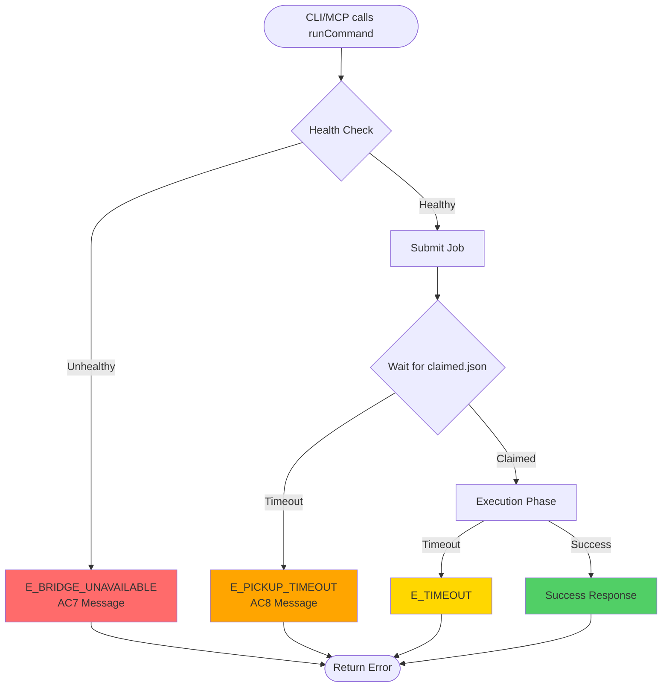
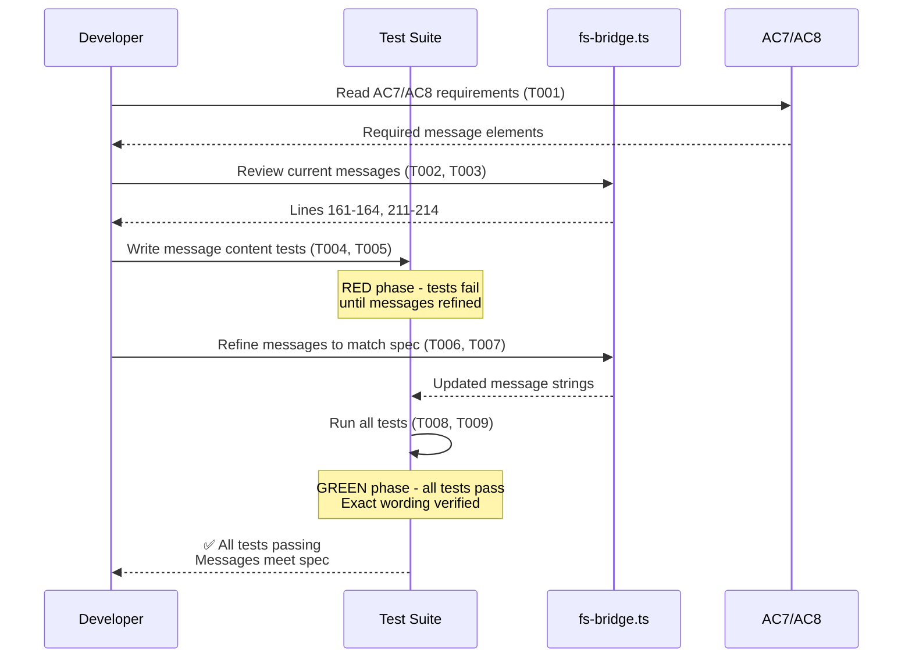

# Phase 6: Error Message Enhancement - Tasks & Alignment Brief

**Phase**: Phase 6: Error Message Enhancement
**Phase Slug**: `phase-6-error-message-enhancement`
**Plan**: [Fast-Fail CLI Job Submission Implementation Plan](../../fast-fail-job-submission-plan.md)
**Spec**: [Fast-Fail CLI Job Submission Spec](../../fast-fail-job-submission-spec.md)
**Created**: 2025-01-19
**Status**: NOT STARTED

---

## Tasks

| Status | ID | Task | Type | Dependencies | Absolute Path(s) | Validation | Notes |
|--------|----|----|------|--------------|------------------|------------|-------|
| [ ] | T001 | Read spec AC7 and AC8 to understand exact message requirements | Setup | – | /workspaces/vsc-bridge-devcontainer/docs/plans/15-fast-fail-job-submission/fast-fail-job-submission-spec.md | AC7 and AC8 requirements documented and understood | Start here to understand exact wording requirements |
| [ ] | T002 | Review current E_BRIDGE_UNAVAILABLE message implementation in runCommand | Setup | T001 | /workspaces/vsc-bridge-devcontainer/packages/cli/src/lib/fs-bridge.ts | Current message at lines 161-164 reviewed; compare against AC7 checklist | Serial (shared file) |
| [ ] | T003 | Review current E_PICKUP_TIMEOUT message implementation in runCommand | Setup | T001 | /workspaces/vsc-bridge-devcontainer/packages/cli/src/lib/fs-bridge.ts | Current message at lines 211-214 reviewed; compare against AC8 checklist | Serial (shared file) |
| [ ] | T004 | Write test verifying E_BRIDGE_UNAVAILABLE message contains all AC7 required elements | Test | T002 | /workspaces/vsc-bridge-devcontainer/packages/cli/test/lib/fs-bridge.test.ts | Test FAILS initially (TDD RED phase); verifies: "Bridge is unavailable", "not running, crashed, or not installed", diagnostic detail, installation guidance, "[TBD]" | [P] eligible (different file); RED phase - test should fail until message refined |
| [ ] | T005 | Write test verifying E_PICKUP_TIMEOUT message contains all AC8 required elements | Test | T003 | /workspaces/vsc-bridge-devcontainer/packages/cli/test/lib/fs-bridge.test.ts | Test FAILS initially (TDD RED phase); verifies: "did not pick up job within 5 seconds", "overloaded, at capacity, crashed, or not installed", restart guidance, capacity guidance, installation guidance, "[TBD]" | [P] eligible (different file); RED phase - test should fail until message refined |
| [ ] | T006 | Refine E_BRIDGE_UNAVAILABLE error message to exactly match AC7 specification | Core | T004 | /workspaces/vsc-bridge-devcontainer/packages/cli/src/lib/fs-bridge.ts | Message at lines 161-164 updated; all AC7 elements present in exact wording | Serial (shared file); GREEN phase - make T004 test pass |
| [ ] | T007 | Refine E_PICKUP_TIMEOUT error message to exactly match AC8 specification | Core | T005 | /workspaces/vsc-bridge-devcontainer/packages/cli/src/lib/fs-bridge.ts | Message at lines 211-214 updated; all AC8 elements present with correct wording ("might be" not "may be") | Serial (shared file); GREEN phase - make T005 test pass |
| [ ] | T008 | Verify all existing fs-bridge tests still pass (backward compatibility) | Integration | T006, T007 | /workspaces/vsc-bridge-devcontainer/packages/cli/test/lib/fs-bridge.test.ts | All existing tests pass; no regressions introduced | Serial (validation step) |
| [ ] | T009 | Run new message content tests and verify GREEN phase completion | Integration | T006, T007, T008 | /workspaces/vsc-bridge-devcontainer/packages/cli/test/lib/fs-bridge.test.ts | Tests T004 and T005 now PASS; exact message content verified | Final validation - both tests green |

---

## Alignment Brief

### Objective

**Primary Goal**: Verify and refine error messages for `E_BRIDGE_UNAVAILABLE` and `E_PICKUP_TIMEOUT` to exactly match specification requirements (AC7 and AC8), ensuring developers receive clear, actionable guidance when bridge errors occur.

**Context**: Error messages were already implemented in Phases 2 (health check) and 3 (pickup acknowledgment) but need verification and potential refinement to ensure they meet ALL specification requirements with exact wording.

**Behavior Checklist** (maps to plan acceptance criteria):
- ✅ E_BRIDGE_UNAVAILABLE message includes all required elements from AC7
- ✅ E_PICKUP_TIMEOUT message includes all required elements from AC8
- ✅ Both messages include "[TBD]" placeholder for installation instructions
- ✅ Messages are concise and actionable
- ✅ All existing tests still pass (no regressions)

---

### Non-Goals (Scope Boundaries)

**Explicitly NOT doing in Phase 6:**

❌ **NOT implementing error detection logic** - Error codes `E_BRIDGE_UNAVAILABLE` and `E_PICKUP_TIMEOUT` are already returned by Phases 2 and 3; this phase ONLY refines message text

❌ **NOT replacing [TBD] with real installation instructions** - Per spec clarification Q4 and Critical Insight 5, "[TBD]" placeholder is intentional and will be addressed separately

❌ **NOT adding new error codes** - Only working with the two error codes introduced in earlier phases

❌ **NOT changing error envelope structure** - Using existing `makeErrorEnvelope()` pattern unchanged (Critical Discovery 05)

❌ **NOT adding metrics or logging** - Error messages only; verbose logging already handled in Phase 5

❌ **NOT handling MCP-specific error translation** - Per Critical Insight 1, MCP clients receive same error messages; no translation layer (Option B was chosen)

❌ **NOT adding user configuration for error messages** - Messages are hardcoded per KISS principle

---

### Critical Findings Affecting This Phase

**From Plan § 3 - Critical Research Findings:**

1. **Critical Discovery 02: MCP Server and CLI Share runCommand**
   - **Constraint**: Any message changes apply to BOTH CLI and MCP server automatically
   - **Impact**: Cannot have CLI-specific vs MCP-specific error wording
   - **Tasks Affected**: T006, T007 - Messages must work in both contexts
   - **Validation**: Ensure messages don't assume CLI context (e.g., avoid "command line" references)

2. **Critical Discovery 05: Error Envelope Format**
   - **Constraint**: Must use existing `makeErrorEnvelope(code, message)` pattern
   - **Impact**: Cannot change error structure, only message string content
   - **Tasks Affected**: T006, T007 - Only modify the message parameter, not envelope structure
   - **Validation**: T008 verifies backward compatibility with existing error handling

3. **Critical Insight 1: MCP Error Code Compatibility Gap** (from plan § 9)
   - **Decision**: Option B chosen - Document new error codes in MCP tool schemas (no translation layer)
   - **Impact**: Messages must be descriptive enough to be helpful without client-side handling
   - **Tasks Affected**: T006, T007 - Messages are the primary user-facing diagnostic
   - **Validation**: Messages should be self-contained and actionable

---

### Invariants & Guardrails

**Message Content Invariants:**
- All messages MUST include "[TBD]" placeholder for installation instructions (spec requirement)
- Messages MUST be concise (single sentence or bullet points)
- Messages MUST be actionable (tell user what to check/do next)
- Messages MUST include diagnostic details where available (e.g., host.json age)

**Backward Compatibility:**
- Error envelope format unchanged (per Discovery 05)
- Existing error handling code continues to work
- No breaking changes to error structure or field names

**Performance:**
- No performance impact (string refinement only)
- No additional filesystem operations
- No new dependencies

---

### Inputs to Read

**Required Reading** (in order):

1. **Spec AC7 and AC8**: `/workspaces/vsc-bridge-devcontainer/docs/plans/15-fast-fail-job-submission/fast-fail-job-submission-spec.md`
   - Lines 93-100: AC7 (E_BRIDGE_UNAVAILABLE message requirements)
   - Lines 102-108: AC8 (E_PICKUP_TIMEOUT message requirements)

2. **Current Implementation**: `/workspaces/vsc-bridge-devcontainer/packages/cli/src/lib/fs-bridge.ts`
   - Lines 161-164: Current E_BRIDGE_UNAVAILABLE message
   - Lines 211-214: Current E_PICKUP_TIMEOUT message
   - Line 124: `makeErrorEnvelope()` helper function

3. **Existing Tests**: `/workspaces/vsc-bridge-devcontainer/packages/cli/test/lib/fs-bridge.test.ts`
   - Review existing error message tests to understand test patterns
   - Identify where to add new message content verification tests

---

### Visual Alignment Aids

#### System State Flow: Error Message Handling



**Key States for Phase 6:**
- **Red boxes** indicate error states with messages being refined
- E_BRIDGE_UNAVAILABLE: Returned before job submission (Phase 2 logic)
- E_PICKUP_TIMEOUT: Returned after pickup timeout expires (Phase 3 logic)
- Phase 6 ONLY refines the message text, not when/where errors are returned

---

#### Interaction Sequence: Message Verification Flow



**Key Interactions:**
1. **Setup Phase** (T001-T003): Understand requirements and review current state
2. **RED Phase** (T004-T005): Write failing tests that verify exact message content
3. **GREEN Phase** (T006-T007): Refine messages until tests pass
4. **Validation** (T008-T009): Ensure no regressions and verify completion

---

### Test Plan

**Testing Approach**: TDD (Test-Driven Development) with exact message content verification

**Rationale**:
- Error messages are critical user-facing content - exact wording matters
- TDD ensures we verify BEFORE refining (RED-GREEN cycle)
- Tests serve as regression protection against future message changes
- Lightweight tests (no mocks needed for string validation)

**Test Strategy**:

1. **Message Content Tests** (T004, T005):
   - Test that error messages contain ALL required elements from AC7/AC8
   - Use exact substring matching for critical phrases
   - Verify "[TBD]" placeholder presence
   - Test should FAIL initially (RED phase) until messages refined

2. **Backward Compatibility Tests** (T008):
   - Run all existing fs-bridge tests
   - Verify error envelope structure unchanged
   - Ensure error codes still correct
   - Validate existing error handling logic still works

**Test Fixtures**:
- Use existing test infrastructure from fs-bridge.test.ts
- No new fixtures needed (testing message strings only)
- Reuse existing bridge setup/teardown logic

---

#### Named Tests with Expected Outputs

**Test 1: E_BRIDGE_UNAVAILABLE Message Content (T004)**
```typescript
describe('Error Message Enhancement - Phase 6', () => {
  describe('E_BRIDGE_UNAVAILABLE Message (AC7)', () => {
    it('should include all AC7 required elements when bridge unavailable', async () => {
      // Setup: Remove host.json to trigger E_BRIDGE_UNAVAILABLE
      const hostPath = path.join(bridgeRoot, 'host.json');
      await fs.unlink(hostPath).catch(() => {});

      // Execute
      const result = await runCommand(bridgeRoot, testPayload);

      // Verify error code
      expect(result.ok).toBe(false);
      expect(result.error.code).toBe('E_BRIDGE_UNAVAILABLE');

      // Verify AC7 message elements (all required)
      const message = result.error.message;

      // 1. Clear description
      expect(message).toContain('Bridge is unavailable');

      // 2. Reason
      expect(message).toContain('not running, crashed, or not installed');
      // OR: expect(message).toMatch(/not running.*crashed.*not installed/i);

      // 3. Diagnostic detail
      expect(message).toMatch(/host\.json (not found|age: \d+s)/);

      // 4. Actionable guidance
      expect(message).toContain('Check that VS Code is open');
      expect(message).toContain('vsc-bridge extension');

      // 5. Installation instructions placeholder
      expect(message).toContain('[TBD]');
    });

    it('should include stale age in diagnostic when host.json exists but stale', async () => {
      // Setup: Create stale host.json (60s old)
      const hostPath = path.join(bridgeRoot, 'host.json');
      const pastTime = new Date(Date.now() - 60000);
      await fs.writeFile(hostPath, '{}');
      await fs.utimes(hostPath, pastTime, pastTime);

      // Execute
      const result = await runCommand(bridgeRoot, testPayload);

      // Verify diagnostic includes age
      expect(result.error.message).toMatch(/host\.json age: \d+s \(stale\)/);
    });
  });
});
```

**Expected Output**:
- Test FAILS initially (RED phase) if current message missing any AC7 elements
- Test PASSES after T006 refinement (GREEN phase)

---

**Test 2: E_PICKUP_TIMEOUT Message Content (T005)**
```typescript
describe('E_PICKUP_TIMEOUT Message (AC8)', () => {
  it('should include all AC8 required elements when pickup times out', async () => {
    // Setup: Ensure host.json fresh (pass health check)
    const hostPath = path.join(bridgeRoot, 'host.json');
    await fs.writeFile(hostPath, JSON.stringify({ pid: process.pid }));

    // Bridge never writes claimed.json (simulating overload/capacity)
    // Just let pickup timeout naturally

    // Execute with short timeout for faster test
    const result = await runCommand(bridgeRoot, testPayload, { timeout: 6000 });

    // Verify error code
    expect(result.ok).toBe(false);
    expect(result.error.code).toBe('E_PICKUP_TIMEOUT');

    // Verify AC8 message elements (all required)
    const message = result.error.message;

    // 1. Clear description
    expect(message).toContain('did not pick up job within 5 seconds');

    // 2. Possible reasons (NOTE: spec says "might be" not "may be")
    expect(message).toContain('might be overloaded');
    expect(message).toContain('at capacity');
    expect(message).toContain('crashed');
    expect(message).toContain('not installed');

    // 3. Restart guidance
    expect(message).toContain('restarting VS Code');

    // 4. Capacity guidance
    expect(message).toContain('capacity settings');
    expect(message).toContain('MAX_CONCURRENT');

    // 5. Installation guidance
    expect(message).toContain('Check that VS Code is running');
    expect(message).toContain('vsc-bridge extension');

    // 6. Installation instructions placeholder
    expect(message).toContain('[TBD]');
  });
});
```

**Expected Output**:
- Test FAILS initially (RED phase) if current message uses "may be" instead of "might be"
- Test PASSES after T007 refinement (GREEN phase)

---

**Test 3: Backward Compatibility (T008)**
```typescript
describe('Backward Compatibility - Phase 6', () => {
  it('should preserve error envelope structure', async () => {
    await fs.unlink(path.join(bridgeRoot, 'host.json')).catch(() => {});

    const result = await runCommand(bridgeRoot, testPayload);

    // Verify envelope structure unchanged
    expect(result).toHaveProperty('ok');
    expect(result).toHaveProperty('type');
    expect(result).toHaveProperty('error');
    expect(result).toHaveProperty('meta');

    // Verify error structure
    expect(result.error).toHaveProperty('code');
    expect(result.error).toHaveProperty('message');

    // Verify meta structure
    expect(result.meta).toHaveProperty('timestamp');
  });

  it('should not break existing error handling code', async () => {
    // Test that error responses can still be consumed by existing handlers
    const result = await runCommand(bridgeRoot, testPayload, { timeout: 1000 });

    // Existing code checks result.ok === false
    expect(result.ok).toBe(false);

    // Existing code reads result.error.code
    expect(typeof result.error.code).toBe('string');

    // Existing code reads result.error.message
    expect(typeof result.error.message).toBe('string');
  });
});
```

**Expected Output**: All tests PASS (no regressions)

---

### Step-by-Step Implementation Outline

**Mapped 1:1 to tasks:**

**Phase 1: Setup and Understanding** (Tasks T001-T003)
1. **T001**: Open spec file, read AC7 (lines 93-100) and AC8 (lines 102-108)
   - Document checklist: What elements must each message contain?
   - Note exact wording requirements (e.g., "might be" vs "may be")

2. **T002**: Open fs-bridge.ts, locate E_BRIDGE_UNAVAILABLE message (lines 161-164)
   - Compare current message against AC7 checklist
   - Identify missing or incorrectly worded elements

3. **T003**: Open fs-bridge.ts, locate E_PICKUP_TIMEOUT message (lines 211-214)
   - Compare current message against AC8 checklist
   - Identify missing or incorrectly worded elements (e.g., "may be" vs "might be")

**Phase 2: RED - Write Failing Tests** (Tasks T004-T005)
4. **T004**: Write E_BRIDGE_UNAVAILABLE message test in fs-bridge.test.ts
   - Use exact substring matching for critical phrases from AC7
   - Test should FAIL if current message doesn't match spec exactly
   - Run test, verify RED (failure)

5. **T005**: Write E_PICKUP_TIMEOUT message test in fs-bridge.test.ts
   - Use exact substring matching for critical phrases from AC8
   - Test should FAIL if current message doesn't match spec exactly
   - Run test, verify RED (failure)

**Phase 3: GREEN - Refine Messages** (Tasks T006-T007)
6. **T006**: Update E_BRIDGE_UNAVAILABLE message (fs-bridge.ts lines 161-164)
   - Adjust wording to exactly match AC7 requirements
   - Ensure all elements present in correct order
   - Run T004 test, verify GREEN (passing)

7. **T007**: Update E_PICKUP_TIMEOUT message (fs-bridge.ts lines 211-214)
   - Adjust wording to exactly match AC8 requirements (e.g., "might be" not "may be")
   - Ensure all elements present with proper guidance
   - Run T005 test, verify GREEN (passing)

**Phase 4: Validation** (Tasks T008-T009)
8. **T008**: Run full fs-bridge test suite
   - Command: `npx vitest run test/lib/fs-bridge.test.ts`
   - Verify all existing tests still pass (no regressions)

9. **T009**: Verify new tests passing and phase complete
   - Run specific message tests: `npx vitest run test/lib/fs-bridge.test.ts -t "Error Message Enhancement"`
   - Confirm both T004 and T005 tests GREEN
   - Confirm T008 backward compatibility tests GREEN
   - Phase 6 complete ✅

---

### Commands to Run

**Development Environment Setup:**
```bash
# No setup needed - using existing test infrastructure
cd /workspaces/vsc-bridge-devcontainer
```

**Test Runner Commands:**
```bash
# Run all fs-bridge tests (T008)
npx vitest run packages/cli/test/lib/fs-bridge.test.ts

# Run only Phase 6 message tests (T009)
npx vitest run packages/cli/test/lib/fs-bridge.test.ts -t "Error Message Enhancement"

# Run specific test by name
npx vitest run packages/cli/test/lib/fs-bridge.test.ts -t "E_BRIDGE_UNAVAILABLE"
npx vitest run packages/cli/test/lib/fs-bridge.test.ts -t "E_PICKUP_TIMEOUT"

# Watch mode for TDD workflow (RED-GREEN cycle)
npx vitest watch packages/cli/test/lib/fs-bridge.test.ts -t "Error Message Enhancement"
```

**Build and Type Checking:**
```bash
# TypeScript compilation (verify no errors)
npx tsc --noEmit -p packages/cli/tsconfig.json

# Or use project build command
just build
```

**Verification Commands:**
```bash
# Check git diff to see message changes
git diff packages/cli/src/lib/fs-bridge.ts

# Verify message content directly in file
grep -A 3 "E_BRIDGE_UNAVAILABLE" packages/cli/src/lib/fs-bridge.ts
grep -A 3 "E_PICKUP_TIMEOUT" packages/cli/src/lib/fs-bridge.ts
```

---

### Risks & Unknowns

| Risk | Severity | Likelihood | Mitigation |
|------|----------|------------|------------|
| **Current messages already match spec** | Low | Medium | If T004/T005 pass immediately (GREEN), phase is already done - skip T006/T007, proceed to validation |
| **Spec wording ambiguous** | Low | Low | AC7/AC8 are explicit and detailed - if ambiguous, ask user for clarification before changing message |
| **Message changes break existing code** | Medium | Low | T008 backward compatibility test catches this - error envelope structure unchanged per Discovery 05 |
| **Tests are flaky due to timing** | Low | Low | Message tests are pure string validation - no timing dependencies |
| **[TBD] placeholder needs replacement** | Low | High | EXPECTED - per spec Q4 and Critical Insight 5, [TBD] is intentional; document in execution log if user asks |

---

### Ready Check

**Pre-Implementation Checklist** (must complete before starting tasks):

- [ ] **Understanding**: I have read the spec AC7 and AC8 requirements and understand exact wording needs
- [ ] **Context**: I have reviewed the plan Critical Discoveries affecting this phase (02, 05, Insight 1)
- [ ] **Non-Goals**: I understand this phase ONLY refines message text, not error detection logic
- [ ] **TDD Approach**: I understand the RED-GREEN-REFACTOR cycle (write failing tests first)
- [ ] **Backward Compatibility**: I understand error envelope format cannot change (Discovery 05)
- [ ] **MCP Impact**: I understand message changes apply to both CLI and MCP (Discovery 02)

**Implementation Pre-Flight** (verify before each task):

- [ ] **T001-T003 (Setup)**: I have the spec and fs-bridge.ts open side-by-side for comparison
- [ ] **T004-T005 (Tests)**: I am ready to write tests that FAIL initially (RED phase)
- [ ] **T006-T007 (Refinement)**: I have failing tests to guide message refinement (GREEN phase)
- [ ] **T008-T009 (Validation)**: I am ready to run full test suite and verify no regressions

**Ready to Proceed?**

- [ ] All checkboxes above are ✅
- [ ] User has confirmed GO/NO-GO for Phase 6 implementation

---

## Phase Footnote Stubs

**NOTE**: Footnotes populated post-implementation with substrate node IDs (flowspace format) for all code changes.

### Phase 6: Error Message Enhancement

[^6.1]: Refined [function:packages/cli/src/lib/fs-bridge.ts:runCommand](../../packages/cli/src/lib/fs-bridge.ts#L213) E_PICKUP_TIMEOUT message to use "might be overloaded" (spec AC8 requirement) instead of "may be overloaded"

[^6.2]: Added Phase 6 message content verification tests in [test:packages/cli/test/lib/fs-bridge.test.ts](../../packages/cli/test/lib/fs-bridge.test.ts#L1394-L1596) including AC7 compliance (E_BRIDGE_UNAVAILABLE), AC8 compliance (E_PICKUP_TIMEOUT), and backward compatibility checks

**Footnotes synchronized to two locations**:
1. Main plan footnote ledger: `docs/plans/15-fast-fail-job-submission/fast-fail-job-submission-plan.md` (§ Change Footnotes Ledger)
2. Task table Notes column: This file (tasks table above)

---

## Evidence Artifacts

**Execution Log**: `/workspaces/vsc-bridge-devcontainer/docs/plans/15-fast-fail-job-submission/tasks/phase-6-error-message-enhancement/execution.log.md`

**Content**: Created during `/plan-6-implement-phase` execution with:
- Detailed implementation narrative
- Test results (RED → GREEN transitions)
- Message comparison tables (before/after)
- Acceptance criteria verification
- Substrate node IDs (flowspace format)
- Links back to this tasks.md dossier

**Additional Evidence**:
- Git diff showing message changes: `git diff packages/cli/src/lib/fs-bridge.ts`
- Test output showing GREEN phase: Test run logs embedded in execution.log.md
- TypeScript compilation success: Build output in execution.log.md

---

## Directory Layout

```
docs/plans/15-fast-fail-job-submission/
├── fast-fail-job-submission-plan.md       # Main plan document
├── fast-fail-job-submission-spec.md       # Feature specification
└── tasks/
    └── phase-6-error-message-enhancement/
        ├── tasks.md                        # This file (tasks + alignment brief)
        └── execution.log.md                # Created by /plan-6 (implementation log)
```

**File Ownership**:
- `tasks.md` (this file): Created by `/plan-5-phase-tasks-and-brief`, READ-ONLY during implementation
- `execution.log.md`: Created and updated by `/plan-6-implement-phase`

---

**End of Phase 6 Tasks & Alignment Brief**

**STOP**: Do NOT edit code. This dossier defines the implementation contract. Await user **GO** signal to proceed with `/plan-6-implement-phase`.
