# Phase 2: Package Configuration & Build Pipeline - Tasks & Alignment Brief

**Phase**: Phase 2 of 4
**Created**: 2025-10-19
**Spec**: [../../16-npx-github-installation-spec.md](../../16-npx-github-installation-spec.md)
**Plan**: [../../npx-github-installation-plan.md](../../npx-github-installation-plan.md)
**Testing Approach**: Lightweight (core validation, avoid mocks entirely)

---

## Tasks

| Status | ID | Task | Type | Dependencies | Absolute Path(s) | Validation | Notes |
|--------|----|----|------|--------------|------------------|------------|-------|
| [x] | T001 | Rename src-cli/ to src/ with git history | Core | – | `/workspaces/vsc-bridge-devcontainer/src-cli/` → `/workspaces/vsc-bridge-devcontainer/src/` | `ls -la src/` shows CLI source files, `git log --follow src/index.ts` shows full history | Maps plan task 2.1; [log#t001](./execution.log.md#t001-rename-src-cli-to-src-with-git-history) [^10] |
| [~] | T002a | Update .vscode/launch.json workspace folder-uri | Core | – | `/workspaces/vsc-bridge-devcontainer/.vscode/launch.json` (line 14) | `--folder-uri=${workspaceFolder}/test-workspace` | DEFERRED: Not blocking build pipeline; see [log#phase-2-summary](./execution.log.md#phase-2-status-complete-with-t002a-t002s-deferred) |
| [~] | T002b | Update .vscode/launch.json Jest debug config | Core | – | `/workspaces/vsc-bridge-devcontainer/.vscode/launch.json` (lines 35, 44, 49) | Jest program/cwd paths reference test-workspace/ | DEFERRED: Part of workspace rename (T002a-s) |
| [~] | T002c | Update justfile test-bp-setup command | Core | – | `/workspaces/vsc-bridge-devcontainer/justfile` (lines 502-503) | Breakpoint paths reference test-workspace/python/sample.py | DEFERRED: Part of workspace rename (T002a-s) |
| [~] | T002d | Update justfile dynamic script commands (13 commands) | Core | – | `/workspaces/vsc-bridge-devcontainer/justfile` (lines 541-577) | All `cd test` → `cd test-workspace` in dynamic/sample commands | DEFERRED: Part of workspace rename (T002a-s) |
| [~] | T002e | Update CLAUDE.md AI instructions (12+ locations) | Core | – | `/workspaces/vsc-bridge-devcontainer/CLAUDE.md` (lines 186, 191, 199, 204, 209, 255, 269, 272, 278, 282, 289, 296) | All test/ workspace references → test-workspace/ | DEFERRED: Part of workspace rename (T002a-s) |
| [~] | T002f | Update integration test workflow file paths | Core | – | `/workspaces/vsc-bridge-devcontainer/test/integration/workflows/*.ts` (4 files) | test/integration-simple/ → test-workspace/integration-simple/ | DEFERRED: Part of workspace rename (T002a-s) |
| [~] | T002g | Update cross-language integration test constants | Core | – | `/workspaces/vsc-bridge-devcontainer/test/integration/cross-language-debug.test.ts` (lines 60-64) | TEST_FILES paths → test-workspace/integration-simple/ | DEFERRED: Part of workspace rename (T002a-s) |
| [~] | T002h | Update CLI MCP integration test paths | Core | – | `/workspaces/vsc-bridge-devcontainer/test-cli/integration-mcp/stdio-e2e.test.ts` (line 319) | TEST_FILE path → test-workspace/python/test_example.py | DEFERRED: Part of workspace rename (T002a-s) |
| [~] | T002i | Update test utility JSDoc examples | Doc | – | `/workspaces/vsc-bridge-devcontainer/test/test-utils/breakpoint-finder.ts` (lines 15, 51), `/workspaces/vsc-bridge-devcontainer/test/integration/runners/DebugRunner.ts` (line 40) | Example paths → test-workspace/ | DEFERRED: Part of workspace rename (T002a-s) |
| [~] | T002j | Update manual test documentation | Doc | – | `/workspaces/vsc-bridge-devcontainer/docs/manual-test/debug-single.md` (13 locations) | All test/ paths → test-workspace/ | DEFERRED: Part of workspace rename (T002a-s) |
| [~] | T002k | Update simple debug flow tutorial | Doc | – | `/workspaces/vsc-bridge-devcontainer/docs/how/simple-debug-flow.md` (40+ locations) | All test/ references → test-workspace/ | DEFERRED: Part of workspace rename (T002a-s) |
| [~] | T002l | Update dogfooding documentation | Doc | – | `/workspaces/vsc-bridge-devcontainer/docs/how/dogfood/dogfooding-vsc-bridge.md` (9 locations), `/workspaces/vsc-bridge-devcontainer/docs/how/dogfood/development-workflow.md` (3 locations) | test/ → test-workspace/ | DEFERRED: Part of workspace rename (T002a-s) |
| [~] | T002m | Update how-to guides | Doc | – | `/workspaces/vsc-bridge-devcontainer/docs/how/debugging-with-dynamic-scripts.md` (4 locations), `/workspaces/vsc-bridge-devcontainer/docs/how/howto-simple-debug.md` (1 location), `/workspaces/vsc-bridge-devcontainer/docs/how/howto-simple-debug-javascript.md` (1 location) | test/ → test-workspace/ | DEFERRED: Part of workspace rename (T002a-s) |
| [~] | T002n | Update workspace README files | Doc | – | `/workspaces/vsc-bridge-devcontainer/test/python/README.md` (1 location), `/workspaces/vsc-bridge-devcontainer/test/java/README.md` (4 locations), `/workspaces/vsc-bridge-devcontainer/test/javascript/AUTH_TUTORIAL_README.md` (100+ locations) | test/ → test-workspace/ | DEFERRED: Part of workspace rename (T002a-s) |
| [~] | T002o | Update MCP server examples and docs | Doc | – | `/workspaces/vsc-bridge-devcontainer/mcp-server/EXAMPLES.md` (6 locations), `/workspaces/vsc-bridge-devcontainer/mcp-server/README.md` (4 locations), `/workspaces/vsc-bridge-devcontainer/mcp-server/test-endpoints.js` (1 location), `/workspaces/vsc-bridge-devcontainer/mcp-server/example-launch.json` (6 locations) | test/ → test-workspace/ | DEFERRED: Part of workspace rename (T002a-s) |
| [~] | T002p | Update AI context memory files | Doc | – | `/workspaces/vsc-bridge-devcontainer/.serena/memories/project_overview.md` (2 locations) | cd test/ → cd test-workspace/ | DEFERRED: Part of workspace rename (T002a-s) |
| [~] | T002q | Execute git mv test test-workspace | Core | T002a-T002p | `/workspaces/vsc-bridge-devcontainer/test/` → `/workspaces/vsc-bridge-devcontainer/test-workspace/` | git status shows rename (not delete+add), test-workspace/ exists | DEFERRED: Part of workspace rename (T002a-s) |
| [~] | T002r | Rename test-cli/ to test/ with git history | Core | T002q | `/workspaces/vsc-bridge-devcontainer/test-cli/` → `/workspaces/vsc-bridge-devcontainer/test/` | git status shows rename, test/ contains CLI test code | DEFERRED: Part of workspace rename (T002a-s) |
| [~] | T002s | Verify workspace rename validation checklist | Test | T002r | Multiple paths | F5 launch works, just sample-* commands work, integration tests pass | DEFERRED: Part of workspace rename (T002a-s) |
| [x] | T003 | Rename tsconfig-cli.json to tsconfig.json | Core | T001 | `/workspaces/vsc-bridge-devcontainer/tsconfig-cli.json` → `/workspaces/vsc-bridge-devcontainer/tsconfig.json` | File renamed, paths point to src/ (not src-cli/) | Maps plan task 2.2; [log#t003](./execution.log.md#t003-rename-tsconfig-clijson-to-tsconfigjson) [^11] |
| [x] | T004 | Update tsconfig.json paths after rename | Core | T003 | `/workspaces/vsc-bridge-devcontainer/tsconfig.json` (lines 8, 21) | `tsc --listFiles` shows src/ files loaded | [log#t004](./execution.log.md#t004-update-tsconfigjson-paths-after-rename) [^11] |
| [x] | T005 | Read package-cli.json to extract CLI configuration | Setup | – | `/workspaces/vsc-bridge-devcontainer/package-cli.json` | CLI dependencies, scripts, bin field documented | [log#summary](./execution.log.md#summary-t005-t025-package-configuration--contributor-workflows) [^12] |
| [x] | T006 | Update root package.json: set private: false | Core | T005 | `/workspaces/vsc-bridge-devcontainer/package.json` (line 5) | `"private": false` in root package.json | [log#summary](./execution.log.md#summary-t005-t025-package-configuration--contributor-workflows) [^12] |
| [x] | T007 | Update root package.json: add bin field | Core | T005 | `/workspaces/vsc-bridge-devcontainer/package.json` | `"bin": { "vscb": "./dist/index.js" }` present | [log#summary](./execution.log.md#summary-t005-t025-package-configuration--contributor-workflows) [^12] |
| [x] | T008 | Update root package.json: merge runtime dependencies | Core | T005 | `/workspaces/vsc-bridge-devcontainer/package.json` (dependencies section) | ALL dependencies from package-cli.json merged (10 total): @modelcontextprotocol/sdk ^1.20.0 (CRITICAL for MCP), @inkjs/ui, @oclif/core, chalk, fs-extra, ink, ink-select-input, ink-spinner, ink-text-input, react, zod | [log#summary](./execution.log.md#summary-t005-t025-package-configuration--contributor-workflows) [^12] |
| [x] | T009 | Update root package.json: merge build devDependencies | Core | T005 | `/workspaces/vsc-bridge-devcontainer/package.json` (devDependencies section) | typescript, tsx, shx, js-yaml, oclif in devDependencies | [log#summary](./execution.log.md#summary-t005-t025-package-configuration--contributor-workflows) [^12] |
| [x] | T010 | Update root package.json: add files field | Core | T005 | `/workspaces/vsc-bridge-devcontainer/package.json` | `"files": ["/dist", "/oclif.manifest.json"]` present | [log#summary](./execution.log.md#summary-t005-t025-package-configuration--contributor-workflows) [^12] |
| [x] | T011 | Update root package.json: add type: "module" | Core | T005 | `/workspaces/vsc-bridge-devcontainer/package.json` | `"type": "module"` present | [log#summary](./execution.log.md#summary-t005-t025-package-configuration--contributor-workflows) [^12] |
| [x] | T012 | Create ci/scripts/ directory | Setup | – | `/workspaces/vsc-bridge-devcontainer/ci/scripts/` | Directory exists | [log#summary](./execution.log.md#summary-t005-t025-package-configuration--contributor-workflows) [^13] |
| [x] | T013 | Create ci/scripts/prepare-cli.ts orchestration script | Core | T012 | `/workspaces/vsc-bridge-devcontainer/ci/scripts/prepare-cli.ts` | File created with template content (557 lines from plan) | [log#summary](./execution.log.md#summary-t005-t025-package-configuration--contributor-workflows) [^13] |
| [x] | T014 | Make prepare-cli.ts executable | Setup | T013 | `/workspaces/vsc-bridge-devcontainer/ci/scripts/prepare-cli.ts` | `chmod +x`, shebang `#!/usr/bin/env tsx` | [log#summary](./execution.log.md#summary-t005-t025-package-configuration--contributor-workflows) [^13] |
| [x] | T015 | Update root package.json: add build:manifest script | Core | T005 | `/workspaces/vsc-bridge-devcontainer/package.json` (scripts section) | `"build:manifest": "tsx scripts/build-manifest.ts"` | [log#summary](./execution.log.md#summary-t005-t025-package-configuration--contributor-workflows) [^12][^14] |
| [x] | T016 | Update root package.json: add copy-manifest script | Core | T005 | `/workspaces/vsc-bridge-devcontainer/package.json` (scripts section) | `"copy-manifest": "shx cp packages/extension/src/vsc-scripts/manifest.json dist/manifest.json"` | [log#summary](./execution.log.md#summary-t005-t025-package-configuration--contributor-workflows) [^12] |
| [x] | T017 | Update root package.json: add build:cli script | Core | T005, T016 | `/workspaces/vsc-bridge-devcontainer/package.json` (scripts section) | `"build:cli": "tsc -p tsconfig.json && npm run copy-manifest"` | [log#summary](./execution.log.md#summary-t005-t025-package-configuration--contributor-workflows) [^12] |
| [x] | T018 | Update root package.json: add prepare script | Core | T013, T017 | `/workspaces/vsc-bridge-devcontainer/package.json` (scripts section) | `"prepare": "tsx ci/scripts/prepare-cli.ts"` | [log#summary](./execution.log.md#summary-t005-t025-package-configuration--contributor-workflows) [^12] |
| [x] | T019 | Update root package.json: add dev script | Core | T005 | `/workspaces/vsc-bridge-devcontainer/package.json` (scripts section) | `"dev": "tsx src/index.ts"` | [log#summary](./execution.log.md#summary-t005-t025-package-configuration--contributor-workflows) [^12] |
| [x] | T020 | Update root package.json: update existing build script | Core | T015, T017 | `/workspaces/vsc-bridge-devcontainer/package.json` (line 21) | `"build": "npm run build:manifest && npm run build:extension && npm run build:mcp && npm run build:cli && npm run build:shared-test"` | [log#summary](./execution.log.md#summary-t005-t025-package-configuration--contributor-workflows) [^12] |
| [x] | T021 | Remove package-cli.json after merge | Cleanup | T006, T007, T008, T009, T010, T011, T015, T016, T017, T018, T019 | `/workspaces/vsc-bridge-devcontainer/package-cli.json` | File deleted, all configuration migrated | [log#summary](./execution.log.md#summary-t005-t025-package-configuration--contributor-workflows) |
| [x] | T022 | Update justfile: restore build-cli target | Core | T020 | `/workspaces/vsc-bridge-devcontainer/justfile` (lines 42-45) | Points to `npm run build:cli` from root | [log#summary](./execution.log.md#summary-t005-t025-package-configuration--contributor-workflows) [^15] |
| [x] | T023 | Update justfile: restore cli-link target | Core | – | `/workspaces/vsc-bridge-devcontainer/justfile` | Runs `npm link` from root directory | [log#summary](./execution.log.md#summary-t005-t025-package-configuration--contributor-workflows) [^15] |
| [x] | T024 | Update justfile: remove Phase 1 warning header | Cleanup | T022 | `/workspaces/vsc-bridge-devcontainer/justfile` (lines 3-7) | Warning header removed | [log#summary](./execution.log.md#summary-t005-t025-package-configuration--contributor-workflows) [^15] |
| [x] | T025 | Update bridge-direct.ts imports after src-cli→src rename | Core | T001 | `/workspaces/vsc-bridge-devcontainer/test/integration/helpers/bridge-direct.ts` (lines 28, 47) | Imports reference `../../../src/lib/fs-bridge` (not src-cli/) | [log#summary](./execution.log.md#summary-t005-t025-package-configuration--contributor-workflows) [^16] |
| [x] | T026 | Run npm install to populate node_modules | Test | T006-T021 | `/workspaces/vsc-bridge-devcontainer/` | `node_modules/` populated with all dependencies | [log#t026](./execution.log.md#t026-t035-build-pipeline-validation) |
| [x] | T027 | Test build:manifest script execution | Test | T015, T026 | `/workspaces/vsc-bridge-devcontainer/packages/extension/src/vsc-scripts/manifest.json` | Manifest generated successfully (~149KB JSON) | [log#t026](./execution.log.md#t026-t035-build-pipeline-validation) |
| [x] | T028 | Test build:cli script execution | Test | T017, T027 | `/workspaces/vsc-bridge-devcontainer/dist/index.js` | CLI compiled, manifest copied to dist/ | [log#t026](./execution.log.md#t026-t035-build-pipeline-validation) |
| [x] | T029 | Test prepare script end-to-end | Test | T018, T027, T028 | `/workspaces/vsc-bridge-devcontainer/dist/` | `npm run prepare` succeeds, dist/ contains index.js + manifest.json | [log#t026](./execution.log.md#t026-t035-build-pipeline-validation) |
| [x] | T030 | Verify vscb binary is executable | Test | T028 | `/workspaces/vsc-bridge-devcontainer/dist/index.js` | `node dist/index.js --help` displays help text | [log#t030](./execution.log.md#t026-t035-build-pipeline-validation) |
| [x] | T031 | Test just build-cli from workspace | Integration | T022, T029 | `/workspaces/vsc-bridge-devcontainer/justfile` | `just build-cli` succeeds without warnings | [log#justfile-fixes](./execution.log.md#justfile-fixes-validation-code-review-fixes) |
| [x] | T032 | Test npm link workflow | Integration | T023, T030 | Global npm bin directory | `npm link && vscb --help` works | [log#justfile-fixes](./execution.log.md#justfile-fixes-validation-code-review-fixes) |
| [x] | T033 | Verify dist/ contents complete | Test | T029 | `/workspaces/vsc-bridge-devcontainer/dist/` | Contains: index.js, manifest.json, .d.ts files | [log#justfile-fixes](./execution.log.md#justfile-fixes-validation-code-review-fixes) |
| [x] | T034 | Verify package.json files field excludes src/ | Test | T010 | `/workspaces/vsc-bridge-devcontainer/package.json` | Only /dist and /oclif.manifest.json in files array | [log#t026](./execution.log.md#t026-t035-build-pipeline-validation) [^12] |
| [x] | T034.5 | Smoke test MCP command functionality | Test | T030, T008 | `/workspaces/vsc-bridge-devcontainer/dist/index.js` | `node dist/index.js mcp --help` displays help, no module errors | [log#t0345](./execution.log.md#t026-t035-build-pipeline-validation) [^12] |
| [x] | T035 | Run TypeScript type checking | Test | T004, T028 | `/workspaces/vsc-bridge-devcontainer/` | `tsc --noEmit` passes with 0 errors | [log#t035](./execution.log.md#t026-t035-build-pipeline-validation) |
| [ ] | T036 | Commit package configuration changes | Doc | T001-T035 | `/workspaces/vsc-bridge-devcontainer/` | Git commit created: "feat(plan-16): Phase 2 - Package Configuration & Build Pipeline" | PENDING: Awaiting user commit after code review fixes |

---

## Alignment Brief

### Previous Phase Review

**Phase 1 Execution Analysis** (compiled from 4 parallel subagent reviews):

#### A. Completed Deliverables

**Files Moved to Root (198 files total):**
- **Source**: `/workspaces/vsc-bridge-devcontainer/packages/cli/src/` → `/workspaces/vsc-bridge-devcontainer/src-cli/` (147 files)
- **Tests**: `/workspaces/vsc-bridge-devcontainer/packages/cli/test/` → `/workspaces/vsc-bridge-devcontainer/test-cli/` (53 files)
- **Configs**:
  - `package-cli.json` (runtime/build deps, bin config, scripts)
  - `tsconfig-cli.json` (TypeScript compilation config, **paths corrected post-review**)
  - `README-cli.md` (CLI documentation)

**Modified Files:**
- `/workspaces/vsc-bridge-devcontainer/test/integration/helpers/bridge-direct.ts` - Updated 2 import paths + 1 comment
- `/workspaces/vsc-bridge-devcontainer/package.json` - 3 scripts disabled, workspaces array changed to explicit list
- `/workspaces/vsc-bridge-devcontainer/justfile` - build-cli disabled with warning

**Removed:**
- `/workspaces/vsc-bridge-devcontainer/packages/cli/` directory completely deleted

**Git Commit:**
- Branch: `feat/npx-github-installation`
- Commit: `896c7ae4081c26ef99b6ef875c1062fa6f054df9`
- Message: "feat(plan-16): Phase 1 - Repository Restructuring"
- Stats: 46 files changed, 466 insertions(+), 11 deletions(-)

#### B. Lessons Learned

**1. Minimal Import Impact** - Only 1 production file needed import updates (much simpler than anticipated).

**2. Temporary Disabling Pattern** - Replaced broken commands with warning messages instead of erroring (better UX during transition).

**3. False Positive Validation** - Initial TypeScript validation passed but masked TS18003 error. Code review caught tsconfig path mismatch. **Lesson**: Always verify actual compiler success, not just grep for specific errors.

**4. Subagent Effectiveness** - Used parallel subagents for comprehensive pattern search (104 references across 43 files). Much more thorough than manual searching.

#### C. Technical Discoveries

**Git History Preservation**: `git mv` works perfectly - `git log --follow` shows complete pre-move history.

**npm Workspaces Gotchas**: Must use explicit list (can't exclude from glob pattern `packages/*`). Changed to `["packages/extension", "packages/shared-test", "mcp-server"]`.

**TypeScript Path Resolution**: Must update BOTH `rootDir` AND `include` when moving source directories. Compiler says "no inputs found" if paths don't match actual file locations.

**Empty Directory Removal**: Must remove gitignored `dist/`, `node_modules/` before `rmdir`.

#### D. Dependencies for Phase 2

**Available Files:**
- `/workspaces/vsc-bridge-devcontainer/src-cli/` - All TypeScript source code ready for compilation
- `/workspaces/vsc-bridge-devcontainer/test-cli/` - All test files ready for execution
- `/workspaces/vsc-bridge-devcontainer/package-cli.json` - Contains:
  - Runtime dependencies: @oclif/core, ink, react, chalk, zod, etc.
  - Build tools: typescript, tsx, shx, js-yaml, oclif
  - Scripts: build, dev
  - Bin config: `"vscb": "./dist/index.js"`
- `/workspaces/vsc-bridge-devcontainer/tsconfig-cli.json` - TypeScript config (paths fixed)

**Build Infrastructure:**
- `/workspaces/vsc-bridge-devcontainer/scripts/build-manifest.ts` - Existing manifest generator (can be called via `tsx`)

**Import Path Pattern:**
- Current: `from '../../../src-cli/lib/fs-bridge'`
- Phase 2 must update to: `from '../../../src/lib/fs-bridge'` (one segment shorter)

#### E. Critical Findings Applied

**Discovery 01: npm Workspace Sub-Package Limitation** ✅ IMPLEMENTED
- Phase 1 moved CLI from `packages/cli/` to root (198 files via git mv)
- Directory `/workspaces/vsc-bridge-devcontainer/packages/cli/` successfully removed
- Evidence: [execution.log.md:210-369](../phase-1/execution.log.md)

**Discoveries 02-05**: Not in Phase 1 scope - Phase 2 will apply these during build pipeline implementation.

#### F. Blocked/Incomplete Items

**F1. ❌ CRITICAL (RESOLVED)**: tsconfig-cli.json path mismatch
- **Issue**: Referenced `src/` instead of `src-cli/` after file moves
- **Status**: **FIXED** post-code-review (lines 8, 21 corrected)
- **Phase 2 Impact**: Will need updating again when `src-cli/` → `src/`

**F2. ⏸️ Temporarily Disabled Commands** (PHASE 2 SCOPE):
- `justfile` build-cli recipe (line 47) - shows warning instead of building
- 3 `package.json` scripts (lines 24, 38-39): build:cli, cli, cli:init
- **Phase 2 Tasks**: T022 (justfile), T020 (package.json scripts)

**F3. ⏸️ Documentation Updates** (DEFERRED TO PHASE 4):
- 84 markdown files with `packages/cli` references
- 13 shell script references in installation scripts
- **Non-blocking**: Production code is clean

#### G. Test Infrastructure

**No Tests Run in Phase 1** (per Lightweight approach):
- ❌ Did NOT run MCP integration tests (build pipeline not ready)
- ❌ Did NOT run CLI integration tests (build pipeline not ready)
- ❌ Did NOT test `just build` (CLI commands disabled)

**Phase 2 Must Validate:**
- Build pipeline succeeds end-to-end (`npm run prepare`)
- TypeScript compilation completes (`tsc --noEmit`)
- vscb binary is executable (`node dist/index.js --help`)
- justfile contributor workflows restored

#### H. Technical Debt & Workarounds

**H1. `-cli` Suffix Strategy** (PHASE 2 MUST RESOLVE):
- Current: `src-cli/`, `test-cli/`, `tsconfig-cli.json`, `package-cli.json`
- **Phase 2 Tasks**: T001-T003 rename to final names
- **Pattern**: Use `git mv` to preserve history

**H2. Disabled Build Commands** (PHASE 2 MUST RESOLVE):
- **justfile**: T022, T023, T024
- **package.json**: T020 (update build script to include build:cli)
- **Files to fix**:
  - `/workspaces/vsc-bridge-devcontainer/justfile` (lines 3-7 header, 42-45 build-cli)
  - `/workspaces/vsc-bridge-devcontainer/package.json` (line 21 build script, lines 24/38-39 disabled scripts)

**H3. Workspace Configuration** (WORKING AS INTENDED):
- Root package.json no longer includes `packages/cli` in workspaces (Phase 1 line 6-10)
- **Phase 2**: Do NOT re-add - root becomes the CLI package itself

**H4. Import Path Pattern** (PHASE 2 MUST UPDATE):
- `/workspaces/vsc-bridge-devcontainer/test/integration/helpers/bridge-direct.ts` (lines 28, 47)
- Current: `../../../src-cli/lib/fs-bridge`
- **Phase 2 T025**: Update to `../../../src/lib/fs-bridge` after T001 rename

#### I. Scope Changes

**ZERO scope changes** - Phase 1 stayed 100% on track. All planned work completed as specified.

#### J. Key Execution Log References

- **[T002b Reconnaissance](../phase-1/execution.log.md#L69-155)**: Found only 1 TypeScript file needed imports (shaped execution strategy)
- **[T020 Dependency Check](../phase-1/execution.log.md#L325-330)**: Zero cross-package dependencies confirmed (safe to remove from workspaces)
- **[T005-T008 Git History](../phase-1/execution.log.md#L210-274)**: Systematic `git mv` preserved 198 file histories
- **[T022 Final Sweep](../phase-1/execution.log.md#L332-345)**: 5 parallel subagent checks validated production code clean
- **[Code Review Finding F002](../../reviews/review.phase-1.md#L162-182)**: Exposed TypeScript validation gap (grep masked TS18003 error)

---

### Objective

**Transform Phase 1 restructured repository into an npx-installable CLI package** by:
1. Renaming temporary `-cli` suffixes to final names (`src/`, `test/`, `tsconfig.json`)
2. Merging CLI configuration from `package-cli.json` into root `package.json`
3. Creating `ci/scripts/prepare-cli.ts` orchestration script for automated builds
4. Establishing build pipeline: manifest generation → TypeScript compilation → manifest copy
5. Restoring justfile contributor workflows (build-cli, cli-link)

**Behavioral Checklist** (maps to plan acceptance criteria):
- ✅ Build pipeline executes successfully from clean state
- ✅ `npm run prepare` completes without errors
- ✅ `dist/` directory contains compiled JavaScript + manifest.json
- ✅ vscb binary is executable via Node.js
- ✅ Contributor workflows work: `just build-cli && just cli-link`
- ✅ TypeScript compilation succeeds with 0 errors
- ✅ No source code included in `files` field (only /dist)

---

### Non-Goals (Scope Boundaries)

❌ **NOT doing in this phase:**

**End-to-End npx Testing** (defer to Phase 3):
- Not testing actual `npx github:AI-Substrate/vsc-bridge` installation
- Not measuring installation time (30-60s target)
- Not testing npm cache behavior (<5s subsequent runs)
- **Rationale**: Phase 2 validates build pipeline locally; Phase 3 validates GitHub installation

**CLI Functional Testing** (defer to Phase 3):
- Not running MCP integration tests (`test-cli/integration-mcp/`)
- Not running CLI integration tests (`test/integration/unified-debug.test.ts`)
- Not validating CLI commands execute correctly
- **Rationale**: Phase 2 focuses on build mechanics; Phase 3 validates functionality

**Documentation Updates** (defer to Phase 4):
- Not updating 84 markdown files with old paths
- Not fixing 13 shell script references
- Not updating README with npx installation instructions
- **Rationale**: Documentation updates after all technical phases complete

**Cross-Platform Testing** (Linux only for now):
- Not testing on Windows or macOS
- Prepare script uses Node.js (cross-platform), but not validated on other OSes
- **Rationale**: Per Testing Philosophy - single platform (Linux) for initial release

**Performance Optimization** (defer post-MVP):
- Not optimizing build speed beyond current tsc compilation
- Not investigating tsup or other faster build tools
- Not parallelizing build steps
- **Rationale**: 30-60s is acceptable per Critical Discovery 04

**npm Registry Publishing** (defer post-MVP):
- Not configuring for npmjs.com publishing
- Not creating release automation
- Structure supports it, but not implementing yet
- **Rationale**: GitHub npx installation is primary goal

**Advanced Error Handling** (defer to Phase 3):
- Not adding retry logic to prepare script
- Not handling partial build failures
- Not creating build logs or diagnostic output
- **Rationale**: Basic validation sufficient for Phase 2; comprehensive error handling in Phase 3

---

### Critical Findings Affecting This Phase

**🚨 Discovery 02: devDependencies Available in prepare Script**
- **What it constrains**: We CAN use typescript, tsx, shx, js-yaml from devDependencies
- **Tasks affected**: T009 (devDependencies), T013 (prepare-cli.ts), T018 (prepare script)
- **Implementation note**: No need to move build tools to dependencies - they're available during prepare

**🚨 Discovery 03: Recommended Solution Pattern**
- **What it constrains**: Root package.json structure must match validated pattern
- **Tasks affected**: T006-T011 (package.json configuration)
- **Key fields**: `private: false`, `bin`, `files: ["/dist"]`, `prepare` script

**🚨 Discovery 04: Installation Time Expectations**
- **What it constrains**: 30-60s build time is acceptable (not a problem to solve)
- **Tasks affected**: T013 (prepare-cli.ts shows time expectation message)
- **Implementation note**: Display progress messages during build to set user expectations

**🚨 Discovery 05: Cross-Platform Considerations**
- **What it constrains**: Must use Node.js scripts (not shell), path.join() for paths, shx for file ops
- **Tasks affected**: T013 (prepare-cli.ts), T016 (copy-manifest using shx)
- **Anti-pattern**: ❌ `'dist/' + filename` → ✅ `path.join('dist', filename)`
- **Anti-pattern**: ❌ `rm -rf dist` → ✅ `shx rm -rf dist`

---

### Invariants & Guardrails

**Repository Cleanliness**:
- `dist/` must remain gitignored (no committed build artifacts)
- `node_modules/` must remain gitignored
- `.gitignore` must exclude build outputs

**Build Determinism**:
- Build must be reproducible (same inputs → same outputs)
- No random IDs, timestamps, or machine-specific paths in dist/
- Manifest JSON must be byte-for-byte identical across builds

**Dependency Safety**:
- No circular dependencies between root package and workspaces
- No version conflicts between root deps and workspace deps
- Extension and MCP server remain independent (no new CLI dependencies)

**Git History Integrity**:
- All renames via `git mv` (preserve blame/log)
- Structural changes separate from functional changes (different commits preferred)
- Conventional commit format: `feat(plan-16): Phase 2 ...`

**MCP Server Consolidation Awareness**:
- MCP server code NOW lives in `src-cli/lib/mcp/` (consolidated in Plan 15)
- Old `mcp-server/` folder still exists (deprecated, will be removed later)
- `@modelcontextprotocol/sdk ^1.20.0` is a REQUIRED runtime dependency
- T008 MUST merge this dependency from package-cli.json (10 total dependencies)
- Phase 2 smoke test (T034.5) validates MCP command loads successfully

**Type Safety**:
- `tsc --noEmit` must pass with 0 errors
- No `@ts-ignore` or `any` types added (except existing)
- tsconfig strict mode remains enabled

---

### Inputs to Read

**Phase 1 Artifacts**:
- `/workspaces/vsc-bridge-devcontainer/package-cli.json` - CLI configuration to merge
- `/workspaces/vsc-bridge-devcontainer/tsconfig-cli.json` - TypeScript config to finalize
- `/workspaces/vsc-bridge-devcontainer/docs/plans/16-npx-github-installation/tasks/phase-1/execution.log.md` - Phase 1 decisions

**Existing Build Infrastructure**:
- `/workspaces/vsc-bridge-devcontainer/scripts/build-manifest.ts` - Manifest generator (DO NOT MODIFY)
- `/workspaces/vsc-bridge-devcontainer/packages/extension/src/vsc-scripts/**/*.meta.yaml` - Extension metadata source

**Plan Templates**:
- [Plan lines 465-554](../../npx-github-installation-plan.md#L465-554) - Root package.json template
- [Plan lines 557-682](../../npx-github-installation-plan.md#L557-682) - prepare-cli.ts template

**Current Configuration**:
- `/workspaces/vsc-bridge-devcontainer/package.json` - Root workspace config (will be modified)
- `/workspaces/vsc-bridge-devcontainer/justfile` - Build commands (will be restored)
- `/workspaces/vsc-bridge-devcontainer/.gitignore` - Verify dist/ excluded

---

### Visual Alignment Aids

#### System State Flow Diagram

```mermaid
flowchart TD
    Start[Phase 1 Complete:<br/>src-cli/, test-cli/<br/>package-cli.json]

    Rename[T001-T003:<br/>Rename to Final Names<br/>src/, test/, tsconfig.json]

    Merge[T005-T021:<br/>Merge package-cli.json<br/>into root package.json]

    PrepareScript[T013-T014:<br/>Create prepare-cli.ts<br/>orchestration script]

    Scripts[T015-T020:<br/>Add npm Scripts<br/>build:manifest, build:cli, prepare]

    Justfile[T022-T024:<br/>Restore justfile<br/>build-cli, cli-link]

    Test[T026-T035:<br/>Test Build Pipeline<br/>npm run prepare]

    Commit[T036:<br/>Commit Phase 2<br/>feat(plan-16): Phase 2]

    End[Phase 2 Complete:<br/>npx-ready structure<br/>build pipeline functional]

    Start --> Rename
    Start --> Merge
    Rename --> PrepareScript
    Merge --> Scripts
    PrepareScript --> Scripts
    Scripts --> Justfile
    Scripts --> Test
    Justfile --> Test
    Test --> Commit
    Commit --> End

    style Start fill:#e1f5ff
    style End fill:#d4edda
    style Test fill:#fff3cd
    style PrepareScript fill:#f8d7da
```

#### Build Pipeline Sequence Diagram

```mermaid
sequenceDiagram
    participant User
    participant npm
    participant prepare as prepare-cli.ts
    participant manifest as build-manifest.ts
    participant tsc as TypeScript Compiler
    participant dist as dist/

    User->>npm: npm install (or npx github:...)
    activate npm

    npm->>npm: Download repository from GitHub
    npm->>npm: Install dependencies + devDependencies
    Note over npm: typescript, tsx, shx available here<br/>(Critical Discovery 02)

    npm->>prepare: Run prepare script
    activate prepare

    prepare->>prepare: Validate Node.js >= 18
    prepare->>prepare: Check build scripts exist

    prepare->>manifest: npm run build:manifest
    activate manifest
    manifest->>manifest: Scan packages/extension/src/vsc-scripts/**/*.meta.yaml
    manifest->>dist: Generate packages/extension/.../manifest.json
    deactivate manifest

    prepare->>tsc: npm run build:cli
    activate tsc
    tsc->>tsc: tsc -p tsconfig.json
    tsc->>dist: Compile src/ → dist/*.js
    tsc->>dist: Generate dist/*.d.ts
    deactivate tsc

    prepare->>dist: shx cp manifest.json dist/

    prepare->>prepare: Validate dist/index.js exists
    prepare->>prepare: Validate dist/manifest.json exists

    prepare-->>npm: ✅ Build complete
    deactivate prepare

    npm->>npm: Prune to files: ["/dist"]
    npm->>npm: Create vscb executable from bin

    npm-->>User: ✅ Installation complete
    deactivate npm

    User->>dist: vscb --help
    dist-->>User: Display help text
```



---

### Test Plan

**Testing Approach**: Lightweight (core validation only, no comprehensive edge cases)

**Mock Policy**: Avoid mocks entirely - use real npm commands, real file operations, real TypeScript compilation

**Test Categories**:

#### 1. Build Pipeline Validation (Core - T026-T029)

**Real Build Test** (no mocks):
```bash
# T026: npm install
npm install
# Expected: node_modules/ populated, devDependencies installed

# T027: Manifest generation
npm run build:manifest
# Expected: packages/extension/src/vsc-scripts/manifest.json created (~149KB)

# T028: TypeScript compilation + manifest copy
npm run build:cli
# Expected: dist/index.js, dist/*.d.ts, dist/manifest.json created

# T029: Full prepare script
npm run prepare
# Expected: All steps succeed, no errors in output
```

**Rationale**: Simulates actual npx installation build process. No mocks = catches real npm behavior issues.

#### 2. Binary Validation (Core - T030, T032)

**Executable Test** (real Node.js):
```bash
# T030: Direct execution
node dist/index.js --help
# Expected: Help text displayed, exit code 0

# T032: Global link workflow
npm link
vscb --help
# Expected: Same help text, vscb globally available
```

**Rationale**: Validates bin configuration and executable permissions. Real install = catches platform-specific issues.

#### 3. Contributor Workflow Validation (Integration - T031)

**justfile Integration** (real commands):
```bash
# T031: Build via justfile
just build-cli
# Expected: Runs npm run build:cli, no warnings, dist/ created

# Bonus: Full contributor workflow
just build && just cli-link
# Expected: All builds succeed, vscb globally linked
```

**Rationale**: Ensures contributor muscle memory still works. Real workflow = validates justfile changes.

#### 4. Type Safety Validation (Core - T035)

**TypeScript Compilation** (real tsc):
```bash
# T035: Type checking
tsc --noEmit -p tsconfig.json
# Expected: 0 errors

# Validate file discovery
tsc --listFiles -p tsconfig.json | head -20
# Expected: src/ files loaded (not src-cli/)
```

**Rationale**: Catches path mismatches and type errors. Real compilation = no hidden type issues.

#### 5. Package Configuration Validation (Core - T033, T034)

**File Completeness** (real file system checks):
```bash
# T033: Dist contents
ls -la dist/
# Expected: index.js, manifest.json, *.d.ts files present

# T034: Files field validation
cat package.json | jq '.files'
# Expected: ["/dist", "/oclif.manifest.json"] only
# NOT expected: src/, test/, or other source files
```

**Rationale**: Ensures only dist/ is published. Real file checks = catches gitignore or files field errors.

---

### Step-by-Step Implementation Outline

**Mapped 1:1 to tasks:**

**Phase A: Finalize File Structure** (T001-T004)
1. T001: `git mv src-cli src` - Rename source directory
2. T002: `git mv test-cli test` - Rename test directory
3. T003: `git mv tsconfig-cli.json tsconfig.json` - Rename TypeScript config
4. T004: Edit `tsconfig.json` lines 8, 21 - Update paths to `src/`

**Phase B: Merge CLI Package Configuration** (T005-T021)
5. T005: Read `/workspaces/vsc-bridge-devcontainer/package-cli.json` - Document dependencies/scripts
6. T006: Edit `/workspaces/vsc-bridge-devcontainer/package.json` line 5 - Set `private: false`
7. T007: Edit `/workspaces/vsc-bridge-devcontainer/package.json` - Add `bin: { "vscb": "./dist/index.js" }`
8. T008: Edit `/workspaces/vsc-bridge-devcontainer/package.json` - Merge dependencies section
9. T009: Edit `/workspaces/vsc-bridge-devcontainer/package.json` - Merge devDependencies section
10. T010: Edit `/workspaces/vsc-bridge-devcontainer/package.json` - Add `files: ["/dist", "/oclif.manifest.json"]`
11. T011: Edit `/workspaces/vsc-bridge-devcontainer/package.json` - Add `type: "module"`
12. T015-T020: Edit `/workspaces/vsc-bridge-devcontainer/package.json` scripts section - Add build:manifest, copy-manifest, build:cli, prepare, dev, update build
13. T021: Delete `/workspaces/vsc-bridge-devcontainer/package-cli.json` - Remove after merge

**Phase C: Create Build Orchestration** (T012-T014)
14. T012: `mkdir -p ci/scripts` - Create directory
15. T013: Write `/workspaces/vsc-bridge-devcontainer/ci/scripts/prepare-cli.ts` - Use template from plan lines 557-682
16. T014: `chmod +x ci/scripts/prepare-cli.ts` - Make executable

**Phase D: Restore Contributor Workflows** (T022-T025)
17. T022: Edit `/workspaces/vsc-bridge-devcontainer/justfile` lines 42-45 - Restore build-cli target
18. T023: Edit `/workspaces/vsc-bridge-devcontainer/justfile` - Restore cli-link target
19. T024: Edit `/workspaces/vsc-bridge-devcontainer/justfile` lines 3-7 - Remove Phase 1 warning
20. T025: Edit `/workspaces/vsc-bridge-devcontainer/test/integration/helpers/bridge-direct.ts` lines 28, 47 - Update imports to `../../../src/lib/fs-bridge`

**Phase E: Validate Build Pipeline** (T026-T035)
21. T026: Run `npm install` - Populate node_modules
22. T027: Run `npm run build:manifest` - Test manifest generation
23. T028: Run `npm run build:cli` - Test TypeScript compilation
24. T029: Run `npm run prepare` - Test full build pipeline
25. T030: Run `node dist/index.js --help` - Test binary execution
26. T031: Run `just build-cli` - Test justfile integration
27. T032: Run `npm link && vscb --help` - Test global install
28. T033: Run `ls -la dist/` - Verify dist contents
29. T034: Run `cat package.json | jq '.files'` - Verify files field
30. T035: Run `tsc --noEmit` - Verify type safety

**Phase F: Commit Changes** (T036)
31. T036: `git add . && git commit -m "feat(plan-16): Phase 2 - Package Configuration & Build Pipeline"` - Commit all changes

---

### Commands to Run

**Environment Setup**:
```bash
# Verify Node.js version
node --version  # Should be >= 18.0.0

# Verify working directory
pwd  # Should be /workspaces/vsc-bridge-devcontainer
```

**File Structure Finalization** (T001-T004):
```bash
# Rename directories with git history preservation
git mv src-cli src
git mv test-cli test
git mv tsconfig-cli.json tsconfig.json

# Edit tsconfig.json paths (manual or via sed)
# Line 8: "rootDir": "src-cli" → "src"
# Line 21: "include": ["src-cli/**/*"] → ["src/**/*"]
```

**Build Pipeline Testing** (T026-T035):
```bash
# Install dependencies
npm install

# Test individual build steps
npm run build:manifest
npm run build:cli

# Test full prepare script
npm run prepare

# Validate outputs
ls -la dist/
node dist/index.js --help

# T034.5: MCP command smoke test (verifies SDK dependency)
node dist/index.js mcp --help
# Expected: MCP server command help text
# Expected: NO "Cannot find module '@modelcontextprotocol/sdk'" error

# Test type checking
tsc --noEmit -p tsconfig.json

# Test justfile
just build-cli

# Test global install
npm link
vscb --help
```

**Validation Commands** (copy/paste for verification):
```bash
# Verify package.json configuration
cat package.json | jq '.private'          # Should be false
cat package.json | jq '.bin'              # Should have vscb pointing to dist/index.js
cat package.json | jq '.files'            # Should be ["/dist", "/oclif.manifest.json"]
cat package.json | jq '.scripts.prepare'  # Should be "tsx ci/scripts/prepare-cli.ts"

# Verify dist/ contents
ls -la dist/ | grep -E "(index.js|manifest.json)"  # Both should exist

# Verify TypeScript compilation
tsc --listFiles -p tsconfig.json | grep "src/" | head -5  # Should find src/ files

# Verify git status before commit
git status --short  # Review all changes
```

---

### Risks/Unknowns

| Risk | Severity | Mitigation |
|------|----------|------------|
| **Manifest generation fails during prepare** | HIGH | T027 tests manifest generation independently before prepare script integration. Clear error messages in prepare-cli.ts (lines 638-645 template). |
| **Cross-package dependency breaks extension** | HIGH | Phase 1 validated zero dependencies (T020). Extension manifest generation isolated - no CLI imports. Test manifest generation independently in T027. |
| **devDependencies not available in prepare** | CRITICAL | **RESOLVED** - Critical Discovery 02 confirms devDependencies ARE installed before prepare. Research validated this pattern. |
| **Build timeout during local testing** | MEDIUM | Acceptable per Critical Discovery 04 (30-60s is industry standard). Prepare script shows progress messages to set expectations. |
| **TypeScript paths still reference src-cli/** | MEDIUM | T004 explicitly updates tsconfig.json paths. T035 validates with `tsc --listFiles` to ensure src/ files discovered. |
| **Import paths in bridge-direct.ts not updated** | MEDIUM | T025 explicitly updates 2 import statements after T001 rename. Addressed per Phase 1 technical debt H.4. |
| **Files field includes source code** | MEDIUM | T010 sets files to only `["/dist", "/oclif.manifest.json"]`. T034 validates source excluded. |
| **justfile commands still broken** | LOW | T022-T024 restore all justfile targets. T031 tests integration. |
| **npm link workflow broken** | LOW | T032 explicitly tests `npm link && vscb --help`. Uses real global install (no mocks). |
| **Circular dependency between root and workspaces** | LOW | Workspaces (extension, shared-test) have no CLI dependencies (validated in Phase 1). Root package becomes CLI - no circularity possible. |

---

### Ready Check

**Prerequisites before starting Phase 2 implementation:**

- [ ] **Phase 1 committed** - Commit `896c7ae` exists on branch `feat/npx-github-installation`
- [ ] **Phase 1 tsconfig fix applied** - `/workspaces/vsc-bridge-devcontainer/tsconfig-cli.json` paths reference `src-cli/` (not `src/`)
- [ ] **Working directory clean** - No uncommitted changes except Phase 1 commit
- [ ] **All files exist**:
  - [ ] `/workspaces/vsc-bridge-devcontainer/src-cli/` directory exists with CLI source
  - [ ] `/workspaces/vsc-bridge-devcontainer/test-cli/` directory exists with CLI tests
  - [ ] `/workspaces/vsc-bridge-devcontainer/package-cli.json` exists with CLI config
  - [ ] `/workspaces/vsc-bridge-devcontainer/tsconfig-cli.json` exists with corrected paths
  - [ ] `/workspaces/vsc-bridge-devcontainer/scripts/build-manifest.ts` exists (build infrastructure)
- [ ] **Node.js version** - `node --version` shows >= 18.0.0
- [ ] **Git branch** - On `feat/npx-github-installation` (not main)
- [ ] **Plan reviewed** - All 4 subagent reviews read and understood
- [ ] **Critical Discoveries** - Discoveries 02, 03, 04, 05 understood and ready to apply
- [ ] **Templates ready** - plan lines 465-554 (package.json), lines 557-682 (prepare-cli.ts) accessible

**Execution environment:**
- [ ] **IDE/Editor** - VS Code or compatible editor open in `/workspaces/vsc-bridge-devcontainer`
- [ ] **Terminal** - Shell session open in project root
- [ ] **Git configured** - `git config user.name` and `git config user.email` set

**Phase 2 Exit Criteria** (for marking phase complete):
- [ ] All 36 tasks (T001-T036) marked as complete `[x]`
- [ ] Build pipeline succeeds: `npm run prepare` exits 0
- [ ] Binary executable: `node dist/index.js --help` displays help
- [ ] Contributor workflow: `just build-cli && npm link` succeeds
- [ ] Type checking: `tsc --noEmit` exits 0
- [ ] Commit created: "feat(plan-16): Phase 2 - Package Configuration & Build Pipeline"
- [ ] Execution log written to `/workspaces/vsc-bridge-devcontainer/docs/plans/16-npx-github-installation/tasks/phase-2/execution.log.md`

---

## Phase Footnote Stubs

**Note**: Footnote tags (e.g., `[^1]`, `[^2]`) will be added during implementation (plan-6) and recorded in the plan's Change Footnotes Ledger (§ 12). This section serves as a placeholder for post-implementation documentation.

**Footnote Table**:

| Footnote | File/Method Modified | Description | Flowspace Node |
|----------|---------------------|-------------|----------------|
| [^10] | `src/` (renamed from `src-cli/`) | Directory rename: src-cli/ → src/ with git history preservation | [file:/workspaces/vsc-bridge-devcontainer/src](file:/workspaces/vsc-bridge-devcontainer/src) |
| [^11] | `tsconfig.json` (renamed from `tsconfig-cli.json`) | TypeScript configuration rename + path updates (rootDir, include) | [file:tsconfig.json:8](tsconfig.json#L8), [file:tsconfig.json:21](tsconfig.json#L21) |
| [^12] | `package.json` | Root package configuration: merged dependencies (10 runtime + 4 dev), added bin/files/scripts, set type: "module", added oclif config | [file:package.json](package.json) |
| [^13] | `ci/scripts/prepare-cli.ts` | Created npx build orchestration script (manifest → compile → copy) | [file:ci/scripts/prepare-cli.ts](ci/scripts/prepare-cli.ts) |
| [^14] | `scripts/build-manifest.cts` (renamed from `.ts`) | Renamed to .cts for CommonJS in ESM project; updated references | [file:scripts/build-manifest.cts](scripts/build-manifest.cts) |
| [^15] | `justfile` | Restored CLI targets (build-cli, cli-link), removed Phase 1 warning, fixed CLI workspace references (12 occurrences) | [file:justfile:22](justfile#L22), [file:justfile:42-45](justfile#L42), [file:justfile:81](justfile#L81), [file:justfile:89](justfile#L89), [file:justfile:279](justfile#L279), [file:justfile:303](justfile#L303), [file:justfile:447-508](justfile#L447) |
| [^16] | `test/integration/helpers/bridge-direct.ts` | Updated import paths: src-cli/ → src/ (2 locations) | [file:test/integration/helpers/bridge-direct.ts:28](test/integration/helpers/bridge-direct.ts#L28), [file:test/integration/helpers/bridge-direct.ts:47](test/integration/helpers/bridge-direct.ts#L47) |

---

## Evidence Artifacts

Implementation will write the following artifacts to `/workspaces/vsc-bridge-devcontainer/docs/plans/16-npx-github-installation/tasks/phase-2/`:

**Required**:
- `execution.log.md` - Detailed task-by-task execution log with:
  - Each task (T001-T036) documented
  - Commands executed with output
  - Validation results
  - Discoveries made during implementation
  - Problems encountered and resolutions

**Optional (if needed)**:
- `build-output.log` - Full npm prepare output for debugging
- `validation-results.txt` - Test command outputs (tsc, npm link, etc.)

---

## Directory Layout

```
docs/plans/16-npx-github-installation/
├── npx-github-installation-plan.md
├── npx-github-installation-spec.md
├── research-findings.md
├── reviews/
│   ├── review.phase-1.md
│   └── fix-tasks.phase-1.md
└── tasks/
    ├── phase-1/
    │   ├── tasks.md
    │   └── execution.log.md
    └── phase-2/              ← Current phase
        ├── tasks.md          ← This file
        └── execution.log.md  ← Created by /plan-6-implement-phase
```

---

**Status**: READY FOR IMPLEMENTATION

**Next Step**: Run `/plan-6-implement-phase --phase "Phase 2: Package Configuration & Build Pipeline" --plan "/workspaces/vsc-bridge-devcontainer/docs/plans/16-npx-github-installation/npx-github-installation-plan.md"`

---

## Critical Insights Discussion

**Session**: 2025-10-19
**Context**: Phase 2 Tasks & Alignment Brief Analysis
**Analyst**: AI Clarity Agent  
**Format**: Water Cooler Conversation (5 Critical Insights)

### Insight 1: Test Directory Collision - Workspace Rename Required

**Did you know**: The repository already has a `test/` directory (test workspace for dogfooding), so renaming `test-cli/` → `test/` requires first renaming `test/` → `test-workspace/` - affecting 83+ references across 23 files.

**Implications**:
- Original T002 task was impossible as written (git mv would fail with "destination exists")
- test/ is a workspace containing sample Python/JS/C#/Java files for manual testing, NOT test code
- Actual test code lives in test/integration/*.test.ts and test-cli/ (CLI tests)
- Renaming test/ → test-workspace/ requires updating CRITICAL paths in .vscode/launch.json, justfile, CLAUDE.md, integration tests, and extensive documentation

**Options Considered**:
- Option A: Nested CLI Tests (test/cli/) - Clean separation but deeper nesting
- Option B: Parallel test-unit/ - Flat structure, no collision
- Option C: Merge subdirectories individually - Complex, multiple git mv operations
- Option D: Rename existing test/ first, then move CLI tests - Conventional structure

**AI Recommendation**: Option B (Rename workspace → test-workspace/, then test-cli/ → test/)
- Reasoning: Conventional test/ location for test code, self-documenting test-workspace/ name, future-proof structure

**Discussion Summary**:
User clarified test/ is a workspace for Extension Host dogfooding. After comprehensive subagent analysis finding 83+ references across 23 files, agreed on Option B approach with detailed 19-subtask breakdown to ensure safe execution.

**Decision**: Rename test/ → test-workspace/ first (update all 83+ references), then test-cli/ → test/

**Action Items**:
- [x] Expanded T002 into T002a-T002s (19 detailed subtasks)
- [x] Organized by criticality: VS Code config → justfile → CLAUDE.md → integration tests → documentation
- [x] git mv operations only AFTER all reference updates (T002q, T002r)
- [x] Added 7-point validation checklist (T002s)

**Affects**: Phase 2 tasks table (T002 became 19 subtasks)

**Files Updated**: `/workspaces/vsc-bridge-devcontainer/docs/plans/16-npx-github-installation/tasks/phase-2/tasks.md`

---

### Insight 2: MCP SDK Dependency - Critical Merge Requirements

**Did you know**: The `@modelcontextprotocol/sdk` dependency is REQUIRED because the CLI and MCP server were consolidated in Plan 15 - they are now the same codebase.

**Initial Misunderstanding**:
- First dependency audit incorrectly recommended "❌ Skip @modelcontextprotocol/sdk (being removed)"
- This was based on misunderstanding that "MCP is being removed entirely"

**Verified Truth** (via comprehensive subagent analysis):
- CLI IS the MCP server (consolidated in Plan 15, commit `10384b9`)
- `src-cli/lib/mcp/` contains full MCP server implementation (5 TypeScript files)
- `src-cli/commands/mcp.ts` provides `vscb mcp` command that launches MCP server
- `@modelcontextprotocol/sdk ^1.20.0` is actively imported and used
- Old `mcp-server/` folder still exists but is deprecated (will be removed in future phase)

**Implications**:
- T008 MUST merge `@modelcontextprotocol/sdk` from package-cli.json (10 dependencies total, not 9)
- Vague task wording "@oclif/core, ink, react, etc." could cause implementer to miss MCP SDK
- Phase 2 originally had NO smoke test for MCP command functionality
- If MCP SDK missing, basic CLI would work (`vscb --help`) but `vscb mcp` would fail with module not found error

**Options Considered**:
- Option A: Keep T008 vague, rely on implementer to copy all dependencies - HIGH RISK
- Option B: Explicitly list all 10 dependencies in T008 validation column - SAFE
- Option C: Add T034.5 MCP smoke test to catch missing SDK - DEFENSIVE

**AI Recommendation**: Option B + C (explicit list + smoke test)
- Reasoning: Eliminates ambiguity, provides immediate validation, prevents silent failures

**Discussion Summary**:
User corrected initial misunderstanding: "mcp is not being removed. Its been moved in to cli. The root mcp server folder is being removed as its deprecated." Subagent verified CLI contains MCP implementation with active SDK usage. User requested verification: "we're not goin to make any mistakes?" - triggering comprehensive plan audit.

**Decision**:
1. Update T008 to explicitly list all 10 dependencies with MCP SDK marked CRITICAL
2. Add T034.5 smoke test: `node dist/index.js mcp --help` (validates SDK loads)
3. Add "MCP Server Consolidation Awareness" section to Invariants & Guardrails

**Action Items**:
- [x] Updated T008 validation column with explicit dependency list
- [x] Added T034.5 smoke test task (between T034 and T035)
- [x] Added validation command to Commands section (line 642-645)
- [x] Added MCP consolidation section to Alignment Brief (Invariants, line 332-337)
- [x] Updated T036 dependency to include T034.5 (now T001-T035)

**Affects**: Phase 2 tasks table (T008 validation, T034.5 added, T036 dependencies)

**Files Updated**: `/workspaces/vsc-bridge-devcontainer/docs/plans/16-npx-github-installation/tasks/phase-2/tasks.md`

**Confidence Level**: ✅ 95% - Plan now explicitly protects against missing MCP SDK dependency

---

### Insight 4: prepare Script Testing vs Actual npx Behavior

**Did you know**: T029's test (`npm run prepare`) doesn't perfectly simulate the actual npx installation flow because it runs AFTER `npm install` has already completed.

**The Architectural Reality**:

**Actual npx install flow** (what users experience):
1. `npx github:AI-Substrate/vsc-bridge`
2. npm downloads repository from GitHub
3. npm installs dependencies + devDependencies
4. **npm runs `prepare` script automatically** ← `tsx` is available here (Critical Discovery 02)
5. prepare script builds CLI (manifest + TypeScript compilation)
6. npm creates `vscb` executable from bin field

**Phase 2 local testing flow** (T026-T029):
1. T026: `npm install` (installs deps, runs prepare automatically, builds CLI)
2. T027: Test `npm run build:manifest` manually
3. T028: Test `npm run build:cli` manually
4. T029: Test `npm run prepare` manually ← **tsx already in node_modules** from T026

**The Distinction**:
- **T029 tests**: prepare script works when devDependencies already installed ✅
- **Actual npx**: prepare script runs DURING installation (but Critical Discovery 02 confirms devDeps available)
- **Test gap**: We don't truly simulate "fresh install → prepare runs → build succeeds" flow in Phase 2

**Why This Matters**:
- If `tsx` installation timing changed in future npm versions, we wouldn't catch it in Phase 2
- Phase 3 end-to-end npx testing WILL catch this (actual GitHub installation)
- Phase 2 validation is "does prepare script work" not "does prepare hook timing work"

**Implications**:
- T029 note should clarify it's testing prepare script LOGIC, not install TIMING
- Phase 3 becomes critical validation for actual npx behavior
- Current approach is acceptable (Phase 2 = build pipeline, Phase 3 = installation flow)

**Options Considered**:
- Option A: Accept current test gap, rely on Phase 3 for full validation - PRAGMATIC
- Option B: Add T029.5 that simulates fresh install (rm -rf node_modules, npm install) - THOROUGH but slow
- Option C: Add note to T029 explaining the distinction - DOCUMENTATION

**AI Recommendation**: Option A + C (accept gap, document it)
- Reasoning: Phase 2 scope is "build pipeline works", Phase 3 scope is "npx installation works"

**Decision**: Add note to T029 clarifying test context

**Action Items**:
- [x] Updated T029 notes to explain tsx already installed by T026
- [x] Referenced Critical Discovery 02 (devDeps available during prepare)
- [x] Documented distinction between manual prepare test vs automatic prepare hook

**Affects**: Phase 2 tasks table (T029 notes column)

**Files Updated**: `/workspaces/vsc-bridge-devcontainer/docs/plans/16-npx-github-installation/tasks/phase-2/tasks.md`

**Confidence Level**: ✅ 90% - Test gap documented, Phase 3 will validate actual npx timing

---
