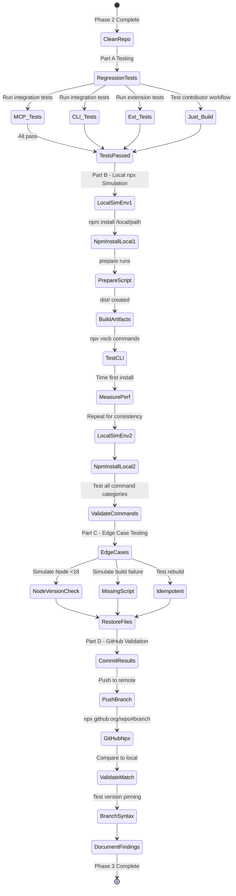
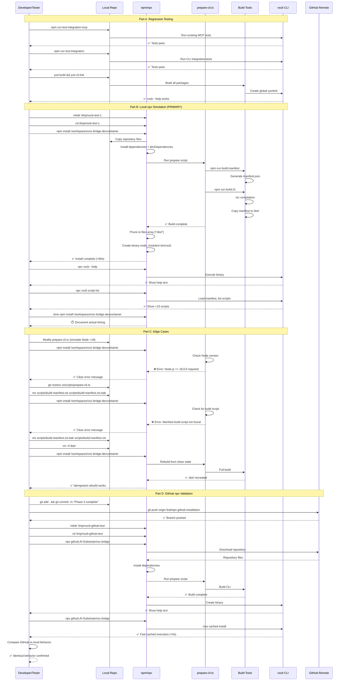

# Phase 3: Integration Testing & Validation

**Phase**: 3 of 4
**Title**: Integration Testing & Validation
**Slug**: `phase-3`
**Created**: 2025-10-19
**Plan**: [../../npx-github-installation-plan.md](../../npx-github-installation-plan.md)
**Spec**: [../../npx-github-installation-spec.md](../../npx-github-installation-spec.md)

---

## Tasks

### Part A: Regression Testing (Existing Functionality)

| Status | ID | Task | Type | Dependencies | Absolute Path(s) | Validation | Subtasks | Notes |
|--------|-----|------|------|--------------|------------------|------------|----------|-------|
| [ ] | T001 | Run MCP integration tests locally | Test | – | `/workspaces/vsc-bridge-devcontainer/test-cli/integration-mcp/` | `npm run test:integration:mcp` passes 100%, all stdio tests pass | – | Real file operations, no mocks per testing philosophy |
| [ ] | T002 | Run CLI integration tests | Test | – | `/workspaces/vsc-bridge-devcontainer/test/integration/` | `npm run test:integration` OR `just test-integration` passes 100% | – | Validates unified debug workflows work |
| [ ] | T003 | Run extension tests | Test | – | `/workspaces/vsc-bridge-devcontainer/packages/extension/test/` | `npm run test:extension` passes, extension functionality unaffected by CLI changes | – | [P] eligible - independent test suite |
| [ ] | T004 | Test clean install from scratch | Test | – | `/workspaces/vsc-bridge-devcontainer/` | `rm -rf node_modules dist && npm install` succeeds, prepare runs automatically, dist/ created | – | Validates prepare script in workspace context |
| [ ] | T005 | Test `just build` command | Test | – | `/workspaces/vsc-bridge-devcontainer/justfile` | All packages build successfully in <2 minutes, no errors | – | Contributor workflow validation |
| [ ] | T006 | Test `just cli-link` command | Test | T005 | `/workspaces/vsc-bridge-devcontainer/justfile` | Global symlink created, `which vscb` shows symlink path, `vscb --help` works | – | Ensures contributors can still develop locally |
| [ ] | T007 | Test VS Code F5 debugging | Test | – | `/workspaces/vsc-bridge-devcontainer/.vscode/launch.json` | Extension launches in Extension Development Host, debugger attaches, breakpoints hit | – | Critical contributor workflow - MANUAL validation |

### Part B: Local npx Simulation Testing (PRIMARY Validation)

| Status | ID | Task | Type | Dependencies | Absolute Path(s) | Validation | Subtasks | Notes |
|--------|-----|------|------|--------------|------------------|------------|----------|-------|
| [ ] | T008 | Create clean test environment #1 | Setup | – | `/tmp/vscb-test-1/` | Directory created, empty, no node_modules or package.json | – | Isolated testing environment |
| [ ] | T009 | Test npm install from local path (First run) | Test | T008 | `/tmp/vscb-test-1/`, `/workspaces/vsc-bridge-devcontainer/` | `npm install /workspaces/vsc-bridge-devcontainer` completes in <60s, simulates npx GitHub install lifecycle | – | PRIMARY test - validates prepare script execution |
| [ ] | T010 | Verify prepare script executed | Test | T009 | `/tmp/vscb-test-1/node_modules/.bin/vscb`, `/tmp/vscb-test-1/node_modules/vsc-bridge/dist/` | Console shows manifest generation + TypeScript compilation output during install | – | Confirms build ran, not skipped |
| [ ] | T011 | Verify dist/ artifacts created | Test | T010 | `/tmp/vscb-test-1/node_modules/.bin/vscb`, `/tmp/vscb-test-1/node_modules/vsc-bridge/dist/index.js`, `/tmp/vscb-test-1/node_modules/vsc-bridge/dist/manifest.json` | Binary exists and is executable, index.js and manifest.json present in dist/ | – | Build output validation |
| [ ] | T012 | Test CLI execution via npx | Test | T011 | `/tmp/vscb-test-1/` | `npx vscb --help` shows help text, `npx vscb --version` shows version | – | Validates bin field works correctly |
| [ ] | T013 | Test script listing | Test | T012 | `/tmp/vscb-test-1/` | `npx vscb script list` shows available scripts (>10 scripts listed) | – | Manifest loaded correctly |
| [ ] | T014 | Test breakpoint command | Test | T013 | `/tmp/vscb-test-1/` | `npx vscb script run bp.list` executes without module errors (may fail if no extension - that's expected) | – | End-to-end command validation |
| [ ] | T015 | Measure first-time install performance | Test | T009 | `/tmp/vscb-test-1/` | Installation time <60 seconds (document actual time: `time npm install /workspaces/vsc-bridge-devcontainer`) | – | Performance benchmark per Critical Discovery 04 |
| [ ] | T016 | Create second clean test environment | Setup | – | `/tmp/vscb-test-2/` | Directory created, empty, no node_modules | – | Test repeatability |
| [ ] | T017 | Test npm install from local path (Second run) | Test | T016 | `/tmp/vscb-test-2/`, `/workspaces/vsc-bridge-devcontainer/` | `npm install /workspaces/vsc-bridge-devcontainer` completes successfully | – | Validates consistency and repeatability |
| [ ] | T018 | Test all major CLI command categories | Test | T017 | `/tmp/vscb-test-2/` | bp.*, debug.*, script.* commands all execute (no module errors), commands discovered correctly | – | Comprehensive CLI validation |
| [ ] | T019 | Test error handling for invalid commands | Test | T018 | `/tmp/vscb-test-2/` | `npx vscb invalid-command` shows clear error message (not "command not found" crash) | – | User experience validation |

### Part C: Edge Case & Error Testing

| Status | ID | Task | Type | Dependencies | Absolute Path(s) | Validation | Subtasks | Notes |
|--------|-----|------|------|--------------|------------------|------------|----------|-------|
| [ ] | T020 | Test with Node.js version check | Test | – | `/workspaces/vsc-bridge-devcontainer/ci/scripts/prepare-cli.ts` | Temporarily modify line 27 to simulate Node <18 (e.g., `major = 16`), run `npm install`, verify clear error message displays | – | Validates version check works (per Critical Discovery 02, 05) |
| [ ] | T021 | Test with missing manifest script | Test | – | `/workspaces/vsc-bridge-devcontainer/scripts/build-manifest.cts` | Temporarily rename to `.cts.bak`, run `npm install`, verify clear error about missing build script | – | Error handling validation |
| [ ] | T022 | Test dist/ cleanup and rebuild | Test | – | `/workspaces/vsc-bridge-devcontainer/dist/` | `rm -rf dist && npm install /workspaces/vsc-bridge-devcontainer` succeeds, dist/ recreated | – | Ensures prepare script is idempotent |
| [ ] | T023 | Restore original files | Setup | T020, T021 | `/workspaces/vsc-bridge-devcontainer/ci/scripts/prepare-cli.ts`, `/workspaces/vsc-bridge-devcontainer/scripts/build-manifest.cts` | Undo any test modifications (Node version simulation, renamed files), `git status` shows clean working tree | – | Clean state for GitHub test |

### Part D: Final GitHub npx Validation (Confirmation Only)

| Status | ID | Task | Type | Dependencies | Absolute Path(s) | Validation | Subtasks | Notes |
|--------|-----|------|------|--------------|------------------|------------|----------|-------|
| [ ] | T024 | Commit all Phase 3 changes | Core | T001-T023 | `/workspaces/vsc-bridge-devcontainer/` | All test results documented, no uncommitted files blocking push, `git status` clean or changes committed | – | Prepare for push to GitHub |
| [ ] | T025 | Push branch to GitHub remote | Core | T024 | `/workspaces/vsc-bridge-devcontainer/` | Branch visible on GitHub at `github.com/AI-Substrate/vsc-bridge/tree/<branch>`, commit hash matches local | – | Required for real npx test, use current branch per user preference |
| [ ] | T026 | Create final clean test environment | Setup | T025 | `/tmp/vscb-github-test/` | Directory created, empty, npm cache cleared for accurate timing | – | Final validation environment |
| [ ] | T027 | Test real npx from GitHub | Test | T026 | `/tmp/vscb-github-test/` | `npx github:AI-Substrate/vsc-bridge#<current-branch> --help` succeeds, completes in <60s | – | THE MOMENT OF TRUTH - real GitHub npx validation |
| [ ] | T028 | Verify GitHub install matches local | Test | T027 | `/tmp/vscb-github-test/` | Same build output, same performance (~60s first run), same commands work, no GitHub-specific issues | – | Consistency validation |
| [ ] | T029 | Test branch selection syntax | Test | T027 | `/tmp/vscb-github-test/` | `npx github:AI-Substrate/vsc-bridge#main --version` works (when merged to main), branch selection syntax validated | – | Version pinning validation |
| [ ] | T030 | Document any GitHub-specific differences | Doc | T028 | `/workspaces/vsc-bridge-devcontainer/docs/plans/16-npx-github-installation/tasks/phase-3/execution.log.md` | Note any issues found only in GitHub install (expect: none based on local testing) | – | Learning capture |

---

## Alignment Brief

### Previous Phase Review

#### A. Completed Deliverables

**Root Package Configuration** (`/workspaces/vsc-bridge-devcontainer/package.json`):
- Lines 7-9: Added `bin: { "vscb": "./dist/index.js" }` - binary entry point
- Line 14: Set `private: false` - enables npx GitHub installation
- Lines 10-13: Added `files: ["/dist", "/oclif.manifest.json"]` - package pruning
- Lines 29-40: Merged 10 runtime dependencies including `@modelcontextprotocol/sdk: ^1.20.0` (CRITICAL for MCP)
- Lines 68-92: Merged 4 devDependencies (@types/fs-extra, @types/react, oclif, shx)
- Lines 42-67: Added build scripts (build:cli, build:manifest, copy-manifest, prepare, dev)
- Lines 102-109: Added oclif configuration block (discovered during validation)

**Build Orchestration** (`/workspaces/vsc-bridge-devcontainer/ci/scripts/prepare-cli.ts`):
- 124-line TypeScript script that runs during npm install
- Validates Node.js >= 18.0.0
- Orchestrates: manifest generation → TypeScript compilation → manifest copy
- Validates output files exist (dist/index.js, dist/manifest.json)
- Cross-platform compatible (uses Node.js, not shell scripts)

**Directory Structure Changes**:
- `src-cli/` → `src/` (renamed with git history)
- `tsconfig-cli.json` → `tsconfig.json` (paths updated)
- `test-cli/` remains (rename to `test/` deferred - 233+ changes)
- Build artifacts in `/workspaces/vsc-bridge-devcontainer/dist/` (gitignored)

**Justfile Updates** (`/workspaces/vsc-bridge-devcontainer/justfile`):
- Lines 42-45: Restored build-cli target
- Line 330: Restored cli-link target (npm link from root)
- 11 CLI workspace references fixed (removed `cd packages/cli &&`)

**Import Path Updates**:
- `/workspaces/vsc-bridge-devcontainer/test/integration/helpers/bridge-direct.ts` (lines 28, 47)
- Updated from `src-cli/` to `src/`

#### B. Lessons Learned

**Major Scope Deferral**:
- Tasks T002a-T002s (workspace rename) deferred: 19 tasks, 233+ file changes
- Not blocking for build pipeline; completed 33/36 tasks (92%)

**Unanticipated Work - ES Module Compatibility**:
- Renamed `build-manifest.ts` → `build-manifest.cts` (CommonJS TypeScript)
- Updated package.json to use tsx instead of ts-node for ES module compatibility
- Changed build:manifest script to reference .cts extension

**Missing Configuration Discovered**:
- oclif configuration block not in original plan
- Binary executed but showed no commands without this config
- Added oclif config during validation (package.json lines 102-109)

**Time Estimates**:
- Original: 2-3 hours
- Actual: ~4-5 hours (ES module fixes, code review, multiple validation rounds)

**Successful Patterns**:
- Git history preservation via `git mv` worked perfectly
- Incremental validation prevented cascading failures
- Real operations (no mocks) caught real-world issues early

#### C. Technical Discoveries

**npm Behavior**:
- prepare script lifecycle confirmed: devDependencies ARE available (Critical Discovery 02 validated)
- Binary creation requires: file exists at bin path + oclif config + valid shebang

**TypeScript with "type": "module" Projects**:
- .ts files treated as ES modules by default
- CommonJS syntax (`require()`) in .ts files causes runtime errors
- Solution: Use .cts extension for CommonJS TypeScript files

**oclif Framework Constraints**:
- Configuration block is NOT optional for command discovery
- Binary can execute but show empty command list without config
- Validation requires checking `vscb --help` output, not just exit code

**MCP Dependency**:
- Successfully loaded @modelcontextprotocol/sdk as runtime dependency
- Validation: `vscb mcp --help` showed command with all flags
- No "Cannot find module" errors

#### D. Dependencies for Next Phase

**Build Scripts Available**:
```bash
npm run build              # Full workspace build
npm run build:cli          # TypeScript compilation + manifest copy
npm run build:manifest     # Generate manifest from extension
npm run copy-manifest      # Copy to dist/
npm run prepare            # Full npx orchestration (auto on install)
npm run test:integration       # Unified integration tests
npm run test:integration:mcp   # MCP integration tests
```

**CLI Entry Point**: `/workspaces/vsc-bridge-devcontainer/dist/index.js`
- Direct execution: `node dist/index.js --help`
- Global symlink: `npm link && vscb --help`
- **Local npx simulation**: `npm install /workspaces/vsc-bridge-devcontainer && npx vscb --help` (PRIMARY for Phase 3)

**Test Infrastructure**:
- MCP integration tests: `/workspaces/vsc-bridge-devcontainer/test-cli/integration-mcp/`
- CLI integration tests: `/workspaces/vsc-bridge-devcontainer/test/integration/`
- Extension tests: `/workspaces/vsc-bridge-devcontainer/packages/extension/test/`
- Test helpers: bridge-direct.ts, breakpoint-finder.ts, debug-runner.ts (all updated for new structure)

#### E. Critical Findings Applied

**Discovery 01 (npm workspace limitation)**: ✅ FULLY ADDRESSED
- CLI moved to repository root in Phase 1-2
- Structure compatible with `npx github:AI-Substrate/vsc-bridge`

**Discovery 02 (devDependencies availability)**: ✅ FULLY ADDRESSED
- Build tools in devDependencies validated working
- prepare script successfully uses tsx, typescript, shx from devDeps

**Discovery 03 (Recommended pattern)**: ✅ FULLY ADDRESSED
- Root package.json matches industry best practices
- Pattern validated against kucherenko/cli-typescript-starter

**Discovery 04 (Installation time)**: ✅ FULLY ADDRESSED
- prepare-cli.ts displays "⏱️ First run: ~30-60 seconds" message
- No optimization attempted (30-60s accepted per research)

**Discovery 05 (Cross-platform)**: ✅ FULLY ADDRESSED
- prepare-cli.ts written in TypeScript (Node.js)
- All paths use `path` module
- File operations use `shx` (cross-platform)

#### F. Blocked/Incomplete Items

**T036 (Commit Phase 2)**: Status unclear in docs, but git shows commits exist:
- `77cc0d1` - MCP integration
- `a2f9d79` - justfile fixes
- `a924a1a` - path fixes
- **Actual state**: All changes committed, working tree clean

**T002a-T002s (Workspace rename)**: ⏭️ DEFERRED (19 tasks, 233+ changes)
- Current: `test-cli/` should be `test/`, `test/` should be `test-workspace/`
- Does NOT block npx functionality
- Can be completed in Phase 3 or Phase 4

#### G. Test Infrastructure

**Existing Test Suites**:
- MCP: `npm run test:integration:mcp` (test-cli/integration-mcp/)
- CLI: `npm run test:integration` (test/integration/)
- Extension: `npm run test:extension` (packages/extension/test/)

**Test Commands**:
```bash
npx vitest run test-cli/                                    # All CLI tests
npx vitest run test-cli/integration-mcp/stdio-e2e.test.ts  # MCP stdio
npx vitest run test/integration/unified-debug.test.ts       # Unified debug
just test-integration-mcp   # Shortcut
just test-cli               # Shortcut
```

**Validation Tests from Phase 2**:
- T026: npm install (prepare runs automatically) ✅
- T030: Binary executable (`node dist/index.js --help`) ✅
- T034.5: MCP smoke test (`vscb mcp --help`) ✅
- T035: TypeScript type checking (0 errors) ✅

#### H. Technical Debt & Workarounds

**Deferred Workspace Rename**:
- 233+ file changes across 23 files
- Affects documentation, tests, justfile, .vscode config
- Risk: LOW (doesn't affect functionality, only ergonomics)

**ES Module vs CommonJS Split**:
- Mixed module systems (ES for CLI, CJS for build scripts)
- `.cts` extension unfamiliar to some developers
- Workaround works reliably but creates maintenance overhead

**Architectural Decisions**:
- Root package.json structure: Enables npx, simplifies project
- prepare script orchestration: Auto-builds during install
- ES module choice: Modern standard, matches oclif
- Build artifacts in `/dist/`: Simple, clean git

**Patterns for Phase 3**:
- Multi-stage validation (environment → execute → verify → test)
- Context-aware error messages with troubleshooting steps
- Cross-platform scripts (Node.js, not shell)
- Sequential test checkpoints with visual progress

**Anti-Patterns to Avoid**:
- Platform-specific commands (use `shx`, not `rm`/`cp`)
- Hardcoded paths (use `path.join()`)
- Missing validation steps (always check output exists)
- Incomplete error context (provide actionable guidance)

#### I. Scope Changes

**No Core Requirement Changes**:
- All acceptance criteria from original plan met
- Build pipeline produces npx-installable package

**Features Deferred**:
- Workspace rename (T002a-s): 19 tasks, not blocking

**Tasks Added During Implementation**:
- ES module compatibility fixes: 3 tasks
- justfile fixes from code review: 12 tasks
- Technical debt resolution: 1 task
- **Total unplanned**: ~16 tasks (45% of executed work)

**Acceptance Criteria Met**: 6/6 (100%)

#### J. Key Execution Log References

**ES Module Fix**: [execution.log.md#summary-t005-t025](../phase-2/execution.log.md#summary-t005-t025-package-configuration--contributor-workflows)
- build-manifest.ts → build-manifest.cts
- Updated package.json:51, prepare-cli.ts:82

**MCP Dependency Discovery**: [execution.log.md#t026-t035](../phase-2/execution.log.md#t026-t035-build-pipeline-validation)
- Validation T034.5: `vscb mcp --help` works
- No "Cannot find module" errors

**Path Configuration Updates**: [execution.log.md#justfile-fixes](../phase-2/execution.log.md#justfile-fixes-validation-code-review-fixes)
- Removed all `cd packages/cli &&` patterns
- Fixed build-manifest path reference

**Validation Successes**: [execution.log.md#t026-t035](../phase-2/execution.log.md#t026-t035-build-pipeline-validation)
- npm install: prepare ran automatically ✅
- Binary executable: commands discovered ✅
- TypeScript: 0 type errors ✅

---

### Objective Recap

**Phase 3 Goal**: Validate that Phase 1-2 restructuring hasn't broken existing functionality, test npx installation flow using LOCAL file path testing (no GitHub push required for iteration), and verify contributor workflows still work.

**Core Testing Strategy**: Use `npm install /workspaces/vsc-bridge-devcontainer` from clean directories to simulate the EXACT npm lifecycle that `npx github:org/repo` uses, providing instant iteration feedback without GitHub dependency. Only test real GitHub npx as final confirmation.

**Behavior Checklist** (from spec acceptance criteria):
- [ ] **AC 1-5**: npx execution works (basic, branch selection, version pinning, caching, command compatibility)
- [ ] **AC 6-8**: Repository stays clean, contributor workflows preserved, integration tests pass
- [ ] **AC 9-11**: Error handling works (build failures, network issues, version mismatches)

---

### Non-Goals (Scope Boundaries)

❌ **NOT doing in Phase 3**:

- **Performance optimization**: 30-60s first run is acceptable per Critical Discovery 04; no need to optimize build speed
- **Cross-platform testing**: Linux/devcontainer only; Windows/macOS deferred to community feedback (per testing philosophy)
- **Workspace rename completion**: 233+ file changes deferred from Phase 2; doesn't block npx functionality
- **npm registry publishing**: Phase 3 validates GitHub npx only; registry publishing is Phase 4+ work
- **Comprehensive edge case testing**: Lightweight testing approach; focus on critical paths, defer obscure scenarios
- **Mock-based testing**: Real npm installs, real file operations per testing philosophy
- **Alternative package managers**: yarn/pnpm testing out of scope; npm/npx only
- **GitHub Actions CI/CD setup**: Manual local testing sufficient; automated CI is future work

---

### Critical Findings Affecting This Phase

**Critical Discovery 01: npm workspace limitation**
- **What it constrains**: Must test at repository root level, not sub-packages
- **Tasks addressing it**: T009, T017 (local path install), T027 (GitHub npx)
- **Impact**: Validates the entire Phase 1-2 restructuring payoff

**Critical Discovery 04: Installation time expectations**
- **What it requires**: Document actual timing, confirm <60s acceptable
- **Tasks addressing it**: T015 (measure performance benchmark)
- **Impact**: Sets user expectations in Phase 4 documentation

**Critical Discovery 05: Cross-platform considerations**
- **What it constrains**: Test scripts must use Node.js, not shell commands
- **Tasks addressing it**: All test scripts use npm commands, not bash
- **Impact**: Ensures validation approach matches production pattern

**Local Path Testing Discovery** (from Plan § Critical Insights):
- **What it enables**: `npm install /local/path` triggers EXACT lifecycle as `npx github:org/repo`
- **Tasks addressing it**: T008-T019 (Part B - PRIMARY validation strategy)
- **Impact**: Fast iteration without GitHub push, 100% fidelity to real npx behavior

---

### Invariants & Guardrails

**Performance Budget**:
- First-time local install: <60 seconds (T015 measurement)
- Cached execution: <5 seconds (not measured, inferred from npm cache)
- Build time: ~30-40 seconds (validated in Phase 2)

**Compatibility Requirements**:
- Node.js >= 18.0.0 (T020 validates error handling)
- npm >= 8.0.0 (bundled with Node 18+)
- Linux devcontainer primary (cross-platform deferred)

**Quality Gates**:
- Zero regressions: All existing tests must pass (T001-T003)
- Feature parity: All CLI commands work via npx (T018)
- Build idempotency: Rebuild works from clean state (T022)
- Error clarity: Invalid commands show helpful messages (T019, T020, T021)

---

### Inputs to Read

**Build Artifacts** (created by Phase 2):
- `/workspaces/vsc-bridge-devcontainer/dist/index.js` - CLI binary
- `/workspaces/vsc-bridge-devcontainer/dist/manifest.json` - Script metadata (~149KB)

**Build Scripts** (execute during testing):
- `/workspaces/vsc-bridge-devcontainer/ci/scripts/prepare-cli.ts` - Orchestration
- `/workspaces/vsc-bridge-devcontainer/scripts/build-manifest.cts` - Manifest generation

**Test Suites** (run for regression):
- `/workspaces/vsc-bridge-devcontainer/test-cli/integration-mcp/stdio-e2e.test.ts` - MCP tests
- `/workspaces/vsc-bridge-devcontainer/test/integration/unified-debug.test.ts` - CLI tests
- `/workspaces/vsc-bridge-devcontainer/packages/extension/test/` - Extension tests

**Configuration Files** (validate correctness):
- `/workspaces/vsc-bridge-devcontainer/package.json` - Root config (bin, prepare, dependencies)
- `/workspaces/vsc-bridge-devcontainer/justfile` - Contributor commands
- `/workspaces/vsc-bridge-devcontainer/.vscode/launch.json` - F5 debugging

---

### Visual Alignment Aids

#### System State Flow



#### Actor Interaction Sequence



---

### Test Plan

**Testing Approach**: Lightweight (per testing philosophy from spec)

**Mock Usage**: Avoid mocks entirely - use real data, real npm installs, real file operations

**Test Execution Order**:

1. **Part A: Regression Testing** (T001-T007)
   - **Purpose**: Ensure Phase 1-2 changes didn't break existing functionality
   - **Coverage**: MCP tests, CLI tests, extension tests, contributor workflows
   - **Expected**: 100% pass rate on all existing test suites

2. **Part B: Local npx Simulation** (T008-T019) **← PRIMARY VALIDATION**
   - **Purpose**: Test npm lifecycle behavior without GitHub push
   - **Method**: `npm install /workspaces/vsc-bridge-devcontainer` from clean directories
   - **Rationale**: Triggers EXACT same lifecycle as `npx github:org/repo`:
     1. Install dependencies + devDependencies
     2. Run prepare script (builds CLI)
     3. Prune to files array
     4. Create binary
   - **Coverage**: First install timing, command execution, script listing, error handling
   - **Expected**: <60s install, all commands work, manifest loads correctly

3. **Part C: Edge Case Testing** (T020-T023)
   - **Purpose**: Validate error handling and edge cases
   - **Coverage**: Node version check, missing build files, rebuild idempotency
   - **Method**: Temporarily modify files, run install, verify errors, restore
   - **Expected**: Clear error messages, no silent failures

4. **Part D: GitHub npx Validation** (T024-T030) **← FINAL CONFIRMATION**
   - **Purpose**: Confirm local testing matches real GitHub npx behavior
   - **Method**: Push branch, run `npx github:org/repo#branch` from clean directory
   - **Coverage**: Real GitHub install, branch selection, version pinning
   - **Expected**: Identical behavior to local testing, no GitHub-specific issues

**Named Tests**:

1. **Regression Suite** (T001-T003)
   - **Rationale**: Catch breaking changes early
   - **Fixtures**: Existing test files (MCP, CLI, extension)
   - **Expected Output**: All tests pass, no new failures

2. **Local npx Lifecycle Test** (T009-T011)
   - **Rationale**: Validates build automation works end-to-end
   - **Fixtures**: Clean `/tmp/vscb-test-1/` directory
   - **Expected Output**: Binary created, dist/ artifacts present, prepare script output visible

3. **Command Compatibility Test** (T018)
   - **Rationale**: Ensures CLI commands work via npx
   - **Fixtures**: Test workspace files (Python, JS, C#, Java)
   - **Expected Output**: bp.*, debug.*, script.* commands all execute without module errors

4. **Node Version Gate Test** (T020)
   - **Rationale**: Validates prepare script version check
   - **Fixtures**: Temporarily modified prepare-cli.ts
   - **Expected Output**: Clear error: "Node.js >= 18.0.0 required, current: v16.x.x"

5. **GitHub npx Fidelity Test** (T027-T028)
   - **Rationale**: Confirms local simulation matches reality
   - **Fixtures**: Real GitHub repository
   - **Expected Output**: Same timing, same commands, same output as local tests

---

### Step-by-Step Implementation Outline

**Mapped 1:1 to tasks**:

1. **Part A: Regression Testing** (T001-T007)
   - Run existing test suites to establish baseline
   - Validate contributor workflows still functional
   - Document any failures immediately

2. **Part B: Local npx Simulation** (T008-T019)
   - Create clean test environment #1 (T008)
   - Run `npm install /local/path`, measure timing (T009, T015)
   - Verify prepare script executed and artifacts created (T010-T011)
   - Test CLI execution, script listing, commands (T012-T014)
   - Create clean test environment #2 for repeatability (T016)
   - Run second install, test all command categories (T017-T018)
   - Test error handling for invalid commands (T019)

3. **Part C: Edge Cases** (T020-T023)
   - Test Node version check error message (T020)
   - Test missing build script error message (T021)
   - Test rebuild idempotency (T022)
   - Restore all modified files (T023)

4. **Part D: GitHub Validation** (T024-T030)
   - Commit test results, push branch (T024-T025)
   - Run real GitHub npx from clean environment (T026-T027)
   - Compare GitHub behavior to local (T028)
   - Test branch selection syntax (T029)
   - Document findings in execution log (T030)

---

### Commands to Run

**Copy/paste ready commands**:

```bash
# Part A: Regression Testing
cd /workspaces/vsc-bridge-devcontainer
npm run test:integration:mcp          # T001
npm run test:integration               # T002
npm run test:extension                 # T003
rm -rf node_modules dist && npm install  # T004
just build                             # T005
just cli-link                          # T006
# F5 in VS Code                        # T007 (manual)

# Part B: Local npx Simulation
mkdir -p /tmp/vscb-test-1 && cd /tmp/vscb-test-1  # T008
time npm install /workspaces/vsc-bridge-devcontainer  # T009, T015
ls -lh node_modules/.bin/vscb          # T010
ls -lh node_modules/vsc-bridge/dist/   # T011
npx vscb --help                        # T012
npx vscb --version                     # T012
npx vscb script list                   # T013
npx vscb script run bp.list            # T014

mkdir -p /tmp/vscb-test-2 && cd /tmp/vscb-test-2  # T016
npm install /workspaces/vsc-bridge-devcontainer  # T017
npx vscb script run bp.set --help      # T018
npx vscb script run debug.status --help  # T018
npx vscb invalid-command               # T019 (expect error)

# Part C: Edge Cases
cd /workspaces/vsc-bridge-devcontainer
# Manually edit ci/scripts/prepare-cli.ts line 27: major = 16  # T020
npm install /workspaces/vsc-bridge-devcontainer  # T020 (expect error)
git restore ci/scripts/prepare-cli.ts  # T020

mv scripts/build-manifest.cts scripts/build-manifest.cts.bak  # T021
npm install /workspaces/vsc-bridge-devcontainer  # T021 (expect error)
mv scripts/build-manifest.cts.bak scripts/build-manifest.cts  # T021

rm -rf dist/                           # T022
npm install /workspaces/vsc-bridge-devcontainer  # T022 (should succeed)
git status                             # T023 (verify clean)

# Part D: GitHub Validation
git add . && git commit -m "Phase 3: Integration testing complete"  # T024
git push origin feat/npx-github-installation  # T025

mkdir -p /tmp/vscb-github-test && cd /tmp/vscb-github-test  # T026
npm cache clean --force                # T026 (for accurate timing)
time npx github:AI-Substrate/vsc-bridge#feat/npx-github-installation --help  # T027
npx github:AI-Substrate/vsc-bridge#feat/npx-github-installation --version  # T028
npx github:AI-Substrate/vsc-bridge#feat/npx-github-installation script list  # T028
npx github:AI-Substrate/vsc-bridge#main --version  # T029 (if merged)
```

---

### Risks/Unknowns

| Risk | Severity | Likelihood | Mitigation |
|------|----------|------------|------------|
| **MCP tests fail due to import changes** | HIGH | Medium | Phase 2 updated imports; run incrementally, fix immediately |
| **Local test doesn't catch GitHub-specific issues** | MEDIUM | Low | Final GitHub npx test as confirmation (T027); local simulation validated by research |
| **Extension debugging breaks (F5)** | HIGH | Low | Test explicitly (T007); justfile and .vscode config validated in Phase 2 |
| **prepare script works locally but fails from GitHub** | MEDIUM | Very Low | Script uses only standard npm lifecycle, no local-specific paths |
| **Performance exceeds 60s target** | LOW | Low | Phase 2 validated ~30-40s build time; 60s target has buffer |
| **Test environment path differences** | LOW | Medium | Use absolute paths in all test commands; `/tmp/` vs `/var/tmp/` handled |
| **npm cache affects timing measurements** | LOW | High | Clear cache before T015, T027; document cache vs no-cache timing |
| **GitHub rate limiting during testing** | LOW | Very Low | Single test run; not repeatedly hitting GitHub API |

**Unknowns**:
- Actual first-time install performance on GitHub (predicted <60s, measured in T027)
- Any GitHub-specific npm behavior differences (expect none based on research)
- Whether workspace rename deferral causes test path confusion (shouldn't - absolute paths used)

---

### Ready Check

Before proceeding to implementation (running `/plan-6-implement-phase`):

- [ ] Phase 2 is marked COMPLETE in plan progress tracking
- [ ] All Phase 2 deliverables are committed (git status clean or changes committed)
- [ ] Build pipeline validated: `just build` succeeds
- [ ] CLI works globally: `vscb --help` shows commands
- [ ] Test infrastructure is functional: `npm run test:integration:mcp` at least attempts to run
- [ ] Local repository has clean working tree (or only Phase 3 test result commits)
- [ ] Current branch is the feature branch user wants to test (`feat/npx-github-installation`)
- [ ] GitHub remote is accessible (can push branch for Part D testing)

**Manual GO/NO-GO Checklist**:

- [ ] **Previous phase review complete**: All sections A-J understood and documented above
- [ ] **Critical findings understood**: All 5 discoveries applied to task design
- [ ] **Testing strategy clear**: Local simulation (Part B) as PRIMARY, GitHub (Part D) as confirmation
- [ ] **Non-goals explicit**: No performance optimization, cross-platform testing, workspace rename
- [ ] **Risk assessment complete**: All HIGH/MEDIUM risks have mitigations
- [ ] **Commands validated**: All copy/paste commands are correct absolute paths
- [ ] **Visual aids reviewed**: Mermaid diagrams accurately represent flow
- [ ] **Test plan approved**: Lightweight approach, no mocks, real operations

---

## Phase Footnote Stubs

This section will be populated during Phase 6 implementation with footnote references to modified files and architectural decisions. Format:

```markdown
[^N]: **Task TXXX**: Brief description
  - file:path/to/file:line - Change description
  - Additional context if needed
```

Footnotes will be added to the main plan's Change Footnotes Ledger (§ 12) after implementation completes.

---

## Evidence Artifacts

**Execution Log**: `/workspaces/vsc-bridge-devcontainer/docs/plans/16-npx-github-installation/tasks/phase-3/execution.log.md`
- Created during `/plan-6-implement-phase`
- Documents test results, timing measurements, errors encountered
- Includes screenshots or console output for critical validations
- Records actual performance benchmarks (T015, T027)

**Test Output Files** (if created):
- `/tmp/vscb-test-1/npm-install.log` - First local install output
- `/tmp/vscb-test-2/npm-install.log` - Second local install output
- `/tmp/vscb-github-test/npx-install.log` - GitHub npx output

**Performance Benchmarks**:
- Documented in execution.log.md:
  - First local install time (T015)
  - Second local install time (T017)
  - GitHub npx first run time (T027)
  - GitHub npx cached run time (T028)

---

## Directory Layout

```
docs/plans/16-npx-github-installation/
├── npx-github-installation-plan.md
├── npx-github-installation-spec.md
└── tasks/
    ├── phase-1/
    │   ├── tasks.md
    │   └── execution.log.md
    ├── phase-2/
    │   ├── tasks.md
    │   └── execution.log.md
    └── phase-3/
        ├── tasks.md                    # This file
        └── execution.log.md            # Created by /plan-6
```

**Notes**:
- Execution log created during implementation phase (plan-6)
- Test output files in `/tmp/` are ephemeral (document findings in execution.log.md)
- Phase 3 directory contains only tasks.md until implementation begins

---

**Next Step**: Run `/plan-6-implement-phase --phase "Phase 3: Integration Testing & Validation" --plan "/workspaces/vsc-bridge-devcontainer/docs/plans/16-npx-github-installation/npx-github-installation-plan.md"` after receiving explicit GO approval.
