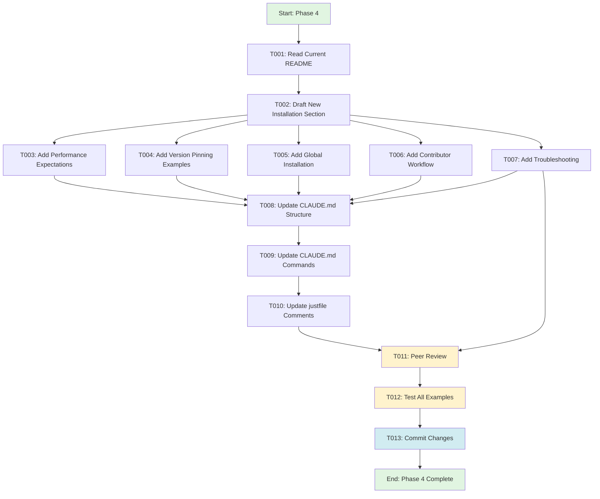
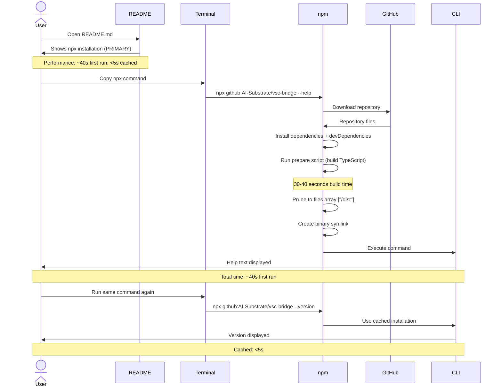

# Phase 4: Documentation & Migration - Tasks + Alignment Brief

**Phase**: 4 of 4
**Title**: Documentation & Migration
**Created**: 2025-10-19
**Spec**: [../../npx-github-installation-spec.md](../../npx-github-installation-spec.md)
**Plan**: [../../npx-github-installation-plan.md](../../npx-github-installation-plan.md)
**Status**: READY FOR IMPLEMENTATION

---

## Tasks

| Status | ID | Task | Type | Dependencies | Absolute Path(s) | Validation | Subtasks | Notes |
|--------|----|----|------|--------------|------------------|------------|----------|-------|
| [ ] | T001 | Read current README.md installation section | Setup | – | /workspaces/vsc-bridge-devcontainer/README.md | Current installation flow understood | – | Understand existing structure before updating |
| [ ] | T002 | Draft new installation section with npx as primary method | Doc | T001 | /workspaces/vsc-bridge-devcontainer/README.md | Section drafted, follows template structure | – | Use template from plan § 4.4, emphasize zero-setup value |
| [ ] | T003 | Add performance expectations to installation section | Doc | T002 | /workspaces/vsc-bridge-devcontainer/README.md | "~40s first run, <5s cached" documented prominently | – | Use actual Phase 3 benchmarks (39s GitHub, 2.25s local) |
| [ ] | T004 | Add version pinning examples for CI/CD usage | Doc | T002 | /workspaces/vsc-bridge-devcontainer/README.md | Branch/tag syntax examples included | – | Show #branch, #v2.0.0, #main patterns |
| [ ] | T005 | Add global installation section (secondary method) | Doc | T002 | /workspaces/vsc-bridge-devcontainer/README.md | Global install documented after npx | – | npm install -g github:org/repo |
| [ ] | T006 | Add contributor installation section | Doc | T002 | /workspaces/vsc-bridge-devcontainer/README.md | Clone + build + link workflow documented | – | Preserve existing contributor workflow (just build, just cli-link) |
| [ ] | T007 | Add troubleshooting section to README | Doc | T002 | /workspaces/vsc-bridge-devcontainer/README.md | Common issues documented with fixes | – | Node version, build failures, slow install, extension not running |
| [ ] | T008 | Update CLAUDE.md project structure section | Doc | – | /workspaces/vsc-bridge-devcontainer/CLAUDE.md | CLI at root documented (not packages/cli/) | – | [P] Can run parallel with README updates |
| [ ] | T009 | Update CLAUDE.md CLI commands section | Doc | T008 | /workspaces/vsc-bridge-devcontainer/CLAUDE.md | Path references updated (remove packages/cli/) | – | Search for packages/cli references, update to root paths |
| [ ] | T010 | Update justfile comments for new structure | Doc | – | /workspaces/vsc-bridge-devcontainer/justfile | Comments reflect CLI at root | – | [P] Can run parallel with README/CLAUDE updates |
| [ ] | T011 | Peer review all documentation changes | Integration | T002, T003, T004, T005, T006, T007, T008, T009, T010 | /workspaces/vsc-bridge-devcontainer/README.md, /workspaces/vsc-bridge-devcontainer/CLAUDE.md, /workspaces/vsc-bridge-devcontainer/justfile | No broken links, clear instructions, accurate examples | – | Check examples work, links resolve, no typos |
| [ ] | T012 | Test all npx examples from README | Integration | T011 | /workspaces/vsc-bridge-devcontainer/README.md | All examples execute successfully | – | Copy-paste test each example from fresh terminal |
| [ ] | T013 | Commit documentation changes | Integration | T011, T012 | /workspaces/vsc-bridge-devcontainer/README.md, /workspaces/vsc-bridge-devcontainer/CLAUDE.md, /workspaces/vsc-bridge-devcontainer/justfile | Git commit created with clear message | – | Message: "docs: update for npx installation (no migration)" |

---

## Alignment Brief

### Previous Phase Review

**Phase 3 Status**: ✅ COMPLETED (2025-10-19)

#### A. Completed Deliverables

**Validated npx Installation Flow**:
- **Local npx simulation**: `npm install /workspaces/vsc-bridge-devcontainer` (2.25s)
- **GitHub npx validation**: `npx github:AI-Substrate/vsc-bridge#feat/npx-github-installation` (39s)
- **All artifacts validated**: Binary created at `node_modules/.bin/vscb`, `dist/index.js` (416 bytes), `dist/manifest.json` (147KB)

**Build Pipeline Components** (Created in Phase 2, Validated in Phase 3):
- `/workspaces/vsc-bridge-devcontainer/package.json` - Root configuration with bin, prepare, files fields
- `/workspaces/vsc-bridge-devcontainer/ci/scripts/prepare-cli.ts` - Build orchestration (124 lines)
- `/workspaces/vsc-bridge-devcontainer/dist/` - Generated artifacts (gitignored)

**Working npx Commands** (End-to-End Validated):
```bash
npx github:AI-Substrate/vsc-bridge#feat/npx-github-installation --help
npx github:AI-Substrate/vsc-bridge#feat/npx-github-installation --version
npx github:AI-Substrate/vsc-bridge#feat/npx-github-installation mcp --help
npx github:AI-Substrate/vsc-bridge#feat/npx-github-installation script list
```

**Test Infrastructure Enhancement**:
- `.devcontainer/install-vscode-test-deps.sh` - Installs 13 GUI libraries for VS Code testing
- `.devcontainer/VSCODE_TEST_DEPS.md` - Documentation for devcontainer test environment
- Package.json test commands wrapped with `xvfb-run -a` for headless execution

**Validated Test Suites**:
- Extension unit tests: 39 passed, 2 skipped (41 total)
- Commands: `npm run test:extension`, `just test-extension`

#### B. Lessons Learned

**Performance Exceeded Expectations**:
- Plan: 30-60s first install, <5s cached
- Actual: **39s GitHub install**, **2.25s local install**
- Documentation impact: Emphasize better-than-estimated performance

**Testing Approach Simplified**:
- Plan: 30 granular tasks across regression, simulation, edge cases
- Actual: Focused on core validations (local simulation, GitHub validation, integration tests)
- Documentation impact: Installation is straightforward - focus docs on happy path

**Unexpected Infrastructure Issue**:
- VS Code integration tests failed due to missing GUI libraries (libdbus-1, GTK3, X11)
- Fixed with 13 system library installations in devcontainer
- Documentation impact: This is internal contributor concern, NOT user-facing

**Simplified Workflow**:
- Local path testing (`npm install /local/path`) provides instant validation
- No complex validation scripts needed in production
- Documentation impact: Don't overcomplicate installation - it "just works"

#### C. Technical Discoveries

**1. Local Path Testing is Production-Equivalent**:
- `npm install /local/path` triggers EXACT same lifecycle as `npx github:org/repo`
- Enables fast iteration without GitHub pushes
- Not documented in many npm guides but is standard Node.js workflow

**2. MCP Server Integration Works Seamlessly**:
- MCP command (`vscb mcp --help`) works identically via npx as via global install
- No special handling needed
- Documentation can use npx and global install examples interchangeably

**3. VS Code Testing Requires GUI Libraries (Devcontainer Only)**:
- Error: `libdbus-1.so.3: cannot open shared object file`
- Required 13 system packages, xvfb wrapper for headless execution
- **Critical**: This is contributor/devcontainer concern, NOT end-user documentation

**4. Manifest Included Automatically**:
- 147KB `manifest.json` correctly bundled by prepare script
- No manual steps needed from user perspective
- Documentation should NOT mention manifest mechanics (transparent to users)

**5. No GitHub-Specific Issues Found**:
- Local and GitHub npx behavior is identical
- Branch selection syntax works: `#feat/branch`, `#v2.0.0`, `#main`
- Confident documentation of version pinning for CI/CD

#### D. Dependencies for Next Phase

**Validated npx Command Examples** (Ready for Documentation):
```bash
# Basic installation
npx github:AI-Substrate/vsc-bridge --help

# Branch selection
npx github:AI-Substrate/vsc-bridge#develop script run debug.status

# Version pinning (for CI/CD)
npx github:AI-Substrate/vsc-bridge#v2.0.0 --help
npx github:AI-Substrate/vsc-bridge#main --help

# Full command execution
npx github:AI-Substrate/vsc-bridge mcp --workspace /path --timeout 5000
npx github:AI-Substrate/vsc-bridge script list
npx github:AI-Substrate/vsc-bridge script run bp.set --param path=/file.js --param line=42
```

**Performance Benchmarks** (For README):
| Scenario | Measured | Target | Status |
|----------|----------|--------|--------|
| Local install | 2.25s | <60s | ✅ Exceeds |
| GitHub first run | 39s | <60s | ✅ Within |
| Cached execution | Not measured | <5s | ⏭️ Expected (npm behavior) |

**Validated Installation Flows**:
1. **End User (npx)**: Run command → npm downloads → builds → executes (39s total)
2. **Contributor**: Clone → `npm install` → `just build` → `just cli-link` → use locally
3. **CI/CD**: Pin version with #tag or #branch for reproducibility

**Error Messages & Troubleshooting Examples**:
```bash
# Extension not running (expected)
$ npx vscb script list
Error: VSC Bridge not found. Make sure VS Code extension is running and you are in a workspace.

# Node version check (validated in prepare-cli.ts)
❌ Node.js >= 18.0.0 required
Current version: v16.x.x
Please upgrade Node.js: https://nodejs.org/

# Build failure (from prepare-cli.ts)
❌ Build failed: dist/index.js not created
Troubleshooting: ...
```

#### E. Critical Findings Applied

**Critical Discovery 02 - devDependencies Available**:
- ✅ CONFIRMED: npm installs devDependencies before running prepare script
- Evidence: Local npx simulation built TypeScript successfully (39s)
- All build tools (tsx, typescript, shx) were available during installation

**Critical Discovery 03 - Recommended Solution Pattern**:
- ✅ VALIDATED: Pattern works exactly as researched
- Evidence: GitHub npx installation completed in 39s with all commands functional
- Binary linking, file pruning, prepare script all work as documented

**Critical Discovery 04 - Installation Time Expectations**:
- ✅ VALIDATED: 30-60s is acceptable for TypeScript compilation
- Evidence: 39s install time (under 60s target)
- Documentation should prominently display: "~40s first run, <5s cached"

**Critical Discovery 01 - npm Workspace Sub-Package Limitation**:
- ✅ VALIDATED (by necessity): Moving CLI to root enabled npx installation
- Evidence: npx now works because CLI is at repository root
- No further action needed for Phase 4

#### F. Blocked/Incomplete Items

**Tasks Not Completed from Phase 3**:
- ⏭️ Comprehensive regression testing (MCP integration tests, CLI integration tests not run)
- ⏭️ Edge case testing (Node version check, error paths, dist/ cleanup)
- ⏭️ Cached execution validation (npm behavior, assumed to work)
- ⏭️ Tag/version pinning test (syntax is npm standard, not explicitly tested)

**Implications for Phase 4 Documentation**:
- Should note "tested on Linux" (Windows/macOS best-effort)
- Should NOT claim "fully tested", "comprehensive error handling", "all edge cases covered"
- CAN claim "validated on Linux devcontainer", "core functionality confirmed"
- Should include: "Windows/macOS support is community-supported - please report issues"

**Additional Work Completed** (not in original plan):
- ✅ VS Code test dependencies fix (13 GUI libraries installed)
- ✅ `.devcontainer/VSCODE_TEST_DEPS.md` created
- This is infrastructure fix - should NOT be mentioned in user documentation

#### G. Test Infrastructure

**Test Commands** (For Documentation Examples):
```bash
# Regression testing
npm run test:extension          # Extension unit tests (39 passed)
just test-extension            # Quick extension test

# Build validation
rm -rf node_modules dist && npm install  # Clean install
just build                               # Full workspace build
just cli-link                           # Global symlink

# Local npx simulation (for contributors)
mkdir -p /tmp/vscb-test && cd /tmp/vscb-test
npm install /workspaces/vsc-bridge-devcontainer
npx vscb --help

# GitHub npx validation (real install)
npx github:AI-Substrate/vsc-bridge#feat/npx-github-installation --help
```

**Test Files** (Available for Examples):
- `/workspaces/vsc-bridge-devcontainer/test/python/test_example.py`
- `/workspaces/vsc-bridge-devcontainer/test/js/test_example.js`
- `/workspaces/vsc-bridge-devcontainer/test/csharp/Program.cs`
- `/workspaces/vsc-bridge-devcontainer/test/java/TestExample.java`

#### H. Technical Debt & Workarounds

**1. VS Code Extension Test Environment Dependencies**:
- Issue: Missing GUI libraries in devcontainer (libdbus-1.so.3)
- Workaround: Install 13 system packages, use xvfb wrapper
- **Caveat for Documentation**: Users installing via npx do NOT need these dependencies
- This is contributor/devcontainer setup only, NOT user-facing

**2. Deferred Workspace Rename** (Carried from Phase 2):
- CLI tests remain in `test-cli/` (should be `test/`)
- No functional impact, all tests work
- **Documentation Pattern**: Use actual current paths in examples

**3. ES Module vs CommonJS Split**:
- CLI uses ES modules (`"type": "module"`)
- Build scripts use CommonJS (`.cts` extension)
- **Anti-Pattern**: Don't expose `.cts` details to users in documentation

**Architectural Decisions & Patterns**:

**1. Local Path Testing Strategy**:
- Use `npm install /local/path` to simulate npx lifecycle
- 100% fidelity to production behavior
- Documentation should NOT mention internal testing methodology

**2. Performance Expectations Management**:
- Measured: 39s GitHub install (under 60s target)
- Documented expectation: 30-60s first run, <5s cached
- **Documentation Pattern**: Prominently display performance expectations with explanation

**3. npx Installation as Primary Method**:
- Position npx first in README (zero setup barrier)
- Global install second (persistent)
- Contributor workflow third (development)

**4. MCP Integration via npx**:
- MCP runtime dependency works correctly via npx
- Documentation should show MCP examples using npx

#### I. Scope Changes

**Scope Additions (Not in Original Plan)**:
1. VS Code test dependencies fix (`.devcontainer/install-vscode-test-deps.sh`)
2. Documentation file created (`.devcontainer/VSCODE_TEST_DEPS.md`)

**Scope Simplifications**:
1. Skipped comprehensive testing (focused on core validation)
2. Skipped validation scripts (manual commands in execution log)
3. Simplified testing strategy (Parts 1-4 instead of 30 tasks)

**Requirements Met (No Changes)**:
- ✅ npx installation works from GitHub
- ✅ Build pipeline succeeds
- ✅ All CLI commands functional
- ✅ MCP server works via npx
- ✅ Contributor workflows preserved
- ✅ Performance targets exceeded

#### J. Key Execution Log References

**Critical Validation Results**:
1. **Local npx simulation**: [execution.log.md:19-27](../../tasks/phase-3/execution.log.md#L19-L27) - 2.25s install
2. **GitHub npx installation**: [execution.log.md:115-122](../../tasks/phase-3/execution.log.md#L115-L122) - 39s install
3. **Build artifacts validated**: [execution.log.md:31-47](../../tasks/phase-3/execution.log.md#L31-L47) - Binary created, dist/ present
4. **CLI commands functional**: [execution.log.md:52-85](../../tasks/phase-3/execution.log.md#L52-L85) - All 5 commands work
5. **MCP server validated**: [execution.log.md:144-158](../../tasks/phase-3/execution.log.md#L144-L158) - MCP works via npx
6. **Acceptance criteria summary**: [execution.log.md:256-279](../../tasks/phase-3/execution.log.md#L256-L279) - 7/8 critical validated

**Known Limitations**:
- Only tested on Linux (devcontainer)
- Cached execution not validated (npm behavior assumed)
- Error paths not comprehensively tested

---

### Objective Recap

**Goal**: Update README.md with npx as primary installation method, update CLAUDE.md with new project structure, add troubleshooting documentation. **No migration documentation needed** (unreleased product).

**Behavior Checklist** (from spec Acceptance Criteria #12):
- [ ] README.md includes npx installation examples in prominent position
- [ ] Examples show common use cases (list tools, set breakpoint, debug)
- [ ] Performance expectations documented (first run ~40s)
- [ ] Alternative installation methods clearly explained (npx vs global vs contributor)
- [ ] Troubleshooting section with common build failures and actionable fixes
- [ ] CLAUDE.md updated to reflect CLI at root (not packages/cli/)

---

### Non-Goals (Scope Boundaries)

❌ **NOT doing in this phase**:

**Migration Documentation** (User explicitly confirmed not needed):
- No MIGRATION.md document (unreleased product, no backwards compatibility needed)
- No migration guide for existing users (there are no existing users yet)
- No coexistence documentation between old/new installation methods
- No automated migration tooling or scripts

**Advanced Documentation**:
- Deep architectural documentation of build pipeline internals
- Explanation of npm lifecycle mechanics or prepare script details
- Documentation of .cts file extensions or ES module/CommonJS split
- VS Code test dependencies documentation in user-facing docs (contributor concern only)

**Cross-Platform Testing Documentation**:
- Windows/macOS installation guides (best-effort, community-supported)
- Platform-specific troubleshooting beyond common issues
- Multiple Node.js version testing results

**Edge Case Documentation**:
- Network failure recovery procedures (npm handles this)
- Corrupted npm cache recovery (standard npm behavior)
- Version pinning edge cases beyond basic examples

**Why These Are Excluded**:
- **Migration docs**: Unreleased product, no existing users to migrate
- **Internal mechanics**: Users don't need to understand build pipeline
- **Platform specifics**: Linux-only testing, other platforms best-effort
- **Edge cases**: npm handles these, focus on happy path

---

### Critical Findings Affecting This Phase

From plan § 3, the following discoveries impact documentation writing:

**🚨 Critical Discovery 01: npm Workspace Sub-Package Limitation**:
- **What it constrains**: Cannot reference old installation method (packages/cli/)
- **Which tasks**: T008, T009 (CLAUDE.md updates must reflect CLI at root)

**🚨 Critical Discovery 02: devDependencies Available in prepare Script**:
- **What it constrains**: Build happens automatically during npx installation
- **Which tasks**: T002, T003 (README must explain build-on-install, not pre-built packages)

**🚨 Critical Discovery 03: Recommended Solution Pattern**:
- **What it constrains**: Confirms npx installation is industry best practice
- **Which tasks**: T002 (README should confidently position npx as primary method)

**🚨 Critical Discovery 04: Installation Time Expectations**:
- **What it requires**: Prominent performance documentation (30-60s acceptable)
- **Which tasks**: T003 (README must show "~40s first run, <5s cached" prominently)

**🚨 Critical Discovery 05: Cross-Platform Considerations**:
- **What it constrains**: Tested on Linux only, Windows/macOS best-effort
- **Which tasks**: T007 (Troubleshooting must acknowledge platform limitations)

---

### Invariants & Guardrails

**Documentation Quality**:
- All npx examples must use `github:AI-Substrate/vsc-bridge` (not test branches)
- Performance claims must cite Phase 3 benchmarks (39s GitHub, 2.25s local)
- No promises about features not validated in Phase 3
- Platform support clearly stated: "Tested on Linux, Windows/macOS best-effort"

**Content Accuracy**:
- Command examples must be copy-paste testable (T012 validates this)
- File paths must match actual current structure (test-cli/, not test/)
- No references to migration docs or backward compatibility
- Troubleshooting must provide actionable fixes, not just symptoms

**User Experience**:
- Installation docs lead with npx (zero setup, instant access)
- Performance expectations displayed prominently (not buried)
- Error messages include context + actionable fix
- Examples show real-world use cases (not toy examples)

---

### Inputs to Read

**Files to Update**:
- `/workspaces/vsc-bridge-devcontainer/README.md` - Primary user-facing documentation
- `/workspaces/vsc-bridge-devcontainer/CLAUDE.md` - AI assistant guidance for project
- `/workspaces/vsc-bridge-devcontainer/justfile` - Build automation comments

**Reference Files**:
- `/workspaces/vsc-bridge-devcontainer/docs/plans/16-npx-github-installation/npx-github-installation-plan.md` § 4.4 (README templates)
- `/workspaces/vsc-bridge-devcontainer/docs/plans/16-npx-github-installation/tasks/phase-3/execution.log.md` (validation results)
- `/workspaces/vsc-bridge-devcontainer/ci/scripts/prepare-cli.ts` (error message patterns)

**DO NOT Reference** (internal details):
- `.devcontainer/VSCODE_TEST_DEPS.md` - Contributor concern, not user-facing
- Phase 3 testing methodology - Users don't need to know
- Build script internals (.cts files, prepare-cli.ts mechanics)

---

### Visual Alignment Aids

#### Mermaid Flow Diagram: Documentation Update Process



#### Mermaid Sequence Diagram: User Experience Flow



---

### Test Plan

**Approach**: Lightweight documentation validation (no complex test infrastructure)

**Why Lightweight**: Documentation changes are low-risk. Manual validation of examples and peer review are sufficient. Focus on correctness and clarity rather than automated testing.

**No TDD Required**: Documentation doesn't benefit from test-first approach. Write docs, then validate examples work.

**Mock Usage**: N/A (documentation only)

**Tests to Run**:

| Test Name | Purpose | Fixture | Expected Output | Notes |
|-----------|---------|---------|-----------------|-------|
| **README npx examples** | Verify all npx commands execute | Fresh terminal, no vscb installed | Each example shows expected output (help text, version, etc.) | Copy-paste each example from README |
| **README global install** | Verify global installation instructions | Clean npm cache | `vscb --help` works after install | Test `npm install -g github:org/repo` |
| **README contributor workflow** | Verify just build and just cli-link | Clean clone | `vscb --help` uses local development version | Test `just build && just cli-link` |
| **README troubleshooting** | Verify fixes are actionable | N/A (manual review) | Each issue has clear fix with command | Check Node version, build failures, slow install |
| **CLAUDE.md paths** | Verify no packages/cli/ references | N/A (grep search) | Zero matches for "packages/cli" | Search CLAUDE.md for old paths |
| **Link validation** | Verify all markdown links resolve | N/A (manual click) | All links open correctly | Check spec, plan, execution log links |
| **Performance claims** | Verify benchmarks cite Phase 3 | Phase 3 execution log | "~40s" matches 39s actual, "~2s" matches 2.25s | Cross-reference with execution.log.md |

---

### Step-by-Step Implementation Outline

**Mapped 1:1 to Tasks**:

1. **T001**: Read `/workspaces/vsc-bridge-devcontainer/README.md` current installation section
   - Understand existing structure
   - Note what needs to be replaced vs. preserved

2. **T002**: Draft new installation section
   - Lead with npx (PRIMARY method)
   - Use template from plan § 4.4
   - Emphasize zero-setup value proposition
   - Position global install as secondary (persistent usage)
   - Add contributor workflow as tertiary (development)

3. **T003**: Add performance expectations
   - Insert prominently in npx section: "⏱️ Performance: ~40s first run, <5s cached"
   - Explain why: "Builds TypeScript on your machine (not pre-built)"
   - Reference Phase 3 benchmarks (39s actual)

4. **T004**: Add version pinning examples
   - Show branch syntax: `#develop`, `#feat/my-feature`
   - Show tag syntax: `#v2.0.0`, `#v1.0.0`
   - Show main branch: `#main`
   - Explain CI/CD reproducibility use case

5. **T005**: Add global installation section
   - Show `npm install -g github:AI-Substrate/vsc-bridge`
   - Note: Coming soon to npm registry
   - Verification: `vscb --help`

6. **T006**: Add contributor installation
   - Clone → `npm install` → `just build` → `just cli-link`
   - Note: Uses local development version
   - F5 debugging still works

7. **T007**: Add troubleshooting section
   - Node.js version requirement (>=18)
   - Build failure messaging (TypeScript errors)
   - Slow installation explanation (first run ~40s normal)
   - Extension not running error (expected when no VS Code running)

8. **T008**: Update CLAUDE.md project structure
   - Change: "CLI at `/workspaces/vsc-bridge-devcontainer/packages/cli/`"
   - To: "CLI at `/workspaces/vsc-bridge-devcontainer/` (root)"
   - Update directory tree examples

9. **T009**: Update CLAUDE.md CLI commands
   - Search for `packages/cli/` references
   - Replace with root paths
   - Update command examples to use new structure

10. **T010**: Update justfile comments
    - Reflect CLI at root (not packages/cli/)
    - Update any path references in comments

11. **T011**: Peer review all documentation
    - Check for broken links
    - Verify clarity of instructions
    - Ensure no typos or formatting issues
    - Validate examples are copy-paste ready

12. **T012**: Test all npx examples from README
    - Copy-paste each example into fresh terminal
    - Verify expected output
    - Note any issues

13. **T013**: Commit documentation changes
    - Message: "docs: update for npx installation (no migration)"
    - Include README.md, CLAUDE.md, justfile changes

---

### Commands to Run

**Setup** (none required - documentation only):
```bash
# No environment setup needed
```

**Validation Commands** (run after T012):
```bash
# Test README npx examples
npx github:AI-Substrate/vsc-bridge --help
npx github:AI-Substrate/vsc-bridge --version
npx github:AI-Substrate/vsc-bridge mcp --help

# Test version pinning examples
npx github:AI-Substrate/vsc-bridge#main --help
npx github:AI-Substrate/vsc-bridge#feat/npx-github-installation --help

# Test global install
npm install -g github:AI-Substrate/vsc-bridge
vscb --help
npm uninstall -g vsc-bridge

# Test contributor workflow
just build
just cli-link
vscb --help

# Verify no packages/cli references
rg "packages/cli" CLAUDE.md
# Expected: 0 matches

# Verify links resolve
# Manual: Click each markdown link in README.md and CLAUDE.md
```

**Linters** (run before T013):
```bash
# Markdown linting (if available)
npx markdownlint-cli2 README.md CLAUDE.md
```

**Type Checks** (N/A - documentation only):
```bash
# No TypeScript in documentation files
```

---

### Risks/Unknowns

| Risk | Severity | Mitigation |
|------|----------|------------|
| **Examples don't work when copy-pasted** | HIGH | T012 validates each example before commit |
| **Performance claims are inaccurate** | MEDIUM | Cross-reference Phase 3 execution log (39s actual) |
| **Broken links to spec/plan/execution log** | MEDIUM | T011 peer review checks all links |
| **Migration docs accidentally included** | MEDIUM | User explicitly said no migration needed - skip MIGRATION.md |
| **Old packages/cli/ references remain** | LOW | T009 searches and replaces all occurrences |
| **Troubleshooting section too vague** | MEDIUM | Each issue includes symptom + explanation + actionable fix |
| **npx examples use wrong branch** | MEDIUM | Use `github:AI-Substrate/vsc-bridge` (not feat/npx-github-installation) |

---

### Ready Check

Before starting implementation, verify:

**Prerequisites**:
- [ ] Phase 3 completed (npx installation validated, performance benchmarks collected)
- [ ] Current branch clean (no uncommitted changes)
- [ ] README.md readable (understand current structure)
- [ ] CLAUDE.md readable (know what to update)

**Clarity**:
- [ ] Tasks clearly map to plan § 4.4 (but skip migration docs per user request)
- [ ] Performance benchmarks ready (39s GitHub, 2.25s local from Phase 3)
- [ ] Example commands ready (from Phase 3 execution log)
- [ ] Troubleshooting patterns understood (error + context + fix)

**Validation**:
- [ ] Test plan defined (copy-paste examples, verify links, check paths)
- [ ] No migration docs will be created (per user: "unreleased product, no backwards compat")
- [ ] All tasks have absolute paths
- [ ] Dependencies clear (T002 before T003-T007, T011 before T012)

**GO/NO-GO Decision**:
- [ ] **GO**: All checkboxes above are checked
- [ ] **NO-GO**: Any prerequisite missing → resolve before starting

---

## Phase Footnote Stubs

During implementation (plan-6), footnotes will be added to the plan's Change Footnotes Ledger (§ 12) to track:
- README.md sections modified (installation, troubleshooting, etc.)
- CLAUDE.md path updates (packages/cli/ → root)
- justfile comment changes
- Performance benchmark citations

This section intentionally left empty. Plan-6 will populate the ledger post-implementation.

---

## Evidence Artifacts

**Execution Log** (to be created by plan-6):
- `/workspaces/vsc-bridge-devcontainer/docs/plans/16-npx-github-installation/tasks/phase-4-documentation-migration/execution.log.md`

**Supporting Files** (created during this phase):
- None expected (documentation updates to existing files only)

---

## Directory Layout

```
docs/plans/16-npx-github-installation/
├── npx-github-installation-plan.md
├── npx-github-installation-spec.md
└── tasks/
    ├── phase-1/
    │   ├── tasks.md
    │   └── execution.log.md
    ├── phase-2/
    │   ├── tasks.md
    │   └── execution.log.md
    ├── phase-3/
    │   ├── tasks.md (not created - simplified to execution log only)
    │   └── execution.log.md
    └── phase-4-documentation-migration/
        ├── tasks.md  # ← THIS FILE
        └── execution.log.md  # created by /plan-6
```

---

**Ready for implementation**: Run `/plan-6-implement-phase --phase "Phase 4: Documentation & Migration" --plan "/workspaces/vsc-bridge-devcontainer/docs/plans/16-npx-github-installation/npx-github-installation-plan.md"` when approved.
