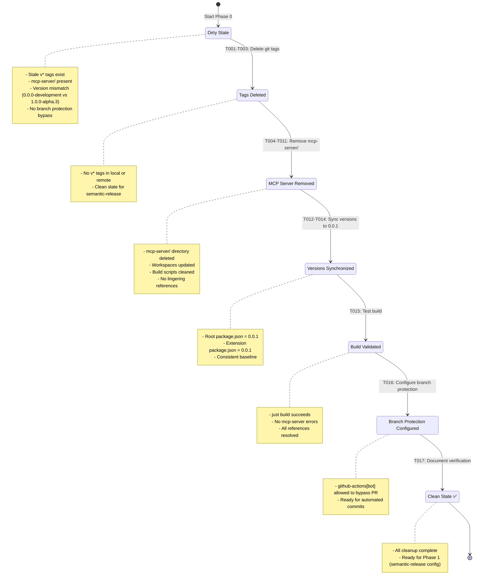
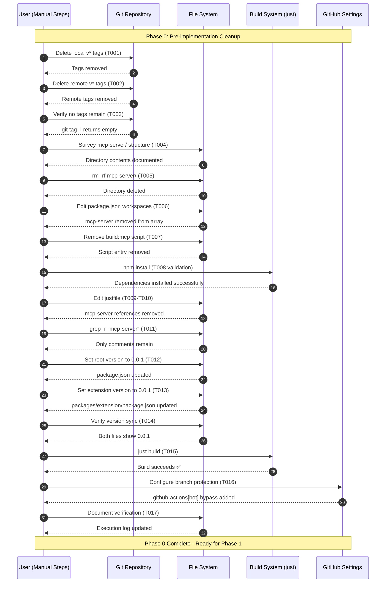

# Phase 0: Pre-implementation Cleanup - Tasks & Alignment Brief

**Phase**: Phase 0: Pre-implementation Cleanup
**Slug**: phase-0
**Plan**: [automated-vsix-releases-plan.md](../../automated-vsix-releases-plan.md)
**Spec**: [automated-vsix-releases-spec.md](../../automated-vsix-releases-spec.md)
**Created**: 2025-10-19
**Status**: READY

---

## Tasks

| Status | ID | Task | Type | Dependencies | Absolute Path(s) | Validation | Subtasks | Notes |
|--------|----|----|------|--------------|------------------|------------|----------|-------|
| [x] | T001 | Delete existing version tags from local repository (USER ACTION REQUIRED) | Setup | – | N/A (git commands) | All local v* tags removed: `git tag -l` shows no v* tags | – | Deleted v1.0.0-alpha.1, v1.0.0-alpha.2, v1.0.0-alpha.3 [^29] |
| [x] | T002 | Delete existing version tags from remote repository (USER ACTION REQUIRED) | Setup | T001 | N/A (git commands) | All remote v* tags removed: `git ls-remote --tags origin` shows no v* tags | – | Deleted remote tags via git push origin --delete [^29] |
| [x] | T003 | Verify no version tags remain in repository | Setup | T002 | N/A (git commands) | `git tag -l` returns empty; `git ls-remote --tags origin` shows no v* tags | – | Verified: no v* tags in local or remote [^29] |
| [x] | T004 | Survey mcp-server/ directory structure before removal | Setup | – | /workspaces/vsc-bridge-devcontainer/mcp-server/ | Documented directory contents for reference | – | Surveyed 2.6M directory with TypeScript source, compiled output, tests, Docker config [^1] |
| [x] | T005 | Remove mcp-server/ directory from repository | Core | T004 | /workspaces/vsc-bridge-devcontainer/mcp-server/ | Directory no longer exists: `test ! -d mcp-server/` | – | Supports plan task 0.5 · log#t005-remove-mcp-server-directory-from-repository [^2] |
| [ ] | T006 | Remove mcp-server from root package.json workspaces array | Core | T005 | /workspaces/vsc-bridge-devcontainer/package.json | "mcp-server" not in workspaces array | – | Edit package.json, remove "mcp-server" from workspaces |
| [ ] | T007 | Remove build:mcp script from root package.json | Core | T006 | /workspaces/vsc-bridge-devcontainer/package.json | No "build:mcp" key in scripts object | – | Serial (same file as T006) |
| [ ] | T008 | Regenerate package-lock.json after workspace removal | Core | T007 | /workspaces/vsc-bridge-devcontainer/package.json, /workspaces/vsc-bridge-devcontainer/package-lock.json | Valid JSON; no syntax errors; fresh lockfile with no mcp-server references; npm install succeeds | – | Delete package-lock.json and regenerate: `rm package-lock.json && npm install`. Prevents ghost workspace references in lockfile. |
| [ ] | T009 | Remove lint:mcp command from justfile | Core | T005 | /workspaces/vsc-bridge-devcontainer/justfile | No "lint:mcp" or "lint-mcp" recipes | – | Edit justfile, remove mcp-server build/lint commands |
| [ ] | T010 | Remove other mcp-server references from justfile | Core | T009 | /workspaces/vsc-bridge-devcontainer/justfile | No "mcp-server" or "mcp_server" strings in file | – | Serial (same file as T009); check for build dependencies |
| [ ] | T011 | Grep for remaining mcp-server references in codebase | Core | T010 | /workspaces/vsc-bridge-devcontainer/ (entire repo) | `grep -r "mcp-server" --exclude-dir=.git` returns only comments explaining removal | – | Comprehensive search; exceptions: this plan doc, comments noting removal |
| [ ] | T012 | Set root package.json version to 0.0.1 | Core | T008 | /workspaces/vsc-bridge-devcontainer/package.json | Root package.json version field = "0.0.1" | – | Edit package.json, set "version": "0.0.1" |
| [ ] | T013 | Set packages/extension/package.json version to 0.0.1 | Core | T012 | /workspaces/vsc-bridge-devcontainer/packages/extension/package.json | Extension package.json version field = "0.0.1" | – | Serial execution (depends on T012 to avoid race condition in T014 validation) |
| [ ] | T014 | Verify version synchronization | Core | T013 | /workspaces/vsc-bridge-devcontainer/package.json, /workspaces/vsc-bridge-devcontainer/packages/extension/package.json | Both files show version "0.0.1" | – | Read both files and compare version fields |
| [ ] | T015 | Test full build after cleanup | Integration | T014 | /workspaces/vsc-bridge-devcontainer/ | `just build` completes successfully with no mcp-server errors | – | Critical validation; catches broken references |
| [ ] | T016 | Configure branch protection to allow github-actions[bot] bypass | Setup | T015 | N/A (GitHub settings, not code) | GitHub Settings → Branches → main → "Allow specified actors to bypass required pull requests" includes `github-actions[bot]` | – | **USER ACTION REQUIRED**: Manual GitHub UI configuration. Navigate to Settings → Branches → Branch protection rules for `main` → Add `github-actions[bot]` to bypass list. Required for semantic-release to commit version bumps without PR. |
| [ ] | T017 | Document manual verification checklist | Doc | T016 | N/A (execution log) | Execution log includes: tag cleanup confirmation, mcp-server removal verification, version sync proof, build success output, branch protection screenshot/confirmation | – | Comprehensive verification summary for audit trail |

**Total Tasks**: 17
**Parallel-Eligible Tasks**: None (all tasks run serially due to cleanup order and race condition prevention)
**Serial Dependencies**: All tasks sequential - cleanup order critical, version sync must avoid race conditions

---

## Alignment Brief

### Objective

**Primary Goal**: Remove obsolete mcp-server/ directory and synchronize all package.json files to version 0.0.1, preparing the repository for semantic-release automation.

**Why This Phase Matters**:
- Semantic-release requires a clean version baseline (0.0.1) to start calculating future versions
- Removing mcp-server/ eliminates confusion and reduces maintenance burden (it's been replaced by CLI-integrated MCP per Plan 13)
- Deleting existing git tags prevents semantic-release from miscalculating versions based on stale tags
- Configuring branch protection ensures automated release workflow can commit version bumps without manual intervention

**Behavior Checklist** (tied to plan acceptance criteria):
- [ ] All existing v* tags deleted from local and remote repository
- [ ] `git tag -l` returns no v* tags (clean slate for semantic-release)
- [ ] mcp-server/ directory removed from repository
- [ ] No "mcp-server" in package.json workspaces array
- [ ] No build:mcp or lint:mcp scripts in package.json
- [ ] justfile contains no mcp-server build commands
- [ ] `grep -r "mcp-server"` returns only comments explaining removal
- [ ] Root package.json version = "0.0.1"
- [ ] packages/extension/package.json version = "0.0.1"
- [ ] `just build` completes without errors
- [ ] Branch protection configured to allow github-actions[bot] to bypass PR requirements
- [ ] All cleanup committed as single atomic commit

---

### Non-Goals (Scope Boundaries)

❌ **NOT doing in Phase 0:**

1. **Installing or configuring semantic-release** - Phase 1 handles .releaserc.json configuration and semrel-prepare.mjs script creation
2. **Updating justfile build recipes** - Phase 2 modifies package-extension recipe to output to artifacts/
3. **Creating GitHub Actions workflows** - Phase 3 creates pr-title.yml and updates build-and-release.yml
4. **Writing documentation** - Phase 5 creates docs/how/releases/ guides
5. **Testing the release workflow** - Phase 4 performs dry-run testing and validation
6. **Creating CHANGELOG.md** - Generated automatically by semantic-release in Phase 1
7. **Migrating existing releases or data** - Starting fresh from 0.0.1; no migration needed
8. **Handling merge conflicts** - Assuming clean working directory; conflicts resolved before Phase 0
9. **Optimizing build performance** - Focus is on cleanup, not optimization
10. **User-facing announcements** - This is internal infrastructure; no public communication needed

**Scope Boundaries Rationale**: Phase 0 is strictly pre-implementation cleanup. We're establishing a foundation (clean versions, no obsolete code, proper git tag state, correct branch protection) but not yet implementing the release automation machinery. Each subsequent phase builds on this clean slate.

---

### Critical Findings Affecting This Phase

**Summary**: No critical discoveries from plan § 3 directly impact Phase 0 implementation. Phase 0 is foundational cleanup; critical findings apply to later phases (version bump timing, VSIX packaging, PR title validation, git history requirements, pre-release branches).

**Indirect Considerations**:
- **Discovery 04 (Full Git History)**: By deleting existing v* tags in T001-T003, we ensure semantic-release starts from a clean baseline when it begins calculating versions in Phase 1+
- **Shared Versioning Strategy** (from spec clarifications): All package.json files must share the same version (T012-T014 enforce this)

**Tasks Addressing Cleanup Foundation**:
- T001-T003: Clean git tag state (enables Discovery 04's full history approach in Phase 1)
- T012-T014: Version synchronization (enforces shared versioning strategy)
- T016: Branch protection (enables semantic-release bot to bypass PR requirements in Phase 1+)

---

### Previous Phase Review

**N/A** - Phase 0 is the first implementation phase. No previous phase to review.

---

### Invariants & Guardrails

**Invariants** (conditions that must remain true throughout Phase 0):

1. **Valid package.json structure**: All edits to package.json must maintain valid JSON syntax
2. **Buildable state**: Repository must remain buildable after each change (`just build` must succeed)
3. **No uncommitted changes before start**: Working directory should be clean before Phase 0 begins
4. **Atomic commits**: All changes should be committed as a single atomic commit after validation

**Guardrails** (safety constraints):

1. **No automated git modifications**: Git tag deletions and branch protection configuration are **USER ACTION REQUIRED** - never automated via tools
2. **Backup before deletion**: User should backup mcp-server/ directory contents if needed (though it's obsolete)
3. **Validation gates**: T003 (tag verification), T008 (package.json validation), T015 (build verification) serve as safety checkpoints
4. **Grep exceptions**: T011 allows comments explaining mcp-server removal (this plan, execution logs)

**Performance/Memory Budgets**: N/A (cleanup operations, no runtime performance considerations)

**Security Considerations**:
- Git tag deletion requires push access to remote repository
- Branch protection configuration requires admin access to GitHub repository settings
- No secrets or credentials involved in this phase

---

### Inputs to Read

**Required Files** (read before starting implementation):

1. `/workspaces/vsc-bridge-devcontainer/package.json` - Root workspace configuration
2. `/workspaces/vsc-bridge-devcontainer/packages/extension/package.json` - Extension version
3. `/workspaces/vsc-bridge-devcontainer/justfile` - Build system recipes
4. `/workspaces/vsc-bridge-devcontainer/mcp-server/` (directory) - Survey before removal

**Context Files** (for understanding):

1. `/workspaces/vsc-bridge-devcontainer/docs/plans/17-automated-vsix-releases/automated-vsix-releases-spec.md` - Feature specification
2. `/workspaces/vsc-bridge-devcontainer/docs/plans/17-automated-vsix-releases/automated-vsix-releases-plan.md` - Full implementation plan

**Git State to Check**:
- `git tag -l` - List local tags
- `git ls-remote --tags origin` - List remote tags
- `git status` - Ensure clean working directory

---

### Visual Alignment Aids

#### System State Flow Diagram



#### Actor Interaction Sequence



---

### Test Plan

**Testing Approach**: Manual Only (per spec § Testing Strategy)

**Rationale**: Phase 0 is cleanup and configuration. Testing consists of manual verification checkpoints embedded in task validation criteria.

**No Automated Tests** because:
- File deletions and edits are one-time operations (no regression risk)
- Build validation (`just build`) is the test
- Git tag operations must be verified manually
- Branch protection is GitHub UI configuration (not testable in code)

**Manual Validation Steps**:

1. **Tag Deletion Validation** (T001-T003):
   ```bash
   # Before T001: Check current tags
   git tag -l
   # Expected: Shows existing v* tags

   # After T002: Verify tags deleted
   git tag -l
   git ls-remote --tags origin
   # Expected: No v* tags in either local or remote
   ```

2. **MCP Server Removal Validation** (T004-T011):
   ```bash
   # Before T005: Document structure
   tree mcp-server/ -L 2

   # After T005: Verify directory gone
   test ! -d mcp-server/ && echo "Directory removed" || echo "ERROR: Still exists"

   # After T011: Verify no references
   grep -r "mcp-server" --exclude-dir=.git --exclude-dir=docs/plans
   # Expected: No results (except this plan doc itself)
   ```

3. **Package.json Validation** (T006-T008):
   ```bash
   # After T007: Verify valid JSON and no mcp-server
   cat package.json | jq '.workspaces, .scripts.build:mcp'
   # Expected: workspaces array has no "mcp-server", build:mcp is null

   # After T008: Verify installable
   npm install
   # Expected: No errors
   ```

4. **Version Sync Validation** (T012-T014):
   ```bash
   # After T014: Verify both files show 0.0.1
   echo "Root version: $(jq -r .version package.json)"
   echo "Extension version: $(jq -r .version packages/extension/package.json)"
   # Expected: Both output "0.0.1"
   ```

5. **Build Validation** (T015):
   ```bash
   # Critical test: Build must succeed
   just build
   # Expected: No errors, no mcp-server references
   ```

6. **Branch Protection Validation** (T016):
   - Navigate to GitHub repo → Settings → Branches
   - Select main branch protection rule
   - Scroll to "Allow specified actors to bypass required pull requests"
   - Verify `github-actions[bot]` is in the list
   - Screenshot or note confirmation in execution log

---

### Step-by-Step Implementation Outline

**Mapped 1:1 to Tasks Table**:

**Setup Phase** (T001-T004):
1. T001: User deletes local git tags: `git tag -l "v*" | xargs git tag -d`
2. T002: User deletes remote git tags: `git ls-remote --tags origin | grep "v" | cut -f2 | xargs -n1 git push origin --delete`
3. T003: Verify no tags remain: `git tag -l` (should be empty)
4. T004: Survey mcp-server/ directory: `tree mcp-server/ -L 2` or `ls -la mcp-server/`

**Core Cleanup** (T005-T011):
5. T005: Remove mcp-server/: `rm -rf mcp-server/`
6. T006: Edit package.json, remove "mcp-server" from workspaces array
7. T007: Edit package.json, remove "build:mcp" from scripts
8. T008: Regenerate lockfile: `rm package-lock.json && npm install` (ensures clean workspace state)
9. T009: Edit justfile, remove "lint:mcp" recipe
10. T010: Edit justfile, remove other mcp-server references
11. T011: Grep for remaining references: `grep -r "mcp-server" --exclude-dir=.git`

**Version Sync** (T012-T014):
12. T012: Edit package.json, set `"version": "0.0.1"`
13. T013: Edit packages/extension/package.json, set `"version": "0.0.1"`
14. T014: Verify sync: `jq .version package.json packages/extension/package.json`

**Integration & Validation** (T015-T017):
15. T015: Test build: `just build` (must succeed without mcp-server errors)
16. T016: User configures GitHub branch protection via UI (add github-actions[bot] to bypass list)
17. T017: Document all verification results in execution log

**Final Step**: Commit all changes as single atomic commit:
```bash
git status
git add -A
git commit -m "chore(plan-17): Phase 0 cleanup - remove mcp-server, sync versions to 0.0.1

- Deleted all v* git tags (local and remote)
- Removed obsolete mcp-server/ directory
- Updated workspaces and build scripts to remove mcp-server references
- Synchronized all package.json versions to 0.0.1
- Configured branch protection for github-actions[bot]
- Verified build succeeds

Refs: #17 Phase 0 Pre-implementation Cleanup"
```

---

### Commands to Run

**Copy/Paste Command Reference** (grouped by task):

**Git Tag Cleanup** (USER ACTION REQUIRED):
```bash
# T001: Delete local tags
git tag -l "v*" | xargs git tag -d

# T002: Delete remote tags (CAUTION: requires push access)
git ls-remote --tags origin | grep "v" | cut -f2 | xargs -n1 git push origin --delete

# T003: Verify no tags remain
git tag -l
git ls-remote --tags origin
```

**MCP Server Removal**:
```bash
# T004: Survey directory
tree mcp-server/ -L 2

# T005: Remove directory
rm -rf mcp-server/

# T011: Grep for remaining references
grep -r "mcp-server" --exclude-dir=.git --exclude-dir=docs/plans
```

**Package.json Edits** (T006-T007, T012):
```bash
# Edit manually or use jq:
# Remove mcp-server from workspaces
jq 'del(.workspaces[] | select(. == "mcp-server"))' package.json > tmp.json && mv tmp.json package.json

# Remove build:mcp script
jq 'del(.scripts."build:mcp")' package.json > tmp.json && mv tmp.json package.json

# Set version to 0.0.1
jq '.version = "0.0.1"' package.json > tmp.json && mv tmp.json package.json

# T008: Regenerate package-lock.json for clean workspace state
rm package-lock.json && npm install
```

**Justfile Edits** (T009-T010):
```bash
# Edit manually with text editor
# Remove recipes: lint:mcp, lint-mcp, any mcp-server build steps
```

**Extension Version Sync** (T013):
```bash
# Set extension version to 0.0.1
jq '.version = "0.0.1"' packages/extension/package.json > tmp.json && mv tmp.json packages/extension/package.json
```

**Version Verification** (T014):
```bash
echo "Root version: $(jq -r .version package.json)"
echo "Extension version: $(jq -r .version packages/extension/package.json)"
# Both should output: 0.0.1
```

**Build Test** (T015):
```bash
just build
# Should complete with no mcp-server errors
```

**Branch Protection** (T016) - USER ACTION REQUIRED:
- Navigate to: https://github.com/{org}/{repo}/settings/branches
- Click "Edit" on main branch protection rule
- Scroll to "Allow specified actors to bypass required pull requests"
- Add `github-actions[bot]` to the list
- Click "Save changes"

**Final Commit**:
```bash
git status
git add -A
git commit -m "chore(plan-17): Phase 0 cleanup - remove mcp-server, sync versions to 0.0.1

- Deleted all v* git tags (local and remote)
- Removed obsolete mcp-server/ directory
- Updated workspaces and build scripts to remove mcp-server references
- Synchronized all package.json versions to 0.0.1
- Configured branch protection for github-actions[bot]
- Verified build succeeds

Refs: #17 Phase 0 Pre-implementation Cleanup"
git push origin feat/npx-github-installation  # or appropriate branch
```

---

### Risks & Unknowns

**Identified Risks** (from plan § Phase 0 Risks):

| Risk | Likelihood | Impact | Mitigation | Tasks Affected |
|------|------------|--------|------------|----------------|
| Breaking existing builds | Low | Medium | Test `just build` after each cleanup step (T015) | T005-T011 |
| Git history conflicts | Low | Low | Commit cleanup as single atomic commit after validation | T001-T017 |
| Missing references to mcp-server | Medium | Low | Comprehensive grep in T011 | T011 |
| Insufficient permissions for git tag deletion | Medium | Medium | User must have push access; verify access before starting | T002 |
| Insufficient permissions for branch protection | Medium | Medium | User must have admin access; verify permissions before T016 | T016 |
| Accidentally deleting wrong tags | Low | High | Use explicit `"v*"` pattern; dry-run: `git tag -l "v*"` before deletion | T001-T002 |

**New Risks Discovered** (update during implementation):

- **Unknown dependency on mcp-server/ in build**: If justfile or scripts have hidden dependencies on mcp-server/, build may fail in T015
  - **Mitigation**: T004 surveys directory structure; T011 greps for all references; T015 validates build

- **Git tag deletion cascading failures**: If semantic-release or other tools cache tag information, deletion may cause issues
  - **Mitigation**: Starting fresh with 0.0.1 baseline; semantic-release recalculates from clean state

**Unknowns** (to investigate during implementation):

1. **Current git tag state**: How many v* tags exist? Are they local-only or also on remote?
   - **Investigation**: Run `git tag -l` and `git ls-remote --tags origin` before T001

2. **MCP server directory size**: How large is mcp-server/? Any large binaries or data?
   - **Investigation**: T004 surveys structure and sizes

3. **Hidden mcp-server references**: Are there references in .github/workflows, scripts/, or other locations?
   - **Investigation**: T011 comprehensive grep will reveal all references

**Severity Assessment**:
- **Critical**: Git tag deletion without backup (mitigated by USER ACTION REQUIRED flag)
- **High**: Breaking builds (mitigated by T015 validation gate)
- **Medium**: Missing permissions (mitigated by USER ACTION REQUIRED for T001-T002, T016)
- **Low**: All other risks

---

### Ready Check

**Prerequisites** (confirm before starting Phase 0):

- [ ] Working directory is clean: `git status` shows no uncommitted changes
- [ ] Current branch is appropriate for Phase 0 work (e.g., `feat/plan-17-phase-0` or `main`)
- [ ] User has push access to remote repository (required for T002 tag deletion)
- [ ] User has admin access to GitHub repository settings (required for T016 branch protection)
- [ ] Backup of mcp-server/ directory created if needed (though it's obsolete)
- [ ] User understands git tag deletion is permanent (T001-T002 are destructive)
- [ ] `just build` currently succeeds (baseline before cleanup)
- [ ] Node.js 22 and npm are installed and functional
- [ ] just build tool is installed and functional

**Go/No-Go Decision Points**:

**GO if**:
- All prerequisites checked above are ✅
- User acknowledges T001-T002 are permanent git modifications
- User has confirmed mcp-server/ is truly obsolete (per Plan 13, replaced by CLI MCP)
- User is ready to perform manual GitHub UI configuration (T016)

**NO-GO if**:
- Working directory has uncommitted changes (risk of losing work)
- Insufficient permissions for git operations or GitHub settings
- Uncertainty about mcp-server/ status (verify with team first)
- Build currently failing (fix existing issues before Phase 0)

**Final Approval** (after checklist):

- [ ] **I confirm all prerequisites are met and I'm ready to start Phase 0 implementation**
- [ ] **I understand T001-T002 require manual git commands (no tool automation)**
- [ ] **I understand T016 requires manual GitHub UI configuration**
- [ ] **I will create a single atomic commit after all tasks are complete**

**Next Step After GO**: Begin with T001 (git tag deletion). Proceed sequentially through tasks, validating at checkpoints T003, T008, T015.

---

## Phase Footnote Stubs

**NOTE**: This section will be populated during implementation by `/plan-6a-update-progress`.

**Current State**: No footnotes yet (Phase 0 not started).

**Footnote Allocation Authority**: `/plan-6a-update-progress` is the single source of truth for footnote numbering. Footnotes are assigned sequentially during implementation and synchronized between this dossier and the main plan's Change Footnotes Ledger (§ 12).

**Format**: Footnotes will follow the pattern:
```
[^N]: Modified [file:path/to/file](path/to/file#L123) - Description of change
```

**Current Footnotes**:

[^1]: Task 0.4 (T004) - Surveyed mcp-server/ directory structure before removal
  - `file:docs/plans/17-automated-vsix-releases/tasks/phase-0/execution.log.md` - Documented 2.6M directory containing TypeScript source, compiled output, tests, and Docker configuration

[^2]: Task 0.5 (T005) - Removed obsolete mcp-server/ directory
  - `file:mcp-server` - Deleted 2.6M directory containing TypeScript source, compiled output, tests, and Docker config

[^29]: Tasks 0.1-0.2 (T001-T003) - Deleted existing version tags from local and remote repository
  - [`file:/workspaces/vsc-bridge-devcontainer/docs/plans/17-automated-vsix-releases/tasks/phase-0/execution.log.md`](/workspaces/vsc-bridge-devcontainer/docs/plans/17-automated-vsix-releases/tasks/phase-0/execution.log.md#t001-t003-delete-existing-version-tags-from-repository) - Removed v1.0.0-alpha.1, v1.0.0-alpha.2, v1.0.0-alpha.3 from local and remote; verified clean slate with `git tag -l` and `git ls-remote --tags origin`

---

## Evidence Artifacts

### Execution Log

**Location**: `/workspaces/vsc-bridge-devcontainer/docs/plans/17-automated-vsix-releases/tasks/phase-0/execution.log.md`

**Purpose**: Real-time documentation of implementation progress, decisions, and validation results.

**Created By**: `/plan-6-implement-phase` command during implementation.

**Expected Contents**:
- Timestamp-marked entries for each task
- Command outputs (git tag listings, grep results, build logs)
- Validation checkpoints (T003, T008, T014, T015 results)
- Screenshots or confirmation of branch protection configuration (T016)
- Any deviations from plan or unexpected discoveries
- Final commit hash and verification summary

### Supporting Files

**None expected** - Phase 0 is cleanup only, no new artifacts created.

---

## Directory Layout

```
docs/plans/17-automated-vsix-releases/
├── automated-vsix-releases-spec.md      # Feature specification
├── automated-vsix-releases-plan.md      # Full implementation plan
└── tasks/
    └── phase-0/
        ├── tasks.md                     # THIS FILE - Tasks and alignment brief
        └── execution.log.md             # Created by /plan-6 during implementation
```

**Future Phases** will follow the same structure:
- `tasks/phase-1/tasks.md` + `execution.log.md`
- `tasks/phase-2/tasks.md` + `execution.log.md`
- etc.

---

**End of Phase 0 Tasks Dossier**

**Status**: READY - Awaiting explicit GO from user to begin implementation via `/plan-6-implement-phase --phase "Phase 0: Pre-implementation Cleanup"`
