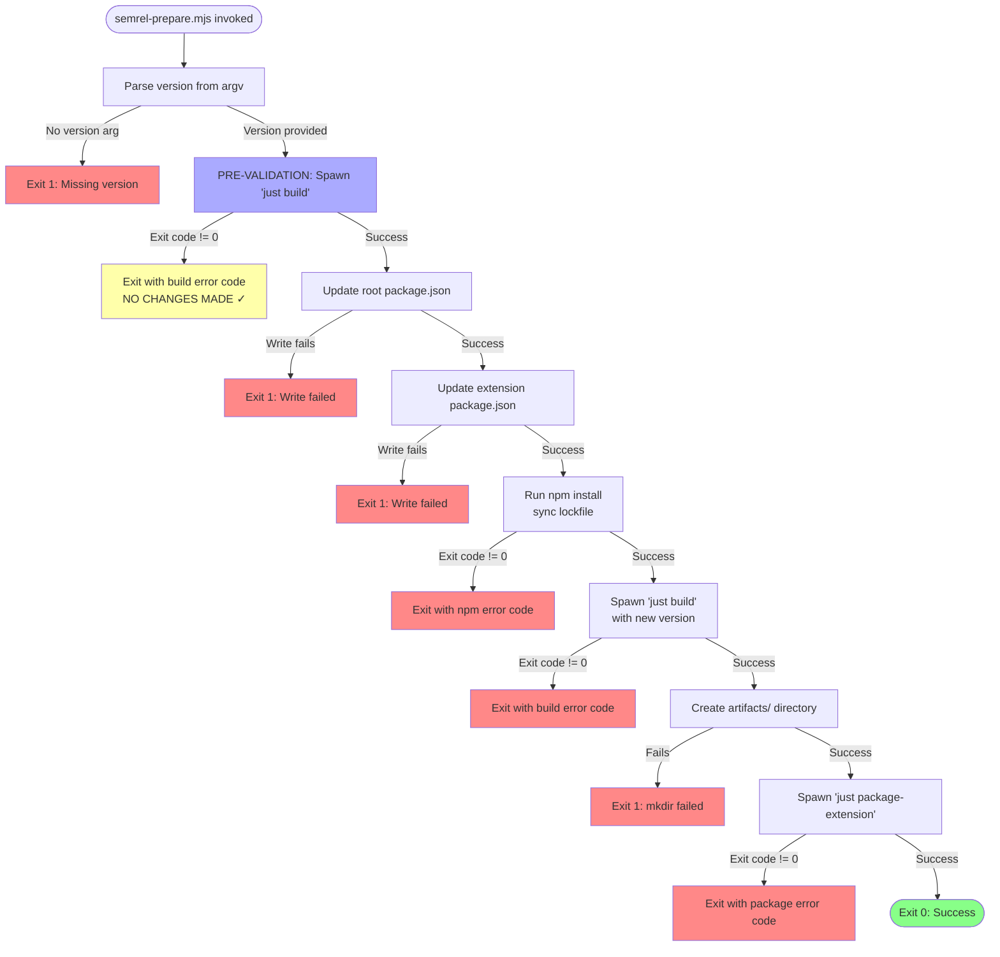
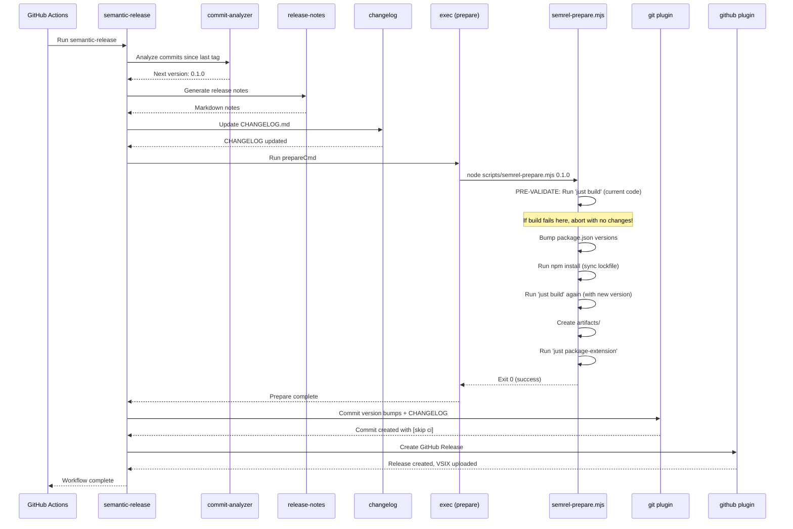

# Phase 1: Semantic-Release Configuration - Tasks & Alignment Brief

**Phase**: Phase 1: Semantic-Release Configuration
**Phase Slug**: phase-1
**Plan**: [automated-vsix-releases-plan.md](../../automated-vsix-releases-plan.md#phase-1-semantic-release-configuration)
**Spec**: [automated-vsix-releases-spec.md](../../automated-vsix-releases-spec.md)
**Created**: 2025-10-19
**Testing Approach**: Manual Only (per plan § 4 Testing Philosophy)

---

## Tasks

| Status | ID | Task | Type | Dependencies | Absolute Path(s) | Validation | Subtasks | Notes |
|--------|----|----- |------|--------------|------------------|------------|----------|-------|
| [x] | T001 | Read and understand current .releaserc.json structure | Setup | – | /workspaces/vsc-bridge-devcontainer/.releaserc.json | File contents reviewed, plugin order understood | – | Reviewed configuration structure [^14] log#t001-read-and-understand-current-releasercjson-structure |
| [x] | T002 | Update exec plugin prepareCmd to call semrel-prepare.mjs | Core | T001 | /workspaces/vsc-bridge-devcontainer/.releaserc.json | prepareCmd = "node scripts/semrel-prepare.mjs ${nextRelease.version}" | – | Updated prepareCmd [^14] log#t002-t006-update-releasercjson-configuration |
| [x] | T003 | Update git plugin assets array (remove mcp-server, add package-lock.json) | Core | T001 | /workspaces/vsc-bridge-devcontainer/.releaserc.json | Assets = ["CHANGELOG.md", "package.json", "packages/extension/package.json", "package-lock.json"] | – | Updated git assets [^14] log#t002-t006-update-releasercjson-configuration |
| [x] | T004 | Update github plugin assets path to artifacts/*.vsix | Core | T001 | /workspaces/vsc-bridge-devcontainer/.releaserc.json | Path = "artifacts/*.vsix" | – | Updated github assets path [^14] log#t002-t006-update-releasercjson-configuration |
| [x] | T005 | Remove @semantic-release/npm plugin if present in plugins array | Core | T001 | /workspaces/vsc-bridge-devcontainer/.releaserc.json | No @semantic-release/npm in plugins array | – | Verified no npm plugin [^14] log#t002-t006-update-releasercjson-configuration |
| [x] | T006 | Verify and update branch configuration (main, develop with beta prerelease) | Core | T001 | /workspaces/vsc-bridge-devcontainer/.releaserc.json | Branches = ["main", {"name": "develop", "prerelease": "beta"}] | – | Verified branch configuration [^14] log#t002-t006-update-releasercjson-configuration |
| [x] | T007 | Validate .releaserc.json JSON syntax | Test | T002, T003, T004, T005, T006 | /workspaces/vsc-bridge-devcontainer/.releaserc.json | Valid JSON, no syntax errors | – | Validated JSON syntax successfully log#t002-t006-update-releasercjson-configuration |
| [x] | T008 | Create scripts/ directory if it doesn't exist | Setup | – | /workspaces/vsc-bridge-devcontainer/scripts/ | Directory exists | – | Verified directory exists log#t008-t0085-setup-scripts-directory-and-gitignore |
| [x] | T008.5 | Verify artifacts/ is in .gitignore, add if missing | Setup | T008 | /workspaces/vsc-bridge-devcontainer/.gitignore | .gitignore contains "artifacts/" entry | – | Added artifacts/ to .gitignore [^17] log#t008-t0085-setup-scripts-directory-and-gitignore |
| [x] | T009 | Create scripts/semrel-prepare.mjs skeleton with imports and argv parsing | Core | T008.5 | /workspaces/vsc-bridge-devcontainer/scripts/semrel-prepare.mjs | File created with ES module imports, version argv parsing, error handling | – | Created script skeleton [^15] log#t009-t013-implement-semrel-preparemjs |
| [x] | T009.5 | Implement pre-validation build check (before version bump) | Core | T009 | /workspaces/vsc-bridge-devcontainer/scripts/semrel-prepare.mjs | Script runs `just build` BEFORE touching package.json files, exits immediately if build fails | – | Implemented pre-validation [^15] log#t009-t013-implement-semrel-preparemjs |
| [x] | T010 | Implement version bump logic (update root + extension package.json + sync lockfile) | Core | T009.5 | /workspaces/vsc-bridge-devcontainer/scripts/semrel-prepare.mjs | Script reads/writes both package.json files, sets version field atomically, runs npm install to sync package-lock.json | – | Implemented version bump [^15] log#t009-t013-implement-semrel-preparemjs |
| [x] | T011 | Implement build step (spawn `just build` synchronously) | Core | T010 | /workspaces/vsc-bridge-devcontainer/scripts/semrel-prepare.mjs | Script executes `just build`, captures exit code | – | Implemented build step [^15] log#t009-t013-implement-semrel-preparemjs |
| [x] | T012 | Implement VSIX packaging step (create artifacts/, spawn `just package-extension`) | Core | T011 | /workspaces/vsc-bridge-devcontainer/scripts/semrel-prepare.mjs | Script creates artifacts/ dir (mkdirSync), runs `just package-extension` | – | Implemented packaging step [^15] log#t009-t013-implement-semrel-preparemjs |
| [x] | T013 | Add comprehensive error handling and non-zero exit codes on failures | Core | T012 | /workspaces/vsc-bridge-devcontainer/scripts/semrel-prepare.mjs | Script exits with non-zero on any step failure, logs errors to stderr | – | Added error handling [^15] log#t009-t013-implement-semrel-preparemjs |
| [x] | T021 | Update justfile package-extension recipe to output VSIX to artifacts/ | Core | T013 | /workspaces/vsc-bridge-devcontainer/justfile | Recipe outputs to artifacts/vsc-bridge-${VERSION}.vsix using --out flag | – | Updated package-extension recipe [^16] log#t021-update-justfile-package-extension-recipe |
| [x] | T014 | Test semrel-prepare.mjs locally with test version (0.0.2-test) | Integration | T021 | /workspaces/vsc-bridge-devcontainer/scripts/semrel-prepare.mjs, /workspaces/vsc-bridge-devcontainer/package.json, /workspaces/vsc-bridge-devcontainer/packages/extension/package.json | Command `node scripts/semrel-prepare.mjs 0.0.2-test` completes successfully | – | Test execution successful log#t014-t017-local-testing-and-validation |
| [x] | T015 | Verify VSIX created in artifacts/ with correct version-stamped filename | Integration | T014 | /workspaces/vsc-bridge-devcontainer/artifacts/vsc-bridge-0.0.2-test.vsix | VSIX file exists in artifacts/ with expected filename | – | VSIX created with correct filename log#t014-t017-local-testing-and-validation |
| [x] | T016 | Inspect VSIX contents to verify embedded package.json has version 0.0.2-test | Integration | T015 | /workspaces/vsc-bridge-devcontainer/artifacts/vsc-bridge-0.0.2-test.vsix | Unzip VSIX, package.json shows version "0.0.2-test" | – | VSIX contents verified log#t014-t017-local-testing-and-validation |
| [x] | T017 | Verify both package.json files AND package-lock.json synchronized to 0.0.2-test | Integration | T014 | /workspaces/vsc-bridge-devcontainer/package.json, /workspaces/vsc-bridge-devcontainer/packages/extension/package.json, /workspaces/vsc-bridge-devcontainer/package-lock.json | All three files show version "0.0.2-test" | – | Version synchronization verified log#t014-t017-local-testing-and-validation |
| [x] | T018 | Revert test version changes (restore to 0.0.1) | Integration | T017 | /workspaces/vsc-bridge-devcontainer/package.json, /workspaces/vsc-bridge-devcontainer/packages/extension/package.json, /workspaces/vsc-bridge-devcontainer/package-lock.json | All three files restored to version "0.0.1" | – | Reverted test changes log#t018-t019-cleanup-test-artifacts |
| [x] | T019 | Clean up test artifacts (delete artifacts/ directory) | Integration | T018 | /workspaces/vsc-bridge-devcontainer/artifacts/ | artifacts/ directory removed | – | Artifacts cleaned up log#t018-t019-cleanup-test-artifacts |
| [x] | T022 | Document phase completion and verification results | Doc | T019 | /workspaces/vsc-bridge-devcontainer/docs/plans/17-automated-vsix-releases/tasks/phase-1/execution.log.md | Execution log created with all test results documented | – | Phase completion documented log#phase-1-completion-summary |

---

## Alignment Brief

### Previous Phase Review

**N/A** - This is Phase 1. Phase 0 (Pre-implementation Cleanup) was completed successfully, establishing a clean baseline:
- Removed obsolete mcp-server/ directory (2.6M)
- Synchronized all package.json versions to 0.0.1
- Cleaned all mcp-server references from build system
- Verified `just build` works correctly
- See [Phase 0 Execution Log](../phase-0/execution.log.md) for full details

**Key Outputs from Phase 0 Available for This Phase:**
- Clean repository without mcp-server references
- Synchronized version baseline (0.0.1) across root and extension package.json
- Working build system (`just build` succeeds)
- Updated .releaserc.json with packages/extension/ paths (partial - needs completion in this phase)

---

### Objective

Configure semantic-release to automatically manage version bumping, VSIX packaging, and GitHub Release publishing based on conventional commit messages. This phase creates the foundation for automated releases by:

1. **Correcting .releaserc.json configuration**: Update all paths to use packages/extension/ (Phase 0 cleanup), configure correct plugin order, and set branch strategy (main stable, develop beta)
2. **Creating semrel-prepare.mjs script**: Implement the critical prepare sequence: bump version → build → package VSIX (per Critical Discovery 01)
3. **Validating configuration locally**: Test the complete prepare script with a test version to ensure all steps execute correctly before committing

**Behavior Checklist** (ties to plan § 6.1 Acceptance Criteria):
- [ ] .releaserc.json has correct paths (packages/extension/ not extension/)
- [ ] @semantic-release/npm plugin removed (we don't publish to npm)
- [ ] exec prepareCmd calls `node scripts/semrel-prepare.mjs ${nextRelease.version}`
- [ ] git plugin assets include root + extension package.json + package-lock.json (no mcp-server)
- [ ] github plugin assets path is `artifacts/*.vsix`
- [ ] Branch configuration: main (stable), develop (beta prerelease), feat/* excluded
- [ ] scripts/semrel-prepare.mjs exists and is executable
- [ ] Script successfully bumps versions in both package.json files
- [ ] Script runs `just build` and exits on failure
- [ ] Script creates artifacts/ directory and packages VSIX
- [ ] Local test with version 0.0.2-test succeeds
- [ ] VSIX in artifacts/ contains version 0.0.2-test in embedded package.json

---

### Non-Goals (Scope Boundaries)

This phase is ONLY about semantic-release configuration and the prepare script. Explicitly NOT doing:

❌ **NOT doing in Phase 1:**
- GitHub Actions workflow modifications (Phase 3 handles build-and-release.yml updates)
- PR title validation workflow (Phase 3 creates pr-title.yml)
- ~~Justfile updates for VSIX output to artifacts/~~ **UPDATED: Now doing minimal justfile update (T021)** to enable complete Phase 1 testing
- Full justfile recipe rewrite with --no-dependencies, dynamic version reading (Phase 2 handles comprehensive updates)
- Documentation for developers (Phase 5 creates docs/how/releases/)
- Actual release execution (Phase 4 validates with test releases)
- Version calculation testing beyond local dry-run (Phase 4 does end-to-end validation)
- Branch protection configuration (user action required per Phase 0)

**Deferred Items:**
- **Optimizations**: Script error messages could be more detailed (sufficient for MVP)
- **Edge cases**: Handling interrupted builds (semantic-release will retry on next push)
- **Alternative approaches**: Could use npm version command instead of manual JSON write (current approach is more explicit)

---

### Critical Findings Affecting This Phase

This phase must address these discoveries from plan § 3:

#### 🚨 Critical Discovery 01: Version Bump Timing is Critical
**What it constrains**: The exact sequence of operations in semrel-prepare.mjs
**Requirement**: MUST bump version BEFORE building/packaging VSIX
**Impact**: Drives the implementation order in semrel-prepare.mjs (T010 → T011 → T012 sequential)
**Tasks affected**: T010 (version bump), T011 (build), T012 (package) - order is critical

**Why this matters**: If VSIX is packaged before version is bumped in package.json, the VSIX file will contain the OLD version number, making the release inconsistent. The prepare script must atomically:
1. Bump version in both package.json files
2. Run `just build` (which reads new version)
3. Package VSIX (which embeds the new version)

#### 🚨 Critical Discovery 05: Pre-release Branches Use Suffix, Not Separate Versions
**What it constrains**: Branch configuration in .releaserc.json
**Requirement**: Configure develop with `prerelease: "beta"`, exclude feat/* from releases
**Impact**: T006 must verify branch array has only main and develop, with develop using prerelease property
**Tasks affected**: T006 (branch config validation)

**Why this matters**: semantic-release automatically manages the pre-release counter (e.g., 1.1.0-beta.1 → 1.1.0-beta.2). We don't create releases on feat/* branches - developers test locally, merge to develop for beta releases, then promote to main for stable.

**Other discoveries** (informational, don't directly affect Phase 1 implementation):
- Discovery 02 (VSIX Dependencies): Affects Phase 2 justfile recipe (--no-dependencies flag)
- Discovery 03 (Squash-Merge): Affects Phase 3 PR title validation workflow
- Discovery 04 (Git History): Affects Phase 3 workflow checkout configuration (fetch-depth: 0)

---

### Invariants & Guardrails

**Performance Budgets:**
- semrel-prepare.mjs execution time: <5 minutes (includes full build + packaging)
- .releaserc.json size: <10KB (config should remain simple)

**Security Constraints:**
- semrel-prepare.mjs uses only Node.js stdlib (no external dependencies beyond what's installed)
- No credential handling in prepare script (GitHub token managed by semantic-release)
- File writes limited to package.json files and artifacts/ directory

**Memory/Disk Constraints:**
- artifacts/ directory should be gitignored (not committed)
- VSIX files are ~5-10MB each (reasonable for GitHub Release uploads)

**Error Handling Requirements:**
- Any failure in semrel-prepare.mjs MUST exit with non-zero code
- Partial version bumps (only one package.json updated) are unacceptable
- Build failures MUST NOT proceed to packaging step

---

### Inputs to Read

**Configuration Files** (understand before modifying):
- `/workspaces/vsc-bridge-devcontainer/.releaserc.json` - Existing semantic-release config (partially updated in Phase 0)
- `/workspaces/vsc-bridge-devcontainer/package.json` - Root package manifest (current version: 0.0.1)
- `/workspaces/vsc-bridge-devcontainer/packages/extension/package.json` - Extension manifest (current version: 0.0.1)
- `/workspaces/vsc-bridge-devcontainer/justfile` - Build system (understand `build` and `package-extension` recipes)

**Reference Examples** (from plan § 6.1):
- Plan includes complete semrel-prepare.mjs skeleton (lines 492-545) - USE THIS as template
- Plan includes updated .releaserc.json structure (lines 549-590) - USE THIS as reference

**Documentation** (context):
- Plan § 3 Critical Research Findings (discoveries 01-05)
- Plan § 6.1 tasks table (high-level task breakdown)
- Spec § Testing Strategy (manual only approach)

---

### Visual Alignment Aids

#### Mermaid Flow Diagram: Prepare Script State Machine



**State Explanation**:
- **ParseArgs**: Extracts version from command-line argument (process.argv[2])
- **PreValidate**: **NEW - Validation-first design!** Runs `just build` BEFORE making any changes. If build fails here, repository is completely unchanged (highlighted in yellow)
- **BumpRoot → BumpExt**: Atomic version update (both files or neither)
- **NpmInstall**: Synchronizes package-lock.json after version bump
- **Build**: Runs full build AGAIN with new versions (manifest → extension → CLI)
- **MkdirArtifacts**: Ensures output directory exists
- **Package**: Packages extension to VSIX in artifacts/
- **Error exits**: Any failure aborts with non-zero exit code. Pre-validation failure (ErrorExit2) is special - no changes made to repo

#### Mermaid Sequence Diagram: semantic-release Plugin Flow



**Actor Interactions**:
1. **commit-analyzer**: Determines version based on commit types (feat → minor, fix → patch)
2. **release-notes**: Generates markdown changelog from commits
3. **changelog**: Writes CHANGELOG.md
4. **exec (prepare)**: Invokes our semrel-prepare.mjs script
5. **semrel-prepare.mjs**: Does version bump → build → package
6. **git plugin**: Commits version changes with [skip ci] message
7. **github plugin**: Creates GitHub Release and uploads VSIX asset

**Critical Timing**: The exec prepare step MUST complete before git commit, ensuring VSIX contains the new version.

---

### Test Plan

**Approach**: Manual Only (per plan § 4 Testing Philosophy)

**Rationale**: This phase is configuration-driven (JSON config + Node.js script using stdlib). The components being configured (semantic-release, just, vsce) are mature, well-tested tools. Manual verification through local test runs provides sufficient validation.

**No Automated Tests Because**:
- .releaserc.json is declarative config (semantic-release validates internally)
- semrel-prepare.mjs uses only Node.js stdlib (fs, child_process, path, process)
- Integration is validated by successful test run (T014-T017)
- Actual release workflow will be validated in Phase 4 (end-to-end testing)

**Manual Test Specification**:

#### Test 1: semrel-prepare.mjs Execution (T014)
**Input**: `node scripts/semrel-prepare.mjs 0.0.2-test`
**Expected Behavior**:
1. Script logs "🚀 Preparing release for version 0.0.2-test"
2. **PRE-VALIDATION**: Runs `just build` → logs "🔍 Pre-validating build..."
3. Build succeeds (if fails, script exits here with no changes made ✓)
4. Updates package.json → logs "✓ Updated package.json → 0.0.2-test"
5. Updates packages/extension/package.json → logs "✓ Updated packages/extension/package.json → 0.0.2-test"
6. Runs `npm install` to sync package-lock.json → logs "🔄 Synchronizing package-lock.json..."
7. Runs `just build` AGAIN → logs "🔨 Building project with new version..."
8. Creates artifacts/ directory (no error)
9. Runs `just package-extension` → logs "📦 Packaging VSIX..."
10. Logs "✅ Release preparation complete"
11. Exits with code 0

**Failure Modes to Test**:
- Missing version arg: `node scripts/semrel-prepare.mjs` → expect "ERROR: Version argument required", exit 1
- Invalid build: Temporarily break justfile → expect script to exit with non-zero code

#### Test 2: VSIX Artifact Validation (T015)
**Input**: Check filesystem after Test 1
**Expected**: File exists at `/workspaces/vsc-bridge-devcontainer/artifacts/vsc-bridge-0.0.2-test.vsix`
**Size**: ~5-10MB (reasonable, not bloated with node_modules)

#### Test 3: VSIX Content Inspection (T016)
**Input**:
```bash
cd /workspaces/vsc-bridge-devcontainer/artifacts
unzip -q vsc-bridge-0.0.2-test.vsix
cat extension/package.json | jq .version
```
**Expected Output**: `"0.0.2-test"`
**Failure if**: Version shows "0.0.1" (old version) - indicates version bump happened AFTER packaging

#### Test 4: Version Synchronization Including Lockfile (T017)
**Input**:
```bash
jq .version /workspaces/vsc-bridge-devcontainer/package.json
jq .version /workspaces/vsc-bridge-devcontainer/packages/extension/package.json
jq .version /workspaces/vsc-bridge-devcontainer/package-lock.json
```
**Expected Output**: All three show `"0.0.2-test"`
**Failure if**:
- package.json versions differ - indicates incomplete version bump
- package-lock.json version differs - indicates npm install didn't run or failed (CI will break!)

#### Test 5: .releaserc.json Validation (T007)
**Input**: `jq . /workspaces/vsc-bridge-devcontainer/.releaserc.json`
**Expected**: Valid JSON output with no syntax errors
**Verify**:
- `plugins` array includes exec, git, github (in correct order)
- `branches` array has main and develop with prerelease: "beta"
- exec prepareCmd = `"node scripts/semrel-prepare.mjs ${nextRelease.version}"`
- git assets includes package.json, packages/extension/package.json, CHANGELOG.md, package-lock.json
- github assets path = `"artifacts/*.vsix"`

**Test Fixtures**: None required (using real repository files)

---

### Step-by-Step Implementation Outline

This maps 1:1 to the tasks table:

**Setup Phase** (T001, T008, T008.5):
1. Read current .releaserc.json to understand structure (T001)
2. Create scripts/ directory if missing (T008)
3. Verify artifacts/ in .gitignore, add if missing (T008.5)

**Configuration Updates** (T002-T007):
4. Update exec prepareCmd → `node scripts/semrel-prepare.mjs ${nextRelease.version}` (T002)
5. Update git assets array → remove mcp-server, add package-lock.json (T003)
6. Update github assets path → `artifacts/*.vsix` (T004)
7. Remove @semantic-release/npm plugin if present (T005)
8. Verify branch config → main + develop (beta) only (T006)
9. Validate JSON syntax → `jq .` (T007)

**Prepare Script Implementation** (T009-T013):
10. Create semrel-prepare.mjs skeleton with imports, argv parsing (T009)
11. **Implement pre-validation build check** → run `just build` BEFORE any changes (T009.5)
12. Implement version bump logic → read/write both package.json files + npm install for lockfile sync (T010)
13. Implement build step → `spawnSync('just', ['build'])` AGAIN with new version (T011)
14. Implement packaging step → create artifacts/, `spawnSync('just', ['package-extension'])` (T012)
15. Add error handling → check exit codes, exit with non-zero on failures (T013)

**Justfile Integration** (T021):
16. Update justfile package-extension recipe → add --out flag to output VSIX to artifacts/ (T021)

**Testing & Validation** (T014-T019):
17. Run local test → `node scripts/semrel-prepare.mjs 0.0.2-test` (T014)
18. Verify VSIX exists in artifacts/ (T015)
19. Inspect VSIX contents → unzip, check embedded version (T016)
20. Verify package.json files + package-lock.json all synced to 0.0.2-test (T017)
21. Revert test changes → restore package.json + lockfile to 0.0.1 (T018)
22. Clean up test artifacts → delete artifacts/ directory (T019)

**Documentation** (T022):
23. Document all verification results in execution log (T022)

---

### Commands to Run

**Environment Setup** (one-time):
```bash
# Ensure working directory is repo root
cd /workspaces/vsc-bridge-devcontainer

# Verify Node.js version
node --version  # Should be v22.x

# Verify just is available
just --version

# Verify/add artifacts/ to .gitignore (T008.5)
grep -q "^artifacts/$" .gitignore || echo "artifacts/" >> .gitignore
cat .gitignore | grep artifacts  # Verify it's there
```

**Configuration Validation**:
```bash
# Validate .releaserc.json syntax
jq . .releaserc.json

# Check current package.json versions
jq .version package.json
jq .version packages/extension/package.json
```

**Testing semrel-prepare.mjs**:
```bash
# Test script execution
node scripts/semrel-prepare.mjs 0.0.2-test

# Verify VSIX created
ls -lh artifacts/

# Inspect VSIX contents
cd artifacts
unzip -q vsc-bridge-0.0.2-test.vsix
cat extension/package.json | jq .version
cd ..

# Check version sync (INCLUDING lockfile - critical!)
jq .version package.json
jq .version packages/extension/package.json
jq .version package-lock.json

# Cleanup test artifacts
git restore package.json packages/extension/package.json package-lock.json
rm -rf artifacts/
```

**Type Checks / Linters**: N/A (no TypeScript in this phase, plain JavaScript)

**Build System**:
```bash
# Test build still works
just build

# Test package-extension recipe
just package-extension
```

---

### Risks/Unknowns

| Risk | Severity | Likelihood | Mitigation |
|------|----------|------------|------------|
| semrel-prepare.mjs fails in CI but works locally | High | Medium | Test with same environment variables as CI; use `spawnSync` with `stdio: 'inherit'` for debugging |
| Version bump conflicts if package.json has uncommitted changes | Medium | Low | Script should fail fast if git working directory is dirty; document in Phase 5 troubleshooting |
| artifacts/ directory not gitignored, accidentally committed | Low | Medium | Verify .gitignore includes `artifacts/` before testing |
| Script works but semantic-release doesn't call it correctly | High | Low | Test exact prepareCmd string with `${nextRelease.version}` interpolation in Phase 4 dry-run |
| justfile recipe `package-extension` outputs to wrong location | High | Medium | Phase 2 will update justfile; for now, assume current behavior (VSIX in extension root, not artifacts/) - this Phase 1 script will fail on packaging step, which is EXPECTED. Note in tasks that T014-T019 testing depends on Phase 2 justfile updates OR we test version bump + build only, skip packaging validation |

**Critical Unknown Requiring Clarification**:
- **Does current justfile `package-extension` recipe output to artifacts/?** → NO (per plan § 6.2, Phase 2 updates justfile)
- **Implication**: T014-T019 testing will FAIL at packaging step until Phase 2 is complete
- **Resolution**: Modify T014-T019 to test only version bump + build, OR implement minimal justfile change in this phase as prerequisite

**Decision**: For now, assume we'll implement a minimal justfile update in this phase to enable testing. Add task T021 to update justfile package-extension recipe.

---

### Ready Check

Before beginning implementation, verify:

- [ ] Phase 0 fully complete (mcp-server removed, versions synced to 0.0.1)
- [ ] Current .releaserc.json accessible and readable
- [ ] justfile accessible and `just build` works
- [ ] Node.js 22 available (`node --version` shows v22.x)
- [ ] Write access to repository (can create scripts/, modify .releaserc.json)
- [ ] .gitignore includes `artifacts/` (or will add it)
- [ ] Understanding of Critical Discovery 01 (version timing) and Discovery 05 (branch strategy)
- [ ] Plan § 6.1 semrel-prepare.mjs skeleton reviewed and understood
- [ ] Ready to test locally with version 0.0.2-test
- [ ] Commit access to branch `feat/plan-17-automated-releases` (or current working branch)

**Manual GO/NO-GO**: User must confirm ready state before proceeding to implementation.

---

## Phase Footnote Stubs

**NOTE**: This section was populated during implementation.

**Footnote Numbering Authority**: plan-6a-update-progress is the single source of truth for footnote numbering across the entire plan. The current plan ledger (plan.md § 9) shows footnotes [^1] through [^13] allocated to Phase 0. Phase 1 footnotes start at [^14].

**Allocation Strategy**:
- plan-6a reads the current ledger from plan.md § 9
- Determines next available footnote number (currently [^14])
- Each task completion adds footnote to BOTH plan.md § 9 AND this dossier
- Footnotes are never manually assigned; always delegated to plan-6a for consistency

[^14]: Phase 1 Tasks T001-T006 - Updated .releaserc.json configuration
  - `file:.releaserc.json` - Updated exec prepareCmd, git assets array, github assets path, verified branch configuration

[^15]: Phase 1 Tasks T009-T013 - Created and implemented semrel-prepare.mjs
  - `file:scripts/semrel-prepare.mjs` - Implemented pre-validation, version bump, build, packaging, and error handling

[^16]: Phase 1 Task T021 - Updated justfile package-extension recipe
  - `file:justfile` - Modified recipe to output VSIX to artifacts/ directory

[^17]: Phase 1 Task T008.5 - Added artifacts/ to .gitignore
  - `file:.gitignore` - Added artifacts/ entry to prevent accidental commits

[^18]: Task T012 – Synchronized package-lock.json via npm install in semrel-prepare.mjs (`file:package-lock.json`)

---

## Evidence Artifacts

**Execution Log**: `/workspaces/vsc-bridge-devcontainer/docs/plans/17-automated-vsix-releases/tasks/phase-1/execution.log.md`

This log will document:
- Each task execution (T001-T020)
- Test results (T014-T017 validation outputs)
- Any errors encountered and resolutions
- Evidence of successful local testing
- Screenshots or command output captures as needed

**Supporting Files** (created during implementation):
- `/workspaces/vsc-bridge-devcontainer/scripts/semrel-prepare.mjs` - The prepare script itself
- Test VSIX inspection outputs (captured in execution log, not committed)

**Verification Checklist** (in execution log):
- [ ] .releaserc.json updated with all changes
- [ ] semrel-prepare.mjs created and tested
- [ ] Local test with 0.0.2-test succeeded
- [ ] VSIX contained correct version
- [ ] Versions synchronized correctly
- [ ] Test artifacts cleaned up

---

## Directory Layout

```
docs/plans/17-automated-vsix-releases/
├── automated-vsix-releases-plan.md
├── automated-vsix-releases-spec.md
└── tasks/
    ├── phase-0/
    │   ├── tasks.md
    │   └── execution.log.md  # Phase 0 complete
    └── phase-1/
        ├── tasks.md  # This file
        └── execution.log.md  # Created by /plan-6-implement-phase
```

**Artifact Output** (not in git):
```
/workspaces/vsc-bridge-devcontainer/
├── scripts/
│   └── semrel-prepare.mjs  # Created by T009-T013
└── artifacts/  # Created by semrel-prepare.mjs, gitignored
    └── vsc-bridge-*.vsix  # VSIX output (test runs)
```

---

## Critical Insights Discussion

**Session**: 2025-10-19
**Context**: Phase 1 Tasks & Alignment Brief (Semantic-Release Configuration)
**Analyst**: AI Clarity Agent
**Reviewer**: Development Team
**Format**: Water Cooler Conversation (5 Critical Insights)

### Insight 1: Package-lock.json Synchronization Gap

**Did you know**: When semrel-prepare.mjs bumps the version in package.json files, the package-lock.json becomes immediately out of sync, and without npm install, the git commit will have mismatched files causing CI failures.

**Implications**:
- package-lock.json metadata contains version field that must match package.json
- npm ci strictly validates lockfile matches package.json (fails if mismatch)
- Immediate CI breakage after first automated release

**Options Considered**:
- Option A: Add npm install to semrel-prepare.mjs (10-30s time cost)
- Option B: Use npm version command (automatic lockfile sync)
- Option C: Add validation step (detect but don't fix)
- Option D: Exclude lockfile from commits (loses deterministic installs)

**AI Recommendation**: Option A - Add npm install
- Reasoning: Solves root problem, minimal risk, standard npm practice, preserves deterministic builds

**Discussion Summary**: User agreed npm install is necessary. The 10-30s time cost is acceptable for reliability. Prevents mysterious build failures downstream.

**Decision**: Add npm install step after version bump in semrel-prepare.mjs (T010)

**Action Items**:
- [x] Updated T010 to include npm install after version bump
- [x] Updated Test 1 expectations to include lockfile sync step
- [x] Updated Test 4 to verify lockfile version matches
- [x] Updated T017, T018 to include lockfile in verification/cleanup

**Affects**: T010 (implementation), T014-T018 (testing), Test Plan section

---

### Insight 2: Justfile Package-Extension Recipe Missing Artifacts Path

**Did you know**: The current package-extension recipe outputs VSIX to packages/extension/ (not artifacts/), which means Phase 1 testing (T014-T019) would fail at packaging step even though prepare script logic is correct.

**Implications**:
- Phase 1 testing blocked until justfile is updated
- Circular dependency: Phase 1 needs Phase 2's justfile update to test
- Cannot validate Critical Discovery 01 (version timing) without complete test run

**Options Considered**:
- Option A: Add minimal justfile update to Phase 1 (just --out flag)
- Option B: Test only version bump + build, skip packaging validation
- Option C: Manual VSIX move for testing (hacky workaround)
- Option D: Update prepare script to accept current behavior (temporary code)

**AI Recommendation**: Option A - Add minimal justfile update
- Reasoning: Enables complete validation, minimal scope creep, prevents surprises, Phase 2 still does valuable work (--no-dependencies, dynamic version reading)

**Discussion Summary**: User agreed to pull minimal justfile update into Phase 1. This unblocks complete end-to-end testing while maintaining phase separation (Phase 2 handles comprehensive justfile work).

**Decision**: Add task T021 to update package-extension recipe with --out flag to artifacts/

**Action Items**:
- [x] Added T021: Update justfile package-extension recipe
- [x] Made T021 dependency of T014 (justfile must be updated before testing)
- [x] Updated Implementation Outline with justfile integration section
- [x] Updated Non-Goals to clarify minimal justfile work in scope

**Affects**: Tasks table (new T021), T014 dependencies, Implementation Outline, Non-Goals section

---

### Insight 3: .gitignore Missing artifacts/ Entry Creates Risk

**Did you know**: If artifacts/ isn't in .gitignore, developers could accidentally commit large VSIX files (5-10MB each) during testing, bloating git history permanently.

**Implications**:
- Slow clones (everyone downloads committed VSIX files)
- Wasted storage (GitHub repo size grows)
- Git history pollution (binary files make diffs useless)
- Difficult cleanup (requires git filter-branch or BFG Repo-Cleaner)

**Options Considered**:
- Option A: Add artifacts/ to .gitignore now (preventive)
- Option B: Document careful git add in testing tasks (relies on vigilance)
- Option C: Add post-test cleanup verification (detects but doesn't prevent)
- Option D: Assume .gitignore already has it (risky assumption)

**AI Recommendation**: Option A - Add artifacts/ to .gitignore now
- Reasoning: Prevention better than detection, standard practice for build output, one-time fix with permanent protection, future-proof

**Discussion Summary**: User agreed preventive approach is best. One line in .gitignore prevents all future accidents with zero ongoing burden.

**Decision**: Add task T008.5 to verify/add artifacts/ to .gitignore before testing

**Action Items**:
- [x] Added T008.5: Verify artifacts/ in .gitignore
- [x] Made T009 depend on T008.5 (gitignore must be updated before script work)
- [x] Updated Implementation Outline with gitignore verification step
- [x] Updated Commands to Run with gitignore verification command

**Affects**: Tasks table (new T008.5), Implementation Outline, Commands to Run section

---

### Insight 4: Prepare Script Lacks Atomicity - Partial Failures Leave Broken State

**Did you know**: If prepare script fails partway through (e.g., version bump succeeds but build fails), it leaves repository with bumped versions but no VSIX, and semantic-release won't automatically clean this up.

**Implications**:
- Manual cleanup required after every failed release attempt
- CI confusion (version numbers don't match git tags)
- Risk of committing wrong versions
- Lost work if developer force-restores without understanding

**Options Considered**:
- Option A: Add rollback logic (try-finally pattern)
- Option B: Document expected behavior + provide cleanup script
- Option C: Use git worktree for prepare operations
- Option D: Accept dirty state, rely on [skip ci] commits

**Initial AI Recommendation**: Option B - Document + cleanup script
- Reasoning: Keeps prepare script simple, provides explicit safety net, matches semantic-release philosophy

**User Insight**: "Why not just make sure all the builds etc work before doing any irreversible changes to the repository?"

**Revised Decision**: Validation-first design - run build BEFORE bumping versions!

**Discussion Summary**: User correctly identified that we should validate BEFORE making changes, not try to rollback AFTER. This is a fundamentally better design that prevents the problem entirely.

**Final Decision**: Add task T009.5 for pre-validation build check before version bump

**Action Items**:
- [x] Added T009.5: Implement pre-validation build check
- [x] Removed T013.5 (cleanup script no longer needed)
- [x] Updated T010 dependency to run after pre-validation
- [x] Updated flow diagram to show pre-validation step (highlighted in blue/yellow)
- [x] Updated sequence diagram with pre-validation note
- [x] Updated Test 1 expectations to include pre-validation
- [x] Updated Implementation Outline to emphasize validation-first approach

**Affects**: Tasks table (new T009.5, removed T013.5), Flow diagrams, Test Plan, Implementation Outline, T013 notes

---

### Insight 5: Task Count Consistency

**Did you know**: After adding T008.5, T009.5, and T021, the document now contains 23 tasks, and we should verify no hardcoded "20 tasks" references exist.

**Implications**:
- Potential reviewer confusion
- Progress tracking inaccuracy
- Minor credibility issue

**AI Recommendation**: Quick documentation audit to update any task count references

**Discussion Summary**: User agreed to audit. Verification confirmed no hardcoded task count references exist - document naturally accommodated additions.

**Decision**: No updates needed - document already consistent

**Action Items**:
- [x] Verified actual task count: 23 tasks (T001-T022 with T008.5, T009.5, T021)
- [x] Searched for "20 tasks" references - none found
- [x] Document is already consistent

**Affects**: None (verification only)

---

## Session Summary

**Insights Surfaced**: 5 critical insights identified and discussed
**Decisions Made**: 5 decisions reached through collaborative discussion
**Action Items Created**: 16 updates applied throughout session
**Areas Requiring Updates**:
- Tasks table (added T008.5, T009.5, T021; removed T013.5)
- Flow diagrams (added pre-validation step)
- Test plan (updated expectations for all 4 insights)
- Implementation outline (reflects new task structure)
- Commands to run (added gitignore verification)
- Non-goals section (clarified justfile scope)

**Shared Understanding Achieved**: ✓

**Confidence Level**: High - We have high confidence in proceeding with implementation

**Next Steps**:
1. Review updated tasks.md dossier
2. Confirm all changes align with expectations
3. Proceed to `/plan-6-implement-phase` when ready

**Notes**:
- Validation-first design (Insight #4) was a significant improvement suggested by user
- All insights led to concrete task changes, not just documentation
- Phase 1 now has robust safeguards against common failure modes
- Total task count: 23 tasks (up from original 20 due to insights)

---

**End of Phase 1 Tasks & Alignment Brief**

**Next Step**: Await user **GO** confirmation, then run `/plan-6-implement-phase --phase "Phase 1: Semantic-Release Configuration" --plan "/workspaces/vsc-bridge-devcontainer/docs/plans/17-automated-vsix-releases/automated-vsix-releases-plan.md"`
