# Phase 2: Build System Integration - Tasks & Alignment Brief

**Phase**: Phase 2: Build System Integration
**Plan**: [automated-vsix-releases-plan.md](../../automated-vsix-releases-plan.md)
**Spec**: [automated-vsix-releases-spec.md](../../automated-vsix-releases-spec.md)
**Created**: 2025-10-19
**Status**: ✅ COMPLETE (13/13 tasks - 100%)

---

## Tasks

| Status | ID | Task | Type | Dependencies | Absolute Path(s) | Validation | Subtasks | Notes |
|--------|----|----|------|--------------|------------------|------------|----------|-------|
| [x] | T000 | Verify build environment healthy | Setup | – | /workspaces/vsc-bridge-devcontainer | Command `just build` completes successfully (exit 0) | – | Pre-flight check; ensures build works before testing packaging recipe; prevents false failure attribution (didyouknow insight #4) · [log#t000](execution.log.md#t000-verify-build-environment-healthy) |
| [x] | T001 | Verify package-extension recipe reads version dynamically from package.json | Verification | T000 | /workspaces/vsc-bridge-devcontainer/justfile | Recipe contains `VERSION=$(node -p "require('./package.json').version")` at line ~125 | – | Addresses plan task 2.1; already implemented in Phase 1 T021 · [log#t001](execution.log.md#t001-verify-dynamic-version-reading) |
| [x] | T002 | Verify artifacts/ directory creation in recipe | Verification | – | /workspaces/vsc-bridge-devcontainer/justfile | Recipe contains `mkdir -p artifacts` before vsce command | – | Addresses plan task 2.2; already implemented in Phase 1 T021 · [log#t002](execution.log.md#t002-verify-artifacts-directory-creation) |
| [x] | T003 | Verify --out flag specifies artifacts/ output path | Verification | – | /workspaces/vsc-bridge-devcontainer/justfile | vsce command includes `--out "../../artifacts/vsc-bridge-${VERSION}.vsix"` | – | Addresses plan task 2.3; implements Critical Discovery 02 · [log#t003](execution.log.md#t003-verify---out-flag-output-path) |
| [x] | T004 | Verify --no-dependencies flag is present | Verification | – | /workspaces/vsc-bridge-devcontainer/justfile | vsce command includes `--no-dependencies` flag | – | Addresses plan task 2.4; prevents bloated VSIX per Critical Discovery 02 · [log#t004](execution.log.md#t004-verify---no-dependencies-flag) |
| [x] | T005 | Verify --allow-star-activation flag matches extension configuration | Verification | – | /workspaces/vsc-bridge-devcontainer/justfile, /workspaces/vsc-bridge-devcontainer/packages/extension/package.json | If extension has `"activationEvents": ["*"]`, justfile must include `--allow-star-activation`; confirmed present at extension package.json:28-30 | – | Addresses plan task 2.5; flag required for extensions with * activation; architecturally required for vsc-bridge (HTTP/MCP servers must start immediately) · [log#t005](execution.log.md#t005-verify---allow-star-activation-flag-matches-extension-config) |
| [x] | T005.5 | Add activation event validation to justfile recipe | Core | T005 | /workspaces/vsc-bridge-devcontainer/justfile | Recipe validates `activationEvents: ["*"]` before packaging; fails fast with clear error if mismatch | – | Prevents future breakage if someone changes activation events; enforces architectural requirement; didyouknow insight #2 · [log#t005.5](execution.log.md#t0055-verify-activation-event-validation-check) |
| [x] | T006 | Test justfile recipe with current version (0.0.1) | Integration | T000, T001, T002, T003, T004, T005, T005.5 | /workspaces/vsc-bridge-devcontainer/justfile, /workspaces/vsc-bridge-devcontainer/artifacts/ | Command `just package-extension` completes successfully and creates VSIX at `artifacts/vsc-bridge-0.0.1.vsix` | – | Addresses plan task 2.6; validates complete build system integration including validation check; VSIX created 528.02 KB · [log#t006](execution.log.md#t006-test-packaging-with-current-version-001) |
| [x] | T007 | Verify VSIX filename includes version stamp | Integration | T006 | /workspaces/vsc-bridge-devcontainer/artifacts/ | VSIX file named `vsc-bridge-0.0.1.vsix` (version matches package.json) | – | Validates dynamic version reading works correctly · [log#t007](execution.log.md#t007-verify-vsix-filename-includes-version) |
| [x] | T008 | Inspect packaged VSIX contents and verify embedded version | Integration | T006 | /workspaces/vsc-bridge-devcontainer/artifacts/vsc-bridge-0.0.1.vsix | Unzip VSIX, check `extension/package.json` contains `"version": "0.0.1"` | – | Addresses plan task 2.7; confirms version synchronization end-to-end · [log#t008](execution.log.md#t008-inspect-vsix-contents-and-verify-embedded-version) |
| [x] | T009 | Verify VSIX size is reasonable (<10MB) | Integration | T006 | /workspaces/vsc-bridge-devcontainer/artifacts/vsc-bridge-0.0.1.vsix | VSIX file size under 10MB (confirms --no-dependencies working, not bloated with node_modules) | – | Validates Critical Discovery 02 implementation; size 540,696 bytes (EXCELLENT) · [log#t009](execution.log.md#t009-verify-vsix-size-is-reasonable) |
| [x] | T010 | Clean up test artifacts | Cleanup | T006, T007, T008, T009 | /workspaces/vsc-bridge-devcontainer/artifacts/ | artifacts/ directory emptied or removed after testing | – | Prepare for Phase 3; artifacts cleaned successfully · [log#t010](execution.log.md#t010-cleanup-test-artifacts) |
| [x] | T011 | Document Phase 2 completion and verification results | Doc | T000, T001, T002, T003, T004, T005, T005.5, T006, T007, T008, T009, T010 | /workspaces/vsc-bridge-devcontainer/docs/plans/17-automated-vsix-releases/tasks/phase-2/execution.log.md | Execution log documents all verification steps (including pre-flight build check), test results, validation check implementation, and confirms build system integration complete | – | Addresses plan task 2.8; creates evidence for phase completion · [log#t011](execution.log.md#t011-document-phase-2-completion-and-verification-results) |

---

## Plan Task Mapping

**Context**: The plan document (§ 6.2) defines Phase 2 with 8 high-level tasks (2.1-2.8). This dossier expands those into 12 detailed implementation tasks (T001-T011 + T005.5). This is natural planning evolution - the deep-dive analysis (plan-5) discovers details and validations that the initial plan (plan-3) didn't specify.

| Plan Task | Status | Dossier Tasks | Expansion Rationale |
|-----------|--------|---------------|---------------------|
| –   | **Addendum** | **T000** | **Setup**: Pre-flight build health check (didyouknow insight #4) - ensures build works before testing packaging |
| 2.1 | From Phase 1 T021 | T001 | **Verification**: Recipe reads version dynamically from package.json |
| 2.2 | From Phase 1 T021 | T002 | **Verification**: artifacts/ directory creation in recipe |
| 2.3 | From Phase 1 T021 | T003 | **Verification**: --out flag specifies artifacts/ output path |
| 2.4 | From Phase 1 T021 | T004 | **Verification**: --no-dependencies flag present (Critical Discovery 02) |
| 2.5 | From Phase 1 T021 | T005 | **Verification**: --allow-star-activation flag matches extension config |
| –   | **Addendum** | **T005.5** | **Implementation**: Add activation event validation (didyouknow insight #2) - enforces architectural requirement that extension must use "*" activation |
| 2.6 | Planned | T006 | **Integration test**: Run just package-extension with version 0.0.1 |
| 2.7 (partial) | Planned | T007 | **Verification**: VSIX filename includes version stamp |
| 2.7 (partial) | Planned | T008 | **Verification**: Inspect VSIX contents, verify embedded version |
| –   | **Addendum** | **T009** | **Verification**: VSIX size reasonable (<10MB) - explicit size validation from acceptance criteria |
| 2.8 (partial) | Planned | T010 | **Cleanup**: Remove test artifacts after verification |
| 2.8 (partial) | Planned | T011 | **Documentation**: Write execution log with all verification results |

**Summary**:
- **8 plan tasks** (2.1-2.8) → **13 dossier tasks** (T000-T011 + T005.5)
- **3 addendum tasks** discovered during planning:
  - T000: Pre-flight build check (didyouknow insight #4) - prevents false failure attribution
  - T005.5: Activation validation (didyouknow insight #2) - prevents future breakage
  - T009: Size validation - explicit enforcement of acceptance criterion
- **Task expansion is expected** - dossiers provide implementation detail that plans can't predict

---

## Alignment Brief

### Previous Phase Review

#### A. Completed Deliverables

**Configuration Files:**

1. **`/workspaces/vsc-bridge-devcontainer/.releaserc.json`**
   - Configures semantic-release automation for version management
   - Branch configuration: main (stable), develop (beta)
   - Plugin pipeline: commit-analyzer → release-notes-generator → changelog → exec → git → github
   - Exec prepareCmd: `node scripts/semrel-prepare.mjs ${nextRelease.version}`
   - Git assets: package.json files + package-lock.json + CHANGELOG.md
   - GitHub assets: `artifacts/*.vsix`

2. **`/workspaces/vsc-bridge-devcontainer/scripts/semrel-prepare.mjs`**
   - Atomic release preparation script with validation-first design
   - Execution sequence:
     1. Pre-validation build check (T009.5 - fail fast before changes)
     2. Version bump in package.json files
     3. npm install to sync package-lock.json
     4. Build with new version
     5. Package VSIX to artifacts/
   - Error handling with exit code propagation

3. **`/workspaces/vsc-bridge-devcontainer/justfile` (package-extension recipe)**
   - **CRITICAL**: This was pulled forward from Phase 2 during Phase 1 (T021)
   - Dynamic version reading from package.json
   - Creates artifacts/ directory
   - Packages VSIX with flags:
     - `--no-dependencies` (webpack bundles deps)
     - `--allow-star-activation` (extension uses * activation)
     - `--out artifacts/vsc-bridge-${VERSION}.vsix`
   - Output filename: `vsc-bridge-${VERSION}.vsix`

4. **`/workspaces/vsc-bridge-devcontainer/.gitignore`**
   - Added `artifacts/` entry to prevent accidental commits

5. **Version Synchronization State:**
   - All package.json files set to 0.0.1 baseline
   - Clean slate for semantic-release first run

6. **Documentation:**
   - `/workspaces/vsc-bridge-devcontainer/docs/plans/17-automated-vsix-releases/tasks/phase-1/tasks.md` - 23 tasks completed
   - `/workspaces/vsc-bridge-devcontainer/docs/plans/17-automated-vsix-releases/tasks/phase-1/execution.log.md` - Complete test evidence

#### B. Lessons Learned

**Deviations from Original Plan:**
- **T008.5**: Added .gitignore verification (not in original plan)
- **T009.5**: Added pre-validation build check for validation-first design (user-suggested improvement from didyouknow session)
- **T021**: **Pulled Phase 2 work into Phase 1** - Minimal justfile updates needed to enable complete Phase 1 testing

**Complexity Discovered:**
- Version synchronization requires three-file atomicity (package.json, extension/package.json, package-lock.json)
- Build timing critical: TWO builds needed (pre-validation + post-version-bump)
- Full prepare script takes ~2 minutes due to 3 builds (pre-validation, post-bump, vsce prepublish)

**Approaches That Worked:**
- **Validation-first design**: T009.5 pre-build check prevents repository corruption
- **Atomic version bumping**: Loop through package.json files + immediate npm install prevents lockfile desync
- **Explicit error handling**: `run()` helper with exit code checking provides clear failure points
- **Comprehensive logging**: Console output with emoji markers (🚀, ✓, 🔍, 🔨, 📦, ✅) aids debugging

**Design Improvements:**
- Package-lock.json sync via `npm install` after version bump (didyouknow insight #1)
- Artifacts directory creation with `recursive: true` ensures directory exists
- Dynamic version reading in justfile avoids parameter passing

#### C. Technical Discoveries

**Gotchas Encountered:**
- Lockfile desync risk if `npm install` not run after version changes
- Build artifacts accumulate without cleanup (`rm -rf artifacts/` needed)
- Version reversion for test cleanup required Node.js one-liners (git restore didn't work on uncommitted files)

**Limitations:**
- ~2 minute duration per release due to 3 builds (cannot optimize without breaking flow)
- No rollback mechanism - failure mid-script requires manual cleanup
- VSIX size not validated by script (future enhancement)

**Framework Constraints:**
- semantic-release prepareCmd timing: must run AFTER version calculation but BEFORE git commit
- vsce prepublish hook: runs webpack automatically (third build)
- justfile dependency: script relies on `just build` and `just package-extension` being available

#### D. Dependencies for Next Phase

**Phase 2 Can Build Upon:**

1. **Semantic-release infrastructure** (ready to use):
   - .releaserc.json correctly configured
   - scripts/semrel-prepare.mjs handles complete prepare sequence
   - Version bumping, building, packaging work end-to-end locally
   - **No changes needed**

2. **Build system foundation** (already updated):
   - ✅ `just package-extension` outputs to artifacts/
   - ✅ Dynamic version reading works
   - ✅ `--no-dependencies` flag configured
   - ✅ `--allow-star-activation` flag present
   - **Phase 2 is verification-only** - implementation already complete

3. **Testing pattern established:**
   ```bash
   # Test prepare script
   node scripts/semrel-prepare.mjs 0.0.2-test

   # Verify VSIX
   ls -lh artifacts/

   # Inspect contents
   unzip -q artifacts/vsc-bridge-0.0.2-test.vsix
   cat extension/package.json | jq .version

   # Cleanup
   rm -rf artifacts/
   ```

#### E. Critical Findings Applied

**Critical Discovery 01: Version Bump Timing is Critical**
- ✅ **FULLY ADDRESSED** in Phase 1
- Implementation: `scripts/semrel-prepare.mjs` executes correct sequence
- File references: `file:/workspaces/vsc-bridge-devcontainer/scripts/semrel-prepare.mjs`

**Critical Discovery 02: VSIX Dependencies Must Be Bundled**
- ⚠️ **PARTIALLY ADDRESSED** in Phase 1 (minimal implementation via T021 pull-forward)
- Implementation: justfile package-extension recipe includes `--no-dependencies` flag
- File reference: `file:/workspaces/vsc-bridge-devcontainer/justfile` lines 176-194
- **Phase 2 tasks 2.1-2.8 now redundant** - this work already done

**Critical Discovery 05: Pre-release Branches Use Suffix**
- ✅ **FULLY ADDRESSED** in Phase 1
- Implementation: .releaserc.json branch configuration (main stable, develop beta)
- File reference: `file:/workspaces/vsc-bridge-devcontainer/.releaserc.json` lines 2-5

**Critical Discoveries NOT Addressed (Deferred):**
- ❌ Discovery 03 (PR Title Validation) → Phase 3
- ❌ Discovery 04 (Full Git History) → Phase 3

#### F. Blocked/Incomplete Items

**No Phase 1 Tasks Incomplete** - All 23 tasks completed (100%)

**Phase 0 Prerequisites Still Required:**
1. **User must delete v* tags** (Phase 0 task 0.1-0.2):
   ```bash
   git tag -l "v*" | xargs git tag -d  # local
   git ls-remote --tags origin | grep "v" | cut -f2 | xargs -n1 git push origin --delete  # remote
   ```

2. **User must configure branch protection** (Phase 0 task 0.16):
   - Allow `github-actions[bot]` to bypass PR requirements on main
   - Settings → Branches → main → "Allow specified actors to bypass required pull requests"

**Phase 2 Scope Adjustment:**
- **SURPRISE**: Phase 2 tasks are **mostly redundant** due to T021 pull-forward
- ✅ Tasks 2.1-2.4: Already complete (justfile updated)
- ✅ Task 2.5: Verification only (--allow-star-activation present)
- ✅ Tasks 2.6-2.8: Testing already done in Phase 1 T014-T017
- **Phase 2 becomes verification phase** rather than implementation

**Known Limitations:**
1. Triple build overhead (~2 min/release) - performance vs correctness tradeoff
2. Manual cleanup required after dry-runs
3. No VSIX validation in script (size/existence checks missing)

#### G. Test Infrastructure

**Testing Approach: Manual Only**
- Rationale: Configuration-driven (JSON + Node.js stdlib script)
- Components being configured are mature, well-tested
- No automated tests because:
  - .releaserc.json is declarative (semantic-release validates internally)
  - semrel-prepare.mjs uses only Node.js stdlib
  - Actual release workflow validated in Phase 4

**Test Pattern from Phase 1:**
1. Run prepare script with test version
2. Verify VSIX created in artifacts/
3. Inspect VSIX contents (unzip, check embedded package.json)
4. Verify version synchronization (3 files match)
5. Cleanup (restore versions, delete artifacts/)

**Validation Commands:**
```bash
# Test packaging
just package-extension

# Verify VSIX creation
ls -lh artifacts/vsc-bridge-0.0.1.vsix

# Inspect contents
cd artifacts && unzip -q vsc-bridge-0.0.1.vsix
cat extension/package.json | jq .version

# Check synchronization
jq .version /workspaces/vsc-bridge-devcontainer/package.json
jq .version /workspaces/vsc-bridge-devcontainer/packages/extension/package.json
jq .version /workspaces/vsc-bridge-devcontainer/package-lock.json

# Cleanup
cd /workspaces/vsc-bridge-devcontainer && rm -rf artifacts/
```

#### H. Technical Debt & Workarounds

**Performance Issues:**
1. **Triple build execution** (~6 min total):
   - Pre-validation build
   - Post-version-bump build
   - vsce prepublish build (implicit)
   - Not fixing: correctness > performance

**Missing Features:**
2. **No error recovery mechanism**:
   - Script exits immediately on failure
   - No cleanup handler for SIGINT/SIGTERM
   - Recommendation: Add cleanup instructions to error messages

3. **Hardcoded package file paths**:
   - `packageFiles` array in semrel-prepare.mjs
   - Acceptable: matches current workspace structure
   - Future: Dynamic discovery if workspace grows

4. **No VSIX validation**:
   - Script doesn't verify VSIX exists after packaging
   - Doesn't check size (<10MB threshold)
   - Recommendation: Add post-package validation

5. **Limited logging**:
   - No timestamps for performance analysis
   - No environment capture (Node version, OS)
   - Acceptable: sufficient for current needs

**Architectural Decisions to Maintain:**
1. **Validation-first design** (✅ Continue): Pre-validate before state changes
2. **Atomic version sync + npm install** (✅ Critical): Prevents lockfile desync
3. **Justfile as build orchestration** (✅ Continue): Single source of truth
4. **artifacts/ staging directory** (✅ Continue): Clean separation, gitignored
5. **Exit code propagation** (✅ Continue): Enables semantic-release abort on failure
6. **Three-layer interaction** (✅ Continue): semrel → script → justfile
7. **Configuration in .releaserc.json** (✅ Continue): Single release behavior file

**Anti-Patterns to Avoid:**
- ❌ Skipping pre-validation for speed
- ❌ Duplicating justfile logic in semrel-prepare.mjs
- ❌ Ignoring exit codes or swallowing errors
- ❌ Polluting packages/extension/ with VSIX files

#### I. Scope Changes

**Features Added Beyond Original Plan:**
- T008.5: Gitignore verification
- T009.5: Pre-validation build check (validation-first design)
- T021: **Justfile updates pulled from Phase 2 to Phase 1**

**No Features Removed** - All original Phase 1 tasks completed

**Success Criteria Modifications:**
- T017 expanded: Added VSIX content inspection (embedded version verification)
- Cleanup validation: Explicit verification versions restored to 0.0.1

**Rationale for T021 Pull-Forward:**
From execution log: "Minimal Phase 2 work pulled forward to enable Phase 1 testing (didyouknow insight #2)."
Enabled end-to-end validation in Phase 1 rather than waiting for Phase 2.

#### J. Key Execution Log References

**Critical Decisions:**
- [Validation-First Design](../phase-1/execution.log.md#t009-t013-implement-semrel-preparemjs) - T009.5 pre-validation before changes
- [Lockfile Synchronization](../phase-1/execution.log.md#t010---version-bump-logic) - T010 npm install after version bump
- [Minimal Phase 2 Pull-Forward](../phase-1/execution.log.md#t021-update-justfile-package-extension-recipe) - T021 justfile update in Phase 1

**Test Results:**
- [Complete End-to-End Test](../phase-1/execution.log.md#t014-t017-local-testing-and-validation) - Version 0.0.2-test validation
- [VSIX Size Validation](../phase-1/execution.log.md#t015---vsix-artifact-validation) - 529KB (not bloated)

**Important Sections:**
- [Configuration Changes](../phase-1/execution.log.md#t002-t006-update-releaserc-json-configuration) - Full .releaserc.json updates
- [Cleanup Procedure](../phase-1/execution.log.md#t018-t019-cleanup-test-artifacts) - How to reset after test runs
- [Phase Completion Summary](../phase-1/execution.log.md#phase-1-completion-summary) - All acceptance criteria met

---

### Objective

**Phase 2 Goal**: Verify that the build system integration completed in Phase 1 (T021) meets all Phase 2 requirements and is ready for use by semantic-release in CI/CD (Phase 3).

**Why Verification-Only Phase?**
During Phase 1's didyouknow session (insight #2), we discovered that testing Phase 1 was blocked without the justfile updates originally planned for Phase 2. Rather than defer testing, we pulled the minimal justfile changes (T021) into Phase 1. This meant Phase 1 delivered:
- ✅ semantic-release configuration (.releaserc.json)
- ✅ Prepare script (semrel-prepare.mjs)
- ✅ **Build system integration (justfile)** ← Originally Phase 2 scope

**Phase 2 now verifies** that the T021 implementation meets all Phase 2 acceptance criteria:
- Recipe reads version dynamically
- artifacts/ directory creation
- Correct vsce flags (--no-dependencies, --allow-star-activation, --out)
- VSIX packaging works end-to-end
- Version stamping correct
- Size reasonable (<10MB)

**Behavior Checklist (from plan acceptance criteria):**
- [ ] package-extension recipe updated in justfile
- [ ] Recipe reads version from package.json dynamically
- [ ] artifacts/ directory created before packaging
- [ ] VSIX output path uses --out flag: `artifacts/vsc-bridge-${VERSION}.vsix`
- [ ] --no-dependencies flag included (per Critical Discovery 02)
- [ ] --allow-star-activation flag included (extension uses * activation)
- [ ] Local test: `just package-extension` creates VSIX in artifacts/
- [ ] VSIX filename includes version: `vsc-bridge-0.0.1.vsix`
- [ ] Unzip VSIX and verify package.json contains correct version
- [ ] VSIX size is reasonable (<10MB, not bloated with node_modules)

---

### Non-Goals (Scope Boundaries)

**❌ NOT doing in Phase 2:**

1. **Modifying semrel-prepare.mjs**: The prepare script is complete and tested. Phase 2 only verifies the justfile recipe it calls works correctly.

2. **Creating new recipes**: No new justfile recipes needed. Only verifying existing `package-extension` recipe.

3. **Automated testing**: Maintaining Phase 1's manual testing philosophy. No unit tests, integration tests, or CI workflows yet.

4. **GitHub Actions workflows**: Deferred to Phase 3. Phase 2 validates local build system only.

5. **Performance optimization**: Triple build overhead documented as acceptable. Not addressing performance in this phase.

6. **VSIX validation in script**: Not adding validation logic to semrel-prepare.mjs or justfile. Manual inspection sufficient for now.

7. **Error recovery improvements**: Known technical debt (no cleanup handlers, minimal logging) acceptable for Phase 2.

8. **Dynamic package file discovery**: Hardcoded paths in semrel-prepare.mjs acceptable for current monorepo structure.

9. **Documentation updates**: Phase 5 creates user-facing docs. Phase 2 only creates execution log evidence.

10. **Changing output location**: artifacts/ directory established and working. Not revisiting this architectural decision.

---

### Critical Findings Affecting This Phase

**Critical Discovery 02: VSIX Dependencies Must Be Bundled**
- **What it constrains**: VSIX packaging MUST use `--no-dependencies` flag
- **Why it matters**: Default vsce behavior includes node_modules, creating 100MB+ bloated VSIX with security risks
- **Solution implemented**: justfile uses `--no-dependencies` + webpack bundles dependencies
- **Tasks that address it**: T004 (verify flag present), T009 (verify size <10MB)
- **Evidence**: Phase 1 T015 validation showed 529KB VSIX (not bloated)

**Critical Discovery 01: Version Bump Timing is Critical** (referenced but not Phase 2 scope)
- **Impact on Phase 2**: Justfile recipe must read version from package.json (after semrel-prepare.mjs bumps it)
- **Tasks that address it**: T001 (verify dynamic version reading)
- **Evidence**: Phase 1 T016 confirmed embedded VSIX version matched bumped version

**Critical Discovery 05: Pre-release Branches Use Suffix** (not Phase 2 scope)
- **Impact on Phase 2**: None - branch configuration in .releaserc.json (Phase 1)
- **Relevance**: Justfile recipe must work for any version format (0.1.0, 1.0.0-beta.1, etc.)

---

### Invariants & Guardrails

**VSIX Size Budget:**
- Target: <1MB (current: 529KB from Phase 1 test)
- Warning threshold: 5MB
- Failure threshold: 10MB (indicates --no-dependencies not working)

**Version Synchronization Invariant:**
- Root package.json version === extension package.json version === VSIX embedded version
- Enforced by: semrel-prepare.mjs atomic version bump
- Validated by: Phase 1 T017, Phase 2 T008

**Output Location Invariant:**
- All VSIX files MUST output to `artifacts/` directory
- Never output to packages/extension/ (pollutes source tree)
- Enforced by: justfile --out flag
- Validated by: Phase 2 T003, T006

**Flag Requirements (from Critical Discovery 02):**
- MUST include: `--no-dependencies` (webpack bundles deps)
- MUST include: `--allow-star-activation` (extension uses `"activationEvents": ["*"]`)
- MUST include: `--out` (explicit output path)
- Validated by: Phase 2 T003, T004, T005

---

### Inputs to Read

**Primary Files:**
1. `/workspaces/vsc-bridge-devcontainer/justfile` (lines 120-138) - package-extension recipe to verify
2. `/workspaces/vsc-bridge-devcontainer/packages/extension/package.json` (lines 28-30) - activationEvents configuration
3. `/workspaces/vsc-bridge-devcontainer/docs/plans/17-automated-vsix-releases/tasks/phase-1/execution.log.md` - Phase 1 test evidence to reference

**Reference Files:**
4. `/workspaces/vsc-bridge-devcontainer/.releaserc.json` (lines 160-167) - GitHub plugin expects artifacts/*.vsix
5. `/workspaces/vsc-bridge-devcontainer/scripts/semrel-prepare.mjs` (line 52) - Calls `just package-extension`
6. `/workspaces/vsc-bridge-devcontainer/docs/plans/17-automated-vsix-releases/automated-vsix-releases-plan.md` (§ 6.2 Phase 2 tasks, § 3 Critical Discovery 02)

**Verification Outputs:**
7. `/workspaces/vsc-bridge-devcontainer/artifacts/vsc-bridge-0.0.1.vsix` (created during T006 test)

---

### Visual Alignment Aids

#### System States - Build System Integration Flow

```mermaid
graph TB
    Start([Start: Phase 2 Verification]) --> ReadJustfile[T001-T005: Read justfile recipe]
    ReadJustfile --> VerifyVersion{T001: Dynamic<br/>version reading?}
    VerifyVersion -->|Yes| VerifyArtifacts{T002: mkdir<br/>artifacts?}
    VerifyVersion -->|No| FailVersion[❌ FAIL: Hardcoded version]

    VerifyArtifacts -->|Yes| VerifyOut{T003: --out flag<br/>to artifacts?}
    VerifyArtifacts -->|No| FailArtifacts[❌ FAIL: No dir creation]

    VerifyOut -->|Yes| VerifyNoDeps{T004: --no-dependencies<br/>flag present?}
    VerifyOut -->|No| FailOut[❌ FAIL: Wrong output path]

    VerifyNoDeps -->|Yes| VerifyStar{T005: --allow-star-activation<br/>matches extension?}
    VerifyNoDeps -->|No| FailNoDeps[❌ FAIL: Missing flag]

    VerifyStar -->|Yes| TestRun[T006: Run just package-extension]
    VerifyStar -->|No| FailStar[❌ FAIL: Flag mismatch]

    TestRun --> CheckVSIX{VSIX created in<br/>artifacts/?}
    CheckVSIX -->|Yes| VerifyFilename[T007: Verify filename includes version]
    CheckVSIX -->|No| FailVSIX[❌ FAIL: No VSIX created]

    VerifyFilename --> InspectContents[T008: Unzip and inspect]
    InspectContents --> CheckEmbedded{Embedded version<br/>matches?}
    CheckEmbedded -->|Yes| CheckSize[T009: Verify size less than 10MB]
    CheckEmbedded -->|No| FailEmbedded[❌ FAIL: Version mismatch]

    CheckSize --> SizeOK{Size less than 10MB?}
    SizeOK -->|Yes| Cleanup[T010: Cleanup artifacts/]
    SizeOK -->|No| FailSize[❌ FAIL: Bloated VSIX]

    Cleanup --> Document[T011: Document verification results]
    Document --> Success([✅ Phase 2 Complete])

    FailVersion --> Document
    FailArtifacts --> Document
    FailOut --> Document
    FailNoDeps --> Document
    FailStar --> Document
    FailVSIX --> Document
    FailEmbedded --> Document
    FailSize --> Document

    style Start fill:#e1f5e1
    style Success fill:#e1f5e1
    style FailVersion fill:#ffe1e1
    style FailArtifacts fill:#ffe1e1
    style FailOut fill:#ffe1e1
    style FailNoDeps fill:#ffe1e1
    style FailStar fill:#ffe1e1
    style FailVSIX fill:#ffe1e1
    style FailEmbedded fill:#ffe1e1
    style FailSize fill:#ffe1e1
```



#### Actor Interaction - Verification Sequence

```mermaid
sequenceDiagram
    participant Dev as Developer
    participant Tasks as Phase 2 Tasks
    participant Just as justfile
    participant NPM as Node.js
    participant VSCE as vsce
    participant FS as File System

    Note over Dev,FS: Phase 2: Verification-Only Phase

    Dev->>Tasks: Start Phase 2 verification

    rect rgb(240, 240, 255)
        Note over Tasks,Just: T001-T005: Read and Verify Recipe
        Tasks->>Just: Read package-extension recipe
        Just-->>Tasks: Recipe contents
        Tasks->>Tasks: Verify VERSION=$(node -p ...)
        Tasks->>Tasks: Verify mkdir -p artifacts
        Tasks->>Tasks: Verify --out flag
        Tasks->>Tasks: Verify --no-dependencies
        Tasks->>Tasks: Verify --allow-star-activation
        Tasks-->>Dev: ✅ All flags verified
    end

    rect rgb(255, 240, 240)
        Note over Dev,FS: T006-T009: Test Packaging
        Dev->>Just: just package-extension
        Just->>NPM: Read version from package.json
        NPM-->>Just: "0.0.1"
        Just->>FS: mkdir -p artifacts
        FS-->>Just: Directory created
        Just->>VSCE: vsce package --no-dependencies --allow-star-activation --out artifacts/vsc-bridge-0.0.1.vsix
        VSCE->>VSCE: Run vscode:prepublish (webpack)
        VSCE->>FS: Write VSIX to artifacts/
        FS-->>VSCE: VSIX created (529KB)
        VSCE-->>Just: Success
        Just-->>Dev: ✅ VSIX created: artifacts/vsc-bridge-0.0.1.vsix
    end

    rect rgb(240, 255, 240)
        Note over Dev,FS: T007-T009: Inspect and Validate
        Dev->>FS: ls -lh artifacts/vsc-bridge-0.0.1.vsix
        FS-->>Dev: 529KB (< 10MB ✅)
        Dev->>FS: unzip -q vsc-bridge-0.0.1.vsix
        FS-->>Dev: Files extracted
        Dev->>FS: cat extension/package.json | jq .version
        FS-->>Dev: "0.0.1" (matches ✅)
        Dev-->>Tasks: ✅ All validations passed
    end

    rect rgb(255, 255, 240)
        Note over Dev,FS: T010-T011: Cleanup and Document
        Dev->>FS: rm -rf artifacts/
        FS-->>Dev: Cleaned
        Dev->>Tasks: Write execution.log.md
        Tasks-->>Dev: ✅ Phase 2 complete
    end
```



---

### Test Plan

**Testing Philosophy**: Manual verification (consistent with Phase 1 approach)

**Rationale**:
- Justfile recipe is declarative (bash script with explicit commands)
- vsce tool is mature, well-tested, with stable CLI interface
- Build system already validated in Phase 1 (T014-T017)
- Phase 2 confirms Phase 1 work meets all Phase 2 acceptance criteria
- Phase 4 will perform end-to-end release validation

**Test Cases**:

**TC1: Recipe Structure Verification (T001-T005)**
- **Input**: Read justfile lines 120-138
- **Expected**: Recipe contains all required elements:
  - `VERSION=$(node -p "require('./package.json').version")`
  - `mkdir -p artifacts`
  - `--no-dependencies` flag
  - `--allow-star-activation` flag
  - `--out "../../artifacts/vsc-bridge-${VERSION}.vsix"`
- **Validation**: Manual inspection confirms all elements present
- **Evidence**: Screenshot or paste of justfile recipe in execution log

**TC2: Packaging Test with Version 0.0.1 (T006)**
- **Input**: `just package-extension` (with package.json version 0.0.1)
- **Expected**:
  - Command completes successfully (exit 0)
  - Console output shows "Packaging extension version 0.0.1..."
  - Console output shows "✅ VSIX created: artifacts/vsc-bridge-0.0.1.vsix"
- **Validation**: Command output captured in execution log
- **Evidence**: Full command transcript with timestamps

**TC3: Filename Verification (T007)**
- **Input**: `ls -lh artifacts/`
- **Expected**: File named exactly `vsc-bridge-0.0.1.vsix` exists
- **Validation**: Filename matches pattern `vsc-bridge-${VERSION}.vsix`
- **Evidence**: ls output in execution log

**TC4: Embedded Version Verification (T008)**
- **Input**:
  ```bash
  cd artifacts
  unzip -q vsc-bridge-0.0.1.vsix
  cat extension/package.json | jq .version
  ```
- **Expected**: Output is `"0.0.1"` (matches package.json version)
- **Validation**: Embedded version === source package.json version
- **Evidence**: jq output in execution log

**TC5: Size Validation (T009)**
- **Input**: `ls -lh artifacts/vsc-bridge-0.0.1.vsix`
- **Expected**: File size < 10MB (ideally < 1MB based on Phase 1 result)
- **Validation**: File size in bytes, confirmed < 10485760 bytes
- **Evidence**: ls output with size in execution log
- **Success Criteria**:
  - < 1MB: ✅ Excellent (matches Phase 1)
  - 1-5MB: ✅ Acceptable
  - 5-10MB: ⚠️ Warning (investigate why larger)
  - > 10MB: ❌ FAIL (--no-dependencies not working)

**No Fixtures Needed**: Using real repository files (same as Phase 1)

**No Mocks Needed**: Testing real build system with real tools

---

### Escalation Process (If Verification Fails)

**Phase 2 is strict verification-only** - no code fixes allowed. If any verification task (T001-T009) fails, follow this escalation process:

#### Step 1: Document the Failure
- Record which task(s) failed and why in execution.log.md
- Capture exact error messages, command output, and reproduction steps
- Compare to Phase 1 test results (what changed?)

#### Step 2: Assess Root Cause
Determine the failure category:

**Category A: Phase 1 Implementation Gap**
- Justfile missing required element (flag, path, logic)
- Phase 1 T021 incomplete or incorrect
- Phase 1 testing didn't catch this scenario
- Example: Dynamic version reading breaks with certain version formats

**Category B: Environment Difference**
- Works in Phase 1 test environment, fails in Phase 2 environment
- Tooling version mismatch (Node.js, vsce, npm)
- File system or permission issue
- Example: Different working directory, missing dependencies

**Category C: Acceptance Criteria Mismatch**
- Implementation works, but doesn't meet Phase 2 stricter criteria
- Phase 1 tested "works" but Phase 2 requires "correct"
- Example: VSIX created but filename doesn't match expected pattern

#### Step 3: Escalate to Decision Maker
**STOP Phase 2 execution.** Present failure analysis to human lead with options:

**Option 1: Reopen Phase 1** (for Category A failures)
- Mark Phase 1 status as "IMPLEMENTATION COMPLETE, CORRECTIONS NEEDED"
- Create Phase 1 addendum tasks (T024, T025, etc.) to fix gaps
- Complete fixes, re-run Phase 1 testing
- Resume Phase 2 verification after Phase 1 corrections validated
- **When to choose**: Implementation fundamentally broken or incomplete

**Option 2: Create Hotfix Phase** (for significant Category A/B failures)
- Create "Phase 1.5: Build System Corrections" mini-phase
- Contains only the fix tasks needed to pass Phase 2 verification
- Maintains Phase 1 as "COMPLETE" (delivered what it could with knowledge at the time)
- **When to choose**: Multiple fixes needed, or fixes are complex

**Option 3: Fix in Place and Document** (for minor Category B/C failures)
- Make minimal fix directly (if truly trivial - e.g., typo, wrong path)
- Document the fix in Phase 2 execution log with clear rationale
- Note that Phase 2 deviated from "verification-only" with justification
- Update Phase 2 tasks to mark fix as scope addition
- **When to choose**: Fix is <5 lines of code, obvious, low-risk

**Option 4: Accept and Document** (for edge cases)
- Document the discrepancy but proceed if not blocking
- Add to "Known Issues" section of plan
- Create future task to address in later phase or iteration
- **When to choose**: Issue is cosmetic, doesn't affect core functionality

#### Step 4: Execute Decision
Follow the chosen option's process, document the outcome, then resume or complete Phase 2.

#### Guiding Principles
- **Transparency**: Document failures openly, don't hide issues
- **Phase integrity**: Strongly prefer Options 1-2 over Option 3 (maintain verification-only principle)
- **Pragmatism**: Option 3 acceptable for truly trivial fixes (use judgment)
- **Precedent awareness**: Decisions set patterns for future phases

---

### Implementation Outline

**Step 0: Pre-Flight Build Health Check (T000)**
```bash
# Verify build environment is healthy before testing packaging
just build

# Check exit code
echo "Build exit code: $?"
# Expected: 0 (success)

# If build fails:
# - STOP Phase 2 immediately
# - Fix build issues first
# - Don't proceed to T001-T011 until build works
#
# This prevents false failure attribution:
# - T000 fails → build broken (not justfile's fault)
# - T006 fails → justfile broken (build is healthy)
```

**Expected Outcome**: Build completes successfully, confirms environment ready for packaging tests

**If T000 fails**: Follow escalation process (likely Category B: Environment Difference). Do not proceed to verification tasks.

---

**Step 1: Verify Recipe Structure (T001-T005)**
```bash
# Read justfile
cat justfile | grep -A 40 "package-extension:"

# Verify dynamic version reading
grep 'VERSION=\$(node -p "require.*version")' justfile

# Verify directory creation
grep 'mkdir -p artifacts' justfile

# Verify vsce flags
grep -- '--no-dependencies' justfile
grep -- '--allow-star-activation' justfile
grep -- '--out "../../artifacts' justfile

# Verify activation event validation (T005 verification)
grep 'ACTIVATION=' justfile
grep 'activationEvents.*\*' justfile

# Verify extension activation events (explains why --allow-star-activation needed)
cat packages/extension/package.json | jq '.activationEvents'
# Expected: ["*"]
```

**Expected Outcome**: All greps return matches, confirming recipe structure correct including validation check

---

**Step 1.5: Implement Activation Event Validation (T005.5)**
```bash
# This step was completed during didyouknow session
# Justfile now includes validation check before packaging
# Verification: Recipe validates activationEvents before vsce command

# Test the validation logic manually
ACTIVATION=$(node -p "JSON.stringify(require('./packages/extension/package.json').activationEvents || [])")
echo "Current activation events: $ACTIVATION"
# Expected: ["*"]

# The justfile will now fail fast if activation events change:
# - Reads activationEvents from package.json
# - Compares to required value ["*"]
# - Exits with helpful error if mismatch
# - Proceeds to packaging if correct
```

**Expected Outcome**: Validation logic present in justfile, test confirms current config is ["*"]

---

**Step 2: Run Packaging Test (T006)**
```bash
# Ensure starting from clean state
rm -rf artifacts/

# Run packaging
just package-extension

# Check exit code
echo $?  # Should be 0
```

**Expected Outcome**:
- Command succeeds (exit 0)
- Console output:
  ```
  Packaging extension version 0.0.1...
  ...
  ✅ VSIX created: artifacts/vsc-bridge-0.0.1.vsix
  ```

---

**Step 3: Verify VSIX Creation (T007)**
```bash
# Check artifacts directory
ls -lh artifacts/

# Verify filename
ls artifacts/vsc-bridge-0.0.1.vsix
```

**Expected Outcome**:
- File exists: `artifacts/vsc-bridge-0.0.1.vsix`
- Filename matches version from package.json

---

**Step 4: Inspect VSIX Contents (T008)**
```bash
# Extract VSIX
cd artifacts
unzip -q vsc-bridge-0.0.1.vsix

# Check embedded version
cat extension/package.json | jq .version
# Expected: "0.0.1"

# Also verify VS Code engine version (sanity check)
cat extension/package.json | jq .engines.vscode
# Expected: "^1.104.0"

# Check main entry point exists
ls -la extension/out/extension.js
# Expected: File exists
```

**Expected Outcome**:
- Embedded package.json version === "0.0.1"
- Main entry point (out/extension.js) exists
- Directory structure looks correct (extension/ folder with out/ and package.json)

---

**Step 5: Validate VSIX Size (T009)**
```bash
# Check size in human-readable format
ls -lh artifacts/vsc-bridge-0.0.1.vsix

# Check size in bytes for threshold comparison
ls -l artifacts/vsc-bridge-0.0.1.vsix | awk '{print $5}'

# Compare to Phase 1 result (529KB = 541696 bytes)
# If significantly larger, investigate
```

**Expected Outcome**:
- Size < 10MB (10485760 bytes) ✅ PASS
- Ideally ~500KB-1MB (similar to Phase 1's 529KB)
- If > 10MB: --no-dependencies flag not working, node_modules included

---

**Step 6: Cleanup Test Artifacts (T010)**
```bash
# Return to repo root
cd /workspaces/vsc-bridge-devcontainer

# Remove artifacts directory
rm -rf artifacts/

# Verify cleanup
ls artifacts/
# Expected: ls: cannot access 'artifacts/': No such file or directory
```

**Expected Outcome**: artifacts/ directory removed, no VSIX files remaining

---

**Step 7: Document Verification Results (T011)**
```bash
# Create execution log
touch docs/plans/17-automated-vsix-releases/tasks/phase-2/execution.log.md

# Document:
# - All verification steps (T001-T010)
# - Command outputs
# - Screenshots or pastes of key checks
# - Comparison to Phase 1 results
# - Confirmation all acceptance criteria met
# - Note that Phase 2 is verification-only (work done in Phase 1 T021)
```

**Expected Outcome**: Complete execution log documents all verification steps and results

---

### Commands to Run

**Environment Setup (if needed):**
```bash
# Navigate to repo root
cd /workspaces/vsc-bridge-devcontainer

# Verify just is available
just --version
# Expected: just 1.x.x

# Verify Node.js version
node --version
# Expected: v22.x.x

# Verify jq is available (for JSON parsing)
jq --version
# Expected: jq-1.x
```

---

**Verification Commands (copy/paste):**
```bash
# === T000: Pre-Flight Build Check ===
just build
echo "Build exit code: $?"

# === T001-T005: Recipe Verification ===
# Read recipe
cat justfile | grep -A 20 "package-extension:"

# Verify each element
grep 'VERSION=\$(node -p "require.*version")' justfile  # T001
grep 'mkdir -p artifacts' justfile                       # T002
grep -- '--out "../../artifacts' justfile                # T003
grep -- '--no-dependencies' justfile                     # T004
grep -- '--allow-star-activation' justfile               # T005

# Verify extension uses * activation
cat packages/extension/package.json | jq '.activationEvents'
# Expected: ["*"]

# === T006: Test Packaging ===
rm -rf artifacts/  # Clean state
just package-extension
echo "Exit code: $?"

# === T007: Verify Filename ===
ls -lh artifacts/
ls artifacts/vsc-bridge-0.0.1.vsix

# === T008: Inspect Contents ===
cd artifacts
unzip -q vsc-bridge-0.0.1.vsix
cat extension/package.json | jq .version
ls -la extension/out/extension.js

# === T009: Validate Size ===
ls -lh vsc-bridge-0.0.1.vsix
ls -l vsc-bridge-0.0.1.vsix | awk '{print $5}'

# === T010: Cleanup ===
cd /workspaces/vsc-bridge-devcontainer
rm -rf artifacts/
ls artifacts/  # Should fail with "No such file or directory"
```

---

**Linters/Type Checks:**
- **Not applicable** for Phase 2 (no code changes, verification only)
- If justfile recipe needed modification, could run:
  ```bash
  # Validate justfile syntax
  just --summary
  ```
- Phase 1 already validated .releaserc.json and semrel-prepare.mjs

---

### Risks & Unknowns

| ID | Risk | Severity | Likelihood | Mitigation |
|----|------|----------|------------|------------|
| R1 | Phase 1 T021 implementation incomplete or incorrect | HIGH | Low | Thorough verification (T001-T005) will catch any missing elements; Phase 1 already tested end-to-end |
| R2 | --allow-star-activation flag changes behavior unexpectedly | MEDIUM | Low | Extension already uses `"activationEvents": ["*"]` per package.json:28-30; flag required for vsce to accept this |
| R3 | VSIX size unexpectedly large (> 10MB) | MEDIUM | Very Low | Phase 1 validated size (529KB); --no-dependencies flag confirmed working |
| R4 | Version reading fails if package.json malformed | LOW | Very Low | package.json already validated by npm; Phase 1 tested this |
| R5 | artifacts/ directory conflicts with existing files | LOW | Very Low | .gitignore already includes artifacts/; Phase 1 T008.5 verified |
| R6 | vsce tool not available in environment | LOW | Very Low | Phase 1 testing already required vsce; confirmed available |
| R7 | VSIX embedded version doesn't match (Critical Discovery 01 violation) | HIGH | Very Low | Phase 1 T016 already validated this works; T008 double-checks |

**Mitigation Strategy**:
- **R1**: Comprehensive verification checklist (T001-T005) inspects every requirement
- **R2**: Document that extension configuration requires this flag (execution log)
- **R3**: T009 validates size, with clear thresholds (< 1MB excellent, 1-5MB acceptable, 5-10MB warning, > 10MB fail)
- **R7**: T008 explicitly checks embedded version matches source

**Unknown/TBD Items**:
- ✅ No unknowns - Phase 1 already validated complete workflow
- ✅ All technical discoveries addressed in Phase 1
- ✅ Architecture decisions made and documented

---

### Ready Check

**Prerequisites** (must be true before starting Phase 2):
- [x] Phase 1 complete (all 23 tasks marked [x])
- [x] Phase 1 execution log exists with test evidence
- [x] justfile package-extension recipe updated (Phase 1 T021)
- [x] scripts/semrel-prepare.mjs calls `just package-extension`
- [x] artifacts/ in .gitignore
- [x] Repository at version 0.0.1 baseline

**Readiness Checklist**:
- [ ] justfile accessible at `/workspaces/vsc-bridge-devcontainer/justfile`
- [ ] packages/extension/package.json accessible
- [ ] just command available in environment
- [ ] Node.js 22 available
- [ ] jq available (for JSON parsing)
- [ ] unzip available (for VSIX inspection)
- [ ] Write access to create artifacts/ directory
- [ ] Phase 1 execution log available for reference

**GO/NO-GO Decision**:
- **GO** if all prerequisites met and readiness checklist complete
- **NO-GO** if any prerequisite missing (resolve blocker first)

---

## Phase Footnote Stubs

**Purpose**: This section will be populated during Phase 2 implementation (plan-6) to track which tasks modified which files. Footnotes provide bidirectional traceability between the task table and the plan's Change Footnotes Ledger (§ 9).

**Status**: Empty - no file modifications expected (verification-only phase)

**Expected Footnotes** (if any modifications needed):
- None - Phase 2 is verification-only; justfile already updated in Phase 1 T021

**Format** (for reference):
```markdown
[^N]: Task TXX – Description of change (`file:path/to/file`)
```

---

## Evidence Artifacts

**Primary Artifact**:
- `execution.log.md` - Complete execution log documenting all verification steps (T001-T011)

**Location**: `/workspaces/vsc-bridge-devcontainer/docs/plans/17-automated-vsix-releases/tasks/phase-2/execution.log.md`

**Contents**:
- Task-by-task verification results
- Command transcripts with outputs
- Recipe structure inspection (grep results)
- Packaging test output
- VSIX inspection results
- Size validation
- Comparison to Phase 1 results
- Confirmation of all acceptance criteria
- Phase completion summary

**Supporting Artifacts** (optional):
- Screenshots of key verification steps
- Copy of justfile recipe section (for reference)
- VSIX metadata inspection output

**Temporary Artifacts** (cleaned in T010):
- `artifacts/vsc-bridge-0.0.1.vsix` - VSIX file created during testing
- `artifacts/extension/` - Extracted VSIX contents (inspected then deleted)

---

## Directory Layout

```
docs/plans/17-automated-vsix-releases/
├── automated-vsix-releases-plan.md
├── automated-vsix-releases-spec.md
└── tasks/
    ├── phase-1/
    │   ├── tasks.md                  # Phase 1 tasks (completed)
    │   └── execution.log.md          # Phase 1 execution evidence
    └── phase-2/                      # ← Current phase
        ├── tasks.md                  # This file (Phase 2 tasks & alignment brief)
        └── execution.log.md          # Created by /plan-6 during implementation
```

**Note**: Phase 2 execution log will be created during `/plan-6-implement-phase` execution and will document all verification steps and results.

---

## Summary

**Phase 2 Status**: PLANNING → Ready for implementation via `/plan-6-implement-phase`

**Key Insights**:
1. **Phase 2 has enhancements from didyouknow** - Added T000 (pre-flight build check) and T005.5 (activation validation)
2. **13 tasks total** (T000-T011 + T005.5) - Pre-flight check + 10 verification + 1 implementation + 1 cleanup + 1 doc
3. **Clear failure attribution** - T000 fails → build broken; T006 fails → recipe broken
4. **Activation event validation** - Justfile now prevents breakage if someone changes `"activationEvents": ["*"]`
5. **Quick phase** - All verification steps should complete in < 30 minutes
6. **Manual testing** - Consistent with Phase 1's testing philosophy

**Next Phase**: After Phase 2 verification complete, proceed to Phase 3 (GitHub Actions Workflows).

---

## Critical Insights Discussion

**Session**: 2025-10-19
**Context**: Phase 2: Build System Integration - Tasks & Alignment Brief v1.0
**Analyst**: AI Clarity Agent
**Reviewer**: Development Team
**Format**: Water Cooler Conversation (5 Critical Insights)

### Insight 1: The Phase Completion Paradox

**Did you know**: Phase 1 is marked as "100% complete" with all 23 tasks checked off, but Phase 2 verification could reveal that the justfile implementation is actually broken or incomplete, creating ambiguity about what "complete" means?

**Implications**:
- Ambiguous definition of "complete" - Is it "tasks done" or "acceptance criteria met"?
- Unclear ownership - Does Phase 1 own justfile correctness, or Phase 2?
- Process gap for failures - No documented path if verification reveals implementation issues
- Scope creep risk - Phase 2 could turn into "fix Phase 1 issues" instead of "verify Phase 1 work"
- Precedent setting - Future phases might claim completion before full verification

**Options Considered**:
- Option A: Redefine Phase 1 as "Implementation Complete, Pending Verification"
- Option B: Phase 2 Owns Fixes (Verification + Corrections)
- Option C: Strict Verification with Escalation Path
- Option D: Accept the Paradox (Status Quo)

**AI Recommendation**: Option C (Strict Verification with Escalation Path)
- Reasoning: Maintains phase integrity, prevents scope creep, forces explicit decisions if issues found

**Discussion Summary**:
User selected Option C, maintaining strict phase boundaries with clear escalation.

**Decision**: Strict verification with escalation path

**Action Items**:
- [x] Add "Escalation Process" section to Phase 2 tasks.md
- [x] Define what happens if verification fails
- [x] Document decision criteria (reopen Phase 1 vs hotfix vs accept)

**Affects**: Phase 2 tasks.md (Alignment Brief - Escalation Process section added)

---

### Insight 2: The Silent Activation Event Assumption

**Did you know**: The entire Phase 2 verification assumes the extension uses `"activationEvents": ["*"]`, but if that configuration changes in the future (common optimization), the `--allow-star-activation` flag will cause vsce packaging to fail with a cryptic error?

**Implications**:
- Tight coupling between package.json config and justfile flags (fragile)
- No validation that they stay in sync over time
- Silent assumption that activation events won't change
- Broken build if someone optimizes activation (common refactoring)
- No documentation explaining this dependency
- Future maintenance burden when activation events inevitably change

**Options Considered**:
- Option A: Dynamic Flag Based on package.json (conditional bash logic)
- Option B: Pre-Packaging Validation Check (warn about mismatch)
- Option C: Document the Dependency (comments only)
- Option D: Remove --allow-star-activation Flag Now (test if needed)
- Option E: Keep Flag + Add Validation Comment

**AI Recommendation**: Option D (Remove Flag), fallback to Option A if needed
- Reasoning: Eliminate problem if flag isn't required; test first, then decide

**Discussion Summary**:
User requested explanation of what the flag does. Analysis revealed:
- Flag suppresses vsce warning about "*" activation (warning is valid feedback)
- Extension MUST use "*" activation for architectural reasons (HTTP/MCP servers need immediate availability)
- This is NOT a performance anti-pattern for infrastructure extensions like vsc-bridge
- Removing flag would show warning but still package successfully
- User confirmed: "our extension must boot immediately" - recognized architectural requirement

Decision evolved from Option D to Option E after understanding extension's nature.

**Decision**: Keep `--allow-star-activation` + Add validation check (Option E)

**Action Items**:
- [x] Add task T005.5: "Add activation event validation to justfile recipe"
- [x] Update justfile with validation logic that fails fast if activationEvents != ["*"]
- [x] Document architectural requirement in error message and comments

**Affects**:
- Phase 2 tasks.md (T005.5 added, dependencies updated)
- justfile (validation check added before vsce command)

**Architectural Context Preserved**:
- vsc-bridge provides infrastructure (HTTP server port 3001, MCP server)
- External CLI tools (vscb) depend on these servers being available immediately
- `"activationEvents": ["*"]` is architecturally REQUIRED, not a performance mistake
- Validation prevents future breakage if someone tries to "optimize" activation events

---

### Insight 3: The Phase Count Mismatch Risk

**Did you know**: Phase 2 now has 12 tasks (at that point - T001-T011 plus T005.5), but the plan document § 6.2 only lists 8 tasks (2.1-2.8), creating a disconnect between what the plan says Phase 2 will do versus what Phase 2 actually does?

**Implications**:
- Documentation drift - Plan and tasks dossier tell different stories
- Unclear scope - Is Phase 2 "8 tasks" or "12 tasks"?
- Progress tracking mismatch - Footnotes will reference T005.5, but plan doesn't list it
- Future confusion - Six months from now, someone wonders where T005.5 came from
- Precedent issue - If dossiers can add tasks not in plan, what's the plan's role?

**Options Considered**:
- Option A: Update Plan § 6.2 to Match Dossier (Retroactive)
- Option B: Accept Dossier Expansion (Plan as High-Level, Dossier as Detailed)
- Option C: Mark Dossier Tasks as "Addendum" vs "Plan-Derived"
- Option D: Fold Insights into Plan as "Phase 2 Amendments"

**AI Recommendation**: Option B (Accept Expansion, Document Relationship)
- Reasoning: Natural planning evolution - deep-dive (plan-5) inherently discovers details plan-3 didn't see; pragmatic (no retroactive changes); clear relationship via mapping table

**Discussion Summary**:
User selected Option B, accepting that dossiers naturally expand plan tasks with implementation detail.

**Decision**: Accept dossier expansion, document relationship via mapping table

**Action Items**:
- [x] Add "Plan Task Mapping" section to Phase 2 tasks.md
- [x] Show how 8 plan tasks expand into 12 dossier tasks (later 13)
- [x] Mark addendum tasks (T005.5, T009) explicitly with rationale

**Affects**: Phase 2 tasks.md (Plan Task Mapping section added after Tasks table)

**Principle Established**:
- Plan tasks = high-level milestones (plan-3 output)
- Dossier tasks = detailed implementation (plan-5 output)
- Task expansion is EXPECTED and natural during deep-dive analysis
- Mapping table makes expansion transparent without invalidating plan

---

### Insight 4: The Hidden Test Assumption

**Did you know**: Phase 2 testing assumes `just build` works correctly, but if the build is broken, Phase 2 T006 will fail with confusing errors that make it look like the justfile recipe is broken when actually the build system is broken?

**Implications**:
- False failure attribution - Build failures blamed on justfile recipe
- Debugging misdirection - Investigate justfile when problem is elsewhere
- Fragile testing - Phase 2 success depends on build health, not just justfile correctness
- Missing prerequisite check - No validation that build works before testing packaging
- User confusion - "Phase 1 passed, why does Phase 2 fail?"

**Options Considered**:
- Option A: Add Pre-Flight Build Health Check (T000)
- Option B: Document Build Dependency in Prerequisites
- Option C: Make T006 Smarter with Error Interpretation
- Option D: Assume Build Health (Status Quo)

**AI Recommendation**: Option A (Add T000 Pre-Flight Check)
- Reasoning: Clear failure attribution (T000 fails → build broken; T006 fails → recipe broken); fast feedback; prevents wasted time; documents dependency; cost acceptable (~2 min extra build)

**Discussion Summary**:
User selected Option A, recognizing value of clear failure attribution.

**Decision**: Add T000 pre-flight build health check

**Action Items**:
- [x] Add task T000: "Verify build environment healthy"
- [x] Update T001 dependency to include T000
- [x] Update T006 dependencies to include T000
- [x] Update T011 dependencies to include T000
- [x] Add T000 to Plan Task Mapping (addendum)
- [x] Add Step 0 to Implementation Outline
- [x] Update task count (12 → 13)

**Affects**: Phase 2 tasks.md (T000 added, dependencies updated, Implementation Outline updated, Summary updated)

**Benefit**:
- **Clear failure attribution**:
  - T000 fails → Build environment broken (TypeScript errors, missing deps, webpack failures)
  - T006 fails → Justfile recipe broken (build is healthy, packaging logic has issues)
- Prevents wasted time running 12 verification tasks when build is already broken
- Makes build prerequisite explicit in task list

---

### Insight 5: The Documentation Drift Timeline

**Did you know**: By the time Phase 2 completes, the didyouknow session will have made 2 code changes (justfile validation + T000 addition), but this critical conversation and its decisions won't be documented anywhere that future developers will find it unless we preserve it now?

**Implications**:
- Lost context - Architectural decisions disappear into conversation history
- Undiscoverable rationale - Future developers can't find WHY decisions were made
- Refactoring risk - "Unnecessary" code gets removed because rationale is lost
- Repeated mistakes - Same problems get rediscovered because insights weren't preserved
- Documentation gap - Didyouknow sessions create knowledge that evaporates

**Critical Context This Conversation Contains**:
- Why `"activationEvents": ["*"]` is architecturally required (not a performance anti-pattern)
- Why build health check prevents false failure attribution
- Why Phase 2 expanded from 8 to 13 tasks (natural planning evolution)
- Escalation process decisions (strict verification vs allow fixes)

**Options Considered**:
- Option A: Append Didyouknow Session to Tasks.md (Standard Practice)
- Option B: Create Separate ADR (Architecture Decision Record)
- Option C: Enhanced Code Comments in Justfile
- Option D: Document in Execution Log Only

**AI Recommendation**: Option A (Append to Tasks.md per Standard Practice)
- Reasoning: Standard didyouknow workflow; co-located context with tasks; searchable; audit trail; version controlled; future developers find rationale

**Discussion Summary**:
User selected Option A, following standard didyouknow workflow.

**Decision**: Append Critical Insights Discussion to tasks.md (this section)

**Action Items**:
- [x] Append "Critical Insights Discussion" section to tasks.md
- [x] Document all 5 insights with decisions and rationale
- [x] Create permanent record of architectural decisions

**Affects**: Phase 2 tasks.md (this section appended at end)

---

## Session Summary

**Insights Surfaced**: 5 critical insights identified and discussed
**Decisions Made**: 5 decisions reached through collaborative discussion
**Action Items Created**: 15 follow-up tasks identified (all completed during session)
**Areas Requiring Updates**:
- Phase 2 tasks.md: Escalation Process added, Plan Task Mapping added, T000 and T005.5 added
- justfile: Activation event validation logic added with architectural context

**Shared Understanding Achieved**: ✓

**Confidence Level**: High - We have high confidence in proceeding with Phase 2

**Next Steps**:
Review the updated Phase 2 tasks.md, then proceed with `/plan-6-implement-phase --phase "Phase 2: Build System Integration" --plan "/workspaces/vsc-bridge-devcontainer/docs/plans/17-automated-vsix-releases/automated-vsix-releases-plan.md"`

**Notes**:
- Phase 2 evolved from 8 planned tasks to 13 detailed tasks during deep-dive analysis
- Two addendum tasks (T000, T005.5) discovered during didyouknow session
- Architectural requirement documented: vsc-bridge MUST use "*" activation for infrastructure availability
- Clear escalation process established for verification failures
- Pre-flight build check prevents false failure attribution
