# Phase 3: GitHub Actions Workflows - Tasks & Alignment Brief

**Plan**: [Automated VSIX Releases](../../automated-vsix-releases-plan.md)
**Spec**: [automated-vsix-releases-spec.md](../../automated-vsix-releases-spec.md)
**Phase**: 3 of 6
**Created**: 2025-10-19
**Status**: NOT STARTED

---

## Tasks

| Status | ID | Task | Type | Dependencies | Absolute Path(s) | Validation | Subtasks | Notes |
|--------|----|----|------|--------------|------------------|------------|----------|-------|
| [x] | T000 | Read existing build-and-release.yml workflow | Setup | – | `/workspaces/vsc-bridge-devcontainer/.github/workflows/build-and-release.yml` | Understand current workflow structure, identify sections to preserve vs modify | – | Supports plan task 3.4 · log#t000-read-existing-build-and-releaseyml-workflow [^19] |
| [x] | T001 | Verify fetch-depth: 0 in build-and-release.yml checkout step | Verification | T000 | `/workspaces/vsc-bridge-devcontainer/.github/workflows/build-and-release.yml` | Line 132 contains `fetch-depth: 0` | – | Supports plan task 3.5 · log#t001-verify-fetch-depth-0-in-build-and-releaseyml-checkout-step [^19] |
| [x] | T002 | Verify permissions in build-and-release.yml | Verification | T000 | `/workspaces/vsc-bridge-devcontainer/.github/workflows/build-and-release.yml` | Lines 118-122 include `contents: write`, `issues: write`, `pull-requests: write` | – | Supports plan task 3.6 · log#t002-verify-permissions-in-build-and-releaseyml [^19] |
| [x] | T003 | Update triggers to main and develop only (remove legacy branches and conditions) | Core | T000 | `/workspaces/vsc-bridge-devcontainer/.github/workflows/build-and-release.yml` | Lines 4-7 updated to proper branch array (main, develop only); legacy `feat/initial-extension` removed; redundant `if` condition on line 116 removed | – | Supports plan task 3.7 · log#t003-update-triggers-to-main-and-develop-only [^20] |
| [x] | T004 | Verify npm ci is used instead of npm install | Verification | T000 | `/workspaces/vsc-bridge-devcontainer/.github/workflows/build-and-release.yml` | Workflow uses `npm ci` for deterministic installs | – | Supports plan task 3.9 · log#t004-verify-npm-ci-is-used-instead-of-npm-install [^21] |
| [x] | T005 | Add manual just installation to build-and-release.yml | Core | T000, T001-T004 | `/workspaces/vsc-bridge-devcontainer/.github/workflows/build-and-release.yml` | Step added after Node.js setup that installs just via official install script | – | Supports plan task 3.8 · log#t005-add-manual-just-installation-to-build-and-releaseyml [^22] |
| [x] | T006 | Update npm install to npm ci in build-and-release.yml | Core | T000 | `/workspaces/vsc-bridge-devcontainer/.github/workflows/build-and-release.yml` | Line 145 changed from `npm install` to `npm ci` | – | Supports plan task 3.9 · log#t006-update-npm-install-to-npm-ci-in-build-and-releaseyml [^21] |
| [x] | T007 | Add workflow artifact upload for VSIX backup | Core | T000 | `/workspaces/vsc-bridge-devcontainer/.github/workflows/build-and-release.yml` | Step added with `actions/upload-artifact@v4`, `if: always()`, uploads `artifacts/*.vsix` | – | Supports plan task 3.10 · log#t007-add-workflow-artifact-upload-for-vsix-backup [^23] |
| [x] | T008 | Create .github/workflows/pr-title.yml | Core | – | `/workspaces/vsc-bridge-devcontainer/.github/workflows/pr-title.yml` | New file created with PR title validation workflow | – | Supports plan task 3.1 · log#t008-create-githubworkflowspr-titleyml [^24] |
| [x] | T009 | Configure amannn/action-semantic-pull-request in pr-title.yml | Core | T008 | `/workspaces/vsc-bridge-devcontainer/.github/workflows/pr-title.yml` | Action configured with v5, GITHUB_TOKEN env var set | – | Supports plan task 3.2 · log#t009-t011-configure-pr-titleyml-validation-rules [^24] |
| [x] | T010 | Define allowed commit types in pr-title.yml | Core | T008, T009 | `/workspaces/vsc-bridge-devcontainer/.github/workflows/pr-title.yml` | Types list includes: feat, fix, perf, refactor, docs, test, build, ci, chore | – | Supports plan task 3.3 · log#t009-t011-configure-pr-titleyml-validation-rules [^24] |
| [x] | T011 | Configure subject pattern validation in pr-title.yml | Core | T008, T009 | `/workspaces/vsc-bridge-devcontainer/.github/workflows/pr-title.yml` | subjectPattern set to `^(?![A-Z]).+$` (subject must not start with uppercase) | – | Supports plan task 3.3 · log#t009-t011-configure-pr-titleyml-validation-rules [^24] |
| [x] | T012 | Read commitlint.config.js to verify type alignment | Verification | T010 | `/workspaces/vsc-bridge-devcontainer/commitlint.config.js` | Types in pr-title.yml match commitlint types exactly | – | Addendum task · log#t012-read-commitlintconfigjs-to-verify-type-alignment [^25] |
| [x] | T013 | Test pr-title.yml syntax with GitHub Actions validator | Test | T008-T011 | `/workspaces/vsc-bridge-devcontainer/.github/workflows/pr-title.yml` | Workflow file passes YAML syntax validation (no parser errors) | – | Addendum task · log#t013-test-pr-titleyml-syntax-with-github-actions-validator [^26] |
| [x] | T014 | Remove legacy workflow configuration unrelated to VSIX releases | Core | T000 | `/workspaces/vsc-bridge-devcontainer/.github/workflows/build-and-release.yml` | Docker build jobs and commented-out sections removed; workflow focused on semantic-release only | – | Addendum task · log#t014-remove-legacy-workflow-configuration-unrelated-to-vsix-releases [^27] |
| [x] | T015 | Document manual verification checklist | Doc | T001-T014 | `/workspaces/vsc-bridge-devcontainer/docs/plans/17-automated-vsix-releases/tasks/phase-3/execution.log.md` | Execution log created with verification results for all tasks | – | Supports plan task 3.11 · log#phase-3-completion-summary [^28] |

**Total Tasks**: 16 (T000-T015)

**Plan Task Mapping**:
- Plan task 3.1 → T008 (Create pr-title.yml)
- Plan task 3.2 → T009 (Configure semantic-pull-request action)
- Plan task 3.3 → T010, T011 (Define types and subject pattern)
- Plan task 3.4 → T000 (Read existing workflow)
- Plan task 3.5 → T001 (Verify fetch-depth: 0)
- Plan task 3.6 → T002 (Verify permissions)
- Plan task 3.7 → T003 (Update triggers properly)
- Plan task 3.8 → T005 (Add manual just installation)
- Plan task 3.9 → T004, T006 (Verify/update npm ci)
- Plan task 3.10 → T007 (Add VSIX artifact upload)
- Plan task 3.11 → T015 (Document verification)
- **Addendum tasks**: T012 (commitlint alignment check), T013 (workflow syntax validation), T014 (remove legacy workflow configuration)

---

## Alignment Brief

### Previous Phase Review

#### A. Completed Deliverables

Phase 2 was a **verification-only phase** that confirmed build system integration completed in Phase 1. Here are ALL files that were modified or created:

**Phase 1 (Referenced by Phase 2)**:

1. **`/workspaces/vsc-bridge-devcontainer/.releaserc.json`**
   - Updated exec prepareCmd to call `node scripts/semrel-prepare.mjs ${nextRelease.version}`
   - Updated git assets array to include root + extension package.json files + CHANGELOG.md
   - Updated github assets path to `artifacts/*.vsix`
   - Verified branch configuration: main (stable), develop (beta)

2. **`/workspaces/vsc-bridge-devcontainer/scripts/semrel-prepare.mjs`** (created in Phase 1)
   - Complete atomic release preparation script
   - Lines 15-25: Version bump logic for both package.json files
   - Line 27: npm install to sync package-lock.json
   - Lines 29-31: Build step calling `just build`
   - Lines 33-35: artifacts/ directory creation
   - Lines 37-39: VSIX packaging via `just package-extension`
   - Error handling with exit code propagation throughout

3. **`/workspaces/vsc-bridge-devcontainer/justfile`** (lines 120-159 modified in Phase 1, enhanced in Phase 2)
   - **Lines 124-141**: Activation event validation check (added during Phase 2 didyouknow session)
     - Validates `activationEvents: ["*"]` before packaging
     - Fails fast with detailed error message if mismatch
     - Prevents future breakage from configuration changes
   - **Line 144**: Dynamic version reading: `VERSION=$(node -p "require('./package.json').version")`
   - **Line 149**: artifacts/ directory creation: `mkdir -p artifacts`
   - **Lines 151-157**: vsce package command with flags:
     - `--no-dependencies` (line 155) - Critical Discovery 02
     - `--allow-star-activation` (line 156) - Required for `"activationEvents": ["*"]`
     - `--out "../../artifacts/vsc-bridge-${VERSION}.vsix"` (line 157)

4. **`/workspaces/vsc-bridge-devcontainer/.gitignore`**
   - Added `artifacts/` entry to prevent accidental VSIX commits

5. **`/workspaces/vsc-bridge-devcontainer/docs/plans/17-automated-vsix-releases/tasks/phase-2/tasks.md`**
   - Complete phase dossier with 13 tasks (T000-T011 + T005.5)
   - Alignment brief, test plan, implementation outline

6. **`/workspaces/vsc-bridge-devcontainer/docs/plans/17-automated-vsix-releases/tasks/phase-2/execution.log.md`**
   - Complete execution log with all verification results (731 lines)
   - All verification steps documented with command outputs

#### B. Lessons Learned

**Major Scope Transformation**:
- **Original Plan**: Phase 2 was designed as 8-task implementation phase
- **Actual Execution**: Phase 2 became 13-task verification-only phase
- **Reason**: Phase 1's didyouknow session revealed testing was blocked without justfile updates; minimal changes pulled forward into Phase 1 T021
- **Impact**: Phase 1 delivered both semantic-release configuration AND build system integration

**Task Expansion During Deep-Dive**:
- Plan tasks: 8 high-level tasks (2.1-2.8)
- Dossier tasks: 13 detailed tasks (T000-T011 + T005.5)
- **Addendum tasks discovered**:
  - **T000**: Pre-flight build health check (prevents false failure attribution)
  - **T005.5**: Activation event validation check (enforces architectural requirement)
  - **T009**: Explicit VSIX size validation

**Architectural Requirement Documentation**:
- vsc-bridge MUST use `"activationEvents": ["*"]` (not a performance anti-pattern)
- Extension provides infrastructure (HTTP server port 3001, MCP server)
- External CLI tools (vscb) depend on immediate server availability
- `--allow-star-activation` flag is architecturally required

**Strict Verification-Only Principle**:
- Phase maintained discipline: NO code changes, only verification
- Clear phase boundaries, no scope creep
- Result: All verification passed on first attempt

#### C. Technical Discoveries

**VSIX Size Consistency**:
- Phase 1 test: 529 KB (version 0.0.2-test)
- Phase 2 test: 528.02 KB (version 0.0.1)
- ~1 KB difference is expected variance (version string length)
- Confirms `--no-dependencies` flag working correctly (no node_modules bloat)

**Build System Performance**:
- Full build (`just build`): ~5 seconds
- VSIX packaging (`just package-extension`): ~10 seconds (includes webpack production build)
- Complete prepare script: ~2 minutes (pre-validation + version bump + build + package)

**No New Discoveries Beyond Critical Findings**:
- All planned discoveries validated
- No unexpected issues encountered
- Build system integration proven stable

#### D. Dependencies for Next Phase

**Function Signatures & APIs**:

```javascript
// scripts/semrel-prepare.mjs
// Usage: node scripts/semrel-prepare.mjs <version>
// Parameters: version (string) - semantic version (e.g., "1.2.3", "1.2.3-beta.1")
// Returns: Exit code 0 on success, non-zero on failure
```

**Justfile Recipes Available**:
```bash
# Build entire project (manifest → extension → CLI)
just build  # Exit code: 0 on success, non-zero on failure

# Package extension to artifacts/ with dynamic version
just package-extension  # Creates artifacts/vsc-bridge-${VERSION}.vsix
```

**Configuration Files Complete**:
- `.releaserc.json` - Semantic-release configuration (branch config: main, develop)
- `scripts/semrel-prepare.mjs` - Ready to be called by CI workflow
- `justfile` - Build and packaging recipes ready

**GitHub Actions Workflow Requirements**:
```yaml
# Phase 3 workflow must call:
- name: Install dependencies
  run: npm ci

- name: Run semantic-release
  env:
    GITHUB_TOKEN: ${{ secrets.GITHUB_TOKEN }}
  run: npx semantic-release
  # This internally calls: node scripts/semrel-prepare.mjs ${version}
```

**Required Setup Actions**:
- Manual just installation via official install script (no third-party action dependency)
- `actions/setup-node@v4` - Node.js 22 with npm cache
- `fetch-depth: 0` - Full git history (Critical Discovery 04)
- Permissions: `contents: write`, `issues: write`, `pull-requests: write`

#### E. Critical Findings Applied

**Phase 2 addressed 2 of 5 Critical Discoveries**:

**✅ Critical Discovery 01: Version Bump Timing is Critical**
- **Status**: Fully addressed (Phase 1, verified Phase 2)
- **Implementation**: `/workspaces/vsc-bridge-devcontainer/scripts/semrel-prepare.mjs` (lines 24-52)
- **Verification**: Phase 2 T008 confirmed embedded VSIX version matches source

**✅ Critical Discovery 02: VSIX Dependencies Must Be Bundled**
- **Status**: Fully addressed (Phase 1 T021, verified Phase 2)
- **Implementation**: `/workspaces/vsc-bridge-devcontainer/justfile` (line 155: `--no-dependencies` flag)
- **Verification**: Phase 2 T009 confirmed VSIX size 528 KB (EXCELLENT, < 1MB)

**✅ Critical Discovery 05: Pre-release Branches Use Suffix**
- **Status**: Fully addressed (Phase 1)
- **Implementation**: `/workspaces/vsc-bridge-devcontainer/.releaserc.json` (lines 2-8: branch configuration)

**❌ Critical Discovery 03: Squash-Merge Means PR Title = Commit Message**
- **Status**: NOT addressed (Phase 3 will implement)
- **Planned**: Tasks T008-T011 (create pr-title.yml)

**❌ Critical Discovery 04: semantic-release Requires Full Git History**
- **Status**: NOT addressed (Phase 3 will verify)
- **Planned**: Task T001 (verify fetch-depth: 0)

#### F. Blocked/Incomplete Items

**Phase 2**: ✅ All 10 acceptance criteria met (100% complete)

**Phase 0 Incomplete Tasks (User-Blocked)**:

1. **Task 0.1: Delete Existing Version Tags**
   - **Status**: ❌ NOT COMPLETED (USER ACTION REQUIRED)
   - **User Must Run**:
     ```bash
     git tag -l "v*" | xargs git tag -d  # Delete local tags
     git ls-remote --tags origin | grep "v" | cut -f2 | xargs -n1 git push origin --delete  # Delete remote tags
     ```
   - **Impact**: CRITICAL for Phase 4 - semantic-release requires clean tag slate

2. **Task 0.16: Configure Branch Protection**
   - **Status**: ❌ NOT COMPLETED (USER ACTION REQUIRED)
   - **User Must Configure**: Settings → Branches → main → "Allow specified actors to bypass required pull requests" → Add `github-actions[bot]`
   - **Impact**: CRITICAL for Phase 4 - semantic-release cannot commit version bumps without bypass permission

#### G. Test Infrastructure

**Test Philosophy**: Manual verification-only (no automated tests)

**Rationale**: Configuration-driven feature (JSON + YAML + justfile); components are mature, well-tested (semantic-release, vsce, GitHub Actions)

**Verification Pattern Established**:

1. **Pre-Flight Check** (T000):
   ```bash
   just build  # Confirms environment healthy
   ```

2. **Recipe Structure Verification** (T001-T005):
   ```bash
   grep 'VERSION=$(node -p "require.*version")' justfile
   grep 'mkdir -p artifacts' justfile
   grep -- '--no-dependencies' justfile
   ```

3. **Integration Test** (T006):
   ```bash
   just package-extension
   # Expected: VSIX created at artifacts/vsc-bridge-0.0.1.vsix
   ```

4. **VSIX Inspection** (T007-T009):
   ```bash
   unzip -q vsc-bridge-0.0.1.vsix
   cat extension/package.json | jq .version
   ls -l vsc-bridge-0.0.1.vsix | awk '{print $5}'  # Size check
   ```

**Phase 3 Testing Recommendations**:
- Workflow syntax validation (GitHub validates YAML on PR)
- Local workflow testing with `act` (optional)
- Test PR with invalid title → verify validation blocks merge
- Test PR with valid title → verify validation passes

#### H. Technical Debt & Workarounds

**Architectural Decisions Established**:

1. **Star Activation Requirement**:
   - Extension MUST use `"activationEvents": ["*"]`
   - Enforcement: Justfile validation (lines 124-141) fails fast if mismatch
   - Rationale: Infrastructure availability for HTTP/MCP servers

2. **VSIX Dependency Bundling**:
   - Use `--no-dependencies` with webpack bundling
   - Result: 528 KB VSIX (excellent, no node_modules bloat)

3. **Dynamic Version Reading**:
   - Read version from package.json at build time: `VERSION=$(node -p "require('./package.json').version")`
   - Supports automated versioning workflow

4. **artifacts/ Directory**:
   - Output VSIX to dedicated `artifacts/` at repository root
   - Consistent location for CI/CD workflows

**Patterns for Phase 3**:

1. **Pre-Flight Validation Checks**: Validate prerequisites before operations (fetch-depth, permissions, tools)

2. **Fail-Fast with Context**: Provide clear error messages explaining what went wrong, why it matters, how to fix it

3. **Idempotent Build Steps**: Steps safe to re-run (e.g., `mkdir -p artifacts`, `npm ci`)

4. **Build Dependencies Graph**: Mirror justfile dependency sequence in workflow

5. **Version Synchronization Verification**: Check versions match across package.json files after bumps

**Anti-Patterns to Avoid**:

1. **Hardcoding Versions**: Always read dynamically from package.json
2. **Missing Build Dependencies**: Include build health check before packaging
3. **Silent Failures**: Use `set -euo pipefail` in bash scripts
4. **Ignoring VSIX Size**: Add size check to workflow (< 10MB threshold)
5. **Shallow Git Clones**: MUST use `fetch-depth: 0` (Critical Discovery 04)

#### I. Scope Changes

**No requirements changes** - Phase 2 acceptance criteria remained stable

**Features Added (Addendum Tasks)**:
- T000: Pre-flight build health check
- T005.5: Activation event validation
- T009: Explicit size validation

**Phase 2 Scope Evolution**:
- From implementation to verification-only phase (Phase 1 T021 pulled forward justfile changes)
- From 8 tasks to 13 tasks (deep-dive revealed implementation details)

#### J. Key Execution Log References

**Critical Decisions**:
- [Phase 2 Scope Evolution](../phase-2/execution.log.md#phase-2-completion-summary) - Convert to verification-only
- [Pre-Flight Check Addition](../phase-2/execution.log.md#t000-verify-build-environment-healthy) - Establish failure attribution
- [Activation Validation](../phase-2/execution.log.md#t0055-verify-activation-event-validation-check) - Prevent future breakage

**Verification Steps**:
- [VSIX Content Inspection](../phase-2/execution.log.md#t008-inspect-vsix-contents-and-verify-embedded-version) - Embedded version matches source
- [VSIX Size Validation](../phase-2/execution.log.md#t009-verify-vsix-size-is-reasonable) - 528 KB (EXCELLENT)
- [Flag Verification](../phase-2/execution.log.md#t004-verify---no-dependencies-flag) - `--no-dependencies` present

**Important Findings**:
- [Activation Events Context](../phase-2/execution.log.md#t005-verify---allow-star-activation-flag-matches-extension-config) - Infrastructure availability requirement
- [Webpack Performance](../phase-2/execution.log.md#t006-test-packaging-with-current-version-001) - 51.6% size reduction
- [Phase Completion](../phase-2/execution.log.md#phase-2-completion-summary) - 13/13 tasks (100%)

---

### Objective

Create and verify GitHub Actions workflows to:

1. **Validate PR titles** follow Conventional Commits format before merge (Critical Discovery 03)
2. **Verify build-and-release.yml** has correct configuration for semantic-release (Critical Discovery 04)
3. **Add workflow artifact upload** as backup mechanism for VSIX files
4. **Ensure workflow compatibility** with justfile-based build system (Phase 2 dependency)

**Success means**:
- PR title validation workflow blocks invalid PR titles with helpful error messages
- Build-and-release.yml has `fetch-depth: 0`, correct permissions, and triggers
- VSIX uploaded to workflow artifacts (backup if GitHub Release upload fails)
- Workflow delegates to justfile recipes (`just build`, `just package-extension`)

### Non-Goals (Scope Boundaries)

❌ **NOT doing in this phase**:

- **Testing the complete release workflow end-to-end** (deferred to Phase 4: Manual Validation & Testing)
  - Phase 3 only verifies workflow configuration, not execution
  - End-to-end release testing requires Phase 0 blockers resolved (tag deletion, branch protection)

- **Creating new workflows beyond pr-title.yml** (build-and-release.yml already exists)
  - Only modifying existing workflow, not rewriting from scratch
  - Docker build steps preserved (out of scope for VSIX automation)

- **Publishing to VS Code Marketplace or Open VSX** (per spec non-goals)
  - GitHub Releases only
  - Marketplace publishing is future enhancement

- **Implementing custom semantic-release plugins**
  - Use standard plugins configured in Phase 1 (.releaserc.json)
  - No custom logic in workflows

- **Automated test creation** (per Testing Philosophy: Manual Only)
  - Manual verification sufficient for configuration validation
  - No unit tests for workflow YAML

- **Optimizing workflow performance** (caching, parallelization)
  - Simple sequential workflow sufficient
  - Performance optimization deferred to future iterations

- **Adding notifications beyond GitHub** (no Slack, email, etc.)
  - GitHub Release events only (per spec clarifications)

### Critical Findings Affecting This Phase

Phase 3 addresses **2 of 5** Critical Discoveries:

#### 🚨 Critical Discovery 03: Squash-Merge Means PR Title = Commit Message

**What it constrains**:
- PR titles MUST follow Conventional Commits format (semantic-release parses squash commit message)
- Individual commits in PR are ignored (only PR title matters)
- Invalid PR titles will cause incorrect version bumps or failed releases

**Which tasks address it**:
- **T008**: Create `.github/workflows/pr-title.yml`
- **T009**: Configure `amannn/action-semantic-pull-request@v5` action
- **T010**: Define allowed commit types (feat, fix, perf, refactor, docs, test, build, ci, chore)
- **T011**: Configure subject pattern validation (must not start with uppercase)
- **T012**: Verify alignment with commitlint.config.js

**Impact**: Prevents broken releases by blocking PRs with invalid titles before merge.

---

#### 🚨 Critical Discovery 04: semantic-release Requires Full Git History

**What it constrains**:
- GitHub Actions checkout MUST use `fetch-depth: 0` (full history)
- Default `fetch-depth: 1` (shallow clone) prevents semantic-release from finding previous tags
- Without full history, version calculation fails

**Which tasks address it**:
- **T001**: Verify `fetch-depth: 0` in build-and-release.yml checkout step

**Impact**: Version calculation depends on full git history to traverse tags and determine next version.

---

### Other Critical Findings (Already Addressed)

**Critical Discovery 01**: Version Bump Timing ✅ (Phase 1 semrel-prepare.mjs)
**Critical Discovery 02**: Bundle Dependencies ✅ (Phase 1 justfile `--no-dependencies`)
**Critical Discovery 05**: Pre-release Branches ✅ (Phase 1 .releaserc.json branches config)

### Invariants & Guardrails

**Workflow Configuration Invariants**:
1. **fetch-depth: 0** - MUST be set in checkout step (never use default fetch-depth: 1)
2. **Permissions** - MUST include `contents: write`, `issues: write`, `pull-requests: write`
3. **Triggers** - MUST only include main and develop branches (no feat/*)
4. **npm ci** - MUST use `npm ci` (not `npm install`) for deterministic installs
5. **setup-just** - MUST install justfile before running build recipes

**PR Title Validation Invariants**:
1. **Type Match** - PR title types MUST match commitlint.config.js types exactly
2. **Subject Case** - Subject MUST NOT start with uppercase letter
3. **Scope Optional** - Scopes are optional (requireScope: false)

**Size Budget** (from Phase 2):
- VSIX size: < 1MB (EXCELLENT) | < 5MB (ACCEPTABLE) | < 10MB (WARNING) | > 10MB (FAIL)

**Performance Budget**:
- Workflow execution time: < 5 minutes for release (build + package + publish)

**Security Constraints**:
- Use GitHub default GITHUB_TOKEN (no custom PAT)
- No secrets or credentials in workflow files
- Workflow artifacts publicly downloadable (VSIX is public release)

### Inputs to Read

**Existing Workflows**:
1. `/workspaces/vsc-bridge-devcontainer/.github/workflows/build-and-release.yml` - Existing semantic-release workflow
   - Lines 4-5: Triggers (on.push.branches)
   - Line 116: Conditional execution (if: github.ref == ...)
   - Lines 118-122: Permissions
   - Line 132: Checkout fetch-depth
   - Lines 135-139: Node.js setup
   - Line 145: Dependency installation (currently `npm install`, should be `npm ci`)
   - Lines 170-178: semantic-release execution

2. `/workspaces/vsc-bridge-devcontainer/.github/workflows/commitlint.yml` - Existing commit validation
   - Reference for workflow structure and syntax

3. `/workspaces/vsc-bridge-devcontainer/.github/workflows/pull-request.yml` - Existing PR checks
   - Reference for PR event triggers

**Configuration Files**:
4. `/workspaces/vsc-bridge-devcontainer/commitlint.config.js` - Commit type definitions
   - Ensure pr-title.yml types match exactly

5. `/workspaces/vsc-bridge-devcontainer/.releaserc.json` - Semantic-release configuration
   - Branch configuration (main, develop)
   - Plugin pipeline (exec prepareCmd calls semrel-prepare.mjs)

**Build System**:
6. `/workspaces/vsc-bridge-devcontainer/justfile` - Build recipes
   - `build` recipe - Full project build
   - `package-extension` recipe - VSIX packaging

7. `/workspaces/vsc-bridge-devcontainer/scripts/semrel-prepare.mjs` - Prepare script
   - Called by semantic-release prepareCmd
   - Delegates to justfile for build and packaging

### Visual Alignment Aids

#### Mermaid Flow Diagram: GitHub Actions Workflow States

```mermaid
graph TD
    Start[PR Opened/Updated] --> ValidateTitle{PR Title Valid?}
    ValidateTitle -->|Invalid| BlockMerge[Block Merge ❌]
    ValidateTitle -->|Valid| AllowMerge[Allow Merge ✅]

    AllowMerge --> Merge[PR Merged to main/develop]

    Merge --> CheckoutFull[Checkout with fetch-depth: 0]
    CheckoutFull --> SetupEnv[Setup Node.js + just]
    SetupEnv --> InstallDeps[npm ci]
    InstallDeps --> SemanticRelease[Run semantic-release]

    SemanticRelease --> AnalyzeCommits[Analyze Commits]
    AnalyzeCommits --> CalcVersion{Version Change?}

    CalcVersion -->|No release| SkipRelease[Skip Release]
    CalcVersion -->|Release needed| GenerateChangelog[Generate Changelog]

    GenerateChangelog --> PrepareCmd[prepareCmd: semrel-prepare.mjs]
    PrepareCmd --> BumpVersion[Bump version in package.json]
    BumpVersion --> BuildProject[just build]
    BuildProject --> PackageVSIX[just package-extension]

    PackageVSIX --> GitCommit[Git Commit version bump]
    GitCommit --> GitTag[Create Git Tag]
    GitTag --> GitHubRelease[Create GitHub Release]

    GitHubRelease --> UploadVSIX[Upload VSIX to Release]
    UploadVSIX --> WorkflowArtifact[Upload VSIX to Workflow Artifacts Backup]

    WorkflowArtifact --> Success[Release Complete ✅]

    SkipRelease --> NoRelease[No Release Created]

    style BlockMerge fill:#f88,stroke:#c00
    style AllowMerge fill:#8f8,stroke:#0c0
    style Success fill:#8f8,stroke:#0c0
    style NoRelease fill:#ff8,stroke:#cc0
```



#### Mermaid Sequence Diagram: PR Title Validation Flow


#### Mermaid Sequence Diagram: Build and Release Workflow Execution

```mermaid
sequenceDiagram
    participant GitHub
    participant Workflow as build-and-release.yml
    participant SemanticRelease as semantic-release
    participant PrepareScript as semrel-prepare.mjs
    participant Justfile
    participant GitHubAPI as GitHub API

    GitHub->>Workflow: push to main/develop
    Workflow->>Workflow: Checkout (fetch-depth: 0)
    Workflow->>Workflow: Setup Node.js 22
    Workflow->>Workflow: Setup just
    Workflow->>Workflow: npm ci

    Workflow->>SemanticRelease: npx semantic-release
    SemanticRelease->>SemanticRelease: Analyze commits since last tag
    SemanticRelease->>SemanticRelease: Calculate next version (e.g., 0.0.2)
    SemanticRelease->>SemanticRelease: Generate CHANGELOG.md

    SemanticRelease->>PrepareScript: prepareCmd: node scripts/semrel-prepare.mjs 0.0.2
    PrepareScript->>PrepareScript: Bump root package.json → 0.0.2
    PrepareScript->>PrepareScript: Bump extension package.json → 0.0.2
    PrepareScript->>PrepareScript: npm install (sync package-lock.json)

    PrepareScript->>Justfile: just build
    Justfile->>Justfile: build-manifest
    Justfile->>Justfile: build-schemas
    Justfile->>Justfile: build-extension
    Justfile->>Justfile: build-cli
    Justfile->>PrepareScript: ✅ Build complete

    PrepareScript->>Justfile: just package-extension
    Justfile->>Justfile: Validate activationEvents: ["*"]
    Justfile->>Justfile: Read VERSION from package.json (0.0.2)
    Justfile->>Justfile: vsce package --no-dependencies --allow-star-activation
    Justfile->>PrepareScript: ✅ VSIX created: artifacts/vsc-bridge-0.0.2.vsix

    PrepareScript->>SemanticRelease: ✅ Prepare complete

    SemanticRelease->>SemanticRelease: Git commit version bump + CHANGELOG.md
    SemanticRelease->>SemanticRelease: Create tag v0.0.2

    SemanticRelease->>GitHubAPI: Create GitHub Release v0.0.2
    GitHubAPI->>SemanticRelease: ✅ Release created

    SemanticRelease->>GitHubAPI: Upload artifacts/vsc-bridge-0.0.2.vsix
    GitHubAPI->>SemanticRelease: ✅ VSIX attached

    SemanticRelease->>Workflow: ✅ Release complete

    Workflow->>Workflow: Upload artifacts/*.vsix to workflow artifacts (backup)
    Workflow->>GitHub: ✅ Workflow complete
```



### Test Plan (Manual Verification)

**Approach**: Manual workflow configuration verification (per Testing Philosophy: Manual Only)

**Rationale**:
- GitHub Actions workflows are declarative YAML (syntax validated by GitHub)
- semantic-release is mature, well-tested tool with deterministic plugin execution
- Integration validated by successful releases in Phase 4, not unit tests in Phase 3

**Phase 3 Verification Tests**:

#### Test 1: Workflow Syntax Validation
```bash
# Method: Push workflow files to GitHub
# Expected: No YAML syntax errors reported

# Optional local validation with act:
act -l  # List workflows
# Should show pr-title workflow listed without errors
```

**Success Criteria**:
- GitHub Actions UI shows workflows without syntax errors
- No parser errors when viewing workflow files in GitHub

---

#### Test 2: PR Title Validation - Invalid Title
```bash
# Create test PR with INVALID title
Title: "update files"

# Expected result:
# - PR title validation workflow runs
# - Status check FAILS with error message
# - PR is blocked from merging
# - Error message explains required format
```

**Success Criteria**:
- Workflow triggered on PR opened event
- `amannn/action-semantic-pull-request` runs
- Status check shows ❌ FAILED
- Error message: "Title must be in format [type]: [subject]"

---

#### Test 3: PR Title Validation - Valid Title
```bash
# Update test PR to VALID title
Title: "feat: test automated release"

# Expected result:
# - PR title validation workflow runs
# - Status check PASSES
# - PR can be merged
```

**Success Criteria**:
- Workflow triggered on PR edited event
- Status check shows ✅ SUCCESS
- Merge button enabled

---

#### Test 4: Verify build-and-release.yml Configuration
```bash
# Read workflow file and verify:
cat .github/workflows/build-and-release.yml

# Check 1: fetch-depth: 0 present
grep -A 2 "uses: actions/checkout@v4" .github/workflows/build-and-release.yml | grep "fetch-depth: 0"
# Expected: Line exists

# Check 2: Permissions correct
grep -A 5 "permissions:" .github/workflows/build-and-release.yml | grep -E "(contents|issues|pull-requests): write"
# Expected: All 3 permissions present

# Check 3: Triggers correct
grep -A 3 "on:" .github/workflows/build-and-release.yml | grep "branches:" | grep -E "(main|develop)"
# Expected: Only main and develop listed

# Check 4: setup-just action present
grep "extractions/setup-just@v3" .github/workflows/build-and-release.yml
# Expected: Line exists

# Check 5: npm ci used
grep "npm ci" .github/workflows/build-and-release.yml
# Expected: Line exists (not "npm install")

# Check 6: Workflow artifact upload present
grep -A 5 "upload-artifact@v4" .github/workflows/build-and-release.yml
# Expected: Step exists with "artifacts/*.vsix" path
```

**Success Criteria**:
- All 6 configuration checks pass
- No inconsistencies found

---

#### Test 5: Verify commitlint Alignment
```bash
# Read commitlint config
cat commitlint.config.js | grep "types:"

# Read pr-title.yml config
cat .github/workflows/pr-title.yml | grep -A 10 "types:"

# Compare:
# - commitlint.config.js types
# - pr-title.yml types
# Expected: Exact match
```

**Success Criteria**:
- Types lists match exactly between commitlint.config.js and pr-title.yml

---

### Step-by-Step Implementation Outline

**Mapped 1:1 to tasks**:

1. **T000**: Read existing build-and-release.yml
   - Understand current workflow structure
   - Identify sections to preserve (Docker build, semantic-release job)
   - Note current issues (npm install instead of npm ci, missing setup-just)

2. **T001-T004**: Verify existing workflow configuration
   - T001: Check fetch-depth: 0 (Critical Discovery 04) ✅ Already correct
   - T002: Check permissions (contents, issues, pull-requests write) ✅ Already correct
   - T003: Update triggers to remove legacy `feat/initial-extension` and redundant `if` condition
   - T004: Check npm ci usage ❌ Currently uses `npm install`

3. **T005-T007**: Update build-and-release.yml
   - T005: Add manual just installation after Node.js setup:
     ```yaml
     - name: Install just
       run: |
         curl --proto '=https' --tlsv1.2 -sSf https://just.systems/install.sh | bash -s -- --to /usr/local/bin
     ```
   - T006: Change `npm install` to `npm ci` (line 145)
   - T007: Add workflow artifact upload step:
     ```yaml
     - name: Upload VSIX as workflow artifact (backup)
       if: always()
       uses: actions/upload-artifact@v4
       with:
         name: vsc-bridge-vsix
         path: artifacts/*.vsix
         if-no-files-found: warn
         retention-days: 90
     ```

4. **T008-T011**: Create pr-title.yml
   - T008: Create new file `.github/workflows/pr-title.yml`
   - T009: Add `amannn/action-semantic-pull-request@v5` action with GITHUB_TOKEN
   - T010: Define allowed types (feat, fix, perf, refactor, docs, test, build, ci, chore)
   - T011: Add subject pattern validation (`^(?![A-Z]).+$`)

5. **T012**: Verify commitlint alignment
   - Read commitlint.config.js
   - Compare types to pr-title.yml
   - Ensure exact match

6. **T013**: Test workflow syntax
   - Push workflow files to GitHub
   - Check GitHub Actions UI for syntax errors
   - (Optional) Test locally with `act`

7. **T014**: Remove legacy workflow configuration
   - Remove Docker build jobs (build-docker, build-and-push-docker-release, etc.)
   - Remove commented-out test/publish sections
   - Streamline to semantic-release job only

8. **T015**: Document verification and checkpoint
   - Create execution.log.md
   - Document all verification results (syntax, configuration checks)
   - Capture workflow file contents (before/after cleanup)
   - Note legacy elements removed
   - **Add Phase 0 checkpoint**: Remind that Phase 0 blockers must complete before Phase 4

### Commands to Run

**Verification Commands**:

```bash
# 1. Check existing workflow configuration
cd /workspaces/vsc-bridge-devcontainer

# Verify fetch-depth
grep -A 2 "uses: actions/checkout@v4" .github/workflows/build-and-release.yml | grep "fetch-depth: 0"

# Verify permissions
grep -A 5 "permissions:" .github/workflows/build-and-release.yml | grep -E "(contents|issues|pull-requests): write"

# Verify triggers
grep -A 3 "on:" .github/workflows/build-and-release.yml

# Verify npm ci
grep "npm ci" .github/workflows/build-and-release.yml

# 2. Compare commitlint and pr-title types
diff <(cat commitlint.config.js | grep -A 20 "types:" | grep -oP "'\K\w+(?=')") \
     <(cat .github/workflows/pr-title.yml | grep -A 20 "types:" | sed 's/^\s*//')
# Expected: No differences

# 3. Validate YAML syntax (requires yq or yamllint)
yamllint .github/workflows/pr-title.yml
yamllint .github/workflows/build-and-release.yml
# OR
yq eval .github/workflows/pr-title.yml > /dev/null && echo "Valid YAML"

# 4. (Optional) Test workflows locally with act
act pull_request --list  # List PR workflows
act pull_request -j validate-pr-title --dry-run  # Dry-run PR title validation
```

**Environment Setup** (if not already installed):

```bash
# Install yamllint (optional, for YAML validation)
sudo apt-get install yamllint

# Install yq (optional, for YAML parsing)
sudo apt-get install yq

# Install act (optional, for local workflow testing)
# See: https://github.com/nektos/act
curl https://raw.githubusercontent.com/nektos/act/master/install.sh | sudo bash
```

**Workflow Files to Create/Modify**:

```bash
# Create pr-title.yml
touch .github/workflows/pr-title.yml

# Edit build-and-release.yml (already exists)
# - Add setup-just step
# - Change npm install to npm ci
# - Add workflow artifact upload
```

### Risks & Unknowns

| Risk | Severity | Likelihood | Mitigation |
|------|----------|------------|------------|
| **Workflow syntax errors break CI** | High | Low | GitHub validates YAML on PR; test locally with `act` before pushing |
| **PR title validation too strict** | Medium | Medium | Test with real PR; adjust subject pattern if needed; error messages guide users |
| **Missing setup-just breaks build** | High | Low | Verify `just` command available after setup-just step; workflow fails fast if missing |
| **Workflow artifact upload fails silently** | Medium | Low | Use `if: always()` to run even on failure; set `if-no-files-found: warn` |
| **fetch-depth: 0 not set correctly** | Critical | Low | Explicit verification in T001; semantic-release will fail immediately if missing |
| **Permissions insufficient** | Critical | Low | Explicit verification in T002; semantic-release git commit will fail if missing |
| **npm ci fails due to package-lock mismatch** | Medium | Low | Phase 1 regenerated package-lock.json; npm ci validates lockfile matches package.json |
| **Phase 0 blockers prevent testing** | High | High | **Known issue**: Tasks 0.1 (tag deletion) and 0.16 (branch protection) blocked; Phase 3 focuses on configuration only, not testing |

**Unknowns**:

1. **Will GitHub Actions validate pr-title.yml syntax automatically?**
   - **Mitigation**: Test by creating PR with workflow file changes; GitHub shows syntax errors in Actions UI

2. **Does setup-just@v3 work on ubuntu-latest?**
   - **Mitigation**: Action is widely used; fallback to manual `just` installation if action fails

3. **Is workflow artifact upload bandwidth limited?**
   - **Mitigation**: VSIX size is ~528 KB (very small); no bandwidth concerns

4. **Will amannn/action-semantic-pull-request handle edge cases?**
   - **Mitigation**: Action is industry-standard with 1M+ downloads; extensively tested; error messages guide users

### Ready Check

**Prerequisites**:

- [x] Phase 2 complete (build system integration verified)
- [x] .releaserc.json configured (Phase 1)
- [x] scripts/semrel-prepare.mjs created (Phase 1)
- [x] justfile package-extension recipe ready (Phase 1/Phase 2)
- [x] artifacts/ directory gitignored (Phase 1)
- [ ] **Phase 0 Task 0.1 complete** (delete version tags) - **USER ACTION REQUIRED (blocks Phase 4)**
- [ ] **Phase 0 Task 0.16 complete** (branch protection) - **USER ACTION REQUIRED (blocks Phase 4)**

**Note**: Phase 0 blockers do **NOT** prevent Phase 3 implementation (workflow configuration only). They **DO** block Phase 4 (end-to-end release testing).

**Phase 3 Verification Scope**:
- ✅ Syntax validation (YAML parseable)
- ✅ Configuration checks (fetch-depth, permissions, triggers, commit types)
- ✅ File creation (pr-title.yml created, build-and-release.yml updated)
- ❌ End-to-end testing (deferred to Phase 4, requires Phase 0 complete)

**Sequence**: Phase 3 → Complete Phase 0 blockers → Phase 4

**Ready to implement?**

- [ ] All Critical Research Findings (§3) affecting Phase 3 reviewed
- [ ] Previous Phase Review understood (deliverables, lessons, dependencies)
- [ ] Non-Goals clear (what NOT to do in Phase 3)
- [ ] Visual diagrams reviewed (workflow states, PR validation flow, release sequence)
- [ ] Test Plan understood (manual verification approach)
- [ ] Implementation outline clear (15 tasks, T000-T014)
- [ ] Risks/unknowns acknowledged (workflow syntax, permissions, Phase 0 blockers)

**Proceed to implementation**?

☐ **GO** - Begin Phase 3 implementation
☐ **NO-GO** - Clarify questions or resolve blockers first

---

## Phase Footnote Stubs

**NOTE**: This section will be populated during implementation by plan-6a-update-progress.

**Footnote Numbering Authority**: plan-6a-update-progress is the **single source of truth** for footnote numbering across the entire plan.

[^19]: Phase 3 Tasks T000-T002 - Workflow analysis and verification
  - `file:.github/workflows/build-and-release.yml` - Read existing workflow, verified fetch-depth: 0 and permissions

[^20]: Phase 3 Task T003 - Update workflow triggers
  - `file:.github/workflows/build-and-release.yml` - Updated triggers to main/develop only, removed legacy branch

[^21]: Phase 3 Tasks T004, T006 - npm ci enforcement
  - `file:.github/workflows/build-and-release.yml` - Changed npm install to npm ci for deterministic builds

[^22]: Phase 3 Task T005 - Manual just installation
  - `file:.github/workflows/build-and-release.yml` - Added manual just installation step

[^23]: Phase 3 Task T007 - Workflow artifact upload
  - `file:.github/workflows/build-and-release.yml` - Added VSIX artifact upload as backup mechanism

[^24]: Phase 3 Tasks T008-T011 - PR title validation
  - `file:.github/workflows/pr-title.yml` - Created PR title validation workflow with conventional commits enforcement

[^25]: Phase 3 Task T012 - Commitlint alignment
  - `file:commitlint.config.js` - Verified type alignment between commitlint and PR title validation

[^26]: Phase 3 Task T013 - Workflow syntax validation
  - `file:.github/workflows/pr-title.yml` - Validated YAML syntax with yamllint

[^27]: Phase 3 Task T014 - Legacy cleanup
  - `file:.github/workflows/build-and-release.yml` - Removed Docker builds and commented sections (73% size reduction)

[^28]: Phase 3 Task T015 - Documentation
  - `file:docs/plans/17-automated-vsix-releases/tasks/phase-3/execution.log.md` - Complete execution log with all verification results

---

## Evidence Artifacts

**Execution Log** (created during implementation):
- **Location**: `/workspaces/vsc-bridge-devcontainer/docs/plans/17-automated-vsix-releases/tasks/phase-3/execution.log.md`
- **Contents**:
  - All task execution results (T000-T015)
  - Workflow file contents (before/after modifications)
  - Verification command outputs
  - Configuration comparisons (commitlint vs pr-title types)
  - Any issues encountered and resolutions
  - Phase completion summary
  - **Checkpoint reminder**: Phase 0 blockers must complete before Phase 4

**Workflow Files**:
- **Modified**: `/workspaces/vsc-bridge-devcontainer/.github/workflows/build-and-release.yml`
  - Setup-just step added
  - npm ci updated
  - Workflow artifact upload added
- **Created**: `/workspaces/vsc-bridge-devcontainer/.github/workflows/pr-title.yml`
  - Complete PR title validation workflow

**Verification Outputs**:
- grep command outputs confirming configuration elements
- YAML validation results
- Commitlint alignment comparison

---

## Directory Layout

```
docs/plans/17-automated-vsix-releases/
├── automated-vsix-releases-plan.md
├── automated-vsix-releases-spec.md
└── tasks/
    ├── phase-0/
    │   ├── tasks.md
    │   └── execution.log.md
    ├── phase-1/
    │   ├── tasks.md
    │   └── execution.log.md
    ├── phase-2/
    │   ├── tasks.md
    │   └── execution.log.md
    └── phase-3/
        ├── tasks.md (this file)
        └── execution.log.md (created by /plan-6)
```

---

**End of Phase 3 Tasks & Alignment Brief**

**Next Step**: Run `/plan-6-implement-phase --phase "Phase 3: GitHub Actions Workflows" --plan "/workspaces/vsc-bridge-devcontainer/docs/plans/17-automated-vsix-releases/automated-vsix-releases-plan.md"` when ready to implement.

---

## Critical Insights Discussion

**Session**: 2025-10-19
**Context**: Phase 3 GitHub Actions Workflows - Tasks & Alignment Brief
**Analyst**: AI Clarity Agent
**Reviewer**: Development Team
**Format**: Water Cooler Conversation (5 Critical Insights)

### Insight 1: setup-just is a Single Point of Failure for ALL Future Releases

**Did you know**: Adding `setup-just@v3` as a required step creates a hard dependency on a third-party GitHub Action that, if it fails for ANY reason, will block EVERY future release from being published.

**Implications**:
- Network dependency: setup-just needs internet access to download just binary
- Third-party risk: Action maintainer could yank v3, break the release, or abandon the project
- Supply chain attack: A compromised action could inject malicious code into our build
- No fallback: If setup-just fails, there's NO backup plan to install just manually

**Options Considered**:
- Option A: Add Fallback Manual Installation - Use action with continue-on-error + manual fallback
- Option B: Use Manual Installation Only (No Action) - Direct curl install from just.systems
- Option C: Pin Action to Specific Commit SHA - Prevents supply chain attacks but not availability issues
- Option D: Accept the Risk (No Mitigation) - Current plan approach

**AI Recommendation**: Option A (Fallback Manual Installation)
- Reasoning: Resilience over convenience - maintains release capability even if action fails; defense in depth against network issues, rate limiting, and action unavailability

**Discussion Summary**:
User chose simplicity - eliminate third-party dependency entirely by using manual installation only (Option B). Direct install from official script provides full control and removes dependency risk.

**Decision**: Use manual just installation only (Option B - No Action)

**Action Items**:
- [x] Update T005 to use manual installation instead of setup-just action
- [x] Update workflow example code in alignment brief

**Affects**: Task T005, Alignment Brief (Required Setup Actions, Step-by-Step Implementation)

---

### Insight 2: The Existing Workflow Already Has fetch-depth: 0, But Includes Legacy Configuration

**Did you know**: The existing build-and-release.yml workflow already has `fetch-depth: 0` configured correctly (line 132), but Tasks T001-T004 are verifying a workflow that's already mostly correct, meaning Phase 3 is actually more about **cleanup and modernization** than new configuration.

**Implications**:
- T001 (fetch-depth) ✅ Already correct - will verify and pass
- T002 (permissions) ✅ Already correct - will verify and pass
- T003 (triggers) ⚠️ PARTIALLY WRONG - includes legacy `feat/initial-extension` branch
- T004 (npm install) ❌ Uses `npm install` instead of `npm ci`
- Legacy Docker build configuration unrelated to VSIX releases needs removal

**Options Considered**:
- Option A: Remove feat/initial-extension from Trigger Condition - Quick fix, just remove the legacy branch
- Option B: Keep feat/initial-extension Temporarily - Document for later removal
- Option C: Update Triggers to Use Proper Branch Matching - Cleaner YAML, standard pattern, remove redundant `if` condition
- Option D: Accept Current State - No changes to triggers

**AI Recommendation**: Option C (Update Triggers Properly)
- Reasoning: The trigger section already lists branches; the `if` condition on line 116 is redundant. Using `on.push.branches` is the standard GitHub Actions pattern and eliminates duplicate logic.

**Discussion Summary**:
User confirmed Option C and clarified that legacy configuration (Docker builds, commented sections) should be removed as part of Phase 3 cleanup - it's old configuration from earlier development unrelated to VSIX release automation.

**Decision**: Option C - Update triggers properly AND remove legacy configuration

**Action Items**:
- [x] Update T003 to change trigger section (lines 4-7) to proper branch array
- [x] Add task T014 to remove redundant `if` condition and legacy Docker build jobs
- [x] Update task count to 16 (was 15)

**Affects**: Task T003 (expand scope), new task T014 (legacy cleanup), T015 (renumbered from T014)

---

### Insight 3: PR Title Validation Will Block ALL PRs Immediately After Deployment

**Did you know**: As soon as you merge the pr-title.yml workflow to main, every single open PR (and all future PRs) will immediately be subject to PR title validation, which means any PR with a non-conforming title will be blocked from merging until the title is fixed.

**Implications**:
- Immediate enforcement: No grace period, validation starts the moment pr-title.yml is merged
- Breaks existing PRs: Any open PR with non-conforming title is blocked
- Surprised developers: Team members might not expect their PRs to suddenly fail validation
- Support burden: Need to help people understand the new format and fix their titles

**Options Considered**:
- Option A: Pre-Deployment Communication + Grace Period - Announce 48 hours before deployment
- Option B: Deploy Validation in "Warning Only" Mode First - Use continue-on-error initially, enforce later
- Option C: Fix All Open PRs Before Deploying - Update titles manually before deploying validation
- Option D: Deploy Immediately (Accept Disruption) - Let validation enforce, developers fix titles when blocked
- Option E: Make Validation Optional - Don't require check to pass for merging

**AI Recommendation**: Option A (Pre-Deployment Communication)
- Reasoning: Respects the team, gives developers heads-up, minimizes disruption, creates awareness through announcement

**Discussion Summary**:
User chose immediate enforcement (Option D) - small team with good communication, error messages are self-documenting, developers can quickly fix blocked PRs.

**Decision**: Option D - Deploy pr-title validation immediately (accept disruption)

**Action Items**: None (default behavior, no changes needed to tasks)

**Affects**: No task changes required

---

### Insight 4: The Workflow Artifact Upload Runs EVEN IF semantic-release Doesn't Create a VSIX

**Did you know**: Task T007 adds `if: always()` to the workflow artifact upload step, which means it will try to upload `artifacts/*.vsix` even when semantic-release doesn't create a VSIX (like when only docs/chore commits are pushed), and the `if-no-files-found: warn` setting will spam workflow logs with warnings on every non-release push.

**Implications**:
- Noise in logs: Every non-release push generates artifact upload warnings
- Confusing for debugging: Hard to tell if warning indicates problem or expected behavior
- Unnecessary step execution: Wasting ~5 seconds per workflow run on empty uploads
- False alarms: Team might investigate warnings thinking something broke

**Options Considered**:
- Option A: Only Upload Artifacts When Release Created - Use `hashFiles('artifacts/*.vsix') != ''` condition
- Option B: Change Warning to Ignore - Use `if-no-files-found: ignore` to suppress warnings
- Option C: Keep Current Approach (Accept Warnings) - Use `if: always()` with `if-no-files-found: warn`
- Option D: Conditional Upload Based on semantic-release Output - Use `steps.semantic-release.outputs.new-release-published`

**AI Recommendation**: Option D (Conditional Upload Based on semantic-release Output)
- Reasoning: Most accurate (knows if release happened), clean logs, proper error detection, preserves backup intent

**Discussion Summary**:
User chose KISS principle (Option C) - keep current approach with warnings. The warnings are noise but harmless, and simplicity outweighs clean logs.

**Decision**: Option C - Keep current approach (accept warnings)

**Action Items**: None (matches current T007 specification)

**Affects**: No changes needed

---

### Insight 5: Phase 3 Can't Actually Be Tested Until Phase 0 Blockers Are Resolved

**Did you know**: While Phase 3 creates and configures the workflows, you cannot test the complete release workflow end-to-end until the two Phase 0 blockers (tag deletion and branch protection) are resolved, which means Phase 3 verification will be limited to syntax validation and configuration checks only.

**Implications**:
- Phase 3 testing is limited: Can only validate YAML syntax and configuration structure
- No end-to-end testing: Cannot actually trigger a release to verify workflows work
- Cannot test PR title validation: Creating test PR validates title, but merging triggers release workflow that will FAIL
- Phase 4 is blocked: Manual validation tasks depend on Phase 0 being done first

**Options Considered**:
- Option A: Complete Phase 0 Blockers Before Starting Phase 3 - Pause until user completes tag deletion and branch protection
- Option B: Document Phase 3 → Phase 0 → Phase 4 Sequence - Proceed with Phase 3, explicit checkpoint before Phase 4
- Option C: Implement Phase 3 with "Syntax-Only" Validation - Accept limited verification scope
- Option D: Create Temporary Test Branch Without Protection - Test on unprotected branch first

**AI Recommendation**: Option B (Document Phase 3 → Phase 0 → Phase 4 Sequence)
- Reasoning: Doesn't block Phase 3, clear dependencies documented, honest about verification limitations, preserves Phase 4 intent for end-to-end testing

**Discussion Summary**:
User confirmed Option B - no branch protection exists yet, so team is free to proceed with Phase 3. Clear documentation of the sequence (Phase 3 → Phase 0 → Phase 4) makes dependencies explicit without blocking current work.

**Decision**: Option B - Document Phase 3 → Phase 0 → Phase 4 sequence

**Action Items**:
- [x] Update Ready Check to clarify Phase 0 blockers only block Phase 4, not Phase 3
- [x] Add "Phase 3 Verification Scope" section explaining limitations
- [x] Update T015 to include checkpoint reminder about Phase 0 blockers
- [x] Update Evidence Artifacts to note checkpoint in execution log

**Affects**: Ready Check section, T015 (document verification), Evidence Artifacts section

---

## Session Summary

**Insights Surfaced**: 5 critical insights identified and discussed
**Decisions Made**: 5 decisions reached through collaborative discussion
**Action Items Created**: 4 updates applied to tasks (3 insights required changes, 2 accepted defaults)
**Areas Updated**:
- Task T005: Changed from setup-just@v3 action to manual installation
- Task T003: Expanded scope to include trigger cleanup and legacy removal
- Task T014: New task for legacy workflow configuration removal
- Task count: Increased from 15 to 16 tasks
- Ready Check: Clarified Phase 3 verification scope and Phase 0 dependency
- T015: Added checkpoint reminder

**Shared Understanding Achieved**: ✓

**Confidence Level**: High - Phase 3 scope is clear, dependencies documented, implementation approach simplified

**Next Steps**:
Proceed with Phase 3 implementation using `/plan-6-implement-phase --phase "Phase 3: GitHub Actions Workflows"`. After Phase 3 complete, user must complete Phase 0 blockers (tag deletion, branch protection) before Phase 4 can test the workflows end-to-end.

**Notes**:
- Simplified approach: Manual just installation (no third-party action), immediate PR title enforcement, accept artifact upload warnings
- Cleanup focus: Phase 3 removes legacy Docker build configuration and modernizes triggers
- Clear sequence: Phase 3 (configuration) → Phase 0 (user actions) → Phase 4 (testing)
