# Phase 1: Metadata Updates - Tasks & Alignment Brief

**Phase**: Phase 1: Metadata Updates
**Phase Slug**: phase-1
**Plan**: [mcp-tool-visibility-plan.md](/workspaces/vsc-bridge-devcontainer/docs/plans/18-mcp-tool-visibility/mcp-tool-visibility-plan.md)
**Spec**: [mcp-tool-visibility-spec.md](/workspaces/vsc-bridge-devcontainer/docs/plans/18-mcp-tool-visibility/mcp-tool-visibility-spec.md)
**Created**: 2025-10-19

---

## YAML Edit Template

**Use this template for all metadata file updates (T003-T012).**

### Current State (Before Edit)
```yaml
alias: dap.summary
description: "Get debug session summary with counts and metrics"
response: query

mcp:
  enabled: true
  description: "Get debug session overview with counts, metrics, and health indicators for quick diagnosis"
  timeout: 10000
```

### Target State (After Edit)
```yaml
alias: dap.summary
description: "Get debug session summary with counts and metrics"
response: query

# Hidden from MCP by default - redundant with dap_logs + dap_exceptions
# Still available via CLI: vscb script run dap.summary
mcp:
  enabled: false
  description: "Get debug session overview with counts, metrics, and health indicators for quick diagnosis"
  timeout: 10000
```

### Edit Pattern
1. **Read file first** - Use Read tool to see current content
2. **Locate `mcp:` section** - Find the line starting with `mcp:`
3. **Add comment block** - Insert 2 comment lines BEFORE `mcp:` line (same indentation as `mcp:`)
   - Line 1: `# Hidden from MCP by default - [rationale from task notes]`
   - Line 2: `# Still available via CLI: vscb script run [alias]`
4. **Change enabled field** - Find `enabled: true` line, change to `enabled: false`
5. **Verify edit** - Use grep to confirm changes applied

### Important Notes
- **Comment placement**: Comments must be at same indentation level as `mcp:` key (no extra spaces)
- **Blank line**: Keep existing blank line before comments (if present)
- **Indentation**: Do not change indentation of `mcp:` block or its children
- **Other fields**: Do not modify `description:`, `timeout:`, or other mcp fields
- **Rationale text**: Use exact text from task notes for each tool

---

## Tasks

| Status | ID | Task | Type | Dependencies | Absolute Path(s) | Validation | Subtasks | Notes |
|--------|----|----|------|--------------|------------------|------------|----------|-------|
| [ ] | T001 | Run baseline integration test to document current tool count | Test | – | /workspaces/vsc-bridge-devcontainer/test-cli/integration-mcp/stdio-e2e.test.ts | Test passes, output shows 35 tools visible in MCP | – | Establishes baseline before changes. Grep test output for tool count. |
| [x] | T002 | Verify all 10 metadata file paths exist before modification | Setup | – | /workspaces/vsc-bridge-devcontainer/packages/extension/src/vsc-scripts/dap/summary.meta.yaml<br>/workspaces/vsc-bridge-devcontainer/packages/extension/src/vsc-scripts/dap/timeline.meta.yaml<br>/workspaces/vsc-bridge-devcontainer/packages/extension/src/vsc-scripts/dap/filter.meta.yaml<br>/workspaces/vsc-bridge-devcontainer/packages/extension/src/vsc-scripts/dap/logs.meta.yaml<br>/workspaces/vsc-bridge-devcontainer/packages/extension/src/vsc-scripts/dap/exceptions.meta.yaml<br>/workspaces/vsc-bridge-devcontainer/packages/extension/src/vsc-scripts/dap/search.meta.yaml<br>/workspaces/vsc-bridge-devcontainer/packages/extension/src/vsc-scripts/dap/stats.meta.yaml<br>/workspaces/vsc-bridge-devcontainer/packages/extension/src/vsc-scripts/dap/compare.meta.yaml<br>/workspaces/vsc-bridge-devcontainer/packages/extension/src/vsc-scripts/debug/tracker.meta.yaml<br>/workspaces/vsc-bridge-devcontainer/packages/extension/src/vsc-scripts/breakpoint/remove.meta.yaml | All 10 files exist, ls command exits 0 | – | Supports plan task 1.1 · log#task-t002-verify-all-10-metadata-file-paths-exist [^1] |
| [ ] | T003 | Update dap/summary.meta.yaml to hide from MCP | Core | T002 | /workspaces/vsc-bridge-devcontainer/packages/extension/src/vsc-scripts/dap/summary.meta.yaml | File updated: mcp.enabled=false, comment added | – | **Use YAML Edit Template above**. Rationale: "redundant with dap_logs + dap_exceptions". Serial. |
| [ ] | T004 | Update dap/timeline.meta.yaml to hide from MCP | Core | T002 | /workspaces/vsc-bridge-devcontainer/packages/extension/src/vsc-scripts/dap/timeline.meta.yaml | File updated: mcp.enabled=false, comment added | – | **Use YAML Edit Template**. Rationale: "low-value visualization tool". Serial. |
| [ ] | T005 | Update dap/filter.meta.yaml to hide from MCP | Core | T002 | /workspaces/vsc-bridge-devcontainer/packages/extension/src/vsc-scripts/dap/filter.meta.yaml | File updated: mcp.enabled=false, comment added | – | **Use YAML Edit Template**. Rationale: "overlaps with dap_search". Serial. |
| [ ] | T006 | Update dap/logs.meta.yaml to hide from MCP | Core | T002 | /workspaces/vsc-bridge-devcontainer/packages/extension/src/vsc-scripts/dap/logs.meta.yaml | File updated: mcp.enabled=false, comment added | – | **Use YAML Edit Template**. Rationale: "verbose output (thousands of lines)". Serial. |
| [ ] | T007 | Update dap/exceptions.meta.yaml to hide from MCP | Core | T002 | /workspaces/vsc-bridge-devcontainer/packages/extension/src/vsc-scripts/dap/exceptions.meta.yaml | File updated: mcp.enabled=false, comment added | – | **Use YAML Edit Template**. Rationale: "can be verbose, specialized analysis". Serial. |
| [ ] | T008 | Update dap/search.meta.yaml to hide from MCP | Core | T002 | /workspaces/vsc-bridge-devcontainer/packages/extension/src/vsc-scripts/dap/search.meta.yaml | File updated: mcp.enabled=false, comment added | – | **Use YAML Edit Template**. Rationale: "advanced search, rarely needed". Serial. |
| [ ] | T009 | Update dap/stats.meta.yaml to hide from MCP | Core | T002 | /workspaces/vsc-bridge-devcontainer/packages/extension/src/vsc-scripts/dap/stats.meta.yaml | File updated: mcp.enabled=false, comment added | – | **Use YAML Edit Template**. Rationale: "statistical analysis, rarely needed". Serial. |
| [ ] | T010 | Update dap/compare.meta.yaml to hide from MCP | Core | T002 | /workspaces/vsc-bridge-devcontainer/packages/extension/src/vsc-scripts/dap/compare.meta.yaml | File updated: mcp.enabled=false, comment added | – | **Use YAML Edit Template**. Rationale: "session comparison, extremely rare". Serial. |
| [ ] | T011 | Update debug/tracker.meta.yaml to hide from MCP | Core | T002 | /workspaces/vsc-bridge-devcontainer/packages/extension/src/vsc-scripts/debug/tracker.meta.yaml | File updated: mcp.enabled=false, comment added | – | **Use YAML Edit Template**. Rationale: "developer-only DAP protocol debugging". Serial. |
| [ ] | T012 | Update breakpoint/remove.meta.yaml to hide from MCP | Core | T002 | /workspaces/vsc-bridge-devcontainer/packages/extension/src/vsc-scripts/breakpoint/remove.meta.yaml | File updated: mcp.enabled=false, comment added | – | **Use YAML Edit Template**. Rationale: "future consolidation candidate". Serial. |
| [ ] | T013 | Rebuild manifest from updated metadata files | Integration | T003,T004,T005,T006,T007,T008,T009,T010,T011,T012 | /workspaces/vsc-bridge-devcontainer/packages/extension/dist/manifest.json | Command exits 0, manifest.json updated timestamp | – | Run: `just build-manifest`. Verifies YAML syntax valid. Per Discovery 11 (transparent build). |
| [ ] | T014 | Rebuild CLI to copy updated manifest to dist/ | Integration | T013 | /workspaces/vsc-bridge-devcontainer/dist/manifest.json | Command exits 0, CLI manifest updated | – | Run: `just build-cli`. Required for MCP server to see changes. |
| [ ] | T015 | Verify all 10 hidden tools have enabled=false in manifest.json | Test | T014 | /workspaces/vsc-bridge-devcontainer/packages/extension/dist/manifest.json | All 10 tools show "enabled": false in mcp section | – | Run for each tool alias: `jq -r '.scripts["dap.summary"].metadata.mcp.enabled' manifest.json` (repeat for dap.timeline, dap.filter, dap.logs, dap.exceptions, dap.search, dap.stats, dap.compare, debug.tracker, breakpoint.remove). Assert all return "false". |
| [ ] | T016 | Create MCP tool count test harness script | Setup | T014 | /workspaces/vsc-bridge-devcontainer/scripts/test-mcp-tool-count.ts | Script created and executable | – | Create TypeScript script that uses real MCP server code (like integration tests) to start server, send tools/list, count results, verify expected count. Reuses existing MCP infrastructure from test-cli/integration-mcp/. [P] eligible (new file). |
| [ ] | T017 | Run MCP tool count verification via harness | Test | T016 | /workspaces/vsc-bridge-devcontainer/scripts/test-mcp-tool-count.ts | Script outputs "25 tools visible" and exits 0 | – | Run: `tsx scripts/test-mcp-tool-count.ts --expected 25`. Verifies MCP server returns exactly 25 tools. Checks hidden tools absent from list (dap_summary, dap_logs, debug_tracker). More reliable than manual stdio commands. |
| [ ] | T018 | Run integration test to verify critical tools functional | Test | T014 | /workspaces/vsc-bridge-devcontainer/test-cli/integration-mcp/stdio-e2e.test.ts | Test passes (functional validation, not count-based) | – | Run: `just test-integration-mcp`. If test has hardcoded tool count assertions (35), remove them (brittle, will change over time). Focus: verify 12 critical tools work correctly. Tool count validation done in T017 via harness. |
| [ ] | T019 | Verify CLI access to all 10 hidden tools | Test | T014 | /workspaces/vsc-bridge-devcontainer/dist/manifest.json | All 10 hidden tools execute successfully via CLI | – | Run: `vscb script run dap.summary`, `vscb script run dap.timeline`, `vscb script run dap.filter`, `vscb script run dap.logs`, `vscb script run dap.exceptions`, `vscb script run dap.search`, `vscb script run dap.stats`, `vscb script run dap.compare`, `vscb script run debug.tracker`, `vscb script run breakpoint.remove`. Provide minimal required params if needed. Validates AC1.3 (CLI preservation). |

---

## Alignment Brief

### Previous Phase Review

**N/A** - This is Phase 1, no previous phase to review.

---

### Objective Recap

**Primary Goal**: Hide 10 non-essential tools from MCP by setting `mcp.enabled: false` in their metadata files, reducing visible tool count from 35 to 25 (29% reduction).

**Behavior Checklist** (ties to plan acceptance criteria):
- [ ] All 10 target tools have `mcp.enabled: false` in their `.meta.yaml` files
- [ ] Comments added to each file explaining rationale for hiding
- [ ] Manifest rebuild succeeds without YAML syntax errors
- [ ] CLI rebuild succeeds and copies updated manifest to dist/
- [ ] MCP `tools/list` returns exactly 25 tools (verified via stdio protocol)
- [ ] All 10 hidden tools remain in manifest.json (not deleted from codebase)
- [ ] All 10 hidden tools work via CLI (validates AC1.3)
- [ ] Integration test suite passes with new tool visibility

---

### Non-Goals (Scope Boundaries)

❌ **NOT doing in this phase**:

1. **Environment variable support** - Defer to Phase 2 (`MCP_HIDDEN_TOOLS`, `MCP_SHOW_ALL_TOOLS`)
2. **Filtering logic changes** - `shouldIncludeTool()` already works correctly (per Discovery 02)
3. **Build process modifications** - `build-manifest.cts` unchanged (per Discovery 11)
4. **CLI access changes** - All tools remain accessible via `vscb script run` (unchanged)
5. **Tool consolidation** - Not merging tools, only hiding from MCP
6. **Documentation** - Defer to Phase 4 (`docs/how/mcp/tool-visibility.md`)
7. **Test suite modifications** - Existing tests run unchanged (except possible tool count assertions)
8. **New test infrastructure** - Use existing integration tests as validation

---

### Critical Findings Affecting This Phase

This section references discoveries from plan § 3 that directly impact Phase 1 implementation:

#### 🚨 Discovery 02: mcp.enabled Infrastructure Already Exists (CRITICAL)

**What it constrains**: No code changes needed, only metadata updates

**Tasks addressing it**: T003-T012 (all metadata update tasks)

**Implementation note**: The `shouldIncludeTool()` function in `tool-generator.ts:220-233` already filters tools based on `mcp.enabled` field. We just need to flip the value from `true` to `false` in 10 files.

**Code reference**:
```typescript
// /workspaces/vsc-bridge-devcontainer/src/lib/mcp/tool-generator.ts:220-233
export function shouldIncludeTool(metadata: ScriptMetadata): boolean {
  if (!metadata.mcp) {
    return true;  // Default: visible
  }

  const mcpAny = metadata.mcp as any;
  if ('enabled' in mcpAny && mcpAny.enabled === false) {
    return false;  // ✅ Already filters hidden tools
  }

  return true;
}
```

#### 🚨 Discovery 05: Metadata File Path Mapping Required (CRITICAL)

**What it constrains**: Exact file paths for all 10 tools must be verified before editing

**Tasks addressing it**: T002 (path verification)

**File path mapping** (all paths absolute from project root):
```
Tool Name          → Alias             → Absolute File Path
1.  dap_summary    → dap.summary       → /workspaces/vsc-bridge-devcontainer/packages/extension/src/vsc-scripts/dap/summary.meta.yaml
2.  dap_timeline   → dap.timeline      → /workspaces/vsc-bridge-devcontainer/packages/extension/src/vsc-scripts/dap/timeline.meta.yaml
3.  dap_filter     → dap.filter        → /workspaces/vsc-bridge-devcontainer/packages/extension/src/vsc-scripts/dap/filter.meta.yaml
4.  dap_logs       → dap.logs          → /workspaces/vsc-bridge-devcontainer/packages/extension/src/vsc-scripts/dap/logs.meta.yaml
5.  dap_exceptions → dap.exceptions    → /workspaces/vsc-bridge-devcontainer/packages/extension/src/vsc-scripts/dap/exceptions.meta.yaml
6.  dap_search     → dap.search        → /workspaces/vsc-bridge-devcontainer/packages/extension/src/vsc-scripts/dap/search.meta.yaml
7.  dap_stats      → dap.stats         → /workspaces/vsc-bridge-devcontainer/packages/extension/src/vsc-scripts/dap/stats.meta.yaml
8.  dap_compare    → dap.compare       → /workspaces/vsc-bridge-devcontainer/packages/extension/src/vsc-scripts/dap/compare.meta.yaml
9.  debug_tracker  → debug.tracker     → /workspaces/vsc-bridge-devcontainer/packages/extension/src/vsc-scripts/debug/tracker.meta.yaml
10. breakpoint_remove → breakpoint.remove → /workspaces/vsc-bridge-devcontainer/packages/extension/src/vsc-scripts/breakpoint/remove.meta.yaml
```

#### 🟢 Discovery 11: Manifest Build Process is Transparent (LOW)

**What it constrains**: No changes needed to `build-manifest.cts`

**Tasks addressing it**: T013 (manifest rebuild)

**Implementation note**: The `build-manifest.cts` script uses `yaml.load()` and passes all fields through unchanged. Adding `enabled: false` to `.meta.yaml` files automatically appears in `manifest.json`.

---

### Invariants & Guardrails

**Performance budgets**:
- Manifest build time: <5 seconds (unchanged from current)
- CLI build time: <30 seconds (unchanged from current)
- No runtime performance impact (filtering already implemented)

**Memory constraints**:
- Manifest file size: ~100KB (unchanged, all 35 tools remain in manifest)
- No new memory allocations (metadata-only changes)

**Security guardrails**:
- YAML syntax validation via `build-manifest` (catches malformed YAML)
- No code execution changes (purely declarative metadata)
- No API surface changes (hidden tools still callable via CLI)

**Quality gates**:
- [ ] All YAML files pass linter (implicit in manifest build)
- [ ] Manifest rebuild succeeds (explicit check in T013)
- [ ] Integration tests pass (explicit check in T017)
- [ ] Tool count verification manual test (explicit check in T016)

---

### Inputs to Read

**Before starting implementation**, read these files to understand current state:

1. **Existing metadata structure**:
   - `/workspaces/vsc-bridge-devcontainer/packages/extension/src/vsc-scripts/dap/summary.meta.yaml` (representative example)
   - Look for: `mcp:` section, `enabled:` field, existing comment structure

2. **Filtering logic** (reference only, no changes):
   - `/workspaces/vsc-bridge-devcontainer/src/lib/mcp/tool-generator.ts:220-233` (shouldIncludeTool function)
   - Confirms `mcp.enabled: false` is already supported

3. **Manifest build process** (reference only, no changes):
   - `/workspaces/vsc-bridge-devcontainer/packages/extension/scripts/build-manifest.cts`
   - Confirms YAML fields pass through unchanged

4. **Integration test baseline**:
   - `/workspaces/vsc-bridge-devcontainer/test-cli/integration-mcp/stdio-e2e.test.ts`
   - Check for hardcoded tool count assertions that may need updating

---

### Visual Alignment Aids

#### System State Flow Diagram


#### Actor Interaction Sequence Diagram

```mermaid
sequenceDiagram
    actor Dev as Developer
    participant Read as Read Tool
    participant Edit as Edit Tool
    participant Bash as Bash (just commands)
    participant Manifest as manifest.json
    participant MCP as MCP Server
    participant Test as Integration Tests

    Dev->>Bash: T001: just test-integration-mcp
    Bash->>Test: Run baseline test
    Test-->>Dev: ✅ 35 tools visible (baseline)

    Dev->>Bash: T002: ls -la (10 file paths)
    Bash-->>Dev: ✅ All 10 files exist

    loop For each of 10 files (T003-T012)
        Dev->>Read: Read .meta.yaml file
        Read-->>Dev: Current YAML content
        Dev->>Edit: Change enabled: true → false
        Edit-->>Dev: ✅ File updated with comment
    end

    Dev->>Bash: T013: just build-manifest
    Bash->>Manifest: Generate from .meta.yaml files
    Manifest-->>Dev: ✅ manifest.json updated (35 tools, 10 disabled)

    Dev->>Bash: T014: just build-cli
    Bash->>Manifest: Copy to dist/manifest.json
    Manifest-->>Dev: ✅ CLI manifest synced

    Dev->>Bash: T015: jq queries (10 tools)
    Bash->>Manifest: Check enabled field for each tool
    Manifest-->>Dev: ✅ All 10 show "enabled": false

    Dev->>Bash: T016: vscb mcp --workspace .
    Bash->>MCP: Start MCP server
    Dev->>MCP: Send tools/list via stdio
    MCP-->>Dev: ✅ 25 tools returned (10 hidden)

    Dev->>Bash: T017: just test-integration-mcp
    Bash->>Test: Run integration test suite
    Test->>MCP: Use 12 critical tools (all visible)
    MCP-->>Test: All operations succeed
    Test-->>Dev: ✅ Tests pass (25 tools visible)
```



---

### Test Plan

**Testing Approach**: Lightweight + Existing Test Suite (per spec clarification)

**Rationale**: This phase only modifies metadata (YAML files). The existing integration test suite (`just test-integration-mcp`) provides comprehensive validation that all critical tools remain visible and functional.

#### Named Tests with Rationale

**Test 1: Baseline Integration Test (T001)**
- **Purpose**: Document current state (35 tools visible) before changes
- **Fixtures**: Existing stdio-e2e.test.ts suite
- **Expected output**: Test passes, logs show 35 tools in MCP
- **Why**: Establishes baseline for comparison, catches regressions

**Test 2: File Path Verification (T002)**
- **Purpose**: Ensure all 10 target files exist before modification
- **Fixtures**: None (file system check)
- **Expected output**: All 10 paths exist, no errors
- **Why**: Prevents edit failures, catches missing files early (per Discovery 05)

**Test 3: Manifest Verification (T015)**
- **Purpose**: Confirm all 10 tools have `enabled: false` in built manifest
- **Fixtures**: manifest.json (generated by build-manifest)
- **Expected output**: `jq` queries return "false" for all 10 tools
- **Why**: Validates YAML → JSON transformation, catches build errors

**Test 4: MCP Tool List Verification (T016)**
- **Purpose**: Manually verify MCP server returns 25 tools (not 35)
- **Fixtures**: Real MCP server via `vscb mcp --workspace .`
- **Expected output**: `tools/list` stdio response contains 25 tools
- **Why**: End-to-end validation of filtering, catches runtime issues

**Test 5: Integration Test Suite (T017)**
- **Purpose**: Verify all 12 critical tools remain visible and functional
- **Fixtures**: Full stdio-e2e.test.ts suite
- **Expected output**: All tests pass (same as T001 baseline, with updated count)
- **Why**: Regression prevention, validates no critical tools hidden by mistake (per Discovery 07)

#### TDD vs Lightweight Strategy

**Selected**: Lightweight (per spec clarification: "avoid mocks entirely", "existing tests must pass")

**Why this fits**:
- Metadata-only changes (no new logic to test)
- Existing integration tests provide comprehensive coverage
- Manual verification sufficient for tool count changes
- No new test infrastructure needed

**What we're NOT testing** (per spec):
- Individual tool functionality (already tested, unchanged)
- DAP protocol behavior (unchanged)
- shouldIncludeTool() logic (already implemented and tested)
- Build process behavior (verified implicitly via manifest rebuild)

---

### Step-by-Step Implementation Outline

**Implementation Order** (mapped 1:1 to tasks):

1. **Establish Baseline** (T001)
   - Run `just test-integration-mcp`
   - Grep output for tool count: `grep -i "tool" output.log`
   - Document: "Baseline shows 35 tools visible in MCP"

2. **Verify File Paths** (T002)
   - Run `ls -la` for all 10 file paths
   - Verify exit code 0 for each
   - If any missing: STOP, investigate why path incorrect

3. **Update Metadata Files** (T003-T012) - **Pattern repeats 10 times**:
   ```bash
   # For each file (example: dap/summary.meta.yaml)
   # a. Read current content
   cat /workspaces/vsc-bridge-devcontainer/packages/extension/src/vsc-scripts/dap/summary.meta.yaml

   # b. Use Edit tool to change enabled field
   old_string='  enabled: true'
   new_string='  enabled: false'
   # Include comment above mcp: section explaining rationale

   # c. Verify edit succeeded
   grep "enabled: false" <file-path>
   ```

   **Comment text for each tool**:
   - T003 (summary): "Hidden from MCP - redundant with dap_logs + dap_exceptions"
   - T004 (timeline): "Hidden from MCP - low-value visualization tool"
   - T005 (filter): "Hidden from MCP - overlaps with dap_search"
   - T006 (logs): "Hidden from MCP - verbose output (thousands of lines)"
   - T007 (exceptions): "Hidden from MCP - can be verbose, specialized analysis"
   - T008 (search): "Hidden from MCP - advanced search, rarely needed"
   - T009 (stats): "Hidden from MCP - statistical analysis, rarely needed"
   - T010 (compare): "Hidden from MCP - session comparison, extremely rare"
   - T011 (tracker): "Hidden from MCP - developer-only DAP protocol debugging"
   - T012 (remove): "Hidden from MCP - future consolidation candidate"

4. **Rebuild Manifest** (T013)
   - Run `just build-manifest`
   - Check exit code: must be 0
   - Check manifest timestamp updated: `ls -l packages/extension/dist/manifest.json`
   - If build fails: YAML syntax error, check error message

5. **Rebuild CLI** (T014)
   - Run `just build-cli`
   - Check exit code: must be 0
   - Verify manifest copied: `ls -l dist/manifest.json`

6. **Verify Manifest Content** (T015)
   ```bash
   # For each of 10 tools, check enabled field
   cd /workspaces/vsc-bridge-devcontainer/packages/extension/dist

   for tool in "dap.summary" "dap.timeline" "dap.filter" "dap.logs" "dap.exceptions" "dap.search" "dap.stats" "dap.compare" "debug.tracker" "breakpoint.remove"; do
     enabled=$(jq -r ".scripts[\"$tool\"].metadata.mcp.enabled" manifest.json)
     if [[ "$enabled" != "false" ]]; then
       echo "ERROR: Tool $tool not disabled (enabled=$enabled)"
       exit 1
     fi
   done

   echo "✅ All 10 tools have enabled=false"
   ```

7. **Create MCP Tool Count Test Harness** (T016)
   ```typescript
   // Create: scripts/test-mcp-tool-count.ts
   // Reuse MCP infrastructure from test-cli/integration-mcp/
   // - Start MCP server using node MCP libraries
   // - Send tools/list request
   // - Count tools in response
   // - Verify expected count (passed as CLI arg)
   // - Check specific hidden tools absent
   // - Exit 0 on success, exit 1 on failure
   ```

   Reference existing integration test code for MCP server setup and communication patterns.

8. **Run MCP Tool Count Verification** (T017)
   ```bash
   cd /workspaces/vsc-bridge-devcontainer
   tsx scripts/test-mcp-tool-count.ts --expected 25

   # Expected output:
   # ✓ MCP server started
   # ✓ Tools list received: 25 tools
   # ✓ Hidden tools verified absent: dap_summary, dap_logs, debug_tracker, ...
   # ✓ Test passed
   ```

9. **Run Integration Tests** (T018)
   - Run `just test-integration-mcp`
   - Focus: verify 12 critical tools work correctly (functional validation)
   - If test has hardcoded tool count assertions (e.g., `expect(tools.length).toBe(35)`):
     * Remove them - tool counts are brittle and will change
     * Replace with functional checks (e.g., verify critical tools present)
   - Tool count validation is done in T017 via harness, not in integration tests
   - If failures: check error messages, verify critical tools not hidden

10. **Verify CLI Access** (T019)
   ```bash
   # Test all 10 hidden tools work via CLI
   cd /workspaces/vsc-bridge-devcontainer

   # Run each hidden tool
   vscb script run dap.summary
   vscb script run dap.timeline
   vscb script run dap.filter
   vscb script run dap.logs
   vscb script run dap.exceptions
   vscb script run dap.search
   vscb script run dap.stats
   vscb script run dap.compare
   vscb script run debug.tracker
   vscb script run breakpoint.remove

   # Expected: Each returns output or help (not "command not found")
   # If any fail: manifest build bug, check if tool excluded entirely
   ```

---

### Commands to Run (Copy/Paste)

#### Environment Setup
```bash
cd /workspaces/vsc-bridge-devcontainer
export NODE_ENV=development
```

#### Baseline Test (T001)
```bash
just test-integration-mcp 2>&1 | tee baseline-output.log
grep -i "tool" baseline-output.log
```

#### File Path Verification (T002)
```bash
ls -la /workspaces/vsc-bridge-devcontainer/packages/extension/src/vsc-scripts/dap/summary.meta.yaml \
     /workspaces/vsc-bridge-devcontainer/packages/extension/src/vsc-scripts/dap/timeline.meta.yaml \
     /workspaces/vsc-bridge-devcontainer/packages/extension/src/vsc-scripts/dap/filter.meta.yaml \
     /workspaces/vsc-bridge-devcontainer/packages/extension/src/vsc-scripts/dap/logs.meta.yaml \
     /workspaces/vsc-bridge-devcontainer/packages/extension/src/vsc-scripts/dap/exceptions.meta.yaml \
     /workspaces/vsc-bridge-devcontainer/packages/extension/src/vsc-scripts/dap/search.meta.yaml \
     /workspaces/vsc-bridge-devcontainer/packages/extension/src/vsc-scripts/dap/stats.meta.yaml \
     /workspaces/vsc-bridge-devcontainer/packages/extension/src/vsc-scripts/dap/compare.meta.yaml \
     /workspaces/vsc-bridge-devcontainer/packages/extension/src/vsc-scripts/debug/tracker.meta.yaml \
     /workspaces/vsc-bridge-devcontainer/packages/extension/src/vsc-scripts/breakpoint/remove.meta.yaml
```

#### Build Commands (T013-T014)
```bash
just build-manifest  # Rebuild manifest from YAML
just build-cli       # Copy manifest to dist/
```

#### Manifest Verification (T015)
```bash
cd /workspaces/vsc-bridge-devcontainer/packages/extension/dist

for tool in "dap.summary" "dap.timeline" "dap.filter" "dap.logs" "dap.exceptions" "dap.search" "dap.stats" "dap.compare" "debug.tracker" "breakpoint.remove"; do
  enabled=$(jq -r ".scripts[\"$tool\"].metadata.mcp.enabled" manifest.json)
  echo "$tool: enabled=$enabled"
done
```

#### Create MCP Test Harness (T016)
```bash
# Create test harness script that reuses MCP infrastructure
# Reference: test-cli/integration-mcp/ for MCP server setup patterns

cat > scripts/test-mcp-tool-count.ts <<'EOF'
#!/usr/bin/env tsx
// Minimal harness - use node MCP libraries to:
// 1. Start MCP server
// 2. Send tools/list
// 3. Count tools
// 4. Verify expected count
// 5. Check hidden tools absent
// (Full implementation during T016 execution)
EOF

chmod +x scripts/test-mcp-tool-count.ts
```

#### Run MCP Tool Count Test (T017)
```bash
tsx scripts/test-mcp-tool-count.ts --expected 25
```

#### Integration Test (T018)
```bash
just test-integration-mcp
```

#### CLI Access Verification (T019)
```bash
# Test all 10 hidden tools work via CLI
cd /workspaces/vsc-bridge-devcontainer

# Test each hidden tool (may need minimal params for some)
vscb script run dap.summary
vscb script run dap.timeline
vscb script run dap.filter
vscb script run dap.logs
vscb script run dap.exceptions
vscb script run dap.search
vscb script run dap.stats
vscb script run dap.compare
vscb script run debug.tracker
vscb script run breakpoint.remove

# Expected: Each command returns output or help text (not "command not found")
# Validates AC1.3: All hidden tools remain accessible via CLI
```

#### Type Checks & Linters
```bash
just lint          # Run ESLint (if applicable)
just type-check    # Run TypeScript compiler check (if applicable)
```

---

### Risks & Unknowns

| Risk | Severity | Likelihood | Mitigation | Task Impact |
|------|----------|------------|------------|-------------|
| **YAML syntax errors during edit** | HIGH | Low | Use Read tool first, careful Edit with exact old_string/new_string, verify with grep | T003-T012 |
| **Hiding critical tool by mistake** | CRITICAL | Low | Cross-reference hidden list (10 tools) vs critical tools (12 tools) before Phase 1 starts. Discovery 07 already validated zero overlap. | T002 (pre-check) |
| **Manifest build fails** | HIGH | Low | YAML linter implicit in build-manifest. If fails, check error message for line number. | T013 |
| **Integration tests have hardcoded tool count** | MEDIUM | Medium | Baseline test (T001) reveals this. If tests fail on count assertion, update test expectations. | T017 |
| **MCP server caching old manifest** | MEDIUM | Medium | Always run `just build-cli` before starting MCP server (ensures fresh manifest). Restart MCP server between tests. | T014, T016 |
| **Tool still visible in MCP despite enabled=false** | HIGH | Low | Indicates shouldIncludeTool() bug. Verify manifest has correct value (T015), then debug tool-generator.ts filtering logic. | T016 |
| **CLI access broken for hidden tools** | CRITICAL | Very Low | Discovery 03 confirms filtering is runtime-only (manifest contains all tools). CLI reads manifest directly, bypassing MCP filtering. | Post-Phase 1 validation |

**Unknown Dependencies**:
- ❓ **Test suite tool count assertions**: Does stdio-e2e.test.ts hardcode "35 tools" anywhere? (T001 baseline reveals this)
- ❓ **Manifest caching**: Does MCP server cache manifest in memory? (Assume yes, always restart server)
- ❓ **YAML comment placement**: Do comments above `mcp:` section affect parsing? (Discovery 11 says no, but verify in T003)

**Mitigation Strategy**:
- Run baseline test first (T001) to catch hardcoded expectations
- Verify file paths before editing (T002) to prevent file-not-found errors
- Use Read → Edit pattern for all file modifications (not direct writes)
- Cross-check manifest.json content (T015) before running integration tests

---

### Ready Check

**Checklist for GO/NO-GO decision**:

#### Prerequisites Validated
- [ ] Plan document read and understood (sections 1-5, especially § 3 Critical Findings)
- [ ] Spec document read (acceptance criteria AC1.1-AC1.3, AC3.1)
- [ ] File paths verified for all 10 target metadata files (T002)
- [ ] Baseline test executed and current tool count documented (T001)

#### Understanding Confirmed
- [ ] Developer understands `mcp.enabled` field purpose (per Discovery 02)
- [ ] Developer knows Edit tool pattern: Read first, then Edit with exact old_string
- [ ] Developer knows comment placement (above `mcp:` section in YAML)
- [ ] Developer understands manifest build flow (YAML → manifest.json → dist/manifest.json)

#### Environment Ready
- [ ] Working directory: `/workspaces/vsc-bridge-devcontainer`
- [ ] `just build-manifest` runs successfully (test run before Phase 1)
- [ ] `just build-cli` runs successfully (test run before Phase 1)
- [ ] `just test-integration-mcp` runs successfully (baseline in T001)

#### Risk Acceptance
- [ ] Team accepts risk of test suite modifications if tool count is hardcoded
- [ ] Team accepts risk of YAML syntax errors during manual edits (mitigated by Read tool)
- [ ] Team confirms zero overlap between hidden tools (10) and critical tools (12)

#### Dependencies Clear
- [ ] No external dependencies (Phase 1 is self-contained)
- [ ] No code changes required (metadata-only phase)
- [ ] No environment variable setup needed (deferred to Phase 2)

#### Success Criteria Agreed
- [ ] Definition of success: 25 tools visible in MCP (not 35)
- [ ] Definition of success: Integration tests pass (with possible expectation updates)
- [ ] Definition of success: All 10 hidden tools still work via CLI

---

**Sponsor Decision Point**:

🟢 **GO**: Proceed with Phase 1 implementation (T001-T017)

🔴 **NO-GO**: Address concerns before starting:
- [ ] Concern 1: _____________________________
- [ ] Concern 2: _____________________________
- [ ] Mitigation needed: _____________________________

---

## Phase Footnote Stubs

**NOTE**: This section will be populated during implementation by `/plan-6a-update-progress`.

**Numbering Authority**: `/plan-6a-update-progress` is the single source of truth for footnote numbering.

[^1]: Task 1.1 (T002) - Verified 10 .meta.yaml files exist
  - `file:packages/extension/src/vsc-scripts/dap/summary.meta.yaml`
  - `file:packages/extension/src/vsc-scripts/dap/timeline.meta.yaml`
  - `file:packages/extension/src/vsc-scripts/dap/filter.meta.yaml`
  - `file:packages/extension/src/vsc-scripts/dap/logs.meta.yaml`
  - `file:packages/extension/src/vsc-scripts/dap/exceptions.meta.yaml`
  - `file:packages/extension/src/vsc-scripts/dap/search.meta.yaml`
  - `file:packages/extension/src/vsc-scripts/dap/stats.meta.yaml`
  - `file:packages/extension/src/vsc-scripts/dap/compare.meta.yaml`
  - `file:packages/extension/src/vsc-scripts/debug/tracker.meta.yaml`
  - `file:packages/extension/src/vsc-scripts/breakpoint/remove.meta.yaml`

---

## Evidence Artifacts

### Execution Log

**Location**: `/workspaces/vsc-bridge-devcontainer/docs/plans/18-mcp-tool-visibility/tasks/phase-1/execution.log.md`

**Created by**: `/plan-6-implement-phase` command during Phase 1 implementation

**Content**: Chronological record of all actions taken, commands executed, tool outputs, errors encountered, and resolutions applied. Format follows standard execution log structure:

```markdown
# Phase 1: Metadata Updates - Execution Log

## T001: Run baseline integration test
**Started**: 2025-10-19 10:00:00
**Command**: `just test-integration-mcp`
**Output**:
...
**Status**: ✅ Complete
**Findings**: Baseline shows 35 tools visible, no hardcoded assertions found

## T002: Verify file paths
...
```

### Supporting Files

**Directory Structure** (after phase completion):
```
docs/plans/18-mcp-tool-visibility/
├── mcp-tool-visibility-spec.md
├── mcp-tool-visibility-plan.md
└── tasks/
    └── phase-1/
        ├── tasks.md                    # This file (tasks + brief)
        └── execution.log.md            # Created by plan-6
```

**No additional artifacts** needed for Phase 1 (metadata-only changes, verification via existing tools).

---

## Directory Layout

```
/workspaces/vsc-bridge-devcontainer/
├── docs/plans/18-mcp-tool-visibility/
│   ├── mcp-tool-visibility-spec.md              # Feature specification
│   ├── mcp-tool-visibility-plan.md              # Master implementation plan
│   └── tasks/
│       └── phase-1/                              # Phase 1 working directory
│           ├── tasks.md                          # THIS FILE (tasks + alignment brief)
│           └── execution.log.md                  # Created by /plan-6-implement-phase
├── packages/extension/
│   ├── src/vsc-scripts/
│   │   ├── dap/
│   │   │   ├── summary.meta.yaml               # TARGET: T003
│   │   │   ├── timeline.meta.yaml              # TARGET: T004
│   │   │   ├── filter.meta.yaml                # TARGET: T005
│   │   │   ├── logs.meta.yaml                  # TARGET: T006
│   │   │   ├── exceptions.meta.yaml            # TARGET: T007
│   │   │   ├── search.meta.yaml                # TARGET: T008
│   │   │   ├── stats.meta.yaml                 # TARGET: T009
│   │   │   └── compare.meta.yaml               # TARGET: T010
│   │   ├── debug/
│   │   │   └── tracker.meta.yaml               # TARGET: T011
│   │   └── breakpoint/
│   │       └── remove.meta.yaml                # TARGET: T012
│   └── dist/
│       └── manifest.json                        # GENERATED: T013
├── dist/
│   └── manifest.json                            # COPIED: T014
└── test-cli/integration-mcp/
    └── stdio-e2e.test.ts                        # VALIDATION: T001, T017
```

---

**END OF PHASE 1 TASKS & ALIGNMENT BRIEF**

**Next Step**: Await explicit **GO/NO-GO** decision from sponsor, then proceed with `/plan-6-implement-phase` if approved.

---

## Critical Insights Discussion

**Session**: 2025-10-19
**Context**: Phase 1: Metadata Updates - Tasks & Alignment Brief
**Analyst**: AI Clarity Agent
**Reviewer**: Development Team
**Format**: Water Cooler Conversation (5 Critical Insights)

### Insight 1: CLI Access Preservation Has Zero Test Coverage

**Did you know**: Phase 1 never actually tests whether hidden tools still work via CLI - AC1.3 ("All hidden tools remain fully functional via CLI") has NO validation task.

**Implications**:
- AC1.3 is a critical acceptance criterion with zero validation
- We're assuming CLI access works based on Discovery 03 (runtime filtering preserves manifest)
- If our understanding of Discovery 03 is wrong, we ship broken functionality
- Users could report broken CLI commands after we've moved to Phase 2

**Options Considered**:
- Option A: Add CLI Verification Task (T018) - Test all 10 hidden tools via CLI
- Option B: Expand T016 to Include CLI Test - Spot-check 2-3 tools in same task
- Option C: Trust Discovery 03 and Defer to Phase 3 - Phase 3 T3.6 already tests this
- Option D: Add to Integration Test Suite - Automated permanent test coverage

**AI Recommendation**: Option A (Add CLI Verification Task T018)
- Reasoning: Validates critical AC explicitly, provides fast feedback, low effort (just 10 CLI commands)

**Discussion Summary**: User agreed with Option A for simple verification approach.

**Decision**: Add T018 (later renumbered to T019) to explicitly test CLI access for all 10 hidden tools

**Action Items**:
- [x] Add T018 to tasks table with CLI commands for all 10 tools
- [x] Update Behavior Checklist to include AC1.3 validation
- [x] Add CLI verification commands to implementation steps and command reference

**Affects**: Tasks table (added T018/T019), Behavior Checklist, implementation steps, command reference

---

### Insight 2: Integration Test May Fail Due to Hardcoded Tool Count Assertions

**Did you know**: stdio-e2e.test.ts might have hardcoded assertions checking for exactly 35 tools, which would cause Phase 1 to fail at T017 even though everything works correctly.

**Implications**:
- Task T017 validation is ambiguous - "Test passes" assumes no test updates needed
- We might need to edit TypeScript test code in a "metadata-only" phase
- No clear guidance on WHAT to update or WHERE to update it
- Tool counts are brittle and will change over time as tools are added/hidden

**Options Considered**:
- Option A: Pre-emptive Test Audit Task (T001a) - Grep for hardcoded counts before Phase 1
- Option B: Expand T017 Validation Criteria - Clear instructions to update assertions from 35→25 if needed
- Option C: Defer Test Updates to T001 Baseline - Update tests BEFORE metadata changes (pure TDD)
- Option D: Accept Test Failure and Manual Fix - Handle it when we encounter it

**AI Recommendation**: Option B (Expand T017 Validation Criteria)
- Reasoning: Clear guidance when test fails, pragmatic, no new tasks, maintains flow

**Discussion Summary**: User rejected hardcoded tool counts entirely - "dont want tool counts checked, as they will change in the future, its a brittle thing to hardcode in a test, just a manual validation please"

**Decision**: Remove tool count assertions from integration tests entirely, use manual validation via harness instead

**Action Items**:
- [x] Rename T017: "verify 25 tools visible" → "verify critical tools functional"
- [x] Change validation from count-based to functional (12 critical tools work)
- [x] Add guidance to remove hardcoded count assertions if found
- [x] Clarify tool count validation is T016/T017's job (manual/harness), not automated tests

**Affects**: T017/T018 task description, validation criteria, implementation steps

---

### Insight 3: YAML Comment Placement Could Break Manifest Build

**Did you know**: The plan instructs adding comments "above the mcp: section" but doesn't show EXACT placement, and YAML parsers can be sensitive to comment placement/indentation.

**Implications**:
- "Above mcp: section" is ambiguous - how many lines above? Same indentation?
- Risk of YAML syntax errors if comment placement breaks structure
- T013 (manifest build) would catch this, but only AFTER editing all 10 files
- Wasted time re-editing files to fix comment placement

**Options Considered**:
- Option A: Add Exact Template to Tasks - Complete before/after example in T003-T012 notes
- Option B: Add Template Section Before Tasks - Single reference showing correct format
- Option C: Rely on Existing YAML Template - Reference template in plan doc
- Option D: Add Example to T003 Only - First task shows pattern, others reference it

**AI Recommendation**: Option B (Add Template Section Before Tasks)
- Reasoning: Self-contained, clean tasks table, single source of truth, no file switching

**Discussion Summary**: User selected Option B for comprehensive template in tasks doc.

**Decision**: Add "YAML Edit Template" section before tasks table with exact before/after formatting

**Action Items**:
- [x] Create YAML Edit Template section with before/after examples
- [x] Include 5-step edit pattern (Read → Locate → Add comments → Change enabled → Verify)
- [x] Add important notes about indentation and comment placement
- [x] Update T003-T012 notes to reference template

**Affects**: Tasks.md structure (new section before tasks table), T003-T012 task notes

---

### Insight 4: No Rollback Plan if Phase 1 Breaks Production

**Did you know**: Phase 1 has no documented rollback procedure if something goes catastrophically wrong during deployment.

**Implications**:
- No recovery time objective (RTO) - unknown downtime if Phase 1 breaks production
- No rollback test - never validated that rollback actually works
- Git revert ambiguity - do we revert one commit or multiple?
- Build order risk - if manifest is cached, reverting YAML files isn't enough

**Options Considered**:
- Option A: Add Rollback Section to Tasks Doc - Document git revert → build → deploy steps
- Option B: Add Rollback Task (T000) - Pre-Phase-1 task to document procedure
- Option C: Add Rollback Test Task (T019) - Test rollback works after Phase 1
- Option D: Add Rollback Note to Risks Section - Quick recovery steps in existing section

**AI Recommendation**: Option A (Add Rollback Section to Tasks Doc)
- Reasoning: Practical for production deployments, builds confidence, one-time 10min cost

**Discussion Summary**: User chose to skip rollback documentation - "skip don't care"

**Decision**: Skip rollback procedure documentation (low risk metadata-only change)

**Action Items**: None

**Affects**: None

---

### Insight 5: Manual MCP Testing (T016) Requires Understanding MCP stdio Protocol

**Did you know**: T016 requires manually sending JSON-RPC messages via stdio to the MCP server, but the task doesn't explain HOW to actually do this (echo vs pipe vs heredoc vs netcat).

**Implications**:
- T016 validation is blocked - can't verify tool count without sending message correctly
- No clear instructions - task shows WHAT to send, not HOW
- MCP protocol knowledge assumed - developer needs to understand stdio vs HTTP
- Time waste - could spend 15-30 minutes on trial-and-error with stdio communication

**Options Considered**:
- Option A: Add Detailed MCP Communication Instructions to T016 - Show pipe/heredoc methods
- Option B: Replace Manual MCP Test with manifest.json Query - Use jq to count tools (simpler)
- Option C: Add MCP Communication Section to Commands to Run - Dedicated reference section
- Option D: Keep As-Is and Trust Developer Knowledge - Assume MCP protocol familiarity

**AI Recommendation**: Option B (Replace with manifest.json Query)
- Reasoning: Simpler (jq command), faster, sufficient for metadata verification, no server dependencies

**Discussion Summary**: User suggested better approach - "we should write a little harness in scripts that uses the proper mcp server code just like `just test-integration` does and use that to send and receive commands"

**Decision**: Create test harness script (scripts/test-mcp-tool-count.ts) that reuses existing MCP infrastructure from test-cli/integration-mcp/

**Action Items**:
- [x] Change T016 from manual stdio test → Create test harness script
- [x] Add T017: Run harness with `--expected 25`
- [x] Renumber subsequent tasks (T017→T018, T018→T019)
- [x] Update implementation steps with harness creation and usage
- [x] Update Commands to Run with harness template
- [x] Note: harness uses node MCP libraries, reuses proven test infrastructure

**Affects**: T016 (repurposed), T017 (new harness execution), T018-T019 (renumbered), implementation steps, commands section

---

## Session Summary

**Insights Surfaced**: 5 critical insights identified and discussed
**Decisions Made**: 4 decisions (1 skipped: rollback)
**Action Items Created**: 12 updates applied to tasks.md throughout session
**Areas Requiring Updates**:
- Tasks table: Added T018/T019, repurposed T016, updated T003-T012 notes
- YAML Edit Template: New section added before tasks
- Behavior Checklist: Added AC1.3 validation
- Implementation steps: Updated steps 7-10
- Commands to Run: Added harness creation and CLI verification sections

**Shared Understanding Achieved**: ✓

**Confidence Level**: High - Critical gaps addressed (CLI testing, YAML formatting, MCP verification)

**Next Steps**:
Proceed with Phase 1 implementation using `/plan-6-implement-phase --phase "Phase 1: Metadata Updates" --plan "/workspaces/vsc-bridge-devcontainer/docs/plans/18-mcp-tool-visibility/mcp-tool-visibility-plan.md"`

**Notes**:
- Test harness approach (Insight 5) is particularly valuable - creates reusable infrastructure
- YAML template (Insight 3) prevents common syntax errors during edits
- Removing hardcoded tool counts (Insight 2) improves long-term test maintainability
- CLI verification (Insight 1) ensures acceptance criteria fully validated
