# Phase 0: Integration Test Structure Setup - Tasks & Alignment Brief

**Phase**: Phase 0: Integration Test Structure Setup
**Plan**: [dart-flutter-support-plan.md](/workspaces/vsc-bridge-devcontainer/docs/plans/19-dart-flutter-support/dart-flutter-support-plan.md)
**Spec**: [dart-flutter-support-spec.md](/workspaces/vsc-bridge-devcontainer/docs/plans/19-dart-flutter-support/dart-flutter-support-spec.md)
**Research**: [flutter-research.md](/workspaces/vsc-bridge-devcontainer/docs/plans/19-dart-flutter-support/flutter-research.md)
**Date**: 2025-10-20

---

## Tasks

**Implementation Note**: T001-T003 were completed in a previous session using a custom Dockerfile approach instead of the originally planned devcontainer feature (which didn't work). Dart SDK 3.9.4 is now installed and ready. Starting from T004.

| Status | ID | Task | Type | Dependencies | Absolute Path(s) | Validation | Subtasks | Notes |
|--------|----|----|------|--------------|------------------|------------|----------|-------|
| [x] | T001 | ~~Update devcontainer.json with Dart SDK feature~~ **ACTUAL: Created custom Dockerfile for Dart SDK** | Setup | – | /workspaces/vsc-bridge-devcontainer/.devcontainer/Dockerfile<br>/workspaces/vsc-bridge-devcontainer/.devcontainer/devcontainer.json | `dart --version 2>&1 \| grep -q "Dart SDK version: 3\."` | – | ✅ **COMPLETED via Dockerfile approach** (feature didn't work). Changed devcontainer.json from `"image"` to `"build": {"dockerfile": "Dockerfile"}`. Created Dockerfile installing Dart SDK 3.9.4 via official Debian repository. More robust than feature: official apt source, multi-arch support (amd64/arm64), explicit PATH control. Binary: `/usr/lib/dart/bin/dart` |
| [x] | T002 | Add Dart-Code extension to devcontainer extensions array | Setup | T001 | /workspaces/vsc-bridge-devcontainer/.devcontainer/devcontainer.json | `grep -q "Dart-Code.dart-code" .devcontainer/devcontainer.json` | – | ✅ Added Dart-Code extension (extension ID: `Dart-Code.dart-code`) |
| [x] | T002a | ~~**CHECKPOINT**: Backup chat history before devcontainer rebuild~~ | Setup | T002 | N/A | Manual verification: Chat history saved externally | – | ✅ **NOT NEEDED** - Rebuild already completed during previous session. Devcontainer now has Dart SDK 3.9.4 installed and working. |
| [x] | T003 | ~~Rebuild devcontainer to install Dart SDK~~ | Setup | T002a | /workspaces/vsc-bridge-devcontainer/.devcontainer/devcontainer.json | `dart --version 2>&1 \| grep -q "Dart SDK version: 3\."` | – | ✅ **COMPLETED** - Dart SDK 3.9.4 (stable) installed via Dockerfile. Verified: `/usr/lib/dart/bin/dart --version` shows "Dart SDK version: 3.9.4 (stable) (Tue Sep 30 12:08:50 2025 -0700) on linux_arm64". Rebuild used custom Dockerfile instead of devcontainer feature. |
| [ ] | T004 | Create test/integration-simple/dart/ directory structure | Setup | T003 | /workspaces/vsc-bridge-devcontainer/test/integration-simple/dart/<br>/workspaces/vsc-bridge-devcontainer/test/integration-simple/dart/test/<br>/workspaces/vsc-bridge-devcontainer/test/integration-simple/dart/.vscode/ | `test -d /workspaces/vsc-bridge-devcontainer/test/integration-simple/dart/test && test -d /workspaces/vsc-bridge-devcontainer/test/integration-simple/dart/.vscode` | – | Matches Python/C#/Java/TS pattern with test/ subdirectory and .vscode/ config |
| [ ] | T004a | Update root .gitignore with Dart-specific patterns | Setup | T004 | /workspaces/vsc-bridge-devcontainer/.gitignore | `grep -q "\.dart_tool/" /workspaces/vsc-bridge-devcontainer/.gitignore && grep -q "\*\.g\.dart" /workspaces/vsc-bridge-devcontainer/.gitignore` | – | Add patterns: `.dart_tool/` (build cache), `*.g.dart` (generated code), `build/` (build output); **Do NOT ignore pubspec.lock** (needed for reproducible tests); Prevents 50+ MB of untracked cache files from polluting git status; Standard Dart project practice; [P] eligible (new section in .gitignore) |
| [ ] | T005 | Create pubspec.yaml with package:test dependency | Core | T004a | /workspaces/vsc-bridge-devcontainer/test/integration-simple/dart/pubspec.yaml | `test -f /workspaces/vsc-bridge-devcontainer/test/integration-simple/dart/pubspec.yaml && grep -q "test:" $_` | – | Dart 3.0+ SDK constraint (`sdk: '>=3.0.0 <4.0.0'`); See file template below |
| [ ] | T006 | Create .vscode/settings.json to disable Dart test runner | Core | T004 | /workspaces/vsc-bridge-devcontainer/test/integration-simple/dart/.vscode/settings.json | `test -f /workspaces/vsc-bridge-devcontainer/test/integration-simple/dart/.vscode/settings.json && grep -q '"dart.testRunner": false' $_` | – | Prevents extension from auto-running tests (we control via DAP); See file template below |
| [x] | T007 | Create test/debug_test.dart with VSCB_BREAKPOINT markers | Core | T004 | /workspaces/vsc-bridge-devcontainer/test/integration-simple/dart/test/debug_test.dart | `test -f /workspaces/vsc-bridge-devcontainer/test/integration-simple/dart/test/debug_test.dart && grep -q "VSCB_BREAKPOINT_NEXT_LINE" $_` | – | Supports plan task 0.7 · log#task-07-create-test-debug_testdart-with-vscb_breakpoint-markers [^1] [^2] [^3] [^4] [^5] |
| [ ] | T008 | Run dart pub get to install dependencies | Integration | T005, T007 | /workspaces/vsc-bridge-devcontainer/test/integration-simple/dart/ | `cd /workspaces/vsc-bridge-devcontainer/test/integration-simple/dart && dart pub get 2>&1 | grep -q "Got dependencies"` | – | Installs package:test; Validates pubspec.yaml correctness |
| [ ] | T009 | Verify dart test runs successfully | Integration | T008 | /workspaces/vsc-bridge-devcontainer/test/integration-simple/dart/test/debug_test.dart | `cd /workspaces/vsc-bridge-devcontainer/test/integration-simple/dart && dart test 2>&1 | grep -q "All tests passed"` | – | Ensures Dart code compiles and runs; NOT a debugging test, just validates basic execution |
| [ ] | T010 | Create test/integration/workflows/dart-workflow.ts | Core | T007 | /workspaces/vsc-bridge-devcontainer/test/integration/workflows/dart-workflow.ts | `test -f /workspaces/vsc-bridge-devcontainer/test/integration/workflows/dart-workflow.ts && grep -q "dartEnhancedDebugWorkflow" $_` | – | Enhanced coverage configuration matching python-workflow.ts structure; Follows Discovery 10 6-stage pattern; **MUST use `findBreakpointLine()` from `workflows/base/utils.ts` for dynamic marker discovery** (don't hardcode line numbers like Python does); [P] eligible (new file) |
| [ ] | T011 | Update unified-debug.test.ts to include Dart workflow | Integration | T010 | /workspaces/vsc-bridge-devcontainer/test/integration/unified-debug.test.ts | `grep -q "Dart (package:test) - Enhanced Coverage" /workspaces/vsc-bridge-devcontainer/test/integration/unified-debug.test.ts` | – | Add describe block importing dartEnhancedDebugWorkflow; Matches pattern from python/java/csharp/typescript; Serial (shared file) |
| [ ] | T012 | Run integration tests - verify expected failure | Test | T011 | /workspaces/vsc-bridge-devcontainer/test/integration/unified-debug.test.ts | `npm run test:integration 2>&1 | tee /tmp/dart-test-output.txt && grep -q "No debug adapter found\\|not supported\\|type 'dart' is not supported" /tmp/dart-test-output.txt` | – | **SHOULD FAIL** - documents gap before DartDebugAdapter implementation; **IMPORTANT**: Test setup must open debug_test.dart file in editor BEFORE test runs to activate Dart-Code extension (use existing file-open mechanism); Captures actual error message |
| [ ] | T013 | Document failure mode for future reference | Doc | T012 | /workspaces/vsc-bridge-devcontainer/docs/plans/19-dart-flutter-support/tasks/phase-0/phase-0-failure-mode.md | `test -f /workspaces/vsc-bridge-devcontainer/docs/plans/19-dart-flutter-support/tasks/phase-0/phase-0-failure-mode.md && wc -l $_ | awk '{exit !($1 > 10)}'` | – | Capture exact error message, stack trace, what's missing; Demonstrates integration test gap; [P] eligible (new file) |
| [ ] | T016 | Run build to ensure extension compiles | Integration | T010, T011 | /workspaces/vsc-bridge-devcontainer/packages/extension/ | `just build && echo "Build succeeded"` | – | Validates TypeScript compilation; No syntax errors in workflow files |
| [ ] | T017 | Run TypeScript type checking | Integration | T016 | /workspaces/vsc-bridge-devcontainer/packages/extension/ | `cd /workspaces/vsc-bridge-devcontainer/packages/extension && npx tsc --noEmit` | – | Ensures no type errors; Validates workflow type safety |

---

## Alignment Brief

### Objective Recap

**Phase Goal**: Create Dart integration test structure in `test/integration-simple/dart/` that matches existing languages (Python, C#, Java, TypeScript). This demonstrates the gap before implementation - tests will **FAIL** until DartDebugAdapter is implemented.

**Why This Phase Matters**: This phase establishes the target structure and expected behavior BEFORE implementation begins. By creating tests that fail with clear error messages ("No debug adapter found for type 'dart'"), we:
1. Document exactly what's missing (DartDebugAdapter registration)
2. Provide a concrete target for Phase 1 implementation
3. Enable immediate validation when adapter is complete (tests should pass)
4. Follow the proven integration test pattern from Python/C#/Java/TypeScript

**Behavior Checklist** (from Spec Acceptance Criteria):
- [ ] **AC #10** - Integration test structure created (partial: structure exists, tests fail as expected)
- [ ] **AC #12** - Documentation available (partial: failure mode documented)
- [ ] **AC #13** - Error handling shows clear messages (validated: "No debug adapter found" error appears)

This phase is foundational - it sets up the environment and test infrastructure that all subsequent phases depend on.

---

### Non-Goals (Scope Boundaries)

❌ **NOT doing in this phase**:

1. **DartDebugAdapter Implementation**: This phase creates the test structure showing what's missing. The adapter itself is Phase 1.

2. **Test Passing**: Integration tests MUST fail in this phase. Success criteria explicitly requires failure with clear error message.

3. **Manual Extension Host Testing**: No manual debugging in Extension Host during this phase. Testing is limited to automated integration test execution showing expected failure.

4. **Documentation Beyond Failure Mode**: Not writing comprehensive Dart debugging guides. Only documenting the specific failure observed in Phase 0.

5. **Dart Project Complexity**: Test project is minimal (add/subtract functions only). No complex Dart features (Records, async/await, isolates, widgets). Complexity comes in Phase 3.

6. **Flutter-Specific Setup**: No Flutter widget tests or Flutter project structure. Dart console test only. Flutter integration comes in Phase 3.

7. **Performance Optimization**: Not optimizing test execution speed or memory usage. Focus is structure correctness.

8. **Launch Configuration**: Not creating custom launch.json files. Using default Dart-Code extension configurations. Custom launch configs come in Phase 3.

9. **Devcontainer Rebuild Automation**: Manual rebuild required. Not automating devcontainer lifecycle.

10. **Error Message Customization**: Accepting default VS Code error messages. Custom error handling comes in Phase 1.

---

### Critical Findings Affecting This Phase

Phase 0 is foundational setup with minimal code changes, but several discoveries inform our approach:

#### **Discovery 07: Devcontainer Dart/Flutter Toolchain Missing** (HIGH IMPACT) - ✅ RESOLVED
- **What**: Integration tests require Dart SDK + Dart-Code extension, originally NOT installed
- **Original Plan**: Add `ghcr.io/devcontainers-contrib/features/dart-sdk:1` feature to devcontainer.json
- **What Actually Happened**: Devcontainer feature didn't work, created custom Dockerfile instead
- **Solution Implemented**:
  - Created `.devcontainer/Dockerfile` that installs Dart SDK 3.9.4 via official Debian apt repository
  - Changed devcontainer.json from `"image"` to `"build": {"dockerfile": "Dockerfile"}`
  - Added Dart-Code extension (`Dart-Code.dart-code`) to extensions array
  - Dart binary: `/usr/lib/dart/bin/dart` (in PATH)
- **Why Dockerfile is Better**: Official apt source (more reliable), multi-architecture support (amd64/arm64/armhf/riscv64), explicit PATH control, no dependency on third-party devcontainer features
- **Status**: ✅ T001-T003 completed in previous session, Dart SDK 3.9.4 stable installed and verified
- **Impact on Remaining Tasks**: T004+ can proceed immediately, no rebuild needed

#### **Discovery 10: Enhanced Coverage Workflow Test Structure** (MEDIUM IMPACT)
- **What**: Integration tests require specific structure: `add(a, b)` function, VSCB_BREAKPOINT markers, expected variables at each stage
- **Impact on T007**: Test file must match pattern exactly for Phase 4 workflow to work
- **Template**: Python's test_debug.py provides exact structure to mirror
- **6-Stage Pattern**: Initial vars → step-in → step-out → dynamic breakpoint → continue → final vars

#### **Discovery 03: Dart Test Session Detection** (affects future phases, documented now)
- **What**: Dart Code doesn't use `purpose: ["debug-test"]`; uses `templateFor: "test"` and `dart.testNotification` event
- **Impact on T010**: Workflow file structure must accommodate Dart-specific test detection
- **Future Phase 2 Dependency**: Test discovery logic will need 3-signal detection strategy

#### **Discovery 11: DebugRunner Abstraction** (MEDIUM IMPACT)
- **What**: Tests use DebugRunner interface (NOT direct CLI commands) for transport-agnostic testing
- **Impact on T010**: dart-workflow.ts must use `runner.debugSingle()`, `runner.stepInto()`, etc.
- **Constraint**: Never use `execSync('vscb ...')` directly in workflow code

---

### Invariants & Guardrails

**Directory Structure Invariant**:
- All language test projects follow pattern: `test/integration-simple/<language>/test/<test_file>`
- Dart MUST match: `test/integration-simple/dart/test/debug_test.dart`
- Violation would break integration test discovery in Phase 4

**File Naming Invariant**:
- Dart test files MUST end with `_test.dart` (package:test convention)
- VSCB markers MUST use exact syntax: `VSCB_BREAKPOINT_NEXT_LINE` and `VSCB_BREAKPOINT_2_NEXT_LINE`
- Violation would break breakpoint discovery in workflow execution

**Dart SDK Version Constraint**:
- Minimum: Dart 3.0.0 (null safety, records, patterns)
- Maximum: <4.0.0 (SDK constraint in pubspec.yaml)
- Rationale: Spec clarification Q2 - focus on modern Dart only

**Integration Test Failure Requirement**:
- **T012 MUST show failure** with error containing: "No debug adapter found" OR "not supported" OR "type 'dart' is not supported"
- This is the SUCCESS condition for Phase 0
- If tests pass in Phase 0, something is wrong (adapter already registered?)

**Build Hygiene**:
- Extension MUST compile after adding workflow files (T014-T015)
- Zero tolerance for TypeScript errors
- Zero tolerance for import resolution failures

---

### Inputs to Read

**Required Reading** (must read before implementation):

1. **Existing Language Patterns**:
   - `/workspaces/vsc-bridge-devcontainer/test/integration-simple/python/test_debug.py` - Test file structure template
   - `/workspaces/vsc-bridge-devcontainer/test/integration-simple/python/pytest.ini` - Project config pattern
   - `/workspaces/vsc-bridge-devcontainer/test/integration/workflows/python-workflow.ts` - Workflow structure template
   - `/workspaces/vsc-bridge-devcontainer/test/integration/unified-debug.test.ts` - Test registration pattern

2. **Plan Documents**:
   - `/workspaces/vsc-bridge-devcontainer/docs/plans/19-dart-flutter-support/dart-flutter-support-plan.md` § Phase 0 (lines 940-1066) - Full phase specification
   - Same file § Discovery 07 (lines 564-591) - Devcontainer setup requirements
   - Same file § Discovery 10 (lines 636-666) - Enhanced coverage test structure
   - Same file § File Templates (lines 980-1024) - Exact file contents to create

3. **Spec Documents**:
   - `/workspaces/vsc-bridge-devcontainer/docs/plans/19-dart-flutter-support/dart-flutter-support-spec.md` § Acceptance Criteria (lines 38-67) - Target behaviors
   - Same file § Testing Strategy (lines 88-112) - Context on implementation-first approach

**Optional Reference** (for context):
- `/workspaces/vsc-bridge-devcontainer/docs/plans/19-dart-flutter-support/flutter-research.md` § Section 2 - Dart test framework patterns
- `/workspaces/vsc-bridge-devcontainer/.devcontainer/devcontainer.json` - Current devcontainer configuration

---

### Visual Alignment Aids

#### System State Flow Diagram


**State Transition Notes**:
- **Green state (Complete)**: Integration test structure exists, tests fail as expected, failure documented
- **Red states (Errors)**: Blocking failures requiring investigation/fixes
- **Decision points**: Each has clear validation criteria from tasks table

---

#### Actor Interaction Sequence Diagram

```mermaid
sequenceDiagram
    participant Dev as Developer
    participant DC as Devcontainer
    participant FS as File System
    participant Dart as Dart SDK
    participant NPM as npm test:integration
    participant VSCode as VS Code DAP

    Dev->>DC: Update devcontainer.json (T001-T002)
    Dev->>DC: Rebuild devcontainer (T003)
    DC->>Dart: Install Dart SDK 3.x
    Dart-->>DC: ✅ Installed
    DC-->>Dev: ✅ Rebuild complete

    Dev->>FS: Create dart/ directories (T004)
    Dev->>FS: Write pubspec.yaml (T005)
    Dev->>FS: Write .vscode/settings.json (T006)
    Dev->>FS: Write test/debug_test.dart (T007)

    Dev->>Dart: dart pub get (T008)
    Dart->>FS: Download package:test
    Dart-->>Dev: ✅ Got dependencies

    Dev->>Dart: dart test (T009)
    Dart->>FS: Compile debug_test.dart
    Dart->>Dart: Execute test
    Dart-->>Dev: ✅ All tests passed

    Dev->>FS: Write workflows/dart-workflow.ts (T010)
    Dev->>FS: Update unified-debug.test.ts (T011)

    Dev->>NPM: npm run test:integration (T012)
    NPM->>FS: Import dart-workflow.ts
    NPM->>VSCode: debugSingle() via DebugRunner
    VSCode->>VSCode: Lookup adapter for type 'dart'
    VSCode-->>NPM: ❌ Error: No debug adapter found
    NPM-->>Dev: ❌ Test failed (EXPECTED)

    Dev->>FS: Write phase-0-failure-mode.md (T013)
    FS-->>Dev: ✅ Documented

    Dev->>NPM: just build (T014)
    NPM->>FS: Compile TypeScript
    NPM-->>Dev: ✅ Build succeeded

    Dev->>NPM: npx tsc --noEmit (T015)
    NPM-->>Dev: ✅ No type errors

    Note over Dev,VSCode: Phase 0 Complete: Gap documented, ready for Phase 1
```



**Interaction Notes**:
- **Expected Failure**: The ❌ from VSCode in T012 is the SUCCESS condition - proves adapter is missing
- **File System Operations**: All file writes use absolute paths from tasks table
- **Dart SDK Validation**: Both compile-time (T009) and runtime (T012 via DAP) validation
- **Build Hygiene**: Final validation (T014-T015) ensures no regressions in extension compilation

---

### Test Plan

**Approach**: Implementation-first with expected failure validation. No unit tests in Phase 0 (structure creation only). Integration test added to document gap.

**Test Structure**:

1. **Automated Integration Test** (T012):
   - **File**: `/workspaces/vsc-bridge-devcontainer/test/integration/unified-debug.test.ts`
   - **New Block**: `describe('Dart (package:test) - Enhanced Coverage', ...)`
   - **Workflow Import**: `import { dartEnhancedDebugWorkflow } from './workflows/dart-workflow'`
   - **Expected Behavior**: Test **FAILS** with error message containing "No debug adapter found" or "type 'dart' is not supported"
   - **Rationale**: Proves that DartDebugAdapter is NOT registered (gap exists)

2. **Dart Code Compilation Test** (T009):
   - **Command**: `cd /workspaces/vsc-bridge-devcontainer/test/integration-simple/dart && dart test`
   - **Expected**: All tests passed (Dart code is valid)
   - **Rationale**: Validates test file syntax before attempting DAP debugging

3. **Build Validation Tests** (T014-T015):
   - **T014 Command**: `just build`
   - **T015 Command**: `cd /workspaces/vsc-bridge-devcontainer/packages/extension && npx tsc --noEmit`
   - **Expected**: Both succeed with exit code 0
   - **Rationale**: Ensures TypeScript workflow file doesn't break extension compilation

**Test Fixtures**:
- **Test File**: `/workspaces/vsc-bridge-devcontainer/test/integration-simple/dart/test/debug_test.dart`
  - `add(int a, int b)` function
  - `subtract(int a, int b)` function
  - Single test: `test('debug simple arithmetic', ...)`
  - Variables: `x = 5`, `y = 3`, `sum = 8`, `diff = 2`
  - Breakpoints: Line with `sum = add(x, y)` and line with `assert diff == 2`

**Expected Outputs**:

**T012 Output** (expected failure):
```
❌ Dart (package:test) - Enhanced Coverage
  ❌ should complete enhanced Dart debug workflow
    Error: No debug adapter found for type 'dart'
    at AdapterFactory.getAdapter (packages/extension/src/core/runtime-inspection/AdapterFactory.ts:XX)
    ...
```

**T013 Output** (documented failure mode):
```markdown
# Phase 0 Failure Mode

## Observed Error

When running `npm run test:integration` on 2025-10-20:

❌ Error: No debug adapter found for type 'dart'

## What's Missing

DartDebugAdapter class is not implemented.
AdapterFactory.registerAdapter('dart', DartDebugAdapter) not called.

## Next Steps

Phase 1 will implement DartDebugAdapter and register it in AdapterFactory.
When Phase 1 is complete, this test should pass.
```

**No Mocking**: All tests execute real operations (dart pub get, dart test, npm run test:integration). No mocks needed in Phase 0.

---

### Step-by-Step Implementation Outline

**Mapped 1:1 to tasks**:

1. **T001-T003: Environment Setup** (Serial - devcontainer operations)
   - Edit `.devcontainer/devcontainer.json` to add Dart SDK feature
   - Edit same file to add Dart-Code extension
   - Rebuild devcontainer (may take 5-10 minutes)
   - Validate: `dart --version` shows Dart 3.x

2. **T004: Directory Structure** (Parallel eligible - file system)
   - Create `/workspaces/vsc-bridge-devcontainer/test/integration-simple/dart/`
   - Create `/workspaces/vsc-bridge-devcontainer/test/integration-simple/dart/test/`
   - Create `/workspaces/vsc-bridge-devcontainer/test/integration-simple/dart/.vscode/`
   - Validate: All directories exist

3. **T005-T007: Project Files** (Serial - same directory, dependencies)
   - Write `pubspec.yaml` with package:test dependency (use template from plan)
   - Write `.vscode/settings.json` with `dart.testRunner: false` (use template)
   - Write `test/debug_test.dart` with VSCB markers (use template from plan)
   - Validate: All files exist with expected content

4. **T008-T009: Dart Validation** (Serial - dependencies)
   - Run `dart pub get` in dart/ directory
   - Run `dart test` to verify compilation
   - Validate: Dependencies installed, tests pass

5. **T010: Workflow File** (Parallel eligible - new file)
   - Create `test/integration/workflows/dart-workflow.ts`
   - Mirror structure from `python-workflow.ts`
   - Use `DebugRunner` interface (NOT direct CLI commands)
   - Define breakpoint lines (31 and 36 based on markers)
   - Implement 6-stage enhanced coverage workflow
   - Validate: File exists, contains `dartEnhancedDebugWorkflow` export

6. **T011: Test Registration** (Serial - modifies shared file)
   - Edit `test/integration/unified-debug.test.ts`
   - Add import: `import { dartEnhancedDebugWorkflow } from './workflows/dart-workflow'`
   - Add describe block: `describe('Dart (package:test) - Enhanced Coverage', ...)`
   - Call workflow for both CLI and MCP runners
   - Validate: Import present, describe block exists

7. **T012: Integration Test Execution** (Serial - depends on T011)
   - Run `npm run test:integration`
   - Capture output to `/tmp/dart-test-output.txt`
   - Verify error contains "No debug adapter found" OR "not supported"
   - **EXPECTED TO FAIL** - this is success for Phase 0
   - Validate: Test fails with expected error message

8. **T013: Failure Documentation** (Parallel eligible - new file)
   - Create `docs/plans/19-dart-flutter-support/tasks/phase-0/phase-0-failure-mode.md`
   - Document exact error message from T012
   - Note what's missing (DartDebugAdapter not registered)
   - Document next steps (Phase 1 implementation)
   - Validate: File exists, >10 lines

9. **T014-T015: Build Validation** (Serial - dependencies)
   - Run `just build` (compiles extension)
   - Run `npx tsc --noEmit` in packages/extension/
   - Verify zero errors
   - Validate: Both commands exit 0

**Parallel Opportunities**:
- T004 can run in parallel with T001-T003 completion (different operations)
- T010 can run in parallel with T008-T009 (different files)
- T013 can run in parallel with T014-T015 (different files)

**Critical Path**: T001→T002→T003 (devcontainer rebuild) → T007 (test file) → T010 (workflow) → T011 (registration) → T012 (execution)

---

### Commands to Run

**Copy/paste ready**:

```bash
# Environment Setup (T001-T003)
# 1. Edit .devcontainer/devcontainer.json manually (add Dart SDK + extension)
# 2. Rebuild devcontainer via VS Code Command Palette: "Dev Containers: Rebuild Container"
# 3. Validate Dart installation:
dart --version
# Expected: Dart SDK version: 3.x.x

# Directory Structure (T004)
mkdir -p /workspaces/vsc-bridge-devcontainer/test/integration-simple/dart/test
mkdir -p /workspaces/vsc-bridge-devcontainer/test/integration-simple/dart/.vscode
ls -la /workspaces/vsc-bridge-devcontainer/test/integration-simple/dart/

# Dart Dependencies (T008)
cd /workspaces/vsc-bridge-devcontainer/test/integration-simple/dart
dart pub get
# Expected: "Got dependencies!"

# Dart Test Validation (T009)
cd /workspaces/vsc-bridge-devcontainer/test/integration-simple/dart
dart test
# Expected: "All tests passed!"

# Integration Test Execution (T012)
cd /workspaces/vsc-bridge-devcontainer
npm run test:integration 2>&1 | tee /tmp/dart-test-output.txt
# Expected: FAILURE with "No debug adapter found for type 'dart'"

# Verify Expected Failure (T012 validation)
grep -E "No debug adapter found|not supported|type 'dart' is not supported" /tmp/dart-test-output.txt
# Expected: Match found (proves adapter missing)

# Build Validation (T014)
cd /workspaces/vsc-bridge-devcontainer
just build
# Expected: Exit code 0

# TypeScript Type Check (T015)
cd /workspaces/vsc-bridge-devcontainer/packages/extension
npx tsc --noEmit
# Expected: Exit code 0, no errors

# Phase 0 Complete Validation
cat /workspaces/vsc-bridge-devcontainer/docs/plans/19-dart-flutter-support/tasks/phase-0/phase-0-failure-mode.md
# Expected: File exists with documented failure
```

**Environment Requirements**:
- Node.js (already in devcontainer)
- npm (for test:integration)
- Dart SDK 3.x (installed in T003)
- Dart-Code extension (installed in T003)
- VS Code (devcontainer host)

**Common Issues**:
- **Dart not found after rebuild**: Restart VS Code window (`Reload Window` command)
- **dart pub get fails**: Check internet connection, validate pubspec.yaml syntax
- **Test compilation errors**: Check debug_test.dart syntax, ensure Dart 3.x installed
- **Integration test passes unexpectedly**: Adapter already registered - investigate AdapterFactory.ts

---

### Risks/Unknowns

| Risk | Likelihood | Impact | Severity | Mitigation |
|------|-----------|--------|----------|------------|
| **Devcontainer rebuild fails** | Low | High | 🔴 HIGH | Use official devcontainer feature; fallback to manual `curl` install; document steps |
| **Dart SDK version mismatch** | Low | Medium | 🟡 MEDIUM | Specify exact version in devcontainer.json; validate with `dart --version` |
| **pubspec.yaml syntax errors** | Low | Medium | 🟡 MEDIUM | Use template from plan verbatim; validate with `dart pub get` |
| **VSCB marker line numbers wrong** | Medium | Medium | 🟡 MEDIUM | Count lines carefully; validate with `grep -n VSCB_BREAKPOINT`; test discovery in Phase 4 will catch |
| **Integration test doesn't fail as expected** | Medium | Low | 🟢 LOW | Document actual behavior in T013; may indicate different issue or adapter already partially implemented |
| **Workflow file TypeScript errors** | Low | High | 🔴 HIGH | Copy python-workflow.ts structure; run `npx tsc --noEmit` frequently |
| **File system permissions** | Very Low | Medium | 🟡 MEDIUM | Devcontainer runs as node user with correct permissions; use `ls -la` to verify |
| **Dart Code extension activation** | Low | Medium | 🟡 MEDIUM | Ensure extension installed; open .dart file to trigger activation; check extension logs |

**Unknown Unknowns**:
- Dart Code extension may require additional configuration not documented
- Integration test framework may have breaking changes since Python/Java/C#/TS implementation
- Devcontainer Dart SDK feature version may conflict with Dart-Code extension expectations

**Mitigation Strategy**:
- Document all errors encountered in phase-0-failure-mode.md
- If unexpected issues arise, add task to investigate/fix
- Defer complex debugging to Phase 1 (this phase is structure only)

---

### Ready Check

**Before starting implementation, verify**:

- [ ] **Context Loaded**: Plan § Phase 0, Discoveries 07/10/11, Spec § AC #10/12/13 all read
- [ ] **Templates Reviewed**: pubspec.yaml, settings.json, debug_test.dart templates from plan lines 982-1024
- [ ] **Pattern Study**: Examined `/test/integration-simple/python/` structure and `/test/integration/workflows/python-workflow.ts`
- [ ] **Tools Available**: VS Code open, devcontainer active, terminal ready
- [ ] **Scope Clear**: Understand this phase creates structure only (tests WILL fail)
- [ ] **Failure Expected**: Prepared for integration test to fail (success condition for Phase 0)
- [ ] **Absolute Paths**: All tasks use full absolute paths starting with `/workspaces/vsc-bridge-devcontainer/`
- [ ] **Time Allocated**: 1-2 hours available (including devcontainer rebuild time)

**During implementation, track**:

- [ ] Task checkboxes updated as each completes
- [ ] Validation commands run and passed for each task
- [ ] Errors documented in phase-0-failure-mode.md (T013)
- [ ] Build succeeds at end (T014-T015)

**After implementation, confirm**:

- [ ] All 15 tasks marked complete
- [ ] Integration test FAILS with expected error message
- [ ] Failure mode documented
- [ ] Extension compiles without errors
- [ ] Ready to proceed to Phase 1 (DartDebugAdapter implementation)

---

## Phase Footnote Stubs

**Note**: Footnotes will be added during `/plan-6-implement-phase` execution as code changes are made. This section is intentionally empty during planning.

Footnote entries will follow this format:
```markdown
[^1]: Modified [method:path/to/file:functionName](path/to/file#L123) – Description of change
```

During Phase 0 implementation, footnotes will track:
- Devcontainer configuration changes (T001-T002)
- New files created (T004-T007, T010, T013)
- Integration test registration (T011)

---

[^1]: Task 0.7 - Created Dart test project structure
  - `file:test/integration-simple/dart/test/debug_test.dart`
  - `file:test/integration-simple/dart/pubspec.yaml`
  - `file:test/integration-simple/dart/.vscode/settings.json`

[^2]: Task 0.7 - Created Dart workflow implementation
  - `file:test/integration/workflows/dart-workflow.ts`

[^3]: Task 0.7 - Updated unified test registration
  - `file:test/integration/unified-debug.test.ts`

[^4]: Task 0.7 - Updated .gitignore with Dart patterns
  - `file:.gitignore`

[^5]: Task 0.7 - Documented failure mode
  - `file:docs/plans/19-dart-flutter-support/tasks/phase-0/phase-0-failure-mode.md`

---

## Evidence Artifacts

**Execution Log**: `/workspaces/vsc-bridge-devcontainer/docs/plans/19-dart-flutter-support/tasks/phase-0/execution.log.md`
- Created by `/plan-6-implement-phase` command
- Contains timestamped implementation progress
- Documents decisions, errors, and resolutions
- Links to code changes with substrate node IDs

**Failure Mode Documentation**: `/workspaces/vsc-bridge-devcontainer/docs/plans/19-dart-flutter-support/tasks/phase-0/phase-0-failure-mode.md`
- Created by T013
- Documents exact error message from integration test failure
- Explains what's missing (DartDebugAdapter)
- Provides context for Phase 1 implementation

**Integration Test Output**: `/tmp/dart-test-output.txt`
- Captured by T012
- Contains full npm test output including Dart test failure
- Used to verify expected failure error message
- Temporary file, not committed to git

---

## Directory Layout

```
docs/plans/19-dart-flutter-support/
├── dart-flutter-support-plan.md          # Main plan document
├── dart-flutter-support-spec.md          # Feature specification
├── flutter-research.md                   # Technical research reference
└── tasks/
    └── phase-0/
        ├── tasks.md                      # This file (tasks + alignment brief)
        ├── execution.log.md              # Created by /plan-6 (implementation log)
        └── phase-0-failure-mode.md       # Created by T013 (failure documentation)
```

After Phase 0 completion, the following new files will exist:

```
test/integration-simple/dart/
├── .vscode/
│   └── settings.json                     # Created by T006
├── test/
│   └── debug_test.dart                   # Created by T007
├── pubspec.yaml                          # Created by T005
└── .dart_tool/                           # Created by T008 (dart pub get)

test/integration/workflows/
└── dart-workflow.ts                      # Created by T010

.devcontainer/
└── devcontainer.json                     # Modified by T001-T002
```

---

## Critical Insights Discussion

**Session**: 2025-10-20
**Context**: Phase 0 Tasks & Alignment Brief - Integration Test Structure Setup
**Analyst**: AI Clarity Agent
**Reviewer**: Development Team
**Format**: Water Cooler Conversation (5 Critical Insights)

### Insight 1: Devcontainer Feature Ordering Silently Controls Future Rebuild Performance

**Did you know**: Where you place the Dart SDK feature in `.devcontainer/devcontainer.json`'s features list will determine whether every future devcontainer rebuild takes 2 minutes or 15 minutes.

**Implications**:
- Docker builds layers sequentially - changes to any feature rebuild that layer + all subsequent layers
- Dart SDK installation is heavy (downloads SDK, sets up paths, installs tools)
- If Dart SDK is early in features list, any later feature changes trigger full Dart reinstall
- Developer experience impact: 2-minute vs 15-minute rebuilds affects iteration speed
- Lost work risk: Each rebuild closes VS Code window, terminates terminals, loses unsaved scratch work

**Options Considered**:
- Option A: Add Dart SDK last in features list (maximize layer caching)
- Option B: Add Dart SDK first in features list (suboptimal)
- Option C: Add Dart SDK in middle (unpredictable rebuild times)
- Option D: Document feature order as best practice

**AI Recommendation**: Option A + D (Place Last AND Document It)
- Reasoning: Immediate benefit (fast rebuilds) + prevents future regression through documentation. Positioning costs nothing but saves hours across team over time.

**Discussion Summary**:
User confirmed Option A + D. Agreement to add Dart SDK feature last in features object and document ordering best practice in CLAUDE.md to prevent future mistakes.

**Decision**: Add Dart SDK last in features list + document ordering best practice in CLAUDE.md

**Action Items**:
- [x] Update T001 task notes with feature ordering guidance
- [x] Add devcontainer feature ordering guideline to CLAUDE.md

**Affects**: T001 (task notes), CLAUDE.md (new "Devcontainer Best Practices" section)

---

### Insight 2: VSCB Marker Line Counting Misalignment Will Cause Silent Test Failures

**Did you know**: The VSCB_BREAKPOINT markers in your test file template don't actually align with the breakpoint line numbers you specified in the workflow configuration, which will cause the integration test to hit the wrong lines and fail mysteriously.

**Implications**:
- Workflow hardcodes lines 31 and 36 (copied from Python), but Dart file structure differs
- Silent failure mode: Error won't say "wrong line number", just "test failed"
- Wasted debugging time investigating adapter logic when problem is test configuration
- Brittle tests: Any change to imports or file structure breaks line numbers
- Actual Dart breakpoint lines are 12 and 17, not 31 and 36

**Options Considered**:
- Option A: Dynamic breakpoint discovery (use existing `findBreakpointLine()` utility)
- Option B: Manual line count with validation
- Option C: Comment-based line references
- Option D: Defer to integration test runtime discovery

**AI Recommendation**: Option A (Dynamic Breakpoint Discovery)
- Reasoning: Infrastructure already exists in `workflows/base/utils.ts`, future-proof, matches intended pattern (even though Python doesn't use it yet). The `findBreakpointLine()` utility searches for VSCB_BREAKPOINT markers and computes line numbers at runtime.

**Discussion Summary**:
Verified that `findBreakpointLine()` utility already exists in test infrastructure. User confirmed Option A - use existing utility for dynamic marker discovery rather than hardcoding line numbers.

**Decision**: Use existing `findBreakpointLine()` utility from `workflows/base/utils.ts` for dynamic breakpoint discovery

**Action Items**:
- [x] Update T010 notes to specify using `findBreakpointLine()` utility
- [x] Document that dynamic discovery is preferred over hardcoded line numbers

**Affects**: T010 (dart-workflow.ts implementation notes)

---

### Insight 3: Integration Test "Expected Failure" Creates Merge Conflict Risk with Main Branch

**Did you know**: Leaving T012's "expected failure" test in the codebase creates a ticking time bomb for CI/CD - if anyone merges this branch before Phase 1 completes, the main branch will have permanently failing tests.

**Implications**:
- Phase 0 completes with integration test FAILING (correct for Phase 0)
- If merged to main before Phase 1, main branch has failing tests
- CI/CD pipeline turns red, blocks other PR merges
- Team scrambles to either revert or rush Phase 1 implementation
- Main branch protection violated (failing tests is critical antipattern)

**Options Considered**:
- Option A: Skip test until Phase 1 complete (defeats Phase 0 purpose)
- Option B: Feature branch strategy (keep Phase 0-1 on branch, merge after Phase 1)
- Option C: Separate test file with EXPECTED_FAILURE marker
- Option D: Document in Phase 0 completion criteria

**AI Recommendation**: Option B + D (Feature Branch + Documentation)
- Reasoning: Preserves Phase 0 intent (test demonstrates gap), protects main branch, clear communication, minimal overhead.

**Discussion Summary**:
User confirmed already on feature branch and will PR when done (after Phase 1 completes). Existing workflow already handles this correctly.

**Decision**: No action needed - already on feature branch, will PR when Phase 1 complete

**Action Items**: None

**Affects**: None (validation of current approach)

---

### Insight 4: Dart-Code Extension Auto-Activation Will Race with Test Discovery

**Did you know**: The Dart-Code extension won't activate until you open a `.dart` file, which means T012's integration test will fail with "extension not activated" instead of the expected "No debug adapter found" error.

**Implications**:
- Extension is installed but dormant after T003 (not activated)
- Activates on: `onLanguage:dart`, `onCommand:dart.*`, `workspaceContains:**/pubspec.yaml`
- Test runs before extension activates → wrong error message
- Expected: "No debug adapter found", Actual: "Extension not activated" or timeout
- Test validates wrong thing (activation issue vs adapter absence)
- Timing-dependent failures confuse debugging efforts

**Options Considered**:
- Option A: Add activation trigger to test setup (open .dart file)
- Option B: Use workspace-level activation trigger (pubspec.yaml already planned)
- Option C: Explicit extension activation command via VS Code API
- Option D: Document expected activation failure

**AI Recommendation**: Option B (Workspace-Level Trigger) + Validation
- Reasoning: pubspec.yaml already created in T005 satisfies `workspaceContains` trigger, matches real usage, zero test changes needed.

**Discussion Summary**:
User confirmed they have existing mechanism to open/navigate to `.dart` file in editor before test runs. This triggers `onLanguage:dart` activation event deterministically.

**Decision**: Use existing mechanism to open debug_test.dart file in editor before T012 test execution

**Action Items**:
- [x] Add note to T012 about opening debug_test.dart in editor before test runs
- [x] Document activation requirement in task notes

**Affects**: T012 (add pre-test setup step), possibly T010/T011 (workflow implementation)

---

### Insight 5: Dart SDK `pub get` Creates Hidden `.dart_tool/` Directory That Breaks Git Clean Checks

**Did you know**: Running `dart pub get` in T008 creates a `.dart_tool/` directory with 50+ MB of cached metadata that will cause `git status` to show hundreds of untracked files, breaking any CI checks that require a clean working directory.

**Implications**:
- `.dart_tool/` contains 50-100 MB of build artifacts and metadata (200+ files)
- Also creates `pubspec.lock` (dependency lock file)
- Neither in `.gitignore` yet - pollutes `git status`
- CI/CD "clean working directory" checks fail
- Risk of accidentally committing 50+ MB cache to repository
- Standard Dart projects ignore: `.dart_tool/`, `*.g.dart`, `build/`

**Options Considered**:
- Option A: Update root .gitignore with Dart patterns (recommended)
- Option B: Add local .gitignore in Dart test directory
- Option C: Clean .dart_tool/ after pub get (breaks incremental builds)
- Option D: Document as "expected untracked files" (bad git hygiene)

**AI Recommendation**: Option A (Update Root .gitignore) + Commit pubspec.lock
- Reasoning: Standard Dart practice, future-proof for all Dart code in repo, keeps useful cache, commit lock file for test reproducibility. Patterns: `.dart_tool/`, `*.g.dart`, `build/` (but NOT pubspec.lock).

**Discussion Summary**:
User confirmed Option A - add thorough Dart patterns to root .gitignore before running pub get.

**Decision**: Add Dart-specific patterns to root `.gitignore` before running `dart pub get`

**Action Items**:
- [x] Add new task T004a: Update root .gitignore with Dart patterns
- [x] Position before T008 (pub get) to prevent untracked files
- [x] Include patterns: `.dart_tool/`, `*.g.dart`, `build/` (not pubspec.lock)
- [x] Renumber subsequent tasks (T014→T015, T015→T016)

**Affects**: Tasks table (new T004a), root .gitignore file, task numbering (15→16 tasks total)

---

### Insight 6: Devcontainer Rebuild Destroys LLM Chat History and Workflow Context

**Did you know**: The devcontainer rebuild in T003 will close VS Code, terminate all processes, and destroy ephemeral container data including your entire LLM coding agent chat history, making it impossible to continue the Phase 0 implementation without losing context.

**Implications**:
- Devcontainer rebuild is a destructive operation that recreates the container from scratch
- All ephemeral data is lost: chat history, command history, terminal sessions, unsaved files
- LLM coding agent context is stored in container, not persisted to host filesystem
- If you proceed to T003 without backup, you lose entire conversation and must restart
- Rebuilding after T002 means you're mid-task - need to resume at T004 with full context
- Chat export/backup mechanisms may be specific to the LLM coding agent tool being used

**Options Considered**:
- Option A: Add explicit checkpoint task before rebuild with backup instructions (recommended)
- Option B: Move rebuild to end of phase (doesn't work - need Dart SDK for T008-T009)
- Option C: Document in T003 notes only (easy to miss, no hard stop)
- Option D: Accept context loss and restart conversation after rebuild (wasteful, error-prone)

**AI Recommendation**: Option A (Add Checkpoint Task)
- Reasoning: Makes context preservation a first-class requirement, provides clear stop/resume points, prevents accidental data loss. Checkpoint task acts as forcing function to ensure backup happens.

**Discussion Summary**:
User identified critical workflow interruption point - container rebuild will delete LLM chat history causing loss of planning context. Confirmed need for explicit backup checkpoint before proceeding to rebuild.

**Decision**: Add explicit backup/checkpoint task (T002a) before devcontainer rebuild

**Action Items**:
- [x] Add new task T002a: Backup chat history and document checkpoint before rebuild
- [x] Add warning to T003 about data loss from rebuild
- [x] Document resume procedure in T002a notes
- [x] Renumber subsequent tasks (T015→T016, T016→T017)

**Affects**: Tasks table (new T002a), T003 notes, task count (16 → 17 tasks total)

---

## Session Summary

**Insights Surfaced**: 6 critical insights identified and discussed
**Decisions Made**: 5 decisions reached (1 validation of existing approach)
**Action Items Created**: 9 task updates applied immediately throughout session
**Areas Requiring Updates**:
- T001: Devcontainer feature ordering guidance
- T002a: NEW TASK - Chat history backup checkpoint before rebuild
- T003: Data loss warning added
- T004a: NEW TASK - Root .gitignore with Dart patterns
- T010: Dynamic breakpoint discovery requirement
- T012: Extension activation pre-test requirement
- CLAUDE.md: Devcontainer best practices section
- Task count: 15 → 17 tasks

**Shared Understanding Achieved**: ✓

**Confidence Level**: High - We have high confidence in proceeding with Phase 0 implementation. Key issues identified and mitigated:
- Rebuild performance optimized (2 min vs 15 min future rebuilds)
- Test brittleness prevented (dynamic marker discovery vs hardcoded lines)
- Git hygiene maintained (proper .gitignore for Dart artifacts)
- Extension activation handled (file-open trigger documented)
- Merge strategy validated (feature branch workflow confirmed)
- **Context preservation ensured (T002a checkpoint prevents chat history loss)**

**Next Steps**:
Proceed with Phase 0 implementation using `/plan-6-implement-phase --phase "Phase 0: Integration Test Structure Setup" --plan "/workspaces/vsc-bridge-devcontainer/docs/plans/19-dart-flutter-support/dart-flutter-support-plan.md"`

**Notes**:
All insights led to immediate task updates during the session. Phase 0 is now more robust with better performance characteristics, cleaner git hygiene, more reliable test execution, and protected workflow continuity. The additional tasks (T002a checkpoint, T004a .gitignore) prevent critical pitfalls:
- T002a: Prevents loss of LLM chat history during devcontainer rebuild (workflow continuity)
- T004a: Prevents 50+ MB Dart cache pollution in git status (repository hygiene)

---

**END OF PHASE 0 TASKS & ALIGNMENT BRIEF**

Next command: `/plan-6-implement-phase --phase "Phase 0: Integration Test Structure Setup" --plan "/workspaces/vsc-bridge-devcontainer/docs/plans/19-dart-flutter-support/dart-flutter-support-plan.md"`
