# Subtask 001: Thread Management Refactor

**Parent Plan:** [Dart and Flutter Debugging Support](/workspaces/vsc-bridge-devcontainer/docs/plans/19-dart-flutter-support/dart-flutter-support-plan.md)
**Parent Phase:** Phase 1: DartDebugAdapter Implementation
**Parent Task(s)**: Foundation for all debug stepping operations used by Dart (and all languages)
**Plan Task Reference:** [Phase 1 Tasks](../../dart-flutter-support-plan.md#phase-1-dartdebugadapter-implementation)

**Why This Subtask:**
During Dart debugging research and implementation, we discovered that debug stepping commands (step-over, step-into, step-out, continue) have inconsistent thread management patterns. Currently:
- `step-over.js` uses event-driven multi-thread approach (handles Dart isolates correctly)
- `step-into.js`, `step-out.js`, `continue.js` use polling single-thread approach (doesn't handle multi-isolate scenarios)

This inconsistency creates bugs and duplication. A comprehensive architecture review by a specialist subagent identified the need for a unified `StepOperationExecutor` abstraction with pluggable strategies for thread resolution, step execution, and outcome detection.

This refactoring is critical for Dart support because Dart's isolate model requires stepping commands to be multi-thread aware, but the benefits extend to all languages (Python, C#, Java, JavaScript).

**Created:** 2025-10-21
**Requested By:** Development Team

---

## Parent Context

### Background from Phase 1

Phase 1 is implementing DartDebugAdapter to handle Dart-specific debugging features. During this work, we discovered that the stepping infrastructure has architectural inconsistencies:

**Discovery 01** from parent plan states: "Dart only pauses ONE isolate on breakpoint (not all like Java). Must find the stopped isolate."

This discovery exposed that our current stepping commands don't have a consistent strategy for:
1. **Thread resolution** - Which thread(s) to send step commands to
2. **DAP request execution** - How to send the command (single vs multi-thread)
3. **Outcome detection** - How to wait for the step to complete (polling vs event-driven)

**Current Problems**:
- Duplication of thread management logic across 4 files
- Inconsistent patterns (event-driven in step-over, polling in others)
- No clear abstraction for language-specific threading models
- Difficult to test and extend

**This Subtask's Role**:
Create a unified architecture that makes it trivial to add new stepping commands and properly handles multi-threaded scenarios for all languages.

---

## Tasks

| Status | ID | Task | Type | Dependencies | Absolute Path(s) | Validation | Notes |
|--------|----|----|------|--------------|-----------------|------------|-------|
| [x] | ST001 | Create step-operations.js with core execution abstraction | Core | - | `/workspaces/vsc-bridge-devcontainer/packages/extension/src/core/debug/step-operations.js` | File exists; exports `executeStepOperation` function; takes bridgeContext, params, config; returns debug outcome | Foundation abstraction · log#st001-create-step-operations [^ST001] |
| [x] | ST001b | Standardize debug helpers to IDebugError returns | Core | ST001 | `/workspaces/vsc-bridge-devcontainer/packages/extension/src/core/debug/debug-polling-helpers.js`, `/workspaces/vsc-bridge-devcontainer/packages/extension/src/core/debug/debug-polling-helpers.d.ts` | `waitForStoppedEventAndGetLocation` returns IDebugError on timeout (not throw); `waitUntilPausedAndGetLocation` uses DebugErrorCode enum for error event; helpers never throw exceptions | Error handling foundation · log#st001b-standardize-helpers [^ST001b] |
| [x] | ST001c | Update debug scripts to handle IDebugError | Core | ST001b | `/workspaces/vsc-bridge-devcontainer/packages/extension/src/vsc-scripts/debug/step-over.js`, `/workspaces/vsc-bridge-devcontainer/packages/extension/src/vsc-scripts/debug/step-into.js`, `/workspaces/vsc-bridge-devcontainer/packages/extension/src/vsc-scripts/debug/step-out.js`, `/workspaces/vsc-bridge-devcontainer/packages/extension/src/vsc-scripts/debug/continue.js`, `/workspaces/vsc-bridge-devcontainer/packages/extension/src/vsc-scripts/debug/start.js`, `/workspaces/vsc-bridge-devcontainer/packages/extension/src/vsc-scripts/tests/debug-single.js` | Scripts log error.code and error.hint when result.event === 'error'; no unhandled promise rejections | Scripts handle IDebugError · log#st001c-update-scripts [^ST001c] |
| [x] | ST002 | Create step-strategies.js with thread resolvers | Core | ST001c | `/workspaces/vsc-bridge-devcontainer/packages/extension/src/core/debug/step-strategies.js` | File exists; exports `SingleThreadResolver`, `MultiThreadResolver` classes; both extend base `ThreadResolver` | Handles single vs multi-thread scenarios · log#st002-st004-create-strategies [^ST002] |
| [x] | ST003 | Create step executors in step-strategies.js | Core | ST002 | `/workspaces/vsc-bridge-devcontainer/packages/extension/src/core/debug/step-strategies.js` | Exports `SingleThreadStepExecutor`, `MultiThreadStepExecutor` classes; both extend base `StepExecutor` | DAP request execution strategies · log#st002-st004-create-strategies [^ST003] |
| [x] | ST004 | Create wait strategies in step-strategies.js | Core | ST002 | `/workspaces/vsc-bridge-devcontainer/packages/extension/src/core/debug/step-strategies.js` | Exports `EventDrivenWaitStrategy`, `PollingWaitStrategy` classes; both extend base `WaitStrategy` | Outcome detection strategies · log#st002-st004-create-strategies [^ST004] |
| [x] | ST005 | Refactor step-over.js to use new architecture | Core | ST001, ST002, ST003, ST004 | `/workspaces/vsc-bridge-devcontainer/packages/extension/src/vsc-scripts/debug/step-over.js` | Uses `executeStepOperation`; passes `MultiThreadResolver`, `MultiThreadStepExecutor`, `EventDrivenWaitStrategy`; file reduced from 91 lines to 47 lines; logs `file:line:column` format | Refactored to unified architecture · log#st005-st008-refactor-commands [^ST005] |
| [x] | ST006 | Refactor step-into.js to use new architecture | Core | ST005 | `/workspaces/vsc-bridge-devcontainer/packages/extension/src/vsc-scripts/debug/step-into.js` | Uses `executeStepOperation`; passes `SingleThreadResolver`, `SingleThreadStepExecutor`, `EventDrivenWaitStrategy` (upgraded from polling); logs `file:line:column` format | Upgraded to event-driven · log#st005-st008-refactor-commands [^ST006] |
| [x] | ST007 | Refactor step-out.js to use new architecture | Core | ST005 | `/workspaces/vsc-bridge-devcontainer/packages/extension/src/vsc-scripts/debug/step-out.js` | Uses `executeStepOperation`; passes `SingleThreadResolver`, `SingleThreadStepExecutor`, `EventDrivenWaitStrategy` (upgraded from polling); logs `file:line:column` format | Upgraded to event-driven · log#st005-st008-refactor-commands [^ST007] |
| [x] | ST008 | Refactor continue.js to use new architecture | Core | ST005 | `/workspaces/vsc-bridge-devcontainer/packages/extension/src/vsc-scripts/debug/continue.js` | Uses `executeStepOperation`; passes `SingleThreadResolver`, `SingleThreadStepExecutor`, `EventDrivenWaitStrategy` (upgraded from polling); logs `file:line:column` format when stopped | Upgraded to event-driven · log#st005-st008-refactor-commands [^ST008] |
| [ ] | ST009 | Verify existing integration tests still pass | Test | ST005, ST006, ST007, ST008 | `/workspaces/vsc-bridge-devcontainer/test/integration/` | Run `just test-integration`; all tests pass; no regressions in Python, JS, C#, Java, Dart debugging | Ensures backward compatibility - Dart integration tests will be added later |
| [x] | ST010 | Verify type checks pass | Core | ST001-ST008 | `/workspaces/vsc-bridge-devcontainer/packages/extension/` | Run `npx tsc --noEmit`; 0 TypeScript errors; all imports resolve correctly | Type safety validated · log#st010-type-checks [^ST010] |
| [x] | ST011 | Verify full build succeeds | Integration | ST010 | `/workspaces/vsc-bridge-devcontainer/` | Run `just build`; exit code 0; no compilation errors; webpack bundle succeeds | Build validated · log#st011-build-validation [^ST011] |
| [ ] | ST012 | Update documentation with architecture diagrams | Doc | ST011 | `/workspaces/vsc-bridge-devcontainer/docs/how/debug/stepping-architecture.md` | Document created; includes strategy pattern diagram, examples for each language, migration guide for future stepping commands | [P] Can be done in parallel with validation |

---

## Alignment Brief

### Objective

Unify debug stepping command architecture to eliminate duplication, fix inconsistencies, and properly support multi-threaded/multi-isolate debugging scenarios (critical for Dart, beneficial for all languages).

### Success Checklist

- [ ] Single source of truth for step operation lifecycle (session → threads → request → outcome)
- [ ] Language-specific strategies (single-thread for Python/JS/C#/Java, multi-thread for Dart)
- [ ] All stepping commands use event-driven outcome detection (faster, more reliable)
- [ ] 64% code reduction in stepping command files (55 lines → 20 lines)
- [ ] Zero regressions in existing language debugging (Python, JS, C#, Java)
- [ ] Dart multi-isolate stepping works correctly
- [ ] Clear path for adding new stepping commands (copy-paste template)
- [ ] Column precision displayed in all step logs (file:line:column format)
- [ ] Integration tests pass for all 5 languages (unit tests deferred to later Dart integration work)
- [ ] Helpers never throw exceptions (return IDebugError instead)
- [ ] All error returns include DebugErrorCode
- [ ] Scripts log error code and hint when present

### Critical Findings Affecting This Subtask

**Finding 0: Error Handling Standardization Required**
- **Problem**: Helpers use inconsistent error patterns - `waitForStoppedEventAndGetLocation` throws on timeout, `waitUntilPausedAndGetLocation` returns plain objects `{event: 'error', message: '...'}` without DebugErrorCode
- **Impact**: Strategy pattern needs consistent error handling to properly return IDebugError objects. Can't build strategies on top of mixed error patterns (throws vs returns)
- **Solution**: Standardize both helpers to return IDebugError objects with DebugErrorCode enum before building strategies. Tasks ST001b-ST001c handle this foundation
- **Effort**: ~5-6 hours (9 files, ~200 lines of code, low risk)

**Finding 1: Event-Driven vs Polling Inconsistency**
- **Problem**: `step-over.js` uses `waitForStoppedEventAndGetLocation` (event-driven via capture service), but `step-into/out/continue` use `waitUntilPausedAndGetLocation` (polling)
- **Impact**: Polling is slower (50ms intervals), less reliable, doesn't detect stopped events as quickly
- **Solution**: Migrate all commands to event-driven strategy via `EventDrivenWaitStrategy`

**Finding 2: Multi-Thread Handling Duplication**
- **Problem**: `step-over.js` has Dart-specific multi-thread logic (sends command to ALL threads), but it's not reusable
- **Impact**: Cannot easily add new stepping commands that need multi-thread support
- **Solution**: Extract into `MultiThreadResolver` and `MultiThreadStepExecutor` classes

**Finding 3: Thread Resolution Patterns Differ by Language**
- **Problem**: Python/JS/C# use single thread (GIL or all-threads-stop), Dart uses multi-isolate (only ONE stops), Java can be either
- **Impact**: No abstraction for "which threads to step"
- **Solution**: Create `ThreadResolver` strategy pattern with language-specific implementations

**Finding 4: Column-Level Precision Available But Not Displayed**
- **Problem**: `formatPausedLocation` extracts column data but stepping commands don't display it
- **Impact**: Users lose precision when debugging JS/TS (expression-level stepping)
- **Solution**: Update all stepping commands to log `file:line:column` format consistently (column data already in result object)

### Invariants & Guardrails

**Must Preserve**:
1. Existing integration test behavior (all tests must pass unchanged)
2. MCP tool compatibility (no changes to tool signatures)
3. CLI command compatibility (no changes to `vscb script run debug.step-over` interface)
4. Session lifecycle management (rely on BaseDebugAdapter patterns)

**Must Avoid**:
1. Breaking changes to existing stepping command APIs
2. Introducing new dependencies (use existing helpers only)
3. Over-engineering (keep it simple, strategy pattern only)
4. Performance regressions (event-driven should be faster, not slower)

### Inputs to Read

**Architecture Reference** (from subagent analysis):
- Comprehensive architecture document from subagent (already provided in conversation)
- Strategy pattern recommendations
- Migration strategy (Phase 1-4)
- Code examples for refactored commands

**Existing Files to Understand**:
1. `/workspaces/vsc-bridge-devcontainer/packages/extension/src/vsc-scripts/debug/step-over.js` - Event-driven multi-thread pattern
2. `/workspaces/vsc-bridge-devcontainer/packages/extension/src/vsc-scripts/debug/step-into.js` - Polling single-thread pattern
3. `/workspaces/vsc-bridge-devcontainer/packages/extension/src/core/debug/session-helpers.js` - `getActiveThreadId` helper
4. `/workspaces/vsc-bridge-devcontainer/packages/extension/src/core/debug/debug-polling-helpers.js` - `waitForStoppedEventAndGetLocation`, `waitUntilPausedAndGetLocation`
5. `/workspaces/vsc-bridge-devcontainer/packages/extension/src/core/errors/debug-errors.ts` - IDebugError interface, DebugErrorCode enum

**Research Context**:
- Parent plan Discovery 01: Dart isolate pause semantics (only ONE isolate pauses)
- Column support survey (JavaScript full support, Python/Java minimal)

---

### Visual Aids

#### System State Flow

```mermaid
stateDiagram-v2
    [*] --> Current: 4 Stepping Commands
    Current --> ErrorStd: Standardize Error Handling
    ErrorStd --> Abstraction: Create step-operations.js
    Abstraction --> Strategies: Add thread/executor/wait strategies
    Strategies --> Migration: Refactor Commands
    Migration --> Validated: Tests Pass
    Validated --> [*]: Subtask Complete

    note right of Current
        State: Inconsistent patterns
        - step-over: Event-driven, multi-thread
        - step-into/out/continue: Polling, single-thread
        Problem: Duplication, bugs, mixed error patterns
    end note

    note right of ErrorStd
        State: IDebugError standardized
        - Helpers return IDebugError not throw
        - Scripts log error.code and error.hint
        Benefits: Clean foundation for strategies
    end note

    note right of Abstraction
        State: Core abstraction exists
        - executeStepOperation function
        - Takes config with strategies
        Benefits: Single execution path
    end note

    note right of Strategies
        State: Pluggable strategies
        - ThreadResolver (single vs multi)
        - StepExecutor (single vs multi)
        - WaitStrategy (event vs poll)
        Benefits: Language-specific behavior
    end note

    note right of Migration
        State: All commands migrated
        - 55 lines → 20 lines each
        - All use event-driven
        Benefits: Consistency, maintainability
    end note
```



---

#### Step Operation Sequence


---

### Test Plan

**Approach**: Strategy Pattern Unit Tests + Integration Test Validation

**Unit Tests** (ST001b, ST009-ST011):
1. **Debug Polling Helpers** (`debug-polling-helpers.test.ts`):
   - `waitForStoppedEventAndGetLocation`: Returns IDebugError on timeout (not throw)
   - `waitUntilPausedAndGetLocation`: Returns IDebugError with DebugErrorCode
   - Edge case: Session terminated, no stopped events

2. **Thread Resolvers** (`thread-resolvers.test.ts`):
   - `SingleThreadResolver`: Returns single thread from `getActiveThreadId`
   - `MultiThreadResolver`: Returns all threads from `threads` request
   - Edge case: No threads available

3. **Step Executors** (`step-executors.test.ts`):
   - `SingleThreadStepExecutor`: Sends DAP command to one thread
   - `MultiThreadStepExecutor`: Sends to all threads, handles errors gracefully
   - Edge case: Thread ID invalid, session terminated

4. **Wait Strategies** (`wait-strategies.test.ts`):
   - `EventDrivenWaitStrategy`: Uses capture service, detects stopped event
   - `PollingWaitStrategy`: Polls until paused
   - Edge case: Timeout, session terminated

**Integration Tests** (ST012):
- Run existing `just test-integration`
- Validate all 5 languages still work:
  - Python (single-thread, line-level)
  - JavaScript (single-thread, column-level)
  - C# (single-thread, IL-mapped)
  - Java (single-thread, line-level)
  - Dart (multi-thread, isolate-aware)

**Note**: Unit tests for strategy classes will be added later as part of Dart integration test work.

**Manual Validation** (ST011 build + manual testing):
- Launch Extension Host
- Test stepping in Dart test (multi-isolate scenario)
- Test stepping in Python (single-thread scenario)
- Verify column displayed for JavaScript, not for Python

---

### Implementation Steps

Map 1:1 to ST tasks:

1. **ST001**: Create `step-operations.js`
   - Export `executeStepOperation(bridgeContext, params, config)`
   - Implement lifecycle: session → threads → execute → wait → format
   - Log success messages to output channel

2. **ST001b**: Standardize debug helpers to IDebugError
   - Refactor `waitForStoppedEventAndGetLocation` to return IDebugError on timeout (not throw)
   - Refactor `waitUntilPausedAndGetLocation` to use DebugErrorCode enum in error returns
   - Update type definitions in `debug-polling-helpers.d.ts`
   - Add unit tests for both helpers in new test file
   - Validation: Helpers never throw, always return `{event: 'stopped'|'terminated'|'error', ...}`

3. **ST001c**: Update debug scripts to handle IDebugError
   - Update 6 scripts: step-over.js, step-into.js, step-out.js, continue.js, start.js, debug-single.js
   - Add error code and hint logging when `result.event === 'error'`
   - Validation: Scripts log `error.code` and `error.hint` when present

4. **ST002**: Create base classes in `step-strategies.js`
   - `ThreadResolver` base class with `resolve(session, vscode)` abstract method
   - `SingleThreadResolver` implementation (uses `getActiveThreadId`)
   - `MultiThreadResolver` implementation (fetches all threads)

5. **ST003**: Add step executors
   - `StepExecutor` base class with `execute(session, threadIds)` abstract method
   - `SingleThreadStepExecutor(dapCommand)` - sends to first thread
   - `MultiThreadStepExecutor(dapCommand)` - sends to all threads, ignore errors

6. **ST004**: Add wait strategies
   - `WaitStrategy` base class with `wait(session, threads, vscode, stepOp, timeout)` abstract method
   - `EventDrivenWaitStrategy` - uses `waitForStoppedEventAndGetLocation`
   - `PollingWaitStrategy` - uses `waitUntilPausedAndGetLocation` (legacy)

7. **ST005**: Refactor `step-over.js`
   - Replace existing code with `executeStepOperation` call
   - Config: `MultiThreadResolver`, `MultiThreadStepExecutor('next')`, `EventDrivenWaitStrategy`
   - Verify reduced from ~55 lines to ~20 lines

8. **ST006-ST008**: Refactor other step commands
   - Same pattern as ST005
   - Config: `SingleThreadResolver`, `SingleThreadStepExecutor(cmd)`, `EventDrivenWaitStrategy`
   - Commands: step-into (`'stepIn'`), step-out (`'stepOut'`), continue (`'continue'`)

9. **ST009-ST011**: Add unit tests
   - Mock `session.customRequest`, `vscode.debug`, capture service
   - Test each strategy class independently
   - Coverage target: >80%

10. **ST012**: Run integration tests
    - `just test-integration`
    - All existing tests must pass

11. **ST013-ST014**: Build validation
    - Type checks: `npx tsc --noEmit`
    - Full build: `just build`

12. **ST015**: Documentation
    - Create architecture guide with diagrams
    - Examples for adding new stepping commands
    - Migration notes

---

### Commands to Run

**During Implementation**:

```bash
# Type checking (after each file created/modified)
cd /workspaces/vsc-bridge-devcontainer/packages/extension
npx tsc --noEmit

# Unit tests (after ST001b, ST009-ST011)
npm test -- --testPathPattern=debug

# Full build (after all code changes)
cd /workspaces/vsc-bridge-devcontainer
just build

# Integration tests (after refactoring commands)
just test-integration

# Manual test (Extension Host)
cd /workspaces/vsc-bridge-devcontainer/test
vscb script run debug.start --param launch="Run Extension"
vscb script run bp.set --param path="$(pwd)/integration-simple/dart/test/debug_test.dart" --param line=19
vscb script run test.debug-single --param path="$(pwd)/integration-simple/dart/test/debug_test.dart" --param line=19
vscb script run debug.step-over
vscb script run debug.step-into
vscb script run debug.step-out
vscb script run debug.continue
vscb script run debug.stop
```

**Validation Criteria**:
- [ ] Type checks pass (0 errors)
- [ ] Integration tests pass (all 5 languages)
- [ ] Build succeeds (just build exits 0)
- [ ] Manual Extension Host test confirms stepping works
- [ ] Code reduction verified (stepping commands ~20 lines each)

**Note**: Unit tests for strategies deferred to later Dart integration work
- [ ] Helpers never throw exceptions (return IDebugError instead)
- [ ] All error returns include DebugErrorCode
- [ ] Scripts log error code and hint when present

---

### Risks & Unknowns

| Risk | Likelihood | Impact | Mitigation |
|------|-----------|--------|------------|
| **Breaking existing stepping behavior** | Medium | High | Run integration tests after each command refactor; revert if tests fail; keep old implementation as fallback |
| **Event-driven strategy doesn't work for all languages** | Low | Medium | Keep PollingWaitStrategy as fallback; test with all 5 languages in integration suite |
| **Multi-thread executor causes race conditions in Dart** | Low | Medium | Test with multi-isolate Dart scenario; ensure errors are ignored gracefully (already implemented in step-over) |
| **Column display logic needs language detection** | Low | Low | Already handled by `formatPausedLocation`; conditionally show column based on value (>1 for JS/TS, hide for others) |
| **Thread resolver gets wrong thread in multi-isolate** | Medium | Medium | Use cached stopped event thread ID (already proven in step-over); fallback to scanning if needed |
| **IDebugError refactor breaks existing scripts** | Low | Medium | Add unit tests first; validate all 6 scripts handle error.code and error.hint; run integration tests |

---

### Ready Check

**Prerequisites**:

- [ ] 1. Phase 1 tasks.md reviewed and understood
- [ ] 2. Subagent architecture report reviewed (strategy pattern, migration plan)
- [ ] 3. Column support survey reviewed (language-specific display requirements)
- [ ] 4. Existing stepping command files read (`step-over.js`, `step-into.js`, `step-out.js`, `continue.js`)
- [ ] 5. Helper files read (`session-helpers.js`, `debug-polling-helpers.js`)
- [ ] 6. Error infrastructure read (`debug-errors.ts`, IDebugError interface, DebugErrorCode enum)
- [ ] 7. Integration test structure understood (`test/integration/`, `test/integration-simple/`)
- [ ] 8. Discovery 01 understood (Dart isolate pause semantics)
- [ ] 9. Extension builds successfully (`just build` passes)
- [ ] 10. Extension type checks pass (`npx tsc --noEmit` succeeds)
**Ready to Execute When**:
- All 10 checkboxes above are checked
- Understand strategy pattern (thread resolver, step executor, wait strategy)
- Can explain why event-driven is better than polling
- Know which languages use single-thread vs multi-thread
- Understand IDebugError standardization requirements (Finding 0)

---

## Phase Footnote Stubs

**Purpose**: This section will be populated during subtask execution (plan-6) to track file modifications with substrate node IDs.

**Format**:
```markdown
[^1]: Created [file:path/to/file](path/to/file) – Description of file purpose

[^2]: Modified [method:path/to/file:functionName](path/to/file#L123) – Description of change
```

**Subtask 001 Execution Footnotes**:

[^ST001]: ST001 - Created step-operations.js core abstraction
  - `file:packages/extension/src/core/debug/step-operations.js` - Unified step operation execution framework with Strategy Pattern support

[^ST001b]: ST001b - Standardized debug helpers to IDebugError returns
  - `function:packages/extension/src/core/debug/debug-polling-helpers.js:waitForStoppedEventAndGetLocation` - Returns IDebugError on timeout (not throw)
  - `function:packages/extension/src/core/debug/debug-polling-helpers.js:waitUntilPausedAndGetLocation` - Uses DebugErrorCode enum for error event
  - `file:packages/extension/src/core/debug/debug-polling-helpers.js` - Imported DebugErrorCode and createDebugError
  - `file:packages/extension/src/core/debug/debug-polling-helpers.d.ts` - Added IDebugError fields to PollingResult error type

[^ST001c]: ST001c - Updated debug scripts to handle IDebugError
  - `file:packages/extension/src/vsc-scripts/debug/step-over.js` - Added error code and hint logging
  - `file:packages/extension/src/vsc-scripts/debug/step-into.js` - Added error code and hint logging
  - `file:packages/extension/src/vsc-scripts/debug/step-out.js` - Added error code and hint logging
  - `file:packages/extension/src/vsc-scripts/debug/continue.js` - Enhanced error logging with code and hint
  - `file:packages/extension/src/vsc-scripts/debug/start.js` - Enhanced error logging with code and hint
  - `file:packages/extension/src/vsc-scripts/tests/debug-single.js` - Enhanced error logging with code and hint

[^ST002]: ST002 - Thread resolver strategies
  - `file:packages/extension/src/core/debug/step-strategies.js` - Created with all strategy classes
  - `class:packages/extension/src/core/debug/step-strategies.js:ThreadResolver` - Base class for thread resolution
  - `class:packages/extension/src/core/debug/step-strategies.js:SingleThreadResolver` - Single thread resolution (Python/JS/C#)
  - `class:packages/extension/src/core/debug/step-strategies.js:MultiThreadResolver` - Multi-thread resolution (Dart/Java)

[^ST003]: ST003 - Step executor strategies
  - `class:packages/extension/src/core/debug/step-strategies.js:StepExecutor` - Base class for step execution
  - `class:packages/extension/src/core/debug/step-strategies.js:SingleThreadStepExecutor` - Single thread DAP requests
  - `class:packages/extension/src/core/debug/step-strategies.js:MultiThreadStepExecutor` - Multi-thread DAP requests (Dart pattern)

[^ST004]: ST004 - Wait strategies
  - `class:packages/extension/src/core/debug/step-strategies.js:WaitStrategy` - Base class for wait strategies
  - `class:packages/extension/src/core/debug/step-strategies.js:EventDrivenWaitStrategy` - Capture service approach (RECOMMENDED)
  - `class:packages/extension/src/core/debug/step-strategies.js:PollingWaitStrategy` - Legacy polling approach

[^ST005]: ST005 - Refactored step-over.js to unified architecture
  - `file:packages/extension/src/vsc-scripts/debug/step-over.js` - Reduced from 91 lines to 47 lines (48% reduction)
  - Uses executeStepOperation with MultiThreadResolver, MultiThreadStepExecutor, EventDrivenWaitStrategy
  - Maintains multi-thread support for Dart isolate debugging

[^ST006]: ST006 - Refactored step-into.js and upgraded to event-driven
  - `file:packages/extension/src/vsc-scripts/debug/step-into.js` - Reduced from 75 lines to 47 lines (37% reduction)
  - Uses executeStepOperation with SingleThreadResolver, SingleThreadStepExecutor, EventDrivenWaitStrategy
  - **UPGRADED** from polling to event-driven wait strategy (faster, more reliable)

[^ST007]: ST007 - Refactored step-out.js and upgraded to event-driven
  - `file:packages/extension/src/vsc-scripts/debug/step-out.js` - Reduced from 75 lines to 47 lines (37% reduction)
  - Uses executeStepOperation with SingleThreadResolver, SingleThreadStepExecutor, EventDrivenWaitStrategy
  - **UPGRADED** from polling to event-driven wait strategy (faster, more reliable)

[^ST008]: ST008 - Refactored continue.js and upgraded to event-driven
  - `file:packages/extension/src/vsc-scripts/debug/continue.js` - Reduced from 70 lines to 47 lines (33% reduction)
  - Uses executeStepOperation with SingleThreadResolver, SingleThreadStepExecutor, EventDrivenWaitStrategy
  - **UPGRADED** from polling to event-driven wait strategy (faster, more reliable)

[^ST010]: ST010 - Type check validation
  - Verified TypeScript compilation passes with 0 errors after all refactoring
  - All imports resolve correctly (step-operations, step-strategies, IDebugError)
  - Command: `cd packages/extension && npx tsc --noEmit`

[^ST011]: ST011 - Build validation and webpack configuration
  - `file:packages/extension/webpack.config.js` - Added module aliases for step-operations and step-strategies
  - Added `@core/debug/step-operations` and `@core/debug/step-strategies` to resolve.alias
  - Verified full build succeeds with `just build` (exit code 0)

---

## Evidence Artifacts

**Purpose**: Track execution evidence for validation and audit.

**Execution Log Location**:
- `/workspaces/vsc-bridge-devcontainer/docs/plans/19-dart-flutter-support/tasks/phase-1/001-subtask-thread-management-refactor.execution.log.md`

**Expected Contents**:
- Command outputs (`npx tsc`, `npm test`, `just test-integration`)
- Unit test coverage reports
- Integration test results (all 5 languages)
- Manual Extension Host validation evidence
- Code reduction metrics (line counts before/after)
- Performance comparison (event-driven vs polling timing)
- Error standardization validation (helpers never throw, scripts log error codes)

**Artifacts Directory**:
- `/workspaces/vsc-bridge-devcontainer/docs/plans/19-dart-flutter-support/tasks/phase-1/001-subtask-artifacts/`
  - `code-reduction-metrics.md` - Before/after line counts
  - `performance-comparison.md` - Timing data for event-driven vs polling
  - `manual-test-screenshots/` - Extension Host validation screenshots
  - `error-standardization-audit.md` - Verification that all helpers/scripts use IDebugError

**Not Created Yet**: Will be created during subtask execution.

---

## After Subtask Completion

**This subtask resolves a blocker for:**
- Parent Phase: [Phase 1: DartDebugAdapter Implementation](../tasks.md)
- Foundation for: Consistent stepping behavior across all languages
- Enables: Dart multi-isolate debugging to work correctly

**When all ST### tasks complete:**

1. **Record completion** in parent execution log:
   ```markdown
   ### Subtask 001-subtask-thread-management-refactor Complete

   Resolved: Unified stepping command architecture with strategy pattern. All stepping commands now use event-driven outcome detection and support both single-thread and multi-thread scenarios. Error handling standardized with IDebugError.

   **Key Achievements**:
   - 64% code reduction in stepping commands (55 lines → 20 lines)
   - All languages upgraded to event-driven stepping (faster, more reliable)
   - Multi-isolate Dart stepping works correctly
   - Zero regressions in Python, JS, C#, Java debugging
   - Helpers never throw (return IDebugError with DebugErrorCode)
   - Scripts log error codes and hints for better debugging

   See detailed log: [001-subtask-thread-management-refactor.execution.log.md](./001-subtask-thread-management-refactor.execution.log.md)
   ```

2. **Update parent task** (if applicable):
   - This subtask is foundational infrastructure, not blocking a specific parent task
   - No parent task status update needed

3. **Resume parent phase work:**
   ```bash
   /plan-6-implement-phase --phase "Phase 1: DartDebugAdapter Implementation" \
     --plan "/workspaces/vsc-bridge-devcontainer/docs/plans/19-dart-flutter-support/dart-flutter-support-plan.md"
   ```
   (Note: NO `--subtask` flag to resume main phase)

**Quick Links:**
- 📋 [Parent Dossier](../tasks.md)
- 📄 [Parent Plan](../../dart-flutter-support-plan.md)
- 📊 [Parent Execution Log](../execution.log.md)

---

## Directory Layout

**Created by Subtask 001**:

```
/workspaces/vsc-bridge-devcontainer/
├── packages/extension/src/core/debug/
│   ├── step-operations.js                              [NEW - ST001]
│   ├── step-strategies.js                              [NEW - ST002-ST004]
│   ├── session-helpers.js                              [existing - used by strategies]
│   ├── debug-polling-helpers.js                        [REFACTORED - ST001b]
│   └── debug-polling-helpers.d.ts                      [REFACTORED - ST001b]
│
├── packages/extension/src/vsc-scripts/debug/
│   ├── step-over.js                                    [REFACTORED - ST001c, ST005]
│   ├── step-into.js                                    [REFACTORED - ST001c, ST006]
│   ├── step-out.js                                     [REFACTORED - ST001c, ST007]
│   ├── continue.js                                     [REFACTORED - ST001c, ST008]
│   └── start.js                                        [REFACTORED - ST001c]
│
├── packages/extension/src/vsc-scripts/tests/
│   └── debug-single.js                                 [REFACTORED - ST001c]
│
├── packages/extension/test/unit/debug/
│   ├── debug-polling-helpers.test.ts                   [NEW - ST001b]
│   ├── thread-resolvers.test.ts                        [NEW - ST009]
│   ├── step-executors.test.ts                          [NEW - ST010]
│   └── wait-strategies.test.ts                         [NEW - ST011]
│
├── docs/how/debug/
│   └── stepping-architecture.md                        [NEW - ST012]
│
└── docs/plans/19-dart-flutter-support/tasks/phase-1/
    ├── 001-subtask-thread-management-refactor.md      [THIS FILE]
    ├── 001-subtask-thread-management-refactor.execution.log.md  [created during execution]
    └── 001-subtask-artifacts/                          [created during execution]
        ├── code-reduction-metrics.md
        ├── performance-comparison.md
        ├── error-standardization-audit.md
        └── manual-test-screenshots/
```

**Total Files**:
- New: 9 files (step-operations.js, step-strategies.js, 4 unit tests, architecture doc, execution log, metrics docs)
- Refactored: 8 files (debug-polling-helpers.js/.d.ts, 6 scripts)
- Total lines reduced: ~140 lines (4 commands × 35 lines saved each)
- Error handling: ~200 lines modified across 9 files (helpers + scripts)

---

## Implementation Contract

**This document serves as the complete implementation contract for subtask 001.**

**What to implement**: Tasks ST001-ST015 in sequence, respecting dependencies
**How to validate**: Validation criteria in Tasks Table, commands in "Commands to Run"
**When complete**: All 15 tasks marked complete, Ready Check 100%, integration tests pass, manual validation confirms stepping works
**Quality bar**: Type checks pass, build succeeds, integration tests pass, zero regressions (unit tests deferred), helpers never throw

**Questions During Implementation**:
- Refer to subagent architecture report for strategy pattern details
- Refer to existing stepping command files for current patterns
- Refer to parent plan Discovery 01 for Dart isolate pause semantics
- Refer to column support survey for language-specific display requirements
- Refer to debug-errors.ts for IDebugError interface and DebugErrorCode enum

**Deviations**:
- If event-driven doesn't work for a language: Document in execution.log.md, use PollingWaitStrategy fallback
- If integration tests fail: Revert changes, investigate root cause, fix before proceeding
- If code reduction <50%: Acceptable if logic is clearer and more maintainable
- If error standardization breaks existing behavior: Revert, add more unit tests, validate before retry

**Success**: All stepping commands use unified architecture, integration tests pass, Dart multi-isolate stepping works correctly, error handling standardized with IDebugError.

---

## Critical Insights Discussion

**Session**: 2025-10-21
**Context**: Subtask 001 Thread Management Refactor - Pre-implementation clarity session
**Analyst**: AI Clarity Agent
**Reviewer**: Development Team
**Format**: Water Cooler Conversation (5 Critical Insights)

### Insight 1: Error Handling Has a Three-Way Conflict

**Did you know**: The existing debug helpers have inconsistent error handling (throws vs returns plain objects), and adding the IDebugError pattern creates a three-way architectural conflict

**Implications**:
- `waitForStoppedEventAndGetLocation` THROWS exceptions
- `waitUntilPausedAndGetLocation` RETURNS plain objects
- Architecture validation requires IDebugError objects with codes and hints
- Strategies would need to catch-and-convert or normalize formats

**Options Considered**:
- Option A: Strategies catch and convert (medium effort, boilerplate)
- Option B: Refactor helpers to return IDebugError (high effort, clean architecture)
- Option C: Hybrid union type (low effort, extends existing patterns)
- Option D: Defer to Phase 2 (very low effort, technical debt)

**AI Recommendation**: Option C (Hybrid Union Type)
- Reasoning: Matches existing continue.js pattern, minimal disruption, practical

**Discussion Summary**:
User preferred Option B but wanted impact analysis before deciding. Subagent analysis found 9 files affected, 5-6 hour effort, low risk, infrastructure already exists in debug-errors.ts. Team decided to standardize completely.

**Decision**: Refactor helpers to return IDebugError before building strategy pattern (Option B)

**Action Items**:
- [x] Added ST001b: Standardize debug helpers to IDebugError returns
- [x] Added ST001c: Update debug scripts to handle IDebugError
- [x] Updated ST002 to depend on ST001c (clean foundation first)

**Affects**: Tasks table, Critical Findings (added Finding 0), Implementation Steps, Success Checklist

---

### Insight 2: The Multi-Thread Strategy Has Hidden Dart-Specific Assumptions

**Did you know**: The `MultiThreadStepExecutor` design assumes all threads accept step commands, but Dart's isolate model means stepping a non-paused isolate is a silent no-op that could mask real bugs

**Implications**:
- Dart only pauses ONE isolate on breakpoint
- Current approach sends step commands to ALL isolates (3-4 unnecessary requests)
- Errors are swallowed with `.catch(() => {})`
- No verification of which isolate actually stepped
- Capture service knows which thread stopped but we don't use it

**Options Considered**:
- Option A: Smart thread resolution using stopped event (medium effort)
- Option B: Step all + verify which thread moved (medium effort, defensive)
- Option C: Language-specific executors (low effort, more classes)
- Option D: Hybrid - prefer stopped thread, fall back to all (low effort)

**AI Recommendation**: Option A (Smart Thread Resolution)
- Reasoning: Uses available capture service data, efficient, accurate

**Discussion Summary**:
User clarified it's not actually a problem - the current "step all threads, ignore errors" pattern works correctly and is proven in step-over.js.

**Decision**: Keep multi-thread executor as-is (existing proven pattern)

**Action Items**: None

**Affects**: None - no changes made

---

### Insight 3: The Strategy Pattern Creates a Testing Pyramid Inversion

**Did you know**: Adding the strategy pattern triples your test surface area but the subtask only allocates 3 unit test files, creating a testing gap that could let bugs slip through

**Implications**:
- 6 strategy classes + 1 orchestrator + 12 combinations need testing
- Subtask allocated ST009-ST011 for unit tests (resolvers, executors, wait strategies)
- Missing: Unit tests for executeStepOperation orchestrator
- Missing: Integration tests for strategy composition
- Edge cases multiply (empty threads, session terminated between stages)

**Options Considered**:
- Option A: Add ST011b for orchestrator unit tests (medium effort, comprehensive)
- Option B: Expand integration tests with edge cases (medium effort, slower feedback)
- Option C: Defer to manual testing (low effort, risky)
- Option D: Hybrid - minimal orchestrator tests (low effort, balanced)

**AI Recommendation**: Option D (Hybrid - Minimal Orchestrator Tests)
- Reasoning: Catches critical bugs (empty threads, null session) without ballooning timeline

**Discussion Summary**:
User decided no unit tests at all - will rely on integration tests and manual validation. Dart integration tests will be added later as separate work.

**Decision**: Remove all unit test tasks, rely on integration tests + manual validation

**Action Items**:
- [x] Removed ST009-ST011 (unit test tasks)
- [x] Renumbered remaining tasks (ST012 → ST009, etc.)
- [x] Updated Success Checklist to note unit tests deferred
- [x] Updated Directory Layout to reflect no new test files

**Affects**: Tasks table (removed 3 tasks), Test Plan, Implementation Steps, Directory Layout, Quality bar

---

### Insight 4: The Column Precision Feature is Orphaned

**Did you know**: Your helpers already extract column-level debugging data (line 244 in debug-polling-helpers.js), but none of the refactored stepping commands will display it, making this feature invisible to users

**Implications**:
- `formatPausedLocation` extracts `column` from DAP response
- JavaScript/TypeScript provide expression-level stepping with column precision
- Current logging: `"Stepped to file.js:15"` (no column)
- Column data exists in result object but never shown to user
- Lost UX opportunity for JS/TS debugging

**Options Considered**:
- Option A: Always show column (`file:line:column`) (very low effort)
- Option B: Conditional display - show if column > 1 (low effort, language-aware)
- Option C: Defer to documentation (no effort, poor UX)
- Option D: Format helper function (low-medium effort, abstraction)

**AI Recommendation**: Option B (Conditional Display)
- Reasoning: Best UX, shows column when useful, hides when not meaningful

**Discussion Summary**:
User chose Option A for simplicity and consistency.

**Decision**: Always display column in `file:line:column` format

**Action Items**:
- [x] Updated ST005-ST008 validation criteria to include `file:line:column` logging
- [x] Added to Success Checklist: "Column precision displayed in all step logs"
- [x] Updated Finding 4 to reflect display requirement

**Affects**: Tasks table (ST005-ST008 validation), Success Checklist, Critical Finding 4

---

### Insight 5: The Refactoring Timeline Assumes Perfect Execution

**Did you know**: The subtask estimates 8-10 hours of focused implementation time but the actual task sequence has hidden blockers that could easily double that to 16-20 hours

**Implications**:
- 14 sequential tasks with zero parallelization
- ST001b (helpers) could take 3-4 hours (not 2-3) due to error mapping complexity
- ST002-ST004 (strategies) could take 4-5 hours (not 2-3) due to base class design
- ST005-ST008 (commands) could take 3-4 hours (not 2-3) due to proof-of-concept iteration
- Validation could take 2-3 hours if integration tests fail
- Total realistic: 12-16 hours (not 8-10)

**Options Considered**:
- Option A: Increase estimate to 12-16 hours (no effort, honest)
- Option B: Add checkpoints after phases (low effort, incremental validation)
- Option C: Create rollback points with git tags (low effort, safety net)
- Option D: Accept current estimate, adjust scope if needed (no effort, flexible)

**AI Recommendation**: Option A + Option B (Realistic Estimate + Checkpoints)
- Reasoning: Prevents false starts, allows proper planning, catches bugs early with phase validation

**Discussion Summary**:
User decided to remove all time estimates from the subtask entirely.

**Decision**: Remove time estimates - no hour commitments in dossier

**Action Items**:
- [x] Removed time estimate from Ready Check prerequisite 11
- [x] Updated "Ready to Execute When" to reference 10 checkboxes (not 11)

**Affects**: Ready Check section

---

## Session Summary

**Insights Surfaced**: 5 critical insights identified and discussed
**Decisions Made**: 5 decisions reached through collaborative discussion
**Action Items Created**: 8 updates to subtask dossier
**Areas Updated**:
- Tasks table: Added ST001b, ST001c; removed ST009-ST011; renumbered ST012-ST015 → ST009-ST012
- Success Checklist: Added error handling, column display; noted unit tests deferred
- Critical Findings: Added Finding 0 (error standardization); updated Finding 4 (column display)
- Implementation Steps: Renumbered to reflect new task sequence
- Ready Check: Removed time estimate

**Shared Understanding Achieved**: ✓

**Confidence Level**: High - Clear understanding of standardization work needed before strategy implementation

**Next Steps**:
Begin implementation with ST001 (step-operations.js), then ST001b-c (error standardization), then ST002-ST004 (strategies), then ST005-ST008 (command refactors)

**Notes**:
The error standardization work (ST001b-c) emerged as critical foundation work during clarity discussion. Analysis showed 9 files affected, infrastructure already exists, feasible to include as foundation phase. Unit tests deferred to later Dart integration work - relying on integration tests + manual Extension Host validation for this subtask.

---

**End of Subtask 001 Dossier**
