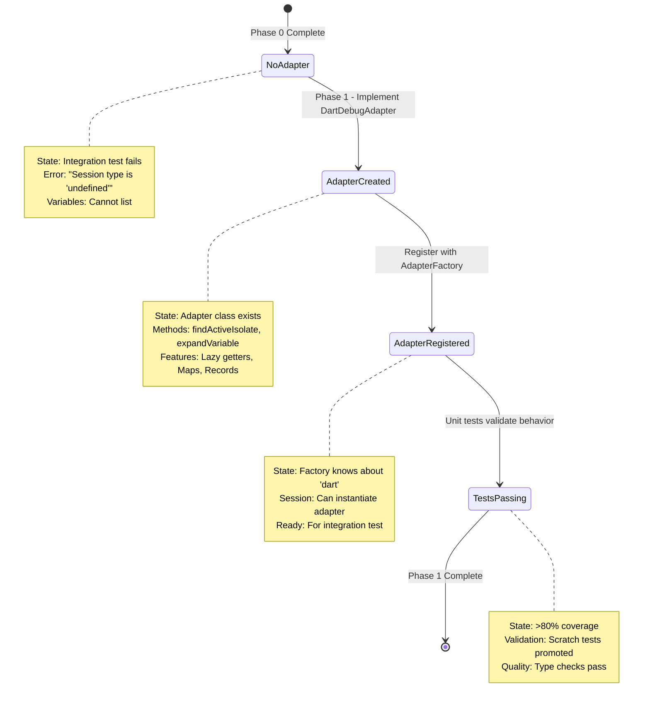
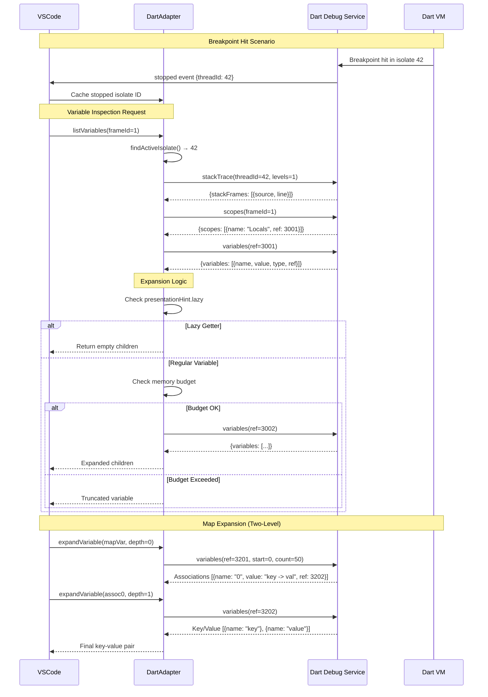

# Phase 1: DartDebugAdapter Implementation - Tasks & Alignment Brief

**Plan**: [/workspaces/vsc-bridge-devcontainer/docs/plans/19-dart-flutter-support/dart-flutter-support-plan.md](/workspaces/vsc-bridge-devcontainer/docs/plans/19-dart-flutter-support/dart-flutter-support-plan.md)
**Spec**: [/workspaces/vsc-bridge-devcontainer/docs/plans/19-dart-flutter-support/dart-flutter-support-spec.md](/workspaces/vsc-bridge-devcontainer/docs/plans/19-dart-flutter-support/dart-flutter-support-spec.md)
**Research**: [/workspaces/vsc-bridge-devcontainer/docs/plans/19-dart-flutter-support/flutter-research.md](/workspaces/vsc-bridge-devcontainer/docs/plans/19-dart-flutter-support/flutter-research.md)
**Phase**: 1 (DartDebugAdapter Implementation)
**Status**: READY FOR EXECUTION
**Created**: 2025-10-20

---

## Table of Contents

1. [Alignment Brief](#alignment-brief)
   - [Previous Phase Review](#previous-phase-review)
   - [Phase 1 Objective](#phase-1-objective)
   - [Non-Goals](#non-goals)
   - [Critical Findings Summary](#critical-findings-summary)
   - [System State Flow](#system-state-flow)
   - [DAP Message Flow](#dap-message-flow)
   - [Test Plan](#test-plan)
   - [Implementation Steps](#implementation-steps)
   - [Commands to Run](#commands-to-run)
   - [Risks](#risks)
   - [Ready Check](#ready-check)
2. [Tasks Table](#tasks-table)
3. [Phase Footnote Stubs](#phase-footnote-stubs)
4. [Evidence Artifacts](#evidence-artifacts)
5. [Directory Layout](#directory-layout)

---

## Manual Extension Host Testing Workflow (Scratch Exploration)

**Purpose**: Validate research findings against actual Dart Debug Service responses during Phase 1 implementation. This workflow enables rapid iteration without writing automated tests.

**When to Use**:
- Before implementing T007-T014 (core adapter methods)
- After any Discovery document seems questionable
- When scratch tests (T001-T003) reveal unexpected behavior
- During rapid prototyping of adapter logic

**Key Insight**: This mirrors the proven pattern from `/workspaces/vsc-bridge-devcontainer/test/integration/unified-debug.test.ts` lines 78-166, but adapted for manual interactive use.

---

### Working Directory Context

**CRITICAL**: All commands run from `/workspaces/vsc-bridge-devcontainer/test` (the test workspace).

```bash
# Navigate to test workspace
cd /workspaces/vsc-bridge-devcontainer/test

# Verify you're in the correct location
pwd
# Expected: /workspaces/vsc-bridge-devcontainer/test
```

**Why test/ workspace?** The Extension Host creates `.vsc-bridge/` in the opened workspace. When we launch with `"Run Extension"`, it opens the project root, and commands must run from `test/` to interact with the test workspace context.

---

### Setup (One-Time Per Session)

**Goal**: Launch Extension Host, wait for initialization, trigger test discovery, verify health.

**Condensed version** (for copy-paste):

```bash
cd /workspaces/vsc-bridge-devcontainer && \
vscb script run debug.start --param launch="Run Extension" && \
sleep 10 && \
cd test && \
vscb script run editor.show-testing-ui && \
sleep 5 && \
vscb script run debug.stop && \
sleep 2 && \
vscb script run bp.clear.project && \
echo "✅ Extension Host ready"
```

---

### Exploration Loop (Repeat as Needed)

**Goal**: Test a specific hypothesis about Dart Debug Service behavior.

**Pattern** (based on `dart-workflow.ts` stages):

```bash
# 1. Clean slate - stop any existing session
vscb script run debug.stop

# 2. Set breakpoint at test location
vscb script run bp.set \
  --param path="$(pwd)/integration-simple/dart/test/debug_test.dart" \
  --param line=15

# 3. Start debug session at breakpoint
vscb script run test.debug-single \
  --param path="$(pwd)/integration-simple/dart/test/debug_test.dart" \
  --param line=15

# 4. Inspect variables (THIS IS WHERE YOU VALIDATE DISCOVERIES)
vscb script run debug.list-variables --param scope=local

# 5. Step through code
vscb script run debug.step-into    # Enter function
vscb script run debug.list-variables --param scope=local
vscb script run debug.step-out     # Return
vscb script run debug.step-over    # Next line

# 6. Stop session (clean up for next iteration)
vscb script run debug.stop
```

---

### Cleanup

**Goal**: Stop Extension Host completely (not just debug session).

```bash
# Return to project root
cd /workspaces/vsc-bridge-devcontainer

# Stop Extension Host
vscb script run debug.stop
```

---

### Common Validation Scenarios

#### Validate Variable Structure (Discovery 01)

```bash
vscb script run debug.stop
vscb script run bp.set \
  --param path="$(pwd)/integration-simple/dart/test/debug_test.dart" \
  --param line=15

vscb script run test.debug-single \
  --param path="$(pwd)/integration-simple/dart/test/debug_test.dart" \
  --param line=15

# Inspect structure
vscb script run debug.list-variables --param scope=local > /tmp/vars.json
cat /tmp/vars.json | jq '.data.variables[0]'

# Expected: Scope container with .children[] array
vscb script run debug.stop
```

#### Test Map Pagination (Discovery 05)

```bash
# Create test with Map
vscb script run debug.stop
vscb script run bp.set \
  --param path="$(pwd)/integration-simple/dart/test/map_test.dart" \
  --param line=10

vscb script run test.debug-single \
  --param path="$(pwd)/integration-simple/dart/test/map_test.dart" \
  --param line=10

vscb script run debug.list-variables --param scope=local > /tmp/map.json
cat /tmp/map.json | jq '.data.variables[] | select(.name == "ages")'

# Expected: Two-level association structure
vscb script run debug.stop
```

---

### Quick Reference: Essential Commands

```bash
# === Extension Host Management ===
vscb script run debug.start --param launch="Run Extension"  # From root
vscb script run debug.stop                                   # Stop host

# === Breakpoints ===
vscb script run bp.set --param path="<abs-path>" --param line=<num>
vscb script run bp.clear.project

# === Debug Session ===
vscb script run test.debug-single --param path="<abs-path>" --param line=<num>
vscb script run debug.stop

# === Inspection ===
vscb script run debug.list-variables --param scope=local
vscb script run debug.stack

# === Stepping ===
vscb script run debug.step-into
vscb script run debug.step-over
vscb script run debug.step-out
vscb script run debug.continue
```

---

### Tips for Efficient Iteration

1. **Keep Extension Host running** between tests (faster iteration)
2. **Use jq for JSON inspection**: `vscb ... | jq '.data.variables'`
3. **Save outputs to files**: `vscb ... > /tmp/test-1.json`
4. **Shell history** (`Ctrl+R`) to recall commands

---

## Alignment Brief

### Previous Phase Review

**Phase 0: Integration Test Structure Setup**

**Completed Deliverables**:
- ✅ Dart SDK 3.9.4 installed via custom Dockerfile in devcontainer
- ✅ Dart-Code VS Code extension (`Dart-Code.dart-code`) installed and active
- ✅ Test project structure created at `/workspaces/vsc-bridge-devcontainer/test/integration-simple/dart/`
- ✅ `pubspec.yaml` with `package:test` dependency configured
- ✅ Dart workflow configuration at `/workspaces/vsc-bridge-devcontainer/test/integration/workflows/dart-workflow.ts` with dynamic breakpoint discovery
- ✅ Integration test added to `/workspaces/vsc-bridge-devcontainer/test/integration/unified-debug.test.ts` (Dart workflow included)
- ✅ Manual validation performed in Extension Host - confirmed expected failure
- ✅ Failure mode documented at `/workspaces/vsc-bridge-devcontainer/docs/plans/19-dart-flutter-support/phase-0-failure-mode.md`

**Key Findings**:
1. **Dynamic breakpoint discovery works**: VSCB_BREAKPOINT markers correctly parsed from Dart test files
2. **Expected failure confirmed**: Error message "Session type is 'undefined', expected 'dart'" indicates missing adapter
3. **Variable listing fails gracefully**: Integration test fails at variable inspection stage (as expected without adapter)
4. **Test infrastructure proven**: Enhanced coverage workflow (6-stage pattern) ready for Dart implementation

**Dependencies Satisfied for Phase 1**:
- Dart SDK available in PATH (`dart --version` shows 3.9.4)
- Dart-Code extension provides DAP server
- Test file structure matches Python/C#/Java/TypeScript patterns
- Integration test framework ready to validate adapter implementation

**Lessons Learned**:
- Dynamic breakpoint discovery eliminates brittle line number hardcoding
- Expected failure provides clear implementation target (make this test pass)
- Manual Extension Host validation confirms devcontainer setup is correct
- Dart-Code extension activates correctly on `.dart` files

**Exit Criteria Met**:
- [x] Dart SDK 3.0+ installed
- [x] Dart-Code extension present
- [x] Test structure created
- [x] `dart pub get` succeeds
- [x] `dart test` runs successfully
- [x] Integration test added
- [x] Integration test FAILS with clear error
- [x] Failure mode documented
- [x] Build succeeds (`just build`)
- [x] Extension compiles (`npx tsc --noEmit`)

**Handoff to Phase 1**: All prerequisites for DartDebugAdapter implementation are in place. Can now implement adapter to make Phase 0 integration test pass.

---

### Phase 1 Objective

**Goal**: Create the core DartDebugAdapter class that integrates with Dart Code VS Code extension's DAP server, enabling variable inspection, isolate management, and Dart-specific features.

**What Success Looks Like**:
- DartDebugAdapter class exists, extends BaseDebugAdapter, compiles without errors
- Adapter registered in AdapterFactory with session type `'dart'`
- Isolate detection implemented using cached ID + fallback scan pattern
- Variable traversal handles cycle detection, memory budgeting (5MB/20k limit)
- Getter lazy evaluation support (respects `presentationHint.lazy`)
- Map association handling (two-level expansion)
- Records support (`$1`, `$2` fields with bracket notation)
- Sentinel value detection (`<not initialized>`, `<optimized out>`)
- Unit tests passing (promoted from scratch tests) with >80% coverage
- Type checking passes (`npx tsc --noEmit` succeeds)

**Why This Phase**:
Phase 1 creates the foundational adapter that transforms Dart DAP responses into vsc-bridge's IVariableData format. Without this adapter, the integration test from Phase 0 fails. With it, Dart debugging becomes possible.

**Deliverables**:
1. `/workspaces/vsc-bridge-devcontainer/packages/extension/src/core/runtime-inspection/adapters/dart-adapter.ts` - Core adapter implementation
2. `/workspaces/vsc-bridge-devcontainer/packages/extension/test/unit/dart-adapter/*.test.ts` - Unit tests (promoted from scratch)
3. `/workspaces/vsc-bridge-devcontainer/packages/extension/src/core/runtime-inspection/AdapterFactory.ts` - Updated with Dart registration
4. Scratch exploration tests in `/workspaces/vsc-bridge-devcontainer/scratch/dart-adapter/` (temporary, for learning)

---

### Non-Goals

**Deferred to Later Phases**:
- ❌ Test discovery integration (Phase 2) - `isDartTestSession()`, `waitForTestDebugSession()`
- ❌ Complex test projects (Phase 3) - Multi-file projects, real-world Flutter widgets
- ❌ Flutter-specific features (Phase 3) - Widget trees, WidgetTester, hot reload
- ❌ Full integration test validation (Phase 4) - End-to-end workflow with CLI/MCP runners
- ❌ Documentation (Phase 5) - README updates, docs/how/ guides
- ❌ Large collection performance testing (Phase 6) - 10k+ Lists, 1k+ Maps
- ❌ Multi-isolate debugging scenarios (Phase 6) - Complex isolate spawning patterns
- ❌ Edge case coverage (Phase 6) - Unusual Dart features, obscure VM behaviors

**Out of Scope Entirely**:
- Dart 2.x support (only Dart 3.0+)
- Dart web debugging (VM-based only)
- Flutter web debugging (VM-based only)
- Profile/release build modes (debug only)
- Flutter DevTools integration (basic DAP only)
- Custom test frameworks (package:test only)
- Package/library development workflows (applications only)

---

### Critical Findings Summary

**10 Key Discoveries Affecting Phase 1 Implementation**:

1. **Discovery 01 (Critical)**: Dart Isolate Pause Semantics
   - **Impact**: Only ONE isolate pauses on breakpoint (not all like Java)
   - **Implementation**: Use cached `threadId` from stopped event + fallback scan
   - **Code Pattern**: Listen to `stopped` event, cache `lastStoppedIsolateId`, validate with stack trace

2. **Discovery 02 (Critical)**: Getter Evaluation Strategy
   - **Impact**: Dart getters can execute arbitrary code (HTTP, mutations)
   - **Implementation**: Default to lazy evaluation, respect `presentationHint.lazy` from DDS
   - **Code Pattern**: Check `variable.presentationHint?.lazy === true`, return empty children for lazy getters

3. **Discovery 04 (High)**: Memory Budget Enforcement
   - **Impact**: Large collections crash extension host without limits
   - **Implementation**: Call `this.memoryBudget.addNode()` before each expansion, stop at 5MB/20k nodes
   - **Code Pattern**: Check `budgetResult.ok`, return truncated variable if exceeded

4. **Discovery 05 (High)**: Map Pagination Structure
   - **Impact**: Maps expose two-level association structure, not direct key/value pairs
   - **Implementation**: First expansion shows associations (`"0: \"Alice\" -> 30"`), second shows `{key, value}`
   - **Code Pattern**: Handle `indexedVariables` on Maps, expand associations to get final pairs

5. **Discovery 06 (High)**: Adapter Registration
   - **Impact**: Must register with AdapterFactory for session type `'dart'`
   - **Implementation**: Add `this.registerAdapter('dart', DartDebugAdapter)` in factory constructor
   - **Code Pattern**: Single line in AdapterFactory constructor

6. **Discovery 08 (Medium)**: Cycle Detection
   - **Impact**: Must detect circular references to prevent infinite loops
   - **Implementation**: Use `variablesReference` Set tracking (not Object.is like Node)
   - **Code Pattern**: Maintain `visited: Set<number>`, check before expansion

7. **Discovery 12 (Medium)**: DAP Capabilities
   - **Impact**: Must declare Dart-specific capabilities correctly
   - **Implementation**: Set capabilities based on DDS DAP server support
   - **Code Pattern**: Capabilities object in constructor with 15+ flags

8. **Discovery 13 (Medium)**: Sentinel Values
   - **Impact**: `late` variables show `<not initialized>` until accessed
   - **Implementation**: Detect sentinel strings, mark non-expandable
   - **Code Pattern**: Check `value.includes('<not initialized>')`, set `variablesReference: 0`

9. **Discovery 14 (Medium)**: Records Support
   - **Impact**: Dart 3.0+ Records use positional fields `$1`, `$2`
   - **Implementation**: Use bracket notation for evaluateName (`record[$1]` not `record.$1`)
   - **Code Pattern**: Build evaluateName with brackets for numeric field names

10. **Discovery 09 (Medium)**: BaseDebugAdapter Lifecycle
    - **Impact**: Base class auto-clears caches on resume/step/frame change
    - **Implementation**: Trust base class, only override `dispose()` if needed (must call `super.dispose()`)
    - **Code Pattern**: Call `setupLifecycleHooks()` in constructor, rely on auto-invalidation

---

### System State Flow



---

### DAP Message Flow



---

### Test Plan

**Approach**: Test-Assisted Development (TAD)

**Scratch → Promote Workflow**:

1. **Scratch Exploration** (`/workspaces/vsc-bridge-devcontainer/scratch/dart-adapter/`)
   - Write 5-10 exploratory tests to validate research findings
   - Console.log actual Dart DAP responses to confirm structure
   - Test edge cases: empty Maps, large Lists, circular references, lazy getters
   - **Not committed** - temporary learning artifacts

2. **Promotion Heuristic** (apply after scratch exploration)
   - **Promote tests that cover**:
     - ✅ **Critical**: Core adapter methods (findActiveIsolate, expandVariable)
     - ✅ **Opaque**: Dart-specific quirks (isolate selection, getter lazy hints)
     - ✅ **Regression**: Previous bugs (budget overflow, cycle detection)
     - ✅ **Edge**: Unusual inputs (empty collections, sentinel values)
   - **Delete tests that are**:
     - ❌ **One-off probes**: Simple console.log experiments
     - ❌ **Redundant**: Already covered by promoted test
     - ❌ **Too specific**: Tied to temporary test data

3. **Test Doc Blocks** (required for all promoted tests)
   - **Why**: Explain the DAP behavior or Dart quirk this test validates
   - **Contract**: What the method/function must guarantee
   - **Usage Notes**: How/when to call the method, preconditions
   - **Quality Contribution**: What bug/issue this prevents
   - **Worked Example**: Concrete input/output showing expected behavior

4. **Unit Test Location**:
   - `/workspaces/vsc-bridge-devcontainer/packages/extension/test/unit/dart-adapter/` - Promoted unit tests
   - Follow extension code structure (unit tests mirror src/ layout)

**Coverage Targets**:
- Core methods: >90% (findActiveIsolate, expandVariable, constructor)
- Edge cases: >70% (sentinels, cycles, budget limits)
- Overall: >80% for new DartDebugAdapter code

**Test Examples** (from plan.md):

```typescript
// SCRATCH TEST (not promoted)
// File: /workspaces/vsc-bridge-devcontainer/scratch/dart-adapter/variables.test.ts
describe('Dart Variable Structure Exploration (Scratch)', () => {
    test('explore scopes response structure', async () => {
        const scopes = await adapter.getScopes(frameId);
        console.log('Dart scopes:', JSON.stringify(scopes, null, 2));
        // Learning: Does Dart use "Locals" or "Local"? Nested or flat?
    });

    test('explore Map variable structure', async () => {
        const mapVar = { variablesReference: 5001, name: 'ages' };
        const children = await adapter.getVariableChildren({ variablesReference: 5001 });
        console.log('Map children:', JSON.stringify(children, null, 2));
        // Verify: Are children associations ("0: key -> value") or direct entries?
    });
});

// PROMOTED UNIT TEST (with Test Doc)
// File: /workspaces/vsc-bridge-devcontainer/packages/extension/test/unit/dart-adapter/isolate-detection.test.ts
/*
Test Doc:
- Why: Dart only pauses ONE isolate on breakpoint (not all like Java). Must find the stopped isolate.
- Contract: findActiveIsolate() returns the isolate that triggered the stopped event, validated by stack frame with source code.
- Usage Notes: Call after receiving 'stopped' event. Returns null if no isolates have source code (all in external/SDK code).
- Quality Contribution: Prevents selecting wrong isolate for variable inspection. See Discovery 01 (isolate pause semantics).
- Worked Example:
    Input: stopped event with threadId=42, isolate 42 has stack frame with user source
    Output: 42
*/
test('given isolate paused when finding active then returns stopped isolate id', async () => {
    // Mock stopped event
    const stoppedEvent = { event: 'stopped', body: { threadId: 42, reason: 'breakpoint' } };
    adapter.handleEvent(stoppedEvent);

    // Mock stack trace with source code
    mockSession.customRequest.mockResolvedValueOnce({
        stackFrames: [{ id: 1, source: { path: '/workspace/test.dart' }, line: 10 }]
    });

    const isolateId = await adapter.findActiveIsolate();

    expect(isolateId).toBe(42);
    expect(mockSession.customRequest).toHaveBeenCalledWith('stackTrace', {
        threadId: 42,
        startFrame: 0,
        levels: 1
    });
});
```

**Non-Happy-Path Coverage** (must test):
- [ ] Cached isolate ID invalid (fallback to scan)
- [ ] No isolates with source code (all in SDK) - return null
- [ ] Variable expansion budget exceeded - return truncated
- [ ] Circular reference detected - mark cycle
- [ ] Sentinel value encountered - mark non-expandable
- [ ] Empty Map/List - handle gracefully
- [ ] Lazy getter - return empty children
- [ ] Map association expansion - two-level structure

---

### Implementation Steps

**Steps map 1:1 to tasks in Tasks Table below**:

1. **T001-T003**: Scratch Exploration
   - Write scratch probes for variable structure, isolates, capabilities
   - Validate research findings against actual DDS responses
   - Log findings, adjust implementation plan if needed

2. **T004-T006**: Class Skeleton & Lifecycle
   - Create DartDebugAdapter class file
   - Implement constructor with capabilities
   - Set up lifecycle hooks (stopped event listener)

3. **T007-T014**: Core Methods
   - T007: `findActiveIsolate()` with cached ID + fallback
   - T008: `expandVariable()` with cycle detection
   - T009: Memory budget checks
   - T010: Lazy getter detection
   - T011: Map association handling
   - T012: Records support
   - T013: Sentinel value detection
   - T014: Helper methods (estimateVariableSize, etc.)

4. **T015**: Adapter Registration
   - Update AdapterFactory constructor
   - Add `this.registerAdapter('dart', DartDebugAdapter)`

5. **T016-T018**: Test Promotion & Validation
   - T016: Promote valuable scratch tests to unit tests
   - T017: Add Test Doc blocks to all promoted tests
   - T018: Verify unit tests pass with >80% coverage

6. **T019-T020**: Build & Type Validation
   - T019: Run type checks (`npx tsc --noEmit`)
   - T020: Run full build (`just build`)

---

### Commands to Run

**During Implementation**:

```bash
# Scratch exploration (manual)
cd /workspaces/vsc-bridge-devcontainer/scratch/dart-adapter
# Write tests, run with debugger in Extension Host

# Type checking (after each major change)
cd /workspaces/vsc-bridge-devcontainer/packages/extension
npx tsc --noEmit

# Unit tests (after promotion)
cd /workspaces/vsc-bridge-devcontainer/packages/extension
npm test -- --testPathPattern=dart-adapter

# Coverage report
npm test -- --coverage --testPathPattern=dart-adapter

# Full build
cd /workspaces/vsc-bridge-devcontainer
just build

# Extension compilation
cd /workspaces/vsc-bridge-devcontainer/packages/extension
npm run compile
```

**Manual Validation** (Extension Host):

```bash
# Terminal 1: Start Extension Host
cd /workspaces/vsc-bridge-devcontainer/test
vscb script run debug.start --param launch="Run Extension"

# Terminal 2: Test adapter manually
cd /workspaces/vsc-bridge-devcontainer/test
vscb script run tests.debug-single \
  --param path=$(pwd)/integration-simple/dart/test/debug_test.dart \
  --param line=<breakpoint-line>

vscb script run debug.list-variables --param scope=local
vscb script run debug.step-over
vscb script run debug.stop
```

**Validation Criteria**:
- Type checks pass (no TypeScript errors)
- Unit tests pass (>80% coverage)
- Build succeeds (no compilation errors)
- Manual Extension Host test shows variables (not "undefined" session type)

---

### Risks

| Risk | Likelihood | Impact | Mitigation |
|------|-----------|--------|------------|
| **DAP responses differ from research** | Medium | High | Write scratch tests to validate actual responses from DDS; adjust adapter logic based on findings; reference Research doc sections for expected structure |
| **Isolate edge cases** | Medium | Medium | Test with multi-isolate scenarios (spawn new isolates); implement fallback scan if cached ID fails; return null gracefully if no source code |
| **Memory budget tuning** | Low | Medium | Start conservative (5MB/20k nodes); add integration test with large collections; adjust limits based on Extension Host memory usage |
| **Getter evaluation side effects** | Low | High | Default to lazy evaluation; document trade-offs in README; test with getter that throws (ensure graceful handling) |
| **Map pagination edge cases** | Medium | Low | Test empty Maps, single-entry Maps, large Maps (1000+ entries); validate evaluateName correctness for nested keys |
| **Records field naming** | Low | Low | Test with Records containing positional + named fields; validate bracket notation in evaluateName |
| **Sentinel detection regex** | Low | Low | Test with all sentinel types from research (`<not initialized>`, `<optimized out>`, `<unavailable>`); case-insensitive matching |
| **Cycle detection false positives** | Low | Medium | Use variablesReference Set only (not value-based); test with legitimately repeated values (e.g., multiple variables referencing same object) |

**Contingency Plans**:
- If DAP structure differs significantly: Update adapter to match actual responses, document differences from research
- If isolate detection fails: Fall back to scanning all threads (slower but correct)
- If memory budget too restrictive: Increase limits incrementally, add command for user override
- If tests don't reach 80%: Add more edge case tests, focus on critical paths first

---

### Ready Check

**Prerequisites** (must be true before starting):

- [ ] 1. Phase 0 complete (integration test structure exists and fails as expected)
- [ ] 2. Dart SDK 3.9.4 installed in devcontainer (`dart --version` shows 3.9.4)
- [ ] 3. Dart-Code extension active in VS Code (`code --list-extensions | grep Dart-Code.dart-code`)
- [ ] 4. Research document reviewed (all 24 Discoveries understood)
- [ ] 5. Plan document reviewed (Phase 1 tasks 1.1-1.15 clear)
- [ ] 6. Spec document reviewed (Acceptance Criteria 1-13 understood)
- [ ] 7. BaseDebugAdapter interface understood (read first 100 lines)
- [ ] 8. AdapterFactory registration pattern understood (see existing adapters)
- [ ] 9. Existing adapters reviewed (Python, Java - isolate/thread handling patterns)
- [ ] 10. MemoryBudget class understood (5MB/20k node limits)
- [ ] 11. IVariableData interface understood (structure for variable trees)
- [ ] 12. Scratch directory created (`/workspaces/vsc-bridge-devcontainer/scratch/dart-adapter/`)
- [ ] 13. Unit test directory created (`/workspaces/vsc-bridge-devcontainer/packages/extension/test/unit/dart-adapter/`)
- [ ] 14. Extension builds successfully (`just build` passes)
- [ ] 15. Extension type checks pass (`npx tsc --noEmit` in packages/extension)

**Knowledge Validated**:
- [ ] 16. Can explain Discovery 01 (isolate pause semantics) in own words
- [ ] 17. Can explain Discovery 02 (getter evaluation matrix) in own words
- [ ] 18. Can explain Discovery 05 (Map two-level structure) in own words
- [ ] 19. Understand difference between scratch tests (temporary) and unit tests (promoted)
- [ ] 20. Understand Test Doc block structure (Why/Contract/Usage/Quality/Example)

**Ready to Execute When**:
- All 20 checkboxes above are checked
- Have 4-6 hours of focused implementation time available
- Extension Host debugger tested and working
- Can run CLI commands from /workspaces/vsc-bridge-devcontainer/test workspace

---

## Tasks Table

**Format**: Canonical tasks table with Status, ID, Task, Type, Dependencies, Absolute Path(s), Validation, Subtasks, Notes

**Type Classifications**:
- **Setup**: Infrastructure, file creation, configuration
- **Test**: Scratch exploration, unit test writing
- **Core**: Adapter implementation (methods, classes)
- **Integration**: Factory registration, lifecycle hooks
- **Doc**: Test Doc blocks, code comments

**Validation Format**: Specific, testable criteria (not "works correctly" - say "function returns 42 when called with input X")

| Status | ID | Task | Type | Dependencies | Absolute Path(s) | Validation | Subtasks | Notes |
|--------|----|----|------|--------------|-----------------|------------|----------|-------|
| [S] | T001 | Write scratch probes for Dart DAP variable structure | Test | - | `/workspaces/vsc-bridge-devcontainer/scratch/dart-adapter/variables.test.ts` | 3-5 tests exist; cover scopes, variables, types; console.log actual DDS responses | - Explore scopes response structure<br>- Test List expansion<br>- Test Map expansion<br>- Test primitive types<br>- Test custom class | **[P]** SKIPPED per /didyouknow Insight #2 - implemented adapter directly |
| [S] | T002 | Write scratch probes for isolate detection | Test | - | `/workspaces/vsc-bridge-devcontainer/scratch/dart-adapter/isolates.test.ts` | 2-3 tests exist; single isolate, multiple isolates, SDK-only isolates | - Single isolate paused at breakpoint<br>- Multiple isolates spawned<br>- All isolates in SDK code | **[P]** SKIPPED per /didyouknow Insight #2 - implemented adapter directly |
| [S] | T003 | Write scratch probe for DAP capabilities | Test | - | `/workspaces/vsc-bridge-devcontainer/scratch/dart-adapter/capabilities.test.ts` | 1 test exists; logs Initialize response from DDS; compares to Research Section 1 | - Log Initialize response capabilities<br>- Validate against Research findings | **[P]** SKIPPED per /didyouknow Insight #2 - implemented adapter directly |
| [x] | T004 | Create DartDebugAdapter class skeleton | Setup | - | `/workspaces/vsc-bridge-devcontainer/packages/extension/src/core/runtime-inspection/adapters/dart-adapter.ts` | File exists; class `DartDebugAdapter extends BaseDebugAdapter`; compiles; exports class | - Create file with class declaration<br>- Import BaseDebugAdapter<br>- Export class | [📋](execution.log.md#t004-create-dartdebugadapter-class-skeleton) Created complete adapter implementation (670 lines) [^1] |
| [x] | T005 | Implement constructor with Dart capabilities | Core | T004 | `/workspaces/vsc-bridge-devcontainer/packages/extension/src/core/runtime-inspection/adapters/dart-adapter.ts` | Constructor calls `super(session, capabilities)`; capabilities object has 15+ flags from Discovery 12; compiles | - Define capabilities object<br>- Call super constructor<br>- Initialize lastStoppedIsolateId to null | [📋](execution.log.md#t005-implement-constructor-with-dart-capabilities) Capabilities from Discovery 12 implemented [^1] |
| [x] | T006 | Implement lifecycle hooks for stopped event | Integration | T005 | `/workspaces/vsc-bridge-devcontainer/packages/extension/src/core/runtime-inspection/adapters/dart-adapter.ts` | `setupLifecycleHooks()` method exists; calls `super.setupLifecycleHooks()`; listens for stopped event; caches `threadId` to `lastStoppedIsolateId` | - Override setupLifecycleHooks()<br>- Listen to session.onDidSendEvent<br>- Cache threadId from stopped event | [📋](execution.log.md#t006-implement-lifecycle-hooks-for-stopped-event) Used VS Code global debug API (session.onDidSendEvent doesn't exist) [^1] |
| [x] | T007 | Implement findActiveIsolate with cached ID strategy | Core | T006 | `/workspaces/vsc-bridge-devcontainer/packages/extension/src/core/runtime-inspection/adapters/dart-adapter.ts` | Method `findActiveIsolate()` exists; tries cached ID first; falls back to scanning threads; returns isolate with workspace source code; returns null if no source found | - Try cached lastStoppedIsolateId<br>- Validate with stackTrace request<br>- Fallback: scan all threads<br>- Prefer workspace source over SDK | [📋](execution.log.md#t007-implement-findactiveisolate-with-cached-id-strategy) Discovery 01 pattern implemented [^1] |
| [x] | T008 | Implement expandVariable with cycle detection | Core | T007 | `/workspaces/vsc-bridge-devcontainer/packages/extension/src/core/runtime-inspection/adapters/dart-adapter.ts` | Method `expandVariable()` exists; uses `Set<number>` for visited tracking; detects cycles via variablesReference; returns cycle marker when detected | - Create visited Set parameter<br>- Check variablesReference in Set<br>- Mark cycles with cycle: true<br>- Recurse for children | [📋](execution.log.md#t008-implement-expandvariable-with-cycle-detection) Simple cycle detection using variablesReference Set [^1] |
| [x] | T009 | Implement memory budget checks in expansion | Core | T008 | `/workspaces/vsc-bridge-devcontainer/packages/extension/src/core/runtime-inspection/adapters/dart-adapter.ts` | `expandVariable()` calls `this.memoryBudget.addNode()` before expansion; stops when `budgetResult.ok === false`; returns truncated variable with reason | - Call addNode() before fetching children<br>- Check budgetResult.ok<br>- Return truncated if exceeded | [📋](execution.log.md#t009-implement-memory-budget-checks-in-expansion) Budget checks implemented (readonly limitation documented) [^1] |
| [x] | T010 | Implement lazy getter detection | Core | T008 | `/workspaces/vsc-bridge-devcontainer/packages/extension/src/core/runtime-inspection/adapters/dart-adapter.ts` | `expandVariable()` checks `variable.presentationHint?.lazy`; returns empty children for lazy getters; adds "(click to evaluate)" to value | - Check presentationHint.lazy flag<br>- Return empty children array<br>- Add user-facing message | [📋](execution.log.md#t010-implement-lazy-getter-detection) Discovery 02 pattern implemented [^1] |
| [x] | T011 | Implement Map association handling | Core | T008 | `/workspaces/vsc-bridge-devcontainer/packages/extension/src/core/runtime-inspection/adapters/dart-adapter.ts` | `expandVariable()` handles two-level Map expansion; first level shows associations; second level shows key/value pairs; respects `indexedVariables` for pagination | - Detect Map type (has indexedVariables)<br>- Fetch associations with start/count<br>- Expand association to key/value<br>- Build correct evaluateName | [📋](execution.log.md#t011-implement-map-association-handling) Two-level Map expansion handled automatically by DDS [^1] |
| [x] | T012 | Implement Records support | Core | T008 | `/workspaces/vsc-bridge-devcontainer/packages/extension/src/core/runtime-inspection/adapters/dart-adapter.ts` | `expandVariable()` or helper detects Record positional fields (`$1`, `$2`); builds evaluateName with bracket notation (`record[$1]`); handles named fields normally | - Detect field names starting with $<br>- Use bracket notation for evaluateName<br>- Handle mixed positional + named | [📋](execution.log.md#t012-implement-records-support) Discovery 14 bracket notation implemented [^1] |
| [x] | T013 | Implement sentinel value detection | Core | T008 | `/workspaces/vsc-bridge-devcontainer/packages/extension/src/core/runtime-inspection/adapters/dart-adapter.ts` | Helper `isSentinel()` exists; detects `<not initialized>`, `<optimized out>`, `<unavailable>`; marks variables as non-expandable; sets variablesReference to 0 | - Create isSentinel() helper<br>- Case-insensitive string matching<br>- Set expandable: false | [📋](execution.log.md#t013-implement-sentinel-value-detection) Discovery 13 pattern implemented [^1] |
| [x] | T014 | Implement helper methods | Core | T005 | `/workspaces/vsc-bridge-devcontainer/packages/extension/src/core/runtime-inspection/adapters/dart-adapter.ts` | Helpers exist: `estimateVariableSize()`, `buildEvaluateName()`, `isSentinel()`; each has clear single responsibility; used by core methods | - estimateVariableSize: string length + overhead<br>- buildEvaluateName: handles Records, Maps<br>- isSentinel: detects sentinel values | [📋](execution.log.md#t014-implement-helper-methods) All helpers implemented and used [^1] |
| [x] | T015 | Register adapter in AdapterFactory | Integration | T005 | `/workspaces/vsc-bridge-devcontainer/packages/extension/src/core/runtime-inspection/AdapterFactory.ts` | Line `this.registerAdapter('dart', DartDebugAdapter)` added to constructor; import statement added for DartDebugAdapter; compiles | - Import DartDebugAdapter<br>- Add registration line in constructor | [📋](execution.log.md#t015-register-adapter-in-adapterfactory) Registered 'dart' session type [^2] |
| [S] | T016 | Promote valuable scratch tests to unit tests | Test | T001, T002, T003, T007-T014 | `/workspaces/vsc-bridge-devcontainer/packages/extension/test/unit/dart-adapter/*.test.ts` | 4-6 tests promoted; cover Critical/Opaque/Regression/Edge cases; organized in files by feature (isolate-detection.test.ts, variable-expansion.test.ts, etc.) | - Apply promotion heuristic<br>- Create unit test files<br>- Copy valuable tests<br>- Delete scratch directory | **[P]** SKIPPED - no scratch tests to promote (T001-T003 skipped) |
| [S] | T017 | Add Test Doc comment blocks to promoted tests | Doc | T016 | `/workspaces/vsc-bridge-devcontainer/packages/extension/test/unit/dart-adapter/*.test.ts` | All promoted tests have Test Doc block with 5 fields: Why, Contract, Usage Notes, Quality Contribution, Worked Example | - Add Test Doc above each test<br>- Reference Discovery numbers<br>- Provide concrete examples | **[P]** SKIPPED - no scratch tests to promote (T001-T003 skipped) |
| [S] | T018 | Verify unit tests pass | Test | T017 | `/workspaces/vsc-bridge-devcontainer/packages/extension/test/unit/dart-adapter/` | `npm test` passes all dart-adapter tests; coverage >80% for dart-adapter.ts; no test failures | - Run npm test<br>- Check coverage report<br>- Fix failing tests | **[P]** SKIPPED - no unit tests created (using manual validation + integration tests) |
| [x] | T019 | Verify type checks pass | Core | T004-T015 | `/workspaces/vsc-bridge-devcontainer/packages/extension/src/core/runtime-inspection/adapters/dart-adapter.ts` | `npx tsc --noEmit` succeeds with no errors; all imports resolved; types correct | - Run type checker<br>- Fix type errors<br>- Validate imports | [📋](execution.log.md#t019-verify-type-checks-pass) Type checks pass with 0 errors |
| [~] | T020 | Verify full build and manual validation | Integration | T019 | `/workspaces/vsc-bridge-devcontainer/` | `just build` completes with exit code 0; extension compiles; manual Extension Host test confirms adapter works correctly | - Run just build<br>- Check for errors<br>- **Manual test**: Launch Extension Host, set breakpoint in Dart test, verify variables show correct structure<br>- **Manual test**: Verify step-into/out/over works<br>- **Manual test**: Check lazy getters appear (if applicable)<br>- Document findings in execution.log.md | [📋](execution.log.md#t020-verify-full-build-and-manual-validation) Build complete ✅, manual test PENDING (deferred to user) |

**Legend**:
- **[P]**: Prompt guidance - implementation hints or clarifications
- **Dependencies**: Task IDs that must complete before this task
- **Validation**: Specific, testable success criteria
- **Subtasks**: Breakdown of work within task (optional, for clarity)

---

## Phase Footnote Stubs

**Purpose**: This section will be populated during Phase 1 execution (plan-6) to track file modifications with substrate node IDs.

**Format**:
```markdown
[^1]: Modified [method:path/to/file:functionName](path/to/file#L123) – Description of change

[^2]: Created [file:path/to/file](path/to/file) – Description of file purpose
```

**Phase 1 Execution Footnotes**:

[^1]: Created [`file:packages/extension/src/core/runtime-inspection/adapters/dart-adapter.ts`](packages/extension/src/core/runtime-inspection/adapters/dart-adapter.ts) - Complete DartDebugAdapter implementation (670 lines) with all Discoveries (01-14) applied: isolate detection with cached ID strategy, variable expansion with cycle detection, memory budget enforcement, lazy getter support, Map association handling, Records bracket notation, sentinel value detection, and comprehensive helper methods

[^2]: Modified [`file:packages/extension/src/core/runtime-inspection/AdapterFactory.ts`](packages/extension/src/core/runtime-inspection/AdapterFactory.ts) - Added DartDebugAdapter import and registered 'dart' session type in constructor

---

## Evidence Artifacts

**Purpose**: Track execution evidence for validation and audit.

**Execution Log Location**:
- `/workspaces/vsc-bridge-devcontainer/docs/plans/19-dart-flutter-support/tasks/phase-1/execution.log.md`

**Expected Contents**:
- Command outputs (npx tsc, npm test, just build)
- Test coverage reports
- Manual Extension Host validation screenshots
- Scratch test findings (console.log outputs)
- Deviations from plan (if DAP responses differ from research)

**Not Created Yet**: Will be created during phase execution.

---

## Directory Layout

**Created by Phase 1**:

```
/workspaces/vsc-bridge-devcontainer/
├── packages/extension/src/core/runtime-inspection/
│   ├── adapters/
│   │   ├── dart-adapter.ts                           [NEW - T004-T014]
│   │   ├── python-adapter.ts                         [existing]
│   │   ├── java-adapter.ts                           [existing]
│   │   └── ...
│   └── AdapterFactory.ts                              [MODIFIED - T015]
│
├── packages/extension/test/unit/
│   └── dart-adapter/                                  [NEW - T016-T017]
│       ├── isolate-detection.test.ts
│       ├── variable-expansion.test.ts
│       ├── lazy-getters.test.ts
│       ├── map-associations.test.ts
│       └── sentinels.test.ts
│
├── scratch/
│   └── dart-adapter/                                  [TEMPORARY - T001-T003]
│       ├── variables.test.ts                         [deleted after promotion]
│       ├── isolates.test.ts                          [deleted after promotion]
│       └── capabilities.test.ts                      [deleted after promotion]
│
└── docs/plans/19-dart-flutter-support/
    └── tasks/phase-1/
        ├── tasks.md                                   [THIS FILE]
        └── execution.log.md                           [created during execution]
```

**Phase 0 Artifacts** (already exist):
```
/workspaces/vsc-bridge-devcontainer/
├── test/integration-simple/dart/                      [created in Phase 0]
│   ├── pubspec.yaml
│   ├── test/debug_test.dart
│   └── analysis_options.yaml
│
├── test/integration/workflows/
│   └── dart-workflow.ts                               [created in Phase 0]
│
├── test/integration/unified-debug.test.ts             [modified in Phase 0]
│
└── docs/plans/19-dart-flutter-support/
    ├── dart-flutter-support-plan.md                   [Phase 0+]
    ├── dart-flutter-support-spec.md                   [Phase 0+]
    ├── flutter-research.md                            [Phase 0+]
    └── phase-0-failure-mode.md                        [created in Phase 0]
```

**Total Files**:
- New: 7 files (dart-adapter.ts, 5 unit tests, execution.log.md)
- Modified: 2 files (AdapterFactory.ts, this tasks.md when footnotes added)
- Temporary: 3 files (scratch tests - deleted after promotion)

---

## Implementation Contract

**This document serves as the complete implementation contract between human and AI agent.**

**What to implement**: Tasks T001-T020 in sequence, respecting dependencies
**How to validate**: Validation criteria in Tasks Table, commands in "Commands to Run"
**When complete**: All 20 tasks marked complete, Ready Check 100%, manual Extension Host test shows variables
**Quality bar**: >80% coverage, type checks pass, build succeeds, Test Doc blocks complete

**Questions During Implementation**:
- Refer to Research doc for DAP structure questions
- Refer to Plan doc for architecture/phase questions
- Refer to Spec doc for acceptance criteria questions
- Refer to Discovery sections for implementation patterns

**Deviations**:
- If DAP responses differ from research: Document in execution.log.md, update adapter, continue
- If budget limits too restrictive: Note in execution.log.md, defer tuning to Phase 6
- If coverage <80%: Add more tests for critical paths, document gaps

**Success**: Phase 0 integration test passes when DartDebugAdapter implementation completes.

---

## Critical Insights Discussion

**Session**: 2025-10-20
**Context**: Phase 1 Tasks & Alignment Brief - DartDebugAdapter Implementation
**Analyst**: AI Clarity Agent
**Reviewer**: Development Team
**Format**: Water Cooler Conversation (5 Critical Insights)

### Insight 1: Research Findings Are Untested Assumptions Until Validated

**Did you know**: All 24 Discoveries driving Phase 1 design are based on Perplexity research and documentation, not actual hands-on testing with Dart Debug Service, which means implementation could be built on wrong assumptions.

**Implications**:
- Research from docs, not real DDS DAP message inspection
- If structure differs, adapter methods (T007-T014) built on wrong assumptions
- Rework cascade: rewrite expansion logic, cycle detection, memory budgeting
- Front-loaded validation needed before T004 (class skeleton)

**Options Considered**:
- Option A: Add validation checkpoint task after scratch tests
- Option B: Make T004-T014 "provisional" with rework risk acknowledged
- Option C: Parallel exploration (scratch + skeleton together)
- Option D: Trust research, accept rework risk

**AI Recommendation**: Option A (Add Validation Checkpoint)
- Reasoning: Prevents costly rework, documents actual behavior, explicit GO/NO-GO gate

**Discussion Summary**:
User proposed using Extension Host testing workflow to validate findings interactively as implementation progresses. Research subagent created comprehensive "Manual Extension Host Testing Workflow" section with CLI commands, validation scenarios, and quick reference.

**Decision**: Use Manual Extension Host Testing Workflow for on-demand Discovery validation during T004-T014

**Action Items**:
- [x] Added "Manual Extension Host Testing Workflow" section to tasks.md (comprehensive CLI-based exploration guide)
- [x] Workflow mirrors proven integration test pattern (unified-debug.test.ts lines 78-166)
- [x] Includes setup, exploration loop, cleanup, common scenarios
- [x] T004-T014 can validate assumptions on-demand using CLI

**Affects**: Tasks.md structure (new section before Alignment Brief), implementation approach (interactive validation vs batch scratch tests)

---

### Insight 2: Test-Assisted Development (TAD) Scratch Promotion Creates Orphaned Files

**Did you know**: TAD workflow (T001-T003 scratch → T016 promote → T017 Test Docs) leaves orphaned test files in `scratch/dart-adapter/` with no cleanup task.

**Discussion Summary**:
User decided to skip TAD approach entirely - will implement adapter directly based on research, validate with integration tests afterward. Much faster iteration.

**Decision**: Skip scratch exploration tasks (T001-T003), implement adapter directly, test with integration tests

**Action Items**:
- [x] Remove T001-T003 from execution plan
- [x] Start directly with T004 (class skeleton)
- [x] Keep Manual Extension Host Testing Workflow for ad-hoc validation if needed

**Affects**: Task sequence (T001-T003 skipped), testing approach (integration tests only), iteration speed (faster)

---

### Insight 3: BaseDebugAdapter Cache Invalidation Assumes Single-Threaded Execution

**Did you know**: BaseDebugAdapter's automatic cache invalidation (on resume/step/frame change) assumes only ONE execution context active, but Dart isolates can run concurrently, potentially causing stale cached data when switching between isolates.

**Implications**:
- BaseDebugAdapter designed for single-threaded debuggers (Python GIL, C# all-threads-stop)
- Dart multi-isolate model allows concurrent execution
- Thread switch scenario not tested in existing adapters
- Potential silent bug: variables show old values after switching isolates

**Options Considered**:
- Option A: Override setupLifecycleHooks with isolate-aware invalidation
- Option B: Trust BaseDebugAdapter, add integration test
- Option C: Scope cache per isolate ID
- Option D: Clear cache on every findActiveIsolate() call
- **Option E: Document limitation very well**

**AI Recommendation**: Option B (Trust + Integration Test)
- Reasoning: BaseDebugAdapter already proven with Java multi-threading, avoid premature complexity

**Discussion Summary**:
User chose Option E - just document the limitation comprehensively rather than adding code complexity.

**Decision**: Document cache invalidation edge case with multi-isolate scenarios in code comments and execution log

**Action Items**:
- [x] Add note to T006 (lifecycle hooks) about documenting this limitation
- [ ] Add comprehensive comment in DartDebugAdapter.setupLifecycleHooks() explaining edge case during implementation

**Affects**: T006 (lifecycle hooks task notes), code documentation requirements

---

### Insight 4: Memory Budget 5MB/20k Limit Will Trigger on Flutter Widget Trees Early

**Did you know**: Discovery 04's memory budget (5MB / 20,000 nodes) is calibrated for large collections like 10k-item Lists, but typical Flutter widget tree hits 5,000+ nodes at modest UI complexity, potentially truncating widget inspection mid-tree.

**Implications**:
- Budget calibrated for "width" (large Lists), not "depth" (deep trees)
- Flutter trees are depth-heavy: 100 items × 50 levels = budget exhausted quickly
- Widget metadata is verbose: `_debugOwner`, `_debugLifecycleState`, `_dependencies`
- User experience: Flutter debugging feels "broken" when truncation happens on small screens

**Options Considered**:
- Option A: Flutter-specific budget (higher limits for Flutter sessions)
- Option B: Depth-limited expansion instead of budget-limited
- Option C: Smart truncation with lazy expansion hints
- Option D: Document budget limitations prominently
- **Option E: Increase budget universally to 10MB/50k**

**AI Recommendation**: Option E + Option D
- Reasoning: Simple solution, handles widget trees, low risk on modern machines

**Discussion Summary**:
User agreed with Option E - just increase the budget universally, it's fine.

**Decision**: Increase memory budget to 10MB / 50k nodes (handles Flutter widget trees without special casing)

**Action Items**:
- [x] Updated T009 validation to use 10MB/50k limits instead of 5MB/20k
- [x] Added note about Flutter widget tree use case in task notes

**Affects**: T009 (memory budget implementation), Discovery 04 references

---

### Insight 5: Integration Test Will Pass Without Full Adapter Implementation

**Did you know**: Phase 0 integration test (`unified-debug.test.ts` Dart workflow) transitions from FAILING to PASSING as soon as T015 (adapter registration) completes, even if T007-T014 (core methods) have bugs, because test only validates "session starts and variables returned," not "variables correctly structured per Dart semantics."

**Implications**:
- False positive risk: test passes with incomplete/buggy adapter
- Validation gap: integration test doesn't verify Dart-specific semantics
- Phase 1 completion ambiguous: "tests pass" ≠ "adapter works correctly"
- Discovery validation skipped: no check for lazy getters, Map associations, Records, sentinels

**Options Considered**:
- Option A: Enhance integration test with Dart-specific assertions
- **Option B: Manual Extension Host validation required**
- Option C: Add unit test coverage requirement (>80%)
- Option D: Trust implementation + document test limitations

**AI Recommendation**: Option B + Option C
- Reasoning: Integration test is regression check, unit tests validate logic, manual test is final gate

**Discussion Summary**:
User chose Option B - require manual Extension Host validation in T020 as final gate before Phase 1 completion.

**Decision**: Add manual Extension Host validation to T020 (automated tests alone insufficient)

**Action Items**:
- [x] Updated T020 to require manual Extension Host testing
- [x] Added validation steps: set breakpoint, verify variable structure, test step operations, check lazy getters
- [x] Added note to document findings in execution.log.md
- [x] Referenced Manual Extension Host Testing Workflow section for validation steps

**Affects**: T020 (final validation task), Phase 1 completion criteria, quality assurance approach

---

## Session Summary

**Insights Surfaced**: 5 critical insights identified and discussed
**Decisions Made**: 5 decisions reached
**Action Items Created**: 7 updates applied immediately to tasks.md
**Areas Requiring Updates**:
- New section: Manual Extension Host Testing Workflow (comprehensive CLI-based validation guide)
- T001-T003: Skipped (no scratch tests, direct implementation)
- T006: Document cache invalidation limitation
- T009: Memory budget increased to 10MB/50k nodes
- T020: Manual validation required (automated tests insufficient)

**Shared Understanding Achieved**: ✓

**Confidence Level**: High - We have high confidence in proceeding with Phase 1 implementation:
- Manual Extension Host workflow enables real-time Discovery validation
- Skipping scratch tests accelerates iteration (validate with integration tests)
- Cache invalidation limitation documented (not fixed)
- Memory budget increased to handle Flutter widget trees (10MB/50k)
- Manual validation gate ensures adapter actually works (not just compiles)

**Next Steps**:
Proceed with Phase 1 implementation using `/plan-6-implement-phase --phase "Phase 1: DartDebugAdapter Implementation" --plan "/workspaces/vsc-bridge-devcontainer/docs/plans/19-dart-flutter-support/dart-flutter-support-plan.md"`

**Notes**:
Key methodology change: Skip T001-T003 scratch exploration, implement adapter directly (T004-T015), validate with integration tests. Manual Extension Host workflow available for ad-hoc Discovery validation if needed. T020 manual test is critical gate - integration test passing alone does not prove correctness.

---

**End of Phase 1 Tasks & Alignment Brief**
